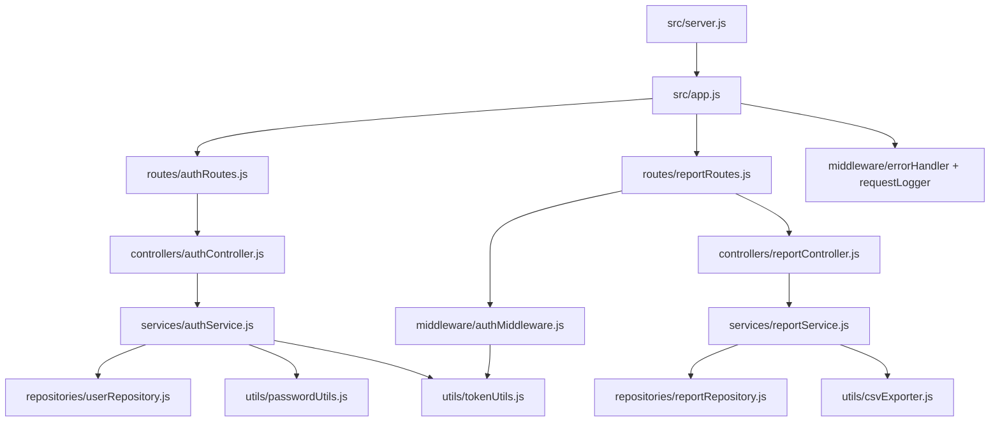
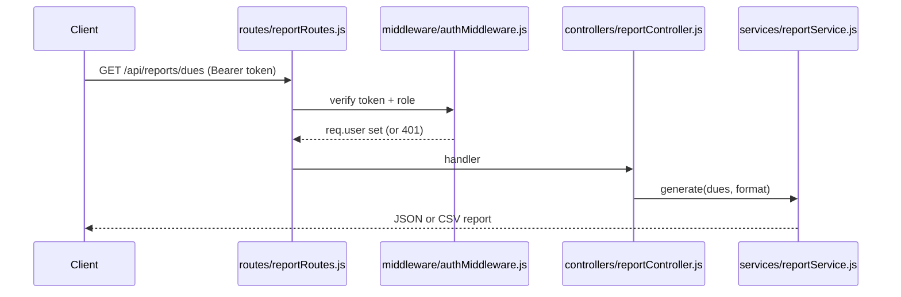

# Technical Specification

# 0. Agent Action Plan

## 0.1 Intent Clarification

This Agent Action Plan is the authoritative interpretation layer between the user's request and the concrete engineering work the Blitzy platform will perform on the **Society Management** repository. The target codebase is a layered Node.js scaffold delivered inside `society_mgmt_300k.zip` whose root contains only a placeholder README and the archive itself [README.md:L1-L2]. Every interpretation below is grounded **solely** in the contents of that scaffold.

### 0.1.1 Core Feature Objective

Based on the prompt, the Blitzy platform understands that the new feature requirement is to **introduce two first-class capabilities — Login (authentication) and Reporting — into the Society Management application, while guaranteeing that existing functionality continues to work unchanged.**

The verbatim user request is preserved exactly as provided:

> User Prompt (verbatim): "do add the feature to enahnce the login and reporting. Ensure while adding this feature do ensure the functionality is not impacted."

Restated with technical precision, each requirement is:

- **Requirement 1 — Login capability.** Provide credential-based authentication for Society Management users (administrators and members), including secure password storage and a session mechanism that protects privileged endpoints.
- **Requirement 2 — Reporting capability.** Provide the ability to generate Society Management domain reports (for example member directories and maintenance-dues summaries) and return them in machine-readable formats.
- **Requirement 3 — Non-regression.** Adding the above must not alter, break, or otherwise impact any behavior that already exists in the repository.

A decisive discovery shapes the entire plan: an exhaustive scan of the codebase found **no pre-existing login or reporting implementation of any kind** — the tokens `login`, `auth`, `report`, `password`, `token`, `session`, `user`, `role`, and `jwt` each appear in zero source files, and there is likewise no module wiring (`require(`, `module.exports`), no web framework, and no HTTP entry point anywhere in the scaffold [src/controllers/file_0.js:L1-L3]. Every `.js` file is uniform synthetic filler: a header comment, an empty `const store = [];`, and ~1,200 identical arithmetic functions [src/controllers/file_0.js:L1-L3].

Because there is nothing to "enhance" in the literal sense, the platform faithfully resolves the word **"enhance" to mean "create and harden these capabilities from the ground up"** within the layered structure the repository was clearly built to hold (controllers, services, models, routes, repositories, domain, middleware, config, utils, plus unit and integration test folders) [src/controllers/file_0.js:L1, src/services/file_1.js:L1]. This reading is consistent with the single user-specified rule, "create new feature."

**Implicit requirements surfaced** (not stated by the user but mandatory for a working feature):

- An HTTP server entry point (an Express application plus a bootstrap file) must be created, because none exists today [src/controllers/file_0.js:L1-L3].
- A `package.json` must be created to declare dependencies and run scripts, because the repository has none [README.md:L1-L2].
- CommonJS module wiring (`require`/`module.exports`) must be introduced for the new feature only, since the existing modules export nothing [src/controllers/file_0.js:L1-L3].
- A minimal data layer is required; new repositories will use an in-memory store, mirroring the repository's existing `const store = [];` idiom [src/controllers/file_0.js:L2], structured to allow a real database later.
- Configuration for secrets and token lifetime must be sourced from the environment with a committed example file.

**Feature dependency / prerequisite ordering:** Reporting depends on Login. Report endpoints must be access-controlled and therefore reuse the authentication middleware produced by the Login feature; Login must exist for Reporting to be secured.

### 0.1.2 Special Instructions and Constraints

- **CRITICAL — Non-regression mandate.** The instruction "ensure the functionality is not impacted" is interpreted as a strict **additive-only** constraint: no existing `file_*.js`, `src/utils/filler.js`, or `LICENSE/LICENSE.txt` may be modified, renamed, moved, or deleted; their internals remain byte-for-byte identical [src/utils/filler.js:L1, LICENSE/LICENSE.txt:L1].
- **Architectural requirement — follow repository conventions.** New code is placed in the **existing layer folders** (`src/controllers`, `src/services`, `src/models`, `src/routes`, `src/repositories`, `src/domain`, `src/middleware`, `src/config`, `src/utils`) so the feature obeys the scaffold's layered architecture [src/controllers/file_0.js:L1, src/repositories/file_7.js:L1]. Because the existing positional naming scheme (`file_<N>.js`) cannot express real features, new files adopt descriptive semantic names (e.g., `authController.js`); this is an additive convention extension, not a change to existing files.
- **User-provided examples.** None. The user supplied no code samples, payload examples, or reference files to preserve.
- **Web search requirements.** Research was required to obtain valid, current (non-placeholder) versions of any third-party packages the feature introduces, and to confirm Node.js authentication and reporting best practices. This research was conducted and is summarized in section 0.2.3 and applied in 0.3.

### 0.1.3 Technical Interpretation

These feature requirements translate to the following technical implementation strategy, expressed as direct requirement-to-action mappings:

- To **deliver the Login capability**, we will *create* a vertical authentication slice across every layer — route, controller, service, repository, model, domain, config, and reusable middleware — using secure password hashing and stateless signed tokens.
- To **deliver the Reporting capability**, we will *create* a vertical reporting slice across the same layers that aggregates domain data and serializes it to JSON and CSV, with every endpoint guarded by the Login middleware.
- To **make the feature runnable without disturbing existing code**, we will *create* a composition root (`src/app.js`) and bootstrap (`src/server.js`) plus a `package.json`, wiring **only** the new modules together and leaving the existing filler modules entirely standalone.
- To **guarantee non-regression**, we will *add* files exclusively and *update* only the repository README for documentation, validating that a diff shows existing files as unchanged.

The table below maps each requirement to the primary technical artifacts it produces (full file inventory in 0.5.1):

| Requirement | Technical Action | Primary New Artifacts |
|-------------|------------------|-----------------------|
| Login (authentication) | Create authentication vertical + reusable guard | `src/routes/authRoutes.js`, `src/controllers/authController.js`, `src/services/authService.js`, `src/middleware/authMiddleware.js`, `src/utils/passwordUtils.js`, `src/utils/tokenUtils.js` |
| Reporting | Create reporting vertical + exporters, protected by auth | `src/routes/reportRoutes.js`, `src/controllers/reportController.js`, `src/services/reportService.js`, `src/utils/csvExporter.js` |
| Runnable, wired app | Create composition root + manifest | `src/app.js`, `src/server.js`, `package.json`, `.env.example` |
| Non-regression | Additive-only changes; docs update only | New files + `README.md` (update) |


## 0.2 Repository Scope Discovery

This section catalogs the relevant repository structure, the integration points the new feature must attach to, the external research conducted, and the complete set of new files the feature requires.

### 0.2.1 Comprehensive File Analysis

The Society Management source tree is delivered inside `society_mgmt_300k.zip` and follows a conventional layered Node.js layout. The directory map below was confirmed by inspecting representative files in every layer; all `.js` files share one synthetic "society module" shape (header comment, `const store = [];`, then ~1,200 `mod_N_M(x)` arithmetic functions) and each spans ~10,802 lines [src/controllers/file_0.js:L1-L3, src/services/file_1.js:L1-L3].

| Layer / Path | Existing Files (representative) | Existing Role | Relevance to Feature |
|--------------|---------------------------------|---------------|----------------------|
| `src/controllers/` | `file_0.js`, `file_11.js`, `file_22.js` | Filler "society module" [src/controllers/file_0.js:L1] | Host folder for new `authController.js`, `reportController.js` |
| `src/services/` | `file_1.js`, `file_12.js`, `file_23.js` | Filler [src/services/file_1.js:L1] | Host folder for new `authService.js`, `reportService.js` |
| `src/models/` | `file_2.js`, `file_13.js`, `file_24.js` | Filler [src/models/file_2.js:L1] | Host folder for new `userModel.js`, `reportModel.js` |
| `src/routes/` | `file_3.js`, `file_14.js`, `file_25.js` | Filler [src/routes/file_3.js:L1] | Host folder for new `authRoutes.js`, `reportRoutes.js` |
| `src/repositories/` | `file_7.js`, `file_18.js` | Filler [src/repositories/file_7.js:L1] | Host folder for new `userRepository.js`, `reportRepository.js` |
| `src/domain/` | `file_8.js`, `file_19.js` | Filler [src/domain/file_8.js:L1] | Host folder for new `user.js`, `report.js` |
| `src/middleware/` | `file_5.js`, `file_16.js`, `file_27.js` | Filler [src/middleware/file_5.js:L1] | Host folder for new `authMiddleware.js`, `errorHandler.js`, `requestLogger.js` |
| `src/config/` | `file_6.js`, `file_17.js` | Filler [src/config/file_6.js:L1] | Host folder for new `index.js`, `authConfig.js` |
| `src/utils/` | `file_4.js`, `file_15.js`, `file_26.js`, `filler.js` | Filler; `filler.js` is pure padding [src/utils/filler.js:L1] | Host folder for new `passwordUtils.js`, `tokenUtils.js`, `csvExporter.js`, `logger.js`, `validation.js` |
| `tests/unit/` | `file_9.js`, `file_20.js` | Non-functional filler (no test framework constructs) [tests/unit/file_9.js:L1] | Host folder for new unit tests |
| `tests/integration/` | `file_10.js`, `file_21.js` | Non-functional filler [tests/integration/file_10.js:L1] | Host folder for new integration tests |
| `LICENSE/LICENSE.txt` | MIT license, "Copyright (c) 2026" | License text [LICENSE/LICENSE.txt:L1] | Out of scope; unchanged |
| `README.md` (repo root) | Placeholder description [README.md:L1-L2] | Project readme | Update only (documentation) |

Key structural findings that drive scope:

- There is **no `package.json`, no entry point (`app.js`/`index.js`/`server.js`), no real configuration file, and no `.env`** anywhere in the tree [src/config/file_6.js:L1-L3]. These must all be created for the feature to run.
- The existing modules are **standalone**: they neither import nor export anything, so there is no existing wiring to integrate with and no risk of breaking call graphs when adding new modules [src/controllers/file_0.js:L1-L3].
- No `.blitzyignore` file is present in the repository, so no path-exclusion patterns constrain this work.

### 0.2.2 Integration Point Discovery

Because the scaffold contains no runtime wiring, the feature's integration points are the new seams it must establish rather than existing call sites it must edit. They are:

- **HTTP composition root** — a new `src/app.js` is the single place where the Express application is assembled and where the authentication and reporting routers plus shared middleware are mounted. This is the **primary integration point**.
- **API endpoint surface** — new routers register the feature's endpoints under `/api/auth/*` and `/api/reports/*`.
- **Cross-feature guard** — the reporting router consumes the authentication middleware (`src/middleware/authMiddleware.js`), realizing the Reporting-depends-on-Login prerequisite.
- **Data layer** — new repositories seed and read an in-memory store, following the existing `const store = [];` idiom [src/repositories/file_7.js:L2].
- **Configuration** — a new config loader reads secrets and token lifetime from the environment.

The following diagram shows the new module relationships; every node is a net-new file and no arrow touches an existing filler module:



### 0.2.3 Web Search Research Conducted

External research was performed to ground dependency selection and implementation patterns in current, verified facts (June 2026):

- **Web framework currency.** Express 5.2 shipped on 2025-12-01 and is the Express Technical Committee's production-recommended release for new Node.js backends; the npm latest is 5.2.1. This confirms Express 5.x as the appropriate routing layer.
- **Authentication libraries.** `jsonwebtoken` (npm latest 9.0.3) is the standard for issuing and verifying signed JWTs. For password hashing, `bcryptjs` (npm latest 3.0.3) is a pure-JavaScript, zero-native-dependency implementation that is API-compatible with native `bcrypt`; it was selected over native `bcrypt` (6.0.0) specifically to avoid a `node-gyp` native build, reducing install risk and supporting the non-impact mandate.
- **Security best practice.** Password hashing is CPU-intensive, so the **asynchronous** bcrypt APIs must be used on the server to avoid blocking the Node.js event loop. JWTs should be signed with an `expiresIn` lifetime and verified on every protected route. Login should return generic error messages to avoid user enumeration; account lockout can be implemented with in-memory counters without an extra dependency.
- **Configuration & testing.** `dotenv` (npm latest 17.4.2) is a zero-dependency loader for environment variables and `.env` files must never be committed (only a `.env.example`). `jest` (npm latest 30.4.2, minimum Node 18.x) and `supertest` (npm latest 7.2.2) are the chosen unit and HTTP-integration test tools.

### 0.2.4 New File Requirements

The feature requires the following new files, grouped by purpose. Exhaustive modes (CREATE/UPDATE) are in section 0.5.1.

- **New source files — composition root:**
  - `package.json` — declares dependencies and `start`/`dev`/`test` scripts.
  - `src/app.js` — Express application assembly and router/middleware mounting.
  - `src/server.js` — HTTP bootstrap (reads `PORT`, calls `app.listen`).
- **New source files — Login feature:**
  - `src/routes/authRoutes.js` — auth endpoint definitions.
  - `src/controllers/authController.js` — request/response handlers.
  - `src/services/authService.js` — credential verification, token issuance, lockout logic.
  - `src/repositories/userRepository.js` — in-memory user persistence.
  - `src/models/userModel.js` — user record shape.
  - `src/middleware/authMiddleware.js` — JWT verification and role guard (reused by reporting).
  - `src/config/authConfig.js` — JWT secret/TTL and bcrypt rounds from env.
  - `src/domain/user.js` — user domain entity and role set.
  - `src/utils/passwordUtils.js` — bcrypt hash/compare helpers.
  - `src/utils/tokenUtils.js` — JWT sign/verify helpers.
- **New source files — Reporting feature:**
  - `src/routes/reportRoutes.js` — report endpoint definitions.
  - `src/controllers/reportController.js` — request/response handlers.
  - `src/services/reportService.js` — report aggregation and generation.
  - `src/repositories/reportRepository.js` — in-memory report-source data access.
  - `src/models/reportModel.js` — report DTO shapes.
  - `src/domain/report.js` — report types/enums.
  - `src/utils/csvExporter.js` — vanilla CSV serialization (no dependency).
- **New source files — shared infrastructure:**
  - `src/middleware/errorHandler.js`, `src/middleware/requestLogger.js`, `src/config/index.js`, `src/utils/logger.js`, `src/utils/validation.js`.
- **New test files:**
  - `tests/unit/authService.test.js`, `tests/unit/reportService.test.js` — unit coverage.
  - `tests/integration/authRoutes.test.js`, `tests/integration/reportRoutes.test.js` — endpoint integration scenarios.
- **New configuration:**
  - `.env.example` — documents `JWT_SECRET`, `JWT_EXPIRES_IN`, `BCRYPT_ROUNDS`, `PORT`.
  - `.gitignore` — ignores `node_modules/` and `.env`.
- **New documentation:**
  - `docs/features/login.md`, `docs/features/reporting.md`, `docs/api/endpoints.md`.


## 0.3 Dependency Inventory

The repository currently declares **zero dependencies** — there is no `package.json` in the tree [README.md:L1-L2]. Consequently, every package below is a **net-new addition**; there are no version upgrades or removals to perform. All versions are the verified npm-latest as of June 2026 (no placeholder versions are used).

### 0.3.1 New Packages

**Runtime dependencies:**

| Registry | Package | Version | Purpose |
|----------|---------|---------|---------|
| npm | `express` | `^5.2.1` | HTTP routing and middleware; production-recommended Express 5.x line for new backends |
| npm | `jsonwebtoken` | `^9.0.3` | Issue and verify signed JWT access tokens for stateless authentication |
| npm | `bcryptjs` | `^3.0.3` | Pure-JS, zero-native-dependency password hashing (avoids `node-gyp` build) |
| npm | `dotenv` | `^17.4.2` | Load environment variables (`JWT_SECRET`, token TTL, bcrypt rounds, port) from `.env` |

**Development dependencies:**

| Registry | Package | Version | Purpose |
|----------|---------|---------|---------|
| npm | `jest` | `^30.4.2` | Unit test runner (minimum Node 18.x) |
| npm | `supertest` | `^7.2.2` | HTTP assertion library for Express integration tests |

**Runtime engine:** the repository documents no Node.js version (no `.nvmrc`, no `engines` field, no `package.json`) [README.md:L1-L2]. The dependency set imposes a hard floor of **Node.js ≥ 18** (Jest 30 and Express 5 minimum); the current Active LTS line (Node 22.x or newer) is recommended. The new `package.json` will set `"engines": { "node": ">=18" }`.

**Deliberately avoided dependencies (kept vanilla to minimize footprint and risk):**

- CSV export is implemented with a small hand-written serializer in `src/utils/csvExporter.js` rather than a CSV library.
- Input validation uses lightweight helpers in `src/utils/validation.js` rather than a validation framework.
- Account lockout is implemented with in-memory counters on the user model rather than a rate-limiting package; `express-rate-limit` is noted only as an optional future hardening and is intentionally not pinned here.

### 0.3.2 Dependency and Import Updates

- **Import updates to existing files: none.** The existing modules contain no `require`/`import` statements and export nothing [src/controllers/file_0.js:L1-L3], so there are no internal imports to rewrite and no import-transformation rules to apply. All new `require`/`module.exports` wiring is confined to newly created files.
- **External reference updates:** the only configuration/build files introduced are the new `package.json`, `.env.example`, and `.gitignore`; there are no pre-existing build files, CI/CD manifests, or `*.config.*` files in the repository to update [README.md:L1-L2].
- **Lockfile:** a `package-lock.json` will be generated by `npm install` from the manifest above; it is a generated artifact rather than an authored file.


## 0.4 Integration Analysis

This section documents how the new feature connects to the codebase. Because the scaffold has no runtime wiring, integration is realized entirely through **new seams**, and there are **no edits to existing modules**.

### 0.4.1 Existing Code Touchpoints

- **Direct modifications to existing source files: none.** No existing `file_*.js` is a call site for the feature; the modules export nothing and are never imported [src/controllers/file_0.js:L1-L3]. The new feature therefore does not register itself into any existing module.
- **Composition root (new wiring).** All wiring is concentrated in the new `src/app.js`, which mounts the routers and shared middleware:
  - `app.use('/api/auth', authRoutes)` and `app.use('/api/reports', reportRoutes)` register the feature endpoints.
  - `app.use(requestLogger)` and `app.use(errorHandler)` install cross-cutting middleware.
- **Dependency injection / service registration.** There is no existing DI container or service registry in the repository [src/config/file_6.js:L1-L3]; the new modules are composed by direct `require` from `src/app.js` and the controllers. No existing container file is touched.
- **Database / schema updates.** There is no existing database, ORM, or migration framework in the repository [src/repositories/file_7.js:L1-L3]. The feature uses an in-memory data layer in `src/repositories/userRepository.js` and `src/repositories/reportRepository.js`, following the repository's `const store = [];` idiom [src/repositories/file_7.js:L2]. A real database and migrations are explicitly out of scope (see 0.6.2).
- **Cross-feature touchpoint.** The reporting router requires `src/middleware/authMiddleware.js` so that every report endpoint is access-controlled — the single deliberate coupling between the two new features.
- **Documentation touchpoint.** The repository-root `README.md` is the only existing file updated, and only to document feature usage and run instructions [README.md:L1-L2].

The data-flow for an authenticated report request illustrates the integration end to end:




## 0.5 Technical Implementation

This section specifies the exact files to create or update, the approach for each, and the (non-)applicability of a user interface.

### 0.5.1 File-by-File Execution Plan

Every file below will be created or updated. Modes: **CREATE** (net-new), **UPDATE** (additive edit), **REFERENCE** (read-only convention exemplar, never modified).

**Group 1 — Composition Root & Manifest**

| Mode | File | Action |
|------|------|--------|
| CREATE | `package.json` | Declare deps (0.3.1), `engines.node >=18`, scripts `start`/`dev`/`test` |
| CREATE | `src/app.js` | Build Express app; mount `/api/auth` and `/api/reports`; install logger + error handler; export app |
| CREATE | `src/server.js` | Load config, `require('./app')`, `app.listen(PORT)` |
| CREATE | `.env.example` | `JWT_SECRET`, `JWT_EXPIRES_IN`, `BCRYPT_ROUNDS`, `PORT` |
| CREATE | `.gitignore` | Ignore `node_modules/`, `.env` |

**Group 2 — Login Feature**

| Mode | File | Action |
|------|------|--------|
| CREATE | `src/routes/authRoutes.js` | Define `POST /register`, `POST /login`, `POST /logout`, `GET /me` |
| CREATE | `src/controllers/authController.js` | Parse requests, call service, shape responses |
| CREATE | `src/services/authService.js` | Verify credentials, issue tokens, enforce lockout |
| CREATE | `src/repositories/userRepository.js` | In-memory user store CRUD |
| CREATE | `src/models/userModel.js` | User record factory/shape |
| CREATE | `src/middleware/authMiddleware.js` | `authenticate` + `requireRole` guards |
| CREATE | `src/config/authConfig.js` | Read JWT/bcrypt settings from env |
| CREATE | `src/domain/user.js` | User entity + role constants |
| CREATE | `src/utils/passwordUtils.js` | `hash`/`compare` (async bcryptjs) |
| CREATE | `src/utils/tokenUtils.js` | `sign`/`verify` (jsonwebtoken) |

**Group 3 — Reporting Feature**

| Mode | File | Action |
|------|------|--------|
| CREATE | `src/routes/reportRoutes.js` | Define `GET /`, `GET /:type` (auth-guarded; `?format=csv`) |
| CREATE | `src/controllers/reportController.js` | Parse requests, call service, set content type |
| CREATE | `src/services/reportService.js` | Aggregate domain data into reports |
| CREATE | `src/repositories/reportRepository.js` | In-memory report-source data + seed |
| CREATE | `src/models/reportModel.js` | Report DTO shapes |
| CREATE | `src/domain/report.js` | Report-type enum |
| CREATE | `src/utils/csvExporter.js` | Vanilla rows→CSV serializer |

**Group 4 — Shared Infrastructure**

| Mode | File | Action |
|------|------|--------|
| CREATE | `src/middleware/errorHandler.js` | Centralized error → JSON response |
| CREATE | `src/middleware/requestLogger.js` | Per-request logging |
| CREATE | `src/config/index.js` | `dotenv` load + typed config export |
| CREATE | `src/utils/logger.js` | Minimal logging helper |
| CREATE | `src/utils/validation.js` | Email/password/field validators |

**Group 5 — Tests & Documentation**

| Mode | File | Action |
|------|------|--------|
| CREATE | `tests/unit/authService.test.js` | Hash/compare + token issuance + lockout |
| CREATE | `tests/unit/reportService.test.js` | Aggregation + CSV serialization |
| CREATE | `tests/integration/authRoutes.test.js` | register/login/me + 401 paths |
| CREATE | `tests/integration/reportRoutes.test.js` | 401 without token; 200 + CSV with token |
| CREATE | `docs/features/login.md` | Login feature documentation |
| CREATE | `docs/features/reporting.md` | Reporting feature documentation |
| CREATE | `docs/api/endpoints.md` | API reference for all endpoints |
| UPDATE | `README.md` | Append feature usage + run instructions [README.md:L1-L2] |
| REFERENCE | `src/**/file_*.js`, `src/utils/filler.js`, `LICENSE/LICENSE.txt` | Read-only convention exemplars; never modified [src/controllers/file_0.js:L1-L3] |

### 0.5.2 Implementation Approach per File

- **Establish the foundation.** `src/config/index.js` loads `dotenv` once and exports a typed config; `src/app.js` constructs the Express app, enables JSON body parsing, mounts the two routers, and registers `requestLogger` and `errorHandler`. The app is **exported without calling `listen`** so integration tests can import it directly; `src/server.js` performs the actual `app.listen(PORT)`. Representative shape:

```js
const app = express();
app.use(express.json());
app.use('/api/auth', authRoutes);
app.use('/api/reports', reportRoutes);
```

- **Implement Login.** `authService` hashes passwords with the async `bcryptjs` API (never the blocking sync API), verifies credentials, and issues a JWT via `tokenUtils.sign` with an `expiresIn` from config. `authMiddleware.authenticate` reads the `Authorization: Bearer` header, verifies the token, and attaches `req.user`; `requireRole(...)` enforces role scope. Failed attempts increment `failedAttempts` and set `lockedUntil` on the user record; login errors are generic to prevent user enumeration.
- **Implement Reporting.** `reportRoutes` applies `authenticate` (and `requireRole` where appropriate) before each handler. `reportService` aggregates seed data from `reportRepository` into domain reports (e.g., member directory, dues/collection summary, outstanding payments, occupancy). When `?format=csv` is present, the controller pipes the rows through `csvExporter` and sets `Content-Type: text/csv`; otherwise it returns JSON.
- **Cross-cutting quality.** `errorHandler` converts thrown/forwarded errors into consistent JSON envelopes (Express 5 forwards rejected promise errors to the handler automatically); `validation.js` guards request payloads; `logger.js` standardizes output.
- **Tests.** Unit tests exercise `authService` (hash/compare round-trip, token issuance, lockout) and `reportService` (aggregation correctness, CSV formatting). Integration tests use `supertest` against the exported `app`: register→login returns a token, `GET /api/auth/me` is `401` without a token and `200` with one, and report endpoints reject unauthenticated requests and return CSV when requested. Tests run via `jest --ci` (no watch mode).
- **Documentation.** `docs/features/*.md` and `docs/api/endpoints.md` describe configuration and each endpoint; `README.md` gains a feature section and run instructions. **No file in this plan references any Figma URL**, because none were provided.

### 0.5.3 User Interface Design

**Not applicable.** The target is a backend Node.js/Express REST API scaffold with no frontend, no templating engine, and no component library present anywhere in the repository [src/controllers/file_0.js:L1-L3, src/config/file_6.js:L1-L3]; no Figma frames or design attachments were supplied (see 0.9). Consequently:

- There are no screens, components, or visual layouts to build.
- The **Design System Compliance** protocol does **not** apply — no design system or UI library is specified in the prompt or present in the codebase.
- The **user interaction model is programmatic**: clients interact over HTTP using JSON request/response bodies (and CSV downloads for reports). The contract for that interaction is captured by the endpoint definitions in 0.5.1 and documented in `docs/api/endpoints.md`.


## 0.6 Scope Boundaries

### 0.6.1 Exhaustively In Scope

The following files and patterns constitute the complete in-scope surface (trailing wildcards denote new, semantically named files within the existing layer folders):

- **Composition root & manifest:** `package.json`, `.env.example`, `.gitignore`, `src/app.js`, `src/server.js`.
- **Login feature source:**
  - `src/routes/authRoutes.js`, `src/controllers/authController.js`, `src/services/authService.js`
  - `src/repositories/userRepository.js`, `src/models/userModel.js`, `src/domain/user.js`
  - `src/middleware/authMiddleware.js`, `src/config/authConfig.js`
  - `src/utils/passwordUtils.js`, `src/utils/tokenUtils.js`
- **Reporting feature source:**
  - `src/routes/reportRoutes.js`, `src/controllers/reportController.js`, `src/services/reportService.js`
  - `src/repositories/reportRepository.js`, `src/models/reportModel.js`, `src/domain/report.js`
  - `src/utils/csvExporter.js`
- **Shared infrastructure:** `src/middleware/errorHandler.js`, `src/middleware/requestLogger.js`, `src/config/index.js`, `src/utils/logger.js`, `src/utils/validation.js`.
- **Tests:** `tests/unit/*.test.js`, `tests/integration/*.test.js` (specifically `authService.test.js`, `reportService.test.js`, `authRoutes.test.js`, `reportRoutes.test.js`).
- **Configuration:** `.env.example` (new environment variables), `.gitignore`.
- **Documentation:** `docs/features/login.md`, `docs/features/reporting.md`, `docs/api/endpoints.md`, and the feature section appended to `README.md` [README.md:L1-L2].

Convenience wildcard view of the new file groups: `src/**/auth*.js`, `src/**/*[Tt]oken*.js`, `src/**/*[Pp]assword*.js`, `src/**/user*.js`, `src/**/report*.js`, `src/**/*[Cc]sv*.js`, `tests/**/*.test.js`, `docs/features/*.md`, `docs/api/*.md`.

### 0.6.2 Explicitly Out of Scope

- **Internals of all existing modules:** every `src/**/file_*.js` (`file_0` through `file_27`) and `src/utils/filler.js` remain unchanged — not edited, renamed, moved, or deleted [src/controllers/file_0.js:L1-L3, src/utils/filler.js:L1].
- **License:** `LICENSE/LICENSE.txt` is untouched [LICENSE/LICENSE.txt:L1].
- **The archive artifact** `society_mgmt_300k.zip` and the existing placeholder line of `README.md` (preserved; new content is appended) [README.md:L1-L2].
- **Real persistence:** no database, ORM, or migration layer is introduced; the feature ships with an in-memory store, and database integration is future work.
- **Unrelated work:** no refactoring or "wiring up" of the existing filler modules, no performance optimization beyond feature needs, no features other than Login and Reporting, no frontend/UI, no CI/CD pipeline changes, and no external identity providers (OAuth/SSO) beyond local JWT authentication.
- **Out-of-repository systems:** any unrelated platform documentation is not part of this target repository and is excluded from this plan.


## 0.7 Backward Compatibility and Validation Criteria

This section operationalizes the user's explicit constraint — "ensure the functionality is not impacted" — into verifiable acceptance criteria. Because the change set is strictly additive, non-regression is provable structurally as well as functionally.

- **C1 — No existing file mutated.** A post-change `git diff --name-status` must show every existing `file_*.js`, `src/utils/filler.js`, and `LICENSE/LICENSE.txt` as unchanged; new files appear only as additions (`A`), and `README.md` is the sole modify (`M`) [src/controllers/file_0.js:L1-L3, src/utils/filler.js:L1].
- **C2 — Additive wiring only.** New behavior is reachable exclusively through the new `src/app.js` composition root; no new code imports, edits, or otherwise depends on an existing filler module (the existing modules export nothing to import) [src/controllers/file_0.js:L1-L3].
- **C3 — Functional verification.** `npm test` (Jest in `--ci` mode, no watch) passes. Integration tests prove: `POST /api/auth/login` issues a JWT; `GET /api/auth/me` returns `401` without a token and `200` with a valid token; report endpoints return `401` without a token and `200` with one; and `?format=csv` returns a `text/csv` response.
- **C4 — Buildability and boot.** `npm install` resolves the pinned versions from 0.3.1; `node src/server.js` boots and serves the `/api/auth/*` and `/api/reports/*` routes. The repository — which previously had no runnable entry point — gains a runtime without disturbing prior content [README.md:L1-L2].
- **C5 — Corpus integrity.** The existing ~300,000-line filler corpus remains byte-identical; line counts for all pre-existing files are unchanged [src/controllers/file_0.js:L1-L3].
- **C6 — Security baseline.** Passwords are stored only as bcrypt hashes (never plaintext); tokens are signed with a configured secret and carry an expiry; login responses are generic to avoid user enumeration; and `.env` is never committed (only `.env.example` is).

Meeting C1–C6 collectively demonstrates that the feature is fully delivered and that pre-existing functionality is provably unaffected.


## 0.8 Rules for Feature Addition

The following rules govern this feature addition. They consist of the single user-specified rule plus the requirements the user emphasized in the prompt and the conventions inferred from the repository.

- **User-specified rule — `Ajit_AddNewFeature_Rule_Simple`: "create new feature."** This rule directly authorizes and scopes the work as a net-new feature addition. It mandates no specific files, libraries, or patterns beyond standard feature-addition artifacts; it reinforces the additive interpretation adopted throughout this plan.
- **Non-regression is mandatory (user-emphasized).** "Ensure the functionality is not impacted" is treated as a hard constraint: changes are additive only; no existing file is modified except the documentation `README.md` [README.md:L1-L2].
- **Follow repository conventions (inferred).** New files are placed in the existing layer folders and adopt descriptive semantic names because the existing positional `file_<N>.js` scheme cannot express real features; new wiring uses CommonJS `require`/`module.exports`, which the existing modules do not use [src/controllers/file_0.js:L1-L3].
- **Reporting requires Login (feature prerequisite).** Every reporting endpoint must be guarded by the authentication middleware; reporting must not expose data without a valid token.
- **Security requirements specific to the feature.** Hash passwords with async bcrypt; sign JWTs with a secret and an expiry; return generic authentication errors; keep secrets in environment variables with only a committed `.env.example`.
- **Dependency hygiene.** Use only the verified, current package versions in 0.3.1; prefer pure-JS/zero-native dependencies (`bcryptjs`) and vanilla implementations (CSV export, validation, lockout) to minimize footprint and install risk.


## 0.9 Attachments

- **File attachments:** None. No documents, images, or other files were provided with this request.
- **Figma screens:** None. No Figma frames or URLs were supplied; therefore no design-to-system mapping or UI screen analysis applies to this feature (consistent with the backend-only, no-UI determination in 0.5.3).

The only authoritative artifacts grounding this plan are the target repository's own files — the layered Node.js scaffold packaged in `society_mgmt_300k.zip` and the repository-root `README.md` [README.md:L1-L2].


