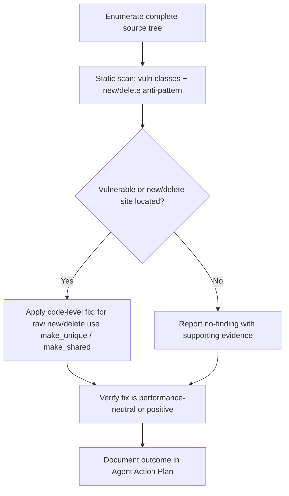

# Technical Specification

# 0. Agent Action Plan

## 0.1 Intent Clarification

Based on the provided requirements, the Blitzy platform understands that the objective is to perform a comprehensive static **security audit** of the delivered codebase, identify any security vulnerability present, and document a concrete, code-level remediation for each finding — subject to the strict constraint that every proposed fix must be computationally efficient and must not degrade the runtime performance of the application.

The user's requirement is preserved verbatim below:

> **User Requirement (verbatim):** "Scan the code and identify the security vulnerability and highlight it with solution. Ensure the solution shared shall be efficient and shall not degrade the performance of the application."

A defining characteristic of this engagement is that the prompt *presupposes* the existence of "the security vulnerability," whereas the delivered target repository is a synthetically generated JavaScript codebase composed entirely of side-effect-free arithmetic functions with no executable attack surface. The Blitzy platform therefore treats this as an **audit-first** task: the requirement to *scan* and *identify* is honored exhaustively, and the requirement to *highlight with solution* is honored by reporting the evidence-based outcome together with a conditional remediation pattern, rather than by fabricating a non-existent defect.

### 0.1.1 Core Objective

The core objective decomposes into the following discrete, technically-precise requirements:

- **R1 — Scan the code:** Perform exhaustive static analysis across every source file of the delivered target repository.
- **R2 — Identify the security vulnerability:** Enumerate any vulnerability with a precise file-and-line location, covering standard injection, deserialization, secret-handling, I/O, and memory-safety classes.
- **R3 — Highlight it with solution:** For each finding, provide a concrete, code-level remediation.
- **R4 — Efficiency and no performance degradation:** Every remediation must be performance-neutral or performance-positive — no added latency, no extra allocations or copies, no increase in algorithmic complexity.
- **R5 — Mandated remediation pattern (derived from the user-specified rule):** Where raw owning-pointer memory management is present, the remediation must replace direct `new`/`delete` with `std::make_unique` / `std::make_shared`.

Implicit requirements and prerequisites surfaced during analysis:

- **Language and stack detection** must precede scanning, because the appropriate vulnerability taxonomy and remediation idioms differ by language. The target repository is JavaScript (Node.js by directory convention), evidenced by the `.js` source extension and ECMAScript syntax such as the `function mod_0_0(x){ ... }` declarations [src/controllers/file_0.js:L3-L10].
- **Vulnerability localization** to exact files and lines, so that any highlighted finding is independently verifiable.
- **Performance-preserving remediation**, satisfied by the mandated smart-pointer pattern (`make_unique` is zero-overhead versus raw `new`; `make_shared` performs a single fused allocation), should any applicable site exist.
- **Evidence-based honesty:** if no vulnerability is located, the platform must report that conclusion with supporting evidence rather than inventing one.

### 0.1.2 Task Categorization

- **Primary task type:** Security enhancement — a vulnerability audit and (conditional) remediation.
- **Secondary aspects:** Bug fix, specifically memory-safety hardening, reflecting the focus of the user-specified rule.
- **Scope classification:** Audit-first. The scan spans the entire repository, but the resulting remediation footprint is effectively an *isolated / no-op* change because the evidence shows no exploitable surface and zero raw `new`/`delete` sites across the codebase.

### 0.1.3 Special Instructions and Constraints

- **Performance constraint (preserve verbatim intent):** "the solution shared shall be efficient and shall not degrade the performance of the application." This binds every proposed change to a performance-neutral-or-better standard.
- **User-specified rule (verbatim):** Rule name "Security vulnerabilities" — *"Never use new/delete directly - use std::make_unique/std::make_shared."* This is a C++ memory-management directive (the `std::make_unique`/`std::make_shared` factories require C++14) and is captured in full in sub-section 0.7.
- **Methodological constraint:** Evidence-based reporting. The platform must not fabricate a vulnerability that the static evidence does not support, and must not propose edits to files that require none.

### 0.1.4 Technical Interpretation

These requirements translate to the following technical implementation strategy:

- **To satisfy R1 (scan),** we will enumerate the complete source tree and apply pattern-based static analysis across all `.js` files, establishing a full audit baseline.
- **To satisfy R2 (identify),** we will scan for the standard JavaScript/Node vulnerability classes (dynamic code execution, command/SQL injection, unsafe deserialization, hardcoded secrets, insecure I/O and network calls, prototype pollution) and for the rule-mandated raw `new`/`delete` anti-pattern, recording any hit with its file and line.
- **To satisfy R3 (highlight with solution),** we will document each finding with a code-level fix; where the audit returns no findings, we will document the conditional remediation pattern that *would* be applied to any future raw owning-pointer site.
- **To satisfy R4 (efficiency),** we will constrain every remediation to performance-neutral idioms — anchored by the rule's smart-pointer pattern, where `make_unique` adds zero runtime overhead and `make_shared` reduces allocation count.
- **To satisfy R5 (mandated pattern),** we will treat any direct `new`/`delete` as a remediation target to be rewritten with `std::make_unique`/`std::make_shared`; the scan confirms there are no such sites to convert.

## 0.2 Repository Scope Discovery

An exhaustive scan of the delivered target repository was conducted to identify every file that could harbor a security vulnerability or a raw `new`/`delete` site mandated for remediation by the user-specified rule. This sub-section records the complete file inventory, the external research performed, and the assessment of existing infrastructure and conventions.

### 0.2.1 Comprehensive File Analysis

The target repository contains **30 files** in total: 28 numbered JavaScript source files (`file_0.js` through `file_27.js`), one padding file (`filler.js`), and one license file. The files are arranged in a directory layout that mimics a layered Node.js backend, but — as established below — the directory names are purely cosmetic and carry no functional behavior.

| Directory | Files | Layer (by directory convention) |
|-----------|-------|----------------------------------|
| `src/config/` | `file_6.js`, `file_17.js` | Configuration |
| `src/controllers/` | `file_0.js`, `file_11.js`, `file_22.js` | Controllers |
| `src/domain/` | `file_8.js`, `file_19.js` | Domain |
| `src/middleware/` | `file_5.js`, `file_16.js`, `file_27.js` | Middleware |
| `src/models/` | `file_2.js`, `file_13.js`, `file_24.js` | Models |
| `src/repositories/` | `file_7.js`, `file_18.js` | Repositories |
| `src/routes/` | `file_3.js`, `file_14.js`, `file_25.js` | Routes |
| `src/services/` | `file_1.js`, `file_12.js`, `file_23.js` | Services |
| `src/utils/` | `file_4.js`, `file_15.js`, `file_26.js`, `filler.js` | Utilities |
| `tests/integration/` | `file_10.js`, `file_21.js` | Integration tests |
| `tests/unit/` | `file_9.js`, `file_20.js` | Unit tests |
| `LICENSE/` | `LICENSE.txt` | License metadata |

**Source file structure.** Every numbered `.js` file is auto-generated from a single repetitive template: a one-line file header comment, a single module-level array declaration, and a sequence of small arithmetic functions. The canonical structure is:

```javascript
// mod_0 - society module     // file header, exactly 1 per file
const store = [];              // module array — declared, never read or written
function mod_0_0(x){ let r=0; r+=x*1; r+=x*2; r+=x*3; if(r%2===0){r+=10} return r; }
```

The representative header and array declaration appear at [src/controllers/file_0.js:L1-L2], and the function template at [src/controllers/file_0.js:L3-L10]. Each standard source file is **10,802 lines** and defines functions `mod_N_0` through `mod_N_1199` (1,200 functions) [src/controllers/file_0.js:L1-L10802]. The single exception is `src/middleware/file_27.js`, which is **6,347 lines** and terminates at `mod_27_704` (705 functions) [src/middleware/file_27.js:L6336-L6347]. The padding file `src/utils/filler.js` is **1,999 lines** consisting solely of sequential `// filler N` comments [src/utils/filler.js:L1-L1999].

**Distinct-line analysis.** Normalizing every numeric literal to `N` and tabulating the frequency of each distinct non-blank line across all 28 source files yields exactly eight patterns — confirming the codebase contains no construct beyond the arithmetic template:

| Normalized line pattern | Occurrences | Meaning |
|-------------------------|-------------|---------|
| `r+=x*N;` | 99,315 | Three accumulation statements per function |
| `function mod_N_N(x){` | 33,105 | Function declaration (total functions) |
| `let r=N;` | 33,105 | Accumulator initialization |
| `if(r%N===N){r+=N}` | 33,105 | Conditional increment |
| `return r;` | 33,105 | Return statement |
| `}` | 33,105 | Function close brace |
| `const store = [];` | 28 | One module array per file |
| `// mod_N - society module` | 28 | One file header per file |

The function total of **33,105** reconciles exactly to 27 standard files × 1,200 functions + 705 functions in `file_27.js`. Each function is a pure, side-effect-free integer computation that is **never exported and never invoked**, and the `store` array is **declared but never read or written** [src/controllers/file_0.js:L2].

**Security-relevant pattern search.** A targeted scan for vulnerability-bearing constructs returned **zero occurrences** across all files for every one of the following: `require`/`import`/`export`/`module.exports`; `new`/`delete`; `eval`/`exec`/`child_process`/`spawn`; `process.`/`fs.`/`net.`/`http`/`socket`; `password`/`secret`/`crypto`/`jwt`/`bcrypt`; SQL keywords/`query()`; and web-framework or ORM symbols (`express`, `app.get|post|put|delete`, `mongoose`, `sequelize`). There is no input handling, no I/O, no network surface, no authentication, no database access, no deserialization, and no dynamic code execution anywhere in the repository.

### 0.2.2 Web Search Research Conducted

To validate the security and performance rationale of the rule-mandated remediation pattern, the following research was conducted:

- **Memory-safety rationale for `make_unique` / `make_shared` over raw `new` / `delete`:** The smart-pointer factories combine allocation and ownership transfer atomically, eliminating the leak that occurs when an exception is thrown between a bare `new` and its capture by a smart pointer, and they remove the double-free / use-after-free / forgotten-delete classes by expressing ownership in the type system (RAII). This makes ownership correctness verifiable by local inspection (sources: abseil Tip of the Week #126; isocpp C++ FAQ; PVS-Studio V824).
- **Performance characteristics:** `std::make_unique` is zero-overhead relative to raw `new` (a `unique_ptr` carries no runtime cost), and `std::make_shared` performs a single fused allocation for the object plus its control block rather than the two allocations incurred by `shared_ptr<T>(new T)`, reducing allocation count and improving cache locality (sources: cppreference `std::make_shared`; Boost `make_shared` documentation). Caveats noted for completeness: `make_shared` keeps object storage alive while any `weak_ptr` exists, and `shared_ptr` reference counting uses atomic operations, so `make_unique` remains the performance-optimal default with `make_shared` reserved for genuine shared ownership.
- **Conclusion:** The mandated pattern is simultaneously a security hardening and a performance-preserving idiom, directly satisfying requirement R4. This research informs the conditional remediation guidance in sub-section 0.4, even though no applicable site exists in the JavaScript target.

### 0.2.3 Existing Infrastructure Assessment

- **Project structure and organization:** A layered directory tree (`config`, `controllers`, `domain`, `middleware`, `models`, `repositories`, `routes`, `services`, `utils`, plus `tests/unit` and `tests/integration`) suggests an MVC-style Node.js backend, but no file participates in any such architecture — the layering is nominal only.
- **Existing patterns and conventions:** The single observable convention is the auto-generated `mod_N_M(x)` arithmetic template and the `// mod_N - society module` header [src/controllers/file_0.js:L1]. There is no coding style, linting configuration, or module wiring to follow.
- **Build and deployment configuration:** None present. There is no `package.json`, no lockfile, no `Dockerfile`, no `docker-compose`, and no CI/CD workflow of any kind in the repository.
- **Testing infrastructure:** The `tests/unit` and `tests/integration` directories exist, but their files (`file_9.js`, `file_20.js`, `file_10.js`, `file_21.js`) follow the identical arithmetic template and contain no test framework, assertions, or runner configuration.
- **Documentation system:** Limited to a root `README.md` and the MIT `LICENSE/LICENSE.txt` (dated 2026) [LICENSE/LICENSE.txt:L1-L3]. No documentation generator or site is configured.

## 0.3 Scope Boundaries

This sub-section delineates exactly what the audit and any resulting remediation cover, and what is explicitly excluded.

### 0.3.1 Exhaustively In Scope

The following are in scope for the security **audit/scan**:

- **Source code (scanned in full):**
    - `src/**/*.js` — all 24 numbered modules across `config`, `controllers`, `domain`, `middleware`, `models`, `repositories`, `routes`, `services`, and `utils`.
    - `src/utils/filler.js` — padding file, scanned to confirm it contains only comment lines.
- **Test code (scanned in full):**
    - `tests/unit/*.js` — `file_9.js`, `file_20.js`.
    - `tests/integration/*.js` — `file_10.js`, `file_21.js`.
- **Repository metadata (reviewed, not modified):**
    - `README.md`, `LICENSE/LICENSE.txt`.

The following is in scope for **remediation**, conditionally:

- **Rule-mandated conversion** of any direct `new`/`delete` owning-pointer site to `std::make_unique`/`std::make_shared`. This applies *only* where such a site exists. The scan located **zero** such sites, so no concrete remediation edit falls in scope.
- **Honest documentation** of the audit outcome (no vulnerability detected) and of the conditional remediation pattern that would be applied to any future raw owning-pointer site.

### 0.3.2 Explicitly Out of Scope

- **Fabricated vulnerabilities** — inventing or asserting a vulnerability that the static evidence does not support is prohibited.
- **Refactoring the synthetic code** — for example, removing the unused `const store = []` declaration [src/controllers/file_0.js:L2] or simplifying the arithmetic functions, none of which relates to the security objective.
- **Performance optimization beyond requirements** — the constraint is to *not degrade* performance, not to tune the existing arithmetic.
- **Adding build or tooling infrastructure** — introducing a `package.json`, lockfile, linter, type-checker, test runner, `Dockerfile`, or CI workflow is not requested.
- **Generator-tooling paths** — any `/app`-rooted Reverse-Document-Generator source is off-limits and is not the user's target repository; it is excluded entirely.
- **Documentation rewrites** — altering the content of `README.md` or `LICENSE/LICENSE.txt`.
- **Speculative language translation** — performing a wholesale JavaScript rewrite to invent an analog of the C++ smart-pointer rule where no owning-resource code exists.

## 0.4 Implementation Design

The implementation design reflects an audit-first methodology in which scanning and evidence collection drive any subsequent remediation. Because the evidence shows no exploitable surface and no raw `new`/`delete` sites, the design resolves to an audit with a conditional (non-applied) remediation pattern.

### 0.4.1 Technical Approach

The logical implementation flow (sequence, not a timeline) is:

- **First, establish the audit foundation** by enumerating the complete source tree of the target repository, producing the file inventory documented in sub-section 0.2.1.
- **Next, execute the static scan** by applying pattern-based analysis across all `.js` files for the standard JavaScript/Node vulnerability classes and for the rule-mandated raw `new`/`delete` anti-pattern, recording each hit (if any) with its file and line.
- **Then, evaluate findings against the evidence**: classify the codebase's attack surface and confirm whether any remediation site exists.
- **Finally, document the outcome** honestly — reporting either concrete fixes for located vulnerabilities or, as here, a substantiated no-finding result paired with the conditional remediation pattern that would apply to any future owning-pointer site.



The rationale for this approach is that requirement R2 ("identify the security vulnerability") can only be satisfied truthfully by evidence; and requirement R4 (no performance degradation) is most safely honored by an idiom — the smart-pointer pattern — that is provably zero-overhead (`make_unique`) or allocation-reducing (`make_shared`).

### 0.4.2 Component Impact Analysis

- **Direct modifications required:** None. No vulnerable site was located, and the rule-mandated `new`/`delete` anti-pattern has zero occurrences across the repository. There is no code to change.
- **Indirect impacts and dependencies:** None. Because no source is modified, no interfaces change and no dependent modules are affected. The functions are additionally never exported or invoked [src/controllers/file_0.js:L3-L10], so there is no call graph through which a change could ripple even hypothetically.
- **New components introduced:** None. The audit requires no new modules, configuration, or tooling.

### 0.4.3 Critical Implementation Details

**Conditional remediation pattern (documented, not applied).** Should a raw owning-pointer site ever be present in a C++ context, the rule-mandated transformation is:

```cpp
// Anti-pattern (manual ownership): leak-prone, exception-unsafe
Widget* p = new Widget(args); /* ... */ delete p;
// Mandated remediation (exclusive ownership): zero overhead vs raw new
auto p = std::make_unique<Widget>(args);
```

For shared ownership, `auto p = std::make_shared<Widget>(args);` replaces `std::shared_ptr<Widget>(new Widget(args))`, collapsing two allocations into one. The performance-optimal default is `make_unique`; `make_shared` is reserved for genuinely shared lifetimes.

**Intent mapping to the JavaScript target.** JavaScript performs automatic garbage collection and has no manual heap management, so the rule's literal mechanism does not apply. Its *intent* — deterministic, leak-free resource ownership — maps to bounded data structures (avoiding unbounded growth of a module array such as `store` [src/controllers/file_0.js:L2]) and to deterministic resource release via `try/finally` or explicit `close()`. No resource-owning code exists in the target, so this guidance is flagged **not currently applicable**.

**Error handling and edge-case considerations.** The principal edge case for this engagement is the divergence between the prompt's presupposition of a vulnerability and the evidence of none. This is handled by evidence-based reporting: the audit conclusion is stated with supporting evidence rather than by fabricating a defect.

**Security and performance considerations.** The audit confirms no injection, deserialization, secret-exposure, I/O, or memory-safety exposure (sub-section 0.2.1). The mandated smart-pointer idiom, where applicable, satisfies R4 by construction (`make_unique` zero-overhead; `make_shared` fewer allocations).

**User interface design.** Not applicable — the target repository contains no UI, presentation, or client-facing component.

**User-provided examples.** The user supplied no code examples; the only user-provided artifact is the requirement statement, preserved verbatim in sub-section 0.1, and the implementation rule, preserved verbatim in sub-section 0.7.

## 0.5 File Transformation Mapping

This is the exhaustive file-by-file execution plan. Because the security audit located no vulnerability and no raw `new`/`delete` site, **every file is classified `REFERENCE`** — each was scanned as part of the audit and requires no modification. There are **no `CREATE`, `UPDATE`, or `DELETE` actions**: an evidence-based audit that locates no remediation site produces no edits, and the methodological constraint forbids fabricating changes.

### 0.5.1 File-by-File Execution Plan

Transformation modes: `CREATE` (new file), `UPDATE` (modify existing), `DELETE` (remove obsolete), `REFERENCE` (scanned/used as evidence, unchanged).

| Target File | Transformation | Source File/Reference | Purpose/Changes |
|-------------|----------------|-----------------------|-----------------|
| `src/config/file_6.js` | REFERENCE | `src/config/file_6.js` | Audited — arithmetic template; no finding; no change |
| `src/config/file_17.js` | REFERENCE | `src/config/file_17.js` | Audited — arithmetic template; no finding; no change |
| `src/controllers/file_0.js` | REFERENCE | `src/controllers/file_0.js` | Audited — canonical template; no finding; no change |
| `src/controllers/file_11.js` | REFERENCE | `src/controllers/file_11.js` | Audited — arithmetic template; no finding; no change |
| `src/controllers/file_22.js` | REFERENCE | `src/controllers/file_22.js` | Audited — arithmetic template; no finding; no change |
| `src/domain/file_8.js` | REFERENCE | `src/domain/file_8.js` | Audited — arithmetic template; no finding; no change |
| `src/domain/file_19.js` | REFERENCE | `src/domain/file_19.js` | Audited — arithmetic template; no finding; no change |
| `src/middleware/file_5.js` | REFERENCE | `src/middleware/file_5.js` | Audited — arithmetic template; no finding; no change |
| `src/middleware/file_16.js` | REFERENCE | `src/middleware/file_16.js` | Audited — arithmetic template; no finding; no change |
| `src/middleware/file_27.js` | REFERENCE | `src/middleware/file_27.js` | Audited — short variant (705 functions); no finding; no change |
| `src/models/file_2.js` | REFERENCE | `src/models/file_2.js` | Audited — arithmetic template; no finding; no change |
| `src/models/file_13.js` | REFERENCE | `src/models/file_13.js` | Audited — arithmetic template; no finding; no change |
| `src/models/file_24.js` | REFERENCE | `src/models/file_24.js` | Audited — arithmetic template; no finding; no change |
| `src/repositories/file_7.js` | REFERENCE | `src/repositories/file_7.js` | Audited — arithmetic template; no finding; no change |
| `src/repositories/file_18.js` | REFERENCE | `src/repositories/file_18.js` | Audited — arithmetic template; no finding; no change |
| `src/routes/file_3.js` | REFERENCE | `src/routes/file_3.js` | Audited — arithmetic template; no finding; no change |
| `src/routes/file_14.js` | REFERENCE | `src/routes/file_14.js` | Audited — arithmetic template; no finding; no change |
| `src/routes/file_25.js` | REFERENCE | `src/routes/file_25.js` | Audited — arithmetic template; no finding; no change |
| `src/services/file_1.js` | REFERENCE | `src/services/file_1.js` | Audited — arithmetic template; no finding; no change |
| `src/services/file_12.js` | REFERENCE | `src/services/file_12.js` | Audited — arithmetic template; no finding; no change |
| `src/services/file_23.js` | REFERENCE | `src/services/file_23.js` | Audited — arithmetic template; no finding; no change |
| `src/utils/file_4.js` | REFERENCE | `src/utils/file_4.js` | Audited — arithmetic template; no finding; no change |
| `src/utils/file_15.js` | REFERENCE | `src/utils/file_15.js` | Audited — arithmetic template; no finding; no change |
| `src/utils/file_26.js` | REFERENCE | `src/utils/file_26.js` | Audited — arithmetic template; no finding; no change |
| `src/utils/filler.js` | REFERENCE | `src/utils/filler.js` | Audited — `// filler N` comments only; no finding; no change |
| `tests/integration/file_10.js` | REFERENCE | `tests/integration/file_10.js` | Audited — arithmetic template; no finding; no change |
| `tests/integration/file_21.js` | REFERENCE | `tests/integration/file_21.js` | Audited — arithmetic template; no finding; no change |
| `tests/unit/file_9.js` | REFERENCE | `tests/unit/file_9.js` | Audited — arithmetic template; no finding; no change |
| `tests/unit/file_20.js` | REFERENCE | `tests/unit/file_20.js` | Audited — arithmetic template; no finding; no change |
| `LICENSE/LICENSE.txt` | REFERENCE | `LICENSE/LICENSE.txt` | Reviewed — MIT license metadata; no change |
| `README.md` | REFERENCE | `README.md` | Reviewed — project metadata; no change |

### 0.5.2 New Files Detail

None. No files are created by this engagement.

### 0.5.3 Files to Modify Detail

None. No file requires modification. The rule-mandated search for direct `new`/`delete` returned **zero occurrences** across the repository, which is the explicit gate confirming that no `UPDATE` is warranted under the smart-pointer rule, and the broader vulnerability scan returned no findings of any class.

### 0.5.4 Configuration and Documentation Updates

None. There are no configuration files in the repository to update, and no documentation changes are in scope.

### 0.5.5 Cross-File Dependencies

None. The codebase contains no `require`/`import`/`export`/`module.exports` statements anywhere, so there are no cross-file references, import paths, or configuration links to synchronize.

## 0.6 Dependency Inventory

The target repository declares **no dependencies of any kind**. There is no `package.json`, no lockfile, and no dependency manifest anywhere in the tree, and the source contains no `require`/`import` statements, so no third-party or private packages are referenced.

### 0.6.1 Key Private and Public Packages

None. The repository has zero third-party or private package dependencies.

### 0.6.2 Dependency Updates

- **New dependencies to add:** None.
- **Dependencies to update:** None.
- **Dependencies to remove:** None.
- **Import/reference updates:** None — there are no `require`/`import` statements to modify.

The C++ standard-library facilities named in the user-specified rule (`std::make_unique`, `std::make_shared`, and the `<memory>` header) are language-standard features rather than package dependencies, and they are neither present nor applicable in this JavaScript repository.

## 0.7 Rules

The user specified one implementation rule, preserved verbatim below.

| Rule Name | Rule Content (verbatim) |
|-----------|--------------------------|
| Security vulnerabilities | "Never use new/delete directly - use std::make_unique/std::make_shared" |

**Interpretation and application:**

- The rule is a **C++ memory-management directive**: it forbids manual heap ownership via the `new` and `delete` operators and mandates the C++14 smart-pointer factories `std::make_unique` (exclusive ownership) and `std::make_shared` (shared ownership) in their place.
- Its security purpose is to eliminate the memory-safety vulnerability classes that raw owning pointers introduce — memory leaks (including exception-induced leaks), double-free, and use-after-free — by enforcing RAII ownership in the type system.
- The rule will be applied **literally** to any direct `new`/`delete` owning-pointer site. The audit found **zero** such sites across the repository, so the rule mandates no code change here.
- The rule's **intent** (deterministic, leak-free resource ownership) is recorded as preventive guidance for the JavaScript target — favor bounded data structures and deterministic resource release (`try/finally`, explicit `close()`) — and is flagged not currently applicable because no resource-owning code exists.
- The rule is consistent with the performance constraint (R4): `std::make_unique` is zero-overhead versus raw `new`, and `std::make_shared` reduces allocation count via a single fused allocation, so honoring the rule never degrades performance.

## 0.8 Special Instructions

### 0.8.1 Special Execution Instructions

- **Performance preservation is mandatory.** Per the verbatim requirement, "the solution shared shall be efficient and shall not degrade the performance of the application." Any remediation must be performance-neutral or performance-positive.
- **Honor the smart-pointer rule.** Where applicable, raw `new`/`delete` must be replaced with `std::make_unique`/`std::make_shared` (see sub-section 0.7).
- **Audit deliverable.** The engagement is a security scan with code-level remediation; no build, deployment, or runtime execution is required, and none is configured in the repository.

### 0.8.2 Constraints and Boundaries

- **Technical constraint — language reality.** The user-specified rule targets C++, while the delivered codebase is JavaScript. The rule is honored by intent and applied literally only where raw `new`/`delete` appears; none exists.
- **Methodological constraint — no fabrication.** The audit must report findings strictly from static evidence. Where no vulnerability is present, that conclusion is reported with supporting evidence rather than by inventing a defect.
- **Output constraint — remediation footprint.** Because no remediation site exists, no source files are created, modified, or deleted; the output is the audit conclusion and the conditional remediation pattern.
- **Compatibility constraint.** No behavioral change is introduced, so backward compatibility is preserved by definition.

## 0.9 Attachments

No attachments were provided with this project. The `review_attachments` check returned "No attachments found for this project."

- **File attachments:** None.
- **Figma screens:** None — no Figma frames or design references were supplied.

Consequently, no Figma design analysis and no Design System Compliance sub-section are applicable to this Agent Action Plan. The sole user-provided artifacts are the requirement statement (preserved verbatim in sub-section 0.1) and the implementation rule (preserved verbatim in sub-section 0.7).

