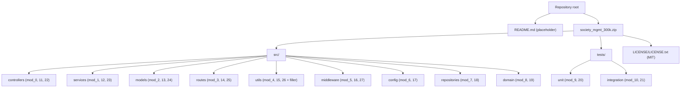
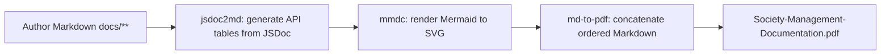

# Technical Specification

# 0. Agent Action Plan

## 0.1 Intent Clarification

This Agent Action Plan governs a **documentation** effort for the Society Management codebase. It is a DOCUMENT CODE engagement: the deliverables are documentation artifacts and rule-mandated in-code documentation comments, not changes to runtime behavior. The plan below is grounded exclusively in the actual target repository, whose source is delivered as the archive `society_mgmt_300k.zip` at the repository root [README.md:L1-L2] and analyzed directly from its extracted contents.

### 0.1.1 Core Documentation Objective

Based on the provided requirements, the Blitzy platform understands that the documentation objective is to **author comprehensive, evidence-based project documentation for the Society Management codebase, organized so that there is a separate, dedicated documentation section for each module identity present in the code, and to produce a single consolidated PDF rendering of that documentation once it has been authored** — all while satisfying the mandatory project rule to add JSDoc comments to every function.

- **Request categorization:** Create new documentation. This is a greenfield documentation effort — the repository currently contains no documentation beyond a two-line placeholder README [README.md:L1-L2] and an MIT license file [LICENSE/LICENSE.txt], and contains zero in-code documentation comments.
- **Documentation types in scope (multi-type):**
  - Architecture / explanation documentation — system overview, the layered directory taxonomy, the module-identity scheme, and the documentation build rationale.
  - Per-identity module API reference — one dedicated reference page per module identity (`mod_0` through `mod_27`), generated from JSDoc.
  - README hub — the placeholder root README converted into the documentation entry point.
  - In-code reference documentation — JSDoc comment blocks added to every function (rule-mandated).
  - Consolidated PDF — an exported PDF of the complete document.
- **Documentation requirements, restated with enhanced clarity:**
  - Requirement 1 — Produce complete project documentation covering structure, architecture, and a per-module API reference for the Society Management codebase.
  - Requirement 2 — Provide a distinct documentation section for each identifiable module unit in the code (resolved interpretation of "each identity"; see §0.1.3).
  - Requirement 3 — After the document is authored, generate a PDF rendering of it as a final deliverable.
  - Requirement 4 (rule) — Add JSDoc comments to all functions across the codebase.

### 0.1.2 Special Instructions and Constraints

The following directives are captured verbatim and preserved exactly as provided by the user. No user-provided templates or examples were supplied with this request, so there is no external template or example content to reproduce.

- **User Requirement (verbatim):** "Create documentation of the project. ensure to have separate sections for each identity. Do generate pdf of the document after its created."
- **Mandatory Rule (verbatim, rule name "rule- document code"):** "Add JSDoc comments to all functions."

Derived constraints and how they are honored:

- **Separate section per identity** — The documentation must contain one dedicated section for each module identity. The codebase exposes 28 distinct identities via per-file headers of the form `// mod_N - society module` [src/controllers/file_0.js:L1]; the plan therefore produces 28 per-identity reference pages (see §0.1.3 for the interpretation of "identity").
- **PDF after creation** — The PDF is an explicit, ordered final step: documentation is authored first, then rendered to a single consolidated PDF. This requires a Markdown→PDF toolchain that does not currently exist in the repository (see §0.4 and §0.6).
- **JSDoc on all functions** — This rule expands documentation scope to include the source files themselves. Every function across all source and test files receives a JSDoc block. This is a documented exception to the usual "no source modification" boundary for documentation tasks: only doc-comments are added, with no change to function logic (see §0.8 and §0.10).
- **Minimal, evidence-based content** — Because the code is synthetic (see §0.1.3), documentation must describe only what is actually present and must not fabricate business behavior. Tone and structure follow standard Markdown and JSDoc community conventions, since no in-repo style guide exists.
- **Embedded credentials are test-only** — The user's environment setup instructions contain literal values (an API key and a database host). These are staging/test-only artifacts and are explicitly excluded from documentation as real configuration (see §0.8.2).

### 0.1.3 Technical Interpretation

These documentation requirements translate to the following technical documentation strategy.

- To **document the project as a whole**, we will create a structured `docs/` tree (overview, architecture, per-identity API reference, and build/PDF guides) plus a documentation hub at the repository root.
- To **provide a separate section for each identity**, we will create one Markdown reference page per module identity. The term "identity" is ambiguous in the prompt; it is resolved here as **each uniquely identifiable module unit in the codebase**. The evidence for this interpretation is concrete: every source and test file declares a module identity in its first line via the header `// mod_N - society module` [src/services/file_1.js:L1], and all functions in that file are namespaced to that identity as `mod_N_M(x)`. There are 28 such identities (`mod_0` … `mod_27`). This interpretation is flagged as an assumption for confirmation, but it is the most defensible reading of the code.
- To **generate the PDF**, we will introduce a documentation toolchain (`jsdoc`, `jsdoc-to-markdown`, `@mermaid-js/mermaid-cli`, `md-to-pdf`) and a build script that converts the authored Markdown into a single consolidated PDF.
- To **add JSDoc to all functions**, we will insert a JSDoc block immediately above each of the 33,105 function declarations (28,305 in `src/`, 4,800 in `tests/`), describing the single numeric parameter and numeric return value that every function shares.

A critical content constraint follows from the code's nature: despite a society-management directory taxonomy (`controllers`, `services`, `models`, `routes`, `repositories`, `domain`, etc.), the files contain no framework wiring and no business logic — each function is an identical synthetic arithmetic routine [src/controllers/file_0.js:L3-L10]. The documentation will accurately describe this structure and the uniform function contract, and will not invent member-management, billing, or similar features that do not exist in the code.

### 0.1.4 Inferred Documentation Needs

Beyond the explicit requirements, repository and structure analysis surfaces the following implicit documentation needs, each of which is addressed by this plan:

- **Module catalog / navigation index** — With 28 per-identity pages across 11 directories, a catalog page and a documentation hub are needed so readers can navigate by layer and by identity. *(Inferred from structure: 28 identities spread across `src/**` and `tests/**`.)*
- **A documentation toolchain and manifest** — The repository has no `package.json` or any manifest, so producing generated API docs and a PDF requires introducing a manifest plus dev-dependencies and build scripts. *(Inferred from dependencies: no manifest exists anywhere in the repo or archive.)*
- **A JSDoc conventions standard** — To apply the JSDoc rule consistently across 33,105 functions, a short conventions document defines the exact tags used (`@param`, `@returns`) and how non-exported global functions are treated. *(Inferred from the rule plus the uniform function signature.)*
- **Architecture and data-flow diagrams** — The layered taxonomy and the documentation build pipeline are best communicated with Mermaid diagrams (repository structure, per-layer module grouping, and the build→PDF flow). *(Inferred from user journey and structure.)*
- **Source citations throughout** — For traceability, every technical claim in the generated documentation cites the originating source file and line range. *(Inferred from maintainability best practice.)*
- **An explicit "synthetic code" explanation** — Readers will expect business semantics from the directory names; a short explanatory note prevents misinterpretation. *(Inferred from the mismatch between naming and actual content.)*


## 0.2 Documentation Discovery and Analysis

Repository analysis reveals a Node.js/JavaScript codebase delivered as an archive at the repository root, with a layered directory taxonomy, no documentation infrastructure of any kind, and zero existing in-code documentation comments. Because the repository index surfaces only the placeholder README, all findings below are derived from direct extraction and inspection of `society_mgmt_300k.zip`.

### 0.2.1 Existing Documentation Infrastructure Assessment

A systematic search establishes that **no documentation infrastructure currently exists**:

- **No documentation files** — There are no `docs/` directories, no `*.md` files (other than the root placeholder README), no `*.mdx`, and no `*.rst` anywhere in the repository or the extracted archive.
- **No documentation generators** — No `mkdocs.yml`, `docusaurus.config.js`, Sphinx `conf.py`, `typedoc.json`, or `.jsdoc.json` configuration is present.
- **No in-code documentation** — A repository-wide search for JSDoc comment blocks (`/**`) returns **zero occurrences** across all 29 JavaScript files. The codebase is a clean slate for the JSDoc rule.
- **No build or dependency manifests** — There is no `package.json`, `package-lock.json`, `tsconfig.json`, `.nvmrc`, `Dockerfile`, or any `*.yml`/`*.yaml` file. Consequently there is no current documentation framework, no documentation generator configuration, no diagram tooling, and no hosting/deployment setup to detect.
- **Only pre-existing doc-like artifacts:**
  - `README.md` at the repository root — a 59-byte placeholder reading "# Ajit-backprop-test / test project for backprop integration." [README.md:L1-L2]. This becomes the documentation hub.
  - `LICENSE/LICENSE.txt` inside the archive — the MIT License (Copyright (c) 2026) [LICENSE/LICENSE.txt]. Referenced for licensing notes, not modified.

| Infrastructure Aspect | Detected State | Evidence |
|------------------------|----------------|----------|
| Documentation framework | None | No generator config files present |
| API documentation tool | None | No JSDoc/Sphinx/Godoc config; 0 `/**` blocks |
| Diagram tooling | None | No Mermaid/PlantUML configuration |
| Documentation hosting | None | No `.readthedocs.yml`, no CI config |
| Dependency manifest | None | No `package.json` or lockfile anywhere |
| Existing docs | Placeholder only | `README.md` (2 lines) [README.md:L1-L2] |

Because no framework exists, the plan introduces a new, minimal documentation toolchain rather than extending an existing one (see §0.4 and §0.6).

### 0.2.2 Repository Code Analysis for Documentation

The code to document is organized into a layered directory structure under `src/` and `tests/`. Each file represents exactly one module identity, declared by its first-line header `// mod_N - society module` [src/models/file_2.js:L1], followed by a file-scoped `const store = [];` and a sequence of function declarations.

- **Module identities:** 28 total, `mod_0` … `mod_27`, one per file.
- **Function naming and signature:** Functions are named `mod_N_M(x)` (for module `N`, ordinal `M`), accept a single argument `x`, and return a number.
- **Uniform function body:** Every function performs the same synthetic arithmetic — accumulate `x*1 + x*2 + x*3`, add 10 if the running total is even, and return it [src/controllers/file_0.js:L3-L10].
- **Function counts:** Each module file contains 1,200 functions (`mod_N_0` … `mod_N_1199`), with two exceptions — `src/middleware/file_27.js` contains 705 functions, and `src/utils/filler.js` contains 0 functions.
- **Padding artifact:** `src/utils/filler.js` has the header `// filler 298001` (not a module header) and contains only filler padding comments; it declares no functions and represents no module identity [src/utils/filler.js:L1].
- **No framework wiring:** There are no `module.exports`/`require()` statements, and no Express, Mongoose, or Sequelize usage. All functions are file-scoped global declarations and are not exported.

The directories examined and their module identities:

| Layer (directory) | Module Files | Identities |
|-------------------|--------------|------------|
| `src/controllers/` | file_0, file_11, file_22 | mod_0, mod_11, mod_22 |
| `src/services/` | file_1, file_12, file_23 | mod_1, mod_12, mod_23 |
| `src/models/` | file_2, file_13, file_24 | mod_2, mod_13, mod_24 |
| `src/routes/` | file_3, file_14, file_25 | mod_3, mod_14, mod_25 |
| `src/utils/` | file_4, file_15, file_26 (+ filler.js) | mod_4, mod_15, mod_26 (+ artifact) |
| `src/middleware/` | file_5, file_16, file_27 | mod_5, mod_16, mod_27 (705 fns) |
| `src/config/` | file_6, file_17 | mod_6, mod_17 |
| `src/repositories/` | file_7, file_18 | mod_7, mod_18 |
| `src/domain/` | file_8, file_19 | mod_8, mod_19 |
| `tests/unit/` | file_9, file_20 | mod_9, mod_20 |
| `tests/integration/` | file_10, file_21 | mod_10, mod_21 |

The repository structure, as analyzed, is summarized below:



### 0.2.3 Web Search Research Conducted

To ground the documentation structure, conventions, and tooling in current best practice, the following research was conducted:

- **Documentation structure for software projects** — The Diátaxis framework (tutorials, how-to guides, reference, and explanation) was validated as the organizing model for the `docs/` tree, with the per-identity module pages forming the reference quadrant.
- **JSDoc conventions for JavaScript** — Confirmed the standard block-comment form (`/** ... */`) placed immediately above each function, using `@param {type} name - description` and `@returns {type} description`, and that JSDoc treats non-exported functions as "global" — directly applicable to the file-scoped `mod_N_M(x)` functions.
- **Markdown-to-PDF generation** — Confirmed that `md-to-pdf` can concatenate ordered Markdown files into a single PDF and apply CSS/page breaks, and that Mermaid diagrams are best pre-rendered to images via `@mermaid-js/mermaid-cli` (`mmdc`) for reliable PDF embedding.
- **Documentation tool versions** — Verified current published versions for `jsdoc`, `jsdoc-to-markdown`, `@mermaid-js/mermaid-cli`, and `md-to-pdf` (enumerated in §0.6).


## 0.3 Documentation Scope Analysis

Given the requirements and repository analysis, this section maps each unit of code to the documentation it requires and enumerates the gaps to be closed. Because the codebase is uniform and synthetic, the mapping is regular: each of the 28 module identities maps to one reference page, and every function maps to one JSDoc block.

### 0.3.1 Code-to-Documentation Mapping

**Modules requiring documentation (28 identities):** Each module identity requires a dedicated reference page plus JSDoc on all of its functions. The mapping is uniform across identities; representative rows are shown, and the full per-identity transformation is enumerated in §0.5.

| Module Identity | Source File | Functions | Current Documentation | Documentation Needed |
|-----------------|-------------|-----------|-----------------------|----------------------|
| mod_0 | `src/controllers/file_0.js` | 1,200 | Missing (0 JSDoc) | Reference page + JSDoc on all functions |
| mod_1 | `src/services/file_1.js` | 1,200 | Missing | Reference page + JSDoc on all functions |
| mod_2 | `src/models/file_2.js` | 1,200 | Missing | Reference page + JSDoc on all functions |
| … (mod_3 … mod_26, uniform) | `src/<layer>/file_N.js` | 1,200 each | Missing | Reference page + JSDoc on all functions |
| mod_27 | `src/middleware/file_27.js` | 705 | Missing | Reference page + JSDoc on all functions |
| mod_9, mod_20 | `tests/unit/file_9.js`, `file_20.js` | 1,200 each | Missing | Reference page + JSDoc on all functions |
| mod_10, mod_21 | `tests/integration/file_10.js`, `file_21.js` | 1,200 each | Missing | Reference page + JSDoc on all functions |

**Layer interfaces requiring documentation:** Each of the 11 layers (`controllers`, `services`, `models`, `routes`, `utils`, `middleware`, `config`, `repositories`, `domain`, `tests/unit`, `tests/integration`) requires a short architectural description and a grouping in the API reference index.

**Configuration options requiring documentation:** None. There are no configuration files and no runtime configuration options in the codebase (no `package.json`, no `config/*.yaml`, and the `src/config/` files [src/config/file_6.js:L1] contain only the same synthetic functions, not configuration data). This is stated explicitly rather than inventing options.

**Features requiring user guides:** The codebase exposes no end-user feature flows (no routes are wired, no business logic exists). Therefore "user guides" are scoped to developer-facing guides: how to build the documentation and generate the PDF, and how the JSDoc convention is applied. No end-user feature walkthroughs are fabricated.

### 0.3.2 Documentation Gap Analysis

Given the requirements and repository analysis, documentation gaps include the following — effectively the entire documentation surface, since the project starts from zero:

- **Undocumented functions (in-code):** 33,105 functions currently have no JSDoc (`src/` = 28,305; `tests/` = 4,800). Target: 100% JSDoc coverage per the rule. `src/utils/filler.js` has 0 functions and is excluded from this denominator.
- **Missing per-identity reference pages:** 0 of 28 module identities are documented. Target: 28 of 28.
- **Missing architecture documentation:** No system overview, no layered-taxonomy explanation, and no module-identity scheme documentation exist.
- **Missing developer guides:** No getting-started, documentation-build, or JSDoc-conventions guides exist.
- **Missing navigation:** No documentation index/catalog exists to navigate the 28 identities.
- **Missing PDF capability:** No toolchain or build script exists to produce the required consolidated PDF.
- **Outdated/placeholder content:** The root `README.md` is a two-line placeholder unrelated to the codebase's content [README.md:L1-L2]; it must be replaced with an accurate project overview and documentation hub.

No documentation is currently "partially complete" — every gap is a from-scratch creation, with the sole exceptions of the README (an update of placeholder content) and the source files (an update that adds JSDoc comments to existing functions).


## 0.4 Documentation Implementation Design

The documentation is designed as a structured Markdown corpus organized by the Diátaxis model, with a reference quadrant that contains one page per module identity, and a build pipeline that generates API tables from JSDoc, renders Mermaid diagrams, and exports a single consolidated PDF.

### 0.4.1 Documentation Structure Planning

The following hierarchy will be created. Each `mod_N.md` page is a dedicated section for one module identity (satisfying the "separate sections for each identity" requirement), filed under its architectural layer.

```
docs/
├── index.md                         (documentation hub, table of contents)
├── getting-started/
│   ├── overview.md                  (what the project is, evidence-based)
│   ├── project-structure.md         (layer taxonomy + module map)
│   └── building-docs.md             (install toolchain, build docs)
├── architecture/
│   ├── overview.md                  (layered architecture + diagram)
│   ├── module-taxonomy.md           (mod_N identity scheme + naming)
│   └── code-conventions.md          (uniform function contract + JSDoc standard)
├── api-reference/
│   ├── index.md                     (catalog of all 28 identities)
│   ├── controllers/  mod_0.md, mod_11.md, mod_22.md
│   ├── services/     mod_1.md, mod_12.md, mod_23.md
│   ├── models/       mod_2.md, mod_13.md, mod_24.md
│   ├── routes/       mod_3.md, mod_14.md, mod_25.md
│   ├── utils/        mod_4.md, mod_15.md, mod_26.md
│   ├── middleware/   mod_5.md, mod_16.md, mod_27.md
│   ├── config/       mod_6.md, mod_17.md
│   ├── repositories/ mod_7.md, mod_18.md
│   ├── domain/       mod_8.md, mod_19.md
│   └── tests/        unit/mod_9.md, unit/mod_20.md, integration/mod_10.md, integration/mod_21.md
├── guides/
│   ├── jsdoc-conventions.md          (how JSDoc is applied to all functions)
│   └── pdf-export.md                 (how the consolidated PDF is produced)
├── assets/
│   └── diagrams/                     (Mermaid pre-rendered to .svg for PDF)
└── Society-Management-Documentation.pdf   (generated consolidated deliverable)
```

Each per-identity page (`mod_N.md`) follows a uniform template:

- **Overview** — identity name, owning layer, source file, and function count.
- **Uniform Contract** — the shared `mod_N_M(x) → number` signature and the synthetic arithmetic behavior.
- **API Reference** — a generated table of the module's functions (name, parameter, return), produced by `jsdoc-to-markdown`.
- **Example** — a minimal, accurate usage snippet reflecting the real arithmetic.
- **Source Citation** — the originating file and line reference.

### 0.4.2 Content Generation Strategy

- **Information extraction approach:**
  - Extract API signatures and descriptions from the JSDoc that the plan adds to each `src/**` and `tests/**` file, using `jsdoc-to-markdown` to render per-module Markdown tables.
  - Derive the module catalog and layer groupings from the verified module-to-file mapping (see §0.2.2).
  - Build diagrams by mapping the directory taxonomy and the documentation build flow.
- **Template application:** No user template was provided, so each page applies the uniform per-identity template defined in §0.4.1. The template structure is held constant across all 28 identities for consistency.
- **Documentation standards:**
  - Markdown formatting with proper header hierarchy (`#`, `##`, `###`).
  - Mermaid diagrams authored in fenced `mermaid` blocks and pre-rendered to SVG for PDF.
  - Code examples in fenced `javascript` blocks with syntax highlighting.
  - Source citations inline, in the form `Source: src/<layer>/file_N.js:<line>`.
  - Tables for parameter/return descriptions in every API reference page.
  - Consistent terminology: "module identity", "layer", and "uniform contract" used throughout.

A representative JSDoc block (the exact pattern applied to all functions) is:

```javascript
/**
 * Computes a synthetic accumulation over the input value.
 * @param {number} x - The numeric input value.
 * @returns {number} The accumulated result.
 */
function mod_0_0(x){ /* ...unchanged body... */ }
```

### 0.4.3 Diagram and Visual Strategy

Mermaid diagrams are included by default and pre-rendered to SVG via `mmdc` for the PDF:

- **Repository / layer structure diagram** — the directory taxonomy and module placement (as shown in §0.2.2).
- **Per-layer module grouping diagram** — identities grouped by layer in the API reference index.
- **Documentation build pipeline diagram** — the end-to-end flow from source to PDF, shown below.



No screenshots or UI images are applicable — the codebase is backend-only with no user interface.


## 0.5 Documentation File Transformation Mapping

This section enumerates every file to be created, updated, or referenced, with the target file listed first. Transformation modes are: **CREATE** (new documentation/infrastructure file), **UPDATE** (modify an existing file), **DELETE** (remove obsolete file), and **REFERENCE** (read-only source used as input/example). No file is left "pending" or "to be discovered".

### 0.5.1 File-by-File Documentation Plan

**Documentation content files (Markdown):**

| Target Documentation File | Transformation | Source Code/Docs | Content/Changes |
|---------------------------|----------------|------------------|-----------------|
| `docs/index.md` | CREATE | repo structure | Documentation hub: project summary, table of contents, links to all sections |
| `docs/getting-started/overview.md` | CREATE | `README.md`, repo tree | Evidence-based project overview; clarifies synthetic nature and society-mgmt taxonomy |
| `docs/getting-started/project-structure.md` | CREATE | `src/**`, `tests/**` | Layer taxonomy, module-to-file map, function-count summary |
| `docs/getting-started/building-docs.md` | CREATE | `package.json` (new) | Install toolchain and run doc build commands |
| `docs/architecture/overview.md` | CREATE | `src/**` layer dirs | Layered architecture description + Mermaid structure diagram |
| `docs/architecture/module-taxonomy.md` | CREATE | module headers `mod_0..mod_27` | The `mod_N` identity scheme and `mod_N_M` naming convention |
| `docs/architecture/code-conventions.md` | CREATE | `src/controllers/file_0.js:L3-L10` | Uniform function contract + adopted JSDoc standard |
| `docs/api-reference/index.md` | CREATE | all 28 module files | Catalog table of all 28 identities grouped by layer |
| `docs/api-reference/controllers/mod_0.md` | CREATE | `src/controllers/file_0.js` | Per-identity reference (overview, contract, jsdoc2md table, example) |
| `docs/api-reference/controllers/mod_11.md` | CREATE | `src/controllers/file_11.js` | Per-identity reference |
| `docs/api-reference/controllers/mod_22.md` | CREATE | `src/controllers/file_22.js` | Per-identity reference |
| `docs/api-reference/services/mod_1.md` | CREATE | `src/services/file_1.js` | Per-identity reference |
| `docs/api-reference/services/mod_12.md` | CREATE | `src/services/file_12.js` | Per-identity reference |
| `docs/api-reference/services/mod_23.md` | CREATE | `src/services/file_23.js` | Per-identity reference |
| `docs/api-reference/models/mod_2.md` | CREATE | `src/models/file_2.js` | Per-identity reference |
| `docs/api-reference/models/mod_13.md` | CREATE | `src/models/file_13.js` | Per-identity reference |
| `docs/api-reference/models/mod_24.md` | CREATE | `src/models/file_24.js` | Per-identity reference |
| `docs/api-reference/routes/mod_3.md` | CREATE | `src/routes/file_3.js` | Per-identity reference |
| `docs/api-reference/routes/mod_14.md` | CREATE | `src/routes/file_14.js` | Per-identity reference |
| `docs/api-reference/routes/mod_25.md` | CREATE | `src/routes/file_25.js` | Per-identity reference |
| `docs/api-reference/utils/mod_4.md` | CREATE | `src/utils/file_4.js` | Per-identity reference |
| `docs/api-reference/utils/mod_15.md` | CREATE | `src/utils/file_15.js` | Per-identity reference |
| `docs/api-reference/utils/mod_26.md` | CREATE | `src/utils/file_26.js` | Per-identity reference |
| `docs/api-reference/middleware/mod_5.md` | CREATE | `src/middleware/file_5.js` | Per-identity reference |
| `docs/api-reference/middleware/mod_16.md` | CREATE | `src/middleware/file_16.js` | Per-identity reference |
| `docs/api-reference/middleware/mod_27.md` | CREATE | `src/middleware/file_27.js` | Per-identity reference (705 functions) |
| `docs/api-reference/config/mod_6.md` | CREATE | `src/config/file_6.js` | Per-identity reference |
| `docs/api-reference/config/mod_17.md` | CREATE | `src/config/file_17.js` | Per-identity reference |
| `docs/api-reference/repositories/mod_7.md` | CREATE | `src/repositories/file_7.js` | Per-identity reference |
| `docs/api-reference/repositories/mod_18.md` | CREATE | `src/repositories/file_18.js` | Per-identity reference |
| `docs/api-reference/domain/mod_8.md` | CREATE | `src/domain/file_8.js` | Per-identity reference |
| `docs/api-reference/domain/mod_19.md` | CREATE | `src/domain/file_19.js` | Per-identity reference |
| `docs/api-reference/tests/unit/mod_9.md` | CREATE | `tests/unit/file_9.js` | Per-identity reference |
| `docs/api-reference/tests/unit/mod_20.md` | CREATE | `tests/unit/file_20.js` | Per-identity reference |
| `docs/api-reference/tests/integration/mod_10.md` | CREATE | `tests/integration/file_10.js` | Per-identity reference |
| `docs/api-reference/tests/integration/mod_21.md` | CREATE | `tests/integration/file_21.js` | Per-identity reference |
| `docs/guides/jsdoc-conventions.md` | CREATE | the JSDoc rule | How JSDoc is applied uniformly to all functions |
| `docs/guides/pdf-export.md` | CREATE | `package.json` (new) | The Markdown→PDF pipeline and command |
| `README.md` | UPDATE | `README.md` | Replace placeholder with project overview + links into `docs/` |

**Documentation infrastructure / configuration files:**

| Target File | Transformation | Source | Content/Changes |
|-------------|----------------|--------|-----------------|
| `package.json` | CREATE | — | New manifest: dev-dependencies + `docs:api`, `docs:diagrams`, `docs:pdf`, `docs:build` scripts |
| `jsdoc.json` | CREATE | — | JSDoc/jsdoc2md source-include configuration (`src/**`, `tests/**`) |
| `pdf.config.json` | CREATE | — | `md-to-pdf` configuration (page size, margins, CSS, document order) |
| `.gitignore` | CREATE | — | Exclude `node_modules/` and generated artifacts as appropriate |

**Source files receiving JSDoc (rule-mandated UPDATE):** All 28 module files and 4 test files are updated to add a JSDoc block above every function. Comments only — no logic, signature, or behavior changes.

| Target Source File(s) | Transformation | Functions to Document | Change |
|-----------------------|----------------|------------------------|--------|
| `src/controllers/file_0.js`, `file_11.js`, `file_22.js` | UPDATE | 1,200 each | Add JSDoc above each `mod_N_M` |
| `src/services/file_1.js`, `file_12.js`, `file_23.js` | UPDATE | 1,200 each | Add JSDoc above each function |
| `src/models/file_2.js`, `file_13.js`, `file_24.js` | UPDATE | 1,200 each | Add JSDoc above each function |
| `src/routes/file_3.js`, `file_14.js`, `file_25.js` | UPDATE | 1,200 each | Add JSDoc above each function |
| `src/utils/file_4.js`, `file_15.js`, `file_26.js` | UPDATE | 1,200 each | Add JSDoc above each function |
| `src/middleware/file_5.js`, `file_16.js` | UPDATE | 1,200 each | Add JSDoc above each function |
| `src/middleware/file_27.js` | UPDATE | 705 | Add JSDoc above each function |
| `src/config/file_6.js`, `file_17.js` | UPDATE | 1,200 each | Add JSDoc above each function |
| `src/repositories/file_7.js`, `file_18.js` | UPDATE | 1,200 each | Add JSDoc above each function |
| `src/domain/file_8.js`, `file_19.js` | UPDATE | 1,200 each | Add JSDoc above each function |
| `tests/unit/file_9.js`, `file_20.js` | UPDATE | 1,200 each | Add JSDoc above each function |
| `tests/integration/file_10.js`, `file_21.js` | UPDATE | 1,200 each | Add JSDoc above each function |
| `src/utils/filler.js` | REFERENCE | 0 | No functions → no JSDoc; documented as a padding artifact only |
| `LICENSE/LICENSE.txt` | REFERENCE | — | MIT license; cited in docs, not modified |

No files are scheduled for DELETE — there is no obsolete documentation to remove.

### 0.5.2 New Documentation Files Detail

Each new per-identity page is generated to a uniform structure. A representative specification:

```
File: docs/api-reference/controllers/mod_0.md
Type: Module API Reference (per identity)
Source Code: src/controllers/file_0.js
Sections:
    - Overview (identity mod_0, layer controllers, 1,200 functions)
    - Uniform Contract (mod_0_M(x) -> number; r = x*1 + x*2 + x*3; +10 if even)
    - API Reference (jsdoc2md table: function | param | returns)
    - Example (calling mod_0_0 with a sample input)
    - Source Citation (src/controllers/file_0.js:L3-L10)
Diagrams:
    - None required at page level (structure diagrams live in architecture/)
Key Citations: src/controllers/file_0.js
```

The same specification applies to all 28 per-identity pages, substituting the identity, layer, source file, and function count (1,200 for all except `mod_27` = 705).

### 0.5.3 Documentation Files to Update Detail

- **`README.md`** — Replace the placeholder text "# Ajit-backprop-test / test project for backprop integration." [README.md:L1-L2] with an accurate project overview, a clear statement of the codebase's synthetic nature, the module/layer summary, and links into `docs/` (overview, architecture, API reference, guides). Add a "Building the documentation and PDF" pointer to `docs/getting-started/building-docs.md`.
- **Source files (JSDoc)** — For each of the 32 function-bearing files, insert a JSDoc block above every function declaration following the adopted convention (see §0.4.2). No other lines are modified.

### 0.5.4 Documentation Configuration Updates

Because no configuration exists, the following are created (not updated):

- **`package.json`** — declares the documentation dev-dependencies (§0.6) and the build scripts: `docs:api` (run `jsdoc2md` to emit per-module Markdown tables), `docs:diagrams` (run `mmdc` to render Mermaid to SVG), `docs:pdf` (run `md-to-pdf` to produce the consolidated PDF), and `docs:build` (orchestrates the three in order).
- **`jsdoc.json`** — configures the source globs (`src/**/*.js`, `tests/**/*.js`) consumed by `jsdoc`/`jsdoc2md`.
- **`pdf.config.json`** — configures `md-to-pdf` page layout, CSS, and the ordered list of Markdown inputs.

There is no `mkdocs.yml`, `docusaurus.config.js`, `.readthedocs.yml`, or Sphinx `conf.py` to update, since none exists and none is introduced (a lightweight Markdown+PDF pipeline is used instead).

### 0.5.5 Cross-Documentation Dependencies

- **Navigation links** — `docs/index.md` links to every section; `docs/api-reference/index.md` links to all 28 per-identity pages; `README.md` links to `docs/index.md`.
- **Table of contents** — `docs/index.md` and the PDF front matter are regenerated whenever pages are added.
- **Shared content** — The uniform-contract description and JSDoc convention are defined once in `docs/architecture/code-conventions.md` and `docs/guides/jsdoc-conventions.md`, then referenced (not duplicated) from per-identity pages.
- **PDF ordering** — `pdf.config.json` fixes the document order: `index` → `getting-started` → `architecture` → `api-reference` (by layer) → `guides`.


## 0.6 Dependency Inventory

The repository contains no dependency manifest of any kind, so there are no existing documentation dependencies to retain or upgrade. All dependencies below are **additions** required to generate the API reference, render diagrams, and produce the consolidated PDF. They are introduced via the new `package.json` (see §0.5.4) as dev-dependencies. The runtime is Node.js 22.x, matching the version available in the environment (no `.nvmrc`/`engines` field pins a different version).

### 0.6.1 Documentation Dependencies

| Registry | Package Name | Version | Purpose |
|----------|--------------|---------|---------|
| npm | jsdoc | 4.0.5 | Parse JSDoc annotations and validate doc-comment coverage across all functions |
| npm | jsdoc-to-markdown | 9.1.3 | Generate Markdown API reference tables (`jsdoc2md`) for each module identity |
| npm | @mermaid-js/mermaid-cli | 11.15.0 | Render Mermaid diagrams to SVG (`mmdc`) for reliable PDF embedding |
| npm | md-to-pdf | 5.2.5 | Concatenate ordered Markdown into a single consolidated PDF (the required deliverable) |

Notes:

- `mermaid` (the diagram syntax library, version 11.15.0) is bundled by `@mermaid-js/mermaid-cli`; it is listed here for completeness and need not be a separate direct dependency.
- These versions are exact, registry-verified versions — no placeholder ("latest"/"1.0.0") versions are used. They are pinned in the new `package.json`.
- Because the sandbox has no network access for `npm install`, the versions were verified via web research rather than installed; the manifest records them for the environment that will run the build.

### 0.6.2 Documentation Reference Updates

- **Internal link creation (not migration):** Since no prior documentation exists, there are no existing links to rewrite. New internal links are authored directly:
  - `README.md` → `docs/index.md`
  - `docs/index.md` → each section page
  - `docs/api-reference/index.md` → each of the 28 per-identity pages
- **Link transformation rules:** Not applicable in the "old → new" sense (there is no legacy documentation). All links are created fresh and validated by a link-check step during the documentation build (see §0.9).


## 0.7 Coverage and Quality Targets

Coverage targets are concrete because the codebase is uniform and fully enumerated. The project starts at 0% documentation coverage and targets complete coverage of both module identities and functions.

### 0.7.1 Documentation Coverage Metrics

Current coverage analysis and targets:

- **Function JSDoc coverage:** 0 / 33,105 functions documented (0%) → target 33,105 / 33,105 (100%). Breakdown: `src/` = 28,305 functions; `tests/` = 4,800 functions. `src/utils/filler.js` declares 0 functions and is excluded from the denominator (its JSDoc requirement is vacuously satisfied).
- **Module identity coverage:** 0 / 28 identities documented (0%) → target 28 / 28 (100%). Every `mod_N` receives a dedicated reference page (the "separate sections for each identity" requirement).
- **Architectural layer coverage:** 0 / 11 layers documented (0%) → target 11 / 11 (100%).
- **Configuration option coverage:** Not applicable — no configuration options exist in the codebase (stated explicitly rather than reported as a percentage).
- **PDF deliverable:** 0 → 1 consolidated PDF generated from the authored Markdown.

| Coverage Dimension | Current | Target | Basis |
|--------------------|---------|--------|-------|
| Functions with JSDoc | 0% | 100% (33,105) | User rule "Add JSDoc comments to all functions" |
| Module identities documented | 0/28 | 28/28 | "separate sections for each identity" |
| Layers documented | 0/11 | 11/11 | Best practice (architecture coverage) |
| Consolidated PDF produced | No | Yes | "generate pdf of the document after its created" |

### 0.7.2 Documentation Quality Criteria

- **Completeness:** Each per-identity page includes an overview, the uniform-contract description, a full generated API table, at least one example, and a source citation. Each JSDoc block documents the single parameter and the return value.
- **Accuracy:** API signatures must match the codebase exactly — every function is `mod_N_M(x)` returning a number [src/controllers/file_0.js:L3-L10]. Examples must reflect the real arithmetic behavior; no business semantics are invented.
- **Clarity:** Technical accuracy with accessible language; progressive disclosure from overview → architecture → reference; consistent terminology ("module identity", "layer", "uniform contract").
- **Traceability / maintainability:** Every technical claim cites its source file and line range; per-module pages are generated from JSDoc via `jsdoc2md`, so they stay synchronized with the source as it evolves; the build is reproducible via npm scripts.
- **Build validity:** `npm run docs:build` must complete successfully and emit the consolidated PDF; a Markdown link-check should pass with no broken internal links.

### 0.7.3 Example and Diagram Requirements

- **Examples:** At least one worked example per module identity (minimum 1 per page), demonstrating a representative `mod_N_M(x)` call and its numeric result. Because all functions in a module share the contract, a single representative example per page is sufficient and accurate.
- **Required diagrams (Mermaid):**
  - Repository / layer structure diagram (in `docs/architecture/overview.md`).
  - Per-layer module grouping diagram (in `docs/api-reference/index.md`).
  - Documentation build → PDF pipeline diagram (in `docs/guides/pdf-export.md`).
- **Example verification:** Examples are validated against the function body to ensure the documented result matches the computation.
- **Visual freshness:** Diagrams are regenerated by `mmdc` on each documentation build so they remain consistent with the structure.


## 0.8 Scope Boundaries

This engagement is documentation-focused. The only source modifications permitted are the rule-mandated JSDoc comment additions; all other source behavior is out of scope.

### 0.8.1 Exhaustively In Scope

- **New documentation files:**
  - `docs/index.md` (documentation hub)
  - `docs/getting-started/**/*.md` (overview, project-structure, building-docs)
  - `docs/architecture/**/*.md` (overview, module-taxonomy, code-conventions)
  - `docs/api-reference/index.md` and all 28 per-identity pages `docs/api-reference/**/mod_*.md`
  - `docs/guides/**/*.md` (jsdoc-conventions, pdf-export)
  - `docs/assets/diagrams/**` (rendered Mermaid SVGs)
  - `docs/Society-Management-Documentation.pdf` (generated deliverable)
- **Documentation file updates:**
  - `README.md` (placeholder → documentation hub/overview)
- **Rule-mandated source updates (JSDoc comments only):**
  - All 28 module files `src/**/file_*.js`
  - All 4 test files `tests/**/file_*.js`
- **Documentation infrastructure / configuration:**
  - `package.json` (dev-dependencies + doc/PDF build scripts)
  - `jsdoc.json` (JSDoc/jsdoc2md source configuration)
  - `pdf.config.json` (`md-to-pdf` configuration)
  - `.gitignore` (exclude `node_modules/` and generated artifacts)
- **Documentation generation:**
  - The doc build scripts (`docs:api`, `docs:diagrams`, `docs:pdf`, `docs:build`)
  - Diagram-generation configuration (Mermaid via `mmdc`)
  - API-doc generation settings (`jsdoc2md` over `src/**` and `tests/**`)

### 0.8.2 Explicitly Out of Scope

- **Function logic, signatures, and behavior** — No changes to any function body, name, parameter, or return; the synthetic arithmetic in `mod_N_M(x)` is preserved exactly [src/controllers/file_0.js:L3-L10]. Only JSDoc comments are added.
- **Feature additions or refactoring** — No new functionality, no restructuring of modules or directories.
- **Database schema and migrations** — None exist in the repository; the setup instruction `npx run migrate` cannot run and is not addressed by this documentation task.
- **Build/test pipeline execution** — The setup instructions (`npm install`, `npm run build`, `npm run test`) reference scripts that do not exist (no `package.json` in the original repo); they are non-functional against this codebase and are out of scope (see §0.9 and §0.10).
- **Test assertion logic** — The 4 test files receive JSDoc comments only; their (synthetic) logic is not altered.
- **Embedded credentials** — The values in the environment instructions (an API key and a database host) are staging/test-only and are explicitly excluded from documentation as real configuration; they will not be reproduced as project config.
- **The archive packaging** — `society_mgmt_300k.zip` itself is not repackaged or modified; documentation references its extracted contents.
- **The `filler.js` artifact** — `src/utils/filler.js` contains no functions [src/utils/filler.js:L1]; it receives no JSDoc and is described only as a padding artifact.
- **Any platform/tooling internals** — Out of scope by directive; only the target Society Management repository is documented.
- **Unrelated documentation** — No documentation beyond what is specified above is produced.


## 0.9 Execution Parameters

The following parameters govern how the documentation is produced and validated. All commands assume the new `package.json` and the Node.js 22.x runtime described in §0.6.

### 0.9.1 Documentation-Specific Instructions

- **Toolchain install:** `npm install` (installs the dev-dependencies declared in the new `package.json`: `jsdoc`, `jsdoc-to-markdown`, `@mermaid-js/mermaid-cli`, `md-to-pdf`).
- **API reference generation:** `npm run docs:api` (runs `jsdoc2md` over `src/**/*.js` and `tests/**/*.js`, emitting per-module Markdown tables).
- **Diagram generation:** `npm run docs:diagrams` (runs `mmdc` to render Mermaid diagrams to SVG under `docs/assets/diagrams/`).
- **PDF generation:** `npm run docs:pdf` (runs `md-to-pdf` to concatenate the ordered Markdown into `docs/Society-Management-Documentation.pdf`).
- **Full build (single entry point):** `npm run docs:build` (orchestrates `docs:api` → `docs:diagrams` → `docs:pdf` in order). This is the command that satisfies the "generate pdf of the document after its created" requirement.
- **Default format:** Markdown with Mermaid diagrams; final deliverable rendered to PDF.
- **Citation requirement:** Every documentation section references its source file(s) using the form `Source: src/<layer>/file_N.js:<line>`.
- **Style guide:** No repository-specific style guide exists; standard Markdown conventions and the JSDoc tag conventions defined in §0.4.2 are followed throughout.
- **Documentation validation:** A Markdown link-check over `docs/**/*.md` (no broken internal links) and a successful `npm run docs:build` (PDF emitted without errors) constitute the validation gate.

**Note on the provided environment setup instructions:** The user-supplied instructions (`npm install`, `npm run build`, `npx run migrate --db=%DB_HOST%`, verifying `/opt/shared/libfoo.so`, `npm run test`) assume a pre-existing, buildable application with a database and a native binary. The original repository has none of these (no `package.json`, no scripts, no database, no binary), so those build/migrate/test steps are non-functional against this codebase and are not part of the documentation deliverable. The runtime fact used from them is Node.js as the language/runtime; the embedded `API_KEY` and `DB_HOST` values are treated as test-only and are not documented as real configuration.


## 0.10 Rules for Documentation

The user specified one explicit implementation rule for this project. It is mandatory and shapes the documentation scope.

- **Rule (verbatim, rule name "rule- document code"):** "Add JSDoc comments to all functions."

How this rule is applied:

- **Universal coverage** — A JSDoc block is added immediately above **every** function declaration across all function-bearing files: 28 module files in `src/**` and 4 test files in `tests/**`, totaling 33,105 functions. `src/utils/filler.js` declares no functions [src/utils/filler.js:L1] and therefore requires no JSDoc.
- **Comment-only changes** — The rule is satisfied by adding documentation comments only. No function body, name, parameter, or return value is changed, keeping the task within documentation boundaries (see §0.8).
- **Adopted convention** — Each block uses `@param {number} x` for the single numeric input and `@returns {number}` for the numeric result, with a one-line description of the synthetic computation, matching the verified uniform contract [src/controllers/file_0.js:L3-L10]. Non-exported, file-scoped functions are documented as global functions per JSDoc conventions.
- **Feeds the generated docs** — These JSDoc blocks are the input to `jsdoc-to-markdown`, which produces the per-identity API reference tables, so the rule directly supports the documentation deliverable rather than being a standalone task.
- **Consistency** — The exact convention is recorded once in `docs/guides/jsdoc-conventions.md` and applied uniformly, so that all 33,105 blocks are structurally identical aside from the function name.

No other documentation-specific rules (style mandates, template requirements, diagram mandates, or terminology constraints) were specified by the user beyond this rule and the prompt requirements captured in §0.1.2.


## 0.11 Attachments

- **File attachments:** None. No PDF, image, or other file attachments were provided with this project.
- **Figma designs:** None. No Figma frames or URLs were provided; consequently no design-to-component analysis applies.
- **Design System Compliance:** Not applicable. No component library or design system was specified in the prompt or rules, and the codebase is a backend Node.js project with no user interface. The Design System Alignment Protocol is therefore not exercised, and no "Design System Compliance" sub-section is produced.
- **Referenced files cited by the user:** None. No external style guides, templates, or example files were cited by the prompt, attachments, or rules. The only pre-existing artifacts in the repository are the placeholder `README.md` [README.md:L1-L2] (updated as the documentation hub) and `LICENSE/LICENSE.txt` (MIT license, referenced for licensing notes).


