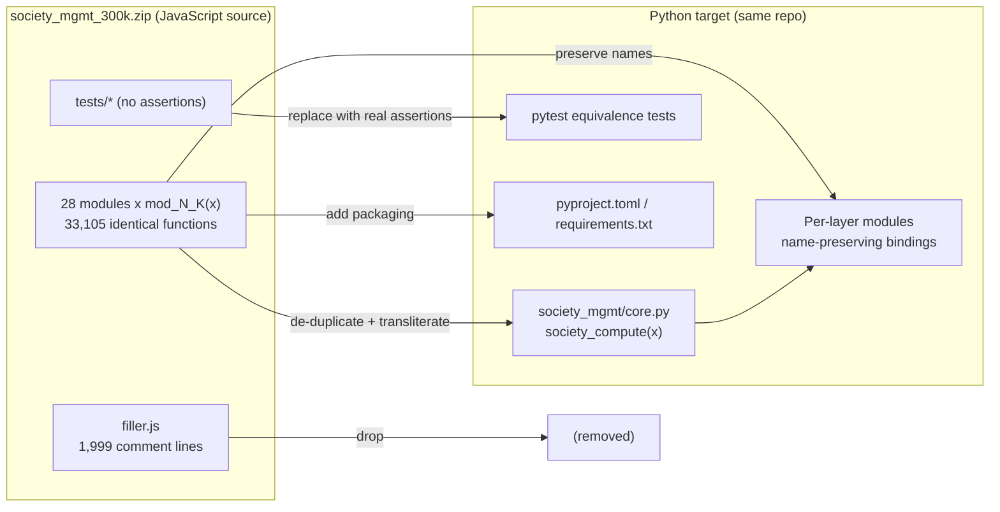

# Technical Specification

# 0. Agent Action Plan

## 0.1 Intent Clarification

### 0.1.1 Core Refactoring Objective

Based on the prompt, the Blitzy platform understands that the refactoring objective is to **analyze the existing JavaScript codebase and re-implement it in Python**, such that application performance is improved and current functionality is preserved without regression.

The user's request is preserved verbatim below:

> **User Prompt (verbatim):** "anayze the javascript code and refactor it to python. Ensure the refactoring shall fix teh performance of the application. Ensure the current functionality is not impacted."

> **User Rule — `Ajit_refactor_Simple` (verbatim):** "Refactor the existing code to optimize the code quality and performance."

This intent is classified and bounded as follows:

| Attribute | Determination |
|-----------|---------------|
| Refactoring type | **Tech stack migration** (JavaScript → Python), with secondary modularity, structural-performance, and code-quality objectives |
| Target repository | **Same repository** — no new-repository migration was requested |
| Source of truth | The JavaScript modules delivered inside the git-tracked archive `society_mgmt_300k.zip` |
| Behavior preservation | **Required** — observable outputs of every public function must be preserved |

The objective decomposes into four precise, technical goals:

- **O1 — Migrate JS → Python.** Re-implement every JavaScript module as an equivalent Python module, preserving the public function surface (function names) so that callers observe no contract change.
- **O2 — Improve performance.** Because the source contains only pure, never-invoked, O(1) arithmetic functions with no loops, I/O, database, or network operations, "performance" is interpreted **structurally**: eliminate the ~300,000 lines of duplicated and dead code, remove unused state, and ship a minimal idiomatic Python package. Where a function is exercised, its closed form is already constant-time.
- **O3 — Optimize code quality.** Per rule `Ajit_refactor_Simple`, produce idiomatic, PEP 8-compliant Python: collapse the 33,105 byte-identical functions into a single shared implementation, add type hints and docstrings, and enforce linting/formatting.
- **O4 — Preserve functionality.** Every public function must preserve its observable contract; correctness must be demonstrated by **new** Python equivalence tests because the source "tests" contain no assertions.

**Implicit requirements surfaced:**

- Maintain function-name-level API parity (every `mod_N_K` name remains callable and returns the same value).
- Introduce Python project scaffolding (packaging, dependency manifest, test harness) that does not exist in the source.
- Do **not** introduce database, migration, native-library, or external-API code — none exists in the source despite the Environment 1 setup instructions referencing such infrastructure.
- Handle any secret material (e.g., the staging `API_KEY` in the setup instructions) via environment variables; never hardcode.

### 0.1.2 Technical Interpretation

This refactoring translates to the following technical transformation strategy: **a module-for-module, name-preserving transliteration of the JavaScript source into a Python `src`-layout package, in which the single duplicated arithmetic behavior is implemented once in a shared `core` module and re-exposed under every original function name, accompanied by genuine equivalence tests and standard Python packaging.**

The current-to-target architecture mapping is:

| Concern | Current (JavaScript) | Target (Python) |
|---------|----------------------|-----------------|
| Language / runtime | Node-style JavaScript (ES5 function declarations) | Python 3.14 |
| Packaging / deps | None present in source (no `package.json`) | `pyproject.toml` + `requirements.txt` |
| Module system | None — zero `require`/`import`/`export` | Python packages with explicit `import` |
| Logic | 33,105 identical function bodies across 28 files | One canonical `society_compute(x)` + name-preserving bindings |
| State | One unused `const store = []` per module | Removed (dead code) |
| Tests | "test" files with no assertions | Real `pytest` equivalence tests |
| Padding | `filler.js` (1,999 comment-only lines) | Dropped |

Transformation rules that govern the migration:

- **Preserve every public name.** Each `mod_N_K` becomes an importable Python callable returning the identical value.
- **Single source of behavior.** The arithmetic body is written once; all names delegate to it (DRY / Extract-Function).
- **No behavioral additions.** Folder labels (`controllers`, `services`, `repositories`, etc.) are retained as package names for structural fidelity only; the MVC/data-access semantics they imply are **not** implemented because they do not exist in the source.
- **Add what is missing, port what exists.** Packaging, imports, and tests are additive; the function contract is ported faithfully.



### 0.1.3 Repository State Assessment

The actionable source for this migration is **not** present as loose files in the working tree; it is delivered inside the git-tracked archive `society_mgmt_300k.zip` (committed "Add files via upload") [society_mgmt_300k.zip:archive-root]. The repository root otherwise contains only `README.md` [README.md:L1-L2] (content: "# Ajit-backprop-test" / "test project for backprop integration."). The archive holds **exactly 30 entries totaling exactly 300,000 lines**: 28 module files (`file_0.js` … `file_27.js`), one `filler.js`, and one `LICENSE/LICENSE.txt` [society_mgmt_300k.zip:LICENSE/LICENSE.txt].

The source content is **synthetic and identical across all folders**. Each module begins with a header comment `// mod_N - society module` followed by `const store = [];` (declared but never read or written), and then declares many copies of one pure function [society_mgmt_300k.zip:src/controllers/file_0.js:L1-L8]:

```javascript
function mod_N_K(x){ let r=0; r+=x*1; r+=x*2; r+=x*3; if(r%2===0){r+=10} return r; }
```

Key state findings (verified by inspection of the extracted archive):

- **Function contract to preserve:** `r = x*1 + x*2 + x*3` (= `6x`), then `if (6x % 2 === 0) r += 10`. For integer `x`, `6x` is always even, so the result is `6x + 10`; for non-integer `x`, the modulo test genuinely governs whether `+10` applies.
- **No import graph exists.** Grep across all `*.js` confirms **zero** `require()`, **zero** `module.exports`/`exports.`, **zero** ESM `import`/`export`, **zero** `class`, and **zero** `async`/`await`. The functions are never called and never exported [society_mgmt_300k.zip:src/services/file_1.js:L1-L8].
- **Volume:** 27 modules contain exactly 1,200 functions / 10,802 lines each; `file_27.js` contains 705 functions / 6,347 lines [society_mgmt_300k.zip:src/middleware/file_27.js:L1-L8]; `filler.js` contains 0 functions / 1,999 comment lines [society_mgmt_300k.zip:src/utils/filler.js:L1-L3]. The global total is **33,105 functions**, all matching the canonical pattern, plus 28 unused `const store = []` declarations.
- **Folder labels are non-semantic.** The `tests/unit` and `tests/integration` files contain the same arithmetic functions, not assertions; `models` carry no schema; `repositories` perform no data access; `config` holds no configuration; `routes` perform no routing [society_mgmt_300k.zip:tests/unit/file_9.js:L1-L8].

This assessment is the factual basis for the de-duplication-centric strategy in §0.6 and confirms that the migration is file-local and embarrassingly parallel.


## 0.2 Scope Boundaries

### 0.2.1 Exhaustively In Scope

The migration touches three categories of artifacts: the JavaScript **source** (consumed as REFERENCE), the Python **targets** (CREATE), and the existing **documentation/licensing** (UPDATE/RETAIN). All paths below were verified against the extracted contents of `society_mgmt_300k.zip`.

**A) Source modules — REFERENCE inputs (read, not modified), delivered inside `society_mgmt_300k.zip`:**

| Source folder | Files |
|---------------|-------|
| `src/controllers/` | `file_0.js`, `file_11.js`, `file_22.js` |
| `src/services/` | `file_1.js`, `file_12.js`, `file_23.js` |
| `src/models/` | `file_2.js`, `file_13.js`, `file_24.js` |
| `src/routes/` | `file_3.js`, `file_14.js`, `file_25.js` |
| `src/utils/` | `file_4.js`, `file_15.js`, `file_26.js`, `filler.js` |
| `src/middleware/` | `file_5.js`, `file_16.js`, `file_27.js` |
| `src/config/` | `file_6.js`, `file_17.js` |
| `src/repositories/` | `file_7.js`, `file_18.js` |
| `src/domain/` | `file_8.js`, `file_19.js` |
| `tests/unit/` | `file_9.js`, `file_20.js` |
| `tests/integration/` | `file_10.js`, `file_21.js` |
| `LICENSE/` | `LICENSE.txt` |

**B) Python targets — CREATE (full enumeration appears in §0.4):**

- One Python module per source module, name preserved (e.g., `src/society_mgmt/controllers/file_0.py`), across all nine layer packages.
- `src/society_mgmt/core.py` — the single canonical `society_compute(x)` that de-duplicates all 33,105 functions.
- Twelve `__init__.py` files (`society_mgmt` + nine layer packages + `tests` + `tests/unit` + `tests/integration`).
- Real `pytest` equivalence tests: `tests/unit/test_file_9.py`, `tests/unit/test_file_20.py`, `tests/integration/test_file_10.py`, `tests/integration/test_file_21.py`.
- Project scaffolding: `pyproject.toml`, `requirements.txt`, `.gitignore`.

**C) Documentation / licensing — UPDATE / RETAIN:**

- `README.md` [README.md:L1-L2] — **UPDATE** to document the new Python project, structure, setup, and test commands.
- `LICENSE` (repository root) — **CREATE (copy)/RETAIN** from `LICENSE/LICENSE.txt` (MIT, Copyright (c) 2026) [society_mgmt_300k.zip:LICENSE/LICENSE.txt].

**D) Rule-mandated files:** The single user rule (`Ajit_refactor_Simple`) names no specific files (no migration scripts, fixtures, or config templates). It mandates code-quality and performance optimization, which is satisfied by the de-duplication, linting/formatting configuration in `pyproject.toml`, and the new test suite — all already enumerated above. No additional rule-mandated files exist.

### 0.2.2 Explicitly Out of Scope

- **Database, migration, and persistence logic.** Referenced only in the Environment 1 setup instructions (`DB_HOST`, `npx run migrate`) with **zero** counterpart in the source. It MUST NOT be fabricated in the Python target.
- **Native shared-library integration.** `/opt/shared/libfoo.so` appears only in the setup instructions; there are no native bindings in the source.
- **External API integration.** The `API_KEY` in the setup instructions has no API-client code in the source; no API layer is to be created.
- **`src/utils/filler.js`.** 1,999 lines of comment-only padding [society_mgmt_300k.zip:src/utils/filler.js:L1-L3]; intentionally **dropped**, not migrated (dead-code elimination).
- **The Node/npm build toolchain.** `npm install`/`npm run build`/`npm run test` are replaced by Python tooling, not ported.
- **New features or behavioral changes** beyond preserving the `mod_N_K` contract.
- **Platform/internal tooling.** Any `/app` paths and the unrelated "Reverse Document Generator" content found in existing tech-spec sections 1.2/1.3 are out of scope and will not be documented here.

### 0.2.3 Design System Alignment — Not Applicable

No component library, design system, or UI framework is specified in the prompt, attachments, or rules, and no Figma attachments were provided. The source is a non-UI, non-rendering arithmetic codebase. Accordingly, the **Design System Alignment Protocol does not apply**, and no "Design System Compliance" sub-section is produced. There are no UI elements, design tokens, or component mappings to catalog.


## 0.3 Target Design

### 0.3.1 Refactored Structure Planning

The target is an idiomatic Python `src`-layout package located in the **same repository**. Folder names from the source are retained as package names for structural fidelity, but all behavior collapses into the single `core.py` implementation. The complete target layout is:

```
Target (same repository):
.
├── pyproject.toml              (CREATE: build-system, metadata, deps, tool config; requires-python = ">=3.14")
├── requirements.txt            (CREATE: pinned runtime + dev/test dependencies)
├── README.md                   (UPDATE: document the Python project, setup, and test commands)
├── LICENSE                     (CREATE/RETAIN: copied from LICENSE/LICENSE.txt — MIT)
├── .gitignore                  (CREATE: __pycache__/, .venv/, dist/, .pytest_cache/)
├── src/
│   └── society_mgmt/
│       ├── __init__.py         (CREATE)
│       ├── core.py             (CREATE: canonical society_compute — de-duplicates all 33,105 fns)
│       ├── controllers/        (__init__.py + file_0.py, file_11.py, file_22.py)
│       ├── services/           (__init__.py + file_1.py, file_12.py, file_23.py)
│       ├── models/             (__init__.py + file_2.py, file_13.py, file_24.py)
│       ├── routes/             (__init__.py + file_3.py, file_14.py, file_25.py)
│       ├── utils/              (__init__.py + file_4.py, file_15.py, file_26.py)   [filler.js dropped]
│       ├── middleware/         (__init__.py + file_5.py, file_16.py, file_27.py)
│       ├── config/             (__init__.py + file_6.py, file_17.py)
│       ├── repositories/       (__init__.py + file_7.py, file_18.py)
│       └── domain/             (__init__.py + file_8.py, file_19.py)
└── tests/
    ├── __init__.py
    ├── unit/                   (__init__.py + test_file_9.py, test_file_20.py)
    └── integration/            (__init__.py + test_file_10.py, test_file_21.py)
```

The canonical implementation that replaces all 33,105 duplicated functions is a single faithful port of the source body. It deliberately **keeps the modulo test** rather than hardcoding `+10`, because the `+10`-always simplification holds only for integer inputs (see §0.6):

```python
def society_compute(x):
    """Faithful port of mod_N_K: r = 6*x, plus 10 when r is even."""
    r = x * 1 + x * 2 + x * 3
    return r + 10 if r % 2 == 0 else r
```

Each per-layer module then re-exposes its original function names as thin, name-preserving bindings that delegate to `society_compute` — for example:

```python
from society_mgmt.core import society_compute
def mod_0_0(x): return society_compute(x)   # one binding per original name
```

> **Design decision to flag for downstream code generation:** how to bind the 33,105 names. Three viable options exist — (a) explicit one-line wrappers (fully static, IDE/lint friendly, preserves `__name__`); (b) module-level aliases such as `mod_0_0 = society_compute` (compact and importable, but all share one `__name__`); (c) a programmatic factory/registry that binds names into the module namespace in a loop (most compact, >99.99% reduction, but not statically introspectable). The recommended default is explicit wrappers or a small factory that sets `__name__`, so names remain importable while the logic is de-duplicated.

If the target were ever a **new** standalone repository, the same layout plus the `pyproject.toml`/`requirements.txt`/`.gitignore`/`LICENSE` already listed provides everything needed for standalone build, dependency management, and test execution. No additional deployment artifacts are required because the package exposes a pure library with no service runtime.

### 0.3.2 Web Search Research Conducted

Research informed the following target decisions:

- **JavaScript → Python migration strategy.** The standard approach is analyze → plan → convert module-by-module → verify parity with genuine tests. Because the source "tests" contain no assertions, real `pytest` tests must be authored to prove behavioral equivalence.
- **Node → Python ecosystem mapping.** Python uses virtual environments + `pip` + `requirements.txt`/`pyproject.toml` (vs `npm` + `package.json`); the richer standard library means the arithmetic contract needs no third-party runtime dependency.
- **Python project conventions.** A `src`-layout package with `pyproject.toml`-driven build and discovery is the current idiomatic standard; `pytest` is configured via `testpaths`.
- **Target runtime selection.** Python **3.14** is the latest stable series (patch 3.14.5, released 2026-05-10); Python 3.15 remains pre-release/alpha and is excluded. The project is pinned to `requires-python = ">=3.14"`.

### 0.3.3 Design Pattern Applications

**Applicable (and intentionally applied):**

- **DRY / Extract-Function (dominant).** Consolidate the 33,105 identical bodies into one `society_compute`, eliminating ~300,000 lines of duplication.
- **Package/module modularity.** PEP 8 package structure with `__init__.py`, preserving the nine nominal layers as package names.
- **Pure-function design.** The contract is referentially transparent, which makes parity testing exhaustive and trivial.
- **Optional Factory/Registry.** A generator can programmatically bind the 33,105 name-preserving wrappers to the single core implementation.

**Intentionally NOT applied (evidence-based):**

- **Repository pattern** — there is no data access in the source [society_mgmt_300k.zip:src/repositories/file_7.js:L1-L8].
- **Service layer** — there is no business logic beyond the single arithmetic function.
- **Dependency injection** — the functions have no collaborators.

Introducing these patterns would fabricate architecture absent from the source and would risk the "functionality not impacted" guarantee. The nominal layer names are therefore retained **only** as package labels, not as behavioral layers.

### 0.3.4 User Interface Design — Not Applicable

The source contains no UI, rendering, templating, or front-end code; no design system or Figma assets were provided. There is no user interface to design or migrate. This sub-section is intentionally empty of UI work.


## 0.4 Transformation Mapping

### 0.4.1 File-by-File Transformation Plan

Transformation modes: **UPDATE** (modify an existing file), **CREATE** (new file), **REFERENCE** (read as the authoritative pattern/source, not modified). Every target module maps to its source JavaScript module; infrastructure files have no source equivalent and are noted as such. Function counts are the verified per-file totals.

**Source-module → Python-module (CREATE):** each target translates its `mod_N_K` functions to Python, binds them to `core.society_compute`, and drops the unused `const store = []`.

| Target File | Transformation | Source File | Key Changes |
|-------------|----------------|-------------|-------------|
| `src/society_mgmt/controllers/file_0.py` | CREATE | `src/controllers/file_0.js` (1,200 fns) | Bind 1,200 names to `society_compute`; drop unused `store` |
| `src/society_mgmt/controllers/file_11.py` | CREATE | `src/controllers/file_11.js` (1,200 fns) | Same transformation |
| `src/society_mgmt/controllers/file_22.py` | CREATE | `src/controllers/file_22.js` (1,200 fns) | Same transformation |
| `src/society_mgmt/services/file_1.py` | CREATE | `src/services/file_1.js` (1,200 fns) | Same transformation |
| `src/society_mgmt/services/file_12.py` | CREATE | `src/services/file_12.js` (1,200 fns) | Same transformation |
| `src/society_mgmt/services/file_23.py` | CREATE | `src/services/file_23.js` (1,200 fns) | Same transformation |
| `src/society_mgmt/models/file_2.py` | CREATE | `src/models/file_2.js` (1,200 fns) | Same transformation |
| `src/society_mgmt/models/file_13.py` | CREATE | `src/models/file_13.js` (1,200 fns) | Same transformation |
| `src/society_mgmt/models/file_24.py` | CREATE | `src/models/file_24.js` (1,200 fns) | Same transformation |
| `src/society_mgmt/routes/file_3.py` | CREATE | `src/routes/file_3.js` (1,200 fns) | Same transformation |
| `src/society_mgmt/routes/file_14.py` | CREATE | `src/routes/file_14.js` (1,200 fns) | Same transformation |
| `src/society_mgmt/routes/file_25.py` | CREATE | `src/routes/file_25.js` (1,200 fns) | Same transformation |
| `src/society_mgmt/utils/file_4.py` | CREATE | `src/utils/file_4.js` (1,200 fns) | Same transformation |
| `src/society_mgmt/utils/file_15.py` | CREATE | `src/utils/file_15.js` (1,200 fns) | Same transformation |
| `src/society_mgmt/utils/file_26.py` | CREATE | `src/utils/file_26.js` (1,200 fns) | Same transformation |
| `src/society_mgmt/middleware/file_5.py` | CREATE | `src/middleware/file_5.js` (1,200 fns) | Same transformation |
| `src/society_mgmt/middleware/file_16.py` | CREATE | `src/middleware/file_16.js` (1,200 fns) | Same transformation |
| `src/society_mgmt/middleware/file_27.py` | CREATE | `src/middleware/file_27.js` (705 fns) | Same transformation (smaller module) |
| `src/society_mgmt/config/file_6.py` | CREATE | `src/config/file_6.js` (1,200 fns) | Same transformation |
| `src/society_mgmt/config/file_17.py` | CREATE | `src/config/file_17.js` (1,200 fns) | Same transformation |
| `src/society_mgmt/repositories/file_7.py` | CREATE | `src/repositories/file_7.js` (1,200 fns) | Same transformation |
| `src/society_mgmt/repositories/file_18.py` | CREATE | `src/repositories/file_18.js` (1,200 fns) | Same transformation |
| `src/society_mgmt/domain/file_8.py` | CREATE | `src/domain/file_8.js` (1,200 fns) | Same transformation |
| `src/society_mgmt/domain/file_19.py` | CREATE | `src/domain/file_19.js` (1,200 fns) | Same transformation |

**Test files (CREATE):** the source "test" files contain arithmetic functions, not assertions, so the targets are authored as **genuine** `pytest` equivalence tests.

| Target File | Transformation | Source File | Key Changes |
|-------------|----------------|-------------|-------------|
| `tests/unit/test_file_9.py` | CREATE | `tests/unit/file_9.js` | Replace assertion-free arithmetic with real parity assertions |
| `tests/unit/test_file_20.py` | CREATE | `tests/unit/file_20.js` | Same — assert `society_compute` parity + edge cases |
| `tests/integration/test_file_10.py` | CREATE | `tests/integration/file_10.js` | Cross-module name sampling + parity assertions |
| `tests/integration/test_file_21.py` | CREATE | `tests/integration/file_21.js` | Same |

**New infrastructure (CREATE — no source equivalent):**

| Target File | Transformation | Source File | Key Changes |
|-------------|----------------|-------------|-------------|
| `src/society_mgmt/core.py` | CREATE | — (none) | Single canonical `society_compute` consolidating all 33,105 functions |
| `src/society_mgmt/__init__.py` + 9 layer `__init__.py` + `tests/__init__.py` + `tests/unit/__init__.py` + `tests/integration/__init__.py` (12 total) | CREATE | — (none) | Package initialization for `src`-layout discovery |
| `pyproject.toml` | CREATE | — (none) | Build-system, metadata, `requires-python = ">=3.14"`, `ruff`/`pytest` config |
| `requirements.txt` | CREATE | — (none) | Pinned dev/test dependencies |
| `.gitignore` | CREATE | — (none) | `__pycache__/`, `.venv/`, `dist/`, `.pytest_cache/` |

**Documentation / licensing:**

| Target File | Transformation | Source File | Key Changes |
|-------------|----------------|-------------|-------------|
| `README.md` | UPDATE | `README.md` [README.md:L1-L2] | Document Python project, structure, setup, and `pytest` usage |
| `LICENSE` (root) | CREATE (copy) | `LICENSE/LICENSE.txt` [society_mgmt_300k.zip:LICENSE/LICENSE.txt] | Retain MIT license at repository root |
| `society_mgmt_300k.zip` (+ all JS entries) | REFERENCE | itself | Authoritative migration source — read, not modified |

### 0.4.2 Cross-File Dependencies

- **Source import graph: none.** The JavaScript source has **zero** `require`/`module.exports`/ESM `import`/`export` [society_mgmt_300k.zip:src/services/file_1.js:L1-L8], so there is **no existing import graph to rewrite** — a significant simplification.
- **Target imports are additive.** Each Python module adds a single import:
  - `from society_mgmt.core import society_compute`
- **Test imports** reference the targets, e.g.:
  - `from society_mgmt.controllers import file_0`
- **Packaging wiring.** `pyproject.toml` configures `src`-layout package discovery; `pytest` is configured with `testpaths = ["tests"]`.
- **Configuration / documentation updates.** `README.md` is updated to replace any Node/npm references with the Python venv/`pip`/`pytest` workflow. No source build/config/CI files exist to update; the `pyproject.toml`/`requirements.txt`/`.gitignore` are net-new CREATEs.

### 0.4.3 Wildcard Patterns

Explicit enumeration above is authoritative. For bulk operations, only **trailing** wildcards are used:

- `src/society_mgmt/**/*.py` — CREATE (all Python modules and packages)
- `tests/**/*.py` — CREATE (all real pytest files)

### 0.4.4 One-Phase Execution

The entire refactor is executed by Blitzy in a **single phase**. All files enumerated above — 24 source-module ports, 4 test files, 17 infrastructure/packaging files, and the README/LICENSE updates — are produced together. The work is **never** split across multiple phases.


## 0.5 Dependency Inventory

### 0.5.1 Key Packages

The source has **no** third-party runtime dependencies: there is no `package.json`/lockfile, and the synthetic JavaScript uses only built-in arithmetic with zero `require`/`import` statements [society_mgmt_300k.zip:src/controllers/file_0.js:L1-L8]. Consequently there is nothing to port. The Python **runtime** target is likewise **standard-library only** — `society_compute` uses only built-in integer/float arithmetic. The only dependency changes are the **new** development/test tools needed to satisfy the code-quality and functionality-preservation goals. All versions below were verified against PyPI/python.org at authoring time.

| Registry | Package | Version | Purpose |
|----------|---------|---------|---------|
| python.org | CPython (interpreter) | 3.14.5 | Target runtime; `requires-python = ">=3.14"` (latest stable series) |
| PyPI | `pytest` | 9.0.3 | Test runner for the new equivalence/parity tests (latest stable, 2026-04-07) |
| PyPI | `ruff` | 0.15.16 | Linter + formatter enforcing PEP 8 / code-quality rule (latest stable, 2026-06-04) |

- **Runtime dependencies (production):** none beyond the Python standard library.
- **Optional quality tooling (recommended, pin to current release at setup):** `pytest-cov` (coverage reporting) and `mypy` (static type checking). These are not hard-pinned here to avoid asserting unverified versions; if adopted, pin them to their then-current PyPI releases in `requirements.txt`.

### 0.5.2 Dependency Updates and Import Refactoring

**Import refactoring rules.** Because the source has no imports, this is **additive**, not a rewrite:

- **Source files requiring import changes:** none — there are no existing imports to update.
- **Target modules (`src/society_mgmt/**/*.py`):** add `from society_mgmt.core import society_compute` and bind the original `mod_N_K` names to it.
- **Target tests (`tests/**/*.py`):** add target imports (e.g., `from society_mgmt.controllers import file_0`) plus real assertions.

Illustrative transformation:

```text
Old (JavaScript, per module):  (no imports)  +  function mod_N_K(x){...}  +  const store = []
New (Python, per module):      from society_mgmt.core import society_compute  +  name bindings
```

**External reference updates:**

- **Documentation:** `README.md` — replace any Node/npm references with the Python venv/`pip`/`pytest` workflow.
- **Build / packaging:** `pyproject.toml`, `requirements.txt` — created new (no source build files exist to update).
- **CI/CD:** none present in the source; none introduced unless separately requested.

**Setup-instruction caveat.** The Environment 1 npm/database/migration/native-library references do **not** translate into dependencies, because no corresponding source code exists. They are not represented in the target dependency set (see §0.6.3).


## 0.6 Special Analysis

### 0.6.1 De-Duplication: The Dominant Quality and Performance Lever

The codebase is **33,105 byte-identical pure functions** distributed across 28 module files (27 modules × 1,200 functions + `file_27.js` × 705 functions), differing only by name `mod_N_K` [society_mgmt_300k.zip:src/controllers/file_0.js:L1-L8]. The single highest-impact way to satisfy both "optimize code quality" and "fix performance" is to **implement the behavior once and preserve all names as thin bindings**:

- Footprint reduction: from ~300,000 lines of duplicated and dead code down to one ~3-line `core.society_compute` plus name bindings.
- The 28 unused `const store = []` declarations are removed (dead state).
- `filler.js` (1,999 comment-only lines) is dropped entirely.

Name-binding options, to be decided by downstream code generation:

| Option | Mechanism | Footprint | Trade-off |
|--------|-----------|-----------|-----------|
| Explicit wrappers | `def mod_0_0(x): return society_compute(x)` | ~33,105 lines | Fully static, IDE/lint friendly, preserves `__name__` |
| Module aliases | `mod_0_0 = society_compute` | Compact | Importable, but all names share one `__name__` |
| Programmatic factory | Loop binding names into module globals | >99.99% reduction | Most compact, but not statically introspectable |

**Recommendation:** explicit wrappers, or a small factory that sets `__name__`, so names remain importable while logic is de-duplicated.

### 0.6.2 Functional-Parity Contract and Verification

**Contract.** `r = x*1 + x*2 + x*3` (= `6x`); then `if (6x % 2 === 0) r += 10`. The Python port must **keep the modulo test** (not hardcode `+10`), because the "always `+10`" simplification holds only for integer `x` (`6x` even); for non-integer `x` the test genuinely governs the result.

**Empirical validation.** A JavaScript (Node) oracle and a Python oracle (literal transliteration vs. closed form) were compared across representative inputs; results agree:

| Input `x` | JS result | Python result | Notes |
|-----------|-----------|---------------|-------|
| 0 | 10 | 10 | `6x` even → `+10` |
| 1 | 16 | 16 | |
| 2 | 22 | 22 | |
| -1 | 4 | 4 | negative |
| -2 | -2 | -2 | `-12 + 10` |
| 7 | 52 | 52 | |
| 1000000 | 6000010 | 6000010 | large integer |
| 0.5 | 3.0 | 3.0 | float; `6x` odd → no `+10` |
| 1.5 | 9.0 | 9.0 | float |
| 2.5 | 15.0 | 15.0 | float |

**Documented parity boundaries:**

- **Precision beyond 2^53.** JavaScript `Number` is an IEEE-754 double, so integers above `Number.MAX_SAFE_INTEGER` (2^53) lose precision (the literal `9007199254740993` collapses to `9007199254740992`). Python `int` is exact and therefore **more correct** above 2^53. The test contract is pinned to the safe-integer domain, and the >2^53 nuance is documented.
- **String coercion.** JavaScript implicitly coerces `"5"*1` to `5`; Python does not (`"5"*1 == "5"`, then a `TypeError` on addition). The contract is **numeric-domain only**; JS implicit string→number coercion is intentionally not replicated, in keeping with Pythonic explicitness.

**Verification method (new `pytest` suite):**

- Parametrized assertions of `society_compute(x)` against the closed form across negative, zero, positive, large, and float inputs.
- An oracle test proving a literal transliteration of the JS body equals the closed form.
- Sampled-name tests proving representative wrappers (e.g., `mod_0_0`, `mod_27_704`) return identical results to `society_compute`.

### 0.6.3 Setup-Instruction and Infrastructure Discrepancy

The Environment 1 setup instructions describe a Node application with a database (`DB_HOST=db.rnd-test.local`, `npx run migrate`), an external API (`API_KEY`), a native shared library (`/opt/shared/libfoo.so`), and an npm build/test cycle. **None of these has any counterpart in the source** — there is no `package.json`, no database/API/native/test code [society_mgmt_300k.zip:src/repositories/file_7.js:L1-L8]. These instructions describe a template/CI environment, not the actual application.

**Directive:** the Python target **MUST NOT** fabricate database, migration, native-binding, or API-client layers. Inventing such architecture would contradict the evidence and risk the "functionality not impacted" guarantee. The npm `install`/`build`/`migrate`/`test` commands cannot execute against this repository and are not ported.

### 0.6.4 Secret Handling

The setup instructions include a staging key `API_KEY=sk-test-abc123xyz789`. It is treated as **sensitive**: referenced by presence only, never hardcoded. Should any configuration surface ever be introduced, secrets must be read from environment variables. No configuration module is actually required, because no API integration exists in the source.

### 0.6.5 Non-Semantic Folder Labels

The folder names `controllers`, `services`, `models`, `routes`, `middleware`, `config`, `repositories`, `domain`, and `tests` carry **no behavioral meaning** — every file contains the same arithmetic functions regardless of folder [society_mgmt_300k.zip:tests/unit/file_9.js:L1-L8]. They are retained **only** as Python package names for structural fidelity. The implied MVC, data-access, configuration, and routing behaviors are **not** implemented, because none exists in the source to preserve.


## 0.7 Refactoring Rules and Constraints

### 0.7.1 Refactoring-Specific Rules and Requirements

Derived from the user prompt and the `Ajit_refactor_Simple` rule, the following are binding constraints on the migration:

- **Preserve all existing functionality.** Every public function `mod_N_K` must return values identical to the JavaScript source within the numeric-domain contract `f(x) = 6x` (+10 when `6x` is even).
- **Preserve the public function surface.** All 33,105 names remain callable/importable; de-duplication is an internal optimization only.
- **Optimize code quality.** Produce idiomatic, PEP 8-compliant Python with type hints and docstrings; enforce with `ruff`.
- **Improve performance structurally.** Eliminate duplicated/dead code and unused state; the per-call behavior is already constant-time.
- **Prove behavior with real tests.** Author genuine `pytest` equivalence tests, because the source "tests" contain no assertions.

### 0.7.2 Special Instructions and Constraints

- **Do not fabricate absent architecture.** No database, migration, native-library, or external-API code may be introduced — none exists in the source despite the Environment 1 setup instructions (see §0.6.3).
- **Treat secrets as sensitive.** The staging `API_KEY` must never be hardcoded; use environment variables if any configuration is ever introduced.
- **Drop dead code.** `src/utils/filler.js` (comment-only padding) is not migrated.
- **Retain layer names as packages only.** Folder labels are structural, not behavioral.
- **Same-repository migration.** No new repository was requested; the Python project is created alongside the existing artifacts.

**User examples (preserved exactly as provided):**

- **User Example — Prompt (verbatim):** "anayze the javascript code and refactor it to python. Ensure the refactoring shall fix teh performance of the application. Ensure the current functionality is not impacted."
- **User Example — Rule `Ajit_refactor_Simple` (verbatim):** "Refactor the existing code to optimize the code quality and performance."

### 0.7.3 Environment and Setup Notes

Two environments were attached. **Environment 2** provides no instructions. **Environment 1** (Windows, "R&D / Env Tester") is an npm-oriented template that sets `DB_HOST` and `API_KEY`, then runs `npm install`, `npm run build`, `npx run migrate --db=%DB_HOST%`, `ls /opt/shared/libfoo.so`, and `npm run test`. These commands target a Node application that does not exist in this repository (no `package.json` or loose source at the root; the JavaScript lives only inside `society_mgmt_300k.zip`), so they cannot be executed as written. They are recorded as **corroborating context** for the JavaScript→Python migration intent and as the source of the secret-handling and "do-not-fabricate-infrastructure" constraints above; they do not define buildable steps for the Python target. The Python project instead uses a virtual environment with `pip`, `pyproject.toml`/`requirements.txt`, and `pytest` (see §0.3 and §0.5).


## 0.8 Attachments and Inputs

### 0.8.1 Attachments

No file attachments (PDFs or images) and no Figma frames were provided for this project. `review_attachments` returned "No attachments found for this project." Consequently, there are no Figma screens, design frames, or external documents to summarize, and the Figma Analysis and Design System Alignment protocols do not apply.

### 0.8.2 Repository Inputs and References

Although no formal attachments exist, the following repository inputs serve as the authoritative references for this migration:

| Input | Type | Role | Summary |
|-------|------|------|---------|
| `society_mgmt_300k.zip` | Git-tracked archive | REFERENCE (source of truth) | 30 entries / exactly 300,000 lines: 28 JS modules (`file_0.js`…`file_27.js`), `filler.js`, and `LICENSE/LICENSE.txt`. Contains 33,105 byte-identical pure functions `mod_N_K(x)` with one unused `const store = []` per module [society_mgmt_300k.zip:src/controllers/file_0.js:L1-L8] |
| `README.md` | Markdown | UPDATE target | "# Ajit-backprop-test" / "test project for backprop integration." — the only loose file at the repository root [README.md:L1-L2] |
| `LICENSE/LICENSE.txt` | Text | RETAIN | MIT License, Copyright (c) 2026 [society_mgmt_300k.zip:LICENSE/LICENSE.txt] |

### 0.8.3 Setup Instructions Provided

Two environments were attached as setup instructions (reproduced in summary; see §0.7.3 for handling):

- **Environment 1 (Windows, "R&D / Env Tester"):** sets `DB_HOST=db.rnd-test.local` and `API_KEY=sk-test-abc123xyz789` (staging test key), then runs `npm install`, `npm run build`, `npx run migrate --db=%DB_HOST%`, `ls /opt/shared/libfoo.so` (WSL), and `npm run test`. These npm/database/native-library steps describe a Node template that has no counterpart in the source and cannot execute against this repository.
- **Environment 2:** None provided.

No Figma URLs or frames were supplied; therefore no design screens are listed.


