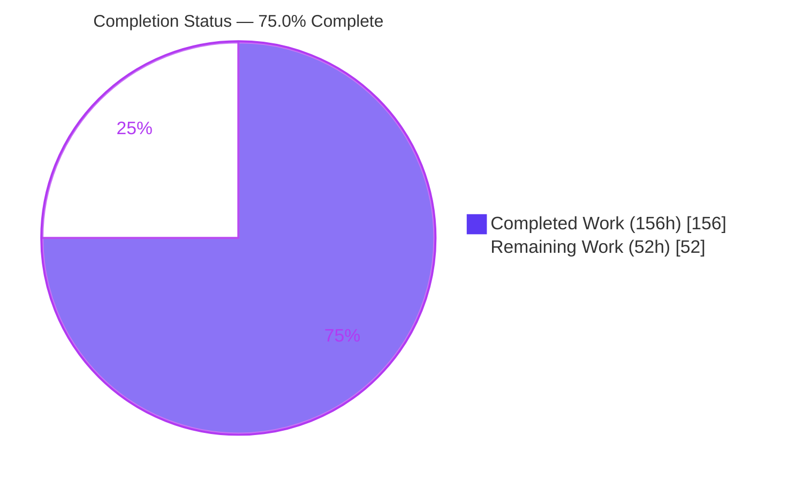
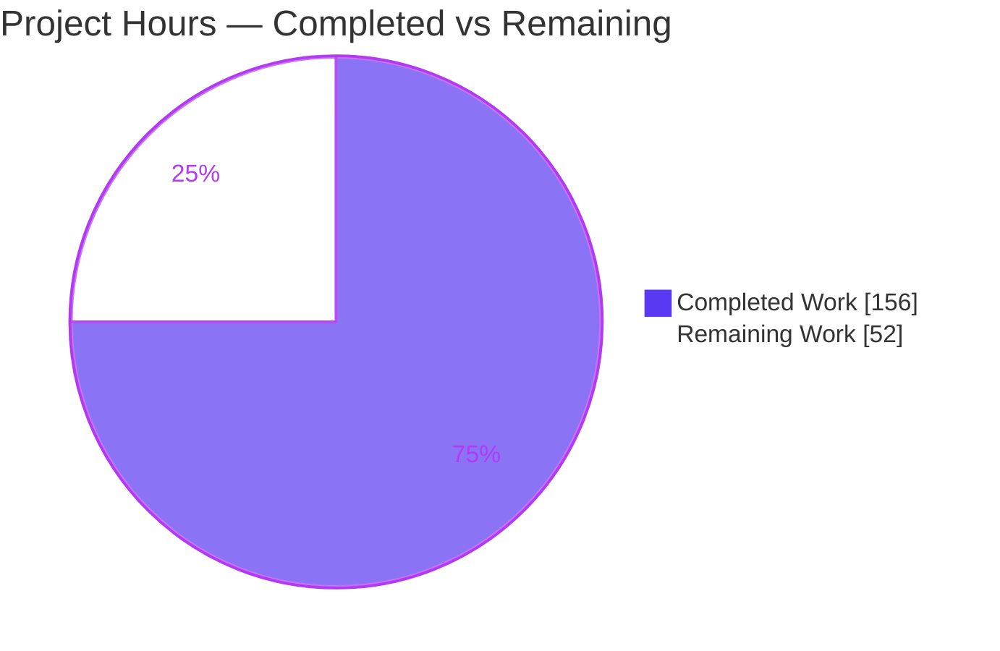
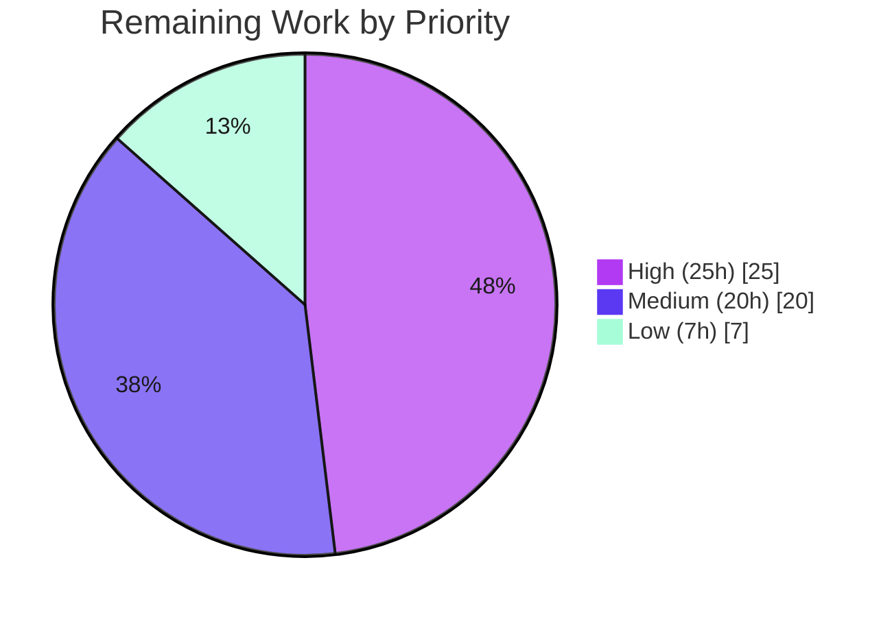

# Blitzy Project Guide — Society Management API (Login & Reporting)

---

## 1. Executive Summary

### 1.1 Project Overview

The Society Management API adds two first-class capabilities — **Login (JWT authentication)** and **Reporting** — to a previously inert layered Node.js scaffold whose source tree contained only synthetic filler. The target users are society administrators and members who authenticate over HTTP and retrieve domain reports (member directory, dues/collection summary, outstanding payments, occupancy) in JSON or CSV. The business impact is transforming a non-runnable scaffold into a working, secured REST API. Technically the scope is a CommonJS Express 5 service spanning every architectural layer (routes, controllers, services, repositories, models, domain, middleware, config, utils) plus a composition root, delivered strictly **additively** so pre-existing repository content is provably unaffected.

### 1.2 Completion Status

The completion percentage is computed using AAP-scoped, hours-based methodology: every deliverable explicitly defined in the Agent Action Plan plus standard path-to-production activities required to deploy it. **All AAP-specified feature work is delivered and independently re-verified as production-ready; the remaining 25% is standard productionization.**



| Metric | Hours |
|--------|-------|
| **Total Hours** | **208** |
| Completed Hours (AI + Manual) | 156 (156 AI + 0 Manual) |
| Remaining Hours | 52 |
| **Percent Complete** | **75.0%** |

> Color key — **Completed = Dark Blue `#5B39F3`**, **Remaining = White `#FFFFFF`**.

### 1.3 Key Accomplishments

- ✅ **Login vertical delivered** — `POST /api/auth/register`, `POST /api/auth/login`, `POST /api/auth/logout`, `GET /api/auth/me` with bcrypt password hashing (async, worker-thread offloaded), signed JWTs with expiry, and account lockout.
- ✅ **Reporting vertical delivered** — `GET /api/reports` catalog and `GET /api/reports/:type` for four report types (members, dues, outstanding, occupancy), every endpoint guarded by the auth middleware, with `?format=csv` export.
- ✅ **Runnable application created** — Express composition root (`src/app.js`), HTTP bootstrap (`src/server.js`), `package.json`, `.env.example`, `.gitignore` — the scaffold had none.
- ✅ **74 automated tests pass (5 suites)** — unit + Supertest integration, exit code 0, re-run reproducibly.
- ✅ **Dependencies clean** — 6 packages at exact AAP-pinned versions, `npm audit` reports 0 vulnerabilities.
- ✅ **Non-regression proven** — additive-only change set; no existing `file_*.js`/`filler.js`/`LICENSE` mutated; README is the sole documentation modify.
- ✅ **Security baseline met** — no plaintext passwords, no hardcoded credentials, generic auth errors, `.env` gitignored, security response headers present.

### 1.4 Critical Unresolved Issues

No release-blocking issues were identified during validation. Every gate passed on first verification and was independently re-confirmed.

| Issue | Impact | Owner | ETA |
|-------|--------|-------|-----|
| _None — zero unresolved compilation errors, test failures, or runtime defects_ | None | — | — |

### 1.5 Access Issues

No access issues identified. The repository, dependency registry (npm), Node.js runtime, and test tooling were all reachable; `npm install` resolved cleanly and the application booted and served live traffic during validation.

| System/Resource | Type of Access | Issue Description | Resolution Status | Owner |
|-----------------|----------------|-------------------|-------------------|-------|
| _None_ | — | No access issues identified | N/A | — |

### 1.6 Recommended Next Steps

1. **[High]** Integrate a persistent database to replace the in-memory store (schema, migrations, connection management) behind the existing repository interface.
2. **[High]** Provision production secrets and environment (strong `JWT_SECRET`, secrets manager) and add a production startup assertion that `JWT_SECRET` is set.
3. **[High]** Stand up a CI/CD pipeline running `npm install` + `npm test` + a coverage gate + automated deploy.
4. **[Medium]** Add deployment packaging (Dockerfile/orchestration, TLS) and security hardening (rate limiting, helmet, CORS).
5. **[Medium]** Wire production observability (log shipping, metrics, monitoring/alerting, readiness/liveness probes).

---

## 2. Project Hours Breakdown

### 2.1 Completed Work Detail

All completed work was performed autonomously by Blitzy agents (40 commits, all `agent@blitzy.com`; the final validator made zero source changes). Each component traces to a specific AAP requirement group.

| Component | Hours | Description |
|-----------|-------|-------------|
| Composition root & manifest | 12 | `package.json` (deps, scripts, `engines`), `src/app.js` (Express assembly, middleware order, security headers, `/health`, 404 JSON, terminal error boundary, exported without `listen`), `src/server.js` (bootstrap), `.env.example`, `.gitignore` (AAP Group 1) |
| Login / Authentication vertical | 52 | `authRoutes`, `authController`, `authService` (credential verification, token issuance, lockout, register TOCTOU fix), `userRepository`, `userModel`, `authMiddleware` (authenticate + requireRole), `authConfig`, `domain/user`, `passwordUtils` + `passwordWorker` (async bcrypt worker-thread pool), `tokenUtils` (AAP Group 2) |
| Reporting vertical | 32 | `reportRoutes`, `reportController` (JSON/CSV negotiation), `reportService` (4 report types incl. derived outstanding view), `reportRepository` (seed data), `reportModel`, `domain/report`, `csvExporter` (RFC 4180) (AAP Group 3) |
| Shared infrastructure | 15 | `errorHandler`, `requestLogger`, `config/index` (dotenv + typed config), `logger`, `validation` (AAP Group 4) |
| Automated test suite | 20 | 74 tests across 5 suites — unit (`authService`, `reportService`, `csvExporter`) + Supertest integration (`authRoutes`, `reportRoutes`) |
| Feature & API documentation | 8 | `docs/features/login.md`, `docs/features/reporting.md`, `docs/api/endpoints.md`, additive `README.md` feature section |
| QA hardening & bug fixes | 12 | Six review checkpoints: hardcoded-admin-password removal, dues-balance override fix, bcrypt test warning, register TOCTOU race, **critical** bcrypt worker-thread offload, JSON 404 envelope, security headers, sanitized report-type errors |
| Dependency research & scope discovery | 5 | Verifying current package versions (Express 5, jsonwebtoken, bcryptjs vs native bcrypt, dotenv, jest, supertest) and security best practices; repository layer/convention analysis |
| **Total Completed** | **156** | |

### 2.2 Remaining Work Detail

Each remaining category is a standard path-to-production activity required to deploy the AAP deliverables. There are **no AAP feature defects** in this list.

| Category | Hours | Priority |
|----------|-------|----------|
| Persistent database integration (replace in-memory store; schema, migrations, connection mgmt) | 16 | High |
| CI/CD pipeline (install + test + coverage gate + automated deploy) | 6 | High |
| Production secrets & environment provisioning (strong `JWT_SECRET`, secrets manager, startup assertion) | 3 | High |
| Containerization & deployment (Dockerfile, orchestration, TLS/reverse proxy) | 6 | Medium |
| Production observability (log shipping, metrics, monitoring/alerting, readiness/liveness probes) | 5 | Medium |
| Security hardening (rate limiting, helmet, CORS allowlist, dependency scanning) | 5 | Medium |
| Test coverage expansion + `coverageThreshold` gate (userRepository, passwordUtils, authMiddleware, errorHandler) | 4 | Medium |
| Staging deployment + integration/UAT validation against real DB | 4 | Low |
| Human code review & production readiness sign-off | 3 | Low |
| **Total Remaining** | **52** | |

### 2.3 Hours Summary

| Bucket | Hours | Share |
|--------|-------|-------|
| Completed (AAP feature scope, fully delivered) | 156 | 75.0% |
| Remaining (path-to-production) | 52 | 25.0% |
| **Total Project** | **208** | **100%** |

Verification: 156 (Section 2.1) + 52 (Section 2.2) = **208** (Section 1.2 Total). Completion = 156 / 208 = **75.0%**.

---

## 3. Test Results

All tests below originate from Blitzy's autonomous validation logs and were independently re-executed via `npm test` (`jest --ci`), exiting 0 with **74 / 74 passing across 5 suites**. The project sets no `coverageThreshold`, so coverage is informational.

| Test Category | Framework | Total Tests | Passed | Failed | Coverage % | Notes |
|---------------|-----------|-------------|--------|--------|-----------|-------|
| Unit — csvExporter | Jest 30.4.2 | 23 | 23 | 0 | 100% (csvExporter.js) | RFC 4180 serialization edge cases |
| Unit — reportService | Jest 30.4.2 | 20 | 20 | 0 | ~98% (reportService.js) | Aggregation, days-overdue, JSON/CSV envelopes |
| Unit — authService | Jest 30.4.2 | 12 | 12 | 0 | ~93% (authService.js) | Hash/compare, token issuance, lockout, getUserById |
| Integration — authRoutes | Jest + Supertest 7.2.2 | 11 | 11 | 0 | 100% (authRoutes.js) | register/login/me + 401 paths |
| Integration — reportRoutes | Jest + Supertest 7.2.2 | 8 | 8 | 0 | 100% (reportRoutes.js) | 401 without token; 200 + CSV with token |
| **Total** | **Jest / Supertest** | **74** | **74** | **0** | **81.76% lines (all files)** | Re-run reproducibly; exit 0 |

**Aggregate coverage (informational):** 81.55% statements · 64.42% branch · 81.51% functions · 81.76% lines. Routes, domain entities, `reportRepository`, `csvExporter`, and `tokenUtils` reach 100% line coverage; the lower-covered modules (`userRepository` 57%, `passwordUtils` 59%, `authMiddleware` 68%, `errorHandler` 70%) are targeted by remaining task M4.

---

## 4. Runtime Validation & UI Verification

The application was booted (`npm start`) and exercised with 14 live endpoint checks — **14 / 14 operational**. There is **no UI** in scope: the deliverable is a headless backend REST API (AAP §0.5.3), so client interaction is programmatic (JSON request/response and CSV download). No screens, components, or visual layouts exist to verify.

**Runtime health**
- ✅ Server boots: `Society Management API listening on port <PORT>`
- ✅ `GET /health` → `200 {"status":"ok"}`
- ✅ Clean shutdown on SIGTERM; port released

**Authentication (Login)**
- ✅ `POST /api/auth/register` → `201`; role forced to `member` (anti-privilege-escalation); no password/hash leaked
- ✅ `POST /api/auth/login` → `200` + signed JWT carrying expiry
- ✅ `GET /api/auth/me` → `401` without token / `200` with Bearer token
- ✅ Wrong password → generic `401 "Invalid email or password"` (no user enumeration)
- ✅ `POST /api/auth/logout` → `200`

**Reporting (auth-guarded)**
- ✅ `GET /api/reports` → `401` without token / `200` catalog of 4 reports with token
- ✅ `GET /api/reports/dues` → `200` JSON (`count=7`, `balance = amountDue − amountPaid`)
- ✅ `GET /api/reports/dues?format=csv` → `200`, `Content-Type: text/csv; charset=utf-8`, `Content-Disposition: attachment; filename="dues-report.csv"`
- ✅ `GET /api/reports/bogus` → `400 "Unknown report type"` (sanitized)

**API integration / cross-cutting**
- ✅ Unknown route → `404` JSON envelope `{"error":{"message":"Not Found","status":404}}`
- ✅ Security headers present: `X-Content-Type-Options: nosniff`, `X-Frame-Options: DENY`, `Cache-Control: no-store`, `Strict-Transport-Security`
- ⚠ No rate limiting / CORS / helmet middleware yet (account lockout present) — see remaining task M3

---

## 5. Compliance & Quality Review

AAP acceptance criteria C1–C6 are cross-mapped below. All six pass; fixes applied during autonomous validation are noted.

| Benchmark | Requirement | Status | Evidence / Fixes Applied |
|-----------|-------------|--------|--------------------------|
| **C1** Non-regression | No existing file mutated | ✅ Pass | `git diff` root→HEAD = 36 additions + README (sole modify). Zero `file_*.js`/`filler.js`/`LICENSE` tracked or changed |
| **C2** Additive wiring | New behavior only via new composition root | ✅ Pass | No src/test module imports any `file_*.js`; all wiring in `src/app.js` |
| **C3** Functional verification | `npm test` passes; key flows work | ✅ Pass | 74/74 tests pass; live login/me/reports/CSV flows verified |
| **C4** Buildability & boot | `npm install` resolves; server boots & serves | ✅ Pass | Install exit 0, 0 vulnerabilities; boots on PORT; `/api/auth/*` + `/api/reports/*` served |
| **C5** Corpus integrity | ~300k-line filler byte-identical | ✅ Pass | Filler lives only in untouched `society_mgmt_300k.zip` (never extracted) |
| **C6** Security baseline | bcrypt-only, signed JWT w/ expiry, generic errors, `.env` not committed | ✅ Pass | `$2b$10$` hashes; HS256 JWT w/ exp; generic 401; `.env` gitignored; `seedDefaultAdmin` requires explicit password (no hardcoded credential, CWE-798) |

**Quality fixes applied autonomously (commit-evidenced):** removal of a hardcoded admin password, dues-balance override correction, bcrypt test-warning cleanup, register TOCTOU race resolution, a **critical** bcrypt worker-thread offload (prevents event-loop blocking under concurrent hashing), JSON 404 envelope, security response headers, and sanitized unknown-report-type errors.

**Outstanding quality items (non-blocking):** raise coverage on `userRepository`/`passwordUtils`/`authMiddleware`/`errorHandler` and add a `coverageThreshold` gate (task M4).

---

## 6. Risk Assessment

| Risk | Category | Severity | Probability | Mitigation | Status |
|------|----------|----------|-------------|-----------|--------|
| In-memory data store — users/report data lost on restart; no durability/HA | Technical | High | High | Integrate persistent DB behind existing repository interface | Open (task H1) |
| Coverage gaps + no `coverageThreshold` gate | Technical | Low-Med | Medium | Expand tests; add coverage gate | Open (task M4) |
| bcrypt worker-thread pool throughput under high concurrent load unvalidated | Technical | Low | Low-Med | Load test in staging | Open (task L1) |
| `JWT_SECRET` warns (not throws) when unset — risk of weak/undefined secret in prod | Security | High | Medium | Secrets manager + production startup assertion; documented in `.env.example` | Open (task H3) |
| No rate limiting / helmet / CORS policy (lockout + manual security headers present) | Security | Medium | Medium | Add express-rate-limit, helmet, CORS allowlist | Open (task M3) |
| Stateless JWT — no server-side revocation; logout is client-side | Security | Low-Med | Low | Short TTL (1h) already; optional token blocklist | Accepted |
| No CI/CD pipeline — manual build/test/deploy, no automated gate | Operational | Medium | Medium | Add CI workflow with test + coverage gate | Open (task H2) |
| No containerization/deploy manifests or TLS termination | Operational | Medium | Medium | Add Dockerfile/orchestration + TLS | Open (task M1) |
| Console-only logging; no metrics/alerting; `/health` not wired to probes | Operational | Medium | Medium | Integrate observability stack | Open (task M2) |
| Persistence integration untested against a real DB | Integration | Medium | Medium | Integration tests vs real DB in staging | Open (task L1) |
| Production env/secrets not yet provisioned | Integration | Medium | High | Provision env + secrets manager | Open (task H3) |
| No external IdP (OAuth/SSO) — by AAP design (local JWT only) | Integration | Low | Low | Out of AAP scope; future enhancement | Accepted |

---

## 7. Visual Project Status

**Project hours breakdown** (Completed = Dark Blue `#5B39F3`, Remaining = White `#FFFFFF`):



**Remaining hours by priority** (sums to 52h, matching Section 2.2):



| Priority | Remaining Hours |
|----------|-----------------|
| High | 25 |
| Medium | 20 |
| Low | 7 |
| **Total** | **52** |

> Integrity: "Remaining Work" = **52h** here equals Section 1.2 Remaining Hours and the Section 2.2 "Hours" column sum.

---

## 8. Summary & Recommendations

**Achievements.** The project is **75.0% complete** (156 of 208 hours). The entire AAP-specified feature scope — the Login authentication vertical, the Reporting vertical, the runnable Express composition root, shared infrastructure, 74 automated tests, and documentation — is delivered and was independently re-verified as production-ready across five validation gates (dependencies, compilation, tests, runtime, file integrity). All six AAP acceptance criteria (C1–C6) are satisfied, and the change set is provably non-regressive.

**Remaining gaps.** The remaining 25% (52 hours) is entirely standard **productionization**, not feature work or defect remediation. The critical path is: (1) replace the in-memory store with a persistent database, (2) provision production secrets/environment with a startup assertion on `JWT_SECRET`, and (3) establish a CI/CD pipeline — followed by containerization, observability, security hardening, coverage expansion, staging/UAT, and a human sign-off.

**Critical path to production.** H1 (database) → H3 (secrets/env) → H2 (CI/CD) → M1–M4 (deploy/observability/hardening/coverage) → L1 (staging/UAT) → L2 (sign-off).

**Production readiness assessment.** The codebase is **feature-complete and demonstrably runnable** today against an in-memory store. It is **not yet production-deployable** for durable, multi-instance use until persistence, secrets management, and deployment automation are in place. Confidence in the completed work is **High** (independently re-verified); confidence in the remaining estimate is **Medium-High** (well-scoped, standard activities).

| Success Metric | Status |
|----------------|--------|
| AAP features delivered | ✅ 100% (Login + Reporting) |
| Automated tests passing | ✅ 74 / 74 |
| Dependency vulnerabilities | ✅ 0 |
| Non-regression (C1–C6) | ✅ All satisfied |
| Production infrastructure | ⚠ Pending (52h) |

---

## 9. Development Guide

> All commands below were executed and verified during this assessment on Node v20.20.2 / npm 11.1.0.

### 9.1 System Prerequisites

- **Node.js ≥ 18** (`engines.node`); validated on **v20.20.2**. Active LTS (22.x+) recommended.
- **npm** (bundled with Node; validated on 11.1.0).
- **OS**: Linux/macOS/Windows. No native build toolchain required — `bcryptjs` is pure JS and the project has **no transpile/build step** (pure CommonJS).
- **No external services** required for development or tests (in-memory data store).

### 9.2 Environment Setup

```bash
# From the repository root
cp .env.example .env
# Edit .env and set a strong secret (example generates 48 random bytes as hex):
#   JWT_SECRET=$(head -c48 /dev/urandom | od -An -tx1 | tr -d ' \n')
```

`.env` variables (documented in `.env.example`):

```bash
JWT_SECRET=change_me_to_a_long_random_secret   # REQUIRED in any real environment (no default)
JWT_EXPIRES_IN=1h                              # token lifetime
BCRYPT_ROUNDS=10                               # password hashing cost
PORT=3000                                      # HTTP port
```

> `.env` is gitignored — never commit it. Only `.env.example` is tracked.

### 9.3 Dependency Installation

```bash
npm install
# Expected: "up to date" / "added N packages", exit 0, 0 vulnerabilities (393 packages audited)
```

### 9.4 Run the Test Suite

```bash
npm test          # jest --ci
# Expected:
#   Test Suites: 5 passed, 5 total
#   Tests:       74 passed, 74 total
# No .env is required to run tests.
```

### 9.5 Application Startup

```bash
npm start         # node src/server.js  (production-style)
npm run dev       # node --watch src/server.js  (auto-reload during development)
# Expected log: "Society Management API listening on port 3000"
```

### 9.6 Verification & Example Usage

```bash
# 1) Health check
curl -s http://localhost:3000/health
#   -> {"status":"ok"}

# 2) Register a member (role is forced to "member")
curl -s -X POST http://localhost:3000/api/auth/register \
  -H 'Content-Type: application/json' \
  -d '{"email":"jane@society.local","password":"S3curePass!","name":"Jane Member"}'
#   -> 201 {"user":{"id":"...","email":"jane@society.local","role":"member",...}}

# 3) Log in and capture the JWT
TOKEN=$(curl -s -X POST http://localhost:3000/api/auth/login \
  -H 'Content-Type: application/json' \
  -d '{"email":"jane@society.local","password":"S3curePass!"}' \
  | sed -E 's/.*"token":"([^"]+)".*/\1/')

# 4) Call a protected endpoint
curl -s http://localhost:3000/api/auth/me -H "Authorization: Bearer $TOKEN"
#   -> 200 {"user":{...}}

# 5) List report catalog
curl -s http://localhost:3000/api/reports -H "Authorization: Bearer $TOKEN"
#   -> {"reports":[{"type":"members",...},{"type":"dues",...},{"type":"outstanding",...},{"type":"occupancy",...}]}

# 6) Dues report as JSON, then as CSV
curl -s "http://localhost:3000/api/reports/dues" -H "Authorization: Bearer $TOKEN"
curl -s "http://localhost:3000/api/reports/dues?format=csv" -H "Authorization: Bearer $TOKEN"
#   CSV -> unitNumber,memberName,period,amountDue,amountPaid,balance
#          A-101,Asha Rao,2026-05,2500,2500,0
```

### 9.7 Troubleshooting

| Symptom | Cause | Resolution |
|---------|-------|-----------|
| `[config] JWT_SECRET is not set` warning | No `JWT_SECRET` in env | Harmless for tests; **set `JWT_SECRET`** before `npm start` in any real environment |
| Error when requiring `passwordWorker.js` directly | It is a worker-thread guard (by design) | Do not require it on the main thread; use `passwordUtils` instead |
| `EADDRINUSE` on startup | Port already in use | Change `PORT` in `.env` |
| `401` on `/api/reports` or `/api/auth/me` | Missing/expired Bearer token | Re-login to obtain a fresh JWT and send `Authorization: Bearer <token>` |
| `400 "Unknown report type"` | Unsupported `:type` | Use one of `members`, `dues`, `outstanding`, `occupancy` |

---

## 10. Appendices

### Appendix A — Command Reference

| Command | Purpose |
|---------|---------|
| `npm install` | Install dependencies (0 vulnerabilities) |
| `npm test` | Run Jest suite in CI mode (`jest --ci`) — 74 tests |
| `npm start` | Start server (`node src/server.js`) |
| `npm run dev` | Start with auto-reload (`node --watch src/server.js`) |
| `node --check <file>` | Syntax-check a source file (all 30 pass) |
| `npm audit` | Vulnerability scan (0 found) |

### Appendix B — Port Reference

| Port | Service | Configurable Via |
|------|---------|------------------|
| 3000 | Society Management API (default) | `PORT` in `.env` |

### Appendix C — Key File Locations

| Path | Role |
|------|------|
| `src/server.js` | HTTP bootstrap / entry point (`main`) |
| `src/app.js` | Express composition root (router & middleware mounting) |
| `src/config/index.js`, `src/config/authConfig.js` | Runtime & auth configuration |
| `src/routes/authRoutes.js`, `src/routes/reportRoutes.js` | Endpoint definitions |
| `src/services/authService.js`, `src/services/reportService.js` | Business logic |
| `src/middleware/authMiddleware.js` | JWT authenticate + requireRole guard |
| `src/utils/passwordUtils.js`, `src/utils/passwordWorker.js` | Async bcrypt (worker-thread pool) |
| `tests/unit/`, `tests/integration/` | 5 test suites (74 tests) |
| `docs/api/endpoints.md`, `docs/features/*.md` | API & feature documentation |
| `.env.example` | Environment variable template |

### Appendix D — Technology Versions

| Technology | Version | Type |
|------------|---------|------|
| Node.js | ≥ 18 (validated v20.20.2) | Runtime |
| express | 5.2.1 | Runtime dep |
| jsonwebtoken | 9.0.3 | Runtime dep |
| bcryptjs | 3.0.3 | Runtime dep |
| dotenv | 17.4.2 | Runtime dep |
| jest | 30.4.2 | Dev dep |
| supertest | 7.2.2 | Dev dep |

### Appendix E — Environment Variable Reference

| Variable | Required | Default | Purpose |
|----------|----------|---------|---------|
| `JWT_SECRET` | Yes (prod) | _none_ | Secret used to sign/verify JWTs (warns if unset) |
| `JWT_EXPIRES_IN` | No | `1h` | JWT lifetime |
| `BCRYPT_ROUNDS` | No | `10` | bcrypt cost factor |
| `PORT` | No | `3000` | HTTP listen port |
| `NODE_ENV` | No | `development` | Environment mode |

### Appendix F — Developer Tools Guide

- **Test runner**: Jest 30 in `--ci` mode (no watch). Add `--coverage` for the coverage report; add a `coverageThreshold` to enforce a gate (remaining task M4).
- **HTTP integration**: Supertest drives the exported `app` in-process — no live port needed in tests.
- **Syntax check without running**: `node --check <file>` (all 30 tracked `.js` files pass).
- **Manual API exploration**: `curl` examples in §9.6; the in-memory store reseeds on each boot.

### Appendix G — Glossary

| Term | Definition |
|------|------------|
| AAP | Agent Action Plan — the authoritative requirement specification for this project |
| Composition root | `src/app.js`, the single place where routers and middleware are wired |
| In-memory store | Volatile `const store = []` data layer; non-durable, replaced by a real DB in production |
| Lockout | Account protection that blocks logins after repeated failures |
| Non-regression | The additive-only guarantee that pre-existing files are unchanged |
| TOCTOU | Time-of-check-to-time-of-use race (resolved in `register`) |
| Worker-thread pool | Off-main-thread bcrypt execution preventing event-loop blocking |

---

*Completed work shown in Dark Blue `#5B39F3`; remaining work in White `#FFFFFF`, consistent with Blitzy brand colors throughout.*