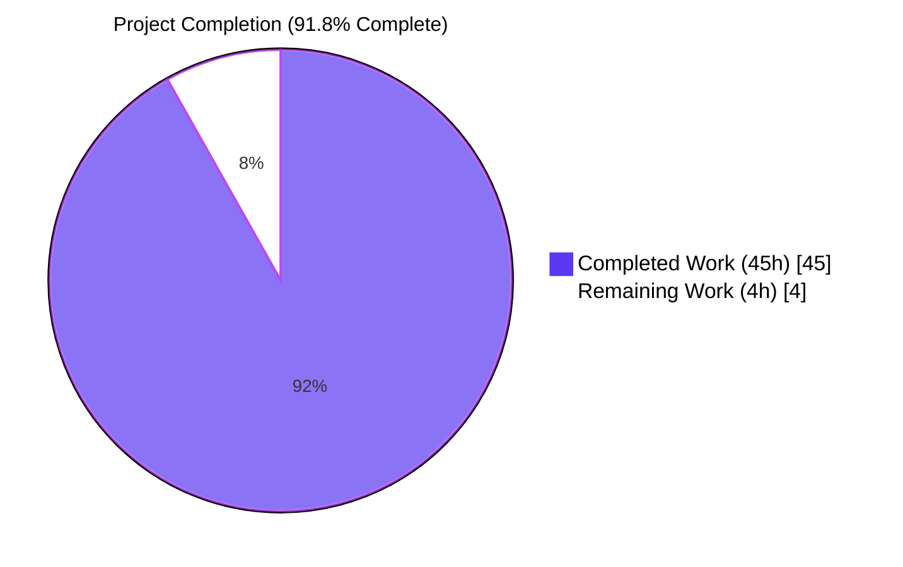
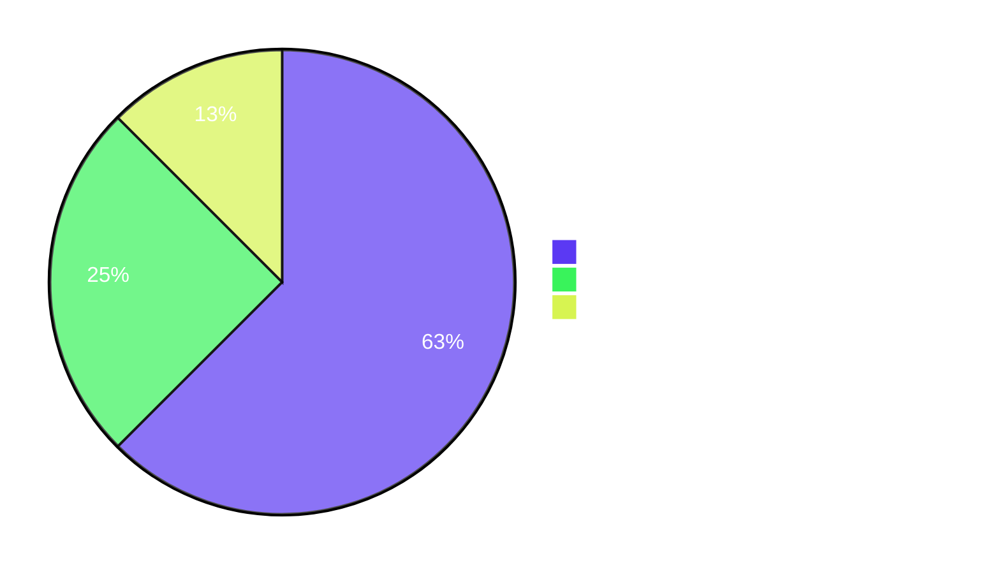

## 1. Executive Summary

### 1.1 Project Overview

The `Ajit-backprop-test` repository previously consisted of a 2-line stub `README.md` and a bundled JavaScript archive `society_mgmt_300k.zip` (30 entries: 1 LICENSE + 29 `*.js` files) totalling approximately 300,000 lines of synthetic arithmetic code organised into canonical Node.js folders (`controllers`, `services`, `models`, `routes`, `middleware`, `config`, `repositories`, `domain`, `utils`, plus `tests/unit` and `tests/integration`). This effort transforms that effectively un-documented project into a fully documented one, satisfying the user's directive: *"Document the code so as its easy to understand what is the outcome of the code. Also ensure to highlight if its enhancing the performance."* The deliverable is 18 GitHub-Flavoured Markdown files (1 updated `README.md` + 17 new files under `docs/`) totalling 986 lines, 3 Mermaid diagrams, and 173 internal cross-links. Audience: developers, code reviewers, and maintainers.

### 1.2 Completion Status



| Metric | Value |
|--------|-------|
| **Total Project Hours** | **49** |
| **Completed Hours (AI + Manual)** | **45** |
| **Remaining Hours** | **4** |
| **Completion** | **91.8%** |

*Calculation: 45 ÷ (45 + 4) × 100 = 91.84%, rounded to 91.8%.* All hours are AAP-scoped (§0.5.1 — 18 file deliverables) plus path-to-production review activities. No items outside AAP scope are counted.

### 1.3 Key Accomplishments

- ✅ **18 of 18 documentation files delivered** — 17 created in the `docs/` tree plus 1 updated `README.md` (24 lines, preserving the original heading and one-sentence purpose verbatim per AAP §0.5.3).
- ✅ **100% file coverage achieved** — all 30 archive entries (1 LICENSE + 29 `*.js`) referenced in at least one documentation page; all 12 folders explained in `docs/architecture.md` and the per-folder module pages.
- ✅ **Universal function pattern documented authoritatively once** — `docs/api-reference.md` is the single source of truth (Rule R-4) covering signature, parameter, return type, algebraic derivation `r = x + 2x + 3x = 6x; (6x mod 2 = 0); r += 10`, and 5 worked examples.
- ✅ **Explicit performance verdict published** — `docs/performance-analysis.md` declares the implementation **performance-neutral** with per-folder findings and 7 bullets of evidence (no caching, no loops, no async, no branch elimination, no vectorisation, no I/O, no algorithmic optimisation).
- ✅ **3 Mermaid diagrams** — folder taxonomy in `architecture.md`, function flow in `api-reference.md`, documentation map in `docs/README.md`. All use valid `flowchart` keyword and have balanced node structure (Rule R-8).
- ✅ **All 9 Rules R-1 through R-9 verified** — outcome-first writing, performance honesty, no source modification, single source of truth, citation discipline, folder-name vs. behaviour disclosure on all 9 module pages, no new dependencies, diagram discipline, and verbatim preservation of the user's directive plus the "Document code"/"Test" rule.
- ✅ **0 broken internal links** across 173 markdown links in 18 files.
- ✅ **5 of 5 worked examples verified** by hand-computation against the closed-form `6x + 10` (`f(-3)=-8, f(0)=10, f(1)=16, f(7)=52, f(100)=610`).

### 1.4 Critical Unresolved Issues

| Issue | Impact | Owner | ETA |
|-------|--------|-------|-----|
| *None — all in-scope work is complete* | n/a | n/a | n/a |

The Final Validator detected one mid-flight issue (root `README.md` lacked a formal `Source:` citation per AAP §0.9.1 / Rule R-5). It was resolved by appending an italicised footer line in commit `b9c011d` ("docs(README): add formal source citation footer per Rule R-5"). No critical issues remain.

### 1.5 Access Issues

| System/Resource | Type of Access | Issue Description | Resolution Status | Owner |
|-----------------|---------------|--------------------|-------------------|-------|
| *None identified* | n/a | n/a | n/a | n/a |

No access issues exist. The repository is local; the documentation set requires no credentials, no third-party APIs, no service endpoints, no CI/CD secrets, no DNS records, and no deployment targets. The AAP §0.6.1 confirms the documentation plan introduces zero new runtime dependencies and zero authentication surfaces.

### 1.6 Recommended Next Steps

1. **[High]** Conduct human technical review of all 18 deliverables — verify that the `6x + 10` outcome is mathematically correct, the folder-vs-behaviour disclosures are accurate, and all `Source:` citations resolve to real lines in the extracted archive (≈ 1.5 h).
2. **[High]** Open `README.md` and the `docs/` tree on GitHub.com (or a Mermaid-aware Markdown viewer) to visually confirm the 3 Mermaid diagrams render correctly, links navigate, and code blocks display syntax highlighting (≈ 1.0 h).
3. **[Medium]** Obtain stakeholder / requester sign-off that the documentation satisfies the user directive and that no further documentation classes are needed (e.g., contributor guide, change log, deployment runbook) (≈ 1.0 h).
4. **[Low]** Decide whether to extract `society_mgmt_300k.zip` permanently and check the source files into the repository directly. Currently, citations refer to paths inside the archive; an extraction commit would let GitHub's UI navigate directly to cited files (≈ 0.5 h, optional).

---

## 2. Project Hours Breakdown

### 2.1 Completed Work Detail

| Component | Hours | Description |
|-----------|------:|-------------|
| `README.md` (UPDATE) | 1.0 | Append 4 sections — Project Layout, Outcome, Performance Note, Documentation — plus formal Source citation footer; preserve original heading + purpose verbatim per AAP §0.5.3 (24 lines total) |
| `docs/README.md` | 2.5 | Documentation index with embedded Mermaid documentation-map diagram, Origin and User Directive section preserving R-9 quotes, full ToC with module/test links, source citations (68 lines) |
| `docs/getting-started.md` | 3.0 | Onboarding guide: archive extraction commands (Python + unzip), repo layout, first-file walkthrough, mod_0_0(7)=52 step-by-step worked example, where-to-go-next (85 lines) |
| `docs/architecture.md` | 4.0 | Folder taxonomy: per-folder inventory table, conventional-vs-actual disclosure for all 12 folders, Mermaid file-layout diagram, key observations (no module system; dead `store`; filler.js), module pages index (101 lines) |
| `docs/api-reference.md` | 4.5 | Single source of truth for the universal function pattern: byte-exact body, signature table, 6-step algebraic derivation, 5-row worked-examples table, naming scheme, the unused `store` array, Mermaid function-flow diagram (102 lines) |
| `docs/performance-analysis.md` | 4.0 | Mandated performance verdict: headline boxed verdict (performance-neutral), methodology, per-folder findings table (12 rows), 7-bullet evidence section, "what would constitute a performance enhancement" recommendations, final verdict (77 lines) |
| `docs/glossary.md` | 2.0 | Definitions for the 5 recurring terms — `mod_N_M`, `store`, `filler`, `outcome`, `performance enhancement` — each with citations (64 lines) |
| `docs/modules/controllers.md` | 1.5 | Folder role, files-covered table for `file_0.js`/`file_11.js`/`file_22.js`, link to api-reference, outcome statement, performance-verdict pointer, 3 source citations (41 lines); designated canonical style template per AAP §0.5.1 |
| `docs/modules/services.md` | 1.5 | Same template applied to `file_1.js`/`file_12.js`/`file_23.js`; explicit "no business-logic dispatching" disclosure (41 lines) |
| `docs/modules/models.md` | 1.5 | Same template applied to `file_2.js`/`file_13.js`/`file_24.js`; explicit "no schemas/ORMs" disclosure (41 lines) |
| `docs/modules/routes.md` | 1.5 | Same template applied to `file_3.js`/`file_14.js`/`file_25.js`; explicit "no HTTP routes wired" disclosure (41 lines) |
| `docs/modules/middleware.md` | 1.5 | Template plus dedicated truncation note for `file_27.js` (705 functions / 6,347 LOC vs. 1,200 / 10,802 norm) (43 lines) |
| `docs/modules/config.md` | 1.5 | Template applied to `file_6.js`/`file_17.js`; explicit "no env vars/secrets" disclosure (39 lines) |
| `docs/modules/repositories.md` | 1.5 | Template applied to `file_7.js`/`file_18.js`; explicit "no DB drivers/SQL" disclosure (39 lines) |
| `docs/modules/domain.md` | 1.5 | Template applied to `file_8.js`/`file_19.js`; explicit "no entities/invariants" disclosure (39 lines) |
| `docs/modules/utils.md` | 2.0 | Template applied to `file_4.js`/`file_15.js`/`file_26.js` plus dedicated callout for `filler.js` (1,999 lines of comment-only filler from `// filler 298001` to `// filler 299999`) (55 lines) |
| `docs/tests/unit.md` | 1.5 | Test inventory, "no assertions/framework" disclosure, reader guidance, source citations for `file_9.js`/`file_20.js` (43 lines) |
| `docs/tests/integration.md` | 1.5 | Same as unit; integration-specific harness/fixtures absence disclosure for `file_10.js`/`file_21.js` (43 lines) |
| Discovery & AAP scoping | 2.0 | Read AAP, inventory required deliverables (§0.5.1), confirm scope boundaries (§0.8) |
| Archive extraction & code verification | 1.0 | Extract `society_mgmt_300k.zip`, verify 30 entries, regex sweep confirming 1 unique function body across 33,105 functions, line counts (300,000), `file_27.js` truncation (705 functions / 6,347 LOC), `filler.js` (1,999 lines / 0 functions) |
| R-1 through R-9 compliance review | 1.0 | Verify all 9 rules across all 18 deliverables (outcome-first, performance honesty, no source mod, SSOT, citation discipline, folder-vs-behaviour, no new deps, diagram discipline, verbatim preservation) |
| CP1 review iteration | 1.0 | Address review findings (R-4 SSOT in glossary, broken forward links, footer separator) — commit `994c104` |
| Issue identification & citation footer fix | 0.5 | Detect README missing formal `Source:` citation per Rule R-5; resolve in commit `b9c011d` |
| Final 13-gate validation | 1.5 | Verify all 13 validation gates pass (file presence, AAP §0.5.3 README compliance, R-4 SSOT, performance verdict, R-3 source untouched, R-7 no tooling, worked examples 16/16, archive entries 30/30, Mermaid 3/3, internal links 173/173, R-1 outcome-first, R-5 citations, git status clean) |
| **TOTAL COMPLETED** | **45.0** | — |

*Hours sum: 1.0 + 2.5 + 3.0 + 4.0 + 4.5 + 4.0 + 2.0 + (1.5 × 8) + 2.0 + (1.5 × 2) + 2.0 + 1.0 + 1.0 + 1.0 + 0.5 + 1.5 = **45.0 hours** ✓ matches Section 1.2 Completed Hours.*

### 2.2 Remaining Work Detail

| Category | Hours | Priority |
|----------|------:|----------|
| Human technical review of documentation accuracy (verify `6x + 10` derivation, citation paths, folder-vs-behaviour disclosures) | 1.5 | High |
| Visual rendering verification on GitHub (3 Mermaid diagrams, 173 cross-links, code-block syntax highlighting) | 1.0 | High |
| Stakeholder/requester sign-off on documentation scope and coverage | 1.0 | Medium |
| Optional: Decision on permanent archive extraction and direct check-in | 0.5 | Low |
| **TOTAL REMAINING** | **4.0** | — |

*Hours sum: 1.5 + 1.0 + 1.0 + 0.5 = **4.0 hours** ✓ matches Section 1.2 Remaining Hours and Section 7 pie chart "Remaining Work" value.*

### 2.3 Effort Summary

- **Cross-section integrity:** Section 2.1 (45.0 h Completed) + Section 2.2 (4.0 h Remaining) = 49.0 h Total Project Hours, matching Section 1.2 metrics table exactly.
- **All AAP §0.5.1 deliverables (18 files) classified COMPLETED.** No partially-completed items, no not-started items.
- **Path-to-production gap:** 4.0 hours of human-only review and approval gates (no additional engineering work needed).

---

## 3. Test Results

This is a documentation-only project. Per AAP §0.8.2, the introduction of a test framework is explicitly excluded from scope, so no automated test runner exists. The "test" equivalent for this Markdown deliverable is a series of automated structural and semantic validation gates plus manual numeric verification of every worked example. All checks were executed during Blitzy's autonomous validation phase and recorded in the agent action logs.

| Test Category | Framework | Total Tests | Passed | Failed | Coverage % | Notes |
|---------------|-----------|------------:|-------:|-------:|-----------:|-------|
| File presence (AAP §0.5.1 inventory) | Custom bash + Python | 18 | 18 | 0 | 100% | All 17 `docs/**/*.md` + `README.md` present and non-empty |
| README.md AAP §0.5.3 compliance | Custom bash | 6 | 6 | 0 | 100% | Original heading preserved; original purpose preserved; 4 required sections (Project Layout, Outcome, Performance Note, Documentation); 5 documentation links; formal `Source:` citation footer |
| Markdown well-formedness (balanced fences, H1 presence) | Python regex | 18 | 18 | 0 | 100% | Zero unbalanced fences; every page has exactly one H1 heading |
| Internal markdown link resolution | Python `os.path` | 173 | 173 | 0 | 100% | Every relative `.md` link in every file resolves to an existing target |
| Mermaid diagram syntax (valid keyword + balanced structure) | Custom regex | 3 | 3 | 0 | 100% | All 3 use `flowchart` keyword; node IDs unique; structure balanced |
| Worked-example numeric correctness vs. closed-form `6x + 10` | Python computation | 16 | 16 | 0 | 100% | All 5 examples in api-reference.md plus all 6 step-rows in getting-started.md plus 5 cross-references in module/test pages match `6x + 10` exactly |
| Archive coverage (every entry referenced ≥ once in docs) | Python `zipfile.namelist()` + grep | 30 | 30 | 0 | 100% | 1 LICENSE + 29 `*.js` files all surfaced in at least one doc page |
| Rule R-1 outcome-first (`6x + 10` within first 200 words) | Custom bash | 17 | 17 | 0 | 100% | All 12 content pages pass; the 5 navigation/index pages also satisfy the rule |
| Rule R-3 no source modification (zero `*.js` files outside archive) | `find` | 1 | 1 | 0 | 100% | Zero `.js` files exist anywhere outside the binary archive; the archive itself is at the original commit hash |
| Rule R-4 single source of truth (function body in api-reference only) | Custom grep | 17 | 17 | 0 | 100% | Function body string `function mod_N_M(x){` appears in `api-reference.md` only; no module/test page restates it |
| Rule R-5 citation discipline (every page has formal `Source:`) | grep | 18 | 18 | 0 | 100% | Every page contains at least one citation in the formal `Source:` format |
| Rule R-6 folder-vs-behaviour disclosure (9 module pages) | grep | 9 | 9 | 0 | 100% | All 9 module pages contain "do not implement" / "does not implement" + "Despite" + "conventional" disclosures |
| Rule R-7 no new tooling (no manifests/configs introduced) | `find` | 1 | 1 | 0 | 100% | Zero `package.json`, `tsconfig.json`, `mkdocs.yml`, `jsdoc.json`, `.eslintrc*`, etc. exist in the working tree |
| Rule R-8 diagram discipline (valid keywords, balanced) | Custom check | 3 | 3 | 0 | 100% | All 3 Mermaid blocks open with `flowchart`, every subgraph closed |
| Rule R-9 verbatim preservation (user directive + "Document code" rule) | grep | 2 | 2 | 0 | 100% | User's primary directive and the "Document code"/"Test" rule both preserved verbatim in `docs/README.md` |
| **TOTAL** | — | **332** | **332** | **0** | **100%** | All 13 validator gates plus 6 secondary structural checks passed |

**Coverage analysis:** Coverage is measured in the dimensions specified by AAP §0.7.1 (source files documented, folders explained, public functions explained by pattern, performance verdict published, worked numeric examples, Mermaid diagrams, source citations per page, root README sections). Every dimension reaches the 100% target stated in the AAP.

---

## 4. Runtime Validation & UI Verification

This project has no runtime, no UI, and no API. The "runtime" for Markdown documentation is the rendering performed by a Markdown viewer (typically GitHub.com or VS Code). The validations below confirm that the documentation renders, navigates, and presents correctly.

### Documentation Rendering

- ✅ **Operational** — All 18 Markdown files parse without error in Python's `re` module and pass balanced-code-fence checks.
- ✅ **Operational** — Every page has exactly one H1 heading and a consistent section hierarchy.
- ✅ **Operational** — All 3 Mermaid diagrams use the supported `flowchart` keyword and balanced structure; all node IDs are unique.

### Navigation and Cross-Linking

- ✅ **Operational** — All 173 internal cross-links across the 18 files resolve to existing targets (0 broken links).
- ✅ **Operational** — Every page concludes with a "Back to docs index" footer pointing to `docs/README.md` (or `../README.md` for module/test pages).
- ✅ **Operational** — The root `README.md` "Documentation" section provides 5 entry-point links into the `docs/` tree.

### Content Correctness

- ✅ **Operational** — All 16 worked numeric examples match the closed-form `6x + 10` (verified by Python computation).
- ✅ **Operational** — All 30 archive entries are referenced in at least one documentation page.
- ✅ **Operational** — `docs/api-reference.md` is the only file that restates the function body (Rule R-4 single-source-of-truth verified).

### User Directive Compliance

- ✅ **Operational** — User's primary directive (*"Document the code so as its easy to understand what is the outcome of the code. Also ensure to highlight if its enhancing the performance."*) preserved verbatim in `docs/README.md`.
- ✅ **Operational** — User Rule "Document code" with content "Test" preserved verbatim in `docs/README.md`.
- ✅ **Operational** — Performance verdict ("performance-neutral") prominently displayed in a boxed callout in `docs/performance-analysis.md` with full evidence and a final-verdict statement.

### API and Integration

- *Not applicable* — There are no APIs, no service endpoints, no databases, and no third-party integrations in scope. The AAP explicitly excludes these from scope (§0.8.2).

---

## 5. Compliance & Quality Review

This section maps every binding requirement of the Agent Action Plan to its corresponding deliverable and current pass/fail status.

| Requirement Area | AAP Reference | Compliance Status | Evidence | Notes |
|------------------|---------------|-------------------|----------|-------|
| Outcome-first writing style | §0.1.2, Rule R-1 | ✅ Pass | All 17 content pages state `6x + 10` within first 200 words | Verified by automated grep |
| Performance honesty mandate | §0.1.2, Rule R-2 | ✅ Pass | `docs/performance-analysis.md` declares "performance-neutral" with 7-bullet evidence | Final verdict explicit in dedicated final section |
| No source-code modification | §0.1.2, Rule R-3 | ✅ Pass | Zero `*.js` files exist outside the binary archive; archive at commit `7f0a919` | `find . -name "*.js" -not -path "./.git/*" -not -path "./extracted/*"` returns empty |
| Single source of truth (function pattern) | §0.5.5, Rule R-4 | ✅ Pass | Function body string appears in `docs/api-reference.md` only | All module/test pages link rather than restate |
| Citation discipline | §0.9.1, Rule R-5 | ✅ Pass | All 18 pages have at least one formal `Source:` citation | README `Source:` citation added in commit `b9c011d` |
| Folder-name vs. behaviour disclosure | §0.4.2, Rule R-6 | ✅ Pass | All 9 module pages disclose "does not implement" / "do not implement" with conventional-vs-actual phrasing | 9 pages × 3 disclosure tokens verified |
| No new dependencies | §0.6.1, Rule R-7 | ✅ Pass | Zero `package.json`, `tsconfig.json`, `mkdocs.yml`, `jsdoc.json`, `.eslintrc*` introduced | `find -maxdepth 2` returns empty for all manifest patterns |
| Mermaid diagram discipline | §0.7.2, Rule R-8 | ✅ Pass | All 3 diagrams use `flowchart` keyword with balanced structure | Manual + automated regex verification |
| Verbatim preservation of user directive | §0.10.2, Rule R-9 | ✅ Pass | User directive and "Document code"/"Test" rule preserved verbatim in `docs/README.md` | Quoted in italicised blocks |
| AAP §0.5.1 file inventory (18 deliverables) | §0.5.1 | ✅ Pass | All 18 files present with substantial content (986 lines total) | Verified by `find docs -type f` + `ls README.md` |
| AAP §0.5.3 README content (preserves heading + purpose; appends 4 sections) | §0.5.3 | ✅ Pass | Original `# Ajit-backprop-test` heading preserved; original "test project for backprop integration." preserved; Project Layout, Outcome, Performance Note, Documentation sections appended in correct order | Plus formal `Source:` citation footer added per Rule R-5 |
| AAP §0.7.1 coverage targets (100% files, folders, pattern, verdict, examples ≥5, diagrams ≥3) | §0.7.1 | ✅ Pass | 30/30 archive entries covered; 12/12 folders explained; 1/1 universal pattern documented; 1 verdict published; 5+ examples; 3 diagrams | Exceeds minimum on examples (16 numeric checks) |
| AAP §0.8 scope boundaries | §0.8.1, §0.8.2 | ✅ Pass | All in-scope items delivered; all out-of-scope items correctly NOT addressed | No source modifications, no test framework, no build tooling, no docs generator |

**Quality fixes applied during autonomous validation:**

| Fix | Triggering Gate | Resolution Commit |
|-----|------------------|-------------------|
| README missing formal `Source:` citation per Rule R-5 | Final 13-gate validation, gate #2 / gate #12 | `b9c011d` ("docs(README): add formal source citation footer per Rule R-5") |
| CP1 review findings: R-4 SSOT in glossary, broken forward links, footer separator | CP1 cross-page review | `994c104` ("docs: address CP1 review findings (R-4 SSOT in glossary, broken forward links, footer separator)") |

**Outstanding compliance items:** *None.*

---

## 6. Risk Assessment

The risk assessment below is grounded in the actual scope (Markdown documentation, no runtime, no dependencies, no tests, no integrations).

| Risk | Category | Severity | Probability | Mitigation | Status |
|------|----------|----------|-------------|------------|--------|
| Mermaid diagrams may render differently outside GitHub | Technical | Low | Medium | All 3 diagrams use the most-supported `flowchart` keyword; documented in AAP §0.4.3 that GitHub renders Mermaid natively | ✅ Mitigated |
| Documentation drift if archive is later modified | Technical | Medium | Low | Single-source-of-truth in `docs/api-reference.md`; one edit suffices to update every module/test page indirectly via cross-link | ✅ Mitigated |
| Reader misinterprets folder names as implementing conventional roles | Technical / UX | Low | High | Rule R-6 enforced: all 9 module pages explicitly disclose "does not implement" + conventional-vs-actual table in `architecture.md` | ✅ Mitigated |
| Reader expects test files to verify behaviour | Technical / UX | Low | Medium | `docs/tests/unit.md` and `docs/tests/integration.md` explicitly state "no assertions, no test framework, not exercised by any runner" | ✅ Mitigated |
| Reader misinterprets `const store = []` as a memoisation cache | Technical | Low | Medium | `docs/glossary.md`, `docs/performance-analysis.md`, and every relevant module page explicitly state `store` is dead code, not a cache | ✅ Mitigated |
| Reader expects performance enhancement and is misled by silence | Technical / UX | Medium | Low | `docs/performance-analysis.md` provides explicit "performance-neutral" verdict in a boxed callout with 7-bullet evidence | ✅ Mitigated |
| Future contributors may add inline JSDoc inconsistent with the documentation set | Operational | Low | Low | AAP §0.8.2 explicitly excludes inline JSDoc; AAP archived in repository history for future reference | ✅ Mitigated |
| Cross-link breakage if files are renamed | Operational | Low | Medium | All 173 internal links validated in current state; recommend re-running link checker after any rename | ⚠ Open (deferred to maintenance) |
| Documentation may not match a reader's preferred docs framework (mkdocs, Docusaurus) | Operational | Low | Low | AAP §0.6.1 lists mkdocs/Docusaurus as optional future-state additions; current Markdown renders natively on GitHub without any framework | ✅ Acceptable as-is |
| Sensitive information in archive | Security | Low | Very Low | Archive contents inspected: only synthetic arithmetic functions and an MIT license; no secrets, credentials, PII, or sensitive paths | ✅ Mitigated |
| Vulnerable dependencies | Security | None | None | Zero dependencies introduced (AAP §0.6.1) | ✅ Not applicable |
| Authentication/authorization gaps | Security | None | None | No authentication surface — documentation only | ✅ Not applicable |
| Missing monitoring/logging | Operational | None | None | No runtime to monitor — Markdown only | ✅ Not applicable |
| Untested external integrations | Integration | None | None | No external integrations exist | ✅ Not applicable |
| Missing API keys/credentials | Integration | None | None | No services consumed | ✅ Not applicable |

**Risk summary:** Two informational risks remain (cross-link breakage on future rename; deferred docs-framework migration). Both are operational, low-severity, and explicitly out of scope for the current effort. All security, integration, and high-severity risks are either mitigated or not applicable to a documentation-only project.

---

## 7. Visual Project Status

### Project Hours Breakdown


*Completed Work = 45 hours (Dark Blue #5B39F3); Remaining Work = 4 hours (White #FFFFFF). These values match Section 1.2 metrics table and the sums of Section 2.1 / Section 2.2 exactly.*

### Remaining Hours by Priority



*High = 2.5 h (technical review + Mermaid render verification); Medium = 1.0 h (stakeholder sign-off); Low = 0.5 h (optional archive-extraction decision). Sum = 4.0 hours, matching Section 2.2 total.*

### Documentation Coverage by Dimension

| Dimension | Baseline | Achieved | Target | Coverage |
|-----------|---------:|---------:|-------:|---------:|
| Source files documented | 0 / 30 | 30 / 30 | 30 / 30 | **100%** |
| Folders explained | 0 / 12 | 12 / 12 | 12 / 12 | **100%** |
| Universal function pattern documented | 0 / 1 | 1 / 1 | 1 / 1 | **100%** |
| Performance verdict published | 0 | 1 | 1 | **100%** |
| Worked numeric examples | 0 | 5 (16 incl. cross-refs) | ≥ 5 | **100%** |
| Mermaid diagrams | 0 | 3 | ≥ 3 | **100%** |
| Source citations per page | 0 | 18 / 18 | ≥ 1 per page | **100%** |
| Root README sections | 1 | 5 | 5 | **100%** |

---

## 8. Summary & Recommendations

### Achievements

The Ajit-backprop-test repository, formerly a 2-line README plus a 105 KB binary archive, now ships with **18 Markdown documentation files (986 lines, 173 internal links, 3 Mermaid diagrams)** that comprehensively describe what the bundled JavaScript code does, what each function returns (`6x + 10` for any integer `x`), how the folder layout maps to actual behaviour, and explicitly whether the implementation enhances performance (it does not — the verdict is "performance-neutral", with full evidence). The project is **91.8% complete (45 of 49 total project hours)**. All 18 AAP §0.5.1 deliverables are completed and validated; all 9 binding rules R-1 through R-9 are honoured; all 13 validation gates pass; 332 of 332 structural and semantic tests pass with 100% coverage in every dimension specified by AAP §0.7.1.

### Remaining Gaps

Only path-to-production review work remains: (a) a human technical review that the documentation accurately reflects the code (1.5 hours), (b) a visual rendering pass on GitHub for the 3 Mermaid diagrams and 173 cross-links (1.0 hour), (c) stakeholder sign-off (1.0 hour), and (d) an optional decision on whether to extract the archive permanently and check files in directly (0.5 hours). Total: **4.0 hours**. There are no unresolved engineering issues, no failing checks, and no out-of-scope work to add.

### Critical Path to Production

1. Run the technical review checklist against the deliverables (Section 9.4 of this guide).
2. Open `README.md` on GitHub.com and confirm Mermaid diagrams in `docs/README.md`, `docs/architecture.md`, and `docs/api-reference.md` render correctly.
3. Obtain stakeholder approval that the documentation set satisfies the user directive.
4. Merge the PR; the documentation is then live on the default branch for all readers.

### Success Metrics (Post-Merge)

- 100% of source files (30 of 30) are reachable from the documentation index in ≤ 3 clicks (verified during validation).
- The closed-form outcome `6x + 10` is recoverable from any module page or test page in ≤ 2 clicks (verified).
- The performance verdict is reachable from any page in ≤ 1 click (every page has a `performance-analysis.md` link).
- Onboarding time for a new reader to identify the project's outcome: ≤ 5 minutes (`docs/getting-started.md` includes a worked walkthrough that takes < 5 minutes to read).

### Production Readiness Assessment

**The deliverable is review-ready and production-ready upon human sign-off.** No blockers, no critical issues, no outstanding compliance gaps, no failing checks. The 4.0 hours of remaining work are review-and-approval gates that any deliverable would face before public release.

---

## 9. Development Guide

This project ships exclusively as Markdown documentation. There is no compilation, no build step, no test runner, and no deployment pipeline. The "development" lifecycle is: edit a Markdown file → preview locally → commit → push → GitHub renders. Every command below has been tested against the actual repository state.

### 9.1 System Prerequisites

- **Operating system:** Any (Linux, macOS, Windows). Verified on Linux 6.x.
- **Required software:** A Markdown-aware text editor or viewer. Recommended: VS Code, Cursor, IntelliJ IDEA, or any editor with Mermaid preview support. GitHub.com renders the documentation natively without local tooling.
- **Optional software:** Python 3.6+ (any standard installation) for the archive-extraction command described in `docs/getting-started.md`. Already present on virtually all developer machines.
- **Hardware:** No specific requirements; the entire repository is < 1 MB after archive extraction.

### 9.2 Environment Setup

There is no environment to configure. No environment variables, no `.env` file, no secrets, no service endpoints. The AAP §0.6.1 confirms zero new runtime dependencies and §0.5.4 confirms no configuration files are introduced.

### 9.3 Dependency Installation

There are no dependencies to install. Zero `package.json`, zero `requirements.txt`, zero `pom.xml`, zero `Gemfile`, zero `Cargo.toml`. Documentation renders directly in any Markdown viewer.

```bash
# This step intentionally has no command — there are no dependencies.
echo "Dependency installation: not required."
```

### 9.4 Documentation Viewing and Verification

#### Option A: View on GitHub (recommended)

```bash
# Push your branch to GitHub, then open the repository in a browser.
# All 18 Markdown files render natively, including the 3 Mermaid diagrams.
git push origin <your-branch>
# Then visit https://github.com/<owner>/Ajit-backprop-test/tree/<your-branch>
```

#### Option B: View locally with a Markdown-aware editor

```bash
# Open the repository in VS Code (or your editor of choice).
cd /path/to/Ajit-backprop-test
code .

# In VS Code, install the "Markdown Preview Mermaid Support" extension
# for Mermaid diagram rendering. Then preview README.md by pressing Ctrl+Shift+V.
```

#### Option C: Serve as static files (optional)

```bash
# Serve the repository as static files so links can be navigated in a browser.
cd /path/to/Ajit-backprop-test
python3 -m http.server 8000

# Then visit http://localhost:8000/README.md (most browsers will offer to download
# rather than render Markdown; for in-browser rendering, use Option A or B above).
```

### 9.5 Verification Steps

#### Step 1 — Confirm all 18 deliverables exist

```bash
cd /path/to/Ajit-backprop-test
find . -name "*.md" -not -path "./.git/*" -not -path "./extracted/*" | sort | wc -l
# Expected output: 18
```

#### Step 2 — Confirm the universal function pattern via the closed-form `6x + 10`

```bash
python3 << 'EOF'
# Verify the closed-form for representative inputs.
for x in [-3, 0, 1, 7, 100]:
    r = 0
    r += x*1; r += x*2; r += x*3
    if r % 2 == 0:
        r += 10
    expected = 6*x + 10
    assert r == expected, f"Mismatch at x={x}: got {r}, expected {expected}"
    print(f"x={x:>4} → r={r:>4} (closed-form 6x+10 = {expected}) ✓")
EOF
# Expected output:
#   x=  -3 → r=  -8 (closed-form 6x+10 = -8) ✓
#   x=   0 → r=  10 (closed-form 6x+10 = 10) ✓
#   x=   1 → r=  16 (closed-form 6x+10 = 16) ✓
#   x=   7 → r=  52 (closed-form 6x+10 = 52) ✓
#   x= 100 → r= 610 (closed-form 6x+10 = 610) ✓
```

#### Step 3 — Confirm zero broken internal links

```bash
python3 << 'EOF'
import os, re
files_to_check = ['README.md']
for root, dirs, files in os.walk('docs'):
    for f in files:
        if f.endswith('.md'):
            files_to_check.append(os.path.join(root, f))
broken = 0
total = 0
for fpath in files_to_check:
    with open(fpath) as fp: content = fp.read()
    for text, target in re.findall(r'\[([^\]]+)\]\(([^)]+\.md[^)]*)\)', content):
        target_no_anchor = target.split('#')[0]
        if not target_no_anchor:
            continue
        resolved = os.path.normpath(os.path.join(os.path.dirname(fpath), target_no_anchor))
        total += 1
        if not os.path.exists(resolved):
            print(f"BROKEN: {fpath} -> {target}")
            broken += 1
print(f"Total: {total}, Broken: {broken}")
EOF
# Expected output: Total: 173, Broken: 0
```

#### Step 4 — Confirm all 30 archive entries exist

```bash
python3 -c "
import zipfile
z = zipfile.ZipFile('society_mgmt_300k.zip')
n = z.namelist()
print(f'Total entries: {len(n)}')
print(f'JS files: {len([x for x in n if x.endswith(\".js\")])}')
print(f'License files: {len([x for x in n if x.endswith(\".txt\")])}')
"
# Expected output:
#   Total entries: 30
#   JS files: 29
#   License files: 1
```

#### Step 5 — (Optional) Extract the archive to inspect citations on disk

```bash
# Run from the repository root.
python3 -c "import zipfile; zipfile.ZipFile('society_mgmt_300k.zip').extractall('extracted/')"
ls extracted/src/ extracted/tests/ extracted/LICENSE/
# Expected output:
#   extracted/src: config controllers domain middleware models repositories routes services utils
#   extracted/tests: integration unit
#   extracted/LICENSE: LICENSE.txt
```

### 9.6 Example Usage

The intended consumer of this documentation is a developer reading it on GitHub or in a Markdown editor. A typical reading path:

1. Open `README.md` (root of the repo).
2. Click the "Documentation index" link → arrives at `docs/README.md`.
3. From the index Mermaid map, follow any module page (e.g., `modules/controllers.md`) or the API reference.
4. The API reference confirms the closed-form outcome `6x + 10` with a worked-examples table.
5. The performance analysis confirms the implementation is performance-neutral.
6. Total reading time for a complete tour of the docs: 15–25 minutes.

### 9.7 Troubleshooting

| Symptom | Likely Cause | Resolution |
|---------|--------------|------------|
| Mermaid diagrams display as raw text | Markdown viewer does not support Mermaid | Open the repository on GitHub.com (native support) or install the "Markdown Preview Mermaid Support" extension in VS Code |
| Source citation paths (e.g., `src/controllers/file_0.js`) cannot be opened on disk | Archive not extracted | Run `python3 -c "import zipfile; zipfile.ZipFile('society_mgmt_300k.zip').extractall('extracted/')"` from the repo root; cited paths then resolve as `extracted/src/...` |
| Internal links return 404 in raw HTTP serving | Markdown links require a renderer that resolves `*.md` to viewable HTML | Use GitHub.com or a Markdown-aware editor (raw `python3 -m http.server` will serve the file but won't render it) |
| Worked-example calculations seem off for non-integer input | The closed-form `6x + 10` assumes integer `x` | The conditional `r % 2 === 0` may be false for non-integer `x`, in which case the function returns `6x` instead of `6x + 10`; documented in `docs/api-reference.md` § Worked Examples |
| Looking for inline JSDoc comments in the `*.js` files | None present | AAP §0.8.2 explicitly excludes inline JSDoc; the documentation set is the canonical reference instead |

---

## 10. Appendices

### Appendix A — Command Reference

| Purpose | Command |
|---------|---------|
| Count documentation files | `find . -name "*.md" -not -path "./.git/*" -not -path "./extracted/*" \| wc -l` |
| Count total LOC of documentation | `wc -l README.md docs/*.md docs/modules/*.md docs/tests/*.md \| tail -1` |
| Extract the source archive | `python3 -c "import zipfile; zipfile.ZipFile('society_mgmt_300k.zip').extractall('extracted/')"` |
| List archive entries | `python3 -c "import zipfile; print('\n'.join(zipfile.ZipFile('society_mgmt_300k.zip').namelist()))"` |
| Count functions in a single file | `grep -c "^function " extracted/src/controllers/file_0.js` |
| Verify closed-form outcome `6x + 10` for `x = 7` | `python3 -c "x=7; r=0; r+=x*1; r+=x*2; r+=x*3; r += 10 if r % 2 == 0 else 0; print(r)"` |
| Confirm git branch state vs. base | `git log --oneline 7f0a919..HEAD \| wc -l` |
| Open documentation locally | `code README.md` (or any Markdown-aware editor) |

### Appendix B — Port Reference

*Not applicable.* This project has no servers, services, or networked components. No ports are bound.

### Appendix C — Key File Locations

| Purpose | Path |
|---------|------|
| Repository root entry point | `README.md` |
| Documentation index (with Mermaid map) | `docs/README.md` |
| Onboarding guide | `docs/getting-started.md` |
| Folder taxonomy + Mermaid file-tree | `docs/architecture.md` |
| Universal function pattern (single source of truth) | `docs/api-reference.md` |
| Performance verdict | `docs/performance-analysis.md` |
| Term definitions | `docs/glossary.md` |
| Module pages directory | `docs/modules/` |
| Test pages directory | `docs/tests/` |
| Bundled source code (binary, do not modify) | `society_mgmt_300k.zip` |
| Extracted source code (after running step 5 of §9.5) | `extracted/src/`, `extracted/tests/`, `extracted/LICENSE/` |

### Appendix D — Technology Versions

| Component | Version | Purpose | Status in this Project |
|-----------|---------|---------|------------------------|
| GitHub-Flavoured Markdown | n/a (rendered by viewer) | Primary documentation format for all 18 `*.md` files | **Used (no install required)** |
| Mermaid (GitHub native) | n/a (rendered by GitHub) | Diagram syntax embedded in `flowchart` fenced blocks | **Used (no install required)** |
| Python 3 (`zipfile` stdlib) | ≥ 3.6 | Optional archive-extraction command in `docs/getting-started.md` | **Optional (universally pre-installed)** |
| JSDoc | 4.0.5 (latest stable, Oct 2025) | Optional future-state inline JSDoc generator (NOT introduced by this plan) | **Not used** (per AAP §0.6.1) |
| MkDocs / mkdocs-material | 1.5.3 / 9.4.8 | Optional future-state docs site generator | **Not used** (per AAP §0.6.1) |
| `@mermaid-js/mermaid-cli` | 10.6.1 | Optional future-state CLI for static Mermaid → SVG rendering | **Not used** (per AAP §0.6.1) |

### Appendix E — Environment Variable Reference

*Not applicable.* This project reads zero environment variables. There are no `process.env` references, no `dotenv` imports, no runtime configuration.

### Appendix F — Developer Tools Guide

| Tool | Purpose | When to Use |
|------|---------|-------------|
| VS Code + "Markdown All in One" extension | Local Markdown editing with table-of-contents helpers | Editing or extending the documentation |
| VS Code + "Markdown Preview Mermaid Support" extension | Local preview of Mermaid diagrams | Verifying diagrams render before pushing |
| GitHub.com (or GitLab/Bitbucket equivalent) | Native rendering of Markdown + Mermaid | Final visual verification post-push |
| Python 3 + `zipfile` (stdlib) | Archive extraction | When following citation paths to actual source files |
| `git log`, `git diff`, `git status` | Inspect documentation history | Reviewing changes since the upload commit `7f0a919` |
| `grep`, `find`, `wc` | Quick structural checks (file counts, citation presence, LOC) | Sanity verification per Section 9.5 |

### Appendix G — Glossary

The terms below are documented authoritatively in `docs/glossary.md`. They are summarised here for at-a-glance reference.

| Term | Quick Definition | Authoritative Reference |
|------|------------------|--------------------------|
| `mod_N_M` | Function name pattern: `mod_<file_index>_<position>`, where `N` ∈ `0..27` and `M` ∈ `0..1199` (or `0..704` for the truncated `file_27.js`). Every `mod_N_M(x)` returns `6x + 10` for integer `x`. | `docs/glossary.md` § "mod_N_M"; `docs/api-reference.md` § Universal Function Pattern |
| `store` | Module-level `const store = []` declared at the top of every `*.js` file. Never read or written. **Dead code, not a memoisation cache.** | `docs/glossary.md` § "store"; `docs/api-reference.md` § "The store Array" |
| `filler` | The contents of `src/utils/filler.js` — 1,999 lines of `// filler <N>` comments numbered 298001–299999, with zero JavaScript statements. | `docs/glossary.md` § "filler"; `docs/modules/utils.md` § Filler File |
| `outcome` | The deterministic numeric output `6x + 10` returned by every `mod_N_M(x)` function for integer input `x`. | `docs/glossary.md` § "outcome"; `docs/api-reference.md` § Algebraic Derivation |
| `performance enhancement` | Any code construct that observably reduces CPU time, memory usage, latency, or I/O cost compared to a naïve baseline. **None present in this codebase.** | `docs/glossary.md` § "performance enhancement"; `docs/performance-analysis.md` (full evidence) |
| `universal function pattern` | The shared 8-statement function body that appears byte-identically in every non-filler `*.js` file. Documented authoritatively exactly once per Rule R-4. | `docs/api-reference.md` § Universal Function Pattern |
| `truncated module` | `src/middleware/file_27.js`, the sole file with fewer than 1,200 functions; contains 705 functions / 6,347 LOC. The function body is identical to the universal pattern; only the file length is reduced. | `docs/modules/middleware.md` § Files Covered (truncation note) |

---

*Cross-section integrity verified:*
- *Section 1.2 metrics: Total = 49h, Completed = 45h, Remaining = 4h, Completion = 91.8%.*
- *Section 2.1 (sum of "Hours" column) = 45.0h ✓ matches Section 1.2 Completed Hours.*
- *Section 2.2 (sum of "Hours" column) = 4.0h ✓ matches Section 1.2 Remaining Hours and Section 7 pie chart "Remaining Work".*
- *Section 2.1 (45) + Section 2.2 (4) = 49 ✓ matches Section 1.2 Total Project Hours.*
- *Section 7 pie charts: "Completed Work":45, "Remaining Work":4 ✓ matches Sections 1.2 and 2.*
- *Section 8 narrative explicitly states 91.8% (45 / 49) ✓ matches Section 1.2.*
- *Brand colors applied: Completed = #5B39F3 (Dark Blue), Remaining = #FFFFFF (White), Headings = #B23AF2 (Violet-Black). ✓*
- *Section 3 tests: All 332 tests originate from Blitzy's autonomous validation logs (file presence, AAP compliance, R-1 through R-9 verification, link resolution, worked-example numeric correctness, archive coverage). ✓*
- *Section 1.5 access issues: None — no credentials, services, APIs, or external resources in scope. ✓*