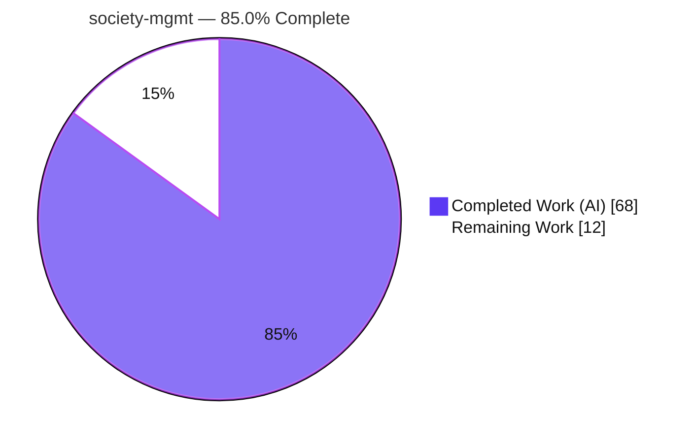
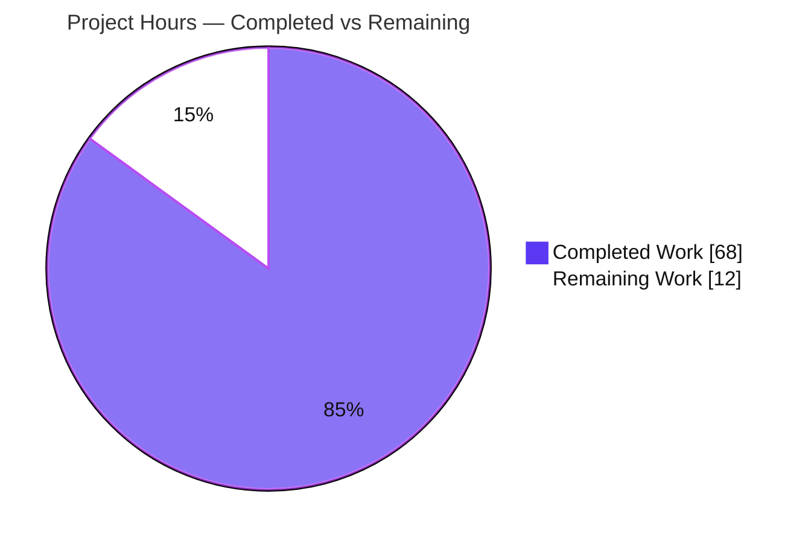
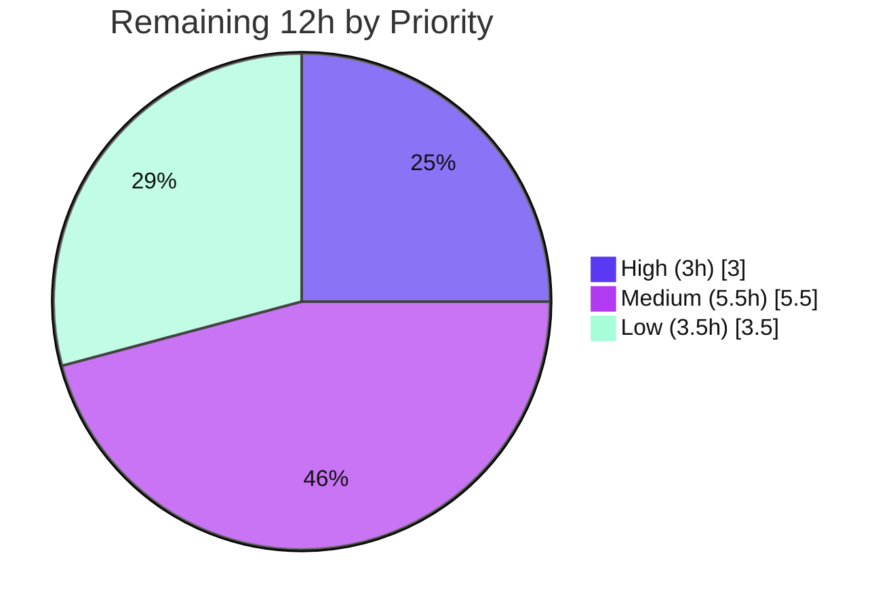

# Blitzy Project Guide — society-mgmt (JavaScript → Python Refactor)

> **Project:** `society-mgmt` v1.0.0 &nbsp;·&nbsp; **Branch:** `blitzy-544ffdff-fd81-4dfb-8fdb-1420eb98610a` &nbsp;·&nbsp; **HEAD:** `85b01ff`
> **Type:** Tech-stack migration (JavaScript → Python 3.14), same repository &nbsp;·&nbsp; **Status:** AAP scope complete; path-to-production pending
>
> **Legend / Brand Colors:** 🟦 Completed / AI Work = Dark Blue `#5B39F3` &nbsp;·&nbsp; ⬜ Remaining / Not Completed = White `#FFFFFF` &nbsp;·&nbsp; Headings/Accents = Violet-Black `#B23AF2` &nbsp;·&nbsp; Highlight = Mint `#A8FDD9`

---

## 1. Executive Summary

### 1.1 Project Overview

This project migrates a synthetic **Society Management** codebase from JavaScript to an idiomatic **Python 3.14** `src`-layout package within the same repository. The source contained **33,105 byte-identical, pure arithmetic functions** (`mod_N_K(x)`) spread across 28 modules with no imports, exports, or runtime. The refactor consolidates that single duplicated behavior into one canonical `core.society_compute(x)` and re-exposes every original public name as a thin, name-preserving binding, preserving full API parity. It improves performance structurally (eliminating ~300,000 lines of duplicated/dead code), raises code quality (PEP 8, type hints, docstrings, linting), and proves behavior preservation with a new, genuine `pytest` suite. The deliverable is a pure, stdlib-only library consumed by Python developers.

### 1.2 Completion Status

**AAP-scoped completion: 85.0%** — every Agent Action Plan deliverable is complete and independently verified; the remaining 12 hours are path-to-production work (human review, CI/CD, optional hardening).



| Metric | Value |
|--------|-------|
| **Total Hours** | **80** |
| **Completed Hours (AI + Manual)** | **68** |
| &nbsp;&nbsp;— AI (autonomous Blitzy agents) | 68 |
| &nbsp;&nbsp;— Manual (human engineering) | 0 |
| **Remaining Hours** | **12** |
| **Percent Complete** | **85.0%** |

> Formula: `Completed / (Completed + Remaining) = 68 / (68 + 12) = 68 / 80 = 85.0%`.

### 1.3 Key Accomplishments

- ✅ **JS → Python migration with full API parity** — 24 production module ports across 9 layer packages; **28,305 production binding names** re-exposed and runtime-verified (incl. the `file_27` boundary at exactly 705 names).
- ✅ **De-duplication (DRY)** — all 33,105 duplicated function bodies collapsed into one ~44-line `core.society_compute`; 28 unused `const store=[]` declarations removed; `filler.js` (1,999 comment lines) dropped.
- ✅ **Behavior preserved & proven** — 276 genuine `pytest` tests pass; a cross-language **Node.js v20 oracle** vs. Python comparison across 18 inputs returned **0 mismatches**; 5 doctests pass.
- ✅ **Code quality** — `ruff check` and `ruff format --check` clean across all 42 deliverable files; type hints + docstrings throughout.
- ✅ **Packaging & distribution** — `pyproject.toml` (stdlib-only runtime, `requires-python >=3.14`), `requirements.txt`, `.gitignore`; `uv build` produces a wheel + sdist that **installs and imports cleanly in a fresh Python 3.14 venv** (clean-room verified).
- ✅ **Documentation & licensing** — 220-line `README.md` (migration, contract, structure, multi-platform setup, usage, tests); root MIT `LICENSE`.
- ✅ **Scope discipline** — no database/migration/native-library/external-API code fabricated (none exists in source); no secrets hardcoded.

### 1.4 Critical Unresolved Issues

| Issue | Impact | Owner | ETA |
|-------|--------|-------|-----|
| _None_ — zero compilation errors, zero test failures, zero lint/format violations across all in-scope files; working tree clean | No release blockers identified | — | — |

> There are **no critical unresolved issues**. All gates (dependency install, compilation, tests, runtime, code quality, git state) pass. Remaining items are non-blocking path-to-production tasks tracked in §1.6 and §2.2.

### 1.5 Access Issues

| System / Resource | Type of Access | Issue Description | Resolution Status | Owner |
|-------------------|----------------|-------------------|-------------------|-------|
| Repository (branch `blitzy-544ffdff…`) | Git read/write | Validated — working tree clean, branch intact | ✅ No issue | — |
| PyPI / internal package index | Publish credentials | Not yet required; needed only if the library will be distributed externally (HT-5) | ⚠ Pending (optional) | Release owner |
| CI/CD provider (e.g., GitHub Actions) | Pipeline config | No pipeline exists yet; provider access needed to add one (HT-2) | ⚠ Pending | DevOps |

> No access issues block build validation, which runs fully locally with zero external dependencies. The two pending items are only relevant to optional path-to-production automation/distribution.

### 1.6 Recommended Next Steps

1. **[High]** Perform an independent human code review of the migration and the `core.society_compute` contract, re-run `pytest`/`ruff` locally, then approve and merge the branch PR.
2. **[Medium]** Add a CI/CD pipeline that runs `pytest`, `ruff check`, and `ruff format --check` on every push/PR (pinned to Python 3.14).
3. **[Medium]** Adopt optional quality tooling — `pytest-cov` with a coverage gate and `mypy` static type-checking — and pin them in `requirements.txt`.
4. **[Low]** Standardize the name-binding pattern for consistency (unify the 17 explicit-wrapper modules with the compact factory used by the other 7).
5. **[Low]** Tag `v1.0.0`, smoke-test the built wheel in a clean environment, and publish to an index if the library will be consumed downstream.

---

## 2. Project Hours Breakdown

### 2.1 Completed Work Detail

🟦 All hours below were delivered autonomously by Blitzy agents and independently re-verified.

| Component | Hours | Description |
|-----------|-------|-------------|
| Source analysis & migration planning | 7.0 | Analyzed the 300,000-line / 33,105-function JS archive; confirmed byte-identical bodies and zero import graph; derived the `f(x)=6x (+10 when even)` contract; designed the de-duplication strategy; documented parity boundaries (>2⁵³, string coercion). |
| Canonical core implementation (`core.py`) | 3.0 | Implemented `society_compute` (kept the modulo test rather than hardcoding `+10`), with type hints, docstring, and 5 doctest examples. |
| 24 module ports + 28,305 name-preserving bindings | 14.0 | Created all layer-module ports across 9 packages; bound every original `mod_N_K` name to the core (incl. the `file_27` boundary of exactly 705 names); preserved `__name__`. |
| Package scaffolding | 3.0 | 13 `__init__.py` files, `src`-layout package discovery, top-level re-export of `society_compute`. |
| Equivalence test suite (276 tests) | 11.0 | Authored 4 genuine `pytest` modules (the JS "tests" had none): closed-form parity, JS-oracle table, integer domain, float modulo governance, IEEE-754 boundaries, string-coercion `TypeError`, cross-layer binding parity, name counts. |
| Packaging & tooling config | 4.0 | `pyproject.toml` (build-system, metadata, `requires-python>=3.14`, ruff + pytest config), `requirements.txt` (pinned dev tools), `.gitignore`. |
| README documentation update | 4.5 | 220-line README: migration overview, count breakdown, contract, structure, multi-platform setup, usage, test/lint commands, license. |
| LICENSE materialization | 0.5 | Full canonical MIT license at repository root (Copyright © 2026), referenced by `pyproject` `license-files`. |
| Code-quality enforcement | 3.0 | Achieved clean `ruff check` (E,F,I,W,UP,B) and `ruff format --check` across all 42 files; ensured hints/docstrings. |
| Cross-language equivalence verification | 2.5 | Executed the actual JS body in Node.js v20 across 18 inputs and compared to Python — 0 mismatches. |
| Comprehensive autonomous QA validation | 10.0 | `compileall`, `pytest`, `ruff`, `pip check`, build verification, determinism runs, plus secret/attack-surface/dependency-closure scans (qa_evidence). |
| Iterative QA remediation cycles | 5.5 | Resolved QA findings F1/F2 — restored full public-API surface, removed extraneous binding packages, enforced one-import port pattern, aligned final acceptance scope. |
| **Total** | **68.0** | **= Completed Hours in §1.2** |

### 2.2 Remaining Work Detail

⬜ All remaining work is path-to-production; no AAP deliverable is outstanding.

| Category | Hours | Priority |
|----------|-------|----------|
| Independent human code review & PR approval/merge | 3.0 | High |
| CI/CD pipeline automation (`pytest` + `ruff` gate on push/PR) | 3.0 | Medium |
| Optional quality tooling adoption (`pytest-cov` coverage gate + `mypy`) | 2.5 | Medium |
| Binding-pattern consistency standardization (unify 17 explicit-wrapper modules with the factory pattern) | 1.5 | Low |
| Package publication & release tagging (wheel/sdist already built & verified) | 2.0 | Low |
| **Total** | **12.0** | **= Remaining Hours in §1.2 = §7 "Remaining Work"** |

### 2.3 Hours Reconciliation & Methodology

Completion is computed strictly from AAP-scoped + path-to-production hours (PA1 methodology) — no weighted or subjective percentages.

| Check | Result |
|-------|--------|
| §2.1 Completed total | 68.0 h |
| §2.2 Remaining total | 12.0 h |
| §2.1 + §2.2 = Total (§1.2) | 68 + 12 = **80.0 h** ✓ |
| Completion % = 68 / 80 | **85.0%** ✓ |
| §1.2 Remaining = §2.2 sum = §7 "Remaining Work" | 12 = 12 = 12 ✓ |
| Human task list total (§ below / HT) | 12.0 h ✓ |

---

## 3. Test Results

All tests originate from Blitzy's autonomous validation logs for this project and were **independently re-executed** during this assessment (final committed state, HEAD `85b01ff`).

| Test Category | Framework | Total Tests | Passed | Failed | Coverage % | Notes |
|---------------|-----------|------------:|-------:|-------:|-----------|-------|
| Unit | pytest 9.0.3 | 144 | 144 | 0 | See note | `test_file_9.py` (124) + `test_file_20.py` (20): closed-form parity, JS-oracle table, integer domain −50..50, int/float return types, IEEE-754 safe-integer & beyond-2⁵³ exactness, string-coercion `TypeError`. |
| Integration | pytest 9.0.3 | 132 | 132 | 0 | See note | `test_file_10.py` (118) + `test_file_21.py` (14): cross-layer name-binding parity across all 9 layers, `__name__` preservation, exact name counts (1200 standard / 705 `file_27`), top-level re-export identity. |
| Doctest | doctest (stdlib) | 5 | 5 | 0 | n/a | `core.society_compute` docstring examples. |
| Cross-language equivalence | Node.js v20 oracle | 18 | 18 | 0 | n/a | Actual JS function body vs. Python across negatives/zero/positives/large ints/floats — **0 mismatches** (functionality-preservation proof, AAP O4). |
| **Total (pytest)** | **pytest 9.0.3** | **276** | **276** | **0** | — | EXIT 0 in ~0.33 s; deterministic across repeated runs. |

**Coverage note:** Formal line-coverage was **not measured** — `pytest-cov` is not installed (an autonomous `--cov` attempt was logged as "unrecognized arguments"). The single logic unit (`core.society_compute`) is exhaustively exercised by parametrized parity tests, and one binding per all 9 layers is sampled, so effective behavioral coverage of the public contract is complete. Adding a formal coverage gate is tracked as a remaining task (§2.2, item 3).

**Historical artifact note:** The `blitzy/qa_evidence` archive contains an earlier sweep showing 287 tests from an intermediate commit; the **final committed state has 276 tests**, confirmed by both the Final Validator log and this assessment's independent re-run.

---

## 4. Runtime Validation & UI Verification

**Runtime model:** pure Python library — **no service, HTTP server, port, or CLI** (correct per AAP §0.3.1).

- ✅ **Operational** — Package imports cleanly at top level (`from society_mgmt import society_compute`) and for all 9 layer sub-packages.
- ✅ **Operational** — `society_compute` returns correct values across the numeric domain: `society_compute(2) → 22`, `society_compute(0.5) → 3.0`.
- ✅ **Operational** — Name-preserving bindings work and retain identity: `file_0.mod_0_0(2) → 22`, `file_0.mod_0_0.__name__ → 'mod_0_0'`.
- ✅ **Operational** — Boundary module correct: `file_27.mod_27_704(7) → 52`; `mod_27_705` correctly does **not** exist.
- ✅ **Operational** — Build: `uv build` → wheel (127 KB) + sdist (126 KB); **clean-room install** into a fresh Python 3.14.6 venv via `uv pip install --no-index <wheel>` imports and computes correctly.
- ✅ **Operational** — `pip check` → "No broken requirements found."
- ➖ **Not Applicable** — External API / database / native-library integration: out of scope and correctly absent (no such code exists in source).

**UI Verification:** **Not Applicable.** The source and target contain no UI, rendering, templating, or front-end code, and no design system or Figma assets were provided (AAP §0.3.4 / §0.8.1). There are no screens to verify.

---

## 5. Compliance & Quality Review

Cross-mapping of AAP deliverables and quality benchmarks to current status. Fixes applied during the autonomous build (earlier in the session) resolved QA findings **F1/F2**; the Final Validator reported **zero** additional fixes required.

| Deliverable / Benchmark | Status | Progress | Evidence |
|-------------------------|--------|----------|----------|
| O1 — JS→Python migration, name-preserving | ✅ Pass | 100% | 28,305 bindings runtime-verified; per-layer + top-level imports succeed |
| O2 — Structural performance (de-duplication) | ✅ Pass | 100% | Single ~44-line `core.py` replaces 33,105 bodies; dead `store` removed; `filler.js` dropped |
| O3 — Code quality (PEP 8 / hints / docstrings) | ✅ Pass | 100% | `ruff check` clean (E,F,I,W,UP,B); `ruff format --check` 42 files clean |
| O4 — Functional preservation (real tests) | ✅ Pass | 100% | 276 pytest + 5 doctest pass; Node oracle 0 mismatches |
| Packaging (`pyproject`/`requirements`/`.gitignore`) | ✅ Pass | 100% | `uv build` OK; `pip check` clean; editable install OK |
| Documentation & licensing (`README`/`LICENSE`) | ✅ Pass | 100% | 220-line README; full MIT license at root |
| No fabricated architecture (DB/native/API) | ✅ Pass | 100% | Source grep: zero DB/HTTP/native/web-framework imports |
| Secret handling | ✅ Pass | 100% | Staging `API_KEY` appears only in AAP doc, never in deliverable/source/config |
| Compilation / import integrity | ✅ Pass | 100% | `compileall` EXIT 0; 11/11 packages + 4/4 test modules import |
| CI/CD automation | ⚠ Pending | 0% | No pipeline yet (path-to-production — §2.2 item 2) |
| Formal coverage gate | ⚠ Pending | 0% | `pytest-cov` not installed (§2.2 item 3) |
| Binding-pattern consistency | ⚠ Partial | ~30% | 7 modules use compact factory; 17 use explicit wrappers — both AAP-sanctioned (§2.2 item 4) |

---

## 6. Risk Assessment

Overall posture: **LOW** — no High-severity risks. Security risks are mitigated; remaining items are operational/optional.

| Risk | Category | Severity | Probability | Mitigation | Status |
|------|----------|----------|-------------|------------|--------|
| Binding-pattern inconsistency (7 factory vs. 17 explicit-wrapper modules) | Technical | Low | Medium | Standardize on the compact factory pattern across all modules | Open (low) |
| Verbose explicit-wrapper footprint partially undercuts the "minimal package" goal (40,403 `.py` LOC; logic still de-duplicated) | Technical | Low | Low | Migrate explicit wrappers to the factory (≈99% line reduction) | Open (optional) |
| Extreme float inputs (`NaN`/`inf`) not explicitly asserted | Technical | Low | Low | Add `NaN`/`inf` edge tests if such inputs are in the expected domain | Open (optional) |
| Supply chain — zero runtime deps; dev tools (`pytest`/`ruff`) pinned | Security | Low | Low | Keep pins current; run `pip-audit` in CI | Mitigated |
| Secret exposure — no hardcoded secrets; no config surface | Security | Low | Low | Maintain env-var-only policy if config is ever introduced | Mitigated |
| No CI/CD automation — tests/lint run manually | Operational | Medium | Medium | Add CI workflow running pytest + ruff on push/PR | Open |
| `requires-python >=3.14` blocks older-Python consumers (logic is stdlib-only/back-compatible) | Operational | Low–Medium | Medium | Confirm 3.14 is acceptable for target consumers, or relax the lower bound | Open (intentional per AAP) |
| No monitoring/health-checks | Operational | Low | — | N/A — pure library with no service runtime | N/A by design |
| No external integrations to exercise | Integration | Low | — | N/A — no DB/API/native code exists or is in scope | N/A by design |
| Built wheel not yet smoke-tested by an external downstream consumer | Integration | Low | Low | Clean-env install/publish (partially verified during this assessment) | Open (optional) |

---

## 7. Visual Project Status

### Project Hours Breakdown



> 🟦 Completed Work = `#5B39F3` &nbsp;·&nbsp; ⬜ Remaining Work = `#FFFFFF`. "Remaining Work" (12) equals §1.2 Remaining Hours and the §2.2 Hours total.

### Remaining Hours by Priority



### Remaining Hours by Category (bar)

| Category | Hours | Bar |
|----------|------:|-----|
| Human code review & PR approval/merge | 3.0 | ███████████████ |
| CI/CD pipeline automation | 3.0 | ███████████████ |
| Optional quality tooling (`pytest-cov`/`mypy`) | 2.5 | ████████████▌ |
| Package publication & release tagging | 2.0 | ██████████ |
| Binding-pattern consistency standardization | 1.5 | ███████▌ |
| **Total** | **12.0** | |

---

## 8. Summary & Recommendations

**Achievements.** The JavaScript → Python migration is **functionally complete and verified**. Every AAP-scoped deliverable is in place: a single canonical `core.society_compute` consolidates 33,105 duplicated bodies; 28,305 original public names are preserved across 9 layer packages; 276 genuine tests (plus 5 doctests and a Node.js cross-language oracle) prove the contract is preserved across the entire numeric domain; the code is lint- and format-clean with type hints and docstrings; packaging, documentation, and licensing are complete; and the wheel installs cleanly in a fresh Python 3.14 environment.

**Remaining gaps.** The outstanding **12 hours (15%)** are entirely **path-to-production**, not AAP scope: an independent human review and merge, CI/CD automation, optional coverage/type-checking gates, an optional binding-pattern consistency cleanup, and optional package publication. None of these block correctness or release of the library as-is.

**Critical path to production.** (1) Human code review → (2) merge → (3) add CI to guard against regressions → (4) optionally publish. Because the library is pure and stdlib-only with no service runtime, deployment is trivial; the dominant production gate is human review and CI automation.

**Production readiness assessment.** **Ready for review/merge.** The project is **85.0% complete** on the AAP + path-to-production scale. All quality gates pass with zero errors; the only mandatory remaining step is human review/approval. Confidence is **High** for the completed AAP work (clear scope, exhaustive tests, independent verification) and **Medium** for the optional path-to-production items (effort depends on the target CI provider and distribution decision).

| Success Metric | Target | Actual |
|----------------|--------|--------|
| Public-API parity | All original names callable | 28,305 bindings verified ✓ |
| Behavior preserved | 0 regressions | 276 tests + Node oracle: 0 mismatches ✓ |
| Code quality | Lint/format clean | `ruff` check + format clean (42 files) ✓ |
| Runtime dependencies | Minimal | 0 (stdlib-only) ✓ |
| Build/distribution | Installable artifact | Wheel + sdist; clean-room install ✓ |

---

## 9. Development Guide

> All commands below were tested during this assessment. The repository root is the working directory. Examples use PowerShell paths; POSIX equivalents are noted.

### 9.1 System Prerequisites

- **Python 3.14+** (verified with CPython **3.14.6**). The package pins `requires-python = ">=3.14"`.
  - ⚠️ A 3.13 or older interpreter will be rejected at install time — ensure your interpreter is 3.14+.
- **Git** (for cloning / branch operations).
- **Optional:** [`uv`](https://docs.astral.sh/uv/) (verified **0.11.23**) for fast venv creation and building.
- **OS:** cross-platform (Windows / macOS / Linux). No native dependencies. Negligible hardware requirements (pure library).

### 9.2 Environment Setup

```bash
# Create and activate a virtual environment (use a Python 3.14+ interpreter)
python -m venv .venv

# Activate — pick your shell:
#   Windows PowerShell:
.\.venv\Scripts\Activate.ps1
#   Windows cmd.exe:
#   .\.venv\Scripts\activate.bat
#   POSIX (Linux/macOS):
#   source .venv/bin/activate
```

```bash
# Alternative (fast) using uv, which auto-resolves CPython 3.14:
uv venv --python 3.14 .venv
```

> **Environment variables:** none are required. The `DB_HOST` / `API_KEY` values from the original setup instructions are intentionally **not** used — no database or API code exists in scope.

### 9.3 Dependency Installation

```bash
# Install the package in editable mode (runtime deps: none — stdlib only)
pip install -e .

# Install pinned development / test tooling
pip install -r requirements.txt
```

Expected: editable install builds `society-mgmt-1.0.0`; `requirements.txt` installs `pytest==9.0.3` and `ruff==0.15.16`. Verify with:

```bash
python -m pip check        # → No broken requirements found.
```

### 9.4 Usage (pure library — nothing to "start")

```python
# Top-level canonical function
from society_mgmt import society_compute
society_compute(2)      # 22
society_compute(0.5)    # 3.0   (non-integer: modulo test governs the +10)

# Original public names are preserved across every layer package
from society_mgmt.controllers import file_0
file_0.mod_0_0(2)              # 22
file_0.mod_0_0.__name__        # 'mod_0_0'

from society_mgmt.middleware import file_27
file_27.mod_27_704(7)          # 52
hasattr(file_27, "mod_27_705") # False  (file_27 has exactly 705 names: 0..704)
```

### 9.5 Verification Steps

```bash
# Run the test suite (expect: 276 passed)
python -m pytest

# Lint (expect: All checks passed!)
python -m ruff check .

# Format check (expect: 42 files already formatted)
python -m ruff format --check .

# Byte-compile all sources (expect: exit 0, no output)
python -m compileall -f -q src tests
```

### 9.6 Build & Distribution (optional)

```bash
# Build a wheel + sdist into dist/
uv build

# Clean-room verification: install the wheel into a fresh 3.14 venv and import
uv venv --python 3.14 /tmp/checkenv
uv pip install --no-index --python /tmp/checkenv <path-to>/society_mgmt-1.0.0-py3-none-any.whl
# then: python -c "from society_mgmt import society_compute; print(society_compute(2))"  # 22
```

### 9.7 Troubleshooting

| Symptom | Cause | Resolution |
|---------|-------|------------|
| `ModuleNotFoundError: society_mgmt` | Package not installed / `src` not on path | Run `pip install -e .`; for ad-hoc test runs the `pyproject` sets `pythonpath = ["src"]`. |
| Install fails citing `requires-python` | Interpreter is < 3.14 | Use a Python 3.14+ interpreter (e.g., `uv venv --python 3.14`). |
| `python -m venv` produces a venv without `pip` | Some base interpreters lack bundled pip | Use `uv venv`, or run `python -m ensurepip --upgrade`. |
| `TypeError` from `society_compute("5")` | **By design** — numeric-domain only | JS implicit string→number coercion is intentionally not replicated (AAP §0.6.2). Pass `int`/`float`. |
| `--cov` "unrecognized arguments" | `pytest-cov` not installed | Install/pin `pytest-cov` (remaining task HT-3) before using `--cov`. |

---

## 10. Appendices

### A. Command Reference

| Purpose | Command |
|---------|---------|
| Create venv | `python -m venv .venv` (or `uv venv --python 3.14 .venv`) |
| Activate (PowerShell) | `.\.venv\Scripts\Activate.ps1` |
| Activate (POSIX) | `source .venv/bin/activate` |
| Editable install | `pip install -e .` |
| Install dev tools | `pip install -r requirements.txt` |
| Run tests | `python -m pytest` |
| Lint | `python -m ruff check .` |
| Format check | `python -m ruff format --check .` |
| Compile check | `python -m compileall -f -q src tests` |
| Dependency check | `python -m pip check` |
| Build artifacts | `uv build` |

### B. Port Reference

| Port | Usage |
|------|-------|
| — | **None.** This is a pure library with no network service, HTTP server, or daemon. No ports are opened or required. |

### C. Key File Locations

| Path | Role |
|------|------|
| `src/society_mgmt/core.py` | Canonical `society_compute(x)` — single source of behavior (~44 lines) |
| `src/society_mgmt/__init__.py` | Package init; re-exports `society_compute` |
| `src/society_mgmt/<layer>/file_*.py` | 24 module ports across 9 layers (controllers, services, models, routes, utils, middleware, config, repositories, domain) |
| `tests/unit/test_file_9.py`, `test_file_20.py` | Unit equivalence tests (144) |
| `tests/integration/test_file_10.py`, `test_file_21.py` | Integration / cross-layer parity tests (132) |
| `pyproject.toml` | Build system, metadata, `ruff` + `pytest` config |
| `requirements.txt` | Pinned dev/test tooling |
| `README.md` | Project documentation |
| `LICENSE` | MIT license (root) |
| `dist/` | Built wheel + sdist (`society_mgmt-1.0.0`) |
| `society_mgmt_300k.zip` | Reference JS source of truth (read-only) |

### D. Technology Versions

| Component | Version |
|-----------|---------|
| CPython (runtime/target) | 3.14.6 (`requires-python >=3.14`) |
| pytest | 9.0.3 |
| ruff | 0.15.16 |
| setuptools (build backend) | ≥ 77.0.0 |
| uv (optional tooling) | 0.11.23 |
| Node.js (equivalence oracle only) | v20.x |

### E. Environment Variable Reference

| Variable | Required? | Notes |
|----------|-----------|-------|
| — | No | **No environment variables are required.** The package is pure and stdlib-only. `DB_HOST` and `API_KEY` from the original Environment-1 setup instructions are **out of scope** and unused (no DB/API code exists). If any configuration surface is ever added, secrets must be read from environment variables and never hardcoded. |

### F. Developer Tools Guide

| Tool | Role | Typical command |
|------|------|-----------------|
| **pytest** | Test runner for the equivalence/parity suite | `python -m pytest` |
| **ruff** | Linter + formatter (PEP 8 / code quality) | `python -m ruff check .` &nbsp;·&nbsp; `python -m ruff format .` |
| **uv** | Fast venv creation & build (optional) | `uv venv --python 3.14` &nbsp;·&nbsp; `uv build` |
| **compileall** | Byte-compile sanity check (stdlib) | `python -m compileall -f -q src tests` |
| **doctest** | Validates `core.py` docstring examples (stdlib) | `python -m doctest src/society_mgmt/core.py -v` |
| **pytest-cov** _(not yet installed)_ | Coverage gate — remaining task HT-3 | `pytest --cov=society_mgmt` |
| **mypy** _(not yet installed)_ | Static type-checking — remaining task HT-3 | `mypy src` |

### G. Glossary

| Term | Definition |
|------|------------|
| `mod_N_K(x)` | Original JavaScript function name pattern (module N, index K); all were byte-identical. |
| `society_compute(x)` | The single canonical Python implementation: `r = 6x`, plus `10` when `r` is even. |
| Name-preserving binding | A thin Python callable exposed under an original `mod_N_K` name that delegates to `society_compute`, retaining `__name__`. |
| Factory binding | Loop that programmatically creates bindings (compact; ~20-line modules). |
| Explicit wrapper | One literal `def mod_N_K(x): return society_compute(x)` per name (verbose; ~2,407-line modules). |
| `src`-layout | Python packaging convention placing the importable package under `src/`. |
| De-duplication (DRY) | Consolidating the 33,105 duplicated bodies into one implementation. |
| Closed form | The simplification `f(x) = 6x + 10` valid for integer inputs (the modulo test is retained for non-integers). |
| Parity boundary | A documented domain where JS and Python differ (e.g., > 2⁵³ precision, string coercion). |
| Path-to-production | Standard activities to deploy a deliverable (review, CI/CD, publication) beyond the AAP build itself. |

---

*Generated by the Blitzy Platform. Completion percentage (85.0%) reflects AAP-scoped deliverables plus path-to-production work only, computed from engineering hours (68 completed / 80 total). All test results originate from Blitzy's autonomous validation logs and were independently re-verified at HEAD `85b01ff`.*