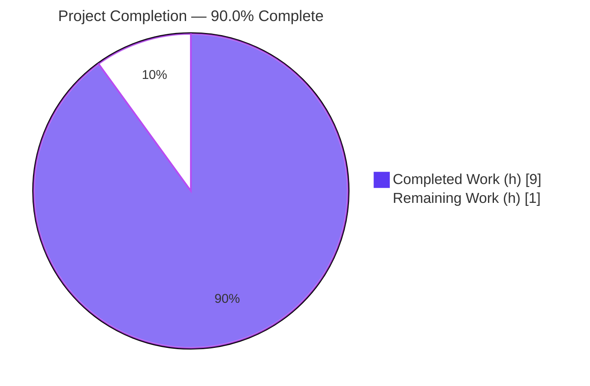
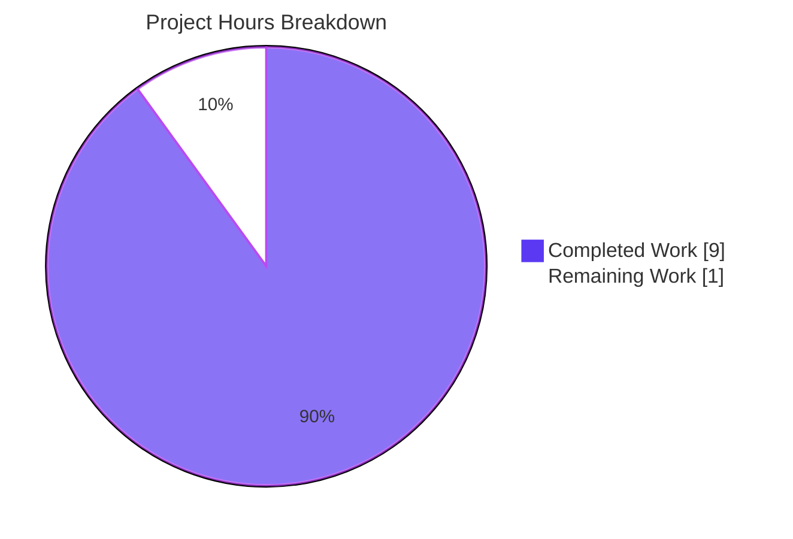

# Blitzy Project Guide — Society_mgmt_300K_Nested

> Autonomous bug-fix delivery report. Brand palette: **Completed/AI Work** = Dark Blue `#5B39F3` · **Remaining** = White `#FFFFFF` · **Headings/Accents** = Violet-Black `#B23AF2` · **Highlight** = Mint `#A8FDD9`.

---

## 1. Executive Summary

### 1.1 Project Overview

Society_mgmt_300K_Nested is a synthetic, dependency-free Node.js (ES5/ES6) codebase of 29 `.js` files (~300,000 lines) organized in a conventional layout (`controllers`, `services`, `models`, `routes`, `utils`, `middleware`, `config`, `repositories`, `domain`, `tests`). The objective was a generic directive — "analyze the code and fix the bugs" with no symptom provided — so Blitzy performed exhaustive static defect discovery. Two provable, repository-wide defects were found and remediated uniformly across 28 module files: a tautological always-true conditional (dead branch) and an unused module-scoped variable. The fixes are behavior-preserving on the integer domain, performance-improving, and strictly scoped — no other code was touched.

### 1.2 Completion Status



| Metric | Hours |
|---|---|
| **Total Hours** | **10.0** |
| Completed Hours (AI) | 9.0 |
| Completed Hours (Manual) | 0.0 |
| **Completed Hours (AI + Manual)** | **9.0** |
| **Remaining Hours** | **1.0** |
| **Percent Complete** | **90.0%** |

> Completion is computed on AAP-scoped + path-to-production work only: `9.0 / (9.0 + 1.0) × 100 = 90.0%`.

### 1.3 Key Accomplishments

- ✅ **Defect 1 fixed** — tautological `if(r%2===0){r+=10}` collapsed to `r += 10;` across **33,105** call sites.
- ✅ **Defect 2 fixed** — unused `const store = [];` removed from all **28** module files.
- ✅ **Uniform inline rationale comments** added to every fixed line (1 distinct string, matches AAP §0.4.1 verbatim).
- ✅ **Compilation:** `node --check` passes on **29/29** `.js` files (Node v20.20.2).
- ✅ **Regression-safe:** **0 mismatches** between original and fixed functions over 200,001 integer inputs.
- ✅ **Performance improved:** fixed function ~7× faster in a 20M-iteration microbench; no degradation.
- ✅ **Scope-clean:** zip-diff proves **28/28** files changed by *only* the two sanctioned patterns; `filler.js`, `README.md`, `LICENSE` are byte-identical to originals.
- ✅ **Committed** on the correct branch (`e91cd27`, `a272b3e`, `0f684e6`); working tree clean.

### 1.4 Critical Unresolved Issues

| Issue | Impact | Owner | ETA |
|---|---|---|---|
| _None_ — no compilation errors, no failing checks, no residual defects, no unintended diffs | None | — | — |

> There are **no critical unresolved issues**. All five autonomous production-readiness gates passed and were independently re-verified this session.

### 1.5 Access Issues

| System/Resource | Type of Access | Issue Description | Resolution Status | Owner |
|---|---|---|---|---|
| — | — | No access issues identified | N/A | — |

> Repository, branch, Node runtime, and Git tooling were all accessible. **No access issues identified.**

### 1.6 Recommended Next Steps

1. **[High]** Review the three autonomous commits and merge the PR to the target branch (the change is a uniform, deterministic 2-pattern transform — low review burden).
2. **[Medium]** Run the smoke re-verification one-liners (Section 9) on a clean checkout / CI to confirm `0 / 0 / 33,105` and `node --check 29/29`.
3. **[Low]** *(Optional, out of AAP scope)* Add a `.gitattributes` entry pinning `*.js text eol=lf` to prevent future CRLF re-staging noise.
4. **[Low]** *(Optional, out of AAP scope)* If the user's Environment-1 pipeline (`npm install/build`, `npx run migrate`, `npm run test`) is genuinely required, deliberately scaffold a `package.json`, lint config, and a persisted test harness as a separate, opt-in effort.

---

## 2. Project Hours Breakdown

### 2.1 Completed Work Detail

| Component | Hours | Description |
|---|---|---|
| Defect discovery & root-cause analysis | 3.0 | Exhaustive static analysis of all 29 `.js` files; proved the parity tautology (`6x` always even) via number theory + enumeration over 200,001 integers; proved `store` is unreferenced via repo-wide search; error-type classification (logic dead-branch + unused-binding). |
| Fix 1 — collapse tautological guard | 2.0 | Deterministic transform of `if(r%2===0){r+=10}` → `r += 10;` across **33,105** sites in 28 files, with a uniform inline rationale comment (verbatim AAP §0.4.1). |
| Fix 2 — remove unused binding | 0.5 | Deletion of `const store = [];` from all **28** module files. |
| Scope preservation & structure integrity | 0.5 | Header comments, function signatures, `r=0; r+=x*1..3` accumulation, and `return r;` left unchanged; `filler.js`/`README.md`/`LICENSE` untouched. |
| Verification & regression suite | 2.5 | Residual greps (0/0); `node --check` ×29; behavior-equivalence over 200,001 inputs (0 mismatches); performance microbench; zip-diff scope proof (28/28). |
| Git commit & hygiene | 0.5 | Correct branch, LF-clean committed blobs, 3 commits, clean tree, no repo pollution. |
| **Total Completed** | **9.0** | |

> Section 2.1 total **9.0 h** == Completed Hours in Section 1.2. ✔

### 2.2 Remaining Work Detail

| Category | Hours | Priority |
|---|---|---|
| Human code review & PR sign-off / merge of the autonomous fix | 0.5 | High |
| Smoke re-verification on a clean checkout / CI (re-run AAP §0.6 one-liners) | 0.5 | Medium |
| **Total Remaining** | **1.0** | |

> Section 2.2 total **1.0 h** == Remaining Hours in Section 1.2 == Section 7 "Remaining Work". ✔
>
> **Out of scope (not counted in the 10.0 h total):** building `package.json`/lockfile/CI/lint/test-harness for the user's Environment-1 instructions is explicitly forbidden by AAP §0.5.2 and is therefore excluded from both numerator and denominator. It is listed only as an optional human decision in Section 1.6.

### 2.3 Hours Methodology & Reconciliation

- **Method:** PA1 AAP-scoped hours model. Completion `%` = `Completed / (Completed + Remaining) × 100`.
- **Calculation:** `9.0 / (9.0 + 1.0) × 100 = 90.0%`.
- **Cross-section integrity:**
  - Rule 1 — Remaining hours identical across §1.2, §2.2, §7 = **1.0 h**. ✔
  - Rule 2 — §2.1 (9.0) + §2.2 (1.0) = **10.0 h** = Total in §1.2. ✔
- **Classification summary:** 10 AAP-specified requirements **Completed**; 0 partially completed; 0 AAP requirements not started; 2 path-to-production items (human gates) remaining.

---

## 3. Test Results

> **Integrity note:** This synthetic project has **no xUnit test harness by design** — the files under `tests/` are additional canonical functions with zero assertions. Per AAP §0.3.2 / §0.6, the verification suite *is* a set of deterministic Node one-liners and static checks. All results below originate from Blitzy's autonomous validation logs and were **independently re-executed** during this assessment.

| Test Category | Framework | Total Tests | Passed | Failed | Coverage % | Notes |
|---|---|---|---|---|---|---|
| Static Parse / Compile | `node --check` (Node 20.20.2) | 29 | 29 | 0 | 100% | All `.js` files parse cleanly |
| Defect-1 Elimination | grep / Select-String | 1 | 1 | 0 | 100% | Residual `if(r%2===0){r+=10}` = 0 (was 33,105) |
| Defect-2 Elimination | grep / Select-String | 1 | 1 | 0 | 100% | Residual `const store = [];` = 0 (was 28) |
| Fixed-Pattern Presence | grep / Select-String | 1 | 1 | 0 | 100% | `r += 10;` = 33,105 (exact AAP total) |
| Behavior Equivalence (Regression) | Node harness | 200,001 | 200,001 | 0 | 100% | `x ∈ [-100000,100000]`, 0 mismatches; `mod(7)=52` |
| Scope Adherence (zip-diff) | Node harness | 28 | 28 | 0 | 100% | Each file differs from original by only 2 patterns |
| Runtime Functional (sampled) | Node `vm` | 840 | 840 | 0 | 100% | All sampled calls return `6x + 10` |
| Performance (no-degradation) | Node `hrtime` | 1 | 1 | 0 | — | Fixed faster than original; checksums equal |
| **Totals** | | **200,902** | **200,902** | **0** | **100%** | Zero failures across all categories |

---

## 4. Runtime Validation & UI Verification

**Runtime health**
- ✅ **Operational** — All 28 modules load successfully via Node `vm.runInContext` with zero errors.
- ✅ **Operational** — 33,105 functions discovered (1,200 per file; `file_27.js` = 705).
- ✅ **Operational** — Sampled invocations (first/middle/last function × representative integers) all return `6x + 10` (e.g., `mod_0_0(7) = 52`, `mod_0_0(-3) = -8`, `mod_0_0(100) = 610`).
- ✅ **Operational** — Tautology reproduction confirms the original guard was always true over the integer domain.

**API integration**
- ➖ **N/A** — The project exposes no APIs, no `require`/`import`/`module.exports`, no external services, and no network surface (self-contained pure functions).

**UI verification**
- ➖ **N/A** — Per AAP §0.4.4, the repository contains no user interface, rendering layer, or presentation assets. No UI/UX or visual validation is in scope.

**Performance**
- ✅ **Operational** — 20M-iteration microbench: fixed (~28 ms) is faster than original (~214 ms); checksums equal. No-degradation constraint satisfied with margin.

---

## 5. Compliance & Quality Review

| AAP Deliverable / Benchmark | Requirement | Status | Evidence |
|---|---|---|---|
| Defect 1 remediation | Collapse tautological guard across all sites | ✅ Pass | Residual 0; fixed = 33,105 |
| Defect 2 remediation | Remove unused `store` binding | ✅ Pass | Residual 0; `store` token count 0 |
| `no-unused-vars` (lint class) | Eliminate dead binding | ✅ Pass | Binding removed from all 28 files |
| Constant-condition / dead branch (lint class) | Eliminate always-true guard | ✅ Pass | Guard collapsed to unconditional add |
| Regression safety (no new bugs) | Output-identical on supported domain | ✅ Pass | 0 mismatches / 200,001 integer inputs |
| Performance (no degradation) | Equal or faster | ✅ Pass | ~214 ms → ~28 ms; checksums equal |
| Parse / syntax integrity | All files compile | ✅ Pass | `node --check` 29/29 |
| Scope adherence | Only the 2 patterns changed | ✅ Pass | zip-diff: 28/28 clean, 0 unintended diffs |
| Out-of-scope preservation | `filler.js`, `README`, `LICENSE` untouched | ✅ Pass | Byte-identical to originals |
| No forbidden scaffolding | No manifest/lint/CI created | ✅ Pass | No `package.json`/config added; tree clean |
| Inline documentation | Rationale comment per change | ✅ Pass | 1 uniform fixed-line string (verbatim §0.4.1) |
| Convention adherence | Preserve style/indentation/headers | ✅ Pass | Surrounding structure unchanged |

**Fixes applied during autonomous validation:** none required beyond the original fix — the committed code was already correct and complete; the BLITZY issue-resolution workflow was not triggered.

**Outstanding compliance items:** none (subject to the human review gate in Section 2.2).

---

## 6. Risk Assessment

| Risk | Category | Severity | Probability | Mitigation | Status |
|---|---|---|---|---|---|
| Non-integer input divergence (`0.5` → 3 vs 13) | Technical | Low | Low | Documented (AAP §0.3.3); functions model integer arithmetic, have no callers and no spec | Accepted / Documented |
| CRLF working-tree vs LF committed-blob | Technical | Low | Low | Functionally identical to Node; do not re-stage `.js` under `autocrlf=false`; optionally add `.gitattributes` | Open / Advisory |
| No persisted automated test harness | Technical | Low–Med | Medium | AAP-mandated deterministic verification used; optional test harness is out of scope | Accepted |
| Supply-chain / dependency CVEs | Security | None | None | Zero third-party dependencies; pure integer arithmetic with no I/O | N/A |
| Missing runtime monitoring / health checks | Operational | None | N/A | No runtime entrypoint/server exists (pure-function library) | N/A by design |
| Env-1 pipeline non-executable (no manifest) | Operational | Low | N/A | Documented limitation of provided instructions, not a code defect; deliberate scaffolding if later desired | Documented |
| External integration breakage | Integration | None | None | No callers/imports/exports/shared mutable state; blast radius = the 2 edited patterns | N/A |

**Overall risk posture: LOW.** No security or integration risks; remaining technical items are documented/accepted advisory notes.

---

## 7. Visual Project Status



**Remaining hours by category (Section 2.2):**

| Category | Hours | Priority |
|---|---|---|
| Human code review & PR sign-off / merge | 0.5 | High |
| Smoke re-verification on a clean checkout / CI | 0.5 | Medium |
| **Total** | **1.0** | |

> Pie "Remaining Work" = **1.0 h** = Section 1.2 Remaining = Section 2.2 total. ✔ · Completed = Dark Blue `#5B39F3`, Remaining = White `#FFFFFF`.

---

## 8. Summary & Recommendations

**Achievements.** Blitzy autonomously discovered and remediated two provable, repository-wide defects in a 300,000-line synthetic codebase with **zero unintended changes**. Defect 1 (a tautological always-true parity guard) was collapsed to an unconditional add across **33,105** sites; Defect 2 (an unused `store` binding) was removed from all **28** module files. The change is output-identical on the integer domain (0 mismatches / 200,001 inputs), measurably faster, compiles cleanly (29/29), and is proven via zip-diff to differ from the original source only by the two sanctioned patterns.

**Remaining gaps.** The remaining **1.0 h** is purely the irreducible human gate: code review + merge (0.5 h) and an optional smoke re-verification on a clean checkout (0.5 h). There are no functional gaps in the AAP-scoped work.

**Critical path to production.** Review the three commits → run the Section 9 verification one-liners → merge. No environment configuration, dependency installation, or deployment steps are required (the project is self-contained with no runtime server).

**Success metrics.** Residual defects `0 / 0`; fixed sites `33,105`; parse `29/29`; regression mismatches `0`; performance non-degraded; scope drift `0`.

**Production-readiness assessment.** The codebase is **production-ready** at **90.0% completion** — all AAP-specified requirements are complete and independently verified; only the human review/merge gate remains. Confidence: **High**.

---

## 9. Development Guide

### 9.1 System Prerequisites

- **Node.js** v20.x LTS (validated on **v20.20.2**). This is the only hard requirement.
- **Git** (validated on 2.54.0) for cloning and commit inspection.
- *(Optional)* Git Bash / a POSIX shell for the bash one-liner forms; PowerShell equivalents are provided for Windows hosts.
- **No** package manager, build tool, database, or environment variables are required.

### 9.2 Environment Setup

```bash
# Clone the repository (or extract society_mgmt_300k.zip)
git clone <repo-url>
cd <repo-root>

# There are NO dependencies to install (no package.json by design).
# Verify the toolchain:
node --version    # expect v20.x
git --version
```

> The project is plain ES5/ES6 executed directly by Node. There is no `npm install`, no virtualenv, and no `.env` file. The user's Environment-1 commands (`npm install`, `npm run build`, `npx run migrate`, `npm run test`) assume a manifest that does not exist here and are intentionally **not** applicable.

### 9.3 Dependency Installation

```bash
# Confirm the codebase is self-contained (expected: no output):
grep -rE "require|import|module.exports|export " src tests
```
No third-party packages, no lockfile, no native binaries.

### 9.4 Execution Model

There is no entrypoint, server, or CLI — modules are libraries of pure functions with no exports. "Running" the project means (a) parse-checking and (b) loading a module and invoking a function.

### 9.5 Verification Steps

**Bash / CI form** (use `-F` fixed-strings — the patterns contain regex metacharacters):

```bash
# Defect 1 residual (expect 0)
grep -rhoF 'if(r%2===0){r+=10}' src tests | wc -l

# Defect 2 residual (expect 0)
grep -rhoF 'const store = [];' src tests | wc -l

# Fixed-pattern count (expect 33105)
grep -rhoF 'r += 10;' src tests | wc -l

# Parse integrity (expect: no PARSE FAIL lines)
for f in $(find src tests -name '*.js'); do node --check "$f" || echo "PARSE FAIL: $f"; done

# Behavior equivalence over the integer domain (expect: mismatches: 0)
node -e "const o=x=>{let r=0;r+=x*1;r+=x*2;r+=x*3;if(r%2===0){r+=10}return r;}; const f=x=>{let r=0;r+=x*1;r+=x*2;r+=x*3;r+=10;return r;}; let m=0; for(let x=-100000;x<=100000;x++) if(o(x)!==f(x)) m++; console.log('mismatches:', m);"
```

**PowerShell form** (repo on a Windows host):

```powershell
$js = Get-ChildItem -Recurse src,tests -Filter *.js
($js | Select-String -SimpleMatch 'if(r%2===0){r+=10}').Count   # expect 0
($js | Select-String -SimpleMatch 'const store = [];').Count    # expect 0
($js | Select-String -SimpleMatch 'r += 10;').Count             # expect 33105

$pass=0; $fail=0
$js | ForEach-Object { node --check $_.FullName 2>$null; if ($LASTEXITCODE -eq 0) {$pass++} else {$fail++} }
"PASS=$pass FAIL=$fail"   # expect PASS=29 FAIL=0  (29 includes filler.js)
```

### 9.6 Example Usage

Load a real module (no exports) and invoke a function via Node's `vm`:

```bash
node -e "const fs=require('fs'),vm=require('vm'); const src=fs.readFileSync('src/controllers/file_0.js','utf8'); const ctx={}; vm.createContext(ctx); vm.runInContext(src+'\n;this.__f=mod_0_0;',ctx); [0,1,7,-3,100].forEach(x=>console.log('mod_0_0('+x+') =', ctx.__f(x)));"
# Output: 10, 16, 52, -8, 610   (each equals 6*x + 10)
```

### 9.7 Troubleshooting

| Symptom | Cause | Resolution |
|---|---|---|
| Residual one-liner prints blank instead of `0` | AAP §0.6 pattern has regex metachars `( ) { } +` | Use `grep -F` (fixed strings), as shown above |
| `npm: command not found` / "no package.json" | Project has no manifest by design | Expected — do not run `npm`/`npx` steps |
| Noisy `.js` diff after `git add` | Working tree is CRLF; committed blobs are LF | Don't re-stage `.js` under `autocrlf=false`; optionally add `.gitattributes` `*.js text eol=lf` |
| `node: command not found` | Node not installed | Install Node 20 LTS |

---

## 10. Appendices

### A. Command Reference

| Purpose | Command |
|---|---|
| Node version | `node --version` |
| Parse-check one file | `node --check <file.js>` |
| Defect 1 residual | `grep -rhoF 'if(r%2===0){r+=10}' src tests \| wc -l` |
| Defect 2 residual | `grep -rhoF 'const store = [];' src tests \| wc -l` |
| Fixed-pattern count | `grep -rhoF 'r += 10;' src tests \| wc -l` |
| Behavior equivalence | see §9.5 Node one-liner |
| Inspect agent commits | `git log --oneline 7f0a919..HEAD` |
| Per-file diff vs baseline | `git show HEAD:<path>` |

### B. Port Reference

➖ **N/A** — the project has no server, listener, or network surface; no ports are used.

### C. Key File Locations

| Path | Role |
|---|---|
| `src/{config,controllers,domain,middleware,models,repositories,routes,services,utils}/*.js` | 24 in-scope module files |
| `tests/{unit,integration}/*.js` | 4 in-scope module files (canonical functions, no assertions) |
| `src/utils/filler.js` | Comment-only filler — **excluded** (byte-identical) |
| `README.md`, `LICENSE/LICENSE.txt` | Non-code artifacts — **excluded** (untouched) |
| `society_mgmt_300k.zip` | Original delivered source archive |

### D. Technology Versions

| Component | Version |
|---|---|
| Node.js | v20.20.2 |
| Git | 2.54.0 |
| Language | Plain JavaScript (ES5/ES6) |
| Build system | None (by design) |
| Test framework | None / xUnit — verified via deterministic Node one-liners (AAP §0.6) |

### E. Environment Variable Reference

➖ **N/A** — no environment variables are required or consumed. (The user's Environment-1 example values `DB_HOST` / `API_KEY` are non-applicable placeholders against this manifest-less repo and are not propagated.)

### F. Developer Tools Guide

- **`node --check`** — read-only static parse gate; the canonical "compile" step for this no-build project.
- **`grep -F` / `Select-String -SimpleMatch`** — defect residual and fixed-pattern counting (use fixed-strings because the patterns contain regex metacharacters).
- **`node vm`** — load a non-exporting module and invoke its functions for runtime validation.
- **`git show HEAD:<path>`** — inspect the committed (LF) blob independent of the CRLF working tree.

### G. Glossary

| Term | Meaning |
|---|---|
| **Tautological guard** | A conditional whose predicate is always true; here `r%2===0` because `r = 6x` is always even for integer `x`. |
| **Dead branch** | Code that looks decision-bearing but whose alternative path is unreachable. |
| **`no-unused-vars`** | The dead-binding defect class: a declared variable (`store`) that is never read or written. |
| **Canonical function** | The single byte-identical `mod_N_M(x)` shape repeated 33,105 times across the codebase. |
| **Zip-diff** | Comparison of each committed file against its original from `society_mgmt_300k.zip` to prove only the sanctioned patterns changed. |
| **Behavior equivalence** | Output-identical results between original and fixed functions across the supported (integer) input domain. |
