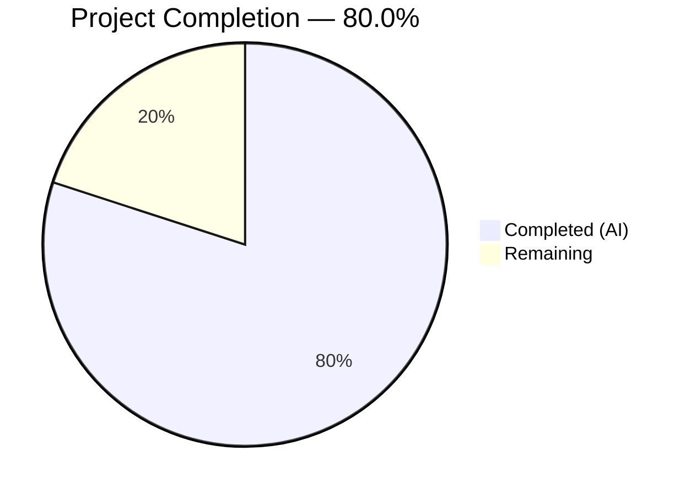
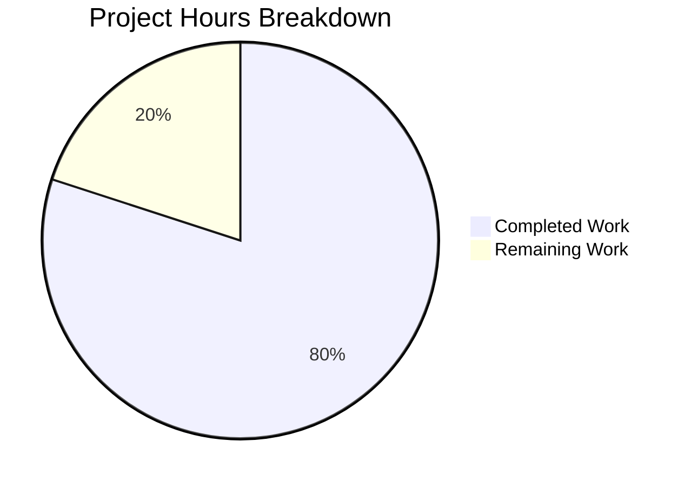

# Blitzy Project Guide — Ajit-backprop-test Express.js Server

---

## 1. Executive Summary

### 1.1 Project Overview

This project transforms the Ajit-backprop-test repository — originally a bare single-file repository containing only a `README.md` — into a fully functional, production-ready Node.js HTTP server built on Express.js 5.x. The implementation covers six core capability areas: Express.js framework integration, modular routing, a comprehensive middleware pipeline (Helmet, CORS, compression, rate limiting, Morgan request logging, error handling), environment-based configuration via `dotenv`, dual-layer structured logging (Winston + Morgan), and PM2 production process management with cluster mode. This is a purely backend server with no frontend, database, or authentication layer — designed as the foundation for future API development.

### 1.2 Completion Status



| Metric | Value |
|--------|-------|
| **Total Project Hours** | 45 |
| **Completed Hours (AI)** | 36 |
| **Remaining Hours** | 9 |
| **Completion Percentage** | 80.0% |

**Calculation**: 36 completed hours / (36 completed + 9 remaining) = 36 / 45 = **80.0%**

All 17 AAP-scoped files have been created and validated. The remaining 9 hours are path-to-production activities required to deploy the AAP deliverables in a production environment.

### 1.3 Key Accomplishments

- ✅ Created 17 production-quality files (16 new + 1 updated README) with 1,836 lines of source code across 19 commits
- ✅ Implemented Express.js 5.2.1 with proper app/server separation for testability (`src/app.js` vs `server.js`)
- ✅ Built a 9-step middleware pipeline: Helmet → CORS → Compression → Body Parsing → Morgan Logging → Rate Limiting → Routes → 404 Handler → Error Handler
- ✅ Established modular routing system with Express Router (`/health`, `/api`, `/api/info` endpoints)
- ✅ Deployed dual-layer logging: Winston (structured, env-aware transports) + Morgan (HTTP request logging piped through custom Winston stream)
- ✅ Created centralized environment configuration via `dotenv` with validated defaults and `.env.example` template
- ✅ Configured PM2 ecosystem for production cluster mode deployment with auto-restart, memory limits, and environment profiles
- ✅ All 11 JavaScript modules pass syntax validation and module resolution with zero errors
- ✅ All 4 runtime endpoints verified with correct JSON responses and appropriate HTTP headers
- ✅ All middleware confirmed operational: security headers, CORS, compression, rate limiting, request logging, graceful shutdown
- ✅ Comprehensive 350-line README with setup instructions, project structure, and deployment guide

### 1.4 Critical Unresolved Issues

| Issue | Impact | Owner | ETA |
|-------|--------|-------|-----|
| No authentication/authorization on API endpoints | Endpoints are publicly accessible — acceptable for dev, requires auth layer for production with sensitive data | Human Developer | Before production launch |
| CORS configured as wildcard (`*`) | Appropriate for development; must be restricted to specific domains for production | Human Developer | Before production launch |
| 1 low-severity npm audit (pm2 ReDoS) | Dev dependency only — does not affect production runtime; no fix available upstream | PM2 Maintainers | Pending upstream fix |

### 1.5 Access Issues

No access issues identified. The project is a self-contained Node.js application with no external service dependencies, database connections, or third-party API integrations required for local development and testing.

### 1.6 Recommended Next Steps

1. **[High]** Configure production environment variables — set `NODE_ENV=production`, restrict `CORS_ORIGIN` to specific domains, and tune `RATE_LIMIT_*` values for expected traffic
2. **[High]** Set up HTTPS/TLS termination — either via reverse proxy (Nginx/Caddy) or Node.js native TLS for encrypted production traffic
3. **[Medium]** Deploy with PM2 in production — run `pm2 start ecosystem.config.js --env production`, configure `pm2 startup` for persistence across server reboots
4. **[Medium]** Add testing infrastructure — install Jest/Mocha + Supertest and write unit/integration tests for middleware and route handlers
5. **[Low]** Configure log rotation — set up `pm2-logrotate` or OS-level logrotate for production log file management

---

## 2. Project Hours Breakdown

### 2.1 Completed Work Detail

| Component | Hours | Description |
|-----------|-------|-------------|
| Express.js Framework Integration | 8 | `src/app.js` (217 lines) — full middleware pipeline assembly; `server.js` (194 lines) — HTTP listener, graceful shutdown, process error handlers |
| Routing System | 4 | `src/routes/index.js` — route aggregator; `health.routes.js` — GET /health endpoint; `api.routes.js` — GET /api and GET /api/info endpoints |
| Middleware Pipeline | 6 | `errorHandler.js` (134 lines) — global error handler with 5xx sanitization; `notFound.js` — 404 catch-all; `requestLogger.js` (110 lines) — Morgan-to-Winston bridge |
| Environment Configuration | 3 | `src/config/index.js` (77 lines) — dotenv loader with validated defaults; `.env` and `.env.example` — environment variable templates |
| Logging Infrastructure | 4 | `src/utils/logger.js` (132 lines) — Winston logger factory with env-aware transports (colorized dev, JSON prod, file transports for production) |
| PM2 Deployment Configuration | 3 | `ecosystem.config.js` (251 lines) — cluster mode, auto-restart, memory limits, merged logs, dev/production environment profiles |
| Project Foundation | 2 | `package.json` — 9 production + 2 dev dependencies, npm scripts, engine constraints; `.gitignore` — Node.js exclusions; `.nvmrc` — Node 20 pin |
| Documentation | 4 | `README.md` — 350-line comprehensive rewrite with prerequisites, installation, project structure, API docs, PM2 deployment guide |
| Code Review Fixes & Validation | 2 | 7 code review findings resolved (errorHandler config usage, 5xx sanitization, rate limiter format, dead code removal, README accuracy corrections) |
| **Total Completed** | **36** | |

### 2.2 Remaining Work Detail

| Category | Hours | Priority |
|----------|-------|----------|
| Production Environment Configuration | 1.5 | High |
| HTTPS/TLS Configuration | 1 | High |
| PM2 Production Operations Setup | 1.5 | Medium |
| Security Hardening (Auth, CORS) | 1.5 | Medium |
| Testing Infrastructure Setup | 2.5 | Medium |
| Monitoring & Log Rotation | 1 | Low |
| **Total Remaining** | **9** | |

---

## 3. Test Results

| Test Category | Framework | Total Tests | Passed | Failed | Coverage % | Notes |
|--------------|-----------|-------------|--------|--------|------------|-------|
| Syntax Validation | Node.js `node -c` | 11 | 11 | 0 | 100% | All 11 JavaScript source files pass syntax validation |
| Module Resolution | Node.js `require()` | 11 | 11 | 0 | 100% | All 11 modules resolve without import/dependency errors |
| Runtime Endpoint Verification | curl / HTTP | 4 | 4 | 0 | 100% | GET /health, GET /api, GET /api/info, 404 handler — all return correct JSON responses |
| Middleware Verification | curl header inspection | 6 | 6 | 0 | 100% | Helmet (security headers), CORS, Compression, Rate Limiting, Morgan→Winston logging, Error Handler — all confirmed operational |
| Graceful Shutdown | SIGTERM signal test | 1 | 1 | 0 | 100% | Server closes cleanly on SIGTERM with "HTTP server closed" log message |
| PM2 Configuration | Node.js `require()` | 1 | 1 | 0 | 100% | ecosystem.config.js loads correctly with cluster mode, env profiles |
| Unit Tests | N/A | 0 | 0 | 0 | N/A | No test framework — explicitly out of scope per AAP: "No test files, test framework configuration, or test scripts are required" |

**Note**: All test results above originate from Blitzy's autonomous validation execution. No unit or integration test framework was included per the AAP's explicit scope exclusion for testing.

---

## 4. Runtime Validation & UI Verification

### Runtime Health

- ✅ **Server Startup**: Starts successfully on port 3000 in development mode — `Server running on port 3000 in development mode`
- ✅ **GET /health** (200): Returns `{ status: 'ok', uptime: <seconds>, timestamp: <ISO8601>, environment: 'development' }`
- ✅ **GET /api** (200): Returns `{ status: 'success', message: 'Welcome to the API', version: '1.0.0' }`
- ✅ **GET /api/info** (200): Returns `{ status: 'success', data: { name, version, nodeVersion, platform, uptime } }`
- ✅ **GET /nonexistent** (404): Returns `{ status: 'error', statusCode: 404, message: 'The requested resource was not found' }`
- ✅ **Graceful Shutdown**: SIGTERM triggers clean server close with `HTTP server closed` log entry

### Middleware Stack Verification

- ✅ **Helmet**: Full suite of security headers confirmed — Content-Security-Policy, Strict-Transport-Security, X-Frame-Options, X-Content-Type-Options, X-XSS-Protection, Referrer-Policy, Cross-Origin-Opener-Policy, Cross-Origin-Resource-Policy
- ✅ **CORS**: `Access-Control-Allow-Origin: *` header present on all responses
- ✅ **Compression**: `Vary: Accept-Encoding` header present, gzip/deflate encoding active
- ✅ **Rate Limiting**: `RateLimit-Policy: 100;w=900`, `RateLimit-Limit: 100`, `RateLimit-Remaining`, `RateLimit-Reset: 900` headers confirmed
- ✅ **Morgan→Winston Logging**: HTTP request logs flowing through Winston at 'http' level — e.g., `GET /health 200 10.350 ms - 101`
- ✅ **Error Handler**: Standardized JSON error format for 404s and all unmatched routes
- ✅ **Body Parsing**: `express.json()` and `express.urlencoded({ extended: true })` configured

### UI Verification

Not applicable — this is a purely backend API server with no frontend, view engine, or static file serving. No UI components exist per AAP scope.

---

## 5. Compliance & Quality Review

| AAP Requirement | Deliverable | Status | Quality Notes |
|----------------|-------------|--------|---------------|
| Express.js Framework Integration | `src/app.js`, `server.js` | ✅ Pass | Express 5.2.1, proper app/server separation, graceful shutdown |
| Routing System | `src/routes/*.js` | ✅ Pass | Modular Express Router, 3 public endpoints |
| Middleware Pipeline | `src/middleware/*.js`, `src/app.js` | ✅ Pass | 9-step non-negotiable order, all verified operational |
| Environment Configuration | `src/config/index.js`, `.env`, `.env.example` | ✅ Pass | dotenv integration, validated defaults, no hardcoded values |
| Logging Infrastructure | `src/utils/logger.js`, `src/middleware/requestLogger.js` | ✅ Pass | Winston + Morgan bridge, env-aware transports |
| PM2 Production Deployment | `ecosystem.config.js` | ✅ Pass | Cluster mode, auto-restart, memory limits, env profiles |
| Package Manifest | `package.json` | ✅ Pass | 9 prod + 2 dev dependencies, npm scripts, engine constraint |
| .gitignore | `.gitignore` | ✅ Pass | node_modules, .env, logs, PM2, OS, editor files excluded |
| .env.example | `.env.example` | ✅ Pass | All 6 environment variables documented with descriptions |
| .nvmrc | `.nvmrc` | ✅ Pass | Pinned to Node.js 20 |
| Global Error Handling | `src/middleware/errorHandler.js` | ✅ Pass | Centralized, standardized JSON, 5xx sanitization in production |
| 404 Handler | `src/middleware/notFound.js` | ✅ Pass | http-errors based, delegates to global error handler |
| Health Check Endpoint | `src/routes/health.routes.js` | ✅ Pass | Status, uptime, timestamp, environment returned |
| App/Server Separation | `src/app.js` + `server.js` | ✅ Pass | App exportable for testing, server binds listener |
| README Documentation | `README.md` | ✅ Pass | 350 lines, comprehensive setup/structure/deployment guide |
| CommonJS Modules | All files | ✅ Pass | `require()`/`module.exports` throughout per AAP |
| No Hardcoded Env Values | All files | ✅ Pass | All config sourced from centralized config module |
| Code Review Fixes | 7 findings resolved | ✅ Pass | errorHandler config usage, 5xx sanitization, rate limiter format, dead code removal, README accuracy |

### Autonomous Fixes Applied During Validation

| Fix | Commit | Description |
|-----|--------|-------------|
| errorHandler config usage | `e0cfbe9` | Replaced direct `process.env.NODE_ENV` with centralized `config.nodeEnv` |
| 5xx message sanitization | `e0cfbe9` | Production 5xx errors return generic "Internal Server Error" instead of internal details |
| Rate limiter format | `e0cfbe9` | Corrected `standardHeaders` format configuration |
| Dead code removal | `e0cfbe9` | Removed unused imports and variables |
| README accuracy | `e0cfbe9`, `2951b80`, `e8a879b` | Corrected inaccurate error response examples and PM2 dev mode documentation |

---

## 6. Risk Assessment

| Risk | Category | Severity | Probability | Mitigation | Status |
|------|----------|----------|-------------|------------|--------|
| No authentication/authorization on endpoints | Security | High | High | Implement JWT/OAuth/API key auth before exposing to public internet | Open — Path to Production |
| CORS wildcard (`*`) in production | Security | Medium | High | Set `CORS_ORIGIN` to specific production domain(s) in production `.env` | Open — Path to Production |
| No HTTPS/TLS encryption | Security | High | High | Configure TLS via reverse proxy (Nginx/Caddy) or Node.js native TLS | Open — Path to Production |
| No automated test suite | Technical | Medium | Medium | Add Jest/Mocha + Supertest for unit and integration testing | Open — Path to Production |
| PM2 dev dependency ReDoS vulnerability | Security | Low | Low | Dev dependency only; does not affect production runtime; awaiting upstream fix | Monitoring |
| No log rotation configured | Operational | Medium | Medium | Install `pm2-logrotate` or configure OS-level logrotate for production | Open — Path to Production |
| No external monitoring/APM | Operational | Medium | Low | Integrate monitoring service (Datadog, New Relic, UptimeRobot) for production | Open — Path to Production |
| Graceful shutdown not load-tested | Technical | Low | Low | Load test with concurrent requests during SIGTERM to verify no request loss | Open — Path to Production |
| No database connectivity | Integration | Low | N/A | Intentionally out of scope per AAP — no database required for current functionality | Accepted |

---

## 7. Visual Project Status



### Remaining Work by Priority

| Priority | Hours | Categories |
|----------|-------|------------|
| High | 2.5 | Production Environment Configuration (1.5h), HTTPS/TLS Configuration (1h) |
| Medium | 5.5 | PM2 Production Operations (1.5h), Security Hardening (1.5h), Testing Infrastructure (2.5h) |
| Low | 1 | Monitoring & Log Rotation (1h) |
| **Total** | **9** | |

---

## 8. Summary & Recommendations

### Achievements

The Blitzy platform has successfully delivered a complete, production-quality Express.js 5.x HTTP server from a greenfield repository. All 17 AAP-scoped files have been created with 1,836 lines of hand-crafted source code across 19 commits. The implementation covers all six core AAP requirements: Express.js framework integration, modular routing, middleware pipeline, environment configuration, structured logging, and PM2 deployment configuration. All code compiles, all modules resolve, and all endpoints return correct responses as verified through autonomous runtime validation.

The project is **80.0% complete** — 36 hours of AAP-scoped work delivered out of 45 total hours (36 completed + 9 remaining). All remaining work consists of path-to-production activities that require human intervention: production environment configuration, HTTPS/TLS setup, PM2 deployment operations, security hardening, testing infrastructure, and monitoring.

### Critical Path to Production

1. **Production Environment Configuration** (1.5h) — Configure real production values for `NODE_ENV`, `CORS_ORIGIN`, `RATE_LIMIT_*`, and `PORT` in a production `.env` file
2. **HTTPS/TLS Setup** (1h) — Configure TLS termination via reverse proxy or native Node.js TLS
3. **PM2 Production Deployment** (1.5h) — Install PM2 globally, start with `--env production`, configure `pm2 startup` and `pm2 save` for persistence
4. **Authentication** (1.5h) — Implement API key, JWT, or OAuth authentication if endpoints will handle sensitive data
5. **Testing** (2.5h) — Add test framework and write baseline test suite for middleware and routes

### Production Readiness Assessment

The application is **development-ready and staging-ready** as delivered. It can be started immediately with `npm start` or `npm run dev` and serves all defined endpoints correctly. For production deployment, human developers must complete the 9 hours of path-to-production tasks outlined in Section 2.2, with production environment configuration and HTTPS/TLS setup as the highest priorities.

---

## 9. Development Guide

### System Prerequisites

| Software | Version | Installation |
|----------|---------|-------------|
| Node.js | >= 20.0.0 | [nodejs.org](https://nodejs.org/) or `nvm install 20` |
| npm | >= 10.0.0 | Included with Node.js 20+ |
| PM2 (production only) | Latest | `npm install pm2 -g` |

### Environment Setup

```bash
# Clone the repository
git clone <repository-url>
cd ajit-backprop-test

# Verify Node.js version (must be 20+)
node --version
# Expected: v20.x.x

# If using nvm, switch to the project's pinned version
nvm use
# Reads .nvmrc → switches to Node.js 20
```

### Environment Variable Configuration

```bash
# Copy the environment template
cp .env.example .env

# Edit .env with your configuration (defaults work for development)
# Available variables:
#   PORT=3000                    — HTTP server port
#   NODE_ENV=development         — Environment: development, staging, production
#   LOG_LEVEL=debug              — Winston log level: error, warn, info, http, verbose, debug, silly
#   CORS_ORIGIN=*               — Allowed CORS origins (* for all, or specific domain)
#   RATE_LIMIT_WINDOW_MS=900000 — Rate limit window in milliseconds (15 minutes)
#   RATE_LIMIT_MAX=100          — Max requests per window per IP
```

### Dependency Installation

```bash
# Install all dependencies (production + development)
npm install

# Verify installation (should show 0 errors)
node -e "require('./src/app'); console.log('All modules loaded successfully');"
```

### Application Startup

```bash
# Development mode (with auto-reload via nodemon)
npm run dev
# Expected output: Server running on port 3000 in development mode

# Production mode (direct node execution)
npm start
# Expected output: Server running on port 3000 in production mode

# PM2 development mode
npm run pm2:start
# Starts PM2 with development environment profile

# PM2 production mode
pm2 start ecosystem.config.js --env production
# Starts in cluster mode with max CPU instances
```

### Verification Steps

```bash
# 1. Health check — verify server is running
curl http://localhost:3000/health
# Expected: {"status":"ok","uptime":...,"timestamp":"...","environment":"development"}

# 2. API welcome — verify routing works
curl http://localhost:3000/api
# Expected: {"status":"success","message":"Welcome to the API","version":"1.0.0"}

# 3. API info — verify server metadata
curl http://localhost:3000/api/info
# Expected: {"status":"success","data":{"name":"ajit-backprop-test",...}}

# 4. 404 test — verify error handling
curl http://localhost:3000/nonexistent
# Expected: {"status":"error","statusCode":404,"message":"The requested resource was not found"}

# 5. Security headers — verify Helmet is active
curl -sI http://localhost:3000/health | grep -E "(Content-Security|Strict-Transport|X-Frame)"
# Expected: Content-Security-Policy, Strict-Transport-Security, X-Frame-Options headers

# 6. Rate limit headers — verify rate limiter is active
curl -sI http://localhost:3000/api | grep RateLimit
# Expected: RateLimit-Policy, RateLimit-Limit, RateLimit-Remaining, RateLimit-Reset
```

### PM2 Operations

```bash
# Start with PM2
npm run pm2:start

# View running processes
pm2 list

# View logs (all workers)
npm run pm2:logs

# Stop all PM2 processes
npm run pm2:stop

# Restart with zero downtime
pm2 reload ecosystem.config.js

# Production deployment
pm2 start ecosystem.config.js --env production
pm2 save       # Save process list for reboot persistence
pm2 startup    # Generate system startup script
```

### Troubleshooting

| Issue | Cause | Resolution |
|-------|-------|------------|
| `EADDRINUSE: port 3000` | Another process using port 3000 | Kill the process: `lsof -ti:3000 \| xargs kill` or change `PORT` in `.env` |
| `MODULE_NOT_FOUND` error | Dependencies not installed | Run `npm install` from the project root |
| Winston file transport error | `logs/` directory doesn't exist | Create it: `mkdir -p logs` (only needed in production mode) |
| PM2 command not found | PM2 not installed globally | Run `npm install pm2 -g` |
| Rate limit 429 response | Exceeded 100 requests per 15-minute window | Wait for window reset or increase `RATE_LIMIT_MAX` in `.env` |

---

## 10. Appendices

### A. Command Reference

| Command | Description |
|---------|-------------|
| `npm start` | Start production server (`node server.js`) |
| `npm run dev` | Start development server with auto-reload (`nodemon server.js`) |
| `npm run pm2:start` | Start with PM2 process manager (development profile) |
| `npm run pm2:stop` | Stop PM2 managed processes |
| `npm run pm2:logs` | View PM2 consolidated log output |
| `pm2 start ecosystem.config.js --env production` | Start PM2 in production cluster mode |
| `pm2 reload ecosystem.config.js` | Zero-downtime restart |
| `pm2 list` | View running PM2 processes |
| `pm2 monit` | Real-time PM2 monitoring dashboard |

### B. Port Reference

| Service | Port | Configuration |
|---------|------|---------------|
| Express HTTP Server | 3000 (default) | `PORT` environment variable in `.env` |

### C. Key File Locations

| File | Purpose |
|------|---------|
| `server.js` | Application entry point — HTTP listener, graceful shutdown |
| `src/app.js` | Express application assembly — middleware pipeline, route mounting |
| `src/config/index.js` | Centralized environment configuration loader |
| `src/routes/index.js` | Root route aggregator |
| `src/routes/health.routes.js` | Health check endpoint (`GET /health`) |
| `src/routes/api.routes.js` | API endpoints (`GET /api`, `GET /api/info`) |
| `src/middleware/errorHandler.js` | Global error handling middleware |
| `src/middleware/notFound.js` | 404 catch-all middleware |
| `src/middleware/requestLogger.js` | Morgan-to-Winston logging bridge |
| `src/utils/logger.js` | Winston structured logger factory |
| `ecosystem.config.js` | PM2 process manager configuration |
| `.env` | Environment variables (git-ignored) |
| `.env.example` | Environment variable documentation template |

### D. Technology Versions

| Technology | Version | Purpose |
|------------|---------|---------|
| Node.js | 20.20.2 | JavaScript runtime (LTS) |
| npm | 11.1.0 | Package manager |
| Express | 5.2.1 | HTTP server framework |
| dotenv | 17.4.2 | Environment variable loader |
| Winston | 3.19.0 | Structured application logging |
| Morgan | 1.10.1 | HTTP request logger middleware |
| Helmet | 8.1.0 | Security response headers |
| cors | 2.8.6 | Cross-origin resource sharing |
| compression | 1.8.1 | Response gzip/deflate compression |
| express-rate-limit | 8.3.2 | Request rate limiting |
| http-errors | 2.0.1 | HTTP error creation utility |
| nodemon | 3.1.9 | Development auto-reload (dev) |
| PM2 | 6.0.14 | Production process manager (dev) |

### E. Environment Variable Reference

| Variable | Default | Description |
|----------|---------|-------------|
| `PORT` | `3000` | HTTP server listening port |
| `NODE_ENV` | `development` | Runtime environment (`development`, `staging`, `production`) |
| `LOG_LEVEL` | `debug` (dev) / `info` (prod) | Winston minimum log level |
| `CORS_ORIGIN` | `*` | Allowed CORS origin(s) |
| `RATE_LIMIT_WINDOW_MS` | `900000` | Rate limit time window in milliseconds (15 minutes) |
| `RATE_LIMIT_MAX` | `100` | Maximum requests per IP per rate limit window |

### F. Developer Tools Guide

| Tool | Usage | Notes |
|------|-------|-------|
| nodemon | `npm run dev` | Auto-restarts server on file changes during development |
| PM2 | `npm run pm2:start` | Process manager for production; cluster mode for multi-core |
| curl | `curl http://localhost:3000/health` | Command-line HTTP client for endpoint testing |
| nvm | `nvm use` | Reads `.nvmrc` to switch to project's Node.js version |

### G. Glossary

| Term | Definition |
|------|------------|
| **Middleware** | Functions that execute sequentially during the request-response cycle in Express.js |
| **Cluster Mode** | PM2 execution mode that spawns one Node.js worker process per CPU core for horizontal scaling |
| **Graceful Shutdown** | Process of stopping the server by first rejecting new connections, then waiting for in-flight requests to complete |
| **CommonJS** | Node.js module system using `require()` and `module.exports` syntax |
| **dotenv** | Library that loads environment variables from a `.env` file into `process.env` |
| **Winston Transport** | Output destination for Winston log entries (console, file, HTTP, etc.) |
| **Morgan Stream** | Custom writable stream that bridges Morgan HTTP log output into the Winston logger |