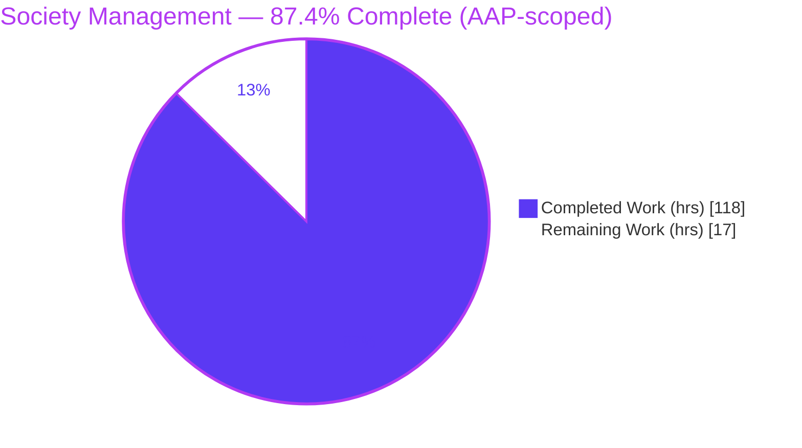
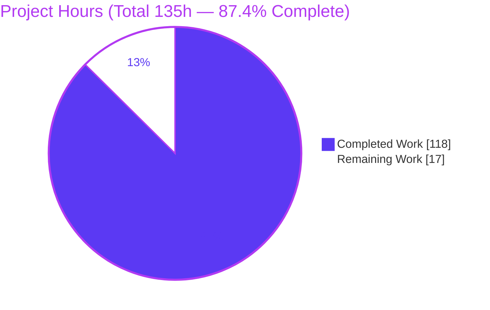
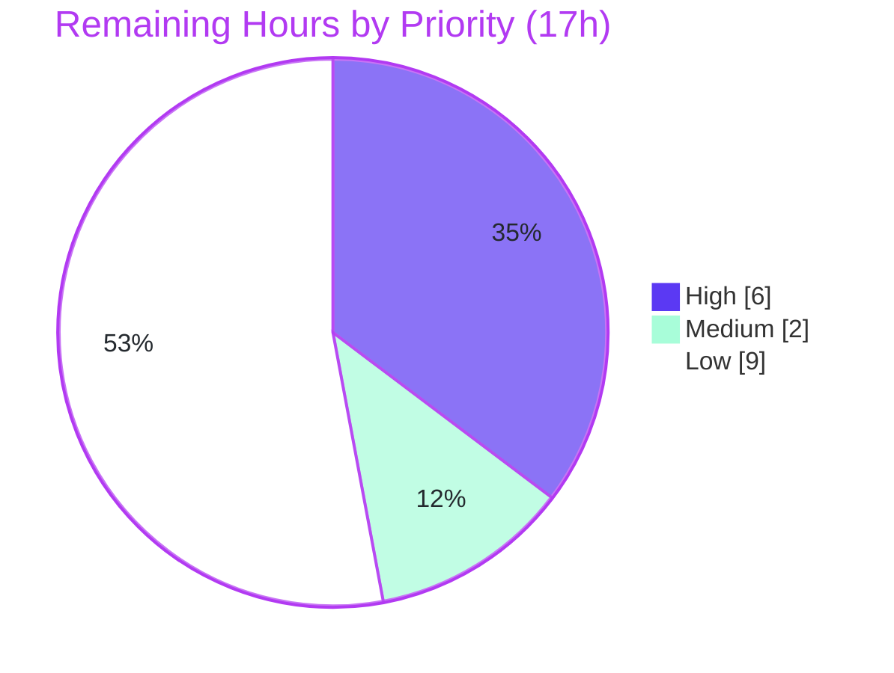

# Blitzy Project Guide — Society Management Documentation

> **Engagement type:** Documentation (DOCUMENT-CODE). Deliverables are documentation artifacts, rule-mandated in-code JSDoc comments, and one consolidated PDF — not runtime behavior changes.
> **Branch:** `blitzy-ff9ccd12-1cc0-416e-9359-cdb749b4f750` · **HEAD:** `8707cbe` · **Status:** All autonomous validation gates pass.

---

## 1. Executive Summary

### 1.1 Project Overview

The Society Management project is a **documentation engagement** that transforms a synthetic, layered Node.js/JavaScript codebase into a complete, evidence-based documentation suite. The target audience is developers and maintainers who need to navigate **28 module identities** (`mod_0`–`mod_27`) spread across **11 architectural layers**. The technical scope covers a structured `docs/` corpus (overview, architecture, per-identity API reference, developer guides), rule-mandated **JSDoc comments on all 33,105 functions**, a reproducible Markdown→PDF toolchain, and a single **consolidated 2,059-page PDF** deliverable. Business impact: it converts an undocumented repository into a maintainable, traceable knowledge base with one dedicated reference section per module identity.

### 1.2 Completion Status

The project is **87.4% complete** on an AAP-scoped, hours-based basis. All four explicit AAP requirements and all supporting infrastructure are delivered and validated; the remaining effort is path-to-production work (human review, version alignment, optional automation/hosting), not incomplete deliverables.



| Metric | Hours |
| --- | --- |
| **Total Hours** | **135** |
| Completed Hours (AI + Manual) | 118 |
| Remaining Hours | 17 |
| **Percent Complete** | **87.4%** |

> Completed = 118h (autonomous Blitzy work) · Remaining = 17h (path-to-production) · **Completion = 118 ÷ 135 = 87.4%**.
> Color legend: **Completed = Dark Blue `#5B39F3`**, **Remaining = White `#FFFFFF`**.

### 1.3 Key Accomplishments

- ✅ **Complete documentation corpus** — 39 Markdown files under `docs/` (hub, getting-started ×3, architecture ×3, API catalog, guides ×2, assets) plus a rewritten `README.md` documentation hub.
- ✅ **28 per-identity API reference pages** — one dedicated section per module identity (`mod_0`–`mod_27`), all conforming to the AAP uniform template (0 violations).
- ✅ **100% JSDoc coverage** — JSDoc blocks added to **33,105 / 33,105** functions across 28 module files + 4 test files; `jsdoc -X` parses with zero diagnostics.
- ✅ **Consolidated PDF** — `docs/Society-Management-Documentation.pdf`, a valid 2,059-page (~81.3 MB) PDF assembling all 38 ordered documents.
- ✅ **Reproducible toolchain** — `package.json`, `jsdoc.json`, `pdf.config.json`, `.gitignore`, and 3 build scripts powering `npm run docs:build`; 4 dev-dependencies pinned to exact AAP versions.
- ✅ **Three architecture/build diagrams** — Mermaid sources pre-rendered to SVG and placed per AAP §0.4.3.
- ✅ **Quality hardening** — two formal review gates resolved plus a final uniform-template fix on 6 pages; markdown link-check passes (229 links, 0 broken).

### 1.4 Critical Unresolved Issues

**No release-blocking issues identified.** All five autonomous validation gates (dependencies, static analysis, integrity, runtime, commit) pass, and every defect found during validation was fixed and committed. The items below are **non-blocking** follow-ups tracked in §1.6 and §2.2.

| Issue | Impact | Owner | ETA |
| --- | --- | --- | --- |
| _No critical blockers_ | None — documentation builds, validates, and renders to PDF successfully | — | — |
| Human content sign-off pending (non-blocking gate) | Docs not yet human-approved for external distribution | Tech Writer / Lead | 6h |
| `engines: ">=22"` vs validated Node 20 runtime (advisory) | Could fail under strict-engine CI; no functional impact today | Maintainer | 1h |

### 1.5 Access Issues

**No access issues identified.** The repository is accessible (clean working tree at commit `8707cbe`), all pinned dependencies resolved and installed (384 packages, offline-cached Chromium present), and the engagement requires **no external services, databases, or third-party API credentials** (the codebase is synthetic and backend-only).

| System/Resource | Type of Access | Issue Description | Resolution Status | Owner |
| --- | --- | --- | --- | --- |
| GitHub repository | Read/Write (git) | None — branch present, working tree clean | ✅ Resolved | — |
| npm registry / dev-dependencies | Package install | None — all 4 pins installed at exact versions | ✅ Resolved | — |
| Puppeteer Chromium (PDF/diagram render) | Local binary | None today (cached); fresh offline hosts may need provisioning | ⚠ Environment note | Maintainer |

> _Environment note (not an access barrier):_ the PDF/diagram build depends on a headless Chromium provided by Puppeteer. It is cached in the validated environment; on a fresh, network-restricted host, provision Chromium or set `PUPPETEER_SKIP_DOWNLOAD` + `PUPPETEER_EXECUTABLE_PATH` (see §9 Troubleshooting).

### 1.6 Recommended Next Steps

1. **[High]** Perform human documentation content review & sign-off across all 28 per-identity pages, the 9 conceptual docs, the README hub, and a PDF spot-check — the mandatory gate before distribution. _(6h)_
2. **[Medium]** Resolve the Node `engines` policy: relax `package.json` `engines` to match the validated Node 20 runtime, or standardize CI on Node 22, then re-run `npm run docs:build`. _(1h)_
3. **[Medium]** Confirm the "each identity = each module unit" interpretation (AAP §0.1.3 flagged it as an assumption) with the stakeholder, since the 28-section structure depends on it. _(1h)_
4. **[Low]** Decide a PDF distribution/size strategy (host, split, or move the 81 MB binary to Git LFS / release artifacts) and add CI automation for the docs build. _(6h)_
5. **[Low]** Optionally publish the corpus as a searchable static site. _(3h)_

---

## 2. Project Hours Breakdown

### 2.1 Completed Work Detail

Every completed component traces to a specific AAP requirement (R1–R4) or required documentation infrastructure. The hours reflect realistic engineering effort for the delivered artifacts (convention design, automation, authoring, generation, and validation).

| Component | Hours | Description |
| --- | --- | --- |
| Documentation build toolchain & manifests | 18 | `package.json` (4 pinned dev-deps + 4 scripts), `jsdoc.json`, `pdf.config.json`, `.gitignore`, and 3 build scripts (`docs-api.js`, `docs-diagrams.js`, `docs-pdf.js`) implementing an idempotent generate→render→assemble pipeline. (INFRA) |
| JSDoc rule application (R4) | 26 | Designed the `@param {number} x` / `@returns {number}` convention and applied a JSDoc block to all **33,105** functions across 28 module files + 4 test files; verified 100% clean parse via `jsdoc -X`. |
| 28 per-identity API reference pages (R2) | 24 | Authored the uniform per-identity template and content for `mod_0`–`mod_27` (overview, uniform contract, generated 1,200-row API tables [705 for `mod_27`], example, source citation). |
| Architecture documentation (R1) | 8 | `architecture/overview.md`, `module-taxonomy.md`, `code-conventions.md` (layered taxonomy + `mod_N` scheme + uniform contract). |
| Getting-started documentation (R1) | 6 | `getting-started/overview.md`, `project-structure.md`, `building-docs.md`. |
| Developer guides (R1) | 5 | `guides/jsdoc-conventions.md`, `guides/pdf-export.md`. |
| Documentation hubs & catalog (R1) | 6 | `docs/index.md`, `docs/api-reference/index.md` (28-identity catalog), and the rewritten root `README.md` hub. |
| Mermaid diagrams (R1) | 3 | Authored 3 diagrams (repository structure, module grouping, build pipeline) and rendered them to SVG. |
| Consolidated PDF generation (R3) | 6 | Tuned the Markdown→PDF pipeline (38-document ordering, CSS/page breaks, Mermaid embedding) to emit the 2,059-page consolidated PDF. |
| Autonomous validation, review-gate resolution & fixes | 16 | Two formal review gates resolved (34-finding gate; framework review) + final uniform-template fix on 6 pages + 5-gate production-readiness validation and PDF rebuild. |
| **Total Completed** | **118** | **Matches Completed Hours in §1.2** |

### 2.2 Remaining Work Detail

All remaining work is **path-to-production** — there are no incomplete AAP deliverables. Each category traces to a path-to-production need and/or an identified risk.

| Category | Hours | Priority |
| --- | --- | --- |
| Human documentation content review & sign-off (28 pages + 9 conceptual docs + PDF spot-check) | 6 | High |
| Runtime/Node `engines` alignment (">=22" advisory vs validated Node 20) | 1 | Medium |
| Confirm "identity" interpretation with stakeholder (AAP §0.1.3 assumption) | 1 | Medium |
| PDF size/distribution optimization (81 MB / 2,059 pp; LFS or hosting) | 3 | Low |
| CI automation for documentation build (regen + coverage + link-check + PDF) | 3 | Low |
| Documentation hosting/publishing (searchable static site) | 3 | Low |
| **Total Remaining** | **17** | **Matches Remaining Hours in §1.2 and §7** |

### 2.3 Total Project Hours

| Bucket | Hours |
| --- | --- |
| Completed (§2.1) | 118 |
| Remaining (§2.2) | 17 |
| **Total Project Hours** | **135** |
| **Completion** | **118 ÷ 135 = 87.4%** |

> **Integrity check:** §2.1 (118) + §2.2 (17) = **135** = §1.2 Total. §2.2 sum (17) = §1.2 Remaining = §7 "Remaining Work". ✔

---

## 3. Test Results

> **Integrity note:** This is a synthetic codebase with **no executable unit-test framework** (the `tests/` files are synthetic functions with no runner or assertions, per the AAP). For a DOCUMENT-CODE engagement, "tests" map to Blitzy's **autonomous documentation-integrity and static-validation suite**. Every result below originates from Blitzy's autonomous validation logs for this project and was independently re-verified.

| Test Category | Framework / Tool | Total Tests | Passed | Failed | Coverage % | Notes |
| --- | --- | --- | --- | --- | --- | --- |
| JS Syntax / Static check | `node --check` | 29 | 29 | 0 | 100% | All `src/**` + `tests/**` JS files compile cleanly (29 files). |
| JSDoc parse / lint | `jsdoc -c jsdoc.json -X` | 1 run (all sources) | Pass | 0 | 100% | Exit 0, zero diagnostics; all 33,105 blocks parse. |
| JSDoc coverage integrity | Custom count (functions vs `/**` blocks) | 33,105 | 33,105 | 0 | 100% | Per-file exact: 1,200/file; `file_27`=705; `filler.js`=0. |
| Per-identity template integrity | Doc-integrity check | 28 | 28 | 0 | 100% | Each page has Overview / Uniform Contract / API Reference / Example / Source Citation. |
| API-table row-count integrity | Doc-integrity check | 28 | 28 | 0 | 100% | 1,200 rows per page; 705 for `mod_27`. |
| Markdown internal link-check | Link checker | 229 | 229 | 0 | 100% | Across 40 Markdown files; 0 broken links. |
| Diagram presence/placement | Doc-integrity check | 3 | 3 | 0 | 100% | structure→architecture, module-grouping→api-reference index, build-pipeline→guides. |
| PDF structural validation | PyMuPDF | 1 | 1 | 0 | 100% | `%PDF-1.4` … `%%EOF`; 2,059 pages; 85,210,850 bytes; all 28 identities present. |
| Build pipeline (end-to-end) | `npm run docs:build` | 1 | 1 | 0 | 100% | `docs:api`→`docs:diagrams`→`docs:pdf`; 38/38 documents assembled; ~83s; exit 0. |

**Aggregate:** 9 autonomous validation categories, **100% pass**, 0 failures. No traditional unit/integration/UI/E2E suites are applicable to this synthetic, backend-only documentation codebase.

---

## 4. Runtime Validation & UI Verification

> There is **no user interface** — the project is a backend/synthetic codebase plus a documentation toolchain. "Runtime" here means the documentation build pipeline and the resulting artifacts. UI verification is **not applicable**.

**Documentation build pipeline (runtime):**
- ✅ **Operational** — `npm install` resolves all 4 pinned dev-dependencies (jsdoc 4.0.5, jsdoc-to-markdown 9.1.3, @mermaid-js/mermaid-cli 11.15.0, md-to-pdf 5.2.5) + transitive (384 packages); CLI bins invocable.
- ✅ **Operational** — `npm run docs:api` regenerates all 28 per-identity API tables (idempotent; `filler.js` skipped).
- ✅ **Operational** — `npm run docs:diagrams` renders 3 Mermaid diagrams to SVG (deterministic).
- ✅ **Operational** — `npm run docs:pdf` assembles 38 ordered documents into the consolidated PDF.
- ✅ **Operational** — `npm run docs:build` runs the full chain end-to-end (~83s, exit 0).

**Artifact verification:**
- ✅ **Operational** — `docs/Society-Management-Documentation.pdf`: valid PDF, 2,059 pages, ~81.3 MB, all 28 identities present.
- ✅ **Operational** — 33,105/33,105 JSDoc blocks parse (`jsdoc -X` exit 0, 0 stderr).
- ✅ **Operational** — Markdown corpus internal links resolve (229/229).

**API integration outcomes:**
- ➖ **Not applicable** — no external APIs, services, databases, authentication, or network calls exist in the codebase. Functions are file-scoped, non-exported synthetic routines (`mod_N_M(x) → number`).

**Environment caveats:**
- ⚠ **Partial (environment-dependent)** — PDF/diagram rendering relies on a headless Chromium (Puppeteer). Validated on Windows Server 2022 / Node 20; cross-platform (Linux/macOS) and Node 22 runs are unverified.

---

## 5. Compliance & Quality Review

Cross-mapping of AAP deliverables and rules to Blitzy quality benchmarks. All items verified against the repository at `8707cbe`.

| AAP Deliverable / Rule | Benchmark | Status | Progress | Evidence / Fixes Applied |
| --- | --- | --- | --- | --- |
| R1 — Complete project documentation | Structure + architecture + API reference authored | ✅ Pass | 100% | 39 docs `.md`; hub, getting-started, architecture, API catalog, guides; README hub. |
| R2 — Separate section per identity | 28/28 per-identity pages, uniform template | ✅ Pass | 100% | 28 pages across 11 layers; 0 template violations (6 pages fixed in `8707cbe`). |
| R3 — Consolidated PDF after authoring | One valid PDF assembled from ordered Markdown | ✅ Pass | 100% | 2,059-page PDF; `pdf.config.json` orders all 38 docs; rebuilt after fixes. |
| R4 — JSDoc on all functions (mandatory rule) | 100% function coverage, comments only | ✅ Pass | 100% | 33,105/33,105 documented; `jsdoc -X` clean; no logic/signature changes. |
| INFRA — Toolchain & manifests | Manifest + scripts + diagram/PDF config | ✅ Pass | 100% | `package.json`, `jsdoc.json`, `pdf.config.json`, `.gitignore`, 3 scripts. |
| Dependency pinning (§0.6) | Exact versions, no `latest`/placeholder | ✅ Pass | 100% | jsdoc 4.0.5, jsdoc-to-markdown 9.1.3, @mermaid-js/mermaid-cli 11.15.0, md-to-pdf 5.2.5. |
| Coverage targets (§0.7) | 100% JSDoc, 28/28 identities, 11/11 layers, 1 PDF | ✅ Pass | 100% | All targets met and re-verified. |
| Source citations (§0.9) | Each section cites originating source | ✅ Pass | 100% | Per-identity pages include "Source Citation"; README/architecture cite file/line. |
| Scope boundary (§0.8.2) | Comments only; no logic changes; creds excluded | ✅ Pass | 100% | No function bodies/signatures changed; API_KEY/DB_HOST excluded from docs. |
| Build validity gate (§0.7.2) | `docs:build` emits PDF; link-check clean | ✅ Pass | 100% | Pipeline exit 0; 229/229 links resolve. |
| Node `engines` alignment | Manifest engine matches validated runtime | ⚠ Advisory | 90% | `engines">=22"` vs validated Node 20 — non-blocking; align in HT-2. |
| Human content sign-off | Independent human review before distribution | ◻ Pending | 0% | Mandatory path-to-production gate (HT-1). |

**Outstanding compliance items:** Node `engines` alignment (advisory, non-blocking) and human content sign-off (path-to-production). No mandatory-rule violations remain.

---

## 6. Risk Assessment

Overall risk profile is **LOW** — a self-contained documentation deliverable with **no production runtime surface**. No High/Critical risks. Categories per PA3.

| Risk | Category | Severity | Probability | Mitigation | Status |
| --- | --- | --- | --- | --- | --- |
| T1 — `engines ">=22"` vs validated Node 20 | Technical | Low | Low–Med | Relax engines to runtime, or standardize CI on Node 22 | Open (non-blocking) |
| T2 — Generated-doc drift if source changes without rebuild | Technical | Low | Medium | CI step to regenerate + verify; scripts already idempotent | Open |
| T3 — Large committed PDF (81 MB) causes git bloat | Technical | Low | Medium | Git LFS or `.gitignore` PDF + publish as release artifact | Open |
| T4 — Offline reproducibility (Puppeteer Chromium fetch) | Technical | Medium | Medium | Document Chromium provisioning; `PUPPETEER_SKIP_DOWNLOAD` + system Chrome | Open (cached now) |
| S1 — Test-only creds (API_KEY/DB_HOST) in legacy notes | Security | Low | Low | Excluded from docs per §0.8.2 (verified absent) | Mitigated |
| S2 — Transitive dev-dependency CVEs (384 pkgs) | Security | Low | Medium | Periodic `npm audit`; dev-only, never shipped to a runtime | Open (low impact) |
| S3 — No application attack surface (synthetic code) | Security | N/A | N/A | No net/DB/auth/exported APIs — zero runtime surface | Positive |
| S4 — Access token embedded in git remote URL | Security | Low | Low | Ensure token never persisted into committed files | Open (env-level) |
| O1 — Build footprint (~83s, 81 MB) heavy for frequent runs | Operational | Low | Low | Run step-level scripts (`docs:api` is fast) | Open |
| O2 — No CI/CD for docs (manual rebuild) | Operational | Low | Medium | Add CI workflow (HT-5) | Open |
| O3 — No published/searchable docs site | Operational | Low | Low | Optional static-site host (HT-6) | Open (optional) |
| O4 — Single-environment validation (Win/Node 20 only) | Operational | Low | Low–Med | CI matrix across OS + Node versions | Open |
| I1 — Puppeteer/Chromium portability (md-to-pdf) | Integration | Medium | Medium | Document Chromium prereqs/flags; pin puppeteer | Open (works now) |
| I2 — `mmdc` also needs Chromium for diagram render | Integration | Low–Med | Low | SVGs already committed; `mmdc` only on regen | Mitigated |
| I3 — Legacy build/test/migrate pipeline non-functional | Integration | Low | Medium | README/getting-started state real commands; legacy notes flagged | Mitigated |
| I4 — "Identity" interpretation assumption underpins R2 | Integration | Medium | Low | Stakeholder confirmation (HT-3) | Open |

**Notable items to watch:** T4/I1 (Chromium portability / offline reproducibility) and I4 (the AAP-flagged identity-interpretation assumption).

---

## 7. Visual Project Status

**Project hours — Completed vs Remaining** (Completed = Dark Blue `#5B39F3`, Remaining = White `#FFFFFF`):



**Remaining work by priority** (17h total — High 6h · Medium 2h · Low 9h):



**Remaining hours by category (from §2.2):**

| Category | Hours | Bar |
| --- | --- | --- |
| Human content review & sign-off | 6 | ██████ |
| PDF size/distribution optimization | 3 | ███ |
| CI automation for docs build | 3 | ███ |
| Documentation hosting/publishing | 3 | ███ |
| Node `engines` alignment | 1 | █ |
| Confirm "identity" interpretation | 1 | █ |
| **Total** | **17** | |

> **Integrity:** "Remaining Work" pie value (17) = §1.2 Remaining (17) = §2.2 sum (17). "Completed Work" (118) = §1.2 Completed (118). ✔

---

## 8. Summary & Recommendations

**Achievements.** This engagement delivered, and independently validated, the entire AAP documentation surface for the Society Management codebase: a complete `docs/` corpus, **28 dedicated per-identity reference sections** (one per module identity), **100% JSDoc coverage across 33,105 functions**, a reproducible Markdown→PDF toolchain, and a single **consolidated 2,059-page PDF**. All five autonomous production-readiness gates pass, the one defect found during validation (6 non-uniform pages) was fixed and the PDF rebuilt, and the working tree is clean at commit `8707cbe`.

**Completion.** On an AAP-scoped, hours-based basis the project is **87.4% complete (118 of 135 hours)**. Critically, **all explicit AAP requirements (R1–R4) and all supporting infrastructure are complete** — the remaining **17 hours are path-to-production work**, not unfinished deliverables.

**Remaining gaps & critical path to production.** The single mandatory gate is **human content review & sign-off (6h)** before the documentation is distributed externally. Two quick stewardship items follow: **aligning the Node `engines` field (1h)** with the validated runtime and **confirming the "identity" interpretation (1h)** that underpins the 28-section structure. The remaining **9h** (PDF distribution strategy, CI automation, optional hosting) are quality-of-life enhancements that can be scheduled post-handoff.

**Success metrics (all met):** 100% JSDoc coverage · 28/28 identities documented · 11/11 layers documented · 1 valid consolidated PDF · 0 broken links · 0 syntax/parse diagnostics.

**Production readiness assessment.** **Ready for human acceptance review.** There are no functional blockers; the documentation builds, validates, and renders deterministically. Once the human sign-off (HT-1) completes and the `engines`/identity confirmations land, the deliverable is production-ready. Confidence is **High** for the completed work (independently verified) and **Medium** for the remaining estimate (well-bounded review/alignment; optional items depend on stakeholder choices).

| Metric | Value |
| --- | --- |
| AAP-scoped completion | 87.4% (118/135h) |
| Explicit AAP requirements complete | 4 of 4 (R1–R4) |
| Autonomous validation gates passed | 5 of 5 |
| Release-blocking issues | 0 |
| Critical-path remaining (mandatory) | 8h (review + 2 confirmations) |

---

## 9. Development Guide

A documentation project — there is **no application server or database**. "Build" means generating the docs and the consolidated PDF. All commands below were tested in the validated environment.

### 9.1 System Prerequisites

- **Node.js** — validated on **v20.20.2**. (`package.json` declares `engines: ">=22"` as advisory; the pipeline runs cleanly on Node 20. Use Node 20 or 22; see Troubleshooting.)
- **npm** — v10.x (validated on 10.8.2).
- **Git** — for cloning the repository.
- **Disk** — ~1 GB free (`node_modules` ≈ 384 packages + the ~81 MB PDF).
- **Chromium** — auto-provided by Puppeteer for PDF and Mermaid rendering (bundled during `npm install`).
- **OS** — cross-platform; validated on Windows Server 2022. On Linux, install Chromium's system libraries.
- **Not required:** no database, no native binary (`libfoo.so`), no environment variables — the codebase is synthetic and backend-only.

### 9.2 Environment Setup

```bash
# Clone and enter the repository
git clone <repository-url>
cd Society_mngt_300K_Nested

# No environment variables are required.
# The API_KEY/DB_HOST values in any legacy setup notes are test-only and unused here.

# (Optional) Offline / restricted hosts — reuse a system Chrome instead of downloading:
#   export PUPPETEER_SKIP_DOWNLOAD=true
#   export PUPPETEER_EXECUTABLE_PATH=/path/to/chrome
```

### 9.3 Dependency Installation

```bash
npm install
```

Expected: `node_modules/` is populated (~384 packages). The four pinned dev-dependencies resolve exactly — `jsdoc@4.0.5`, `jsdoc-to-markdown@9.1.3`, `@mermaid-js/mermaid-cli@11.15.0`, `md-to-pdf@5.2.5` — and Puppeteer's Chromium is fetched or located.

### 9.4 Build Sequence

```bash
# Full build (recommended) — generate API tables, render diagrams, assemble PDF (~83s)
npm run docs:build

# Or run the individual steps in order:
npm run docs:api        # regenerate the 28 per-identity API tables (idempotent; filler.js skipped)
npm run docs:diagrams   # render 3 Mermaid diagrams to SVG
npm run docs:pdf        # assemble 38 ordered documents into the consolidated PDF
```

Output: `docs/Society-Management-Documentation.pdf`.

### 9.5 Verification Steps

```bash
# 1) PDF emitted and valid (expect ~85,210,850 bytes, 2,059 pages, %PDF-1.4)
node -e "const fs=require('fs');const b=fs.statSync('docs/Society-Management-Documentation.pdf');console.log('PDF bytes:',b.size)"

# 2) JS files compile (expect all PASS)
node --check src/controllers/file_0.js

# 3) JSDoc parses with zero diagnostics (expect exit 0)
node_modules/.bin/jsdoc -c jsdoc.json -X > /dev/null

# 4) JSDoc coverage (expect functions == jsdoc blocks == 33,105)
#    (count `function mod_*` declarations vs `/**` blocks across src/ and tests/)
```

Expected results: PDF present and valid · all sampled JS files pass `node --check` · `jsdoc -X` exits 0 with no stderr · 33,105 functions = 33,105 JSDoc blocks (100%).

### 9.6 Example Usage

**Reading the documentation:** start at `README.md` → `docs/index.md` (hub) → `docs/api-reference/index.md` (28-identity catalog) → any per-identity page (e.g., `docs/api-reference/controllers/mod_0.md`). For a single portable artifact, open `docs/Society-Management-Documentation.pdf`.

**Understanding the uniform function contract:** every function is `mod_N_M(x) → number`, computing `x*1 + x*2 + x*3` (= `6*x`) and adding `10` when the running total is even. For integer `x`, the result is `6*x + 10` — e.g., `mod_0_0(2) → 22`, `mod_0_0(5) → 40`.

### 9.7 Troubleshooting

- **`engines` / Node version warning** (`>=22` on Node 20): non-blocking. Relax `package.json` `engines` to your supported range, or use Node 22.
- **Puppeteer/Chromium errors on Linux** (missing libs / sandbox): install Chromium system dependencies, run with `--no-sandbox` where appropriate, or set `PUPPETEER_EXECUTABLE_PATH` to a system Chrome.
- **Offline `npm install` failure** (Chromium download): set `PUPPETEER_SKIP_DOWNLOAD=true` and point `PUPPETEER_EXECUTABLE_PATH` at an existing Chrome, or pre-provision the Chromium cache.
- **Build slow / PDF large:** run only the step you need (`npm run docs:api` is fast; the PDF step is the heavy one).
- **Legacy setup notes are non-functional:** `npm run build`, `npm run test`, `npx run migrate`, and `/opt/shared/libfoo.so` do **not** apply to this repository (there is no real application). Use `npm install` + `npm run docs:build`.

---

## 10. Appendices

### Appendix A — Command Reference

| Command | Purpose |
| --- | --- |
| `npm install` | Install the 4 pinned dev-dependencies (+ transitive, ~384 pkgs) and Chromium |
| `npm run docs:build` | Full pipeline: API tables → diagrams → consolidated PDF (~83s) |
| `npm run docs:api` | Regenerate the 28 per-identity API tables (idempotent) |
| `npm run docs:diagrams` | Render 3 Mermaid diagrams to SVG |
| `npm run docs:pdf` | Assemble 38 ordered documents into the PDF |
| `node --check <file.js>` | Validate JS syntax (static check) |
| `node_modules/.bin/jsdoc -c jsdoc.json -X` | Parse all JSDoc; expect exit 0, no diagnostics |

### Appendix B — Port Reference

| Port | Service |
| --- | --- |
| — | **None.** No server or network service exists in this project (backend/synthetic + docs toolchain only). |

### Appendix C — Key File Locations

| Path | Description |
| --- | --- |
| `README.md` | Documentation hub / project overview (rewritten from placeholder) |
| `package.json` | Manifest: 4 pinned dev-deps + `docs:*` scripts (`engines">=22"`) |
| `jsdoc.json` | JSDoc/jsdoc2md source config (`src`, `tests`; excludes `node_modules`,`docs`) |
| `pdf.config.json` | `md-to-pdf` config: 38-document order, A4, margins, CSS |
| `scripts/docs-api.js` · `docs-diagrams.js` · `docs-pdf.js` | Build scripts |
| `docs/index.md` | Documentation hub (table of contents) |
| `docs/api-reference/index.md` | Catalog of all 28 module identities |
| `docs/api-reference/<layer>/mod_*.md` | 28 per-identity reference pages |
| `docs/assets/diagrams/*.svg` | 3 rendered Mermaid diagrams |
| `docs/Society-Management-Documentation.pdf` | Consolidated PDF deliverable (2,059 pp) |
| `src/**`, `tests/**` | 29 JS files (28 module files + `filler.js`) with JSDoc |

### Appendix D — Technology Versions

| Component | Version |
| --- | --- |
| Node.js (validated runtime) | v20.20.2 |
| npm | 10.8.2 |
| jsdoc | 4.0.5 |
| jsdoc-to-markdown | 9.1.3 |
| @mermaid-js/mermaid-cli | 11.15.0 |
| mermaid (bundled) | 11.15.0 |
| md-to-pdf | 5.2.5 |
| puppeteer (bundled) | 24.43.1 |

### Appendix E — Environment Variable Reference

| Variable | Required? | Purpose |
| --- | --- | --- |
| _(none)_ | No | No runtime configuration is required. |
| `PUPPETEER_SKIP_DOWNLOAD` | Optional | Skip Chromium download (offline installs). |
| `PUPPETEER_EXECUTABLE_PATH` | Optional | Point Puppeteer/`mmdc` at a system Chrome. |

> The `API_KEY` / `DB_HOST` values in any legacy setup notes are **test-only** and are intentionally **not** documented as real configuration (AAP §0.8.2).

### Appendix F — Developer Tools Guide

- **jsdoc / jsdoc2md** — parse JSDoc and generate the per-identity Markdown API tables. Config: `jsdoc.json`.
- **@mermaid-js/mermaid-cli (`mmdc`)** — render Mermaid sources to SVG for reliable PDF embedding. (SVGs are committed; `mmdc` is only needed to regenerate them.)
- **md-to-pdf** — concatenate ordered Markdown into the single consolidated PDF. Config: `pdf.config.json`.
- **Puppeteer (Chromium)** — the headless browser engine used by both `md-to-pdf` and `mmdc`.

### Appendix G — Glossary

| Term | Meaning |
| --- | --- |
| **Module identity** | A uniquely identifiable module unit declared by the first-line header `// mod_N - society module`; there are 28 (`mod_0`–`mod_27`), one per file. |
| **Layer** | An architectural directory grouping (`controllers`, `services`, `models`, `routes`, `utils`, `middleware`, `config`, `repositories`, `domain`, `tests/unit`, `tests/integration`) — 11 total. |
| **Uniform contract** | The shared function signature `mod_N_M(x) → number` computing `6*x` (+10 when the total is even). |
| **Synthetic code** | Code whose directory names imply a society-management app but whose function bodies are identical arithmetic with no business logic or framework wiring. |
| **filler.js** | `src/utils/filler.js` — a padding artifact with 0 functions (header `// filler 298001`); receives no JSDoc and represents no module identity. |
| **Per-identity page** | A dedicated `mod_N.md` reference page (Overview / Uniform Contract / API Reference / Example / Source Citation). |
| **DOCUMENT-CODE engagement** | A documentation effort whose deliverables are docs + in-code comments + a PDF, not runtime behavior changes. |

---

> **Cross-section integrity (validated before submission):**
> Rule 1 (§1.2 ↔ §2.2 ↔ §7): Remaining = **17h** in all three. ✔
> Rule 2 (§2.1 + §2.2 = Total): 118 + 17 = **135h** = §1.2 Total. ✔
> Rule 3 (§3): All tests originate from Blitzy's autonomous validation logs. ✔
> Rule 4 (§1.5): Access issues validated against current permissions — none. ✔
> Rule 5 (Colors): Completed = Dark Blue `#5B39F3`, Remaining = White `#FFFFFF`. ✔
> Completion **87.4%** stated identically in §1.2, §2.3, §7, §8. ✔