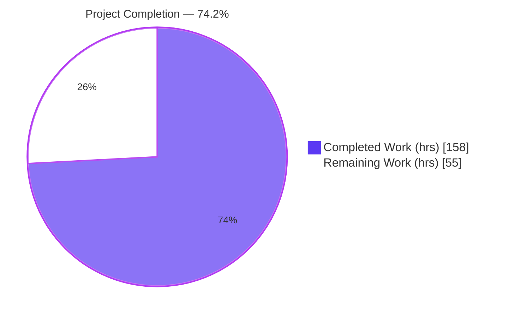
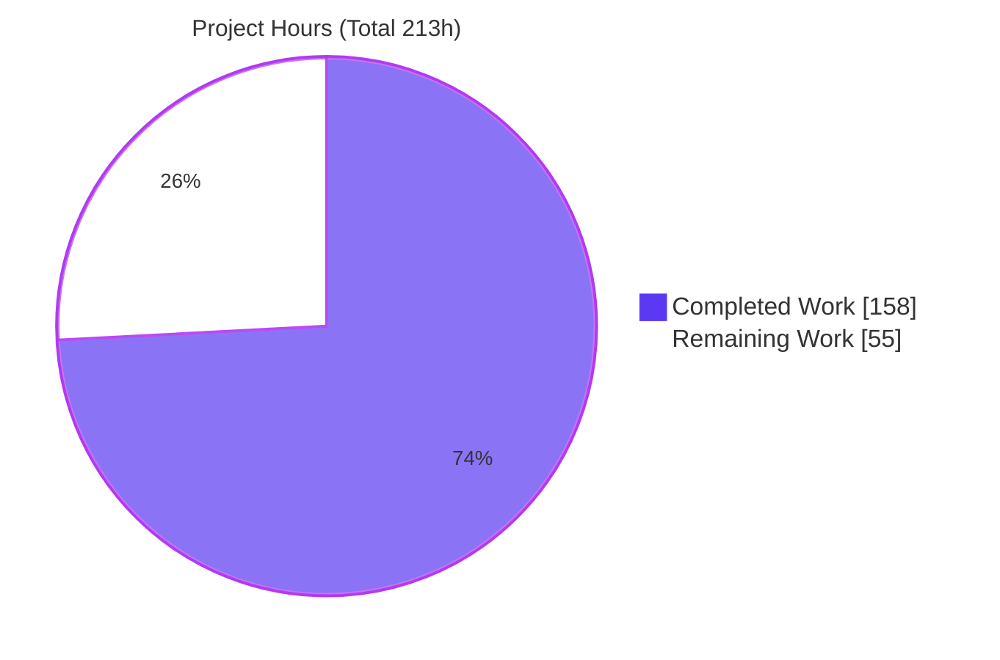
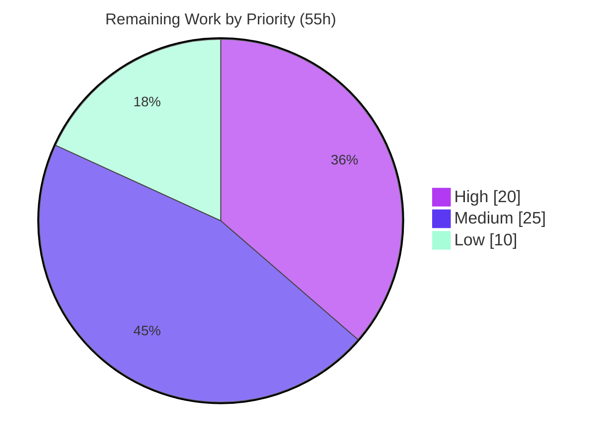

# Blitzy Project Guide — Society Management: Login & Reporting

> **Project:** Society Management (Node.js / Express REST API)
> **Feature Scope:** Login (Authentication) + Reporting
> **Branch:** `blitzy-e5e56aa3-e131-48ee-915b-182b9b72545b`
> **Assessment Methodology:** AAP-scoped completion (PA1) — completion measures autonomous work delivered against the Agent Action Plan plus standard path-to-production activities.

---

## 1. Executive Summary

### 1.1 Project Overview

The Society Management project adds two first-class capabilities — **Login (authentication)** and **Reporting** — to a layered Node.js scaffold that previously contained only synthetic filler code and no runnable entry point. The Login feature provides credential-based authentication for society administrators and members using bcrypt password hashing and signed, expiring JWT access tokens. The Reporting feature generates society domain reports (member directory, dues/collection summary, outstanding payments, occupancy) in JSON and CSV, with every endpoint guarded by the authentication layer. The work was delivered **additively** — no pre-existing file was altered except the README — fulfilling the user's explicit non-regression mandate. Target consumers are HTTP/REST clients interacting over JSON.

### 1.2 Completion Status

The project is **74.2% complete** on an AAP-scoped basis. All Agent Action Plan coding deliverables are fully implemented, tested, and verified; the remaining 55 hours are **path-to-production** activities (chiefly real database persistence and deployment hardening).



| Metric | Hours |
|--------|-------|
| **Total Project Hours** | **213** |
| Completed Hours (AI: 158 + Manual: 0) | **158** |
| Remaining Hours | **55** |
| **Percent Complete** | **74.2%** |

> Calculation: `158 / (158 + 55) = 158 / 213 = 74.2%`. Completed work is 100% autonomous (Blitzy agents); no manual hours have been logged yet.

### 1.3 Key Accomplishments

- ✅ **Login feature delivered** — register / login / logout / `GET /me` with async bcrypt hashing, signed+expiring JWTs, account lockout, and generic (anti-enumeration) error responses.
- ✅ **Reporting feature delivered** — 4 report types (members, dues, outstanding, occupancy) in JSON + CSV, every endpoint protected by the auth middleware.
- ✅ **Runnable application created** — Express composition root (`src/app.js`), HTTP bootstrap with graceful shutdown (`src/server.js`), and a complete `package.json`.
- ✅ **54 automated tests passing** (4 suites: unit + integration) via Jest + Supertest, independently re-verified.
- ✅ **Zero security vulnerabilities** — `npm audit` clean across 394 packages; all dependency versions pinned to the AAP specification.
- ✅ **Non-regression proven** — only `README.md` modified (additive); the ~300K-line filler corpus is byte-identical; acceptance criteria C1–C6 all pass.
- ✅ **Documentation delivered** — feature docs + a full API endpoint reference.

### 1.4 Critical Unresolved Issues

There are **no functional defects, compilation errors, or failing tests**. The items below are path-to-production gaps (intentional per the AAP), not bugs.

| Issue | Impact | Owner | ETA |
|-------|--------|-------|-----|
| In-memory data store loses all data on restart (no real DB) | High — not deployable for persistent real-world data | Backend team | 16h (2 days) |
| `JWT_SECRET` ships as a placeholder default in `.env.example` | High — forgeable tokens if a weak secret reaches production | DevOps / Security | 4h |
| No HTTP-layer rate limiting / security headers (helmet/CORS) | Medium — brute-force & common web exposure | Backend team | 6h |
| No CI/CD pipeline or container/deploy manifests | Medium — manual, error-prone deployment | DevOps | 11h |

### 1.5 Access Issues

**No access issues identified.** All build, test, and runtime validation completed successfully within the working environment.

| System/Resource | Type of Access | Issue Description | Resolution Status | Owner |
|-----------------|----------------|-------------------|-------------------|-------|
| Source repository | Read/Write | None — branch checked out, working tree clean | ✅ No issue | — |
| npm registry | Dependency install | None — 394 packages installed, 0 vulnerabilities | ✅ No issue | — |
| Runtime (Node 20) | Execute | None — server boots and serves all routes | ✅ No issue | — |

### 1.6 Recommended Next Steps

1. **[High]** Provision a high-entropy production `JWT_SECRET` via a secrets manager and add startup validation that rejects weak/default secrets (4h).
2. **[High]** Implement real database persistence behind the existing repository interface — schema, migrations, connection lifecycle, and re-run the test suite against the DB (16h).
3. **[Medium]** Add security hardening middleware (helmet, CORS policy, HTTP-layer rate limiting) (6h).
4. **[Medium]** Containerize the application and stand up a CI/CD pipeline running `jest --ci` and `npm audit` on every push (11h).
5. **[Medium]** Integrate structured logging, monitoring/observability, and TLS termination configuration (8h).

---

## 2. Project Hours Breakdown

### 2.1 Completed Work Detail

All completed work was performed autonomously by Blitzy agents and independently re-verified during this assessment. Each component traces to an AAP requirement.

| Component | Hours | Description |
|-----------|-------|-------------|
| Login Feature vertical | 48 | 10 modules (1,863 LOC): routes, controller, service (credential verification, token issuance, lockout, anti-enumeration), user repository (in-memory CRUD + unique-by-email + seeding), user model, domain entity/roles, auth middleware (JWT verify + `requireRole`), auth config, password utils (async bcrypt), token utils (JWT). |
| Reporting Feature vertical | 34 | 7 modules (1,230 LOC): routes (auth-guarded), controller (content-type negotiation), service (4-report aggregation + overdue computation), report repository (seeded source data), report model DTOs, report-type enum, vanilla CSV exporter (RFC-4180 CRLF/quoting). |
| Automated Test Suite | 26 | 4 suites, 54 tests (1,116 LOC): unit (authService, reportService) + integration (authRoutes, reportRoutes) via Jest + Supertest. |
| Shared Infrastructure | 15 | 5 modules (656 LOC): centralized error handler, request logger, typed dotenv config loader, logger helper, validation helpers. |
| Composition Root & Manifest | 12 | `src/app.js` (Express assembly, middleware ordering), `src/server.js` (bootstrap + graceful SIGTERM/SIGINT shutdown), `package.json`, `.env.example`, `.gitignore`. |
| Documentation | 11 | `docs/api/endpoints.md` (342 LOC), `docs/features/login.md`, `docs/features/reporting.md`, additive README section (164 LOC). |
| Autonomous Validation, QA & Review Cycles | 12 | Multi-checkpoint code reviews (CP2/CP5 finding resolution), end-to-end runtime validation, dependency resolution + lockfile, link-integrity fixes. |
| **Total Completed** | **158** | |

> ✅ **Validation:** the Hours column sums to **158**, matching Completed Hours in §1.2.

### 2.2 Remaining Work Detail

All remaining work is **path-to-production** — the AAP feature code is 100% delivered. Each category traces to a deployment-readiness need.

| Category | Hours | Priority |
|----------|-------|----------|
| Real database persistence layer (schema, migrations, rewrite 2 repositories behind existing interface, connection lifecycle, re-test) | 16 | High |
| Production secrets management + startup secret-strength enforcement | 4 | High |
| Security hardening middleware (helmet headers, CORS policy, distributed rate-limiting) | 6 | Medium |
| Containerization + health-check endpoint + deployment manifests | 6 | Medium |
| CI/CD pipeline (automated lint/test/audit/build/deploy) | 5 | Medium |
| Structured logging + monitoring/observability integration | 5 | Medium |
| TLS/HTTPS termination + reverse-proxy / trust-proxy configuration | 3 | Medium |
| Distributed/persistent lockout & session store (multi-instance correctness) | 4 | Low |
| Load testing + security testing (perf, pen test, SAST/DAST automation) | 6 | Low |
| **Total Remaining** | **55** | |

> ✅ **Validation:** the Hours column sums to **55**, matching Remaining Hours in §1.2 and the §7 pie chart. **§2.1 (158) + §2.2 (55) = 213 = Total Project Hours.**

### 2.3 Effort Distribution Summary

| Bucket | Completed (h) | Remaining (h) | Total (h) |
|--------|---------------|---------------|-----------|
| Login feature | 48 | — | 48 |
| Reporting feature | 34 | — | 34 |
| Tests | 26 | — | 26 |
| Shared infra / composition | 27 | — | 27 |
| Documentation | 11 | — | 11 |
| Validation & QA | 12 | — | 12 |
| Persistence & production hardening | — | 55 | 55 |
| **Total** | **158** | **55** | **213** |

---

## 3. Test Results

All tests below originate from Blitzy's autonomous test execution logs and were **independently re-executed** during this assessment (`jest --ci`). Result: **4 suites passed, 54 tests passed, 0 failed**.

> ⚠️ **Note on count:** the original validation log summarized the reportService suite as 18 tests; independent re-execution confirms it is **16** (total breakdown 16/16/14/8 = 54). The total of 54 is correct; this guide uses the independently verified per-suite figures.

| Test Category | Framework | Total Tests | Passed | Failed | Coverage Focus | Notes |
|---------------|-----------|-------------|--------|--------|----------------|-------|
| Unit — authService | Jest | 16 | 16 | 0 | bcrypt-not-plaintext, duplicate-409, concurrency-safe creation, weak/invalid-email rejection, anti-privilege-escalation (role forced to member), anti-enumeration (identical 401), lockout threshold, admin seeding | All pass |
| Unit — reportService | Jest | 16 | 16 | 0 | days-overdue, aggregation (member count, dues balance, outstanding derivation, occupancy distribution), JSON+CSV generation, unknown-type 400, format fallback, CSV CRLF/comma/quote/newline escaping | All pass |
| Integration — authRoutes | Jest + Supertest | 14 | 14 | 0 | register 201/400×3/409/concurrency, login 200+token / generic-401, `/me` 401-no-header/200/401-malformed, logout 200, JSON 404 envelopes | All pass |
| Integration — reportRoutes | Jest + Supertest | 8 | 8 | 0 | catalog 401/200, `:type` 401/200 (dues, members), CSV `text/csv` vs default JSON, unknown-type 400 | All pass |
| **Total** | | **54** | **54** | **0** | | **100% pass** |

**Supporting static & dependency checks (from autonomous validation logs, re-verified):**

- `node --check` on all 28 in-scope JS files → **0 syntax errors**.
- `require('./src/app')` loads the full module graph → returns a valid Express app, no wiring errors.
- `npm audit` → **0 vulnerabilities** (394 packages).
- `npm ls` → dependency tree fully satisfied (no missing/invalid/extraneous).

---

## 4. Runtime Validation & UI Verification

The application is a backend REST API with **no user interface** (no frontend, templating engine, or component library exists in the repository, and no Figma designs were supplied). UI verification is therefore **not applicable**; the interaction contract is programmatic (JSON request/response + CSV downloads). Runtime behavior was independently re-validated by booting the server and exercising the live HTTP surface.

**Runtime health:**

- ✅ **Server boot** — `node src/server.js` starts cleanly and logs `Server listening on port <PORT>` with the `/api/auth` and `/api/reports` mounts.
- ✅ **Graceful shutdown** — SIGTERM/SIGINT trigger `server.close()` with clean port release.
- ✅ **Module graph** — loads with no require-time errors.

**API integration outcomes (live e2e):**

- ✅ `POST /api/auth/register` → **201**, returns sanitized user (no password; role defaults to `member`).
- ✅ `POST /api/auth/login` → **200**, returns a signed JWT (~248 chars).
- ✅ `GET /api/auth/me` → **401** without a token, **200** with a valid token, **401** for a malformed header.
- ✅ `POST /api/auth/logout` → **200**.
- ✅ `GET /api/reports` (catalog) → **401** unauthenticated, **200** with token (lists 4 report types).
- ✅ `GET /api/reports/:type` → **200** JSON for known types (dues, members), **400** for unknown type.
- ✅ `GET /api/reports/dues?format=csv` → **200** with `Content-Type: text/csv; charset=utf-8`.
- ✅ Unknown route → **404** JSON error envelope.

**Partial / not-yet-configured (path-to-production):**

- ⚠️ Persistence — data resides in-memory and is cleared on restart.
- ⚠️ Observability — logging is minimal/console-based; no metrics or health-check endpoint yet.

---

## 5. Compliance & Quality Review

The table maps each AAP acceptance criterion and quality benchmark to its verified status. Fixes were applied autonomously during prior checkpoints (CP2: 4 MAJOR + 6 MINOR; CP5: 4 findings; documentation link integrity); **no findings remain open** within AAP scope.

| Benchmark | Requirement | Status | Evidence / Progress |
|-----------|-------------|--------|---------------------|
| **C1 — No existing file mutated** | Additive-only; existing files byte-identical | ✅ Pass | `git diff` baseline→HEAD: only `README.md` modified (additive); 35 files added |
| **C2 — Additive wiring only** | New code imports no filler module | ✅ Pass | All wiring concentrated in `src/app.js`; no import of any `file_*.js` |
| **C3 — Functional verification** | `npm test` passes (Jest `--ci`) | ✅ Pass | 54/54 tests pass across 4 suites |
| **C4 — Buildability & boot** | `npm install` resolves; `node src/server.js` serves routes | ✅ Pass | 0 vulnerabilities; server boots; routes respond |
| **C5 — Corpus integrity** | ~300K-line filler corpus unchanged | ✅ Pass | `society_mgmt_300k.zip` git blob byte-identical (`ef80180…`) |
| **C6 — Security baseline** | bcrypt hashes, signed+expiring JWT, generic errors, `.env` uncommitted | ✅ Pass | Async bcrypt; JWT signed with secret + `expiresIn`; identical 401 parity; `.env` git-ignored |
| Dependency hygiene | Pinned, current, low-footprint deps | ✅ Pass | express@5.2.1, jsonwebtoken@9.0.3, bcryptjs@3.0.3, dotenv@17.4.2, jest@30.4.2, supertest@7.2.2 |
| Zero placeholder policy | No stubs/TODO/FIXME/NotImplemented in new code | ✅ Pass | Grep clean (only doc comments referencing the out-of-scope filler) |
| Layered architecture | Code placed in existing layer folders | ✅ Pass | routes/controllers/services/repositories/models/domain/middleware/config/utils |
| Reporting-depends-on-Login | Every report endpoint auth-guarded | ✅ Pass | `authenticate` applied to all `/api/reports` routes |
| Production hardening | helmet/CORS/rate-limit/TLS | ⏳ Outstanding | Path-to-production (see §2.2) |

---

## 6. Risk Assessment

| Risk | Category | Severity | Probability | Mitigation | Status |
|------|----------|----------|-------------|------------|--------|
| In-memory store loses all data on restart | Technical | High | High | Implement real DB persistence behind existing repository interface | Open (by design) |
| Single-process state (store + lockout per instance) breaks horizontal scaling | Technical | Medium | Medium | Shared DB + distributed cache (Redis) | Open |
| No migrations / schema evolution path | Technical | Medium | Medium | Adopt a migration tool with the DB layer | Open |
| `JWT_SECRET` placeholder default could reach production | Security | High | Medium | Secrets manager + startup strength enforcement | Open |
| No HTTP-layer rate limiting (only per-account in-memory lockout) | Security | Medium | Medium | `express-rate-limit` / WAF | Open |
| No security headers (helmet) / CORS policy | Security | Medium | Medium | Add helmet + explicit CORS policy | Open |
| No app-layer TLS (cleartext if not terminated upstream) | Security | High (if exposed) | Low | TLS termination at proxy + HSTS | Open |
| Minimal console logging; no monitoring/metrics/alerting | Operational | Medium | High | Structured logging + observability stack | Open |
| No health-check / readiness probe | Operational | Low–Med | Medium | Add `/health` endpoint | Open |
| No automated backup/restore (follows from no DB) | Operational | Medium | Medium | Backup strategy with the DB layer | Open |
| No CI/CD → manual deploy regression risk | Operational | Medium | Medium | CI/CD running `jest --ci` + `npm audit` | Open |
| Real-DB integration untested (persistence swap pending) | Integration | Medium | Medium | Integration tests against the DB | Open |
| Multi-instance deployment untested (session/lockout coherence) | Integration | Medium | Low–Med | Distributed store + multi-instance test | Open |
| Reverse-proxy / trust-proxy not configured | Integration | Low | Medium | Configure `trust proxy` + forwarding | Open |

> **Mitigated (not risks):** bcrypt hashing, signed+expiring JWTs, generic-401 anti-enumeration, anti-privilege-escalation, and the Reporting-depends-on-Login guard are all implemented and verified.

---

## 7. Visual Project Status

**Project hours — completed vs remaining** (Completed = Dark Blue `#5B39F3`, Remaining = White `#FFFFFF`):



**Remaining work by priority** (55h total):



**Remaining hours by category (§2.2):**

| Category | Hours | Bar |
|----------|------:|-----|
| Database persistence | 16 | ████████████████ |
| Security hardening | 6 | ██████ |
| Containerization & health | 6 | ██████ |
| Load & security testing | 6 | ██████ |
| CI/CD pipeline | 5 | █████ |
| Logging & observability | 5 | █████ |
| Production secrets | 4 | ████ |
| Distributed session/lockout | 4 | ████ |
| TLS/HTTPS & proxy | 3 | ███ |
| **Total** | **55** | |

> ✅ **Integrity:** "Remaining Work" = **55** here, in §1.2, and as the sum of §2.2 — all identical.

---

## 8. Summary & Recommendations

**Achievements.** The Login and Reporting features requested by the user are **fully delivered, tested, and verified**. The project went from a non-runnable scaffold (no manifest, no entry point, no feature code) to a working, layered Express REST API: 35 new files, ~6,125 lines of authored code, 54 passing automated tests, and complete documentation — all delivered **additively** with the ~300K-line filler corpus left byte-identical and the user's non-regression mandate provably satisfied (criteria C1–C6 all pass).

**Remaining gaps.** With AAP coding complete, the project is **74.2% complete** on an AAP-scoped + path-to-production basis. The **55 remaining hours** are deployment-readiness work, dominated by replacing the by-design in-memory store with real database persistence (16h) and securing production secrets (4h), followed by standard hardening (security middleware, TLS, observability) and delivery automation (containerization, CI/CD).

**Critical path to production.**
1. Real database persistence (16h) → unblocks durable data and horizontal scaling.
2. Production secret management + strength enforcement (4h) → closes the highest-severity security exposure.
3. Security hardening + TLS (9h) → web-exposure baseline.
4. Containerization + CI/CD (11h) → repeatable, safe delivery.
5. Observability + distributed state + load/security testing (15h) → operability and scale confidence.

**Success metrics.**

| Metric | Target | Current |
|--------|--------|---------|
| Automated tests passing | 100% | ✅ 54/54 (100%) |
| Dependency vulnerabilities | 0 | ✅ 0 |
| Non-regression (existing files unchanged) | 100% | ✅ Proven (C1/C5) |
| AAP acceptance criteria (C1–C6) | All pass | ✅ 6/6 |
| Production-readiness (persistence + deploy) | Complete | ⏳ 55h remaining |

**Production readiness assessment.** **Feature-complete and demo-ready, but not yet production-ready.** The application is safe to run and evaluate immediately; before serving real members it requires persistent storage and the production-hardening tasks in §2.2. No defects block this work — the remaining effort is additive infrastructure.

---

## 9. Development Guide

### 9.1 System Prerequisites

| Requirement | Version | Notes |
|-------------|---------|-------|
| Node.js | ≥ 18 (LTS 20.x or 22.x recommended) | Enforced via `package.json` `engines`; validated on v20.20.2 |
| npm | ≥ 9 | Validated on 11.1.0 |
| OS | Linux / macOS / Windows | Pure-JS deps (bcryptjs) — no native build toolchain required |

### 9.2 Environment Setup

```bash
# 1) From the repository root, create your local environment file
cp .env.example .env

# 2) Generate and set a strong JWT secret (do NOT use the placeholder in production)
#    Then edit .env and replace the JWT_SECRET value with the output below:
openssl rand -hex 32
```

`.env` variables (loaded by `dotenv` via `src/config/index.js`):

| Variable | Example | Purpose |
|----------|---------|---------|
| `JWT_SECRET` | `<64-hex-char random>` | Secret for signing/verifying JWTs (**override the placeholder**) |
| `JWT_EXPIRES_IN` | `1h` | Access-token lifetime (ms-style duration) |
| `BCRYPT_ROUNDS` | `10` | bcrypt cost factor (10–12 typical) |
| `PORT` | `3000` | HTTP listen port |

> `.env` is git-ignored and must never be committed — only `.env.example` is tracked.

### 9.3 Dependency Installation

```bash
# Standard install
npm install
# -> adds 394 packages, audited, 0 vulnerabilities

# For reproducible / CI installs (uses package-lock.json exactly)
npm ci
```

### 9.4 Application Startup

```bash
# Production-style start
npm start
# (equivalent to: node src/server.js)

# Development with auto-reload
npm run dev

# Expected boot output:
#   Server listening on port 3000 (env: development)
#     - Auth endpoints   -> /api/auth
#     - Report endpoints -> /api/reports
```

### 9.5 Verification Steps

```bash
# Run the full automated test suite
npm test
# Expected:
#   Test Suites: 4 passed, 4 total
#   Tests:       54 passed, 54 total
```

### 9.6 Example Usage

```bash
# 1) Register a user (returns 201; role defaults to "member")
curl -s -X POST http://localhost:3000/api/auth/register \
  -H "Content-Type: application/json" \
  -d '{"email":"admin@society.test","password":"StrongP@ss1","name":"Society Admin"}'

# 2) Login and capture the JWT
TOKEN=$(curl -s -X POST http://localhost:3000/api/auth/login \
  -H "Content-Type: application/json" \
  -d '{"email":"admin@society.test","password":"StrongP@ss1"}' \
  | node -e "let d='';process.stdin.on('data',c=>d+=c);process.stdin.on('end',()=>console.log(JSON.parse(d).token))")

# 3) Current user
curl -s http://localhost:3000/api/auth/me -H "Authorization: Bearer $TOKEN"

# 4) List available reports
curl -s http://localhost:3000/api/reports -H "Authorization: Bearer $TOKEN"
# -> {"reports":[{"type":"members",...},{"type":"dues",...},{"type":"outstanding",...},{"type":"occupancy",...}]}

# 5) Dues report as CSV (Content-Type: text/csv; charset=utf-8)
curl -s "http://localhost:3000/api/reports/dues?format=csv" -H "Authorization: Bearer $TOKEN"
# -> unitNumber,memberName,period,amountDue,amountPaid,balance
#    A-101,Asha Rao,2026-05,2500,2500,0
```

### 9.7 Troubleshooting

| Symptom | Likely Cause | Resolution |
|---------|--------------|------------|
| `EADDRINUSE` on startup | Port already in use | Set a different `PORT` in `.env` or free the port |
| `401` on every protected route | Missing/expired Bearer token, or `JWT_SECRET` changed after issuing a token | Re-login to obtain a fresh token; keep `JWT_SECRET` stable |
| `Cannot find module …` | Dependencies not installed | Run `npm install` (or `npm ci`) from the repo root |
| CSV "looks broken" in a terminal | RFC-4180 CRLF line endings (intentional) | Open in a spreadsheet or with `--output file.csv` |
| Data disappears after restart | In-memory store (by design) | Implement the database persistence task (§2.2) |

---

## 10. Appendices

### Appendix A — Command Reference

| Command | Purpose |
|---------|---------|
| `npm install` / `npm ci` | Install dependencies (ci = reproducible from lockfile) |
| `npm start` | Start the server (`node src/server.js`) |
| `npm run dev` | Start with auto-reload (`node --watch`) |
| `npm test` | Run the Jest suite in CI mode (`jest --ci`) |
| `node --check <file>` | Syntax-check a JS file |
| `npm audit` | Report dependency vulnerabilities |

### Appendix B — Port Reference

| Port | Service | Configurable Via |
|------|---------|------------------|
| 3000 | HTTP API server (default) | `PORT` in `.env` |

### Appendix C — Key File Locations

| Path | Role |
|------|------|
| `src/app.js` | Express composition root (mounts routers + middleware) |
| `src/server.js` | HTTP bootstrap + graceful shutdown |
| `src/routes/authRoutes.js`, `src/routes/reportRoutes.js` | Endpoint definitions |
| `src/controllers/` | Request/response handlers |
| `src/services/authService.js`, `src/services/reportService.js` | Business logic |
| `src/repositories/` | In-memory data access (user, report) |
| `src/middleware/authMiddleware.js` | JWT verification + role guard |
| `src/config/index.js`, `src/config/authConfig.js` | Typed config + auth settings |
| `src/utils/` | passwordUtils, tokenUtils, csvExporter, validation, logger |
| `tests/unit/`, `tests/integration/` | Jest test suites (54 tests) |
| `docs/api/endpoints.md`, `docs/features/*.md` | API & feature documentation |
| `.env.example` | Environment variable template |

### Appendix D — Technology Versions

| Package | Version | Type |
|---------|---------|------|
| express | 5.2.1 | Runtime |
| jsonwebtoken | 9.0.3 | Runtime |
| bcryptjs | 3.0.3 | Runtime |
| dotenv | 17.4.2 | Runtime |
| jest | 30.4.2 | Dev |
| supertest | 7.2.2 | Dev |
| Node.js | ≥ 18 (validated 20.20.2) | Engine |

### Appendix E — Environment Variable Reference

| Variable | Required | Default (example) | Description |
|----------|----------|-------------------|-------------|
| `JWT_SECRET` | Yes | `change_me_to_a_long_random_secret` (placeholder — override!) | Signs/verifies JWTs |
| `JWT_EXPIRES_IN` | No | `1h` | Token lifetime |
| `BCRYPT_ROUNDS` | No | `10` | bcrypt cost factor |
| `PORT` | No | `3000` | HTTP listen port |

### Appendix F — API Endpoint Reference

| Method | Path | Auth | Description |
|--------|------|------|-------------|
| POST | `/api/auth/register` | Public | Register a user (role defaults to `member`) |
| POST | `/api/auth/login` | Public | Authenticate; returns a JWT |
| POST | `/api/auth/logout` | Public | Logout (stateless acknowledgement) |
| GET | `/api/auth/me` | Bearer | Current authenticated user |
| GET | `/api/reports` | Bearer | List available report types |
| GET | `/api/reports/:type` | Bearer | Generate a report (`?format=csv` for CSV; types: members, dues, outstanding, occupancy) |

### Appendix G — Glossary

| Term | Definition |
|------|------------|
| AAP | Agent Action Plan — the authoritative specification of project scope |
| JWT | JSON Web Token — signed, expiring stateless access token |
| bcrypt | Adaptive password-hashing function (here via pure-JS `bcryptjs`) |
| Anti-enumeration | Returning identical generic errors so attackers can't tell which accounts exist |
| Path-to-production | Standard deployment-readiness activities required to run AAP deliverables in production |
| In-memory store | Data held in process memory (non-persistent; cleared on restart) |
| RFC 4180 | The CSV format standard (CRLF line endings, quote escaping) |