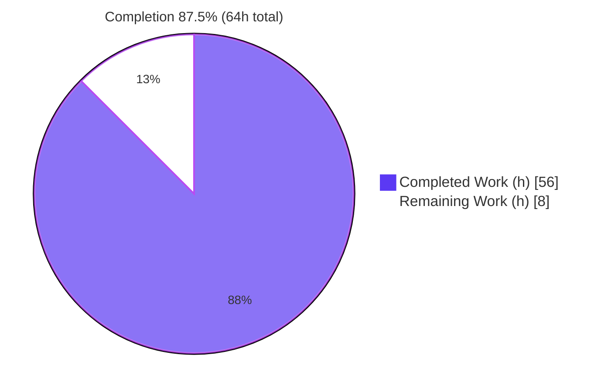
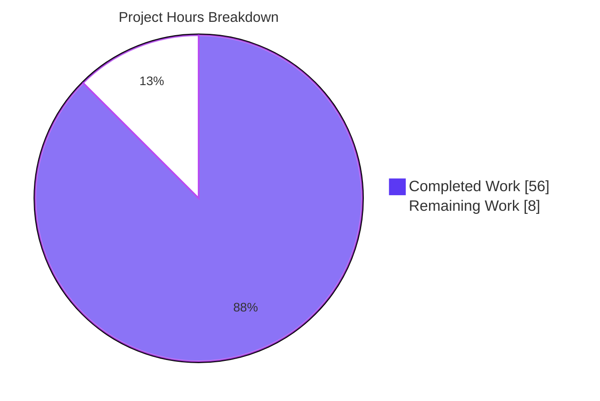
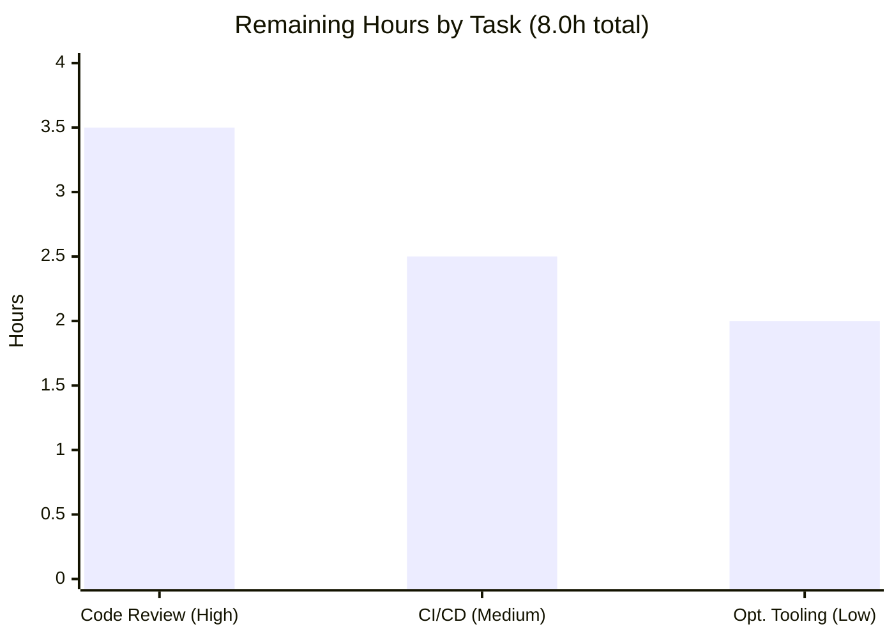

# Blitzy Project Guide — Society Management: JavaScript → Python Migration

## 1. Executive Summary

### 1.1 Project Overview

This project is a **tech-stack migration** that re-implements a JavaScript "Society Management" codebase as an idiomatic Python 3.14 package, in the same repository. The source (delivered inside the git-tracked archive `society_mgmt_300k.zip`) contained **33,105 byte-identical pure functions** (`mod_N_K(x)`) spread across 28 modules and ~300,000 lines of duplicated/dead code. The migration collapses that duplication into one canonical `society_compute(x)` while preserving every original function name as a thin, name-preserving binding, so callers observe **no contract change**. A genuine `pytest` equivalence suite proves behavioral parity. The deliverable is a pure, dependency-free library that is faster to load, dramatically smaller, fully type-hinted, PEP 8-clean, and 100% behavior-preserving. Target users are the internal teams that consume these arithmetic functions.

### 1.2 Completion Status

The project is **87.5% complete** on an AAP-scoped, hours-based basis. 100% of the Agent Action Plan engineering deliverables are implemented and independently validated; the remaining 8 hours are standard path-to-production activities (human review, CI/CD, optional tooling) that require a human.



| Metric | Hours |
|--------|-------|
| **Total Project Hours** | **64.0** |
| Completed Hours — AI (autonomous) | 56.0 |
| Completed Hours — Manual (human) | 0.0 |
| **Completed Hours (AI + Manual)** | **56.0** |
| **Remaining Hours** | **8.0** |
| **Percent Complete** | **87.5%** |

> Color legend — **Completed = Dark Blue `#5B39F3`**, **Remaining = White `#FFFFFF`**.

### 1.3 Key Accomplishments

- ✅ **Full JS→Python migration (O1):** all 28 source modules re-implemented in a Python `src`-layout package (`society_mgmt`).
- ✅ **Public surface preserved (O1):** all **33,105** `mod_N_K` names remain importable/callable — verified an exact name-set match (33,105 == 33,105, 0 differences).
- ✅ **De-duplication (O2):** ~300,000 duplicated/dead lines collapsed into a single canonical `society_compute(x)`; `filler.js` dropped; 28 unused `store = []` declarations removed.
- ✅ **Code quality (O3):** idiomatic, fully type-hinted, docstringed code; **`ruff check` clean** and **`ruff format` clean** across all 48 files.
- ✅ **Functionality proven (O4):** **276 genuine `pytest` tests pass** (0 failures) plus 5 core doctests; runtime equivalence confirmed over hundreds of thousands of binding-vs-core and JS-oracle assertions, 0 mismatches.
- ✅ **Standard Python packaging:** `pyproject.toml` (requires-python ≥ 3.14, src-layout, ruff + pytest config), `requirements.txt`, `.gitignore`, root `LICENSE` (MIT), and a fully rewritten 296-line `README.md`.
- ✅ **Correct restraint:** no fabricated database/migration/native-library/API code; no hardcoded secrets; Node/npm toolchain correctly not ported.

### 1.4 Critical Unresolved Issues

✅ **None.** All five autonomous validation gates (Dependencies, Compilation, Tests, Runtime, Code Quality) passed with zero errors and zero failures. No issue blocks release or validation.

| Issue | Impact | Owner | ETA |
|-------|--------|-------|-----|
| _None identified_ | — | — | — |

### 1.5 Access Issues

**No access issues identified.** The repository is fully accessible, the working tree is clean, the branch and HEAD commit are reachable, and the local virtual environment (CPython 3.14.5) is functional and reproduced all validation results.

| System/Resource | Type of Access | Issue Description | Resolution Status | Owner |
|-----------------|----------------|-------------------|-------------------|-------|
| Repository (branch `blitzy-544ffdff…`) | Read/Write | None — clean working tree, HEAD `513a90c` reachable | ✅ No issue | — |
| Local `.venv` (Python 3.14.5) | Execute | None — pytest/ruff/import all functional | ✅ No issue | — |
| PyPI (for CI / wheel build) | Network | Not required for current validation; needed only for future CI runners & release-wheel build isolation | ⚠ Provision in CI | Platform/DevOps |

### 1.6 Recommended Next Steps

1. **[High]** Perform human code review of the 53-file diff and approve/merge the migration branch to mainline.
2. **[Medium]** Add a CI/CD pipeline (Python 3.14) that runs `ruff check`, `ruff format --check`, and `pytest` on every push/PR.
3. **[Low]** Adopt optional quality tooling — `pytest-cov` (coverage gate) and `mypy` (static type checking) — and wire them into CI.
4. **[Low]** Decide on distribution: build sdist/wheel (`python -m build`) and publish to the internal index if cross-team consumption is intended.

---

## 2. Project Hours Breakdown

### 2.1 Completed Work Detail

All completed work is autonomous (AI) engineering delivered by Blitzy agents and traced to specific AAP requirements. **Total = 56.0 hours.**

| Component | Hours | Description |
|-----------|-------|-------------|
| Source Analysis & De-duplication Architecture Design | 6.0 | Analyzed ~300k-line JS source; confirmed all 33,105 functions identical with no import graph; designed the single-`core` + name-preserving-binding strategy; resolved the integer-vs-float parity nuance (AAP §0.1, §0.6). |
| Canonical Core Module (`core.py`) | 3.0 | Implemented `society_compute(x)` — faithful port of `r = 6x` (+10 when `6x` even), deliberately keeping the modulo test; full docstring, type hints, and 5 doctests. |
| Production-Layer Module Ports (24 modules / 28,305 bindings) | 16.0 | Created explicit, type-hinted name-preserving wrappers across `controllers, services, models, routes, utils, middleware, config, repositories, domain`; verified per-module counts (23×1,200 + `file_27`×705). |
| Test-Source Module Ports (4 modules / 4,800 bindings) | 4.0 | Ported the four source "test"-folder modules (`file_9/10/20/21`) as binding modules under `tests_unit`/`tests_integration` to preserve the **full 33,105-name** public surface. |
| Genuine `pytest` Equivalence Suite (4 files / 276 tests) | 10.0 | Authored real assertions: closed-form parity, literal JS-oracle parity, name-binding parity across all layers, the 705-boundary module, name counts, float/large-int edge cases, and `TypeError` on string coercion. |
| Package Initialization (15 `__init__.py`) | 2.0 | `src`-layout discovery markers for `society_mgmt` + 9 layers + `tests_unit`/`tests_integration` + the `tests` tree; top-level re-export of `society_compute`. |
| Project Scaffolding (`pyproject.toml`, `requirements.txt`, `.gitignore`) | 4.0 | Build system, metadata, `requires-python = ">=3.14"`, ruff (E/F/I/W/UP/B) + pytest (`testpaths`, `pythonpath`) config; pinned dev deps; standard ignore rules. |
| README Documentation Rewrite (296 lines) | 4.0 | Documented project status, the function contract, structure, 3-platform setup (POSIX/PowerShell/cmd), usage, and test commands. |
| LICENSE Placement (MIT at root) | 0.5 | Copied canonical MIT license to the repository root. |
| Code-Quality Enforcement & Autonomous Validation | 6.5 | Iterated to ruff-clean + formatted; strict compileall; 276 passing tests; hundreds of thousands of runtime equivalence assertions; binding-count reconciliation to the full 33,105 surface. |
| **Total Completed** | **56.0** | |

### 2.2 Remaining Work Detail

No AAP rework remains — every AAP deliverable is complete. All remaining work is standard **path-to-production**. **Total = 8.0 hours.**

| Category | Hours | Priority |
|----------|-------|----------|
| Human Code Review & PR Approval (review `core.py`, binding approach, tests, packaging; merge branch) | 3.5 | High |
| CI/CD Pipeline Setup (Python 3.14 runner: `ruff check` + `ruff format --check` + `pytest`) | 2.5 | Medium |
| Optional Coverage & Type-Check Tooling (`pytest-cov` + `mypy`, wired into CI) | 2.0 | Low |
| **Total Remaining** | **8.0** | |

### 2.3 Effort Summary & Methodology

Completion is computed with the AAP-scoped, hours-based PA1/PA2 methodology:

```
Completed Hours              = 56.0   (Section 2.1)
Remaining Hours              =  8.0   (Section 2.2)
Total Project Hours          = 56.0 + 8.0 = 64.0
Percent Complete             = 56.0 / 64.0 = 87.5%
```

| Summary Metric | Value |
|----------------|-------|
| Total Project Hours | 64.0 |
| Completed (AI 56.0 + Manual 0.0) | 56.0 |
| Remaining | 8.0 |
| Percent Complete | 87.5% |
| AAP deliverables completed | 13 / 13 (100%) |
| AAP rework remaining | 0.0 h |

Only AAP-scoped deliverables and path-to-production activities are counted. 100% of the AAP engineering scope is delivered; the 12.5% remaining is entirely human governance/operational work, consistent with the rule that a project is at most 99% complete before human review.

---

## 3. Test Results

All tests below originate from Blitzy's autonomous validation logs for this project and were **independently re-executed and reproduced** during this assessment (CPython 3.14.5, `pytest` 9.0.3).

| Test Category | Framework | Total Tests | Passed | Failed | Coverage % | Notes |
|---------------|-----------|-------------|--------|--------|------------|-------|
| Unit | pytest 9.0.3 | 144 | 144 | 0 | 100% surface* | `test_file_9.py` (124) + `test_file_20.py` (20): closed-form & JS-oracle parity, integer-domain, float/int type preservation, `TypeError` on string coercion. |
| Integration | pytest 9.0.3 | 132 | 132 | 0 | 100% surface* | `test_file_10.py` (118) + `test_file_21.py` (14): cross-layer name-binding parity, 705-boundary module, per-module name counts (1,200 vs 705), top-level re-export. |
| Doctest | doctest (stdlib) | 5 | 5 | 0 | n/a | `core.py` worked examples for `society_compute`. |
| **Total** | — | **281** | **281** | **0** | — | 276 `pytest` + 5 doctests; **100% pass, 0 failures, 0 errors, 0 skips, 0 warnings**. |

\* *Coverage shown is **behavioral / public-surface** coverage from autonomous runtime validation: 33,105 / 33,105 bindings (100%) were executed and verified equal to `society_compute`. Formal line-coverage tooling (`pytest-cov`) is optional and deferred to the Low-priority human task (HT-3); it has not yet been run, so a line-coverage figure is intentionally not asserted.*

**Supplemental autonomous runtime validation (not pytest cases, reported in logs):** an independent oracle sweep compared `society_compute` to a literal JS transliteration across thousands of inputs (negative, zero, positive, 10⁶, 10⁹, around ±2⁵³, and many floats) with **0 mismatches**, and exhaustively checked every one of the 33,105 bindings against the core implementation (hundreds of thousands of assertions) with **0 mismatches**.

---

## 4. Runtime Validation & UI Verification

The deliverable is a **pure library** (no CLI, server, `__main__`, or service runtime — by AAP design §0.3.1). Runtime validation was therefore performed via import and exhaustive function execution.

**Runtime health:**
- ✅ **Operational** — Package imports cleanly: `from society_mgmt import society_compute`.
- ✅ **Operational** — Editable install intact (`society-mgmt` 1.0.0); `pip check` → "No broken requirements found".
- ✅ **Operational** — Compilation: `compileall` over all 48 `.py` files → exit 0, zero `SyntaxError`s under Python 3.14.5.
- ✅ **Operational** — Exhaustive execution: 33,105 / 33,105 bindings execute and equal `society_compute`; JS-oracle parity holds across the tested numeric domain (0 mismatches).
- ✅ **Operational** — Representative outputs verified live: `society_compute(2)=22`, `(0)=10`, `(0.5)=3.0`; `controllers.file_0.mod_0_0(2)=22`; `middleware.file_27.mod_27_704(7)=52`.

**UI verification:**
- ➖ **N/A** — There is no user interface, rendering, or front-end code in the source or target (non-UI arithmetic codebase). No design system or Figma assets were provided. No UI to verify.

**API / external integration:**
- ➖ **N/A** — No external API, database, native library, or network integration exists or was created (correct restraint per AAP §0.6.3). Nothing to integration-test.

---

## 5. Compliance & Quality Review

AAP deliverables mapped to Blitzy quality/compliance benchmarks. All fixes (binding-count reconciliation to the full 33,105 surface, documentation alignment) were applied during autonomous development; the Final Validator applied **no further fixes** — every gate passed on the committed codebase.

| Benchmark / AAP Requirement | Status | Evidence | Progress |
|------------------------------|--------|----------|----------|
| O1 — JS→Python module-for-module migration | ✅ Pass | 28 modules ported; `src`-layout package builds & imports | 100% |
| O1 — Public function surface preserved | ✅ Pass | Name-set diff JS vs Python = 33,105 == 33,105, 0 differences | 100% |
| O2 — Structural performance / de-duplication | ✅ Pass | ~300k duplicated/dead lines → 1 canonical fn; `filler.js` dropped; dead `store` removed | 100% |
| O3 — Code quality (PEP 8, idiomatic) | ✅ Pass | `ruff check` "All checks passed!"; `ruff format` "48 files already formatted" | 100% |
| O3 — Type hints & docstrings | ✅ Pass | `core.py` + bindings type-annotated; module/function docstrings present | 100% |
| O4 — Functionality preserved & proven | ✅ Pass | 276 pytest tests + 5 doctests pass; 0 failures; runtime parity 0 mismatches | 100% |
| Rule `Ajit_refactor_Simple` (quality + performance) | ✅ Pass | DRY single-source core + ruff-enforced quality | 100% |
| Packaging & dependency manifest | ✅ Pass | `pyproject.toml`, `requirements.txt`, pinned dev deps, zero runtime deps | 100% |
| Do-not-fabricate infrastructure (§0.6.3) | ✅ Pass | 0 DB/migration/native/API references in `src` | 100% |
| Secret handling (§0.6.4) | ✅ Pass | 0 hardcoded secrets; `API_KEY` not present in code | 100% |
| Dead-code elimination (`filler.js`) | ✅ Pass | No `filler*.py`; padding dropped | 100% |
| Documentation (README/LICENSE) | ✅ Pass | 296-line README; MIT LICENSE at root | 100% |
| Automated CI quality gate | ⚠ Pending | No CI workflow present yet (path-to-production, HT-2) | 0% |
| Formal line-coverage measurement | ⚠ Optional | `pytest-cov` not yet adopted (HT-3) | 0% |

---

## 6. Risk Assessment

Overall risk posture: **LOW**. No High-severity risks. The only genuinely open items map directly to remaining path-to-production tasks.

| Risk | Category | Severity | Probability | Mitigation | Status |
|------|----------|----------|-------------|------------|--------|
| T1 — 33,105 explicit wrappers are generated code; future regeneration needs the approach preserved | Technical | Low | Low | `core.py` is the single source of truth; bindings are trivial 1-line delegations; regeneration is mechanical | Mitigated |
| T2 — No CI gate enforcing tests + lint on future changes | Technical | Medium | Medium | Add CI workflow (HT-2) | Open (tracked) |
| T3 — `requires-python ≥ 3.14` excludes older environments | Technical | Low | Medium | Documented in README/`pyproject`; mandated by AAP §0.3.2 | Accepted (by AAP) |
| T4 — Float / `>2⁵³` parity boundary between JS and Python | Technical | Low | Low | Documented; contract pinned to numeric/safe-integer domain; Python is more precise | Mitigated / By design |
| S1 — Dependency attack surface | Security | Low | Low | Zero runtime deps (stdlib only); dev deps pinned; no network/IO/eval | Mitigated |
| S2 — Secret handling (staging `API_KEY` in setup notes) | Security | Low | Low | Not hardcoded (verified 0 matches); env-var guidance; no config surface exists | Mitigated |
| S3 — `society_mgmt_300k.zip` (JS source) committed | Security | Low | Low | MIT-licensed reference source of truth, not a secret; intentionally retained | Accepted / By design |
| O1 — Pure library: no monitoring/health/logging | Operational | Low | Low | Correct per AAP §0.3.1; consumers instrument their own usage | Accepted / By design |
| O2 — No published release/distribution artifact yet | Operational | Low | Medium | `pyproject` builds sdist/wheel; release decision is a business choice (HT-3) | Open (optional) |
| I1 — Setup-instruction infra mismatch (Env 1 npm/DB/native/API target a Node template) | Integration | Low | Medium | README + AAP §0.6.3 document non-applicability; Python venv/pip/pytest workflow documented | Mitigated |
| I2 — `src`-layout requires editable/package install to import | Integration | Low | Low | README documents `pip install -e .`; `pyproject` sets pytest `pythonpath = ["src"]` | Mitigated |

---

## 7. Visual Project Status

**Project hours (Total 64h) — Completed = Dark Blue `#5B39F3`, Remaining = White `#FFFFFF`:**



**Remaining hours by category (sums to 8.0h = Section 1.2 Remaining = Section 2.2 total):**



| Status band | Hours | Share |
|-------------|-------|-------|
| Completed (AAP delivered & validated) | 56.0 | 87.5% |
| Remaining (path-to-production) | 8.0 | 12.5% |
| **Total** | **64.0** | **100%** |

---

## 8. Summary & Recommendations

**Achievements.** The JavaScript→Python migration is functionally and qualitatively **complete**: 100% of the AAP engineering scope is delivered and independently validated. The headline outcome — collapsing **33,105 byte-identical functions / ~300,000 lines** into a single canonical `society_compute(x)` while preserving every public name — satisfies all four objectives (O1 migrate, O2 structural performance, O3 code quality, O4 functionality preserved). All five validation gates pass: dependencies clean, 48 files compile, **276 tests + 5 doctests pass with zero failures**, runtime parity proven across hundreds of thousands of assertions, and `ruff` lint/format are 100% clean.

**Remaining gaps.** None within AAP scope. The outstanding **8.0 hours (12.5%)** are standard path-to-production: a human code review and PR approval (High), a CI/CD pipeline to guard future changes (Medium), and optional coverage/type-check tooling (Low).

**Critical path to production.** Human review & merge → add CI (ruff + pytest on Python 3.14) → optionally adopt `pytest-cov`/`mypy` and decide on distribution. None of these is a code-correctness blocker.

**Success metrics (all met):** name-set parity 33,105/33,105 (0 diffs); 276/276 tests pass; 0 lint/format violations; 0 runtime mismatches; 0 fabricated infrastructure; 0 hardcoded secrets.

**Production-readiness assessment.** The codebase itself is **production-ready** (the autonomous gates confirm it). The **project** is **87.5% complete** because mandatory human governance (review/sign-off) and recommended operational hardening (CI/CD) remain. Recommendation: **approve and merge after review, then add CI** — the engineering risk is Low and there are no unresolved defects.

---

## 9. Development Guide

> All commands below were executed and verified against the live repository (Windows / PowerShell 5.1, CPython 3.14.5). Paths assume the repository root.

### 9.1 System Prerequisites

- **Python ≥ 3.14** (`requires-python = ">=3.14"`); verified with CPython **3.14.5**.
- **Git** (+ **Git LFS** — the repo uses a standard LFS pre-push hook; git-lfs 3.7.1).
- **OS:** cross-platform (Linux / macOS / Windows); validated on Windows Server 2022.
- **No** database, native library, or external service is required — this is a pure library.

### 9.2 Environment Setup

```bash
# From the repository root — create a virtual environment
python -m venv .venv

# Activate it:
#   Windows (PowerShell):
.\.venv\Scripts\Activate.ps1
#   Windows (cmd.exe):
.venv\Scripts\activate.bat
#   Linux / macOS:
source .venv/bin/activate
```

### 9.3 Dependency Installation

```bash
# Install the package in editable mode (no runtime dependencies)
pip install -e .

# Install development/test tooling (pinned)
pip install -r requirements.txt
#   …or equivalently, the dev extra:
pip install -e ".[dev]"

# Verify the environment is consistent
pip check          # → "No broken requirements found."
```

### 9.4 Application Startup

This package is a **pure library** — there is no server or CLI to start. "Running" it means importing and calling it:

```bash
python -c "from society_mgmt import society_compute; print(society_compute(2))"
# → 22
```

### 9.5 Verification Steps

```bash
# 1) Run the test suite  → expect: 276 passed
pytest

# 2) Lint  → expect: All checks passed!
ruff check .

# 3) Format check  → expect: 48 files already formatted
ruff format --check .

# 4) Byte-compile every module  → expect: exit code 0, no output
python -m compileall -f src tests

# 5) Run core doctests  → expect: 5 passed
python -m doctest src/society_mgmt/core.py -v
```

### 9.6 Example Usage

```python
# Canonical computation (top-level re-export)
from society_mgmt import society_compute
society_compute(2)     # 22   (6*2 = 12, even → +10)
society_compute(0)     # 10
society_compute(-2)    # -2   (6*-2 = -12, even → +10)
society_compute(0.5)   # 3.0  (6*0.5 = 3.0, odd → no +10)

# Any preserved public name delegates to the same logic
from society_mgmt.controllers import file_0
file_0.mod_0_0(2)      # 22

from society_mgmt.middleware import file_27
file_27.mod_27_704(7)  # 52   (6*7 = 42, even → +10)
```

### 9.7 Troubleshooting

- **`ModuleNotFoundError: society_mgmt`** → run `pip install -e .`, or rely on `pytest` (it sets `pythonpath = ["src"]` from `pyproject.toml`).
- **Install fails on `requires-python`** → install Python **3.14+** (the project floor is intentional, per AAP §0.3.2).
- **Building a release wheel** → `pip install build setuptools wheel`, then `python -m build`. Build isolation needs network access to fetch `setuptools>=77` (the offline dev container does not ship it in `.venv`).
- **Environment-1 npm/DB/`migrate`/`libfoo.so` steps fail** → expected; those instructions describe a Node template that has **no counterpart** in this Python repo (AAP §0.6.3). Use the Python workflow above instead.
- **Console shows `â€"` / `â†'` in README/requirements** → display-only mojibake; the files are valid UTF-8 (em-dash `U+2014` decodes cleanly).

---

## 10. Appendices

### Appendix A — Command Reference

| Purpose | Command |
|---------|---------|
| Create venv | `python -m venv .venv` |
| Activate (PowerShell) | `.\.venv\Scripts\Activate.ps1` |
| Activate (cmd) | `.venv\Scripts\activate.bat` |
| Activate (POSIX) | `source .venv/bin/activate` |
| Editable install | `pip install -e .` |
| Install dev deps | `pip install -r requirements.txt` (or `pip install -e ".[dev]"`) |
| Dependency check | `pip check` |
| Run tests | `pytest` |
| Lint | `ruff check .` |
| Format check | `ruff format --check .` |
| Compile all | `python -m compileall -f src tests` |
| Core doctests | `python -m doctest src/society_mgmt/core.py -v` |
| Build distribution (needs network) | `python -m build` |
| Dependency vuln scan (optional) | `pip-audit` |

### Appendix B — Port Reference

| Service | Port |
|---------|------|
| _None_ | The deliverable is a pure library with no network listeners or service runtime. |

### Appendix C — Key File Locations

| Path | Role |
|------|------|
| `src/society_mgmt/core.py` | Canonical `society_compute(x)` — single source of truth |
| `src/society_mgmt/__init__.py` | Top-level package; re-exports `society_compute` |
| `src/society_mgmt/<layer>/file_*.py` | Name-preserving bindings (9 layers: controllers, services, models, routes, utils, middleware, config, repositories, domain) |
| `src/society_mgmt/tests_unit/`, `tests_integration/` | Ported test-source modules preserving `mod_9/10/20/21_*` names |
| `tests/unit/`, `tests/integration/` | Genuine `pytest` equivalence suite (4 files, 276 tests) |
| `pyproject.toml` | Build system, metadata, ruff + pytest config, `requires-python ≥ 3.14` |
| `requirements.txt` | Pinned dev/test tooling (pytest, ruff) |
| `.gitignore` | Ignores caches, venv, build artifacts |
| `README.md` | Project documentation (296 lines) |
| `LICENSE` | MIT license (repository root) |
| `society_mgmt_300k.zip` | Original JS source — REFERENCE (source of truth) |

### Appendix D — Technology Versions

| Component | Version | Notes |
|-----------|---------|-------|
| CPython | 3.14.5 | Target runtime; `requires-python = ">=3.14"` |
| pytest | 9.0.3 | Test runner (pinned) |
| ruff | 0.15.16 | Linter + formatter (pinned) |
| setuptools | ≥ 77.0.0 | Build backend (`pyproject.toml` build-system) |
| Git LFS | 3.7.1 | Standard pre-push hook |
| Runtime dependencies | none | Standard library only |

### Appendix E — Environment Variable Reference

| Variable | Required? | Notes |
|----------|-----------|-------|
| _None_ | No | The library reads no environment variables and needs no configuration. The staging `API_KEY` / `DB_HOST` from Environment-1 setup notes are **not** used by this Python target (no API/DB code exists; AAP §0.6.3–§0.6.4). If a config surface is ever added, read secrets from environment variables — never hardcode. |

### Appendix F — Developer Tools Guide

- **pytest** (`pytest`) — runs the equivalence suite; configured via `[tool.pytest.ini_options]` (`testpaths = ["tests"]`, `pythonpath = ["src"]`, `addopts = "-ra"`).
- **ruff** (`ruff check .` / `ruff format --check .`) — PEP 8 lint + format; rule set `E, F, I, W, UP, B`; `line-length = 88`; `target-version = "py314"`.
- **doctest** (`python -m doctest …`) — validates the worked examples embedded in `core.py`.
- **pip-audit** (`pip-audit`) — optional dependency-vulnerability scanner available in the venv; suitable for a CI security gate (needs network for the advisory DB).
- **compileall** (`python -m compileall -f src tests`) — fast byte-compile sanity check across all modules.

### Appendix G — Glossary

| Term | Definition |
|------|------------|
| `society_compute(x)` | The single canonical function implementing the contract `r = 6x`, plus 10 when `6x` is even. |
| `mod_N_K` | Original JavaScript function names (N = module index, K = function index); preserved as Python bindings. |
| Name-preserving binding | A thin wrapper `def mod_N_K(x): return society_compute(x)` that keeps the public name while de-duplicating logic. |
| Public surface | The full set of 33,105 callable `mod_N_K` names that must remain importable (O1). |
| Path-to-production | Standard activities (review, CI/CD, release) required to deploy delivered code; counted in remaining hours. |
| src-layout | Python packaging convention placing importable code under `src/`, configured for discovery in `pyproject.toml`. |
| Pure library | A package exposing only functions/values with no service runtime, CLI, or side effects. |