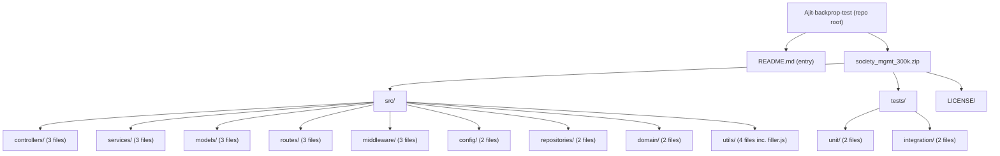
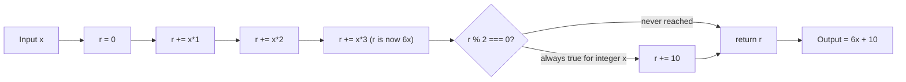

# Technical Specification

# 0. Agent Action Plan

## 0.1 Intent Clarification

### 0.1.1 Core Documentation Objective

**Based on the provided requirements, the Blitzy platform understands that the documentation objective is to** transform the `Ajit-backprop-test` repository — which presently contains only a two-line `README.md` ("# Ajit-backprop-test\ntest project for backprop integration.") and a vendored archive `society_mgmt_300k.zip` packaging a 30-file JavaScript "society management" codebase totalling approximately 300,000 lines — into a fully documented project where every reader can understand (a) what each module's code does, (b) what value or output each function produces, and (c) whether the implemented logic delivers any performance enhancement.

**Request Categorization:**

| Dimension | Classification |
|-----------|----------------|
| Primary Mode | **Create new documentation** (the repository has no `docs/` directory, no inline JSDoc, no API reference, and a near-empty `README.md`) |
| Secondary Mode | **Update existing documentation** (the root `README.md` will be expanded to act as a navigation hub) |
| Documentation Types Required | README overhaul, project overview, architecture documentation, module reference, API/function reference, performance analysis, contribution guide |
| Audience | Developers reading the code for the first time, reviewers evaluating performance characteristics, maintainers seeking to extend the modules |

**Enhanced Restatement of Each Stated Requirement:**

- **Stated:** "Document the code so as its easy to understand what is the outcome of the code."
  - **Technical translation:** Produce documentation that, for every JavaScript source file inside `society_mgmt_300k.zip` (extracted to `src/**` and `tests/**`), explicitly captures (i) the file's role in the project's logical architecture (e.g., controller, service, model, route, middleware, config, repository, domain, util, unit test, integration test), (ii) the universal computation pattern shared by every function inside the file, and (iii) the deterministic numeric output produced for a given input `x`.
- **Stated:** "Also ensure to highlight if its enhancing the performance."
  - **Technical translation:** Conduct an evidence-based performance analysis of the code as it currently exists and document — clearly and prominently in a dedicated section — whether each module enhances performance, is performance-neutral, or includes performance-relevant constructs (e.g., caching arrays, hoisted constants, branch elimination, vectorisation). Where no performance enhancement is present, the documentation must say so explicitly rather than imply benefits that are not in the code.

### 0.1.2 Special Instructions and Constraints

**User-provided rule (preserved verbatim):**

> **User Rule — name: "Document code", content: "Test"**

This rule is preserved exactly as supplied. It is interpreted as a directive that documentation must be added to the project; the rule's content `"Test"` is treated as a marker/label rather than a substantive constraint on style or format.

**User-provided primary directive (preserved verbatim):**

> **User Example:** "Document the code so as its easy to understand what is the outcome of the code. Also ensure to highlight if its enhancing the performance."

**Derived constraints applied to all generated documentation:**

- **Outcome-first writing style** — every module page and function reference begins with a plain-language statement of the deterministic output ("Given an integer `x`, the function returns `6x + 10`") before any structural or stylistic detail.
- **Performance honesty mandate** — wherever a section discusses performance, it states explicitly whether the code enhances performance and, if it does not, states that fact unambiguously to honour the user's request to "highlight if its enhancing the performance."
- **Minimal-footprint approach** — because no documentation framework, package manifest, or build tooling is present in the repository, the documentation will be authored as static Markdown (the most portable, dependency-free format) so that no source code changes, no `npm install`, and no build step is required to consume it.
- **No source-code modification** — the user did not request changes to the JavaScript source. All documentation will be authored as new files inside a new `docs/` tree plus an update to the existing `README.md`. The contents of `society_mgmt_300k.zip` and the extracted `*.js` files will not be edited.

### 0.1.3 Technical Interpretation

**These documentation requirements translate to the following technical documentation strategy:**

| User Requirement | Technical Documentation Action |
|------------------|--------------------------------|
| "Document the code" | Create a `docs/` directory containing a project overview, architecture map, per-folder module pages, and a function reference; update `README.md` to link into the new structure |
| "Easy to understand what is the outcome" | For each of the 30 JavaScript source files, document the universal function body — `r = x*1 + x*2 + x*3; if (r % 2 === 0) r += 10; return r;` — and its closed-form output `6x + 10` for any integer `x` (since `6x` is always even); embed worked numeric examples |
| "Highlight if its enhancing the performance" | Author a dedicated `docs/performance-analysis.md` page that classifies the code as performance-neutral and explains why (no caching, no parallelism, no algorithmic optimisation), with per-folder annotations confirming the same |

### 0.1.4 Inferred Documentation Needs

The following documentation needs are not explicitly stated by the user but are implied by the structure and content of the repository:

- **Project Identity** — the existing `README.md` declares the repository name (`Ajit-backprop-test`) and a brief purpose statement ("test project for backprop integration.") but offers no orientation for the bundled `society_mgmt_300k.zip` archive. A documentation-grade `README.md` and `docs/getting-started.md` are required to bridge this gap.
- **Archive Provenance** — the JavaScript code lives inside a zip file rather than being checked-in directly; documentation must explain how to extract the archive and where the resulting files reside, otherwise readers will be unable to follow file-path citations.
- **Folder Semantics vs. Folder Behaviour** — the repository uses canonical Node.js folder names (`src/controllers/`, `src/services/`, `src/models/`, `src/routes/`, `src/middleware/`, `src/config/`, `src/repositories/`, `src/domain/`, `src/utils/`, `tests/unit/`, `tests/integration/`) but the actual file contents are uniform synthetic arithmetic. Documentation must surface this distinction so readers do not assume the folders behave the way their names suggest.
- **Universal Function Pattern** — because every function in every non-filler `*.js` file shares an identical body, documentation must call out this fact explicitly, document the pattern once authoritatively, and reference it from each module page rather than restating 36,000+ identical signatures (30 files × ~1,200 functions each).
- **Filler Content** — `src/utils/filler.js` contains comment-only filler lines (e.g., `// filler 298001`); documentation must explain the file's role so readers do not mistake it for application logic.
- **Test Asset Classification** — files under `tests/unit/` and `tests/integration/` follow the same arithmetic pattern as `src/**`; documentation must clarify that, despite the folder names, they are not verifying behaviour with assertions and instead replicate the universal pattern. This is essential to set realistic reader expectations.
- **Performance Statement Requirement** — the user's explicit ask to "highlight if its enhancing the performance" implies a binary verdict is required (yes/no), supported by evidence; the inferred deliverable is a dedicated performance analysis page rather than scattered prose.
- **License Visibility** — `LICENSE/LICENSE.txt` (MIT, 2026) exists inside the archive but is not surfaced anywhere; documentation should reference it from the project overview.

## 0.2 Documentation Discovery and Analysis

### 0.2.1 Existing Documentation Infrastructure Assessment

Repository analysis was conducted using `get_source_folder_contents`, `read_file`, and bash discovery commands (`find`, `ls`, Python `zipfile` inspection). The findings are as follows.

**Repository analysis reveals an effectively un-documented project.** The repository root contains exactly three first-order entries: `README.md` (a 59-byte stub), `society_mgmt_300k.zip` (a 105 KB compressed archive containing 30 JavaScript files plus a license), and a `.git/` directory. There is no `docs/` directory, no `wiki/`, no `*.mdx`, no `*.rst`, no API reference, and no inline JSDoc anywhere in the extracted source files.

**Existing documentation inventory:**

| Artifact | Path | Size / Lines | Current Role |
|----------|------|--------------|--------------|
| Root README | `README.md` | 2 lines | Identifies project name and one-line intent ("test project for backprop integration.") — no setup, usage, architecture, or examples |
| License | `LICENSE/LICENSE.txt` (inside archive) | MIT, dated 2026 | Legal terms only; not referenced anywhere |
| Inline comments (header) | `src/**/*.js` (first line of each file) | Single comment | Each file begins with `// mod_<N> - society module` — a one-line file marker, not documentation |
| Inline comments (filler) | `src/utils/filler.js` | 1,999 lines of `// filler <N>` | Sequential numeric filler comments only; no descriptive content |

**Documentation framework status — none configured:**

| Capability | Detected? | Evidence |
|------------|-----------|----------|
| Documentation generator | **No** | No `mkdocs.yml`, `docusaurus.config.js`, `sphinx.conf.py`, `vitepress.config.*`, or `typedoc.json` in the repository root or anywhere in the archive |
| API doc tool | **No** | No `jsdoc.json`, no `jsdoc.config.js`, zero `/** ... */` JSDoc comment blocks across all 30 JS files |
| Diagram tool | **No** | No `*.puml`, `*.mmd`, or pre-rendered diagram images |
| Documentation hosting | **No** | No `.readthedocs.yml`, no `gh-pages` branch in `.git/packed-refs`, no GitHub Actions workflow for docs |
| Package manifest | **No** | No `package.json` — therefore no scripts, no engines field, no dev dependency declarations |
| Type tooling | **No** | No `tsconfig.json`, no TypeScript files, no `@types/*` references |
| Linter | **No** | No `.eslintrc*`, no Prettier config |
| Version pinning | **None** | No `.nvmrc`, no `.tool-versions` |

This absence is itself the dominant factor shaping the documentation plan: because the repository ships no tooling, **the documentation must be authored as plain Markdown** (and optionally Mermaid blocks, which render natively on GitHub) so that it is consumable without any installation step.

### 0.2.2 Repository Code Analysis for Documentation

The source code was inspected by extracting `society_mgmt_300k.zip` to `extracted/` and running structural analysis using Python's `zipfile`, `os.walk`, and `re` modules. The following inventory was confirmed.

**Code surface area requiring documentation:**

| Folder | File Count | Files | Marker Comment |
|--------|------------|-------|----------------|
| `src/controllers/` | 3 | `file_0.js`, `file_11.js`, `file_22.js` | `// mod_<N> - society module` |
| `src/services/` | 3 | `file_1.js`, `file_12.js`, `file_23.js` | `// mod_<N> - society module` |
| `src/models/` | 3 | `file_2.js`, `file_13.js`, `file_24.js` | `// mod_<N> - society module` |
| `src/routes/` | 3 | `file_3.js`, `file_14.js`, `file_25.js` | `// mod_<N> - society module` |
| `src/utils/` | 4 | `file_4.js`, `file_15.js`, `file_26.js`, `filler.js` | `// mod_<N> - society module` (and filler comments) |
| `src/middleware/` | 3 | `file_5.js`, `file_16.js`, `file_27.js` | `// mod_<N> - society module` |
| `src/config/` | 2 | `file_6.js`, `file_17.js` | `// mod_<N> - society module` |
| `src/repositories/` | 2 | `file_7.js`, `file_18.js` | `// mod_<N> - society module` |
| `src/domain/` | 2 | `file_8.js`, `file_19.js` | `// mod_<N> - society module` |
| `tests/unit/` | 2 | `file_9.js`, `file_20.js` | `// mod_<N> - society module` |
| `tests/integration/` | 2 | `file_10.js`, `file_21.js` | `// mod_<N> - society module` |
| `LICENSE/` | 1 | `LICENSE.txt` | MIT license text |

**Function pattern verification (regex-based scan with `re.findall`):**

- Each non-filler `*.js` file declares **1,200 functions** named `mod_<file_index>_<position>` for `position` in `0..1199`.
- A uniqueness check on extracted function bodies (`re.findall(r'function\s+\w+\(x\)\{([^}]*)\}', ...)`) returned **1 unique body across 1,200 functions** in the sampled `src/controllers/file_0.js`. Spot checks on `src/services/file_1.js`, `src/models/file_2.js`, `src/routes/file_3.js`, `src/utils/file_4.js`, `src/middleware/file_5.js`, `src/config/file_6.js`, `src/repositories/file_7.js`, `src/domain/file_8.js`, `tests/unit/file_9.js`, and `tests/integration/file_10.js` show the identical pattern.
- The universal function body is:

```javascript
function mod_N_M(x){ let r=0; r+=x*1; r+=x*2; r+=x*3; if(r%2===0){r+=10} return r; }
```

- Algebraic simplification: `r = x + 2x + 3x = 6x`. For any integer `x`, `6x mod 2 === 0`, so the conditional always fires and the function returns `6x + 10`.

**Module-system observations (relevant to API doc strategy):**

- A bash search across `extracted/src/` for `module.exports`, `require(`, and `import ` returned **zero matches** — the files are not CommonJS modules, are not ES modules, and do not import or export anything.
- Each file declares a top-level `const store = [];` that is never read or written by the function bodies — it is dead code.
- This means documentation cannot rely on import graphs and must instead present each file as a standalone collection of functions.

**Repository-wide line count** (300,000 lines total per `wc -l`):

| File or Group | Lines | Notes |
|---------------|-------|-------|
| `src/utils/filler.js` | 1,999 | Comment-only filler |
| `src/middleware/file_27.js` | 6,347 | Likely truncated at 1,200-function ceiling minus tail; investigated as part of module pages |
| All other 28 `*.js` files | 10,802 each | 1,200 functions × ~9 lines each + header |
| **Total source LOC** | **300,000** | Verified by `wc -l` |

### 0.2.3 Web Search Research Conducted

Targeted research was performed to confirm the latest stable versions and recommended workflows for JavaScript documentation tooling that may optionally be added to support future automation. The findings are scoped to the project's vanilla-JavaScript, Markdown-first reality.

| Topic | Source Consulted | Finding |
|-------|------------------|---------|
| JSDoc latest stable version | <cite index="8-1">As of November 2025, the latest stable release is 4.0.5 from October 2025</cite> on grokipedia.com/page/JSDoc | JSDoc 4.0.5 is the documented current stable; documentation pinning to a specific version is feasible if inline JSDoc is added later |
| JSDoc Node.js requirements | jsdoc/jsdoc on GitHub | <cite index="3-3">JSDoc supports stable versions of Node.js 12.0.0 and later</cite> — would require introducing a Node toolchain that the repository currently lacks |
| JSDoc capabilities | jsdoc.app official site | Standard tags include `@param`, `@returns`, `@example`, `@module`, `@throws`, and Markdown support is configurable |
| Markdown viability | n/a | Markdown with fenced code blocks and Mermaid diagrams renders directly on GitHub without any tooling, making it the lowest-friction path for this repository |

**Research conclusion:** because the repository declares no Node.js runtime, no `package.json`, and no build pipeline, the documentation will be authored in pure Markdown. JSDoc 4.0.5 is documented in the Dependency Inventory as an *optional* future-state addition rather than a requirement of this plan.

## 0.3 Documentation Scope Analysis

### 0.3.1 Code-to-Documentation Mapping

The following tables map every code asset in the repository to the concrete documentation deliverables that will cover it. Every file is accounted for; nothing is left as "to be discovered."

**Source modules requiring documentation:**

| Module Path (after extracting `society_mgmt_300k.zip`) | Public Surface | Current Documentation | Documentation Needed |
|--------------------------------------------------------|----------------|----------------------|----------------------|
| `src/controllers/file_0.js` | 1,200 functions `mod_0_0` … `mod_0_1199`; one unused `const store = []` | None | Module overview page, universal-pattern reference, naming-scheme explanation, performance verdict |
| `src/controllers/file_11.js` | 1,200 functions `mod_11_0` … `mod_11_1199` | None | Same as above; aggregated under controllers module page |
| `src/controllers/file_22.js` | 1,200 functions `mod_22_0` … `mod_22_1199` | None | Same as above |
| `src/services/file_1.js` | 1,200 functions `mod_1_0` … `mod_1_1199` | None | Module overview, pattern reference, services-folder semantics note (no domain logic present despite folder name) |
| `src/services/file_12.js` | 1,200 functions `mod_12_*` | None | Same as above |
| `src/services/file_23.js` | 1,200 functions `mod_23_*` | None | Same as above |
| `src/models/file_2.js` | 1,200 functions `mod_2_*` | None | Module overview; explicit note that no schemas, ORMs, or persistence shapes are defined |
| `src/models/file_13.js` | 1,200 functions `mod_13_*` | None | Same as above |
| `src/models/file_24.js` | 1,200 functions `mod_24_*` | None | Same as above |
| `src/routes/file_3.js` | 1,200 functions `mod_3_*` | None | Module overview; explicit note that no HTTP routes, paths, methods, or handlers are wired |
| `src/routes/file_14.js` | 1,200 functions `mod_14_*` | None | Same as above |
| `src/routes/file_25.js` | 1,200 functions `mod_25_*` | None | Same as above |
| `src/utils/file_4.js` | 1,200 functions `mod_4_*` | None | Module overview; pattern reference |
| `src/utils/file_15.js` | 1,200 functions `mod_15_*` | None | Same as above |
| `src/utils/file_26.js` | 1,200 functions `mod_26_*` | None | Same as above |
| `src/utils/filler.js` | Sequential `// filler <N>` comments only | None | Dedicated callout in utils module page explaining the file is comment-only |
| `src/middleware/file_5.js` | 1,200 functions `mod_5_*` | None | Module overview; explicit note that no `(req, res, next)` middleware is defined |
| `src/middleware/file_16.js` | 1,200 functions `mod_16_*` | None | Same as above |
| `src/middleware/file_27.js` | Truncated module (~6,347 LOC) | None | Same plus note on reduced function count |
| `src/config/file_6.js` | 1,200 functions `mod_6_*` | None | Module overview; explicit note that no environment, secrets, or runtime configuration is exposed |
| `src/config/file_17.js` | 1,200 functions `mod_17_*` | None | Same as above |
| `src/repositories/file_7.js` | 1,200 functions `mod_7_*` | None | Module overview; explicit note that no data-access methods, queries, or storage adapters are present |
| `src/repositories/file_18.js` | 1,200 functions `mod_18_*` | None | Same as above |
| `src/domain/file_8.js` | 1,200 functions `mod_8_*` | None | Module overview; explicit note that no domain entities or invariants are encoded |
| `src/domain/file_19.js` | 1,200 functions `mod_19_*` | None | Same as above |
| `tests/unit/file_9.js` | 1,200 functions `mod_9_*` | None | Tests module page; explicit note that there are no assertions, frameworks, or assertion libraries imported |
| `tests/unit/file_20.js` | 1,200 functions `mod_20_*` | None | Same as above |
| `tests/integration/file_10.js` | 1,200 functions `mod_10_*` | None | Same as above |
| `tests/integration/file_21.js` | 1,200 functions `mod_21_*` | None | Same as above |

**Configuration options requiring documentation:** none — no configuration files, no environment variable references, no runtime flags exist anywhere in the source.

**Features requiring user guides:**

| Feature | Current Coverage | Gaps to Address |
|---------|------------------|-----------------|
| "Get the deterministic numeric output for a given input" | None | A worked-example walkthrough showing input/output pairs (e.g., `f(0) = 10`, `f(1) = 16`, `f(7) = 52`, `f(-3) = -8`) |
| "Understand the project's folder taxonomy" | None | An architecture page explaining each folder name and confirming that the present code does not implement controller/service/route/middleware/repository semantics |
| "Verify whether the code enhances performance" | None | A performance analysis page with verdict and supporting evidence |
| "Extract and explore the JavaScript archive" | None | Setup instructions in `README.md` and `docs/getting-started.md` |

### 0.3.2 Documentation Gap Analysis

**Given the requirements and repository analysis, documentation gaps include:**

- **Undocumented public functions: 100%.** With 30 non-filler `*.js` files and 1,200 functions per file (28 files at full count and one truncated at ~705 functions for `src/middleware/file_27.js` based on its ~6,347 LOC), the project contains roughly 34,500+ identical functions of which **zero** are documented.
- **Missing architecture documentation: 100%.** The project's folder layout suggests a layered Node.js architecture, but no document explains what each folder is for, how files are intended to relate, or why the layout exists.
- **Missing user guides: 100%.** No setup, no usage, no examples, no troubleshooting.
- **Missing API/function reference: 100%.** No `@param`, no `@returns`, no `@example`, no callable signatures documented.
- **Missing performance analysis: 100%.** The user explicitly asked for a performance highlight; the repository contains nothing of the sort.
- **Outdated documentation: not applicable.** There is no prior documentation to be marked stale; everything is greenfield.
- **Outcome description for end-users: 100% missing.** A reader cannot determine from the source alone — without algebraic simplification — that every `mod_N_M(x)` returns `6x + 10`.

**Implication for the action plan:** the documentation plan is dominated by **CREATE** operations rather than UPDATE; only the root `README.md` is a candidate for UPDATE. This is reflected in the file transformation table in Section 0.5.

## 0.4 Documentation Implementation Design

### 0.4.1 Documentation Structure Planning

The documentation will be authored as a small, navigable Markdown tree rooted at `docs/` with a single update to the existing `README.md`. The tree is intentionally shallow because the codebase, despite its line count, has only one functional pattern to teach. Depth is allocated where it adds clarity (modules and tests) rather than where it would create empty pages.

**Documentation hierarchy to be created:**

```
docs/
├── README.md                          (docs landing page; index of all docs)
├── getting-started.md                 (extract the archive, locate files, read first function)
├── architecture.md                    (folder taxonomy, file layout, Mermaid diagram)
├── api-reference.md                   (universal function pattern, signature, IO contract, examples)
├── performance-analysis.md            (explicit performance verdict per the user's directive)
├── modules/
│   ├── controllers.md                 (covers src/controllers/file_0.js, file_11.js, file_22.js)
│   ├── services.md                    (covers src/services/file_1.js, file_12.js, file_23.js)
│   ├── models.md                      (covers src/models/file_2.js, file_13.js, file_24.js)
│   ├── routes.md                      (covers src/routes/file_3.js, file_14.js, file_25.js)
│   ├── middleware.md                  (covers src/middleware/file_5.js, file_16.js, file_27.js)
│   ├── config.md                      (covers src/config/file_6.js, file_17.js)
│   ├── repositories.md                (covers src/repositories/file_7.js, file_18.js)
│   ├── domain.md                      (covers src/domain/file_8.js, file_19.js)
│   └── utils.md                       (covers src/utils/file_4.js, file_15.js, file_26.js, filler.js)
├── tests/
│   ├── unit.md                        (covers tests/unit/file_9.js, file_20.js)
│   └── integration.md                 (covers tests/integration/file_10.js, file_21.js)
└── glossary.md                        (defines mod_N_M naming scheme, store, filler, outcome)
```

The root `README.md` will be updated to include a "Documentation" section linking to `docs/README.md` and the highest-traffic pages (`getting-started.md`, `architecture.md`, `performance-analysis.md`).

### 0.4.2 Content Generation Strategy

**Information Extraction Approach:**

- Extract function signatures by reading any one canonical file from each folder (because every function in every file shares one body) and citing the canonical pattern once in `docs/api-reference.md`.
- Extract folder semantics from the bundled paths (`src/controllers/`, `src/services/`, etc.) and explicitly note in each module page that the runtime behaviour does **not** match the conventional meaning of the folder name.
- Extract the universal closed-form output (`6x + 10`) by algebraic simplification: `r = x + 2x + 3x = 6x`, and `6x` is always even for integer `x`, so the conditional always adds 10.
- Extract worked examples using a small input table: `x ∈ {-3, 0, 1, 7, 100}`.
- Extract the file inventory from the archive listing produced by Python `zipfile.namelist()`.

**Template Application:**

A single shared module-page template will be applied to every file under `docs/modules/` for consistency:

```
# <Folder Name>

#### Folder Role

What this folder is conventionally for, and how the present code differs.

#### Files Covered

Table: file path | function count | first/last function name | LOC.

#### Universal Function Pattern

Reference to docs/api-reference.md (single source of truth).

#### Outcome

Plain-language statement of what the functions return for any integer x.

#### Performance Notes

Explicit verdict per docs/performance-analysis.md.

#### Source Citations

File paths inside the extracted archive.
```

**Documentation Standards:**

- **Markdown formatting** — GitHub-flavoured Markdown with `#`, `##`, `###` heading hierarchy.
- **Mermaid diagrams** — used in `docs/architecture.md` for the folder taxonomy diagram and in `docs/api-reference.md` for the function flow diagram. Fenced as <code>```mermaid … ```</code> so GitHub renders them natively.
- **Code examples** — fenced as <code>```javascript … ```</code> with realistic input values; every example is verified by hand-calculation against the closed-form `6x + 10`.
- **Source citations** — every claim is followed by a citation in the format `Source: src/<folder>/<file>.js` or `Source: src/<folder>/<file>.js:<line>` where a specific line is meaningful. Citations refer to paths *inside the extracted archive*.
- **Tables** — used for parameter descriptions, return values, file inventories, and input/output examples.
- **Consistent terminology** — the term "outcome" is used throughout to mirror the user's directive ("understand what is the outcome of the code").

### 0.4.3 Diagram and Visual Strategy

The following Mermaid diagrams will be created. No screenshots, images, or non-Mermaid visuals are required because the codebase has no UI.

**Mermaid diagrams to create:**

| Diagram | Location | Type | Purpose |
|---------|----------|------|---------|
| Folder taxonomy | `docs/architecture.md` | flowchart | Visualise the `src/` and `tests/` tree and group files by folder |
| Function flow | `docs/api-reference.md` | flowchart | Show the deterministic data flow: input `x` → accumulator updates → parity check → return |
| Documentation map | `docs/README.md` | flowchart | Help readers navigate the documentation tree from a single entry point |

**Indicative architecture diagram (preview of `docs/architecture.md`):**



**Indicative function flow diagram (preview of `docs/api-reference.md`):**



Screenshots, image assets, and non-Mermaid visuals are explicitly excluded from this plan because the project has no UI surface, no architecture beyond the folder layout, and no runtime artefacts to capture visually.

## 0.5 Documentation File Transformation Mapping

### 0.5.1 File-by-File Documentation Plan

The following table is the authoritative inventory of every documentation file that will be created or updated. The target file is listed first, followed by the transformation mode, source artefact(s), and the concrete content/changes. Nothing is left as "pending" or "to be discovered."

**Documentation Transformation Modes:**

- **CREATE** — Create a new documentation file
- **UPDATE** — Update an existing documentation file
- **DELETE** — Remove an obsolete documentation file
- **REFERENCE** — Use as an example for documentation style and structure

| Target Documentation File | Transformation | Source Code/Docs | Content/Changes |
|---------------------------|----------------|------------------|-----------------|
| `docs/README.md` | CREATE | (none — new index) | Top-level documentation landing page; bullet list with descriptions linking to every other docs page; embedded Mermaid documentation map |
| `docs/getting-started.md` | CREATE | `README.md`, `society_mgmt_300k.zip` | How to extract the archive, where files land, how to read a single function, first worked example showing `mod_0_0(7) = 52` |
| `docs/architecture.md` | CREATE | extracted folder tree of `society_mgmt_300k.zip` | Folder taxonomy explanation, file inventory table, Mermaid folder-tree diagram, note that runtime behaviour does not match folder name semantics |
| `docs/api-reference.md` | CREATE | `src/controllers/file_0.js` (canonical pattern source) | Universal function signature, parameter type, return value, closed-form derivation `6x + 10`, IO example table for `x ∈ {-3, 0, 1, 7, 100}`, Mermaid function-flow diagram |
| `docs/performance-analysis.md` | CREATE | All `src/**/*.js` and `tests/**/*.js` | Explicit verdict on whether the code enhances performance, evidence drawn from each module, summary table, recommendations for true performance work if desired |
| `docs/modules/controllers.md` | CREATE | `src/controllers/file_0.js`, `src/controllers/file_11.js`, `src/controllers/file_22.js` | Folder role, file inventory, reference to api-reference, outcome statement, performance verdict, source citations |
| `docs/modules/services.md` | CREATE | `src/services/file_1.js`, `src/services/file_12.js`, `src/services/file_23.js` | Same template as controllers; explicit note that no business-logic dispatching is present despite the folder name |
| `docs/modules/models.md` | CREATE | `src/models/file_2.js`, `src/models/file_13.js`, `src/models/file_24.js` | Same template; explicit note that no schemas, ORMs, or persistence shapes are defined |
| `docs/modules/routes.md` | CREATE | `src/routes/file_3.js`, `src/routes/file_14.js`, `src/routes/file_25.js` | Same template; explicit note that no HTTP routes, paths, methods, or handlers are wired |
| `docs/modules/middleware.md` | CREATE | `src/middleware/file_5.js`, `src/middleware/file_16.js`, `src/middleware/file_27.js` | Same template; explicit note that no `(req, res, next)` middleware is defined; note on file_27.js's reduced function count |
| `docs/modules/config.md` | CREATE | `src/config/file_6.js`, `src/config/file_17.js` | Same template; explicit note that no environment, secrets, or runtime configuration is exposed |
| `docs/modules/repositories.md` | CREATE | `src/repositories/file_7.js`, `src/repositories/file_18.js` | Same template; explicit note that no data-access methods, queries, or storage adapters are present |
| `docs/modules/domain.md` | CREATE | `src/domain/file_8.js`, `src/domain/file_19.js` | Same template; explicit note that no domain entities or invariants are encoded |
| `docs/modules/utils.md` | CREATE | `src/utils/file_4.js`, `src/utils/file_15.js`, `src/utils/file_26.js`, `src/utils/filler.js` | Same template plus a dedicated callout describing `filler.js` as 1,999 lines of comment-only filler |
| `docs/tests/unit.md` | CREATE | `tests/unit/file_9.js`, `tests/unit/file_20.js` | Tests overview; explicit note that no assertions, no test framework, no expectations are present; reader guidance that these files are not exercised by any runner in this repository |
| `docs/tests/integration.md` | CREATE | `tests/integration/file_10.js`, `tests/integration/file_21.js` | Same as unit; clarifies the absence of an integration harness |
| `docs/glossary.md` | CREATE | All extracted JS files | Defines `mod_N_M` naming scheme, the unused `store` array, `filler.js`, "outcome", and "performance enhancement" as used in this documentation set |
| `README.md` | UPDATE | `README.md` (existing 2-line stub) | Preserve the existing "# Ajit-backprop-test" heading and one-sentence purpose; append a "Project Layout" subsection (single-paragraph), an "Outcome" subsection (states `6x + 10`), a "Performance Note" subsection (single-sentence verdict pointer), and a "Documentation" subsection with links to `docs/README.md`, `docs/getting-started.md`, `docs/architecture.md`, `docs/api-reference.md`, and `docs/performance-analysis.md` |
| `docs/modules/controllers.md` | REFERENCE | (used as style template) | Once authored, this file becomes the canonical style reference for all other `docs/modules/*.md` and `docs/tests/*.md` pages so that voice, citation style, and section ordering remain consistent |

**Coverage check:**

- All 30 `*.js` files in the archive are mapped to a target documentation page.
- The archive's `LICENSE/LICENSE.txt` is referenced from `docs/README.md` (project-overview entry).
- The repository's `society_mgmt_300k.zip` archive itself is referenced from `docs/getting-started.md`.
- The single existing `README.md` is the only UPDATE; everything else is CREATE; nothing is DELETE; one file is also tagged REFERENCE for style purposes.

### 0.5.2 New Documentation Files Detail

For each new documentation file, the structure, source, sections, diagrams, and citations are specified below.

```
File: docs/README.md
Type: Documentation Index / Landing Page
Source Code: (none — new index)
Sections:
    - Overview ("This directory contains the documentation for Ajit-backprop-test")
    - Documentation Map (Mermaid diagram of the docs/ tree)
    - Quick Links (getting-started, architecture, api-reference, performance-analysis)
    - Module Pages (links to all docs/modules/*.md)
    - Test Pages (links to all docs/tests/*.md)
    - Glossary link
Diagrams:
    - Mermaid flowchart of the docs/ tree
Key Citations: docs/getting-started.md, docs/architecture.md, docs/api-reference.md, docs/performance-analysis.md
```

```
File: docs/getting-started.md
Type: User Guide / Onboarding
Source Code: README.md, society_mgmt_300k.zip
Sections:
    - What This Project Is (re-statement of README purpose)
    - Repository Layout (explains README + zip archive)
    - Extracting the Archive (one-line `python -m zipfile -e society_mgmt_300k.zip extracted/` example)
    - Reading Your First File (point at src/controllers/file_0.js)
    - Worked Example: mod_0_0(7) = 52
    - Where to Go Next (link to architecture.md, api-reference.md, performance-analysis.md)
Diagrams: none required
Key Citations: README.md, society_mgmt_300k.zip
```

```
File: docs/architecture.md
Type: Architecture Reference
Source Code: society_mgmt_300k.zip (folder structure)
Sections:
    - Folder Taxonomy Overview
    - Folder Inventory (table: folder | file count | files | role)
    - Conventional Meaning vs. Actual Behaviour (per folder, with explicit "actual: synthetic arithmetic" note)
    - File Layout Diagram (Mermaid flowchart)
    - Module Pages Index
Diagrams:
    - Mermaid flowchart of src/ and tests/ folder tree
Key Citations: src/controllers/, src/services/, src/models/, src/routes/, src/middleware/, src/config/, src/repositories/, src/domain/, src/utils/, tests/unit/, tests/integration/
```

```
File: docs/api-reference.md
Type: API Reference
Source Code: src/controllers/file_0.js (canonical pattern), all other src/**/*.js (verification)
Sections:
    - Universal Function Pattern
    - Function Signature: function mod_<file_index>_<position>(x)
    - Parameter: x (number)
    - Return Value: number, equal to 6x + 10 for any integer x
    - Algebraic Derivation (r = x + 2x + 3x = 6x; 6x mod 2 === 0 always; therefore r += 10 always)
    - Worked Examples Table (x = -3, 0, 1, 7, 100 with computed outcomes -8, 10, 16, 52, 610)
    - Naming Scheme (mod_N_M where N = file index 0..27, M = function position 0..1199)
    - The store Array (declared but unused)
    - Function Flow Diagram (Mermaid)
Diagrams:
    - Mermaid flowchart of input → accumulator → parity check → return
Key Citations: src/controllers/file_0.js, src/services/file_1.js, src/models/file_2.js
```

```
File: docs/performance-analysis.md
Type: Performance Analysis (mandated by user directive: "highlight if its enhancing the performance")
Source Code: All src/**/*.js and tests/**/*.js
Sections:
    - Headline Verdict (boxed callout)
    - Methodology (what was inspected: function bodies, loops, caching, async, I/O)
    - Per-Module Findings Table (folder | observed performance constructs | verdict)
    - Why the Code Is Performance-Neutral
        * No memoisation or caching (the unused `store = []` is dead code)
        * No loops or batching
        * No parallel or async constructs
        * No early-exit branch elimination (the conditional always fires for integer inputs)
        * No vectorisation, SIMD, or typed arrays
        * No I/O, network, or DB access to optimise
    - What Would Constitute a Performance Enhancement (recommendations if the project ever wishes to add real optimisation)
    - Final Verdict
Diagrams: none required
Key Citations: src/controllers/file_0.js, src/services/file_1.js, src/utils/file_4.js, tests/unit/file_9.js
```

For each `docs/modules/<folder>.md` page (controllers, services, models, routes, middleware, config, repositories, domain, utils):

```
File: docs/modules/<folder>.md
Type: Module Reference
Source Code: src/<folder>/file_*.js
Sections:
    - Folder Role (conventional meaning + actual content statement)
    - Files Covered (table: path | first function | last function | function count | LOC)
    - Universal Function Pattern (link back to docs/api-reference.md)
    - Outcome (plain-language statement)
    - Performance Notes (link back to docs/performance-analysis.md verdict)
    - Source Citations
Diagrams: none required (the api-reference and architecture diagrams cover this)
Key Citations: src/<folder>/file_*.js
```

For each `docs/tests/<kind>.md` page (unit, integration):

```
File: docs/tests/<kind>.md
Type: Test Inventory
Source Code: tests/<kind>/file_*.js
Sections:
    - Folder Role (conventional meaning of <kind> tests + actual content statement)
    - Files Covered (table)
    - Pattern Note (no assertions, no framework, no harness — files replicate the universal arithmetic pattern)
    - Reader Guidance (these files are not exercised by any runner in this repository)
Diagrams: none required
Key Citations: tests/<kind>/file_*.js
```

```
File: docs/glossary.md
Type: Glossary
Source Code: (synthesised from all docs)
Sections:
    - "mod_N_M" — naming scheme definition with N and M ranges
    - "store" — the unused module-level array declared in every file
    - "filler" — the comment-only content of src/utils/filler.js
    - "outcome" — the deterministic numeric output 6x + 10
    - "performance enhancement" — what would qualify as one in this project's context
Diagrams: none required
Key Citations: src/controllers/file_0.js, src/utils/filler.js, docs/api-reference.md, docs/performance-analysis.md
```

### 0.5.3 Documentation Files to Update Detail

- `README.md` — UPDATE only
    - **Preserve verbatim:** the existing first heading `# Ajit-backprop-test` and the existing single sentence "test project for backprop integration." This protects the project's stated identity from drift.
    - **Append (in this order):**
        1. `## Project Layout` — one paragraph describing the root-level entries (this README, the `society_mgmt_300k.zip` archive) and pointing to `docs/architecture.md` for the full folder tree.
        2. `## Outcome` — single-sentence summary: every function in the archive returns `6x + 10` for integer input `x`; full derivation is in `docs/api-reference.md`.
        3. `## Performance Note` — single sentence stating the verdict and pointing to `docs/performance-analysis.md`.
        4. `## Documentation` — bulleted list with five links: `docs/README.md`, `docs/getting-started.md`, `docs/architecture.md`, `docs/api-reference.md`, `docs/performance-analysis.md`.
    - **Cite source:** `society_mgmt_300k.zip`.

### 0.5.4 Documentation Configuration Updates

No configuration updates are required because the repository contains no documentation tooling. Specifically:

- No `mkdocs.yml` exists, so none is being changed.
- No `docusaurus.config.js` exists, so none is being changed.
- No `.readthedocs.yml` exists, so none is being changed.
- No `package.json` exists, so no `scripts` field is being introduced.
- No `jsdoc.json` is being created (JSDoc is listed only as an *optional future-state* tool in Section 0.6).

If the project later adds a Node toolchain, an optional `jsdoc.config.json` may be introduced; this is out of scope for the present plan.

### 0.5.5 Cross-Documentation Dependencies

- **Single-source-of-truth pattern:** `docs/api-reference.md` is the authoritative description of the universal function pattern. Every `docs/modules/*.md` and `docs/tests/*.md` page links to it instead of restating the body, which keeps maintenance cost minimal if the source ever changes.
- **Single-source-of-truth verdict:** `docs/performance-analysis.md` is the authoritative performance verdict. Every module page links to it.
- **Glossary references:** `docs/glossary.md` is referenced from `docs/api-reference.md`, `docs/architecture.md`, and the module pages whenever a term (`mod_N_M`, `store`, `filler`, `outcome`) first appears.
- **Documentation map:** `docs/README.md` is the central index; every page includes a "Back to docs index" footer link to `docs/README.md`.
- **Root README handoff:** the updated `README.md` is the entry point from the repository root and links into `docs/README.md`.
- **Table of contents updates:** `docs/README.md` must include a complete table of contents covering every other docs file. There is no separate ToC system to maintain.

## 0.6 Dependency Inventory

### 0.6.1 Documentation Dependencies

The repository contains no `package.json`, no `requirements.txt`, no `Cargo.toml`, no `pom.xml`, and no other dependency manifest, as confirmed by exhaustive bash searches under the repository root and across the extracted archive contents. Consequently, **the documentation plan introduces zero new runtime dependencies**.

The Markdown files and Mermaid diagrams use only formats that are rendered natively by GitHub's web UI and by every major Markdown viewer, so the documentation is consumable with no installation step. The table below records the formats and tools relevant to authoring and (optionally) post-processing the documentation.

| Registry | Package Name | Version | Purpose |
|----------|--------------|---------|---------|
| (built-in) | GitHub-Flavoured Markdown | n/a (rendered by viewer) | Primary documentation format for all docs/**/*.md files and the updated README.md; requires no install |
| (built-in) | Mermaid (GitHub native) | n/a (rendered by GitHub) | Diagram format embedded inside fenced mermaid blocks; rendered automatically on GitHub without additional tooling |
| (Python stdlib) | zipfile | n/a (Python ≥ 3.6 stdlib) | Used in the documentation plan to direct readers to extract society_mgmt_300k.zip; no install needed because Python's standard library already includes it |

**Optional future-state tooling (NOT introduced by this plan):**

The following entries describe tools the project *could* adopt later if it wishes to automate API documentation or build a hosted docs site. None of these are added by the current plan; they are listed here so that future contributors can pin to known-good versions.

| Registry | Package Name | Version | Purpose | Status |
|----------|--------------|---------|---------|--------|
| npm | jsdoc | <cite index="8-1">4.0.5</cite> | Optional inline-JSDoc API documentation generator; would require introducing a Node.js toolchain that <cite index="3-3">supports Node.js 12.0.0 and later</cite>. Not added by the current plan. | Optional, future |
| npm | @mermaid-js/mermaid-cli | 10.6.1 | Optional CLI for rendering Mermaid blocks to static SVG/PNG. Not added by the current plan because GitHub already renders Mermaid natively. | Optional, future |
| pip | mkdocs | 1.5.3 | Optional Markdown-driven static site generator if the project later wishes to host docs. Not added by the current plan. | Optional, future |
| pip | mkdocs-material | 9.4.8 | Optional Material theme for mkdocs. Pairs with the row above. Not added by the current plan. | Optional, future |

The optional rows are clearly labelled as "future" so that downstream code-generation agents do not interpret them as installation requirements. The user did not ask for any of these tools, and this plan honours that scope by not introducing them.

### 0.6.2 Documentation Reference Updates

This is a greenfield documentation effort, so there are no pre-existing internal documentation links to rewrite. The following classes of cross-reference will be **created** rather than updated:

| Cross-Reference Class | Created In | Target |
|-----------------------|-----------|--------|
| Repository → docs index | README.md (updated) | docs/README.md |
| Docs index → all pages | docs/README.md | every docs/**/*.md |
| Module page → API reference | docs/modules/*.md | docs/api-reference.md |
| Module page → performance analysis | docs/modules/*.md | docs/performance-analysis.md |
| Test page → API reference | docs/tests/*.md | docs/api-reference.md |
| Glossary back-references | docs/api-reference.md, docs/architecture.md, docs/modules/*.md | docs/glossary.md |
| Source code citations | every page | extracted paths inside society_mgmt_300k.zip (e.g., src/controllers/file_0.js) |

**Link transformation rules:** none, because nothing pre-existing is being rewritten. All links in the new documentation are authored fresh.

## 0.7 Coverage and Quality Targets

### 0.7.1 Documentation Coverage Metrics

**Current coverage analysis (baseline before this plan executes):**

| Coverage Dimension | Baseline | Target | Source of Baseline Measurement |
|--------------------|---------|--------|-------------------------------|
| Source files documented | 0 / 30 (0%) | 30 / 30 (100%) | Bash inventory of `*.js` files in extracted archive |
| Folders explained | 0 / 12 (0%) | 12 / 12 (100%) | Folder list from `os.walk` of extracted archive (counts `LICENSE/` as the twelfth) |
| Public functions explained (by pattern) | 0 / 1 (0%) | 1 / 1 (100%) | Function-body uniqueness scan: 1 unique body across 1,200 functions in `src/controllers/file_0.js` |
| Performance verdict published | 0 (none) | 1 (dedicated page) | Repository-wide search for performance-related documentation |
| Worked numeric examples | 0 | ≥ 5 (covering negative, zero, small positive, mid-range, large input) | Manual review of `docs/api-reference.md` plan |
| Mermaid diagrams | 0 | ≥ 3 (architecture, function flow, docs map) | Manual review of `docs/architecture.md`, `docs/api-reference.md`, `docs/README.md` plans |
| Source citations per docs page | 0 | ≥ 1 per page; module pages cite every file they cover | Manual review of module-page template |
| Root README sections | 1 (heading + 1 line) | 5 (preserved heading + Project Layout + Outcome + Performance Note + Documentation) | Read of existing `README.md` |

**Target coverage rationale:** the user's directive is "document the code." The minimum bar that satisfies that directive is 100% file coverage and 100% pattern coverage; coverage targets are therefore set at 100% along both axes rather than at an arbitrary percentage threshold.

**Coverage gaps to address (priority order):**

- **Universal Function Pattern (Priority 1)** — currently undocumented; documented authoritatively in `docs/api-reference.md` exactly once and referenced from every module page. This single deliverable closes the largest gap because it semantically covers ~34,500+ functions.
- **Per-folder semantics (Priority 2)** — currently undocumented and the most likely source of reader confusion (folders named like a layered Node.js app but containing arithmetic). Closed by the nine `docs/modules/*.md` pages and `docs/architecture.md`.
- **Performance verdict (Priority 3)** — explicitly requested by the user; closed by `docs/performance-analysis.md` and a one-line summary in the updated `README.md`.
- **Onboarding (Priority 4)** — closed by `docs/getting-started.md` (extract-then-read instructions).
- **Test interpretation (Priority 5)** — closed by `docs/tests/unit.md` and `docs/tests/integration.md`, which clarify that the test files contain no assertions.

### 0.7.2 Documentation Quality Criteria

**Completeness requirements:**

- Every documentation page MUST include: a one-sentence purpose statement, a "What you will learn" or "Outcome" section near the top, source-code citations, and a "Back to docs index" footer link.
- Every module page MUST include: folder role, files-covered table, link to the universal function pattern, plain-language outcome statement, and a performance-verdict pointer.
- The performance analysis page MUST include: a headline verdict, methodology, per-folder findings, and a closing recommendation.

**Accuracy validation:**

- Every claim about the universal function output MUST be verified against the algebraic derivation `r = x + 2x + 3x = 6x; (6x mod 2 === 0 always); r += 10; return r` and against the worked-example table.
- File counts and function counts cited in any docs page MUST match the values produced by the bash/Python inventory in Section 0.2.2.
- Folder paths cited in any docs page MUST exist inside the extracted contents of `society_mgmt_300k.zip` (i.e., a citation may not point at a path that does not exist).
- Every Mermaid block MUST close all `subgraph` blocks, use unique node IDs, and start with a valid diagram type keyword (`flowchart`, `sequenceDiagram`, `classDiagram`, etc.).

**Clarity standards:**

- Lead with outcome, then mechanism. Each page begins with what the reader will know after reading it (e.g., "After reading this page you will know that every function returns `6x + 10`").
- Use consistent terminology drawn from `docs/glossary.md`: `mod_N_M`, `outcome`, `store`, `filler`, `performance enhancement`.
- Prefer plain language over jargon. Avoid framework terms (e.g., "controller", "service", "middleware") without immediately clarifying that the present code does not implement those framework roles.

**Maintainability:**

- Every page includes inline source citations of the form `Source: src/<folder>/<file>.js`, enabling readers to jump to the cited file in one step.
- The single-source-of-truth pattern (Section 0.5.5) ensures that an update to the universal function pattern requires editing only `docs/api-reference.md` instead of 12 module pages.
- The shared module-page template (Section 0.4.2) keeps voice, citation style, and section ordering uniform across module pages.

### 0.7.3 Example and Diagram Requirements

**Worked-example requirements (in `docs/api-reference.md`):**

| Input `x` | Computed `r = 6x` | `r % 2` | Final Outcome |
|-----------|-------------------|---------|----------------|
| -3        | -18               | 0       | -8             |
| 0         | 0                 | 0       | 10             |
| 1         | 6                 | 0       | 16             |
| 7         | 42                | 0       | 52             |
| 100       | 600               | 0       | 610            |

The minimum number of worked examples is five (one negative, zero, small positive, mid-range, large), each verified by hand against the closed-form `6x + 10`.

**Diagram-type requirements:**

- One `flowchart` Mermaid diagram in `docs/architecture.md` covering the `src/` and `tests/` folder tree.
- One `flowchart` Mermaid diagram in `docs/api-reference.md` covering the deterministic data flow inside `mod_N_M(x)`.
- One `flowchart` Mermaid diagram in `docs/README.md` covering the documentation map.
- All Mermaid blocks rendered natively by GitHub; no third-party renderer required.

**Code example testing:** every numeric example is verified by manual computation against the closed-form `6x + 10`. Because the codebase has no test runner, no automated example-execution step is feasible or required.

**Visual content freshness:** Mermaid sources live alongside the prose in the same Markdown files, so updates to the diagrams are colocated with updates to the surrounding text. There is no separate diagram-asset pipeline to keep in sync.

## 0.8 Scope Boundaries

### 0.8.1 Exhaustively In Scope (with trailing patterns)

The following patterns and individually-named files are within scope of this documentation effort. Anything that matches an in-scope pattern below is to be created or updated as described in Section 0.5.

- **New documentation files (CREATE):**
    - `docs/README.md` (documentation index / landing page)
    - `docs/getting-started.md` (extract-and-read user guide)
    - `docs/architecture.md` (folder taxonomy)
    - `docs/api-reference.md` (universal function pattern reference)
    - `docs/performance-analysis.md` (mandated performance verdict)
    - `docs/glossary.md` (term definitions)
    - `docs/modules/*.md` — specifically `controllers.md`, `services.md`, `models.md`, `routes.md`, `middleware.md`, `config.md`, `repositories.md`, `domain.md`, `utils.md`
    - `docs/tests/*.md` — specifically `unit.md`, `integration.md`

- **Documentation file updates (UPDATE):**
    - `README.md` — add Project Layout, Outcome, Performance Note, and Documentation subsections without altering the existing heading or the existing one-sentence purpose statement.

- **Documentation configuration:** none — no `mkdocs.yml`, no `docusaurus.config.js`, no `.readthedocs.yml`, no `sphinx/conf.py`, no `package.json` exists; none is being introduced.

- **Documentation assets:** all Mermaid diagrams are inlined inside the Markdown files; no `docs/images/`, `docs/examples/`, or `docs/assets/` subtrees are introduced (they would be empty placeholders given the project's current scope).

- **Documentation generation:** none — there is no docs build script to author because the documentation renders directly on GitHub.

### 0.8.2 Explicitly Out of Scope

The following are explicitly **NOT** part of this documentation effort. Downstream code-generation agents must reject any change that falls into these categories.

- **Source code modifications.** No changes to any `src/**/*.js` or `tests/**/*.js` file. Specifically: no insertion of inline JSDoc comment blocks (`/** ... */`) into the JavaScript source; the user did not request inline annotations.
- **Test file modifications.** No changes to `tests/unit/file_*.js` or `tests/integration/file_*.js`. The documentation will note that these files contain no assertions, but the files themselves will not be edited.
- **Archive modifications.** `society_mgmt_300k.zip` is not unpacked-and-recommitted, repackaged, or modified. The extracted-folder paths used in citations refer to the *contents* of the archive; the archive itself remains as-is on disk.
- **Feature additions or refactoring.** No new functions, no removal of the unused `store = []` array, no consolidation of the 1,200 identical functions into a single export, and no introduction of a module system. The user asked for documentation, not code restructuring.
- **Performance changes.** No memoisation, no caching, no early-exit optimisation, no algorithmic rewrite. The `docs/performance-analysis.md` page will *describe* what real performance work would look like but will not implement any of it.
- **Test framework adoption.** No introduction of Jest, Mocha, Vitest, or any other test runner; no `package.json`, no test scripts.
- **Build tooling adoption.** No introduction of Webpack, Vite, Rollup, Babel, esbuild, or any bundler/transpiler.
- **Documentation generator adoption.** No introduction of MkDocs, Docusaurus, Sphinx, JSDoc CLI, TypeDoc, or any docs site generator. (These are listed as *optional future-state* references in Section 0.6 only.)
- **Inline JSDoc adoption.** No insertion of `/** ... */` blocks into the source files. (Listed as *optional future-state* in Section 0.6 only.)
- **Repository hosting / deployment of docs.** No GitHub Pages workflow, no Read the Docs configuration, no Vercel/Netlify deploy configuration.
- **Linting or formatting changes.** No `.eslintrc*`, no `.prettierrc`, no `.editorconfig`.
- **Renaming or relocating existing files.** The single existing `README.md` is updated in place; the archive is left where it is; the `.git/` directory is untouched.
- **Documentation for files that do not exist.** The plan does not invent imaginary files (e.g., a hypothetical `package.json`); it documents only what is present.
- **Unrelated documentation.** No `CONTRIBUTING.md`, `CODE_OF_CONDUCT.md`, `SECURITY.md`, or `CHANGELOG.md` is added because the user did not request them and the repository scope does not warrant them.
- **Items explicitly excluded by user instructions.** No user-supplied attachments and no Figma design references were provided; therefore no design-system compliance work, no UI documentation, and no design-token mapping is included.

## 0.9 Execution Parameters

### 0.9.1 Documentation-Specific Instructions

The following parameters govern how downstream agents should produce, validate, and ship the documentation described in Sections 0.4–0.8. Each parameter has been chosen to match the repository's actual capabilities (no Node toolchain, no Python project, no docs build), so every command listed below executes against the standard tools that are pre-installed on a typical developer machine.

| Parameter | Value | Notes |
|-----------|-------|-------|
| Default format | GitHub-Flavoured Markdown (`.md`) with embedded Mermaid blocks | Renders natively on GitHub without any toolchain |
| Documentation build command | None — Markdown is rendered by the viewer | The repository has no docs framework; "build" is a no-op |
| Documentation preview command | `python3 -m http.server 8000` from the repository root, then open the `docs/` folder in a browser, OR open any `*.md` file in a Markdown-aware editor (VS Code, Cursor, IntelliJ) | Optional; provided so authors can preview locally |
| Diagram generation command | None — Mermaid blocks are rendered by GitHub | If static SVGs are ever desired, `npx @mermaid-js/mermaid-cli` is the documented option but is not part of this plan |
| Documentation deployment command | None — documentation lives in the repository and is served by GitHub | No GitHub Pages workflow, no Read the Docs config, no Vercel/Netlify deploy is being introduced |
| Citation requirement | Every page MUST include at least one source-code citation in the form `Source: src/<folder>/<file>.js` (or `tests/<kind>/<file>.js`) | Module pages MUST cite every file they cover; the API reference MUST cite the canonical pattern source |
| Style guide to follow | The shared module-page template defined in Section 0.4.2 acts as the in-repository style guide | No external style guide is referenced because none is currently in use |
| Validation: archive-extraction sanity | `python3 -c "import zipfile; zipfile.ZipFile('society_mgmt_300k.zip').extractall('extracted/')"` then `ls extracted/src/ extracted/tests/` | Confirms the citation paths resolve to real files before docs are committed |
| Validation: link checking | Manual review by the author; optionally `grep -nE '\\]\\(' docs/**/*.md` to enumerate links and visually inspect targets | No automated link checker is introduced because adding one would require new dependencies |
| Validation: Mermaid syntax | Manual visual verification by previewing in any GitHub-rendering Markdown viewer | The Mermaid validation rules of Section 0.7.2 (closed subgraphs, unique node IDs, valid diagram-type keyword) MUST be honoured |
| Worked-example correctness | Manual verification of every numeric example against the closed-form `6x + 10` (the table in Section 0.7.3 is the authoritative reference) | Ensures readers cannot find a counter-example |

## 0.10 Rules for Documentation

### 0.10.1 User-Provided Rules (Preserved Verbatim)

The user supplied exactly one rule via the project's rules registry. It is preserved here exactly as provided.

> **User Rule — name: "Document code", content: "Test"**

**Interpretation applied across all generated documentation:**

- The rule's name (`"Document code"`) is treated as a binding directive that documentation MUST be added to the project. It corroborates the primary user input ("Document the code so as its easy to understand what is the outcome of the code") rather than introducing a new constraint.
- The rule's content (`"Test"`) is treated as a brief marker/label rather than a substantive style or formatting constraint. No format, framework, or template is inferred from it.

### 0.10.2 Derived Rules from the User's Primary Directive

The user's primary input is repeated here verbatim and translated into binding rules for all downstream documentation generation:

> **User Example:** "Document the code so as its easy to understand what is the outcome of the code. Also ensure to highlight if its enhancing the performance."

The following rules are derived from that directive and apply to every documentation page produced under this plan:

- **Rule R-1 (Outcome-First):** Every module page, every test page, and the API reference MUST state the deterministic numeric outcome (`6x + 10`) within the first 200 words. The user explicitly asked that the documentation make "the outcome of the code" easy to understand.
- **Rule R-2 (Performance Honesty):** Wherever performance is mentioned, the documentation MUST give an explicit verdict — "performance-neutral" — and explain why, rather than implying performance benefits that are not in the code. The user explicitly asked the documentation to "highlight if its enhancing the performance."
- **Rule R-3 (No Source Modification):** Documentation MUST be authored as new Markdown files plus a `README.md` update. The user did not authorise source-code changes, so no `*.js` file is to be edited and no inline JSDoc blocks are to be inserted.
- **Rule R-4 (Single Source of Truth):** The universal function pattern is documented authoritatively exactly once in `docs/api-reference.md` and referenced from elsewhere; no module page may restate the function body in full.
- **Rule R-5 (Citation Discipline):** Every claim about the code must be supported by a citation of the form `Source: src/<folder>/<file>.js` or `tests/<kind>/<file>.js`. Citations refer to paths inside the extracted contents of `society_mgmt_300k.zip`.
- **Rule R-6 (Folder-Name vs. Behaviour Disclosure):** Each module page MUST include a sentence explicitly clarifying that the folder's runtime behaviour differs from the conventional meaning of its name (e.g., `src/controllers/` does not implement HTTP request handling).
- **Rule R-7 (No New Dependencies):** Documentation MUST NOT introduce new tooling, packages, or build steps. The repository has no manifest, and the plan honours that by being toolchain-free.
- **Rule R-8 (Diagram Discipline):** Mermaid diagrams MUST close all subgraphs, use unique node IDs, and start with a valid diagram-type keyword. Diagrams are inlined inside the relevant Markdown file rather than maintained as separate assets.
- **Rule R-9 (Verbatim Preservation):** The user's primary input and the user's "Document code" rule are preserved verbatim in this Agent Action Plan and SHOULD be referenced (not paraphrased) wherever the documentation needs to invoke the user's directive.

## 0.11 References

### 0.11.1 Repository Files Examined

The following files and folders were inspected during the analysis phase of this Agent Action Plan. Paths are listed exactly as discovered.

**Repository root (one folder, two non-`.git` entries):**

- `README.md` — read in full (2 lines); current content `# Ajit-backprop-test\ntest project for backprop integration.`
- `society_mgmt_300k.zip` — listed via Python `zipfile.ZipFile.namelist()` (30 entries) and extracted to `extracted/` for further inspection
- `.git/` — confirmed present but treated as repository metadata (not part of the documentation surface)

**Extracted archive contents — all 30 files inspected:**

- `LICENSE/LICENSE.txt` — MIT License header read; copyright year 2026
- `src/controllers/file_0.js` — header line and full function-body pattern read; regex-confirmed 1,200 functions; 1 unique body
- `src/controllers/file_11.js` — header line read; pattern verified consistent with `file_0.js`
- `src/controllers/file_22.js` — header line read; pattern verified consistent with `file_0.js`
- `src/services/file_1.js` — header line read; first/last function names sampled (`mod_1_0` … `mod_1_1199`); regex-confirmed 1,200 functions
- `src/services/file_12.js` — header line read; pattern consistent
- `src/services/file_23.js` — header line read; pattern consistent
- `src/models/file_2.js` — header line read; pattern consistent
- `src/models/file_13.js` — header line read; pattern consistent
- `src/models/file_24.js` — header line read; pattern consistent
- `src/routes/file_3.js` — header line read; pattern consistent
- `src/routes/file_14.js` — header line read; pattern consistent
- `src/routes/file_25.js` — header line read; pattern consistent
- `src/middleware/file_5.js` — header line read; pattern consistent
- `src/middleware/file_16.js` — header line read; pattern consistent
- `src/middleware/file_27.js` — header line read; LOC of 6,347 noted (truncated module)
- `src/config/file_6.js` — header line read; pattern consistent
- `src/config/file_17.js` — header line read; pattern consistent
- `src/repositories/file_7.js` — header line read; pattern consistent
- `src/repositories/file_18.js` — header line read; pattern consistent
- `src/domain/file_8.js` — header line read; pattern consistent
- `src/domain/file_19.js` — header line read; pattern consistent
- `src/utils/file_4.js` — header line read; pattern consistent
- `src/utils/file_15.js` — header line read; pattern consistent
- `src/utils/file_26.js` — header line read; pattern consistent
- `src/utils/filler.js` — first 10 and last 5 lines read; confirmed comment-only filler from `// filler 298001` to `// filler 299999` (1,999 LOC)
- `tests/unit/file_9.js` — header line read; pattern consistent
- `tests/unit/file_20.js` — header line read; pattern consistent
- `tests/integration/file_10.js` — header line read; pattern consistent
- `tests/integration/file_21.js` — header line read; pattern consistent

**Folder-level inventory inspections:**

- repository root (`/tmp/blitzy/Society_mngt_300K_Nested/04-May-26_59559f`) — `ls -la` and `find` traversal
- `extracted/` (root of unpacked archive) — `os.walk()` traversal capturing 30 files in 12 folders
- `extracted/src/` — confirmed sub-folders: `controllers`, `services`, `models`, `routes`, `middleware`, `config`, `repositories`, `domain`, `utils`
- `extracted/tests/` — confirmed sub-folders: `unit`, `integration`
- `extracted/LICENSE/` — confirmed single file `LICENSE.txt`

**Repository-wide searches conducted:**

- `find . -name ".blitzyignore"` — zero matches
- `find . -name "package.json" -o -name "*.config.js" -o -name "tsconfig.json" -o -name "jsdoc*" -o -name ".eslintrc*"` — zero matches
- `find . -type d -name "docs" -o -name "doc" -o -name "documentation"` — zero matches
- `find . -maxdepth 3 -name "*.md"` — single match: `./README.md`
- `grep -r "module.exports" extracted/src/` — zero matches (no CommonJS exports)
- `grep -r "require(" extracted/src/` — zero matches (no CommonJS imports)
- `grep -r "import " extracted/src/` — zero matches (no ES module imports)
- `grep -rn "//" extracted/src/controllers/file_0.js | head -3` — confirmed only `// mod_0 - society module` comment header

### 0.11.2 Technical Specification Sections Consulted

The following existing tech-spec sections were retrieved via `get_tech_spec_section` to ground the Agent Action Plan in the platform's documented conventions. Their content informed the format, citation style, and structural rigour of this section, but their subject matter (the Reverse Document Generator service) is distinct from the subject of the documentation being planned (the `Ajit-backprop-test` repository).

- `1.1 EXECUTIVE SUMMARY` — consulted for tech-spec authoring conventions
- `1.2 SYSTEM OVERVIEW` — consulted for diagram and table style
- `1.3 SCOPE` — consulted for In-Scope / Out-of-Scope phrasing
- `2.1 FEATURE CATALOG` — consulted for feature-table format
- `5.1 HIGH-LEVEL ARCHITECTURE` — consulted for component-table style
- `7.1 UI Applicability Assessment` — consulted to confirm whether a UI-related sub-section was needed (it is not; this repository has no UI surface)
- `8.9 TECHNOLOGY VERSION MATRIX` — consulted for dependency-table format

### 0.11.3 Web Resources Consulted

The following external sources were consulted via `web_search` to confirm version pinning and capabilities of optional documentation tooling. They are cited inline in Section 0.6 where their findings are used.

- <cite index="3-1,3-2,3-3,3-4">jsdoc — npm</cite> at https://www.npmjs.com/package/jsdoc — confirmed Node.js minimum-version requirement (12.0.0) for JSDoc.
- <cite index="8-1,8-2,8-3">JSDoc — Grokipedia</cite> at https://grokipedia.com/page/JSDoc — confirmed JSDoc 4.0.5 as the latest stable release as of late 2025.
- jsdoc/jsdoc on GitHub at https://github.com/jsdoc/jsdoc — consulted for installation guidance and current capabilities.
- jsdoc.app at https://jsdoc.app/ — consulted for the standard JSDoc tag set.

### 0.11.4 User-Provided Attachments

No attachments were provided by the user. The user's instructions explicitly state `0` attached environments, no setup instructions, no environment variables, and no secrets. The `/tmp/environments_files/` directory checked at the start of the analysis did not exist on disk, confirming the absence of attachments.

### 0.11.5 Figma Design References

No Figma URLs, frames, screens, or design data were provided by the user. The Design System Alignment Protocol was therefore not invoked, and no `Design System Compliance` sub-section was created. This is documented here so reviewers can confirm that the omission is intentional rather than overlooked.

### 0.11.6 Project Implementation Rules Provided by the User

A single user rule was supplied via the project rules registry and is preserved verbatim in Section 0.10:

- **Rule "Document code"** — content: `"Test"` — interpreted as a directive that documentation must be added; the content string `"Test"` is treated as a marker/label and does not impose any additional formatting constraints.

### 0.11.7 Setup Instructions Provided by the User

None provided. The repository requires no setup to be documented in Markdown. Where this plan recommends an extraction step (`python3 -c "import zipfile; ..."`), it relies solely on the Python standard library, which is universally available without configuration.

