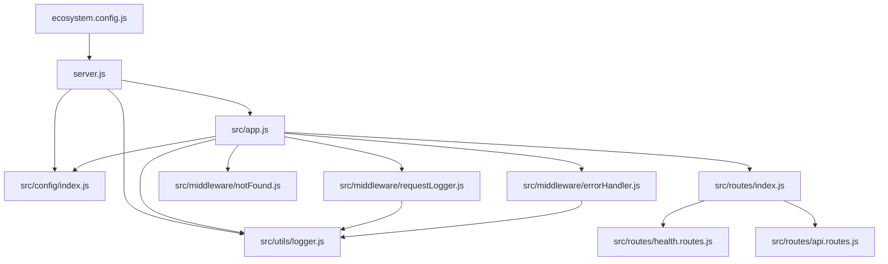

# Technical Specification

# 0. Agent Action Plan

## 0.1 Intent Clarification


### 0.1.1 Core Objective

Based on the provided requirements, the Blitzy platform understands that the objective is to transform the current skeletal repository ("Ajit-backprop-test") — which consists solely of a `README.md` file — into a fully functional, production-ready Node.js HTTP server built on the Express.js framework. The enhancements encompass six distinct capability areas that collectively convert a bare documentation placeholder into a deployable web service.

The platform interprets the following requirements with enhanced clarity:

- **Express.js Framework Integration**: Initialize a new Node.js project and implement the Express.js framework as the core HTTP server foundation, replacing any implicit or non-existent basic HTTP server with Express's robust routing and middleware pipeline
- **Routing System**: Establish a modular, organized routing architecture using Express Router with logically separated route files following RESTful conventions, enabling clear endpoint management across multiple resource domains
- **Middleware Pipeline**: Implement a comprehensive middleware stack including security headers (Helmet), CORS handling, request body parsing, request rate limiting, response compression, and error handling — following Express.js middleware best practices
- **Environment Configuration**: Introduce environment-based configuration management using `dotenv`, supporting distinct development, staging, and production profiles, with a centralized configuration module that loads and validates environment variables
- **Logging Infrastructure**: Deploy a dual-layer logging strategy combining HTTP request logging via Morgan with application-level structured logging via Winston, supporting console and file-based transports with configurable log levels per environment
- **PM2 Production Deployment**: Configure PM2 as the production process manager with an `ecosystem.config.js` file, enabling cluster mode, auto-restart, log management, and zero-downtime deployments for production readiness

**Implicit Requirements Detected:**

- A `package.json` manifest must be created to declare all project dependencies, scripts, and metadata
- A `.gitignore` file is needed to exclude `node_modules/`, `.env`, and log files from version control
- A `.env.example` template should document all expected environment variables
- A global error handling middleware must catch and format unhandled errors
- The application entry point should separate Express app configuration (`src/app.js`) from the server startup logic (`server.js`) to facilitate testing
- A health check endpoint is needed for PM2 and load balancer readiness verification
- The existing `README.md` must be updated with setup instructions, project structure documentation, and usage examples

### 0.1.2 Task Categorization

- **Primary task type**: Mixed (New Feature Implementation + Configuration + Build/Deploy)
- **Secondary aspects**: Documentation, Tooling, Security Enhancement
- **Scope classification**: Infrastructure Change — this is a greenfield build that creates the entire application architecture from scratch on a currently empty repository

### 0.1.3 Special Instructions and Constraints

- **User Rule "Ajit_Custom_Rule"**: "Do customization to the project code as mentioned in the details" — This directive instructs the platform to follow the user's enhancement specifications precisely and tailor all code to the stated requirements rather than using generic boilerplate
- No existing code patterns exist to follow; all conventions must be established as part of this implementation
- No environment variables or secrets were pre-configured by the user; environment configuration will be defined from scratch
- No Figma designs or UI attachments were provided; this is a purely backend server implementation
- No test framework was specified; however, the structure should accommodate future test additions

### 0.1.4 Technical Interpretation

These requirements translate to the following technical implementation strategy:

- To **establish the project foundation**, we will create a `package.json` with all necessary dependencies, configure Node.js v20 compatibility, and set up npm scripts for development, production, and PM2 operations
- To **integrate Express.js**, we will create `src/app.js` as the central Express application module that assembles all middleware and routes, and `server.js` as the entry point that binds the HTTP listener
- To **implement routing**, we will create `src/routes/` with modular route files (`index.js`, `health.routes.js`, `api.routes.js`) mounted via Express Router under organized path prefixes
- To **build the middleware pipeline**, we will create `src/middleware/` containing `errorHandler.js`, `notFound.js`, and `requestLogger.js`, while leveraging third-party middleware (Helmet, CORS, compression, rate limiting) configured in `src/app.js`
- To **enable environment configuration**, we will create `src/config/index.js` that loads variables from `.env` via `dotenv` and exports a validated, structured configuration object, alongside `.env.example` as the variable reference
- To **deploy logging**, we will create `src/utils/logger.js` using Winston with environment-aware transports (console for development, file for production) and integrate Morgan for HTTP request logging that pipes into the Winston transport
- To **prepare PM2 deployment**, we will create `ecosystem.config.js` at the project root with cluster-mode configuration, environment variable injection, log file paths, and restart policies suited for production


## 0.2 Repository Scope Discovery


### 0.2.1 Comprehensive File Analysis

The repository is currently a minimal, skeletal project with no application code, configuration, or dependency manifests. The complete inventory of existing files is:

| File | Status | Purpose |
|------|--------|---------|
| `README.md` | EXISTS | Project identifier — contains only the title "Ajit-backprop-test" and a one-line description "test project for backprop integration" |

**No additional files or directories exist.** The repository root contains no:
- Source code directories (`src/`, `lib/`, `app/`)
- Package manifests (`package.json`, `package-lock.json`)
- Configuration files (`.env`, `.gitignore`, `.nvmrc`, `.editorconfig`)
- Build or deployment files (`Dockerfile`, `ecosystem.config.js`, CI/CD workflows)
- Test infrastructure (`tests/`, `jest.config.js`, `.mocharc`)
- Documentation beyond the README

This confirms a **greenfield implementation** where every file must be created from scratch.

### 0.2.2 Web Search Research Conducted

The following research was conducted to inform implementation best practices:

- **Express.js latest stable version**: Express v5 has been officially released as stable with version 5.2.1. It drops support for Node.js versions before v18, updates routing with path-to-regexp@8.x for ReDoS mitigation, adds native Promise support in middleware, and removes deprecated API methods from v3/v4
- **PM2 production deployment patterns**: PM2 is the industry-standard process manager for Node.js production deployments. Best practices include using `ecosystem.config.js` for version-controlled configuration, cluster mode for multi-core utilization, `pm2-runtime` for container deployments, and `pm2 startup` + `pm2 save` for server reboot persistence
- **Express.js project structure conventions**: The standard production-ready structure separates concerns into `src/config/`, `src/controllers/`, `src/routes/`, `src/middleware/`, `src/utils/`, with `app.js` for Express setup and `server.js` for initialization. The three-layer architecture (web layer, service layer, data access layer) is the recommended pattern
- **Middleware stack best practices**: Production Express apps should use Helmet for HTTP security headers, CORS for cross-origin configuration, Morgan/Winston for logging, compression for response gzip, and express-rate-limit for DDoS protection. The middleware ordering matters — security middleware first, then parsing, then logging, then routes, then error handling
- **Logging strategy**: Winston is the standard for structured application logging with multiple transports, while Morgan handles HTTP request-level logging. Integration between them (piping Morgan output into Winston) provides unified log management

### 0.2.3 Existing Infrastructure Assessment

- **Current project structure**: Single-file repository with no organizational patterns established
- **Existing patterns and conventions**: None — all conventions must be defined as part of this implementation
- **Build and deployment configurations**: None present — PM2 `ecosystem.config.js` and npm scripts must be created
- **Testing infrastructure**: None present — project structure will accommodate future testing additions
- **Documentation system**: Only a basic `README.md` exists and will be substantially enhanced
- **Runtime environment**: Node.js v20.20.2 with npm v11.1.0 is available in the build environment, fully compatible with Express 5.x which requires Node.js 18+


## 0.3 Scope Boundaries


### 0.3.1 Exhaustively In Scope

**Source Code (to be created):**
- `src/app.js` — Express application assembly with middleware pipeline and route mounting
- `src/config/index.js` — Centralized environment configuration loader and validator
- `src/routes/index.js` — Root route aggregator that mounts all sub-routers
- `src/routes/health.routes.js` — Health check endpoint for PM2 and load balancer probes
- `src/routes/api.routes.js` — API route definitions with sample endpoints
- `src/middleware/errorHandler.js` — Global error handling middleware
- `src/middleware/notFound.js` — 404 catch-all middleware for unmatched routes
- `src/middleware/requestLogger.js` — Morgan-to-Winston HTTP request logging bridge
- `src/utils/logger.js` — Winston-based structured logging utility with environment-aware transports
- `server.js` — Server entry point that starts the HTTP listener

**Configuration Files (to be created):**
- `package.json` — Project manifest with dependencies, scripts, and metadata
- `.env` — Local environment variable file (development defaults)
- `.env.example` — Environment variable documentation template
- `.gitignore` — Version control exclusion patterns
- `.nvmrc` — Node.js version pinning for team consistency
- `ecosystem.config.js` — PM2 process management configuration

**Documentation (to be updated/created):**
- `README.md` — Complete rewrite with project setup instructions, structure overview, and usage documentation

### 0.3.2 Explicitly Out of Scope

- **Database integration** — No database connections, ORM/ODM setup, or data models (MongoDB, PostgreSQL, etc.)
- **Authentication and authorization** — No JWT, OAuth, Passport.js, or session management implementation
- **Frontend / UI layer** — No view engine (EJS, Pug), no static file serving beyond basic Express static middleware, no client-side assets
- **Unit and integration testing** — No test framework setup (Jest, Mocha, Supertest), though folder structure accommodates future additions
- **CI/CD pipeline configuration** — No GitHub Actions, GitLab CI, or other CI/CD workflow files
- **Docker containerization** — No Dockerfile or docker-compose.yml, though PM2 configuration supports future Docker integration via `pm2-runtime`
- **API documentation tooling** — No Swagger/OpenAPI specification generation
- **WebSocket or real-time communication** — No Socket.io or WebSocket server setup
- **Microservice patterns** — No service mesh, message queues, or inter-service communication
- **Performance profiling or APM** — No Datadog, New Relic, or custom profiling integration
- **Custom business logic** — Route handlers will provide sample/skeleton responses; domain-specific business logic is not within scope


## 0.4 Dependency Inventory


### 0.4.1 Key Private and Public Packages

All packages are public npm registry packages. No private packages are required for this implementation.

**Production Dependencies:**

| Registry | Package Name | Version | Purpose |
|----------|--------------|---------|---------|
| npm | express | 5.2.1 | Core HTTP server framework with routing, middleware pipeline, and request/response handling |
| npm | dotenv | 17.4.2 | Environment variable loader — reads `.env` files and injects variables into `process.env` |
| npm | winston | 3.19.0 | Structured application logging with multiple transports (console, file), log levels, and JSON formatting |
| npm | morgan | 1.10.1 | HTTP request logger middleware — captures method, URL, status, and response time per request |
| npm | helmet | 8.1.0 | Security middleware — sets HTTP response headers (CSP, HSTS, X-Frame-Options, etc.) to protect against common web vulnerabilities |
| npm | cors | 2.8.6 | Cross-Origin Resource Sharing middleware — configures allowed origins, methods, and headers for cross-domain requests |
| npm | compression | 1.8.1 | Response compression middleware — gzip/deflate encoding to reduce response payload size |
| npm | express-rate-limit | 8.3.2 | Rate limiting middleware — prevents abuse and DDoS by limiting request frequency per IP |
| npm | http-errors | 2.0.1 | HTTP error creation utility — standardizes error object creation with proper status codes and messages |

**Development Dependencies:**

| Registry | Package Name | Version | Purpose |
|----------|--------------|---------|---------|
| npm | nodemon | 3.1.9 | Development file watcher — auto-restarts the server on source code changes |
| npm | pm2 | 6.0.14 | Production process manager — cluster mode, auto-restart, log rotation, and zero-downtime deployments |

**Runtime:**

| Technology | Version | Purpose |
|------------|---------|---------|
| Node.js | 20.20.2 | JavaScript runtime — LTS version compatible with Express 5.x (requires Node.js >=18) |
| npm | 11.1.0 | Package manager for dependency installation and script execution |

### 0.4.2 Dependency Updates

Since this is a greenfield project with no existing dependencies, all packages are new additions.

**New dependencies to add:**
- `express@5.2.1` — Core framework for the HTTP server
- `dotenv@17.4.2` — Environment variable management
- `winston@3.19.0` — Application-level structured logging
- `morgan@1.10.1` — HTTP request logging middleware
- `helmet@8.1.0` — Security header configuration
- `cors@2.8.6` — Cross-origin request handling
- `compression@1.8.1` — Response compression
- `express-rate-limit@8.3.2` — API rate limiting protection
- `http-errors@2.0.1` — Standardized HTTP error creation
- `nodemon@3.1.9` (dev) — Development auto-reload
- `pm2@6.0.14` (dev) — Production process manager

**Dependencies to update:** None (greenfield project)

**Dependencies to remove:** None (greenfield project)

**Import/Reference Updates:**
- No existing import updates required since this is a new project
- All new files will use CommonJS `require()` syntax consistent with the Node.js v20 default module system for maximum compatibility with Express 5.x and all middleware packages


## 0.5 Implementation Design


### 0.5.1 Technical Approach

**Primary objectives with implementation approach:**

- Achieve a **production-ready Express.js server** by creating a well-structured Node.js application with separated concerns (app configuration vs. server startup), comprehensive middleware pipeline, and modular routing — enabling both development agility and production stability
- Achieve **robust request handling** by implementing a layered middleware stack (security → parsing → logging → routing → error handling) that processes every request through security validation, payload parsing, and structured logging before reaching route handlers
- Achieve **environment-aware configuration** by creating a centralized config module that loads and validates environment variables via `dotenv`, providing sensible defaults for development while requiring explicit configuration for production
- Achieve **comprehensive observability** by deploying Winston for application-level structured logging with environment-specific transports and Morgan for HTTP-layer request logging, with both systems integrated through a custom stream bridge
- Achieve **production deployment readiness** by configuring PM2 with cluster mode, automatic restart policies, memory limits, and environment-specific profiles through a version-controlled `ecosystem.config.js`

**Logical implementation flow:**

- First, establish the **project foundation** by creating `package.json`, installing all dependencies, and setting up `.gitignore`, `.nvmrc`, and `.env.example` to define the project's identity and environmental contract
- Next, build the **configuration layer** by creating `src/config/index.js` that loads environment variables and exports a structured config object, ensuring every other module has access to validated settings
- Then, implement the **logging infrastructure** by creating `src/utils/logger.js` with Winston and `src/middleware/requestLogger.js` with Morgan, so all subsequent middleware and route development benefits from logging from the start
- Following that, assemble the **Express application** in `src/app.js` by wiring the middleware pipeline in correct order — Helmet, CORS, compression, body parsing, request logging, routes, 404 handler, and error handler
- Concurrently, build the **routing layer** by creating route modules in `src/routes/` with a health check endpoint and sample API routes, mounted via the root route aggregator
- Then, create the **error handling layer** with `src/middleware/errorHandler.js` and `src/middleware/notFound.js` for consistent error responses
- Finally, configure **PM2 deployment** via `ecosystem.config.js` and update `README.md` with complete project documentation

### 0.5.2 Component Impact Analysis

**New components to create:**

| Component | Type | Responsibility |
|-----------|------|----------------|
| `server.js` | Entry point | Imports the Express app, binds the HTTP listener on the configured port, handles graceful shutdown signals |
| `src/app.js` | Application core | Assembles the Express instance, registers all middleware in correct order, mounts routes, exports the app for testing |
| `src/config/index.js` | Configuration | Loads `.env`, validates required variables, exports a structured config object with defaults |
| `src/routes/index.js` | Route aggregator | Imports and mounts all sub-routers under their path prefixes |
| `src/routes/health.routes.js` | Health endpoint | Provides `/health` endpoint returning server status, uptime, and timestamp |
| `src/routes/api.routes.js` | API endpoints | Defines sample API routes with JSON responses for demonstration |
| `src/middleware/errorHandler.js` | Error middleware | Catches all errors, logs them via Winston, returns standardized JSON error responses |
| `src/middleware/notFound.js` | 404 middleware | Catches unmatched routes and generates a 404 error response |
| `src/middleware/requestLogger.js` | Logging bridge | Configures Morgan with a custom Winston stream for unified log management |
| `src/utils/logger.js` | Logging utility | Creates and exports a Winston logger instance with console and file transports |
| `ecosystem.config.js` | PM2 config | Defines PM2 application settings for cluster mode, environment profiles, and restart policies |

**Component dependency graph:**



### 0.5.3 Critical Implementation Details

**Middleware ordering strategy (applied in `src/app.js`):**

The middleware pipeline must follow this exact sequence for correctness:

1. `helmet()` — Security headers applied first to every response
2. `cors()` — CORS headers before any request processing
3. `compression()` — Response compression enabled early
4. `express.json()` — JSON body parsing
5. `express.urlencoded()` — URL-encoded body parsing
6. `requestLogger` — HTTP request logging (Morgan → Winston)
7. `rateLimiter` — Rate limiting applied before routes
8. Route handlers — Application routes (`/health`, `/api`)
9. `notFound` — 404 catch-all for unmatched routes (must be after all routes)
10. `errorHandler` — Global error handler (must be the last middleware)

**Graceful shutdown pattern (applied in `server.js`):**

The server must handle `SIGTERM` and `SIGINT` signals to close connections cleanly before PM2 restarts or deploys new versions. This ensures zero request loss during deployments.

**PM2 cluster mode configuration:**

The `ecosystem.config.js` will use `exec_mode: 'cluster'` with `instances: 'max'` for production, spawning one worker per CPU core. Development mode will use `instances: 1` with `watch: true` for live reload.

**Winston transport strategy:**

| Environment | Console Transport | File Transport | Log Level |
|-------------|-------------------|----------------|-----------|
| development | Enabled (colorized) | Disabled | `debug` |
| production | Enabled (JSON) | Enabled (`logs/error.log`, `logs/combined.log`) | `info` |

**Error response standardization:**

All error responses will follow a consistent JSON format:
```json
{ "status": "error", "statusCode": 500, "message": "..." }
```


## 0.6 File Transformation Mapping


### 0.6.1 File-by-File Execution Plan

| Target File | Transformation | Source File/Reference | Purpose/Changes |
|-------------|----------------|----------------------|-----------------|
| `package.json` | CREATE | N/A | Define project metadata, all production and dev dependencies, npm scripts (`start`, `dev`, `pm2:start`, `pm2:stop`) |
| `.gitignore` | CREATE | N/A | Exclude `node_modules/`, `.env`, `logs/`, `*.log`, PM2 pid/log files from version control |
| `.nvmrc` | CREATE | N/A | Pin Node.js version to `20` for team consistency and CI environments |
| `.env` | CREATE | N/A | Development environment defaults: `PORT=3000`, `NODE_ENV=development`, `LOG_LEVEL=debug` |
| `.env.example` | CREATE | N/A | Document all expected environment variables with placeholder values for onboarding |
| `server.js` | CREATE | N/A | Application entry point — imports `src/app.js`, binds HTTP listener, implements graceful shutdown for SIGTERM/SIGINT |
| `src/app.js` | CREATE | N/A | Express application assembly — middleware pipeline registration, route mounting, error handler attachment |
| `src/config/index.js` | CREATE | N/A | Centralized config loader — reads `.env` via dotenv, exports structured config object with validated defaults |
| `src/routes/index.js` | CREATE | N/A | Root route aggregator — imports and mounts `health.routes.js` and `api.routes.js` under their path prefixes |
| `src/routes/health.routes.js` | CREATE | N/A | Health check endpoint at `/health` — returns JSON with status, uptime, timestamp, and environment |
| `src/routes/api.routes.js` | CREATE | N/A | Sample API routes at `/api` — includes GET `/api` welcome endpoint and GET `/api/info` server information endpoint |
| `src/middleware/errorHandler.js` | CREATE | N/A | Global error handler — logs errors via Winston, returns standardized JSON error response with appropriate status code |
| `src/middleware/notFound.js` | CREATE | N/A | 404 catch-all — creates `http-errors` NotFound error for any unmatched route and passes to error handler |
| `src/middleware/requestLogger.js` | CREATE | N/A | Morgan-to-Winston bridge — configures Morgan HTTP logging format with a custom stream that writes to Winston |
| `src/utils/logger.js` | CREATE | N/A | Winston logger factory — creates logger with console transport (dev: colorized, prod: JSON) and file transports for production |
| `ecosystem.config.js` | CREATE | N/A | PM2 process configuration — cluster mode, instance count, environment profiles, restart policies, log file paths |
| `README.md` | UPDATE | `README.md` | Complete rewrite — add project overview, prerequisites, installation steps, project structure, environment config, npm scripts, PM2 deployment guide |

### 0.6.2 New Files Detail

**`package.json`** — Project manifest
- Content type: Configuration
- Key sections: `name`, `version`, `main`, `scripts` (start, dev, pm2:start, pm2:stop, pm2:logs), `dependencies`, `devDependencies`, `engines`
- The `engines` field will enforce `node >= 20.0.0`

**`server.js`** — Server entry point
- Content type: Source code
- Key functions: HTTP listener binding, port configuration from `src/config`, graceful shutdown handler (`process.on('SIGTERM')`, `process.on('SIGINT')`)
- Imports: `src/app.js`, `src/config/index.js`, `src/utils/logger.js`

**`src/app.js`** — Express application
- Content type: Source code
- Key sections: Express instance creation, middleware pipeline (helmet, cors, compression, json/urlencoded parsers, request logger, rate limiter), route mounting (`/health`, `/api`), 404 handler, global error handler
- Exports: configured Express app instance

**`src/config/index.js`** — Configuration module
- Content type: Source code
- Key sections: `dotenv.config()` call, exported config object with `port`, `nodeEnv`, `logLevel`, `corsOrigin`, `rateLimitWindowMs`, `rateLimitMax` properties with validated defaults

**`src/routes/index.js`** — Route aggregator
- Content type: Source code
- Mounts: `health.routes.js` at `/health`, `api.routes.js` at `/api`

**`src/routes/health.routes.js`** — Health endpoint
- Content type: Source code
- Endpoints: `GET /health` returning `{ status: 'ok', uptime, timestamp, environment }`

**`src/routes/api.routes.js`** — API routes
- Content type: Source code
- Endpoints: `GET /api` returning welcome message, `GET /api/info` returning server metadata

**`src/middleware/errorHandler.js`** — Error handler
- Content type: Source code
- Handles: Express 4-argument error middleware signature `(err, req, res, next)`, logs via Winston, returns JSON error response

**`src/middleware/notFound.js`** — 404 handler
- Content type: Source code
- Creates: `http-errors` 404 error for unmatched routes

**`src/middleware/requestLogger.js`** — Request logging bridge
- Content type: Source code
- Configures: Morgan with `combined` format for production, `dev` format for development, custom Winston stream

**`src/utils/logger.js`** — Winston logger
- Content type: Source code
- Transports: Console (always), File (`logs/error.log` at error level, `logs/combined.log` at info level — production only)
- Format: Timestamp, log level, JSON structure for production, colorized text for development

**`ecosystem.config.js`** — PM2 configuration
- Content type: Configuration
- Key settings: `name: 'ajit-backprop-test'`, `script: 'server.js'`, `exec_mode: 'cluster'`, `instances: 'max'`, `env` (development), `env_production` (production settings), `max_memory_restart: '300M'`

### 0.6.3 Files to Modify Detail

**`README.md`** — Complete content replacement
- Sections to update: Entire file content
- New content to add: Project title and description, prerequisites section, installation instructions, project structure tree, environment configuration guide, available npm scripts table, PM2 deployment instructions, API endpoint documentation
- Content to remove: Current minimal content ("test project for backprop integration")

### 0.6.4 Configuration and Documentation Updates

**Configuration changes:**
- `.env` / `.env.example`: Define `PORT`, `NODE_ENV`, `LOG_LEVEL`, `CORS_ORIGIN`, `RATE_LIMIT_WINDOW_MS`, `RATE_LIMIT_MAX`
- `ecosystem.config.js`: PM2 cluster configuration with separate environment profiles for development and production
- `package.json` scripts: `"start": "node server.js"`, `"dev": "nodemon server.js"`, `"pm2:start": "pm2 start ecosystem.config.js"`, `"pm2:stop": "pm2 stop ecosystem.config.js"`, `"pm2:logs": "pm2 logs"`

**Documentation updates:**
- `README.md`: Comprehensive project documentation covering all aspects of setup, development, and production deployment

### 0.6.5 Cross-File Dependencies

**Import/reference chain:**
- `server.js` requires `src/app.js`, `src/config/index.js`, `src/utils/logger.js`
- `src/app.js` requires `src/config/index.js`, `src/middleware/*`, `src/routes/index.js`
- `src/middleware/errorHandler.js` requires `src/utils/logger.js`
- `src/middleware/requestLogger.js` requires `src/utils/logger.js`
- `src/routes/index.js` requires `src/routes/health.routes.js`, `src/routes/api.routes.js`
- `ecosystem.config.js` references `server.js` as the entry script

**Configuration sync requirements:**
- `.env` variables must match keys expected by `src/config/index.js`
- `.env.example` must document every variable loaded by `src/config/index.js`
- `ecosystem.config.js` environment variables must align with `src/config/index.js` expected keys
- `package.json` `main` field must point to `server.js`
- `.nvmrc` version must match `package.json` `engines.node` constraint


## 0.7 Rules


### 0.7.1 User-Specified Rules

- **Ajit_Custom_Rule**: "Do customization to the project code as mentioned in the details" — All implementation must strictly follow the user's enhancement specifications (Express.js framework, routing, middleware, environment configuration, logging, and PM2 production deployment) rather than using generic scaffolding or opinionated boilerplate generators

### 0.7.2 Task-Specific Implementation Rules

- **Follow Express 5.x conventions**: Since Express 5.2.1 is being used, all code must follow Express 5 patterns — native Promise support in route handlers, removed deprecated `app.del()` method, updated path-to-regexp routing syntax, `req.query` returning a getter
- **Use CommonJS module syntax**: All files must use `require()` / `module.exports` (CommonJS) to ensure maximum compatibility with Express 5.x and all middleware packages in the Node.js v20 runtime
- **Maintain separation of app and server**: The Express app (`src/app.js`) must be separate from the server startup (`server.js`) to enable future testability — the app can be imported by test frameworks without starting the listener
- **Middleware order is non-negotiable**: Security middleware (Helmet, CORS) must precede parsing middleware, which must precede logging middleware, which must precede routes, which must precede error handlers
- **Environment variables must never be hardcoded**: All configurable values (port, log level, CORS origins, rate limits) must be sourced from environment variables via the config module
- **Error handling must be centralized**: Individual route handlers should not catch and format their own errors — they should propagate errors to the global error handler middleware via `next(err)`
- **PM2 config must be version-controlled**: The `ecosystem.config.js` must be committed to the repository (not generated at deploy time) to ensure deployment reproducibility
- **No sensitive data in committed files**: The `.env` file must be listed in `.gitignore`; only `.env.example` with placeholder values should be committed


## 0.8 Special Instructions


### 0.8.1 Special Execution Instructions

- **Greenfield project creation**: This is a from-scratch implementation on an empty repository. No existing code needs to be preserved or migrated, aside from the project identity in `README.md`
- **No test generation required**: While the folder structure should be amenable to future test additions, no test files, test framework configuration, or test scripts are required as part of this implementation
- **No CI/CD pipeline setup**: No GitHub Actions, GitLab CI, or other continuous integration workflow files should be created — PM2 is the specified deployment mechanism
- **No Docker containerization**: Although PM2 supports `pm2-runtime` for Docker, the user's specification targets traditional PM2 process management, not containerized deployments
- **PM2 should be a dev dependency**: PM2 is installed globally in production environments (`npm install pm2 -g`), but included as a dev dependency in `package.json` for local development and scripting convenience
- **Sample route handlers only**: API route handlers should return demonstrative JSON responses that illustrate the routing pattern; no actual business logic or database connectivity is expected

### 0.8.2 Constraints and Boundaries

- **Technical constraints**:
  - Node.js >= 20.x is required (aligned with project runtime)
  - Express 5.x requires Node.js >= 18 minimum
  - All packages must be compatible with Express 5.x
  - CommonJS module format must be used throughout

- **Process constraints**:
  - No code from external generators (express-generator, create-express-app) should be used — all files must be hand-crafted to match the user's specific requirements
  - No modifications should be made to files outside the repository root and `src/` directory

- **Output constraints**:
  - All generated files must be production-quality with proper error handling, logging, and security considerations
  - Code must be clean, well-commented, and follow consistent formatting conventions
  - The `README.md` must be comprehensive enough for a new developer to set up, run, and deploy the project from scratch

- **Compatibility requirements**:
  - The server must start correctly on any system with Node.js 20+ and npm 10+ installed
  - Environment configuration must work with or without a `.env` file (defaults must be provided for development)
  - PM2 `ecosystem.config.js` must support both development (`pm2 start ecosystem.config.js`) and production (`pm2 start ecosystem.config.js --env production`) invocations


## 0.9 References


### 0.9.1 Repository Files and Folders Searched

| Path | Type | Findings |
|------|------|----------|
| `/` (root) | Folder | Contains only `README.md`; no source code, dependencies, or configuration present |
| `README.md` | File | Contains project title "Ajit-backprop-test" and description "test project for backprop integration" (2 lines total) |

No `.blitzyignore` files were found in the repository.

### 0.9.2 External Research Sources

| Source | Topic | Key Insight |
|--------|-------|-------------|
| npm registry — `express` | Express.js version | Latest stable version is 5.2.1; requires Node.js 18+; native Promise support in middleware |
| npm registry — `winston` | Winston version | Latest version 3.19.0 with structured logging, multiple transports |
| npm registry — `morgan` | Morgan version | Latest version 1.10.1; HTTP request logger middleware |
| npm registry — `helmet` | Helmet version | Latest version 8.1.0; security headers middleware |
| npm registry — `cors` | CORS version | Latest version 2.8.6; cross-origin resource sharing |
| npm registry — `dotenv` | dotenv version | Latest version 17.4.2; environment variable loader |
| npm registry — `pm2` | PM2 version | Latest version 6.0.14; production process manager |
| npm registry — `express-rate-limit` | Rate limiter version | Latest version 8.3.2; request rate limiting |
| npm registry — `compression` | Compression version | Latest version 1.8.1; response gzip/deflate |
| npm registry — `http-errors` | HTTP errors version | Latest version 2.0.1; standardized error creation |
| GitHub — expressjs/express releases | Express 5 release | Express v5 officially released as stable; drops Node.js < 18 support; updates path-to-regexp for security |
| PloyCloud Blog — PM2 Guide | PM2 production patterns | Ecosystem file best practices, cluster mode, log rotation, pm2-runtime for containers |
| BetterStack — PM2 Guide | PM2 deployment | Development mode with pm2-dev, production deployment, ecosystem config |
| DEV Community — Express.js structure | Project organization | Standard `src/` layout with config, controllers, routes, middleware, utils separation |
| OneUptime Blog — Express structure | Scalable Express projects | Three-layer architecture, middleware ordering, error handler placement |
| LogRocket Blog — Express organization | Express productivity | Routes, controllers, middleware, and models folder conventions |

### 0.9.3 Attachments

No attachments were provided for this project.

### 0.9.4 Figma Screens

No Figma URLs or design screens were provided for this project.

### 0.9.5 Tech Spec Sections Referenced

| Section | Purpose |
|---------|---------|
| 1.1 Executive Summary | Understood the Blitzy platform context and document generation methodology |
| 1.2 System Overview | Reviewed the multi-agent architecture and tool ecosystem used for specification generation |
| 1.3 Scope | Identified in-scope and out-of-scope boundaries for the system |
| 2.1 Feature Catalog | Reviewed the feature set including Agent Action Plan creation (F-006) and User Rules Integration (F-018) |
| 5.1 High-Level Architecture | Understood the state-graph-driven architecture and data flow patterns |
| 8.9 Technology Version Matrix | Referenced runtime dependencies and version information for context |


