# Technical Specification

# 1. Introduction

## 1.1 EXECUTIVE SUMMARY

### 1.1.1 Project Overview

The **Reverse Document Generator** (`archie-job-reverse-document-generator`) is an AI-powered autonomous agent system that produces comprehensive Technical Specification documents by deeply analyzing source code repositories. Operating as a background **Google Cloud Run Job** within the **Blitzy Platform** ecosystem, the system leverages a multi-LLM orchestration architecture built on **LangGraph** to inspect, understand, and document codebases at enterprise scale.

The system supports two primary operational modes:

| Mode | Purpose | Trigger |
|------|---------|---------|
| **GENERATE** | Creates a complete new Technical Specification from scratch by systematically exploring a codebase | Initial specification request via Pub/Sub |
| **UPDATE** | Modifies an existing Technical Specification based on new requirements, selectively regenerating only changed sections | Specification revision request with `new_requirements` payload |

As evidenced by the sample output in `/app/lib/reverse_document/doc.py` — a 9,637-line Technical Specification produced for "AI Umbrella" (a Java/Spring Boot insurance policy management application) — the system generates production-grade documentation that includes detailed architectural narratives, mermaid diagrams (flowcharts, ERDs, sequence diagrams, state diagrams), data models, API specifications, infrastructure configurations, and comprehensive tables spanning eight major sections.

### 1.1.2 Core Business Problem

Creating and maintaining technical documentation for software systems is one of the most time-intensive and error-prone tasks in the software development lifecycle. Traditional documentation approaches suffer from:

- **Manual effort burden** — Technical writers and architects must spend significant hours reviewing source code and producing structured specifications.
- **Documentation drift** — Specifications quickly become outdated as codebases evolve, leading to unreliable references.
- **Inconsistent quality** — Documentation quality varies widely based on individual expertise, available time, and familiarity with the codebase.
- **Incomplete coverage** — Manual reviewers frequently miss architectural nuances, edge cases, and cross-cutting concerns buried deep within complex codebases.

The Reverse Document Generator solves these problems by deploying AI agents that directly inspect and understand code, producing evidence-based documentation grounded in actual codebase analysis rather than human recall. The system's search agent methodically explores folder hierarchies, reads file contents, performs semantic searches, and executes shell commands — ensuring comprehensive coverage that surpasses typical manual review. This is orchestrated through the `ReverseDocumentHelper` class in `/app/lib/reverse_document/helper.py`, which defines over twelve specialized tools for repository inspection and document management.

### 1.1.3 Key Stakeholders and Users

| Stakeholder Group | Role | Interaction Model |
|-------------------|------|-------------------|
| **Platform Users** | Software teams requesting technical documentation for their repositories | Indirect — trigger jobs through the Blitzy Platform UI; consume generated specifications |
| **Blitzy Platform Team** | Operates and maintains the service as part of the broader Blitzy ecosystem | Direct — manages deployment, monitoring, and configuration via CI/CD and LangSmith |
| **Downstream Services** | `reverse-code-generator`, `reverse-file-mapper`, and `reverse-thinking-generator` consume generated specifications | Automated — receive `platform-events` Pub/Sub notifications upon completion |
| **Enterprise Architects** | Consume generated specifications for architectural review and decision-making | Indirect — review output documents for accuracy and completeness |

Code ownership for the entire repository is held by `@siddhantpp` as defined in `/app/CODEOWNERS`.

### 1.1.4 Business Impact and Value Proposition

The system delivers measurable business value across several dimensions:

- **Automation of Expert Work** — Replaces hours of manual technical writing with AI-generated specifications, with built-in metering estimation that calculates `estimated_hours_saved` and `estimated_lines_generated` for each job (tracked in `ReverseDocumentState` defined in `/app/lib/reverse_document/state.py`).
- **Consistency at Scale** — Every specification follows the same structured methodology governed by the prompt engineering system in `/app/lib/reverse_document/prompts.py`, which enforces systematic search protocols (rules S0–S7), tool usage rules (T1–T5), and output standards (SO1–SO4).
- **Living Documentation** — The UPDATE mode enables specifications to evolve alongside codebases. Changed sections are regenerated with purple-highlighted differences (`rgba(91, 57, 243, 0.2)`), while unchanged sections are efficiently preserved.
- **Pipeline Enablement** — Generated specifications feed directly into the Blitzy Platform's code generation and file mapping pipelines, creating an end-to-end automation chain from documentation to implementation.

---

## 1.2 SYSTEM OVERVIEW

### 1.2.1 Project Context

#### Business Context and Market Positioning

The Reverse Document Generator is a core service within the **Blitzy Platform** — an enterprise software development platform that integrates AI-driven automation across the software lifecycle. Within this ecosystem, the service occupies a foundational role: it transforms raw codebases into structured technical specifications that serve as inputs for downstream automation services.

As evidenced by the LangSmith project configuration in `/app/find_trace_runs.py`, the system operates within a four-service pipeline:

1. **reverse-document-generator** (this system) — Generates technical specifications from code
2. **reverse-code-generator** — Generates code from specifications
3. **reverse-file-mapper** — Maps files to specification sections
4. **reverse-thinking-generator** — Generates agent action plans

These services share data artifacts (notably `tech_spec_first_n` and `agent_action_plan`) and are correlated through LangSmith distributed traces.

#### Integration with Existing Enterprise Landscape

The system integrates with a comprehensive set of platform services and cloud infrastructure components. The deployment manifest in `/app/.github/workflows/deploy-job.yml` reveals five platform service integrations:

| Platform Service | Environment Variable | Purpose |
|-----------------|---------------------|---------|
| GitHub Server | `SERVICE_URL_GITHUB` | Repository access and source code operations |
| Admin Server | `SERVICE_URL_ADMIN` | Platform administration and configuration |
| Relay Server | `SERVICE_URL_RELAY` | Communication relay for inter-service messaging |
| Markdown Server | `MARKDOWN_SERVER` | Markdown processing and rendering |
| GitHub Secret Server | `GITHUB_SECRET_SERVER` | Secure credential management for repository access |

The following diagram illustrates the system's position within the broader Blitzy Platform architecture:

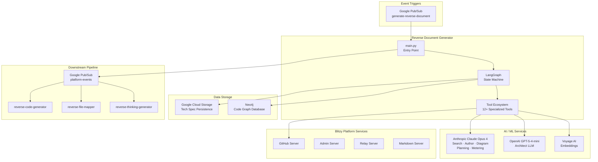

### 1.2.2 High-Level Description

#### Primary System Capabilities

The Reverse Document Generator provides the following core capabilities, all orchestrated through the `ReverseDocumentHelper` class in `/app/lib/reverse_document/helper.py`:

1. **Autonomous Codebase Exploration** — The search agent systematically traverses repository structures using a defined set of tools (`get_source_folder_contents`, `read_file`, `search_files`, `search_folders`, `get_file_summary`) to build comprehensive understanding. The prompt system enforces minimum 3-level hierarchy depth exploration and a 2:1 deep-to-broad search ratio.

2. **Evidence-Based Documentation Generation** — The author agent produces documentation sections grounded in actual code artifacts, with citation requirements and source attribution enforced through the prompt system (rules SO1–SO4 in `/app/lib/reverse_document/prompts.py`).

3. **Diagram Generation** — A dedicated diagram agent produces valid mermaid diagrams including flowcharts, entity-relationship diagrams, sequence diagrams, state diagrams, and architecture diagrams — as demonstrated in the sample output spanning `/app/lib/reverse_document/doc.py`.

4. **Selective Specification Updates** — The UPDATE mode uses an Architect LLM (GPT-5-4-mini) to classify each section as `CHANGED` or `UNCHANGED` via structured output (`DocumentSections` model in `/app/lib/reverse_document/models.py`), regenerating only affected sections while preserving stable content.

5. **Metering and Estimation** — The system calculates estimated hours saved and lines generated for each job, providing quantifiable value metrics tracked in the `ReverseDocumentState`.

6. **Design Integration** — When Figma design data is available, the system activates a Figma MCP integration and an `identify_figma_screens` sub-agent to match design screens to documentation sections, enriching UI-related specification content.

#### Major System Components

The system is composed of five core modules housed in `/app/lib/reverse_document/`:

| Module | File | Responsibility |
|--------|------|----------------|
| **Workflow Engine** | `helper.py` (1,316 lines) | Defines the LangGraph state graph, all workflow nodes (`setup`, `gather_context`, `document_section`, `identify_changes`, `update_section`, `copy_old_tech_spec_section`, `create_agent_action_plan`, `estimate_metering`), tool definitions, MCP configuration, and routing logic |
| **Prompt System** | `prompts.py` (1,097 lines) | Contains all LLM prompt templates for the search agent, author agent, update system, agent action plan, and metering estimator — with structured rule sets (S0–S7, T1–T5, SO1–SO4) |
| **State Manager** | `state.py` (78 lines) | Defines the `ReverseDocumentState` TypedDict with 32 fields covering identity, workflow, content, update-specific, metering, and infrastructure concerns |
| **Data Models** | `models.py` (33 lines) | Pydantic models for structured LLM outputs: `DocumentSectionStatus` (CHANGED/UNCHANGED enum), `DocumentSection`, and `DocumentSections` |
| **Sample Output** | `doc.py` (9,637 lines) | Reference Technical Specification demonstrating full system output capabilities |

The entry point `main.py` (424 lines) serves as the orchestrator — initializing LLM instances, configuring the LangGraph workflow, handling Pub/Sub message ingestion, managing GCS persistence, and dispatching completion notifications.

#### Core Technical Approach

The system employs a **multi-agent, state-graph-driven architecture** built on LangGraph, where specialized AI agents collaborate through a structured workflow with shared state.

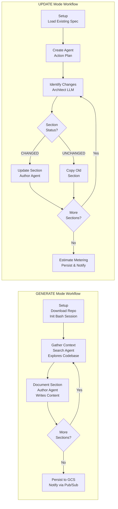

**Multi-LLM Strategy** — As configured in `/app/main.py` (lines 33–52), the system delegates distinct responsibilities to purpose-selected models:

| Agent Role | Model | Selection Rationale |
|------------|-------|---------------------|
| Search Agent | Claude Opus 4 (thinking-max) | Deep reasoning for systematic codebase exploration |
| Author Agent | Claude Opus 4 (thinking-max) | High-quality technical writing with evidence synthesis |
| Diagram Agent | Claude Opus 4 (thinking-max) | Complex diagram generation requiring spatial reasoning |
| Architect LLM | GPT-5-4-mini | Fast, structured output for section classification |
| Action Plan Agent | Claude Opus 4 (thinking-max, level 6) | Extended thinking for comprehensive change analysis |
| Metering Estimator | Claude Opus 4 (thinking-max, level 6) | Extended thinking for accurate effort estimation |

**Tool-Augmented Reasoning** — Agents are equipped with over twelve specialized tools spanning repository inspection (`get_source_folder_contents`, `read_file`, `search_files`, `search_folders`, `get_file_summary`), document management (`get_tech_spec_section`, `add_tech_spec_sub_section`, `mark_tech_spec_sub_section_complete`), external research (`web_search`, `web_fetch`), shell execution (`bash`), and MCP-based integrations (`chrome-devtools`, `figma`).

**State-Driven Coordination** — The `ReverseDocumentState` TypedDict (defined in `/app/lib/reverse_document/state.py`) carries 32 fields across the workflow, managing identity context (branch, company, repository, user IDs), workflow progression (section index, section prompts/headings, total sections), content accumulation (current and updated tech specs, parsed sections), and operational metadata (retry counts, root folder contents).

### 1.2.3 Success Criteria

#### Measurable Objectives

| Objective | Measurement Mechanism | Source |
|-----------|----------------------|--------|
| Complete specification generation | All defined sections produced and persisted to GCS | `document_router` logic in `helper.py` checks `section_index >= total_sections` |
| Job completion notification | `platform-events` Pub/Sub message with `status: DONE` published | `/app/main.py` lines 75–95; `/app/done.test.py` |
| Metering capture (UPDATE mode) | `estimated_hours_saved` and `estimated_lines_generated` calculated and persisted | `estimate_metering` node in `helper.py`; state fields in `state.py` |

#### Critical Success Factors

1. **Codebase Coverage Depth** — The search agent must achieve thorough exploration of the target repository. The prompt system enforces this through rule S3 (minimum 3-level hierarchy depth) and rule S2 (mandatory search tracking with budget status and deduplication), both defined in `/app/lib/reverse_document/prompts.py`.

2. **Output Quality and Accuracy** — Generated specifications must be evidence-based and traceable. The author agent prompt system enforces citation requirements (rule SO1), source attribution (rule SO4), and technical precision (rule SO3).

3. **Resilient Execution** — LLM interactions are protected by the `@archie_exponential_retry()` decorator with `RETRYABLE_EXCEPTIONS` handling, and the state tracks `retry_count` for operational visibility. Token usage is managed via `process_messages_with_tool_calls` with a `CONTEXT_350K` limit to prevent context window overflows.

4. **Valid Diagram Output** — Mermaid diagrams must pass syntax validation. The author agent prompt includes explicit mermaid validation rules covering subgraph closure, node ID uniqueness, and proper diagram type formatting.

#### Key Performance Indicators

| KPI | Description | Tracking Mechanism |
|-----|-------------|-------------------|
| Hours Saved | Estimated manual effort displaced per specification | `estimated_hours_saved` in `ReverseDocumentState` |
| Lines Generated | Total documentation lines produced | `estimated_lines_generated` in `ReverseDocumentState` |
| Trace Correlation | End-to-end pipeline observability | LangSmith traces across three projects (`reverse-code-generator`, `reverse-file-mapper`, `reverse-thinking-generator`) correlated via `/app/find_trace_runs.py` |
| Job Success Rate | Percentage of jobs completing with `DONE` status | Pub/Sub notification status field (`DONE` vs `ERROR`) in `/app/main.py` |

---

## 1.3 SCOPE

### 1.3.1 In-Scope

#### Core Features and Functionalities

The following capabilities constitute the must-have feature set of the Reverse Document Generator, as evidenced by the implementation in `/app/lib/reverse_document/helper.py` and related modules:

| Feature | Description | Evidence |
|---------|-------------|----------|
| **Full Specification Generation** | End-to-end creation of multi-section Technical Specifications from source code repositories | `create_graph()` method defining GENERATE workflow; sample output in `doc.py` (9,637 lines, 8 major sections) |
| **Selective Specification Update** | Modification of existing specifications based on new requirements, regenerating only changed sections | `identify_changes()`, `update_section()`, `copy_old_tech_spec_section()` workflow nodes |
| **Autonomous Codebase Exploration** | AI-driven deep traversal of repository structures with semantic search capabilities | Six repository inspection tools; Voyage AI embeddings for semantic search |
| **Diagram Generation** | Automated production of mermaid diagrams (flowcharts, ERDs, sequence diagrams, state diagrams, architecture diagrams) | Dedicated diagram agent; extensive diagram examples in `doc.py` |
| **Agent Action Plan Creation** | Comprehensive change analysis plans for UPDATE mode operations | `create_agent_action_plan` node; Claude Opus 4 with thinking-level-6 |
| **Metering Estimation** | Calculation of hours saved and lines generated for value quantification | `estimate_metering` node; dedicated state fields |
| **Figma Design Integration** | Matching design screens to documentation sections when Figma data is available | Figma MCP tool and `identify_figma_screens` sub-agent (conditionally enabled) |
| **Web Research** | Internet search and page fetching for supplementary technical context | `web_search` and `web_fetch` tools |
| **Shell Execution** | Persistent bash session for ad-hoc codebase inspection commands | `bash` tool with persistent session initialized in `setup` node |

**Primary User Workflows:**

1. **Generate Workflow** — A Pub/Sub message triggers the system with repository metadata → the system downloads and indexes the repository → the search agent explores the codebase section-by-section → the author agent writes each section → the complete specification is persisted to GCS → a completion notification is published to `platform-events`.

2. **Update Workflow** — A Pub/Sub message includes `new_requirements` and the existing specification → the system creates an Agent Action Plan → the Architect LLM classifies each section as CHANGED or UNCHANGED → changed sections are regenerated with highlighted differences → unchanged sections are copied verbatim → metering is estimated → the updated specification is persisted and notification published.

**Essential Integrations:**

| Integration | Protocol | Direction |
|-------------|----------|-----------|
| Google Pub/Sub (`generate-reverse-document`) | Pub/Sub message | Inbound — Job trigger with metadata |
| Google Pub/Sub (`platform-events`) | Pub/Sub message | Outbound — Completion/error notifications |
| Google Cloud Storage | GCS API | Bidirectional — Read existing specs, write generated specs |
| Neo4j | Bolt protocol | Bidirectional — Build and query code graphs via `CodeGraphBuilder` |
| GitHub Server | HTTP API | Outbound — Repository download and access |
| Anthropic API | HTTPS | Outbound — Claude Opus 4 LLM calls |
| OpenAI API | HTTPS | Outbound — GPT-5-4-mini LLM calls |
| Voyage AI API | HTTPS | Outbound — Embedding generation for semantic search |
| LangSmith | HTTPS | Outbound — Trace and monitoring data |

#### Implementation Boundaries

**System Boundaries:**

The Reverse Document Generator operates as a stateless, event-driven Cloud Run Job. It receives all necessary context through its Pub/Sub trigger message (as defined in `/app/main.py` lines 55–67) and persists all outputs to Google Cloud Storage. The system maintains no long-running state between job executions.

**User Groups Covered:**

- Blitzy Platform users who initiate specification generation through the platform interface
- Automated pipeline services that consume generated specifications for downstream processing

**Deployment Coverage:**

As documented in `/app/README.md` and the CI/CD pipeline in `/app/.github/workflows/deploy-job.yml`:

| Environment | GCP Project | Deployment Trigger |
|-------------|-------------|-------------------|
| Development | `blitzy-os-dev` | Manual / development builds |
| Staging | `blitzy-platform-stage` | Push to `qa` branch (automated) |
| Production | Production GCP project | Promotion from staging |

**Data Domains:**

- Source code repositories (any language/framework — as demonstrated by the Java/Spring Boot sample)
- Technical Specification documents (structured markdown with mermaid diagrams)
- Code graph data (Neo4j knowledge graphs representing codebase structure)
- File summaries and semantic embeddings (Voyage AI vectors for search)

### 1.3.2 Out-of-Scope

#### Excluded Features and Capabilities

The following capabilities are explicitly **not** part of the Reverse Document Generator's responsibilities, as confirmed by codebase analysis:

| Excluded Capability | Rationale | Handled By |
|---------------------|-----------|------------|
| **Code Generation** | Generating implementation code from specifications | `reverse-code-generator` (separate pipeline service) |
| **File-to-Section Mapping** | Mapping source files to specification sections for traceability | `reverse-file-mapper` (separate pipeline service) |
| **User Interface** | Web-based UI for initiating or reviewing specifications | Blitzy Platform frontend (external system) |
| **Repository Hosting** | Storing or managing source code repositories | External GitHub integration via `SERVICE_URL_GITHUB` |
| **Real-Time / Interactive Operation** | Synchronous, user-facing request-response interactions | Not applicable — system runs as asynchronous batch Cloud Run Jobs |
| **Authentication / Authorization** | User identity verification and access control | Blitzy Platform authentication layer (upstream) |
| **Multi-Language Localization** | Generating specifications in languages other than English | Not implemented |

#### Future Phase Considerations

Based on the architectural patterns and integration points observed in the codebase, the following areas represent natural extension points but are not currently implemented:

- **Incremental Codebase Monitoring** — Automatic specification updates triggered by commit events rather than manual requests (the `head_commit_hash` field in state suggests infrastructure for this exists but is not fully utilized for autonomous triggering).
- **Cross-Repository Specification Generation** — Generating unified specifications spanning multiple related repositories (the current system processes a single repository per job execution).
- **Custom Section Templates** — User-defined section structures beyond the system-defined prompts (the current `section_prompts` and `section_headings` are system-determined).
- **Specification Versioning and Diffing** — Built-in version control for generated specifications beyond the current UPDATE mode's change highlighting.

---

## 1.4 DOCUMENT CONVENTIONS

### 1.4.1 Terminology

| Term | Definition |
|------|-----------|
| **Reverse Document Generator** | The system documented in this specification — generates Technical Specifications from source code |
| **Search Agent** | The AI agent responsible for codebase exploration and context gathering |
| **Author Agent** | The AI agent responsible for writing documentation sections |
| **Architect LLM** | The language model used for structured classification of section changes |
| **Agent Action Plan** | A comprehensive change analysis document created during UPDATE mode |
| **MCP** | Model Context Protocol — a standard for providing tools to LLM agents |
| **Tech Spec** | Technical Specification — the primary output document of this system |

### 1.4.2 Document Structure

This Technical Specification follows a hierarchical section structure with three levels of numbered headings. Structured data is presented in markdown tables (limited to four columns), while architectural relationships are illustrated through mermaid diagrams. All technical claims are grounded in specific file and folder references from the source repository.

---

#### References

- `/app/main.py` — Core entry point; LLM initialization, LangGraph workflow configuration, Pub/Sub integration, GCS persistence, and completion notifications
- `/app/lib/reverse_document/helper.py` — Primary workflow engine; defines all LangGraph nodes, tool definitions, MCP configuration, and routing logic (1,316 lines)
- `/app/lib/reverse_document/prompts.py` — Complete prompt engineering system; search agent rules (S0–S7, T1–T5, SO1–SO4), author agent templates, update prompts, and planning prompts (1,097 lines)
- `/app/lib/reverse_document/state.py` — `ReverseDocumentState` TypedDict definition with 32 workflow state fields
- `/app/lib/reverse_document/models.py` — Pydantic data models for structured LLM outputs (`DocumentSectionStatus`, `DocumentSection`, `DocumentSections`)
- `/app/lib/reverse_document/doc.py` — Sample Technical Specification output (9,637 lines) demonstrating full system capabilities
- `/app/requirements.txt` — Single dependency declaration (`blitzy-platform-shared==0.0.733`)
- `/app/Dockerfile` — Container configuration (Ubuntu 24.04, Python 3.12, Node.js 20, Chrome, GPT-2 tokenizer)
- `/app/Makefile` — Build and deployment targets for Docker image management
- `/app/.github/workflows/deploy-job.yml` — CI/CD pipeline; Cloud Run deployment, environment variables, platform service URLs, Slack notifications
- `/app/find_trace_runs.py` — LangSmith trace correlation utility revealing the four-service pipeline architecture
- `/app/done.test.py` — Pub/Sub notification test for DONE status completion events
- `/app/retry.test.py` — Pub/Sub re-trigger test for document regeneration
- `/app/README.md` — Repository identity and three-environment deployment overview
- `/app/CODEOWNERS` — Code ownership declaration (`@siddhantpp`)
- `/app/.pre-commit-config.yaml` — Code quality tooling configuration (Black, isort, pre-commit hooks)
- `/app/.dockerignore` — Docker build exclusion rules
- `/app/lib/reverse_document/` — Core library directory containing all five Python modules

# 2. Product Requirements

## 2.1 FEATURE CATALOG

### 2.1.1 Feature Summary

The Reverse Document Generator comprises nineteen discrete features organized across six functional categories. Each feature is assigned a unique identifier, priority level, and implementation status based on analysis of the source codebase — principally `/app/lib/reverse_document/helper.py`, `/app/main.py`, `/app/lib/reverse_document/prompts.py`, and `/app/lib/reverse_document/state.py`.

| Feature ID | Feature Name | Category | Priority |
|------------|-------------|----------|----------|
| F-001 | Full Technical Specification Generation | Core Generation | Critical |
| F-002 | Selective Specification Update | Core Generation | High |
| F-003 | Autonomous Codebase Exploration | AI Agent Operations | Critical |
| F-004 | Evidence-Based Documentation Generation | AI Agent Operations | Critical |
| F-005 | Diagram Generation | AI Agent Operations | High |
| F-006 | Agent Action Plan Creation | AI Agent Operations | High |
| F-007 | Metering Estimation | Estimation & Analytics | Medium |
| F-008 | Figma Design Integration | Design Integration | Medium |
| F-009 | Project Attachment Support | Design Integration | Medium |
| F-010 | Pub/Sub Event-Driven Orchestration | Infrastructure | Critical |
| F-011 | GCS Document Persistence | Infrastructure | Critical |
| F-012 | Neo4j Code Graph Integration | Infrastructure | High |
| F-013 | Multi-LLM Orchestration | Infrastructure | Critical |
| F-014 | LangSmith Distributed Tracing | Observability | Medium |
| F-015 | Runner Session Support | Resilience & Execution | Medium |
| F-016 | Resilient Execution with Retry Logic | Resilience & Execution | High |
| F-017 | MCP Integration | Configuration & Extensibility | Medium |
| F-018 | User Rules Integration | Configuration & Extensibility | Medium |
| F-019 | Environment/Build Config Integration | Configuration & Extensibility | Medium |

| Feature ID | Status | Primary Evidence |
|------------|--------|------------------|
| F-001 | Completed | `helper.py` lines 296–349, 414–560, 710–870 |
| F-002 | Completed | `helper.py` lines 880–1002, 1073–1316 |
| F-003 | Completed | `helper.py` lines 157–168; `prompts.py` lines 16–216 |
| F-004 | Completed | `helper.py` lines 170–178, 710–870; `prompts.py` lines 358–492 |
| F-005 | Completed | `helper.py` line 187; `prompts.py` lines 406–438 |
| F-006 | Completed | `helper.py` lines 880–1002; `prompts.py` lines 716–797 |
| F-007 | Completed | `helper.py` lines 1004–1048; `state.py` lines 14–15 |
| F-008 | Completed | `helper.py` lines 250–258, 942–952 |
| F-009 | Completed | `main.py` lines 73–101, 254–267 |
| F-010 | Completed | `main.py` lines 51–67, 139–156, 311–363 |
| F-011 | Completed | `main.py` lines 158–163, 303–309 |
| F-012 | Completed | `main.py` lines 381–401; `helper.py` lines 376–383 |
| F-013 | Completed | `main.py` lines 15–18, 234–238 |
| F-014 | Completed | `main.py` lines 63–66, 290–297 |
| F-015 | Completed | `main.py` lines 37–38, 404–408 |
| F-016 | Completed | `helper.py` lines 413, 688–701, 709 |
| F-017 | Completed | `helper.py` lines 84–88, 249–255 |
| F-018 | Completed | `main.py` lines 228–232; `helper.py` line 260 |
| F-019 | Completed | `main.py` lines 210–223 |

### 2.1.2 Core Generation Features

#### Feature F-001: Full Technical Specification Generation

| Attribute | Detail |
|-----------|--------|
| **ID** | F-001 |
| **Category** | Core Generation |
| **Priority** | Critical |
| **Status** | Completed |

**Overview:** F-001 provides end-to-end creation of multi-section Technical Specification documents from source code repositories. Orchestrated through the `create_graph()` method in `/app/lib/reverse_document/helper.py` (lines 296–349), the GENERATE mode workflow follows a Pub/Sub trigger → `setup` → iterative `gather_context` / `document_section` loop → GCS persistence → Pub/Sub completion notification pipeline. Section prompts are loaded from `TECHNICAL_SECTION_PROMPTS` (imported from `blitzy_platform_shared.document.prompts`), and the `setup_router` at line 407 routes execution to the "generate" branch. The `document_router` at line 872 checks `section_index >= total_sections` to terminate the loop.

**Business Value:** Automates the creation of enterprise-grade technical documentation, eliminating the need for manual specification authoring. As demonstrated by the sample output in `/app/lib/reverse_document/doc.py` (9,637 lines, 8 major sections), the system produces production-quality specifications including architectural narratives, mermaid diagrams, data models, and API specifications.

**User Benefits:** Platform users receive complete, structured technical specifications without investing manual effort in codebase analysis and document authoring. Each specification follows a consistent, standardized format governed by the prompt engineering system.

**Technical Context:** State initialization occurs in `main.py` lines 273–288, setting mode, user context, parsed sections, and root folder contents. The graph is compiled with a recursion limit of 500 (`main.py` line 300). Streaming persistence uploads the specification after each section is generated (`main.py` lines 303–309).

| Dependency Type | Dependencies |
|-----------------|-------------|
| **Prerequisite Features** | F-003, F-004, F-005, F-013 |
| **System Dependencies** | LangGraph state machine, `ReverseDocumentState` |
| **External Dependencies** | Anthropic API (Claude Opus 4), GCS, Pub/Sub |
| **Integration Requirements** | F-010 (trigger/notify), F-011 (persist), F-012 (code graph) |

---

#### Feature F-002: Selective Specification Update

| Attribute | Detail |
|-----------|--------|
| **ID** | F-002 |
| **Category** | Core Generation |
| **Priority** | High |
| **Status** | Completed |

**Overview:** F-002 modifies existing Technical Specifications based on new requirements, regenerating only changed sections. The workflow is implemented across multiple nodes in `/app/lib/reverse_document/helper.py`: `create_agent_action_plan` (lines 880–1002), `identify_changes` (lines 1073–1153), `update_section` (lines 1155–1316), and `copy_old_tech_spec_section` (lines 1050–1071). The Architect LLM (GPT-5-4-mini) classifies each section as `CHANGED` or `UNCHANGED` using structured output via the `DocumentSections` Pydantic model in `/app/lib/reverse_document/models.py`. Section heading matching uses the `thefuzz` library for fuzzy matching (lines 1085–1089).

**Business Value:** Enables living documentation that evolves alongside the codebase. Rather than regenerating entire specifications, the system intelligently identifies and regenerates only impacted sections, reducing AI compute cost and preserving content that remains valid.

**User Benefits:** Changed content is visually highlighted with a purple background (`background-color: rgba(91, 57, 243, 0.2)` per `prompts.py` line 1007), making it immediately clear what has been modified. Unchanged sections are preserved verbatim.

**Technical Context:** Update mode preparation occurs in `main.py` lines 191–208, where the existing specification is downloaded from GCS and parsed. The `document_router` at lines 876–877 currently returns `"end"` for multi-section tech spec copying, indicating a single-section approach is active. Specialized prompt variants include `BUG_FIX_SUMMARY_PROMPT`, `SECURITY_VULNERABILITY_FIX_PROMPT`, `TESTING_SUMMARY_PROMPT`, `DOCUMENTATION_SUMMARY_PROMPT`, `NEW_PRODUCT_SUMMARY_PROMPT`, `ADD_FEATURE_SUMMARY_PROMPT`, and `REFACTOR_SUMMARY_PROMPT` (defined in `prompts.py` lines 741–749).

| Dependency Type | Dependencies |
|-----------------|-------------|
| **Prerequisite Features** | F-001 (existing spec), F-004, F-006, F-013 |
| **System Dependencies** | `DocumentSections` model, fuzzy matching |
| **External Dependencies** | OpenAI API (GPT-5-4-mini), Anthropic API |
| **Integration Requirements** | F-007 (metering), F-010 (orchestration), F-011 (persistence) |

---

### 2.1.3 AI Agent Operation Features

#### Feature F-003: Autonomous Codebase Exploration

| Attribute | Detail |
|-----------|--------|
| **ID** | F-003 |
| **Category** | AI Agent Operations |
| **Priority** | Critical |
| **Status** | Completed |

**Overview:** F-003 implements the search agent — an AI-driven exploration system that systematically traverses repository structures to build comprehensive codebase understanding. Defined in the `gather_context` node of `/app/lib/reverse_document/helper.py` (lines 414–560), the search agent is bound to eight specialized tools (`get_tech_spec_section`, `get_source_folder_contents`, `get_file_summary`, `read_file`, `search_files`, `search_folders`, `web_search`, `bash`) plus the Anthropic-native `web_search` and `bash` tools. The search agent's persona and rules are defined in `/app/lib/reverse_document/prompts.py` (lines 16–21 for persona, lines 48–216 for rules S0–S7).

**Business Value:** Enables deep, systematic codebase analysis that surpasses typical manual review. The rule-enforced search methodology ensures consistent coverage across diverse repository structures and technology stacks.

**User Benefits:** Users receive documentation grounded in thorough codebase exploration rather than surface-level analysis. The search agent identifies architectural patterns, cross-cutting concerns, and edge cases that manual reviewers frequently miss.

**Technical Context:** Eight mandatory search rules enforce quality: `.blitzyignore` honoring (S0), strict path validation (S1), mandatory search tracking with budget (S2), minimum 3-level hierarchy depth (S3), 2:1 deep-to-broad search ratio (S4), external dependency investigation (S5), completion checklist (S6), and deduplication protocol (S7). Context integration rules (C1–C3) govern how gathered context relates to the overall specification. Token management uses a `CONTEXT_350K` limit with `process_messages_with_tool_calls` for context window management.

| Dependency Type | Dependencies |
|-----------------|-------------|
| **Prerequisite Features** | F-012 (code graph for root folder), F-013 (LLM) |
| **System Dependencies** | Repository tool ecosystem, Voyage AI embeddings |
| **External Dependencies** | Anthropic API, Voyage AI API, GitHub Server |
| **Integration Requirements** | F-015 (runner for bash), F-017 (MCP tools) |

---

#### Feature F-004: Evidence-Based Documentation Generation

| Attribute | Detail |
|-----------|--------|
| **ID** | F-004 |
| **Category** | AI Agent Operations |
| **Priority** | Critical |
| **Status** | Completed |

**Overview:** F-004 implements the author agent — the documentation generation system responsible for writing each section of the Technical Specification. Defined in the `document_section` node of `/app/lib/reverse_document/helper.py` (lines 710–870), the author agent is bound to two tools (`get_tech_spec_section`, `web_search`) and produces structured markdown content. The author persona and output rules are defined in `/app/lib/reverse_document/prompts.py` (lines 358–492), enforcing evidence-based documentation (SO1), context gatherer clarity (SO2), technical precision (SO3), and complete source attribution (SO4).

**Business Value:** Transforms raw codebase exploration data into polished, enterprise-grade technical documentation. The rule system ensures every claim is supported by evidence, creating trustworthy specifications.

**User Benefits:** Documentation follows consistent quality standards with verifiable source references. Output is formatted in markdown wrapped in code block delimiters, ready for integration into documentation platforms.

**Technical Context:** Output validation includes code block delimiter pairing checks (lines 845–848) and `FormattingError` on empty content (lines 840–843). Content extraction uses `get_json_content(content, strict=True)` to parse the LLM response. The author agent receives section-specific context gathered by F-003 and cross-references previously generated sections using the `get_tech_spec_section` tool.

| Dependency Type | Dependencies |
|-----------------|-------------|
| **Prerequisite Features** | F-003 (gathered context), F-013 (LLM) |
| **System Dependencies** | Section prompt templates, output validators |
| **External Dependencies** | Anthropic API (Claude Opus 4) |
| **Integration Requirements** | F-005 (diagrams within sections), F-011 (GCS upload) |

---

#### Feature F-005: Diagram Generation

| Attribute | Detail |
|-----------|--------|
| **ID** | F-005 |
| **Category** | AI Agent Operations |
| **Priority** | High |
| **Status** | Completed |

**Overview:** F-005 provides automated generation of valid mermaid diagrams within Technical Specifications. The diagram agent is configured with a dedicated `diagram_llm` parameter in `/app/lib/reverse_document/helper.py` (line 187), using Claude Opus 4 (thinking-max) selected for its spatial reasoning capabilities. Mermaid validation rules are defined in `/app/lib/reverse_document/prompts.py` (lines 406–438), covering subgraph closure, node ID uniqueness, and diagram type formatting. The system supports flowcharts, entity-relationship diagrams, sequence diagrams, state diagrams, and architecture diagrams, as demonstrated in the sample output `/app/lib/reverse_document/doc.py`.

**Business Value:** Eliminates the need for manual diagram creation, producing architectural visualizations directly from codebase analysis. Diagrams enhance specification readability and convey complex relationships that prose alone cannot capture.

**Technical Context:** Mermaid validation logic is present in `helper.py` lines 850–856 but is currently commented out (temporarily disabled). The author agent prompt includes comprehensive mermaid validation rules (proper syntax for flowcharts, subgraph handling, edge definitions, and valid diagram types) to guide the LLM in producing syntactically correct diagrams.

| Dependency Type | Dependencies |
|-----------------|-------------|
| **Prerequisite Features** | F-004 (embedded in documentation), F-013 (LLM) |
| **System Dependencies** | Mermaid syntax validation rules |
| **External Dependencies** | Anthropic API (Claude Opus 4) |
| **Integration Requirements** | Integrated into F-004 output |

---

#### Feature F-006: Agent Action Plan Creation

| Attribute | Detail |
|-----------|--------|
| **ID** | F-006 |
| **Category** | AI Agent Operations |
| **Priority** | High |
| **Status** | Completed |

**Overview:** F-006 creates comprehensive change analysis plans for UPDATE mode operations. Implemented in the `create_agent_action_plan` node of `/app/lib/reverse_document/helper.py` (lines 880–1002), the feature uses Claude Opus 4 with thinking-level-6 (extended thinking) to analyze new requirements against existing codebases. The agent is equipped with all search tools, document tools, `web_search`, `web_fetch`, `bash`, and conditionally activated Figma tools. Specialized prompts are available in `/app/lib/reverse_document/prompts.py` (lines 716–797) and selected based on the type of change (bug fix, security fix, new feature, refactor, etc.).

**Business Value:** Enables intelligent, targeted specification updates by deeply understanding the nature and scope of changes. The specialized prompt variants (e.g., `BUG_FIX_SUMMARY_PROMPT`, `ADD_FEATURE_SUMMARY_PROMPT`, `REFACTOR_SUMMARY_PROMPT`) ensure analysis is tailored to the change type.

**Technical Context:** The agent receives project build information including setup instructions, environment variables, and secrets (`helper.py` lines 897–905). User rules are integrated when available (`helper.py` lines 954–957). Eight specialized prompt variants exist at `prompts.py` lines 741–749: `DEFAULT_SUMMARY_PROMPT`, `BUG_FIX_SUMMARY_PROMPT`, `SECURITY_VULNERABILITY_FIX_PROMPT`, `TESTING_SUMMARY_PROMPT`, `DOCUMENTATION_SUMMARY_PROMPT`, `NEW_PRODUCT_SUMMARY_PROMPT`, `ADD_FEATURE_SUMMARY_PROMPT`, and `REFACTOR_SUMMARY_PROMPT`.

| Dependency Type | Dependencies |
|-----------------|-------------|
| **Prerequisite Features** | F-003 (tools), F-013 (LLM), F-017 (MCP) |
| **System Dependencies** | Specialized prompt system, tool ecosystem |
| **External Dependencies** | Anthropic API (extended thinking) |
| **Integration Requirements** | F-008 (Figma conditional), F-018 (user rules), F-019 (build config) |

---

### 2.1.4 Estimation and Design Integration Features

#### Feature F-007: Metering Estimation

| Attribute | Detail |
|-----------|--------|
| **ID** | F-007 |
| **Category** | Estimation & Analytics |
| **Priority** | Medium |
| **Status** | Completed |

**Overview:** F-007 calculates estimated hours saved and lines generated for value quantification. Implemented in the `estimate_metering` node of `/app/lib/reverse_document/helper.py` (lines 1004–1048), the metering estimator uses Claude Opus 4 with tools (`get_source_folder_contents`, `get_file_summary`, `read_file`, `mark_metering_estimation_finished`, `web_search`, `web_fetch`, `bash`) to evaluate codebase complexity and documentation effort. Output state fields (`estimated_hours_saved`, `estimated_lines_generated`) are defined in `/app/lib/reverse_document/state.py` (lines 14–15) and propagated to Pub/Sub notification metadata (`main.py` lines 337–338, 358–359).

**Business Value:** Provides quantifiable ROI metrics for each specification generation job, enabling platform users and stakeholders to measure the value of AI-driven documentation.

**Technical Context:** Uses `METERING_ESTIMATION_SYSTEM_PROMPT_TEMPLATE` with persona and rules from the shared library. The `mark_metering_estimation_finished` tool signals completion of the estimation workflow.

| Dependency Type | Dependencies |
|-----------------|-------------|
| **Prerequisite Features** | F-006 (action plan context), F-013 (LLM) |
| **System Dependencies** | Repository inspection tools, state fields |
| **External Dependencies** | Anthropic API |
| **Integration Requirements** | F-010 (metrics in notifications) |

---

#### Feature F-008: Figma Design Integration

| Attribute | Detail |
|-----------|--------|
| **ID** | F-008 |
| **Category** | Design Integration |
| **Priority** | Medium |
| **Status** | Completed |

**Overview:** F-008 enables integration with Figma design data when available. Implemented conditionally in `/app/lib/reverse_document/helper.py` (lines 250–258 for MCP setup, lines 942–952 for action plan integration, lines 979–982 for tool binding), the feature activates a Figma MCP integration and an `identify_figma_screens` sub-agent when `is_figma_available` evaluates to `True` (based on `figma_info["is_available"]` and attachment existence). MCP setup uses `MCPManager` with `get_figma_mcp(api_key=figma_api_key)`. Figma information retrieval occurs in `main.py` (lines 225–226) via `get_figma_info_for_tech_spec`.

**Business Value:** Enriches specification content with design context, enabling documentation that bridges the gap between UI design and technical implementation. Particularly valuable for frontend-heavy applications.

| Dependency Type | Dependencies |
|-----------------|-------------|
| **Prerequisite Features** | F-017 (MCP infrastructure), F-009 (attachments) |
| **System Dependencies** | Figma MCP server, `identify_figma_screens` sub-agent |
| **External Dependencies** | Figma API (via MCP) |
| **Integration Requirements** | F-006 (enriches action plan) |

---

#### Feature F-009: Project Attachment Support

| Attribute | Detail |
|-----------|--------|
| **ID** | F-009 |
| **Category** | Design Integration |
| **Priority** | Medium |
| **Status** | Completed |

**Overview:** F-009 manages project attachment retrieval, caching, and encoding. Implemented in `main.py` (lines 73–101 for `get_project_attachments`, lines 254–267 for download and caching) and `helper.py` (lines 134–155 for `get_attachment_base64_data`, lines 244–245 for cache initialization, lines 264–282 for wrapper), the feature downloads attachments from the Admin Service REST API (`/v1/attachments`) and caches them in-memory as base64-encoded data for efficient LLM consumption.

**Business Value:** Provides visual context (images, screenshots, wireframes) to AI agents, enabling richer, more accurate documentation of UI components and visual design elements.

| Dependency Type | Dependencies |
|-----------------|-------------|
| **Prerequisite Features** | None |
| **System Dependencies** | Admin Service REST API |
| **External Dependencies** | Admin Server (`SERVICE_URL_ADMIN`) |
| **Integration Requirements** | F-008 (attachment availability triggers Figma) |

---

### 2.1.5 Infrastructure and Orchestration Features

#### Feature F-010: Pub/Sub Event-Driven Job Orchestration

| Attribute | Detail |
|-----------|--------|
| **ID** | F-010 |
| **Category** | Infrastructure |
| **Priority** | Critical |
| **Status** | Completed |

**Overview:** F-010 manages the complete event-driven lifecycle of the job. Implemented across `/app/main.py` (lines 51–67 for environment variable parsing, lines 139–156 for IN_PROGRESS notification, lines 311–335 for per-section progress notifications, lines 340–363 for DONE notification), the feature processes inbound Pub/Sub messages from the `generate-reverse-document` topic and publishes outbound status notifications to the `platform-events` topic. Progress tracking includes per-section `current_index` and `total_steps` metadata.

**Business Value:** Enables seamless integration with the Blitzy Platform's asynchronous job management infrastructure. Downstream services (`reverse-code-generator`, `reverse-file-mapper`, `reverse-thinking-generator`) consume completion notifications to trigger their own workflows.

**Technical Context:** Notification payloads include `projectId`, `jobId`, `tech_spec_id`, `phase` (TECHNICAL_SPECIFICATION), `status`, `user_id`, `team_id`, `company_id`, and metadata containing `propagate`, `repo_name`, `document_mode`, and estimated metrics. The DONE notification test in `/app/done.test.py` validates the notification structure.

| Dependency Type | Dependencies |
|-----------------|-------------|
| **Prerequisite Features** | None |
| **System Dependencies** | Google Cloud Pub/Sub |
| **External Dependencies** | `generate-reverse-document` topic, `platform-events` topic |
| **Integration Requirements** | Downstream pipeline services |

---

#### Feature F-011: GCS Document Persistence

| Attribute | Detail |
|-----------|--------|
| **ID** | F-011 |
| **Category** | Infrastructure |
| **Priority** | Critical |
| **Status** | Completed |

**Overview:** F-011 handles bidirectional document storage with Google Cloud Storage via the `AdminStorageService` initialized in `/app/main.py` (lines 158–163). The service supports uploading generated specifications (lines 303–309), downloading existing specifications for UPDATE mode (lines 193–196), and retrieving document prompts (lines 182–184). A streaming persistence model uploads the specification after each section is generated, providing incremental durability.

**Business Value:** Ensures generated specifications are durably stored and accessible to platform users and downstream services. Streaming persistence protects against partial data loss in case of mid-generation failures.

| Dependency Type | Dependencies |
|-----------------|-------------|
| **Prerequisite Features** | None |
| **System Dependencies** | `AdminStorageService` from shared library |
| **External Dependencies** | Google Cloud Storage |
| **Integration Requirements** | F-001 (generation output), F-002 (update output) |

---

#### Feature F-012: Neo4j Code Graph Integration

| Attribute | Detail |
|-----------|--------|
| **ID** | F-012 |
| **Category** | Infrastructure |
| **Priority** | High |
| **Status** | Completed |

**Overview:** F-012 builds and queries a code graph for repository structure analysis. Implemented in `/app/main.py` (lines 381–401 for credential retrieval and `CodeGraphBuilder` initialization, lines 9–14 for imports) and consumed in `/app/lib/reverse_document/helper.py` (lines 376–383 for `get_folder_contents()` invocation), the code graph provides the root-level repository structure used to bootstrap the search agent's exploration.

**Business Value:** Provides a pre-built, queryable representation of the repository structure, enabling faster and more structured codebase navigation compared to raw file system traversal.

**Technical Context:** The `CodeGraphBuilder` is initialized with `uri`, `username`, `password`, `db_name`, `company_id`, `repo_id`, `branch_id`, and `head_commit_hash`. The builder's `get_folder_contents()` method returns the root folder analysis used in the `setup` node.

| Dependency Type | Dependencies |
|-----------------|-------------|
| **Prerequisite Features** | None |
| **System Dependencies** | Neo4j database, `CodeGraphBuilder` |
| **External Dependencies** | Neo4j Bolt protocol |
| **Integration Requirements** | F-003 (provides root folder to search agent) |

---

#### Feature F-013: Multi-LLM Orchestration

| Attribute | Detail |
|-----------|--------|
| **ID** | F-013 |
| **Category** | Infrastructure |
| **Priority** | Critical |
| **Status** | Completed |

**Overview:** F-013 coordinates the assignment of purpose-selected language models to specific agent roles. Configured in `/app/main.py` (lines 15–18 for LLM imports, lines 234–238 for model binding) and consumed in `/app/lib/reverse_document/helper.py` (lines 182–188 for constructor parameters), the orchestration assigns Claude Opus 4 (thinking-max) to the search, author, diagram, action plan, and metering agents, while GPT-5-4-mini serves as the Architect LLM for structured classification output.

**Business Value:** Optimizes cost and quality by matching model capabilities to task requirements — deep reasoning models for creative and analytical tasks, lightweight models for structured classification.

**Technical Context:** Each agent binds its assigned LLM to the appropriate tool set: search agent binds with `rd_search_tools`, author agent with `rd_author_tools`, and the Architect LLM uses native structured output for the `DocumentSections` model.

| Dependency Type | Dependencies |
|-----------------|-------------|
| **Prerequisite Features** | None |
| **System Dependencies** | LLM instances from shared library |
| **External Dependencies** | Anthropic API, OpenAI API |
| **Integration Requirements** | All AI agent features (F-003 through F-007) |

---

### 2.1.6 Resilience, Observability, and Configuration Features

#### Feature F-014: LangSmith Distributed Tracing

| Attribute | Detail |
|-----------|--------|
| **ID** | F-014 |
| **Category** | Observability |
| **Priority** | Medium |
| **Status** | Completed |

**Overview:** F-014 provides end-to-end pipeline observability through LangSmith distributed traces. Environment variables for LangSmith are configured in `/app/main.py` (lines 63–66), and trace context is managed via the `langsmith_tracing` context manager (lines 290–297). The trace correlation utility in `/app/find_trace_runs.py` enables four-service correlation across `reverse-document-generator`, `reverse-code-generator`, `reverse-file-mapper`, and `reverse-thinking-generator` through content fingerprints. Trace context includes `plan_subscriber_id`, `company_id`, `user_id`, `team_id`, `project_id`, and `job_type`.

| Dependency Type | Dependencies |
|-----------------|-------------|
| **Prerequisite Features** | None |
| **System Dependencies** | LangSmith SDK |
| **External Dependencies** | LangSmith API (HTTPS) |
| **Integration Requirements** | Cross-service trace correlation |

---

#### Feature F-015: Runner Session Support

| Attribute | Detail |
|-----------|--------|
| **ID** | F-015 |
| **Category** | Resilience & Execution |
| **Priority** | Medium |
| **Status** | Completed |

**Overview:** F-015 provides an optional `RunnerSession` for executing bash commands and downloading repositories within isolated environments. Implemented in `/app/main.py` (lines 37–38 for imports, lines 404–408 for initialization) and consumed in `/app/lib/reverse_document/helper.py` (lines 247–248 for session handling, lines 386–396 for routed download, lines 498–509 for bash via runner), the feature is conditionally activated based on `should_use_runner()`. Runner operations include `start()`, `stop()`, `restart_session()`, and `run_bash(command)`.

| Dependency Type | Dependencies |
|-----------------|-------------|
| **Prerequisite Features** | None |
| **System Dependencies** | Runner infrastructure |
| **External Dependencies** | Runner service |
| **Integration Requirements** | F-003 (bash tool execution) |

---

#### Feature F-016: Resilient Execution with Retry Logic

| Attribute | Detail |
|-----------|--------|
| **ID** | F-016 |
| **Category** | Resilience & Execution |
| **Priority** | High |
| **Status** | Completed |

**Overview:** F-016 implements fault-tolerant execution through the `@archie_exponential_retry()` decorator applied to all major workflow nodes: `gather_context`, `document_section`, `create_agent_action_plan`, `estimate_metering`, `identify_changes`, and `update_section` (lines 413, 709, 880, 1004, 1073, 1155 in `/app/lib/reverse_document/helper.py`). Manual retry logic with `retry_count` tracking and `DEFAULT_MAX_RETRIES` limit is implemented in `process_section` (lines 688–698). Special exception handling distinguishes `RETRYABLE_EXCEPTIONS` from `SUPPLEMENTARY_RETRYABLE_EXCEPTIONS` for the `identify_changes` node (lines 699–701).

**Business Value:** Ensures job completion in the presence of transient LLM API failures, rate limits, and network interruptions. The exponential backoff strategy prevents cascading failures.

| Dependency Type | Dependencies |
|-----------------|-------------|
| **Prerequisite Features** | None |
| **System Dependencies** | `archie_exponential_retry` decorator, exception classes |
| **External Dependencies** | None |
| **Integration Requirements** | All workflow nodes |

---

#### Feature F-017: MCP Integration

| Attribute | Detail |
|-----------|--------|
| **ID** | F-017 |
| **Category** | Configuration & Extensibility |
| **Priority** | Medium |
| **Status** | Completed |

**Overview:** F-017 manages Model Context Protocol (MCP) server connections for tool-augmented LLM capabilities. Implemented in `/app/lib/reverse_document/helper.py` (lines 84–88 for imports, line 249 for Chrome DevTools MCP, lines 254–255 for Figma MCP), the `MCPManager` always configures Chrome DevTools as a base MCP server and conditionally adds Figma MCP when design data is available.

| Dependency Type | Dependencies |
|-----------------|-------------|
| **Prerequisite Features** | None |
| **System Dependencies** | `MCPManager` from shared library |
| **External Dependencies** | Chrome DevTools, Figma API (conditional) |
| **Integration Requirements** | F-006 (tools for action plan), F-008 (Figma MCP) |

---

#### Feature F-018: User Rules Integration

| Attribute | Detail |
|-----------|--------|
| **ID** | F-018 |
| **Category** | Configuration & Extensibility |
| **Priority** | Medium |
| **Status** | Completed |

**Overview:** F-018 fetches and applies project-specific user rules to guide documentation generation. Implemented in `/app/main.py` (lines 228–232 via `get_project_rules_with_details`) and stored in `helper.py` (line 260 as `self.user_rules`), user rules are injected into the agent action plan creation process (lines 954–957) and formatted using `USER_PROVIDED_RULES_INPUT` from `prompts.py` (lines 1092–1096).

| Dependency Type | Dependencies |
|-----------------|-------------|
| **Prerequisite Features** | None |
| **System Dependencies** | Admin Service API |
| **External Dependencies** | Admin Server |
| **Integration Requirements** | F-006 (rules in action plan) |

---

#### Feature F-019: Environment/Build Configuration Integration

| Attribute | Detail |
|-----------|--------|
| **ID** | F-019 |
| **Category** | Configuration & Extensibility |
| **Priority** | Medium |
| **Status** | Completed |

**Overview:** F-019 downloads project build information and environment configuration files for enhanced documentation context. Implemented in `/app/main.py` (lines 210–223 via `get_project_build_info` and `download_all_environments_files`), the feature provides setup instructions, number of environments, environment variables, and secrets to the agent action plan creation process (`helper.py` lines 897–905).

| Dependency Type | Dependencies |
|-----------------|-------------|
| **Prerequisite Features** | None |
| **System Dependencies** | Admin Service API |
| **External Dependencies** | Admin Server |
| **Integration Requirements** | F-006 (build context in action plan) |

---

## 2.2 FUNCTIONAL REQUIREMENTS

### 2.2.1 Full Specification Generation Requirements (F-001)

| Req ID | Description | Priority | Complexity |
|--------|-------------|----------|------------|
| F-001-RQ-001 | Process inbound Pub/Sub trigger with repository metadata and initialize GENERATE workflow | Must-Have | Medium |
| F-001-RQ-002 | Iterate through all section prompts, executing gather_context and document_section per section | Must-Have | High |
| F-001-RQ-003 | Assemble and persist the complete specification to GCS after each section | Must-Have | Medium |
| F-001-RQ-004 | Publish per-section progress notifications with current_index and total_steps | Should-Have | Low |
| F-001-RQ-005 | Publish DONE notification to platform-events upon completion | Must-Have | Low |

#### F-001-RQ-001: Pub/Sub Trigger Processing

| Attribute | Specification |
|-----------|--------------|
| **Input** | `EVENT_DATA` environment variable containing JSON payload with `branch_id`, `repo_id`, `company_id`, `user_id`, `tech_spec_id`, `mode` |
| **Output** | Initialized `ReverseDocumentState` with parsed fields |
| **Acceptance Criteria** | State fields correctly populated from Pub/Sub payload; `setup_router` returns `"generate"` |
| **Performance** | Initialization completes within 5 seconds |

#### F-001-RQ-002: Section-by-Section Generation Loop

| Attribute | Specification |
|-----------|--------------|
| **Input** | `section_prompts`, `section_headings`, `total_sections` from state |
| **Output** | Complete markdown content for each section appended to `updated_tech_spec` |
| **Acceptance Criteria** | All sections generated; `document_router` terminates when `section_index >= total_sections` |
| **Performance** | Graph recursion limit of 500 steps not exceeded |

| Validation Rule | Detail |
|-----------------|--------|
| **Business Rule** | Sections must be generated in order, each building on previously generated content |
| **Data Validation** | Output markdown must contain valid code block delimiters (lines 845–848) |
| **Security** | `.blitzyignore` patterns must be honored during exploration (rule S0) |

#### F-001-RQ-003: Streaming Specification Persistence

| Attribute | Specification |
|-----------|--------------|
| **Input** | Current `updated_tech_spec` content after each section |
| **Output** | Uploaded blob in GCS identified by `project_id`, `task_id`, `tech_spec_id` |
| **Acceptance Criteria** | GCS blob updated after every section; final specification contains all sections |
| **Data Requirements** | `head_commit_hash`, `document_mode` included in storage metadata |

---

### 2.2.2 Selective Specification Update Requirements (F-002)

| Req ID | Description | Priority | Complexity |
|--------|-------------|----------|------------|
| F-002-RQ-001 | Download and parse existing specification from GCS for UPDATE mode | Must-Have | Medium |
| F-002-RQ-002 | Classify each section as CHANGED or UNCHANGED using Architect LLM | Must-Have | High |
| F-002-RQ-003 | Regenerate only CHANGED sections while preserving UNCHANGED content | Must-Have | High |
| F-002-RQ-004 | Highlight changed content with purple background styling | Should-Have | Low |
| F-002-RQ-005 | Use fuzzy matching for section heading alignment between old and new specs | Must-Have | Medium |

#### F-002-RQ-002: Section Change Classification

| Attribute | Specification |
|-----------|--------------|
| **Input** | Existing specification sections, new requirements, agent action plan |
| **Output** | `DocumentSections` Pydantic model with `heading`, `status` (CHANGED/UNCHANGED), `changes` list per section |
| **Acceptance Criteria** | All sections classified; structured output validates against `DocumentSections` schema |
| **Performance** | Classification uses GPT-5-4-mini for fast structured output |

| Validation Rule | Detail |
|-----------------|--------|
| **Business Rule** | Only sections with material changes from new requirements marked CHANGED |
| **Data Validation** | `DocumentSectionStatus` enum restricts to `CHANGED` or `UNCHANGED` |
| **Security** | New requirements must not expose sensitive information in change summaries |

#### F-002-RQ-003: Selective Section Regeneration

| Attribute | Specification |
|-----------|--------------|
| **Input** | CHANGED sections list, agent action plan, existing section content |
| **Output** | Updated section content with change highlighting |
| **Acceptance Criteria** | CHANGED sections regenerated; UNCHANGED sections copied verbatim via `copy_old_tech_spec_section` |
| **Data Requirements** | Fuzzy heading match score sufficient for alignment (uses `thefuzz` library) |

---

### 2.2.3 Autonomous Codebase Exploration Requirements (F-003)

| Req ID | Description | Priority | Complexity |
|--------|-------------|----------|------------|
| F-003-RQ-001 | Explore repository using eight specialized tools to build section-specific context | Must-Have | High |
| F-003-RQ-002 | Enforce search protocol rules S0–S7 for quality and completeness | Must-Have | High |
| F-003-RQ-003 | Manage LLM context within CONTEXT_350K token limit | Must-Have | Medium |
| F-003-RQ-004 | Apply context integration rules C1–C3 for cross-section awareness | Should-Have | Medium |

#### F-003-RQ-001: Multi-Tool Repository Traversal

| Attribute | Specification |
|-----------|--------------|
| **Input** | Root folder contents, section prompt, previously generated sections |
| **Output** | Comprehensive `section_context` stored in state |
| **Acceptance Criteria** | Agent uses at minimum `get_source_folder_contents` and `read_file`; achieves 3-level hierarchy depth (rule S3) |
| **Performance** | Token usage remains within `CONTEXT_350K` limit |

| Validation Rule | Detail |
|-----------------|--------|
| **Business Rule** | 2:1 deep-to-broad search ratio maintained (rule S4) |
| **Data Validation** | Paths validated against repository structure (rule S1) |
| **Security** | `.blitzyignore` patterns strictly honored (rule S0) |
| **Compliance** | Search budget tracked with deduplication (rules S2, S7) |

#### F-003-RQ-002: Search Protocol Enforcement

| Rule ID | Enforcement | Acceptance Criteria |
|---------|-------------|---------------------|
| S0 | `.blitzyignore` honoring | No ignored paths accessed during exploration |
| S1 | Strict path validation | All tool calls use valid repository paths |
| S2 | Search budget tracking | Agent tracks and reports search operations |
| S3 | 3-level hierarchy depth | Exploration reaches minimum depth of 3 |
| S4 | 2:1 deep-to-broad ratio | Deep dives outnumber broad scans 2:1 |
| S5 | External dependency check | Agent investigates key external dependencies |
| S6 | Completion checklist | Agent confirms coverage before ending |
| S7 | Deduplication protocol | No redundant file reads or searches |

---

### 2.2.4 Evidence-Based Documentation Requirements (F-004)

| Req ID | Description | Priority | Complexity |
|--------|-------------|----------|------------|
| F-004-RQ-001 | Generate section content grounded in gathered codebase context | Must-Have | High |
| F-004-RQ-002 | Enforce source attribution per output rule SO4 | Must-Have | Medium |
| F-004-RQ-003 | Validate output format (markdown code blocks, non-empty content) | Must-Have | Low |
| F-004-RQ-004 | Support cross-section referencing via get_tech_spec_section tool | Should-Have | Medium |

#### F-004-RQ-001: Section Content Generation

| Attribute | Specification |
|-----------|--------------|
| **Input** | Section context from F-003, section prompt template, previously generated sections |
| **Output** | Markdown content wrapped in code block delimiters |
| **Acceptance Criteria** | Content adheres to SO1 (evidence-based), SO2 (clarity), SO3 (precision), SO4 (attribution) |
| **Performance** | Single section generation completes within LangGraph recursion limits |

| Validation Rule | Detail |
|-----------------|--------|
| **Business Rule** | Every technical claim must be supported by file/folder evidence |
| **Data Validation** | Output passes `get_json_content(content, strict=True)` extraction |
| **Format** | Code block delimiters properly paired (lines 845–848); `FormattingError` on empty (lines 840–843) |

---

### 2.2.5 Diagram Generation Requirements (F-005)

| Req ID | Description | Priority | Complexity |
|--------|-------------|----------|------------|
| F-005-RQ-001 | Generate mermaid diagrams (flowcharts, ERDs, sequence, state, architecture) | Must-Have | High |
| F-005-RQ-002 | Ensure diagram syntax validity per mermaid validation rules | Should-Have | Medium |
| F-005-RQ-003 | Embed diagrams contextually within documentation sections | Must-Have | Medium |

#### F-005-RQ-002: Diagram Syntax Validation

| Validation Rule | Specification |
|-----------------|--------------|
| **Subgraph Closure** | Every `subgraph` keyword paired with `end` keyword |
| **Node ID Uniqueness** | All node IDs unique; no conflicts with subgraph names |
| **Diagram Enclosure** | Diagrams enclosed in ` ```mermaid ` and ` ``` ` blocks |
| **Type-Specific Rules** | Gantt charts require `dateFormat`; flowcharts avoid subgraph name as node ID |

---

### 2.2.6 Agent Action Plan Requirements (F-006)

| Req ID | Description | Priority | Complexity |
|--------|-------------|----------|------------|
| F-006-RQ-001 | Create comprehensive change analysis using extended thinking (level 6) | Must-Have | High |
| F-006-RQ-002 | Select appropriate specialized prompt based on change type | Must-Have | Medium |
| F-006-RQ-003 | Integrate build info, user rules, and Figma data when available | Should-Have | Medium |

#### F-006-RQ-001: Change Analysis

| Attribute | Specification |
|-----------|--------------|
| **Input** | New requirements, existing codebase, build config, user rules |
| **Output** | `agent_action_plan` string stored in state |
| **Acceptance Criteria** | Plan covers scope of changes; informed by project context |
| **Performance** | Extended thinking (level 6) engaged for deep analysis |

---

### 2.2.7 Metering Estimation Requirements (F-007)

| Req ID | Description | Priority | Complexity |
|--------|-------------|----------|------------|
| F-007-RQ-001 | Calculate estimated hours saved for the specification job | Must-Have | Medium |
| F-007-RQ-002 | Calculate estimated lines generated | Must-Have | Low |
| F-007-RQ-003 | Propagate metrics to Pub/Sub notification metadata | Must-Have | Low |

#### F-007-RQ-001: Hours Saved Estimation

| Attribute | Specification |
|-----------|--------------|
| **Input** | Repository structure, file contents, specification scope |
| **Output** | `estimated_hours_saved` (numeric) in state |
| **Acceptance Criteria** | Non-negative numeric value produced; stored in state |
| **Data Requirements** | Propagated to notification data (`main.py` lines 337–338, 358–359) |

---

### 2.2.8 Event-Driven Orchestration Requirements (F-010)

| Req ID | Description | Priority | Complexity |
|--------|-------------|----------|------------|
| F-010-RQ-001 | Parse EVENT_DATA from Pub/Sub trigger and extract all required fields | Must-Have | Low |
| F-010-RQ-002 | Publish IN_PROGRESS notification at job start | Must-Have | Low |
| F-010-RQ-003 | Publish per-section progress notifications with index tracking | Should-Have | Low |
| F-010-RQ-004 | Publish DONE notification with complete metadata on completion | Must-Have | Low |

#### F-010-RQ-004: Completion Notification

| Attribute | Specification |
|-----------|--------------|
| **Input** | Job results including `tech_spec_id`, metering estimates, status |
| **Output** | Pub/Sub message to `platform-events` topic |
| **Acceptance Criteria** | Message contains `projectId`, `jobId`, `phase`, `status: DONE`, `user_id`, `team_id`, `company_id`, `metadata` |
| **Validation** | Structure verified by `/app/done.test.py` |

---

### 2.2.9 Document Persistence Requirements (F-011)

| Req ID | Description | Priority | Complexity |
|--------|-------------|----------|------------|
| F-011-RQ-001 | Upload specification to GCS after each section (streaming) | Must-Have | Medium |
| F-011-RQ-002 | Download existing specifications for UPDATE mode | Must-Have | Low |
| F-011-RQ-003 | Download document prompts and input prompts | Must-Have | Low |

#### F-011-RQ-001: Streaming Persistence

| Attribute | Specification |
|-----------|--------------|
| **Input** | Current `updated_tech_spec` content, storage metadata |
| **Output** | GCS blob with `project_id`/`task_id`/`tech_spec_id` path |
| **Acceptance Criteria** | Blob updated after every section; recoverable on partial failure |
| **Data Requirements** | `head_commit_hash`, `document_mode` in metadata |

---

### 2.2.10 Resilient Execution Requirements (F-016)

| Req ID | Description | Priority | Complexity |
|--------|-------------|----------|------------|
| F-016-RQ-001 | Apply exponential retry to all major workflow nodes | Must-Have | Medium |
| F-016-RQ-002 | Track retry_count in state up to DEFAULT_MAX_RETRIES | Must-Have | Low |
| F-016-RQ-003 | Handle RETRYABLE_EXCEPTIONS and SUPPLEMENTARY_RETRYABLE_EXCEPTIONS distinctly | Must-Have | Medium |

#### F-016-RQ-001: Exponential Retry

| Attribute | Specification |
|-----------|--------------|
| **Decorated Nodes** | `gather_context`, `document_section`, `create_agent_action_plan`, `estimate_metering`, `identify_changes`, `update_section` |
| **Acceptance Criteria** | Transient failures retried with exponential backoff; permanent failures escalated |
| **Performance** | Retry delays increase exponentially to avoid overwhelming APIs |

---

### 2.2.11 Supporting Feature Requirements

The following consolidated table covers functional requirements for infrastructure, observability, and configuration features that support the primary workflow.

| Req ID | Description | Priority | Complexity |
|--------|-------------|----------|------------|
| F-012-RQ-001 | Initialize CodeGraphBuilder with Neo4j credentials and repository identifiers | Must-Have | Medium |
| F-012-RQ-002 | Retrieve root folder contents via `get_folder_contents()` for search agent bootstrap | Must-Have | Low |
| F-013-RQ-001 | Bind Claude Opus 4 to search, author, diagram, action plan, and metering agents | Must-Have | Medium |
| F-013-RQ-002 | Bind GPT-5-4-mini as Architect LLM for structured classification output | Must-Have | Low |
| F-014-RQ-001 | Propagate trace context (plan_subscriber_id, company_id, user_id, project_id) via langsmith_tracing | Should-Have | Low |
| F-014-RQ-002 | Enable four-service trace correlation through content fingerprints | Could-Have | Medium |
| F-015-RQ-001 | Activate RunnerSession when `should_use_runner()` returns True | Should-Have | Medium |
| F-015-RQ-002 | Route bash and download operations through runner when active | Should-Have | Medium |
| F-017-RQ-001 | Configure Chrome DevTools MCP server for all runs | Should-Have | Low |
| F-017-RQ-002 | Conditionally add Figma MCP server when design data is available | Could-Have | Low |
| F-018-RQ-001 | Fetch project-specific user rules via `get_project_rules_with_details` and inject into agent prompts | Should-Have | Low |
| F-019-RQ-001 | Download build info and environment files via `get_project_build_info` and `download_all_environments_files` | Should-Have | Low |

---

## 2.3 FEATURE RELATIONSHIPS

### 2.3.1 Feature Dependency Map

The following diagram illustrates the dependency relationships between features, as evidenced by the implementation in `/app/lib/reverse_document/helper.py` and `/app/main.py`. Arrows indicate "depends on" relationships.

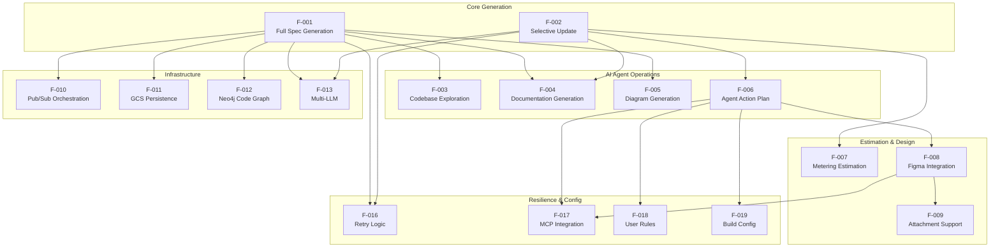

### 2.3.2 Integration Points

The system exposes and consumes the following integration points, as documented in `/app/.github/workflows/deploy-job.yml` and `/app/main.py`:

| Integration Point | Protocol | Direction |
|-------------------|----------|-----------|
| `generate-reverse-document` Pub/Sub topic | Pub/Sub | Inbound — triggers job execution |
| `platform-events` Pub/Sub topic | Pub/Sub | Outbound — status and completion notifications |
| Google Cloud Storage | GCS API | Bidirectional — read/write specifications |
| Neo4j Code Graph | Bolt | Bidirectional — build and query code graphs |
| GitHub Server | HTTP | Outbound — repository download and access |
| Admin Server | HTTP | Outbound — attachments, rules, build info |
| Relay Server | HTTP | Outbound — inter-service messaging |
| Markdown Server | HTTP | Outbound — markdown processing |
| Anthropic API | HTTPS | Outbound — Claude Opus 4 LLM calls |
| OpenAI API | HTTPS | Outbound — GPT-5-4-mini calls |
| Voyage AI API | HTTPS | Outbound — embedding generation |
| LangSmith API | HTTPS | Outbound — trace and monitoring data |
| Figma API (via MCP) | HTTPS | Outbound — design data (conditional) |

### 2.3.3 Shared Components

The following shared components from the `blitzy-platform-shared==0.0.733` library (`/app/requirements.txt`) are consumed across multiple features:

| Shared Component | Consuming Features | Purpose |
|------------------|--------------------|---------|
| `CodeGraphBuilder` / Neo4j tools | F-003, F-012 | Repository structure graph |
| LLM instances (`llm_claude_opus_4_6_thinking_max`, `llm_gpt5_4_mini`) | F-001 through F-007 | AI model access |
| `AdminStorageService` | F-001, F-002, F-011 | GCS document operations |
| Repository inspection tools (`read_file`, `search_files`, etc.) | F-003, F-006, F-007 | Codebase analysis |
| Document utilities (`clean_document`, `parse_sections_at_heading_level`) | F-001, F-002, F-004 | Content processing |
| Prompt templates (`TECHNICAL_SECTION_PROMPTS`, metering prompts) | F-001, F-004, F-007 | Agent instruction sets |
| `MCPManager` (Chrome DevTools, Figma) | F-006, F-008, F-017 | Tool-augmented LLM capabilities |
| `archie_exponential_retry` decorator | F-001 through F-007, F-016 | Fault-tolerant execution |

---

## 2.4 IMPLEMENTATION CONSIDERATIONS

### 2.4.1 Technical Constraints

The following technical constraints are derived from the deployment configuration in `/app/Dockerfile`, `/app/.github/workflows/deploy-job.yml`, and the runtime architecture in `/app/main.py`:

| Constraint | Detail | Evidence |
|------------|--------|----------|
| **Stateless Execution** | All context arrives via Pub/Sub trigger; no persistent state between jobs | `main.py` environment variable parsing (lines 51–67) |
| **Single Dependency** | Entire shared library bundled as `blitzy-platform-shared==0.0.733` | `requirements.txt` (2 lines) |
| **Container Runtime** | Ubuntu 24.04 with Python 3.12, Node.js 20, Chrome | `Dockerfile` (127 lines) |
| **LangGraph Recursion** | Maximum 500 graph steps per execution | `main.py` line 300 |
| **Token Budget** | `CONTEXT_350K` limit for LLM context windows | `process_messages_with_tool_calls` usage |
| **Single Repository** | One repository per job execution | State fields: single `repo_id`, `branch_id` |

### 2.4.2 Performance Requirements

| Requirement | Specification | Feature |
|-------------|--------------|---------|
| **Streaming Persistence** | GCS upload after each section; no batch-only persistence | F-011 |
| **Incremental Progress** | Per-section progress notifications enable monitoring | F-010 |
| **Token Management** | Context window usage stays within CONTEXT_350K | F-003 |
| **Recursion Budget** | 500-step limit prevents infinite loops | F-001, F-002 |

### 2.4.3 Scalability Considerations

| Consideration | Detail | Evidence |
|---------------|--------|----------|
| **Horizontal Scaling** | Cloud Run Jobs scale via concurrent job executions, each processing a single repository | `deploy-job.yml` configuration |
| **LLM Rate Limits** | Exponential retry absorbs API throttling from Anthropic and OpenAI | F-016 decorator application |
| **CI/CD Concurrency** | `qa-deployments` concurrency group prevents overlapping deployments | `deploy-job.yml` concurrency config |
| **Independent Jobs** | Stateless design enables parallel execution across repositories | No shared state between executions |

### 2.4.4 Security Implications

| Consideration | Detail | Evidence |
|---------------|--------|----------|
| **API Key Management** | LLM API keys (`ANTHROPIC_API_KEY`, `OPENAI_API_KEY`, `VOYAGE_API_KEY`) sourced from environment | `main.py` lines 59–61 |
| **Repository Access** | GitHub credentials managed via `GITHUB_SECRET_SERVER` | `main.py` line 57 |
| **Ignore Patterns** | `.blitzyignore` enforcement prevents sensitive file exposure | Search rule S0 |
| **VPC Networking** | Cloud Run Job operates within configured VPC egress, network, and subnet | `deploy-job.yml` lines 71–77 |
| **GCP Authentication** | Workload Identity Federation for GCP service authentication | `deploy-job.yml` GCP auth step |

### 2.4.5 Maintenance Requirements

| Requirement | Detail | Evidence |
|-------------|--------|----------|
| **Code Quality** | Pre-commit hooks enforce Black formatting, isort ordering, YAML validation | `.pre-commit-config.yaml` |
| **Code Ownership** | `@siddhantpp` owns the entire repository | `CODEOWNERS` |
| **Observability** | LangSmith traces enable debugging and performance monitoring | F-014, `find_trace_runs.py` |
| **Dependency Management** | Single shared library dependency simplifies version management | `requirements.txt` |
| **Multi-Environment** | Development, staging, and production environments for progressive rollout | `README.md`, `Makefile` |

---

## 2.5 TRACEABILITY MATRIX

### 2.5.1 Feature-to-Requirement Mapping

The following matrix maps each feature to its functional requirements, the LangGraph workflow nodes that implement them, and the primary source files.

| Feature | Requirements | Workflow Node(s) | Source Files |
|---------|-------------|------------------|--------------|
| F-001 | F-001-RQ-001 through RQ-005 | `setup`, `gather_context`, `document_section` | `helper.py`, `main.py` |
| F-002 | F-002-RQ-001 through RQ-005 | `identify_changes`, `update_section`, `copy_old_tech_spec_section` | `helper.py`, `models.py` |
| F-003 | F-003-RQ-001 through RQ-004 | `gather_context` | `helper.py`, `prompts.py` |
| F-004 | F-004-RQ-001 through RQ-004 | `document_section` | `helper.py`, `prompts.py` |
| F-005 | F-005-RQ-001 through RQ-003 | `document_section` (embedded) | `helper.py`, `prompts.py` |
| F-006 | F-006-RQ-001 through RQ-003 | `create_agent_action_plan` | `helper.py`, `prompts.py` |
| F-007 | F-007-RQ-001 through RQ-003 | `estimate_metering` | `helper.py`, `state.py` |
| F-010 | F-010-RQ-001 through RQ-004 | Entry/exit in `main.py` | `main.py`, `done.test.py` |
| F-011 | F-011-RQ-001 through RQ-003 | Inline in `main.py` | `main.py` |
| F-016 | F-016-RQ-001 through RQ-003 | All decorated nodes | `helper.py` |

### 2.5.2 Requirement-to-Acceptance-Criteria Summary

| Req ID | Testable Acceptance Criteria |
|--------|------------------------------|
| F-001-RQ-001 | `setup_router` returns `"generate"` for GENERATE mode payload |
| F-001-RQ-002 | `document_router` terminates at `section_index >= total_sections` |
| F-001-RQ-003 | GCS blob contains all sections after completion |
| F-001-RQ-005 | Pub/Sub `DONE` message matches schema in `done.test.py` |
| F-002-RQ-002 | `DocumentSections` structured output validates all sections |
| F-002-RQ-005 | Fuzzy heading match connects old and new sections |
| F-003-RQ-001 | Agent reaches minimum 3-level depth per rule S3 |
| F-003-RQ-003 | Token usage stays within `CONTEXT_350K` |
| F-004-RQ-003 | Content passes delimiter pairing and non-empty checks |
| F-005-RQ-002 | Mermaid diagrams follow subgraph closure and ID uniqueness rules |
| F-010-RQ-004 | `DONE` notification includes all required metadata fields |
| F-011-RQ-001 | GCS updated after every section (streaming) |
| F-016-RQ-001 | Decorated nodes retry on `RETRYABLE_EXCEPTIONS` |

### 2.5.3 Feature-to-External-Service Mapping

| Feature | Anthropic API | OpenAI API | Voyage AI | GCS | Pub/Sub | Neo4j |
|---------|:---:|:---:|:---:|:---:|:---:|:---:|
| F-001 | ✓ | — | — | ✓ | ✓ | ✓ |
| F-002 | ✓ | ✓ | — | ✓ | ✓ | — |
| F-003 | ✓ | — | ✓ | — | — | — |
| F-004 | ✓ | — | — | — | — | — |
| F-005 | ✓ | — | — | — | — | — |
| F-006 | ✓ | — | — | — | — | — |
| F-007 | ✓ | — | — | — | — | — |
| F-010 | — | — | — | — | ✓ | — |
| F-011 | — | — | — | ✓ | — | — |
| F-012 | — | — | — | — | — | ✓ |
| F-013 | ✓ | ✓ | — | — | — | — |

---

#### References

- `/app/main.py` — Core entry point; LLM initialization, LangGraph workflow configuration, Pub/Sub integration, GCS persistence, and completion notifications (424 lines)
- `/app/lib/reverse_document/helper.py` — Primary workflow engine; defines all LangGraph nodes, tool definitions, MCP configuration, routing logic, and retry decorators (1,316 lines)
- `/app/lib/reverse_document/prompts.py` — Complete prompt engineering system; search agent rules (S0–S7), tool rules (T1–T5), author output rules (SO1–SO4), update prompts, and planning prompts (1,097 lines)
- `/app/lib/reverse_document/state.py` — `ReverseDocumentState` TypedDict definition with 32 workflow state fields (78 lines)
- `/app/lib/reverse_document/models.py` — Pydantic data models for structured LLM outputs: `DocumentSectionStatus`, `DocumentSection`, `DocumentSections` (33 lines)
- `/app/lib/reverse_document/doc.py` — Sample Technical Specification output demonstrating full system capabilities (9,637 lines)
- `/app/requirements.txt` — Single dependency declaration (`blitzy-platform-shared==0.0.733`)
- `/app/Dockerfile` — Container configuration (Ubuntu 24.04, Python 3.12, Node.js 20, Chrome, GPT-2 tokenizer)
- `/app/.github/workflows/deploy-job.yml` — CI/CD pipeline; Cloud Run deployment, environment variables, platform service URLs, VPC configuration (118 lines)
- `/app/done.test.py` — Pub/Sub DONE notification structure validation test (32 lines)
- `/app/find_trace_runs.py` — LangSmith trace correlation utility revealing four-service pipeline architecture
- `/app/README.md` — Repository identity and three-environment deployment overview
- `/app/CODEOWNERS` — Code ownership declaration (`@siddhantpp`)
- `/app/.pre-commit-config.yaml` — Code quality tooling configuration (Black, isort, pre-commit hooks)
- `/app/Makefile` — Build and deployment targets for Docker image management

# 3. Technology Stack

## 3.1 PROGRAMMING LANGUAGES

### 3.1.1 Primary Application Language: Python 3.12.3

Python serves as the exclusive application-level programming language for the Reverse Document Generator. The runtime version, confirmed at Python 3.12.3, is installed from the `python3.12` package within the Docker container built on Ubuntu 24.04 (as defined in `/app/Dockerfile` line 43). Python was selected for this system based on the following criteria:

| Selection Criterion | Justification |
|---------------------|---------------|
| **LangChain Ecosystem Compatibility** | The LangGraph and LangChain frameworks that underpin the multi-agent architecture are Python-first libraries, with the most comprehensive API coverage and earliest feature availability in Python |
| **AI/ML Tooling** | The Anthropic, OpenAI, and Voyage AI SDKs provide mature, production-grade Python clients with full async support |
| **Async/Await Support** | Python 3.12's native `asyncio` module supports the system's asynchronous execution model, as evidenced by `asyncio.run()` in `/app/main.py` (line 409) and `async def generate_reverse_document()` (line 104) |
| **Type Safety** | Extensive use of Python's `typing` module (`TypedDict`, `Dict`, `List`, `Optional`, `Literal`, `Any`) provides compile-time type checking and IDE support across all modules, particularly in the 32-field `ReverseDocumentState` in `/app/lib/reverse_document/state.py` |
| **Pydantic Integration** | Python 3.12's native dataclass improvements complement Pydantic v2's Rust-based core for high-performance data validation, critical for structured LLM output parsing |

**Constraints and Dependencies:**
- Python 3.12.3 is pinned via the Docker base image to ensure deterministic builds across environments
- The `blitzy-platform-shared` library requires Python 3.12+ for compatibility with its transitive dependencies
- Type annotations are used extensively but not enforced via a static type checker in CI (no mypy configuration detected)

### 3.1.2 Supporting Runtime: Node.js 20.20.2

Node.js is installed as a secondary runtime environment exclusively to support the Chrome DevTools MCP (Model Context Protocol) server, which enables browser automation capabilities for AI agents. The Node.js 20.x LTS line is installed via the NodeSource setup script (`setup_20.x` in `/app/Dockerfile` line 54), with npm explicitly upgraded to version 11.1.0 (`/app/Dockerfile` line 61).

| Attribute | Value | Evidence |
|-----------|-------|----------|
| **Node.js Version** | v20.20.2 | Runtime verification via `node --version` |
| **npm Version** | 11.1.0 | Explicit installation in `/app/Dockerfile` line 61 |
| **Purpose** | Chrome DevTools MCP server | MCP integration in `/app/lib/reverse_document/helper.py` lines 84–88 |
| **Scope** | Supporting runtime only — no application logic written in JavaScript | No `.js` or `.ts` files in the application source tree |

Three npm dependency patches are applied during the Docker build to address security and compatibility concerns:
- `glob@10.5.0` (patched at `/app/Dockerfile` line 63)
- `brace-expansion@2.0.2` (patched at `/app/Dockerfile` line 69)
- `diff@8.0.3` (patched at `/app/Dockerfile` line 76)

### 3.1.3 Shell Scripting: Bash

Bash is used as the scripting and automation layer across the build, deployment, and runtime lifecycle:

| Usage Context | Implementation | Evidence |
|---------------|----------------|----------|
| **Build Automation** | Makefile targets invoke shell commands for Docker builds and deployments | `/app/Makefile` |
| **CI/CD Pipeline** | GitHub Actions workflow commands execute via Bash on `ubuntu-latest` runners | `/app/.github/workflows/deploy-job.yml` |
| **Runtime Tool Execution** | AI agents execute arbitrary Bash commands within the container for ad-hoc codebase inspection | `ANTHROPIC_BASH_TOOL_DEFINITION` in `/app/lib/reverse_document/helper.py` line 17 |
| **Persistent Sessions** | A persistent Bash session is initialized during the `setup` node, enabling stateful command execution across agent interactions | `/app/lib/reverse_document/helper.py` (setup node) |

---

## 3.2 FRAMEWORKS & LIBRARIES

### 3.2.1 Core Workflow Framework: LangGraph 1.1.6

LangGraph is the foundational framework driving the system's multi-agent, state-graph-driven architecture. It provides the `StateGraph` abstraction used to define, compile, and execute the entire document generation workflow. LangGraph 1.1.6 is an MIT-licensed open-source framework described as being for "Building stateful, multi-actor applications with LLMs."

| Attribute | Detail | Evidence |
|-----------|--------|----------|
| **Version** | 1.1.6 | `pip list` output; confirmed latest stable release |
| **Import** | `from langgraph.graph import StateGraph` | `/app/main.py` line 7 |
| **Graph Import** | `from langgraph.graph import END, START, StateGraph` | `/app/lib/reverse_document/helper.py` line 12 |
| **Execution Model** | Async streaming via `app.astream()` | `/app/main.py` line 298 |
| **Recursion Limit** | 500 steps per execution | `/app/main.py` line 300 |
| **License** | MIT | Open-source |

**Supporting LangGraph Packages:**

| Package | Version | Role |
|---------|---------|------|
| langgraph-checkpoint | 4.0.1 | State checkpointing infrastructure |
| langgraph-prebuilt | 1.0.9 | Pre-built agent patterns and utilities |
| langgraph-sdk | 0.3.13 | SDK client for LangGraph services |

**Selection Rationale:** LangGraph was chosen over alternative orchestration frameworks (e.g., CrewAI, AutoGen) because it provides low-level control over agent state transitions, native streaming support, and explicit graph-based workflow definitions. As documented in Section 1.2.2, the system requires fine-grained control over the GENERATE and UPDATE mode workflows with conditional routing (e.g., `setup_router`, `document_router`, `update_router`), which LangGraph's `StateGraph` paradigm directly supports through conditional edge definitions.

### 3.2.2 LangChain Ecosystem

The LangChain ecosystem provides the abstraction layer between the application logic and the underlying AI service providers. Ten LangChain integration packages are installed, each serving a specific provider or capability:

| Package | Version | Purpose | Primary Evidence |
|---------|---------|---------|-----------------|
| **langchain-core** | 1.2.27 | Base abstractions: `BaseChatModel`, `BaseMessage`, `BaseTool`, `HumanMessage`, `AIMessage`, `SystemMessage` | `/app/lib/reverse_document/helper.py` lines 3–11 |
| **langchain-anthropic** | 1.4.0 | Anthropic Claude integration for search, author, diagram, action plan, and metering agents | `/app/main.py` line 16 |
| **langchain-openai** | 1.1.12 | OpenAI GPT integration for the Architect LLM (structured classification) | `/app/main.py` line 17 |
| **langchain-voyageai** | 0.3.3 | Voyage AI embeddings for semantic code search within the code graph | `/app/.github/workflows/deploy-job.yml` line 88 |
| **langchain-neo4j** | 0.9.0 | Neo4j graph database tools for code graph building and querying | `/app/main.py` lines 9–14 |
| **langchain-mcp-adapters** | 0.2.2 | Model Context Protocol tool integration (Chrome DevTools, Figma) | `/app/lib/reverse_document/helper.py` line 84 |
| **langchain-google-genai** | 4.2.1 | Google Gemini AI integration (supplementary LLM) | `pip list` |
| **langchain-aws** | 1.4.3 | AWS service integration support | `pip list` |
| **langchain-text-splitters** | 1.1.1 | Text splitting utilities for document chunking | `pip list` |
| **langchain-classic** | 1.0.3 | Legacy LangChain compatibility layer | `pip list` |

**Compatibility Requirement:** All LangChain packages must share the same `langchain-core` version to avoid runtime conflicts. The current installation pins `langchain-core==1.2.27` as the unified base.

### 3.2.3 Data Validation and Modeling: Pydantic 2.12.5

Pydantic provides the data validation and structured output parsing layer, critical for converting LLM responses into typed Python objects.

| Package | Version | Purpose |
|---------|---------|---------|
| **pydantic** | 2.12.5 | Core data modeling and validation framework |
| **pydantic_core** | 2.41.5 | Rust-based validation engine (high-performance core) |
| **pydantic-settings** | 2.13.1 | Settings management from environment variables |

**Application Models** (defined in `/app/lib/reverse_document/models.py`):
- `DocumentSectionStatus` — An enumeration with values `CHANGED` and `UNCHANGED`, used by the Architect LLM during UPDATE mode classification
- `DocumentSection` — A Pydantic `BaseModel` containing `heading`, `status`, and `changes` fields for per-section change tracking
- `DocumentSections` — A container model holding a list of `DocumentSection` instances, serving as the structured output schema for GPT-5-4-mini

**Selection Rationale:** Pydantic v2 was chosen for its Rust-powered validation core (`pydantic_core`), which provides significant performance improvements over v1. The structured output capability integrates natively with LangChain's `with_structured_output()` method, enabling type-safe LLM responses critical for the Architect LLM's section classification workflow.

### 3.2.4 AI/ML Tokenization and Model Support

Token management is essential for staying within LLM context window limits (the system enforces a `CONTEXT_350K` token budget). The following tokenization libraries support this capability:

| Package | Version | Purpose | Evidence |
|---------|---------|---------|----------|
| **transformers** | 5.5.0 | GPT-2 tokenizer (pre-downloaded during Docker build for offline use) | `/app/Dockerfile` line 124 |
| **tiktoken** | 0.12.0 | OpenAI-compatible token counting for context window management | `pip list` |
| **tokenizers** | 0.22.2 | HuggingFace fast tokenizer backend | `pip list` |
| **huggingface_hub** | 1.9.2 | HuggingFace model hub client for tokenizer downloads | `pip list` |
| **safetensors** | 0.7.0 | Safe model serialization format support | `pip list` |

The GPT-2 tokenizer is pre-downloaded during the Docker build process (`/app/Dockerfile` line 124) to eliminate runtime network dependencies for token counting, ensuring consistent and fast tokenization during agent execution.

### 3.2.5 HTTP, Networking, and Protocol Libraries

The system communicates with multiple external APIs and platform services via HTTP, gRPC, and WebSocket protocols:

| Package | Version | Protocol | Usage |
|---------|---------|----------|-------|
| **httpx** | 0.28.1 | HTTP/1.1, HTTP/2 | Primary async HTTP client for API calls |
| **aiohttp** | 3.13.5 | HTTP/1.1 | Async HTTP for concurrent API requests |
| **requests** | 2.33.1 | HTTP/1.1 | Synchronous HTTP for configuration and setup operations |
| **grpcio** | 1.80.0 | gRPC | Google Cloud service communication (Pub/Sub, GCS) |
| **websockets** | 16.0 | WebSocket | Chrome DevTools Protocol (CDP) communication |

### 3.2.6 Utility and Infrastructure Libraries

| Package | Version | Purpose | Evidence |
|---------|---------|---------|----------|
| **structlog** | 25.5.0 | Structured logging with context propagation | `pip list` |
| **tenacity** | 9.1.4 | Retry logic engine underlying `@archie_exponential_retry()` | `pip list`; decorator usage in `helper.py` |
| **python-dotenv** | 1.2.2 | Environment variable loading from `.env` files | `pip list` |
| **PyYAML** | 6.0.3 | YAML configuration file parsing | `pip list` |
| **orjson** | 3.11.8 | High-performance JSON serialization (Rust-based) | `pip list` |
| **click** | 8.3.2 | CLI framework for command-line tools | `pip list` |
| **typer** | 0.24.1 | Modern CLI utilities built on Click | `pip list` |
| **pillow** | 12.2.0 | Image processing for attachment encoding | `pip list` |
| **jsonschema** | 4.26.0 | JSON schema validation for message payloads | `pip list` |
| **thefuzz** | 0.22.1 | Fuzzy string matching for section heading alignment in UPDATE mode | `/app/lib/reverse_document/helper.py` line 14 |

### 3.2.7 Model Context Protocol (MCP): mcp 1.27.0

The MCP framework provides tool-augmented LLM capabilities through standardized server connections:

| Component | Implementation | Activation |
|-----------|----------------|------------|
| **MCPManager** | `blitzy_platform_shared.mcp.manager` | Always initialized |
| **Chrome DevTools MCP** | `CHROME_DEVTOOLS_MCP` constant | Always-on (base MCP server) |
| **Figma MCP** | `get_figma_mcp(api_key=figma_api_key)` | Conditional — when `is_figma_available` is `True` |

MCP integration is managed through `langchain-mcp-adapters==0.2.2`, which bridges the MCP protocol to LangChain's tool abstraction, enabling AI agents to use Chrome DevTools and Figma as native tools during codebase exploration and documentation generation.

---

## 3.3 OPEN SOURCE DEPENDENCIES

### 3.3.1 Primary Dependency Declaration

The system employs a minimal dependency declaration strategy. The `/app/requirements.txt` file contains only two lines:

| Line | Content | Purpose |
|------|---------|---------|
| 1 | `--extra-index-url https://us-east1-python.pkg.dev/blitzy-platform-stage/python-us-east1/simple/` | Private GCP Artifact Registry endpoint |
| 2 | `blitzy-platform-shared==0.0.733` | Single platform shared library |

This single explicitly declared dependency (`blitzy-platform-shared==0.0.733`) is hosted on Google Cloud Artifact Registry (us-east1 region) and authenticated via `keyrings.google-artifactregistry-auth==1.1.2`. The shared library transitively installs the complete set of 177 packages that constitute the full runtime environment.

**Design Rationale:** The single-dependency strategy simplifies version management and ensures consistency across the Blitzy Platform ecosystem. All services share the same pinned versions of LangChain, Pydantic, and other core libraries through the shared package.

### 3.3.2 Blitzy Platform Packages

Three internal Blitzy packages are installed (the first directly, the latter two as transitive dependencies):

| Package | Version | Scope | Evidence |
|---------|---------|-------|----------|
| **blitzy-platform-shared** | 0.0.733 | Direct dependency — provides LLM instances, tools, services, prompts, MCP, and utility functions | `/app/requirements.txt` line 2 |
| **blitzy-utils** | 0.0.553 | Transitive — core utility functions consumed throughout the application | `/app/main.py` lines 33–42 |
| **blitzy-client-utils** | 0.0.21 | Transitive — client-side utility functions | `/app/main.py` line 33 |

### 3.3.3 Key Transitive Dependencies

The following table catalogs the most significant third-party packages installed transitively through `blitzy-platform-shared`:

| Package | Version | Role | License Consideration |
|---------|---------|------|----------------------|
| **anthropic** | 0.91.0 | Anthropic Claude API client SDK | MIT |
| **openai** | 2.30.0 | OpenAI API client SDK | MIT |
| **voyageai** | 0.3.7 | Voyage AI embedding API client | — |
| **neo4j** | 6.1.0 | Neo4j database driver (Bolt protocol) | Apache 2.0 |
| **neo4j-graphrag** | 1.14.1 | Neo4j GraphRAG extensions for retrieval-augmented generation | — |
| **langsmith** | 0.7.26 | LangSmith monitoring and tracing client | MIT |
| **PyGithub** | 2.9.0 | GitHub REST API client for repository operations | LGPL-3.0 |
| **google-cloud-storage** | 3.10.1 | Google Cloud Storage client library | Apache 2.0 |
| **google-cloud-pubsub** | 2.36.0 | Google Cloud Pub/Sub client library | Apache 2.0 |
| **google-auth** | 2.49.1 | Google authentication library | Apache 2.0 |
| **google-api-core** | 2.30.2 | Google API foundation library | Apache 2.0 |
| **boto3** | 1.42.85 | AWS SDK for Python (supports `langchain-aws`) | Apache 2.0 |
| **protobuf** | 6.33.6 | Protocol Buffers serialization | BSD |
| **certifi** | 2026.2.25 | Mozilla's CA certificate bundle for SSL | MPL 2.0 |

### 3.3.4 Dependency Architecture

The following diagram illustrates the dependency hierarchy from the single declared dependency through the major functional groups:

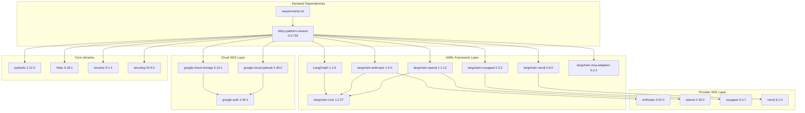

---

## 3.4 THIRD-PARTY SERVICES

### 3.4.1 AI and LLM Services

The Reverse Document Generator employs a multi-LLM strategy, delegating specific agent roles to purpose-selected models. As configured in `/app/main.py` lines 15–18 and 234–238, four distinct AI services are integrated:

| Service | Model / Configuration | Agent Roles | API Key Variable | Evidence |
|---------|----------------------|-------------|------------------|----------|
| **Anthropic API** | Claude Opus 4 (thinking-max, level 6) | Search Agent, Author Agent, Diagram Agent, Action Plan Agent, Metering Estimator | `ANTHROPIC_API_KEY` | `/app/main.py` line 16: `llm_claude_opus_4_6_thinking_max` |
| **OpenAI API** | GPT-5-4-mini | Architect LLM (structured section classification) | `OPENAI_API_KEY` | `/app/main.py` line 17: `llm_gpt5_4_mini` |
| **Voyage AI API** | Embedding model | Semantic search for code graph queries | `VOYAGE_API_KEY` | `/app/.github/workflows/deploy-job.yml` line 88 |
| **Google API** | Gemini (conditional) | Supplementary LLM integration | `GOOGLE_API_KEY` | `/app/.github/workflows/deploy-job.yml` line 87 |

**Model Selection Rationale:**

| Agent | Model Choice | Rationale |
|-------|-------------|-----------|
| Search / Author / Diagram | Claude Opus 4 (thinking-max) | Deep reasoning capabilities for systematic codebase exploration, high-quality technical writing, and spatial reasoning for diagram generation |
| Architect LLM | GPT-5-4-mini | Fast structured output generation optimized for classification tasks; cost-efficient for the binary CHANGED/UNCHANGED decision per section |
| Action Plan / Metering | Claude Opus 4 (thinking-level-6) | Extended thinking mode enables comprehensive change analysis and accurate effort estimation |

All API keys are managed through environment variables configured in the Cloud Run Job deployment manifest (`/app/.github/workflows/deploy-job.yml` lines 85–88) and are never committed to source control.

### 3.4.2 Monitoring and Observability Services

| Service | Purpose | Configuration | Evidence |
|---------|---------|---------------|----------|
| **LangSmith** (self-hosted) | Distributed tracing, run monitoring, pipeline correlation across four services | Self-hosted at IP `34.59.110.138`; configured via `LANGSMITH_TRACING`, `LANGSMITH_ENDPOINT`, `LANGSMITH_API_KEY`, `LANGSMITH_PROJECT` | `/app/main.py` lines 63–66; `/app/find_trace_runs.py` |
| **Slack** | Build and deployment notifications | Integrated via `slackapi/slack-github-action@v1.24.0` in CI/CD pipeline | `/app/.github/workflows/deploy-job.yml` |

LangSmith traces are organized across four project namespaces — `reverse-document-generator`, `reverse-code-generator`, `reverse-file-mapper`, and `reverse-thinking-generator` — enabling end-to-end pipeline correlation as defined in `/app/find_trace_runs.py` lines 24–28.

### 3.4.3 Blitzy Platform Services

The system integrates with five internal platform services, all accessed via HTTP APIs with URLs configured through environment variables:

| Platform Service | Environment Variable | Purpose | Direction |
|-----------------|---------------------|---------|-----------|
| **GitHub Server** | `SERVICE_URL_GITHUB` | Repository download and source code access operations | Outbound |
| **Admin Server** | `SERVICE_URL_ADMIN` | Project attachments, rules, build info, and storage operations | Outbound |
| **Relay Server** | `SERVICE_URL_RELAY` | Inter-service messaging and communication relay | Outbound |
| **Markdown Server** | `MARKDOWN_SERVER` | Markdown processing and rendering services | Outbound |
| **GitHub Secret Server** | `GITHUB_SECRET_SERVER` | Secure credential management for repository access tokens | Outbound |

These service URLs are injected at deployment time through the Cloud Run Job environment configuration in `/app/.github/workflows/deploy-job.yml` lines 93–96.

### 3.4.4 Design Integration Services

| Service | Protocol | Activation Condition | Evidence |
|---------|----------|---------------------|----------|
| **Figma API** (via MCP) | HTTPS | Conditional — when `is_figma_available` evaluates to `True` based on `figma_info["is_available"]` and attachment existence | `/app/lib/reverse_document/helper.py` lines 250–258 |
| **Chrome DevTools** (via MCP) | WebSocket / Chrome DevTools Protocol (CDP) | Always-on — configured as the base MCP server for all runs | `/app/lib/reverse_document/helper.py` line 249 |

Chrome DevTools integration requires Google Chrome Stable (verified at version 147.0.7727.55), which is pre-installed in the Docker container to support browser automation through the MCP server.

---

## 3.5 DATABASES & STORAGE

### 3.5.1 Neo4j Graph Database

Neo4j serves as the code graph database, storing structured representations of repository file hierarchies and code relationships that bootstrap the search agent's exploration:

| Attribute | Configuration | Evidence |
|-----------|---------------|----------|
| **Driver** | neo4j Python driver 6.1.0 | `pip list`; `/app/main.py` lines 9–14 |
| **Protocol** | Bolt (binary protocol) | Neo4j driver default |
| **Extension** | neo4j-graphrag 1.14.1 | RAG-enhanced graph queries |
| **Authentication** | Per-company credential isolation | `get_company_neo4j_instance_credentials(company_id)` in `/app/main.py` lines 381–401 |
| **Instance Model** | Multi-tenant — separate instances per company | Credentials dynamically retrieved by `company_id` |

**Builder Configuration:** The `CodeGraphBuilder` is initialized with eight parameters — `uri`, `username`, `password`, `db_name`, `company_id`, `repo_id`, `branch_id`, and `head_commit_hash` — ensuring full repository-version-level isolation within the graph database.

**Usage Pattern:** The code graph provides the initial root-level folder structure to the search agent via `get_folder_contents()`, enabling the agent to begin systematic exploration from a pre-built structural overview rather than raw filesystem traversal.

### 3.5.2 Google Cloud Storage (GCS)

Google Cloud Storage provides the durable persistence layer for all generated and retrieved Technical Specification documents:

| Attribute | Configuration | Evidence |
|-----------|---------------|----------|
| **Client Library** | google-cloud-storage 3.10.1 | `pip list` |
| **Access Pattern** | `AdminStorageService` from shared library | `/app/main.py` lines 6, 69, 158–163 |
| **Storage Path** | `{project_id}/{task_id}/{tech_spec_id}` | `/app/main.py` lines 303–309 |
| **Metadata** | `head_commit_hash`, `document_mode` per upload | `/app/main.py` storage metadata configuration |
| **Persistence Model** | Streaming — upload after each section generation | `/app/main.py` lines 303–309 |

**Bidirectional Operations:**
- **Write:** Generated specifications are uploaded after each section completes, providing incremental durability and enabling partial recovery from mid-generation failures
- **Read:** Existing specifications are downloaded from GCS for UPDATE mode processing (`/app/main.py` lines 193–196); document prompts and input prompts are also retrieved from GCS

### 3.5.3 Google Cloud Pub/Sub (Messaging)

Google Cloud Pub/Sub provides the asynchronous event-driven messaging layer that triggers job execution and propagates status notifications:

| Topic | Direction | Message Purpose | Evidence |
|-------|-----------|-----------------|----------|
| **`generate-reverse-document`** | Inbound | Job trigger with repository metadata payload (`branch_id`, `repo_id`, `company_id`, `user_id`, `tech_spec_id`, `mode`) | `/app/main.py` lines 139–156 |
| **`platform-events`** | Outbound | Status notifications: `IN_PROGRESS`, per-section progress, `DONE`, `ERROR` | `/app/main.py` lines 311–363 |

| Attribute | Configuration |
|-----------|---------------|
| **Client Library** | google-cloud-pubsub 2.36.0 |
| **Notification Payload** | `projectId`, `jobId`, `tech_spec_id`, `phase`, `status`, `user_id`, `team_id`, `company_id`, `metadata` |
| **Downstream Consumers** | `reverse-code-generator`, `reverse-file-mapper`, `reverse-thinking-generator` |

---

## 3.6 CLOUD INFRASTRUCTURE

### 3.6.1 Google Cloud Platform Services

The entire system runs on Google Cloud Platform (GCP). The following table maps each GCP service to its role within the architecture, as defined in `/app/.github/workflows/deploy-job.yml` and `/app/Dockerfile`:

| GCP Service | Usage | Configuration |
|-------------|-------|---------------|
| **Cloud Run Jobs** | Primary compute — event-driven, stateless batch execution of document generation jobs | Deployed via `gcloud run jobs deploy` with CPU, memory, and timeout parameters |
| **Cloud Pub/Sub** | Asynchronous messaging — inbound job triggers and outbound status notifications | Topics: `generate-reverse-document` (in), `platform-events` (out) |
| **Cloud Storage (GCS)** | Durable document persistence — specification read/write operations | Accessed via `AdminStorageService` |
| **Artifact Registry (Docker)** | Container image registry — stores built Docker images | Region: `us-east1-docker.pkg.dev` |
| **Artifact Registry (Python)** | Private Python package registry — hosts `blitzy-platform-shared` | Region: `us-east1-python.pkg.dev` |
| **VPC Networking** | Network isolation — egress, network, and subnet configuration for Cloud Run Jobs | Configured per environment in deployment manifest |
| **Workload Identity Federation** | Authentication — keyless GCP authentication from GitHub Actions CI/CD | `google-github-actions/auth@v1` |
| **IAM Service Accounts** | Authorization — per-environment service accounts for resource access | Configured in deployment manifest |

### 3.6.2 Deployment Environments

Three deployment environments support the progressive rollout strategy:

| Environment | GCP Project | Deployment Trigger | Evidence |
|-------------|-------------|-------------------|----------|
| **Development** | `blitzy-os-dev` | Manual builds | `/app/README.md`; `/app/Makefile` |
| **Staging** | `blitzy-platform-stage` | Automated — push to `qa` branch | `/app/.github/workflows/deploy-job.yml` |
| **Production** | Production GCP project | Promotion from staging | `/app/README.md` |

### 3.6.3 Network and Security Architecture

The Cloud Run Jobs operate within a configured VPC with the following security controls:

| Security Layer | Implementation | Evidence |
|----------------|----------------|----------|
| **VPC Egress** | Cloud Run Job egress routed through VPC | `/app/.github/workflows/deploy-job.yml` lines 71–77 |
| **Network Isolation** | Dedicated VPC network and subnet per environment | Deployment manifest network configuration |
| **Identity Federation** | Keyless authentication from GitHub Actions to GCP via Workload Identity Federation | `google-github-actions/auth@v1` |
| **Service Accounts** | Per-environment IAM service accounts with least-privilege access | Deployment manifest IAM configuration |
| **API Key Isolation** | All LLM API keys (`ANTHROPIC_API_KEY`, `OPENAI_API_KEY`, `VOYAGE_API_KEY`, `GOOGLE_API_KEY`) sourced from environment, never in source | `/app/.github/workflows/deploy-job.yml` lines 85–88 |
| **Repository Credentials** | GitHub access tokens managed via `GITHUB_SECRET_SERVER` | `/app/main.py` line 57 |
| **Neo4j Credential Isolation** | Per-company credential retrieval via `get_company_neo4j_instance_credentials()` | `/app/main.py` lines 381–401 |
| **Sensitive File Exclusion** | `.blitzyignore` enforcement (rule S0) prevents exposure of sensitive files to LLM agents | Search rules in `/app/lib/reverse_document/prompts.py` |

---

## 3.7 DEVELOPMENT & DEPLOYMENT

### 3.7.1 Containerization: Docker

The application is containerized using Docker with BuildKit enabled (`DOCKER_BUILDKIT=1`), defined in a 127-line Dockerfile at `/app/Dockerfile`:

| Attribute | Configuration | Evidence |
|-----------|---------------|----------|
| **Base Image** | `ubuntu:24.04` (Ubuntu 24.04.4 LTS "Noble Numbat") | `/app/Dockerfile` line 1; `cat /etc/os-release` |
| **Build System** | Docker BuildKit with multi-stage secret handling | `DOCKER_BUILDKIT=1` in `/app/Makefile` |
| **Build Secrets** | `--mount=type=secret,id=google_credentials` for Artifact Registry authentication | `/app/Dockerfile` secret mount |
| **Image Registry** | `{region}-docker.pkg.dev/{project}/{repository}/{image}:{tag}` | `/app/Makefile` image path pattern |
| **Tagging Strategy** | SHA-based tags plus `latest` | `/app/.github/workflows/deploy-job.yml` |

**Container Contents:**

| Component | Version | Installation Method |
|-----------|---------|-------------------|
| Ubuntu OS | 24.04.4 LTS | Base image |
| Python | 3.12.3 | `apt-get install python3.12` |
| Node.js | 20.20.2 | NodeSource `setup_20.x` script |
| npm | 11.1.0 | Explicit `npm install -g npm@11.1.0` |
| pip | 25.3 | Explicit upgrade |
| Google Chrome Stable | 147.0.7727.55 | Google Chrome apt repository |
| GPT-2 Tokenizer | Pre-downloaded | HuggingFace `transformers` download at build time |

**Security Hardening Applied During Build:**

| Vulnerability | Remediation | Dockerfile Lines |
|---------------|-------------|-----------------|
| PAM module vulnerabilities | Explicit PAM package upgrades | Lines 13–18 |
| GnuTLS vulnerabilities | GnuTLS library updates | Lines 20–25 |
| Vulnerable `setuptools` | Removal and reinstallation of secured version | Lines 95–98 |
| Outdated `pip` | Upgrade to pip 25.3 | Line 91 |

### 3.7.2 CI/CD Pipeline: GitHub Actions

The CI/CD pipeline is defined in `/app/.github/workflows/deploy-job.yml` (118 lines) and automates the build-deploy cycle:

| Attribute | Configuration |
|-----------|---------------|
| **Trigger** | Push to `qa` branch |
| **Runner** | `ubuntu-latest` |
| **Concurrency** | Group: `qa-deployments` with `cancel-in-progress: true` |

**Pipeline Stages:**

```mermaid
flowchart LR
    subgraph BuildStage["Build Stage"]
        CO["Checkout<br/>actions/checkout@v4"]
        AUTH["GCP Auth<br/>google-github-actions/auth@v1"]
        SDK["Cloud SDK Setup<br/>setup-gcloud@v2"]
        DOCK["Docker Registry Auth<br/>gcloud auth configure-docker"]
        BUILD["Docker Build<br/>make build"]
    end

    subgraph DeployStage["Deploy Stage"]
        TAG["Image Tagging<br/>SHA + latest"]
        PUSH["Push to<br/>Artifact Registry"]
        DEPLOY["Cloud Run Job Deploy<br/>gcloud run jobs deploy"]
    end

    subgraph NotifyStage["Notification"]
        SLACK["Slack Notification<br/>slack-github-action@v1.24.0"]
    end

    CO --> AUTH
    AUTH --> SDK
    SDK --> DOCK
    DOCK --> BUILD
    BUILD --> TAG
    TAG --> PUSH
    PUSH --> DEPLOY
    DEPLOY --> SLACK
```

**Cloud Run Job Deployment Configuration:**
The `gcloud run jobs deploy` command configures the job with 22 environment variables (including all AI API keys, platform service URLs, and infrastructure settings), VPC networking parameters (egress, network, subnet), and resource limits (CPU, memory, timeout).

### 3.7.3 Build System: Makefile

The `/app/Makefile` provides the primary build automation layer with the following targets:

| Target | Purpose | Command |
|--------|---------|---------|
| `build` | Build Docker image with BuildKit and credentials | `DOCKER_BUILDKIT=1 docker build` with secret mount |
| `init` | Install Python dependencies via pip | `pip install -r requirements.txt` |
| `deploy` | Deploy to Cloud Run via `deploy-to-cloud-run` CLI tool | Cloud Run deployment command |
| `clean` | Remove local Docker images | Docker image cleanup |
| `install-deployment-utils` | Install deployment utilities | CLI tool installation |

### 3.7.4 Code Quality Tooling

Code quality is enforced through a pre-commit hook framework defined in `/app/.pre-commit-config.yaml`:

| Tool | Version | Purpose | Configuration |
|------|---------|---------|---------------|
| **pre-commit-hooks** | v4.5.0 | General hygiene: trailing whitespace removal, end-of-file fixing, YAML validation, large file checks, debug statement detection, requirements.txt formatting | Standard configuration |
| **Black** | 24.3.0 | Python code formatting | Line length: 120 characters |
| **isort** | 5.13.2 | Import statement sorting | Profile: `black`; Line length: 120 |
| **language-formatters-pre-commit-hooks** | v2.12.0 | YAML auto-formatting | Indent: 2 spaces |

---

## 3.8 TECHNOLOGY STACK OVERVIEW

### 3.8.1 Architectural Layers

The following diagram provides a consolidated view of the complete technology stack organized by architectural layer:

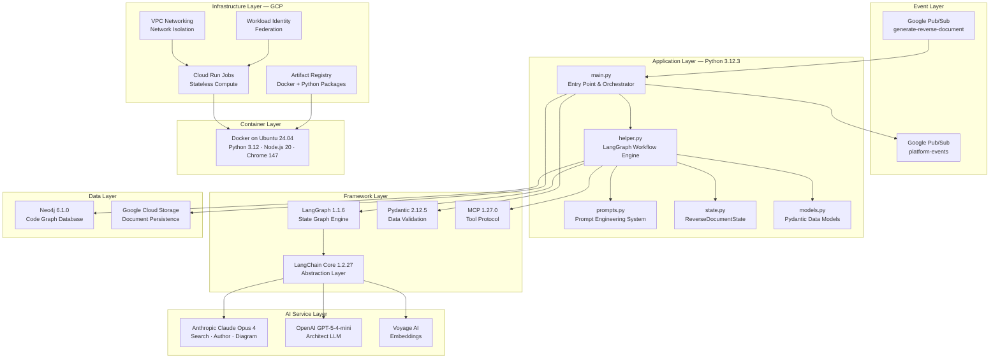

### 3.8.2 Technology Decision Summary

The following table summarizes key technology decisions, their alternatives, and the rationale for each selection:

| Decision | Selected Technology | Alternatives Considered | Selection Rationale |
|----------|-------------------|------------------------|---------------------|
| **Workflow Engine** | LangGraph 1.1.6 | CrewAI, AutoGen, custom state machine | Fine-grained state graph control, native streaming, explicit conditional routing |
| **Primary LLM** | Claude Opus 4 (thinking-max) | GPT-4, Gemini Pro | Superior deep reasoning and technical writing quality; extended thinking mode for complex analysis |
| **Classification LLM** | GPT-5-4-mini | Claude Haiku, local model | Fast structured output; cost-efficient binary classification |
| **Graph Database** | Neo4j 6.1.0 | PostgreSQL, DGraph | Native graph traversal for repository structure; GraphRAG extensions |
| **Object Storage** | Google Cloud Storage | S3, Azure Blob | Native GCP integration; streaming upload support |
| **Compute** | Cloud Run Jobs | Cloud Functions, GKE, EC2 | Event-driven batch execution; zero idle cost; auto-scaling |
| **Messaging** | Google Cloud Pub/Sub | Kafka, RabbitMQ, SQS | Native GCP integration; serverless; at-least-once delivery |
| **Data Validation** | Pydantic v2 | dataclasses, attrs, marshmallow | Rust-powered core; native LangChain structured output integration |
| **Container OS** | Ubuntu 24.04 LTS | Alpine, Debian Slim | Chrome browser compatibility; comprehensive package availability for Python 3.12 and Node.js 20 |

---

#### References

- `/app/main.py` — Core entry point; LLM initialization (lines 15–18), LangGraph workflow configuration, Pub/Sub integration (lines 139–156, 311–363), GCS persistence (lines 158–163, 303–309), Neo4j CodeGraphBuilder initialization (lines 381–401)
- `/app/lib/reverse_document/helper.py` — Primary workflow engine; LangGraph state graph definition, tool definitions, MCP configuration (lines 84–88), fuzzy matching import (line 14), Bash tool definition (line 17)
- `/app/lib/reverse_document/state.py` — `ReverseDocumentState` TypedDict with 32+ workflow state fields
- `/app/lib/reverse_document/models.py` — Pydantic models: `DocumentSectionStatus`, `DocumentSection`, `DocumentSections` (lines 1–33)
- `/app/requirements.txt` — Single dependency declaration: `blitzy-platform-shared==0.0.733` from GCP Artifact Registry
- `/app/Dockerfile` — Container configuration (127 lines): Ubuntu 24.04, Python 3.12 (line 43), Node.js 20 (line 54), npm 11.1.0 (line 61), Chrome Stable, GPT-2 tokenizer pre-download (line 124), security patches (lines 13–25, 91–98)
- `/app/.github/workflows/deploy-job.yml` — CI/CD pipeline (118 lines): Cloud Run deployment, 22 environment variables (lines 85–96), VPC configuration, Slack notifications
- `/app/Makefile` — Build system: Docker build targets, Artifact Registry configuration, `deploy-to-cloud-run` CLI
- `/app/.pre-commit-config.yaml` — Code quality: Black 24.3.0, isort 5.13.2, pre-commit-hooks v4.5.0, YAML formatter v2.12.0
- `/app/find_trace_runs.py` — LangSmith trace correlation: self-hosted endpoint, four-project pipeline configuration (lines 24–28)
- `/app/README.md` — Repository identity and three-environment deployment overview
- LangGraph GitHub Releases (https://github.com/langchain-ai/langgraph/releases) — Version 1.1.6 confirmation
- LangGraph PyPI Stats (https://pypistats.org/packages/langgraph) — Latest version and dependency requirements verification
- LangChain Anthropic Reference (https://reference.langchain.com/python/langchain-anthropic/langchain_anthropic) — langchain-anthropic v1.4.0 compatibility documentation

# 4. Process Flowchart

## 4.1 HIGH-LEVEL SYSTEM WORKFLOW

### 4.1.1 End-to-End Process Overview

The Reverse Document Generator operates as an event-driven, stateless Google Cloud Run Job that transforms source code repositories into comprehensive Technical Specification documents. The system's end-to-end workflow begins with a Pub/Sub message trigger on the `generate-reverse-document` topic and concludes with a `DONE` notification published to the `platform-events` topic, as orchestrated by `/app/main.py` (lines 51–67 for ingestion, lines 340–363 for completion). Two distinct operational modes — GENERATE and UPDATE — share a common initialization phase before diverging into mode-specific processing pipelines.

The following diagram illustrates the complete system workflow from trigger to downstream propagation:

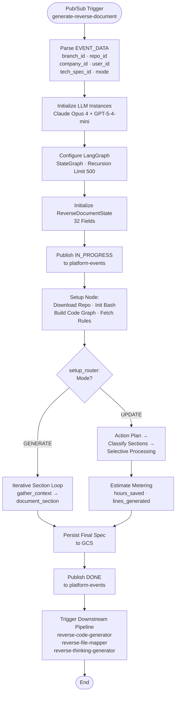

### 4.1.2 Mode Selection and Routing Logic

The `setup_router` function at `/app/lib/reverse_document/helper.py` line 407 evaluates the `mode` field from the `ReverseDocumentState` to determine the operational branch. This is the first critical decision point in the workflow, determining the entire execution path for the job.

| Router | Location | Decision Criteria | Outcomes |
|--------|----------|-------------------|----------|
| `setup_router` | `helper.py` line 407 | `mode` field in state | `"generate"` → GENERATE branch; `"update"` → UPDATE branch |
| `document_router` | `helper.py` line 872 | `section_index >= total_sections` | `"end"` → Completion; continues → Next section loop |
| `update_router` | `helper.py` (conditional) | `DocumentSectionStatus` per section | `CHANGED` → `update_section`; `UNCHANGED` → `copy_old_tech_spec_section` |
| Figma activation | `helper.py` lines 250–258 | `is_figma_available` evaluation | `True` → Activate Figma MCP + sub-agent; `False` → Skip design tools |
| Runner decision | `main.py` lines 404–408 | `should_use_runner()` return value | `True` → Route via `RunnerSession`; `False` → Direct local execution |

### 4.1.3 System Actors and Boundaries

The Reverse Document Generator interacts with six categories of external actors, each operating within defined system boundaries. All context arrives via the Pub/Sub trigger message (`/app/main.py` lines 55–67), and all outputs are persisted to Google Cloud Storage, maintaining stateless execution between job runs.

| Actor Category | Specific Actors | Interaction Pattern | Boundary |
|---------------|----------------|---------------------|----------|
| **Event Sources** | Google Pub/Sub (`generate-reverse-document` topic) | Inbound trigger with JSON payload | Job entry point |
| **AI Services** | Anthropic Claude Opus 4, OpenAI GPT-5-4-mini, Voyage AI | Outbound HTTPS API calls | LLM inference boundary |
| **Platform Services** | GitHub Server, Admin Server, Relay Server, Markdown Server | Outbound HTTP API calls | Service mesh boundary |
| **Data Stores** | Google Cloud Storage, Neo4j | Bidirectional read/write | Persistence boundary |
| **Notification Targets** | Pub/Sub `platform-events` topic | Outbound status messages | Event propagation boundary |
| **Downstream Consumers** | `reverse-code-generator`, `reverse-file-mapper`, `reverse-thinking-generator` | Asynchronous consumption | Pipeline boundary |

---

## 4.2 GENERATE MODE PROCESS FLOW

### 4.2.1 Complete Generation Workflow (F-001)

The GENERATE mode implements end-to-end Technical Specification creation through the `create_graph()` method in `/app/lib/reverse_document/helper.py` (lines 296–349). The workflow proceeds through four phases: initialization, setup, iterative section generation, and completion. State initialization occurs in `main.py` lines 273–288, setting mode, user context, parsed sections, and root folder contents. The graph executes with a recursion limit of 500 steps (`main.py` line 300) and employs streaming persistence to GCS after each section (`main.py` lines 303–309).

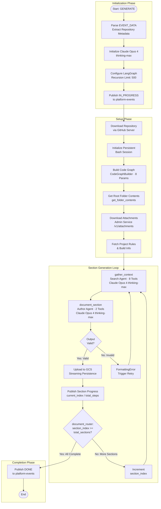

#### Timing and Performance Constraints

| Constraint | Value | Enforcement | Evidence |
|-----------|-------|-------------|----------|
| Initialization time | ≤ 5 seconds | Performance requirement F-001-RQ-001 | `main.py` lines 51–67 |
| Graph recursion limit | 500 steps | LangGraph configuration | `main.py` line 300 |
| Token budget per section | CONTEXT_350K | `process_messages_with_tool_calls` | `helper.py` gather_context node |
| Section ordering | Sequential, cumulative | Business rule — each section builds on prior content | F-001-RQ-002 |

### 4.2.2 Search Agent Context Gathering Process (F-003)

The `gather_context` node (`/app/lib/reverse_document/helper.py` lines 414–560) deploys a Search Agent powered by Claude Opus 4 (thinking-max) equipped with eight specialized tools. The agent systematically explores the target repository under the governance of eight mandatory search rules (S0–S7) defined in `/app/lib/reverse_document/prompts.py` (lines 48–216). Context integration rules C1–C3 govern cross-section awareness. Token management enforces a `CONTEXT_350K` limit via `process_messages_with_tool_calls`.

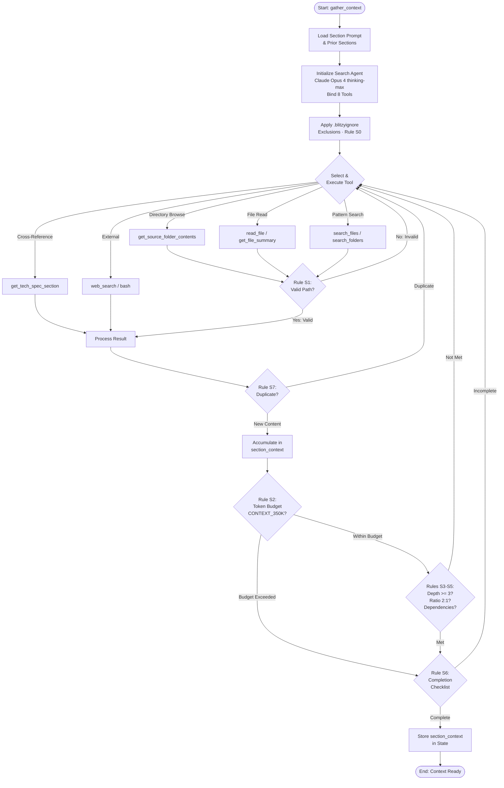

#### Search Rule Enforcement at Each Decision Point

| Rule | Checkpoint | Enforcement | Failure Action |
|------|-----------|-------------|---------------|
| **S0** | Before any tool call | `.blitzyignore` pattern matching | Path rejected silently |
| **S1** | After path-based tool selection | Validate path against repository structure | Tool call rejected; re-select |
| **S2** | After result collection | Track cumulative token usage against CONTEXT_350K | Terminate exploration early |
| **S3** | Before completion check | Verify minimum 3-level hierarchy depth reached | Continue exploring deeper |
| **S4** | Before completion check | Verify 2:1 deep-to-broad search ratio | Adjust exploration strategy |
| **S5** | Before completion check | Verify external dependencies investigated | Explore key dependencies |
| **S6** | Final gate | Execute completion checklist | Continue if gaps found |
| **S7** | After each tool result | Check for redundant reads/searches | Skip duplicate content |

### 4.2.3 Author Agent Documentation Process (F-004)

The `document_section` node (`/app/lib/reverse_document/helper.py` lines 710–870) deploys an Author Agent powered by Claude Opus 4 (thinking-max) with two tools (`get_tech_spec_section`, `web_search`). Content generation follows output rules SO1–SO4 from `/app/lib/reverse_document/prompts.py` (lines 358–492). A dedicated Diagram Agent (`diagram_llm` parameter, `helper.py` line 187) generates mermaid diagrams when required (F-005). Output validation enforces code block delimiter pairing (lines 845–848) and non-empty content checks (lines 840–843), with content extracted via `get_json_content(content, strict=True)`.

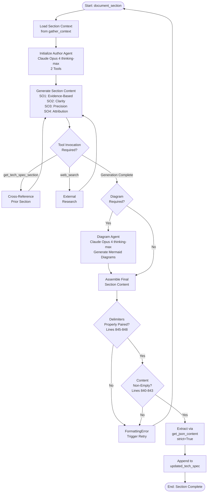

#### Mermaid Diagram Validation Rules (F-005)

Diagram validation rules are defined in `/app/lib/reverse_document/prompts.py` (lines 406–438). While runtime validation logic exists at `helper.py` lines 850–856 (currently commented out), the prompt system enforces the following structural requirements during generation:

| Validation Rule | Requirement | Scope |
|----------------|-------------|-------|
| Subgraph closure | Every `subgraph` keyword paired with `end` | All flowcharts |
| Node ID uniqueness | No node ID conflicts with subgraph names | All flowcharts |
| Diagram enclosure | Diagrams enclosed in ` ```mermaid ` and ` ``` ` | All diagram types |
| Date format compliance | Gantt charts must specify `dateFormat` | Gantt diagrams |
| Type format rules | Diagram types properly declared | All diagram types |

---

## 4.3 UPDATE MODE PROCESS FLOW

### 4.3.1 Complete Update Workflow (F-002)

The UPDATE mode modifies existing Technical Specifications based on new requirements, regenerating only changed sections while preserving stable content. The workflow is implemented across four nodes in `/app/lib/reverse_document/helper.py`: `create_agent_action_plan` (lines 880–1002), `identify_changes` (lines 1073–1153), `update_section` (lines 1155–1316), and `copy_old_tech_spec_section` (lines 1050–1071). Update mode preparation occurs in `main.py` lines 191–208, where the existing specification is downloaded from GCS and parsed.

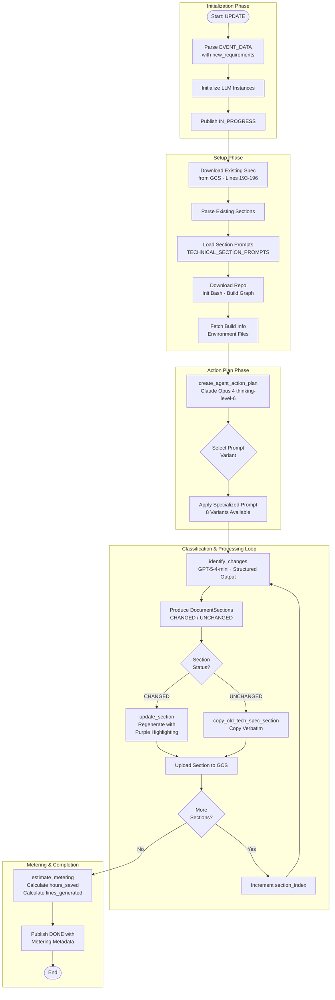

### 4.3.2 Agent Action Plan Creation (F-006)

The `create_agent_action_plan` node (`helper.py` lines 880–1002) deploys Claude Opus 4 with thinking-level-6 (extended thinking) to perform comprehensive change analysis. The agent receives project build information including setup instructions, environments, environment variables, and secrets (lines 897–905), along with user rules when available (lines 954–957). Eight specialized prompt variants, defined in `prompts.py` lines 741–749, are selected based on the nature of the change:

| Prompt Variant | Change Type | Selection Criteria |
|---------------|------------|-------------------|
| `DEFAULT_SUMMARY_PROMPT` | General changes | Default when no specific type matches |
| `BUG_FIX_SUMMARY_PROMPT` | Bug fixes | Bug-related requirement keywords |
| `SECURITY_VULNERABILITY_FIX_PROMPT` | Security patches | Security-related requirement keywords |
| `TESTING_SUMMARY_PROMPT` | Test additions/changes | Testing-focused requirements |
| `DOCUMENTATION_SUMMARY_PROMPT` | Documentation updates | Documentation-focused requirements |
| `NEW_PRODUCT_SUMMARY_PROMPT` | New product creation | New product requirements |
| `ADD_FEATURE_SUMMARY_PROMPT` | Feature additions | Feature addition requirements |
| `REFACTOR_SUMMARY_PROMPT` | Code refactoring | Refactoring requirements |

The agent is equipped with all search tools, document tools, `web_search`, `web_fetch`, `bash`, and conditionally activated Figma tools. When `is_figma_available` evaluates to `True` (based on `figma_info["is_available"]` and attachment existence, `helper.py` lines 250–258), the `identify_figma_screens` sub-agent is activated to match design screens to documentation sections (F-008).

### 4.3.3 Section Change Classification and Processing

The `identify_changes` node (`helper.py` lines 1073–1153) uses GPT-5-4-mini (Architect LLM) to classify each section as `CHANGED` or `UNCHANGED` via structured output. The output conforms to the `DocumentSections` Pydantic model defined in `/app/lib/reverse_document/models.py`, containing per-section `heading`, `status` (`DocumentSectionStatus` enum), and `changes` list. Section heading matching between old and new specifications uses the `thefuzz` library for fuzzy matching (lines 1085–1089).

#### Conditional Section Processing

| Section Status | Processing Node | Action | Evidence |
|---------------|----------------|--------|----------|
| **CHANGED** | `update_section` (lines 1155–1316) | Regenerate content with change context; apply purple background highlighting (`rgba(91, 57, 243, 0.2)`, `prompts.py` line 1007) | F-002-RQ-003 |
| **UNCHANGED** | `copy_old_tech_spec_section` (lines 1050–1071) | Copy existing section content verbatim from the existing specification | F-002-RQ-003 |

---

## 4.4 INTEGRATION WORKFLOWS

### 4.4.1 Pub/Sub Event Processing Sequence (F-010)

The system's event-driven lifecycle is managed entirely through Google Cloud Pub/Sub. Inbound job triggers arrive via the `generate-reverse-document` topic, while outbound status notifications are published to the `platform-events` topic. The following sequence diagram illustrates the complete event flow, including per-section progress tracking implemented in `/app/main.py` (lines 311–335).

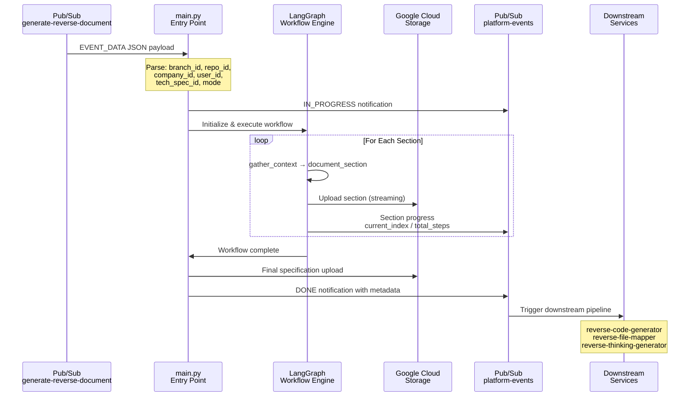

#### Notification Payload Structure

All outbound notifications to `platform-events` include the following fields, as validated by `/app/done.test.py`:

| Field | Type | Description |
|-------|------|-------------|
| `projectId` | String | Target project identifier |
| `jobId` | String | Cloud Run Job execution identifier |
| `tech_spec_id` | String | Generated specification identifier |
| `phase` | Enum | `TECHNICAL_SPECIFICATION` |
| `status` | Enum | `IN_PROGRESS`, `DONE`, or `ERROR` |
| `user_id` | String | Requesting user identifier |
| `team_id` | String | Team identifier |
| `company_id` | String | Company identifier |
| `metadata` | Object | Contains `propagate`, `repo_name`, `document_mode`, metering estimates |

### 4.4.2 Multi-LLM Orchestration Sequence (F-013)

The system coordinates six agent roles across two LLM providers, each selected for task-appropriate capabilities. LLM instances are initialized in `/app/main.py` (lines 15–18 for imports, lines 234–238 for binding). The following sequence diagram illustrates the multi-model interaction pattern across both operational modes:

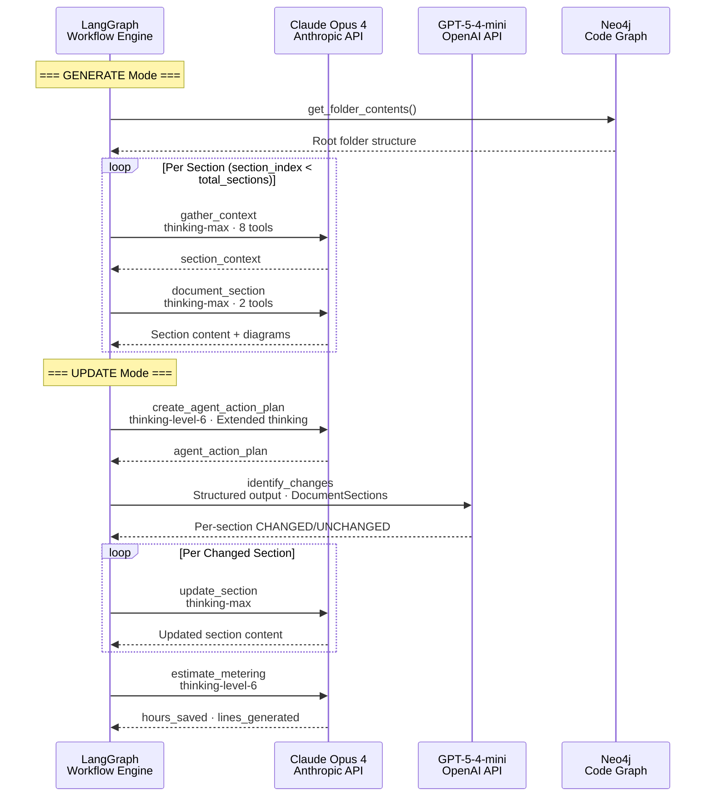

### 4.4.3 MCP and Design Integration Flow (F-017, F-008)

Model Context Protocol integration is managed through the `MCPManager` in `/app/lib/reverse_document/helper.py` (lines 84–88 for imports, line 249 for Chrome DevTools, lines 254–255 for Figma). Chrome DevTools MCP is always configured as the base server, while Figma MCP is conditionally activated based on design data availability. Figma information is retrieved via `get_figma_info_for_tech_spec` in `main.py` (lines 225–226).

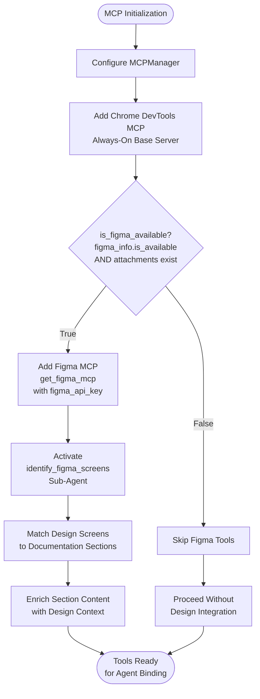

---

## 4.5 STATE MANAGEMENT FLOWS

### 4.5.1 ReverseDocumentState Lifecycle

The `ReverseDocumentState` TypedDict, defined in `/app/lib/reverse_document/state.py` (78 lines), carries 32 fields across the workflow lifecycle. State is initialized from the Pub/Sub payload in `main.py` lines 273–288 and progressively enriched as the workflow advances. The following state diagram illustrates the major lifecycle phases and transitions:

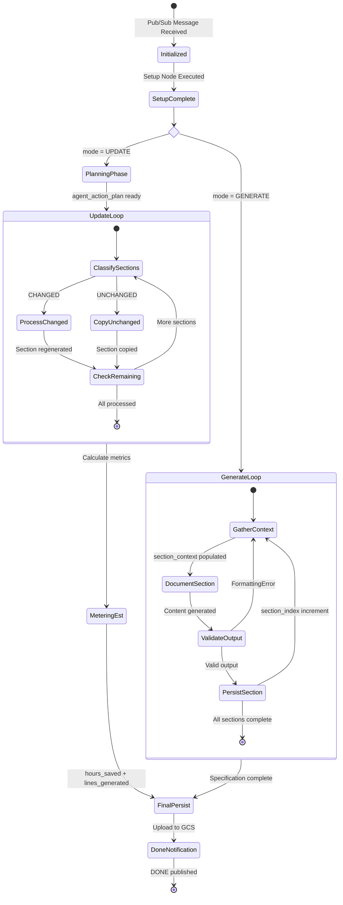

#### State Field Categories

| Category | Fields | Lifecycle Phase |
|----------|--------|----------------|
| **Identity Context** | `branch_id`, `company_id`, `repo_id`, `user_id`, `head_commit_hash` | Set at initialization; immutable throughout |
| **Workflow Progression** | `section_index`, `section_prompts`, `section_headings`, `total_sections` | Set at setup; `section_index` incremented per loop |
| **Content** | `current_tech_spec`, `updated_tech_spec` | `current_tech_spec` loaded for UPDATE; `updated_tech_spec` accumulated per section |
| **Update-Specific** | `new_requirements`, `agent_action_plan`, parsed sections | Set during UPDATE initialization and action plan creation |
| **Metering** | `estimated_hours_saved`, `estimated_lines_generated` | Set by `estimate_metering` node (UPDATE mode only) |
| **Infrastructure** | `retry_count`, `root_folder_contents` | `root_folder_contents` set at setup; `retry_count` managed by retry logic |

### 4.5.2 Job Status Transitions

The job progresses through a defined set of status states, each communicated via Pub/Sub notifications to `platform-events`. The status transitions are managed in `/app/main.py` (lines 139–156 for IN_PROGRESS, lines 311–335 for progress, lines 340–363 for DONE).

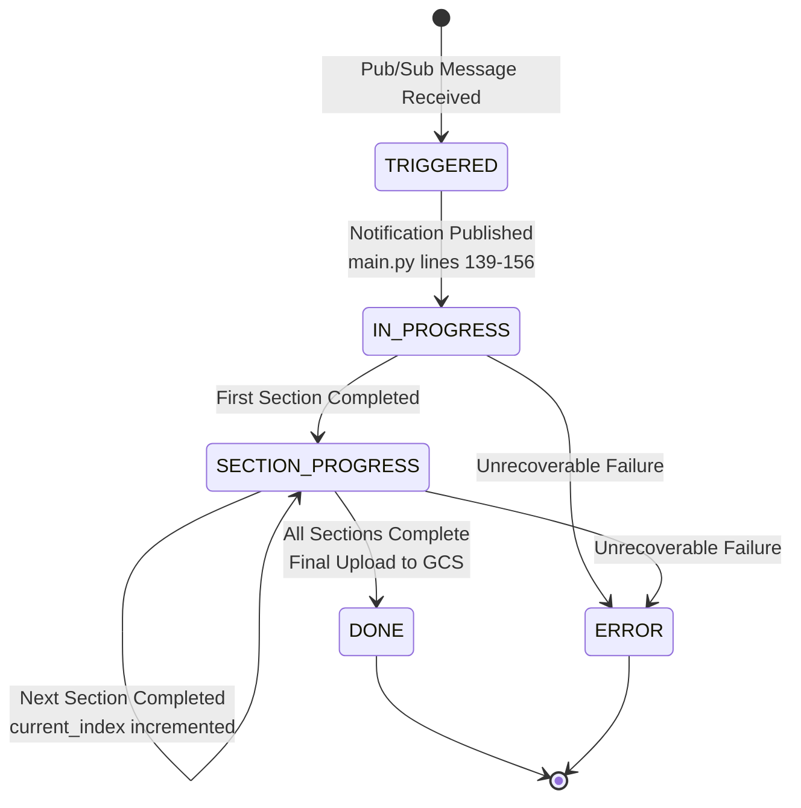

### 4.5.3 Data Persistence Points

The system employs a streaming persistence model where the specification is uploaded to GCS after each section is generated, providing incremental durability and enabling partial recovery from mid-generation failures.

| Persistence Point | Trigger | Storage Path | Metadata | Evidence |
|------------------|---------|-------------|----------|----------|
| Per-section upload | Section generation complete | `{project_id}/{task_id}/{tech_spec_id}` | `head_commit_hash`, `document_mode` | `main.py` lines 303–309 |
| Existing spec download | UPDATE mode initialization | Same path pattern | Read-only | `main.py` lines 193–196 |
| Document prompts retrieval | Workflow setup | GCS prompt storage | Read-only | `main.py` lines 182–184 |
| Final specification upload | All sections complete | Same path pattern | Full metadata set | `main.py` lines 303–309 |

---

## 4.6 ERROR HANDLING AND RECOVERY FLOWS

### 4.6.1 Retry Mechanism Flow (F-016)

All major workflow nodes are protected by the `@archie_exponential_retry()` decorator, powered by the `tenacity 9.1.4` library. The decorated nodes — `gather_context`, `document_section`, `create_agent_action_plan`, `estimate_metering`, `identify_changes`, and `update_section` (at `helper.py` lines 413, 709, 880, 1004, 1073, 1155 respectively) — automatically retry on transient failures with exponential backoff. Manual retry logic with `retry_count` tracking and `DEFAULT_MAX_RETRIES` limit is implemented in `process_section` (lines 688–698).

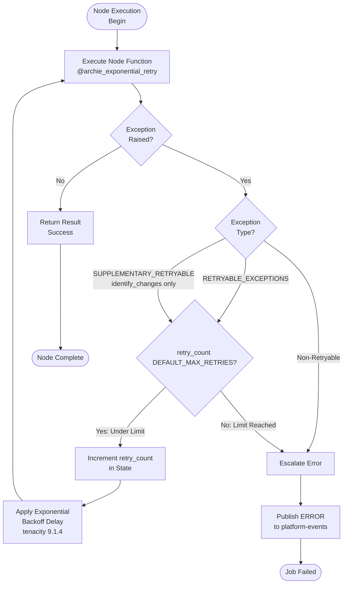

#### Exception Handling Classification

| Exception Category | Applicable Nodes | Behavior |
|-------------------|-----------------|----------|
| `RETRYABLE_EXCEPTIONS` | All decorated nodes | Automatic retry with exponential backoff |
| `SUPPLEMENTARY_RETRYABLE_EXCEPTIONS` | `identify_changes` only (lines 699–701) | Additional exception types triggering retry for the Architect LLM |
| Non-retryable exceptions | All nodes | Immediate escalation to ERROR status |

### 4.6.2 Token and Context Window Management

Token management is enforced during the `gather_context` phase to prevent context window overflow. The system uses GPT-2 tokenizer (pre-downloaded during Docker build, `/app/Dockerfile` line 124) and `tiktoken` for OpenAI-compatible token counting. The `process_messages_with_tool_calls` function manages the context window within the `CONTEXT_350K` limit, ensuring that the Search Agent's accumulated context does not exceed the LLM's capacity. When the token budget is exhausted, the agent proceeds to the completion checklist (Rule S6) regardless of exploration depth.

### 4.6.3 Output Validation Pipeline

The output validation pipeline enforces structural integrity of generated content before persistence. Validation failures trigger automatic retries via the `@archie_exponential_retry()` decorator.

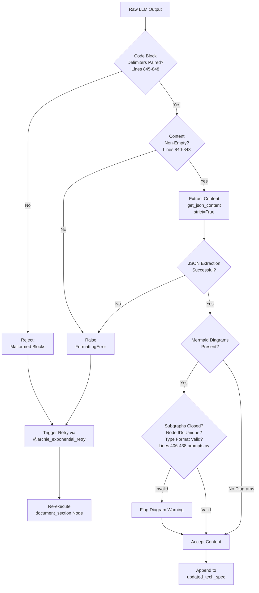

---

## 4.7 CI/CD PIPELINE WORKFLOW

### 4.7.1 Build, Deploy, and Notify Pipeline

The CI/CD pipeline, defined in `/app/.github/workflows/deploy-job.yml` (118 lines), automates the container build-deploy cycle. The pipeline is triggered on pushes to the `qa` branch and operates within the `qa-deployments` concurrency group with `cancel-in-progress: true` to prevent overlapping deployments.

```mermaid
flowchart LR
    subgraph TriggerStage["Trigger"]
        CI01["Push to qa Branch"]
    end

    subgraph BuildStage["Build Stage"]
        CI02["Checkout Code<br/>actions/checkout@v4"]
        CI03["GCP Auth<br/>Workload Identity<br/>Federation"]
        CI04["Setup Cloud SDK<br/>setup-gcloud@v2"]
        CI05["Docker Registry Auth<br/>gcloud configure-docker"]
        CI06["Docker Build<br/>make build"]
    end

    subgraph DeployStage["Deploy Stage"]
        CI07["Tag Image<br/>SHA + latest"]
        CI08["Push to<br/>Artifact Registry"]
        CI09["Cloud Run Job Deploy<br/>22 Env Variables<br/>VPC Configuration"]
    end

    subgraph NotifyStage["Notification"]
        CI10["Slack Notification<br/>slack-github-action<br/>v1.24.0"]
    end

    CI01 --> CI02
    CI02 --> CI03
    CI03 --> CI04
    CI04 --> CI05
    CI05 --> CI06
    CI06 --> CI07
    CI07 --> CI08
    CI08 --> CI09
    CI09 --> CI10
```

#### Deployment Configuration

The Cloud Run Job is deployed with 22 environment variables encompassing all AI API keys (`ANTHROPIC_API_KEY`, `OPENAI_API_KEY`, `VOYAGE_API_KEY`, `GOOGLE_API_KEY`), platform service URLs (`SERVICE_URL_GITHUB`, `SERVICE_URL_ADMIN`, `SERVICE_URL_RELAY`, `MARKDOWN_SERVER`, `GITHUB_SECRET_SERVER`), LangSmith configuration, and infrastructure settings. VPC networking parameters (egress, network, subnet) enforce network isolation per environment.

---

## 4.8 DOWNSTREAM PIPELINE PROPAGATION

### 4.8.1 Post-Completion Event Chain

Upon successful workflow completion, the system publishes a `DONE` notification to the `platform-events` Pub/Sub topic (`main.py` lines 340–363), triggering three downstream services that consume the generated specification. Shared data artifacts — `tech_spec_first_n` and `agent_action_plan` — are correlated across all four services through LangSmith distributed traces via content fingerprints in `/app/find_trace_runs.py`.

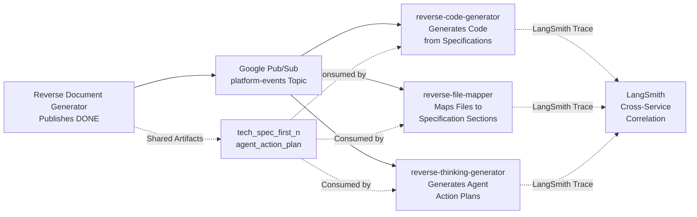

### 4.8.2 Feature Dependency Chain

The end-to-end workflow relies on a hierarchical feature dependency chain, where core generation features depend on AI agent operations, infrastructure, and resilience features. The following summary captures the critical dependency paths for each operational mode:

| Operational Mode | Feature Chain |
|-----------------|---------------|
| **GENERATE** | F-001 → F-003 (Search), F-004 (Author), F-005 (Diagrams), F-010 (Pub/Sub), F-011 (GCS), F-012 (Neo4j), F-013 (Multi-LLM), F-016 (Retry) |
| **UPDATE** | F-002 → F-004 (Author), F-006 (Action Plan), F-007 (Metering), F-013 (Multi-LLM), F-016 (Retry) |
| **Action Plan** | F-006 → F-008 (Figma), F-017 (MCP), F-018 (User Rules), F-019 (Build Config) |
| **Figma Integration** | F-008 → F-009 (Attachments), F-017 (MCP) |

---

#### References

- `/app/main.py` — Core entry point; Pub/Sub ingestion (lines 51–67), IN_PROGRESS notification (lines 139–156), state initialization (lines 273–288), LangGraph recursion limit (line 300), streaming GCS persistence (lines 303–309), per-section progress (lines 311–335), DONE notification (lines 340–363), Neo4j initialization (lines 381–401), RunnerSession (lines 404–408)
- `/app/lib/reverse_document/helper.py` — Workflow engine; `create_graph()` (lines 296–349), `setup_router` (line 407), `gather_context` (lines 414–560), `document_section` (lines 710–870), `document_router` (line 872), `create_agent_action_plan` (lines 880–1002), `estimate_metering` (lines 1004–1048), `copy_old_tech_spec_section` (lines 1050–1071), `identify_changes` (lines 1073–1153), `update_section` (lines 1155–1316), retry decorators (lines 413, 688–701, 709, 880, 1004, 1073, 1155), MCP configuration (lines 84–88, 249–258), output validation (lines 840–856)
- `/app/lib/reverse_document/prompts.py` — Search rules S0–S7 (lines 48–216), author rules SO1–SO4 (lines 358–492), mermaid validation rules (lines 406–438), prompt variants for UPDATE mode (lines 741–749), change highlighting style (line 1007)
- `/app/lib/reverse_document/state.py` — `ReverseDocumentState` TypedDict with 32 fields; metering state fields (lines 14–15)
- `/app/lib/reverse_document/models.py` — `DocumentSectionStatus` enum, `DocumentSection`, `DocumentSections` Pydantic models
- `/app/.github/workflows/deploy-job.yml` — CI/CD pipeline (118 lines); deployment trigger, concurrency configuration, 22 environment variables, VPC settings, Slack notifications
- `/app/done.test.py` — DONE notification payload structure validation
- `/app/find_trace_runs.py` — LangSmith trace correlation across four-service pipeline
- `/app/Dockerfile` — Container configuration; GPT-2 tokenizer pre-download (line 124)

# 5. System Architecture

## 5.1 HIGH-LEVEL ARCHITECTURE

### 5.1.1 System Overview

The Reverse Document Generator (`archie-job-reverse-document-generator`) employs a **multi-agent, state-graph-driven architecture** built on **LangGraph 1.1.6**, executing as a stateless, event-driven **Google Cloud Run Job** within the **Blitzy Platform** ecosystem. The system transforms source code repositories into comprehensive Technical Specification documents through the collaborative work of specialized AI agents — each purpose-bound to a specific LLM provider and model — coordinated via a shared state graph containing 32 fields.

#### Architectural Style and Rationale

The architecture combines three foundational patterns:

- **State-Graph Orchestration** — LangGraph's `StateGraph` abstraction models the entire workflow as a directed graph with explicit nodes (workflow steps), conditional edges (routing decisions), and a shared `ReverseDocumentState` TypedDict that carries all execution context. This was selected over alternatives such as CrewAI or AutoGen because of its fine-grained control over agent state transitions, native async streaming, and explicit conditional routing — all essential for the system's dual-mode (GENERATE and UPDATE) workflow with complex branching logic.

- **Event-Driven Batch Processing** — The system is triggered by an inbound Google Pub/Sub message on the `generate-reverse-document` topic. All execution context arrives via the `EVENT_DATA` environment variable parsed in `/app/main.py` (lines 51–67). No persistent state is maintained between job runs, guaranteeing stateless, horizontally scalable execution. Outputs are persisted to Google Cloud Storage using a streaming model and completion notifications are published to the `platform-events` Pub/Sub topic.

- **Multi-Agent Collaboration** — Six distinct agent roles are implemented, each assigned a purpose-selected LLM. Claude Opus 4 (thinking-max and thinking-level-6) powers the reasoning-intensive agents (search, author, diagram, action plan, metering), while GPT-5-4-mini serves as the Architect LLM for fast structured classification. This separation optimizes both quality and cost across the workflow.

#### Key Architectural Principles

| Principle | Implementation |
|-----------|---------------|
| **Statelessness** | All context arrives via Pub/Sub; zero persistent state between jobs |
| **Separation of Concerns** | Each agent role has a dedicated LLM, toolset, and prompt system |
| **Incremental Durability** | Streaming GCS uploads after each section protect against partial failure |
| **Resilient Execution** | Exponential retry with classified exception handling on all major nodes |
| **Evidence-Based Output** | Search rules (S0–S7) and author rules (SO1–SO4) enforce grounded documentation |

#### System Boundaries

The system operates within well-defined boundaries. Inbound triggers arrive exclusively via Pub/Sub. Outbound communication occurs through HTTPS API calls to AI services (Anthropic, OpenAI, Voyage AI), HTTP calls to Blitzy Platform services (GitHub Server, Admin Server, Relay Server, Markdown Server, GitHub Secret Server), bidirectional GCS and Neo4j operations, and outbound Pub/Sub notifications. Browser automation and design integration are handled through MCP (Model Context Protocol) servers — Chrome DevTools (always-on) and Figma (conditional). LangSmith provides distributed tracing across the four-service pipeline.

### 5.1.2 Core Components

The system comprises five core modules housed in `/app/lib/reverse_document/` and an orchestrator entry point at `/app/main.py`. The following table summarizes each component's responsibilities and critical dependencies.

| Component | Primary Responsibility | Key Dependencies |
|-----------|----------------------|------------------|
| **Entry Point / Orchestrator** (`main.py`, 424 lines) | LLM initialization, LangGraph workflow configuration, Pub/Sub ingestion, GCS persistence, completion notifications | LangGraph, Pub/Sub, GCS, Neo4j |
| **Workflow Engine** (`helper.py`, 1,316 lines) | Defines LangGraph state graph, all workflow nodes, tool definitions, MCP configuration, and routing logic | LangGraph, Anthropic, OpenAI, Neo4j, MCP |
| **Prompt System** (`prompts.py`, 1,097 lines) | All LLM prompt templates: search agent (S0–S7), author agent (SO1–SO4), tool rules (T1–T5), 8 update prompt variants | None (pure templates) |
| **State Manager** (`state.py`, 78 lines) | Defines `ReverseDocumentState` TypedDict with 32 fields | CodeGraphBuilder, DocumentSection model |
| **Data Models** (`models.py`, 33 lines) | Pydantic models for structured LLM outputs: `DocumentSectionStatus`, `DocumentSection`, `DocumentSections` | Pydantic |

Additional integration points for each component are as follows:

| Component | Integration Points | Critical Considerations |
|-----------|-------------------|------------------------|
| **Entry Point / Orchestrator** | Inbound Pub/Sub, outbound Pub/Sub, GCS, platform services | Stateless; all context from `EVENT_DATA` env var |
| **Workflow Engine** | All LLM APIs, repository tools, MCP servers | Contains `create_graph()` defining the complete state machine |
| **Prompt System** | Referenced by all agents | 8 specialized update prompt variants |
| **State Manager** | Shared across all workflow nodes | Carries identity, workflow, content, update, metering, and infrastructure state |
| **Data Models** | Used by Architect LLM (GPT-5-4-mini) for structured output | Critical for UPDATE mode section classification |

### 5.1.3 Data Flow Description

#### Primary Data Flows

The system processes data through five major flow paths, each serving a distinct phase of the document generation lifecycle.

**1. Inbound Trigger Flow** — A Google Pub/Sub message arrives on the `generate-reverse-document` topic and is injected as the `EVENT_DATA` environment variable. The entry point in `/app/main.py` (lines 51–67) parses the JSON payload to extract `branch_id`, `repo_id`, `company_id`, `user_id`, `tech_spec_id`, and `mode`. These fields initialize the `ReverseDocumentState` (lines 273–288), establishing the immutable identity context that persists throughout the job.

**2. GENERATE Mode Flow** — After setup (repository download, bash session initialization, Neo4j code graph construction, root folder contents retrieval, attachment download, and project rule/build info fetching), the workflow enters an iterative section generation loop. For each section, the Search Agent (Claude Opus 4, 8 tools) gathers context via the `gather_context` node (lines 414–560), and the Author Agent (Claude Opus 4, 2 tools) produces documentation via the `document_section` node (lines 710–870). Output is validated, uploaded to GCS, and progress notifications are published. The loop terminates when `section_index >= total_sections` as evaluated by the `document_router` (line 872).

**3. UPDATE Mode Flow** — The existing specification is downloaded from GCS and parsed into sections. An Agent Action Plan is created by Claude Opus 4 (thinking-level-6) using one of eight specialized prompt variants. GPT-5-4-mini then classifies each section as `CHANGED` or `UNCHANGED` via structured output conforming to the `DocumentSections` Pydantic model. Changed sections are regenerated with purple-highlighted differences (`rgba(91, 57, 243, 0.2)`), while unchanged sections are copied verbatim. Metering estimation follows, calculating `estimated_hours_saved` and `estimated_lines_generated`.

**4. Outbound Notification Flow** — Upon completion, `/app/main.py` publishes a `DONE` notification to `platform-events` with comprehensive metadata (project ID, job ID, tech spec ID, metering estimates, document mode). This triggers three downstream services: `reverse-code-generator`, `reverse-file-mapper`, and `reverse-thinking-generator`.

**5. Streaming Persistence Flow** — After each section generation, the specification is uploaded to GCS at path `{project_id}/{task_id}/{tech_spec_id}` with metadata including `head_commit_hash` and `document_mode`. This streaming model provides incremental durability, enabling partial recovery from mid-generation failures.

#### Data Transformation Points

- **Raw LLM Output → Structured Content**: `get_json_content(content, strict=True)` extracts usable content from LLM responses
- **Markdown Validation**: Code block delimiter pairing is enforced (lines 845–848 in `helper.py`)
- **Existing Spec → Parsed Sections**: `clean_document()` and `parse_sections_at_heading_level()` decompose existing specifications for UPDATE mode processing
- **Fuzzy Section Matching**: The `thefuzz` library aligns section headings between old and new specifications during UPDATE mode (lines 1085–1089)
- **Token Counting**: GPT-2 tokenizer (pre-downloaded during Docker build) and `tiktoken` provide offline token counting for context window management within the `CONTEXT_350K` budget

### 5.1.4 External Integration Points

The system integrates with fourteen external systems spanning AI services, cloud infrastructure, platform services, and design tools.

| System Name | Integration Type | Data Exchange Pattern |
|-------------|-----------------|----------------------|
| Google Pub/Sub (`generate-reverse-document`) | Event trigger | Inbound async message (JSON) |
| Google Pub/Sub (`platform-events`) | Notifications | Outbound async messages (IN_PROGRESS, progress, DONE, ERROR) |
| Google Cloud Storage | Document persistence | Bidirectional read/write (streaming), GCS API |
| Neo4j Graph Database | Code graph | Bidirectional build/query, Bolt protocol |

| System Name | Integration Type | Data Exchange Pattern |
|-------------|-----------------|----------------------|
| Anthropic API | LLM inference | Outbound HTTPS (Claude Opus 4, thinking-max/level-6) |
| OpenAI API | LLM inference | Outbound HTTPS (GPT-5-4-mini, structured output) |
| Voyage AI API | Embeddings | Outbound HTTPS (semantic search vectors) |
| GitHub Server | Repository access | Outbound HTTP REST via `SERVICE_URL_GITHUB` |

| System Name | Integration Type | Data Exchange Pattern |
|-------------|-----------------|----------------------|
| Admin Server | Platform administration | Outbound HTTP REST (`/v1/attachments`, rules, build info) |
| Relay Server | Messaging | Outbound HTTP REST (inter-service communication) |
| Markdown Server | Processing | Outbound HTTP REST (markdown rendering) |
| GitHub Secret Server | Credentials | Outbound HTTP REST (repository access tokens) |

| System Name | Integration Type | Data Exchange Pattern |
|-------------|-----------------|----------------------|
| LangSmith (self-hosted) | Observability | Outbound HTTPS to `34.59.110.138` (4-service trace correlation) |
| Figma API (via MCP) | Design integration | Conditional outbound HTTPS (only when `is_figma_available = True`) |
| Chrome DevTools (via MCP) | Browser automation | Always-on WebSocket / Chrome DevTools Protocol |

## 5.2 COMPONENT DETAILS

### 5.2.1 Entry Point and Orchestrator

**Purpose and Responsibilities**: The entry point module (`/app/main.py`, 424 lines) serves as the system's main orchestration layer. It initializes all LLM instances, configures the LangGraph workflow, parses inbound Pub/Sub messages, manages GCS persistence, retrieves Neo4j credentials, and dispatches completion notifications.

**Technologies and Frameworks**: Python 3.12.3, asyncio, LangGraph `StateGraph`, Google Cloud Pub/Sub client, `AdminStorageService` for GCS operations, and the `langsmith_tracing` context manager for distributed tracing.

**Key Interfaces and APIs**:
- `generate_reverse_document()` — The primary async orchestration function that drives the entire job lifecycle
- `get_project_attachments()` — Async retrieval of project attachments from the Admin Service
- Neo4j credential retrieval via `get_company_neo4j_instance_credentials(company_id)` with per-company isolation
- `RunnerSession` management via `should_use_runner()` for conditional runner-based execution

**Data Persistence**: All document persistence is handled through `AdminStorageService` with streaming uploads after each section. The GCS path follows the pattern `{project_id}/{task_id}/{tech_spec_id}` with `head_commit_hash` and `document_mode` metadata.

**LLM Binding Configuration**: The orchestrator creates the `ReverseDocumentHelper` instance, binding purpose-selected LLMs to agent roles — `llm_claude_opus_4_6_thinking_max` for the search, author, and diagram agents, and `llm_gpt5_4_mini` as the Architect LLM. The graph is then compiled and executed via `app.astream()` with a recursion limit of 500.

**Scaling Considerations**: As a stateless Cloud Run Job, horizontal scaling is achieved through concurrent job executions. Each job processes a single repository independently, with no shared state between executions.

### 5.2.2 Workflow Engine

**Purpose and Responsibilities**: The workflow engine (`/app/lib/reverse_document/helper.py`, 1,316 lines) defines the complete LangGraph state machine through the `create_graph()` method (lines 296–349). It implements all workflow nodes, tool definitions, MCP configuration, and three routing functions that govern execution flow.

**Workflow Nodes**:
- `setup` — Downloads the repository, initializes a persistent bash session, builds the Neo4j code graph, retrieves root folder contents, downloads attachments, and fetches project rules and build info
- `gather_context` (lines 414–560) — Search Agent with 8 tools, powered by Claude Opus 4 (thinking-max)
- `document_section` (lines 710–870) — Author Agent with 2 tools, powered by Claude Opus 4 (thinking-max)
- `create_agent_action_plan` (lines 880–1002) — Action Plan Agent using Claude Opus 4 (thinking-level-6)
- `identify_changes` (lines 1073–1153) — Architect LLM (GPT-5-4-mini) with structured output
- `update_section` (lines 1155–1316) — Section regeneration with change highlighting
- `copy_old_tech_spec_section` (lines 1050–1071) — Verbatim copy for unchanged sections
- `estimate_metering` (lines 1004–1048) — Hours saved and lines generated calculation

**Routing Logic**:
- `setup_router` (line 407) — Routes to GENERATE or UPDATE branch based on the `mode` field
- `document_router` (line 872) — Terminates the section loop when `section_index >= total_sections`
- `update_router` — Routes each section to `update_section` (CHANGED) or `copy_old_tech_spec_section` (UNCHANGED)

**Tool Ecosystem** (12+ specialized tools organized by function):
- **Repository Inspection**: `get_source_folder_contents`, `read_file`, `search_files`, `search_folders`, `get_file_summary`
- **Document Management**: `get_tech_spec_section`, `add_tech_spec_sub_section`, `mark_tech_spec_sub_section_complete`
- **External Research**: `web_search`, `web_fetch`
- **Shell Execution**: `bash` (persistent session)
- **MCP Integrations**: Chrome DevTools (always-on), Figma (conditional)

```mermaid
flowchart TD
    subgraph WorkflowGraph["LangGraph State Machine"]
        Start([START]) --> SetupNode["setup<br/>Download Repo · Init Bash<br/>Build Code Graph"]
        SetupNode --> Router{{"setup_router<br/>Mode?"}}

        Router -->|"GENERATE"| GatherCtx["gather_context<br/>Search Agent<br/>8 Tools · Claude Opus 4"]
        GatherCtx --> DocSection["document_section<br/>Author Agent<br/>2 Tools · Claude Opus 4"]
        DocSection --> DocRouter{{"document_router<br/>All Sections?"}}
        DocRouter -->|"More Sections"| GatherCtx
        DocRouter -->|"Complete"| EndNode([END])

        Router -->|"UPDATE"| ActionPlan["create_agent_action_plan<br/>Claude Opus 4 level-6"]
        ActionPlan --> Identify["identify_changes<br/>GPT-5-4-mini<br/>Structured Output"]
        Identify --> UpdateRouter{{"update_router<br/>Status?"}}
        UpdateRouter -->|"CHANGED"| UpdateSec["update_section<br/>Regenerate with Highlighting"]
        UpdateRouter -->|"UNCHANGED"| CopySec["copy_old_tech_spec_section<br/>Copy Verbatim"]
        UpdateSec --> MoreSec{{"More Sections?"}}
        CopySec --> MoreSec
        MoreSec -->|"Yes"| Identify
        MoreSec -->|"No"| Metering["estimate_metering<br/>Hours Saved · Lines Generated"]
        Metering --> EndNode
    end
```

### 5.2.3 State Manager and Data Models

**Purpose and Responsibilities**: The state manager (`/app/lib/reverse_document/state.py`, 78 lines) defines the `ReverseDocumentState` TypedDict — the shared state object that flows through every node of the LangGraph workflow. The data models module (`/app/lib/reverse_document/models.py`, 33 lines) provides Pydantic models for structured LLM outputs.

#### State Field Categories

| Category | Key Fields | Lifecycle |
|----------|-----------|-----------|
| **Identity Context** | `branch_id`, `company_id`, `repo_id`, `user_id`, `head_commit_hash`, `tech_spec_id` | Set at initialization; immutable |
| **Workflow Progression** | `mode`, `section_index`, `section_prompts`, `section_headings`, `total_sections` | Set at setup; `section_index` incremented per loop |
| **Content** | `current_tech_spec`, `updated_tech_spec`, `section_context`, `user_context` | Accumulated progressively through workflow |

| Category | Key Fields | Lifecycle |
|----------|-----------|-----------|
| **Update-Specific** | `new_requirements`, `agent_action_plan`, `previous_tech_spec`, `structured_sections` | Set during UPDATE initialization and action plan creation |
| **Metering** | `estimated_hours_saved`, `estimated_lines_generated` | Set by `estimate_metering` node (UPDATE mode only) |
| **Infrastructure** | `retry_count`, `root_folder_contents`, `graph_builder` | `root_folder_contents` set at setup; `retry_count` managed by retry logic |

#### Pydantic Data Models

The `DocumentSectionStatus` enum restricts classification to exactly two values: `CHANGED` and `UNCHANGED`. The `DocumentSection` model contains `heading`, `status`, and `changes` fields for per-section tracking. The `DocumentSections` container model holds a list of `DocumentSection` instances and serves as the structured output schema for the Architect LLM (GPT-5-4-mini) during the `identify_changes` step.

```mermaid
stateDiagram-v2
    [*] --> Initialized: Pub/Sub Message Received

    Initialized --> SetupComplete: Setup Node Executed

    state mode_fork <<choice>>
    SetupComplete --> mode_fork
    mode_fork --> GenerateLoop: mode = GENERATE
    mode_fork --> PlanningPhase: mode = UPDATE

    state GenerateLoop {
        [*] --> GatherContext
        GatherContext --> DocumentSection: section_context populated
        DocumentSection --> ValidateOutput: Content generated
        ValidateOutput --> PersistSection: Valid output
        ValidateOutput --> GatherContext: FormattingError retry
        PersistSection --> GatherContext: section_index increment
        PersistSection --> [*]: All sections complete
    }

    PlanningPhase --> UpdateLoop: agent_action_plan ready

    state UpdateLoop {
        [*] --> ClassifySections
        ClassifySections --> ProcessChanged: CHANGED
        ClassifySections --> CopyUnchanged: UNCHANGED
        ProcessChanged --> CheckRemaining: Section regenerated
        CopyUnchanged --> CheckRemaining: Section copied
        CheckRemaining --> ClassifySections: More sections
        CheckRemaining --> [*]: All processed
    }

    GenerateLoop --> FinalPersist: Specification complete
    UpdateLoop --> MeteringEst: Calculate metrics
    MeteringEst --> FinalPersist: hours_saved and lines_generated
    FinalPersist --> DoneNotification: Upload to GCS
    DoneNotification --> [*]: DONE published
```

### 5.2.4 Prompt System

**Purpose and Responsibilities**: The prompt system (`/app/lib/reverse_document/prompts.py`, 1,097 lines) provides the complete set of LLM prompt templates that govern agent behavior, search methodology, output quality, and update analysis. It is a pure template module with no runtime dependencies.

**Prompt Rule Sets**:
- **Search Rules (S0–S7)**: Enforce `.blitzyignore` honoring, strict path validation, search budget tracking with deduplication, minimum 3-level hierarchy depth, 2:1 deep-to-broad search ratio, external dependency investigation, and completion checklist verification
- **Tool Rules (T1–T5)**: Govern how agents interact with the tool ecosystem
- **Output Rules (SO1–SO4)**: Enforce evidence-based documentation, context gatherer clarity, technical precision, and complete source attribution
- **Context Integration Rules (C1–C3)**: Govern cross-section awareness during generation
- **Mermaid Validation Rules**: Ensure diagram syntax validity including subgraph closure, node ID uniqueness, and type-specific formatting

**Update Prompt Variants** (8 specialized templates for change-type-specific analysis):
- `DEFAULT_SUMMARY_PROMPT`, `BUG_FIX_SUMMARY_PROMPT`, `SECURITY_VULNERABILITY_FIX_PROMPT`, `TESTING_SUMMARY_PROMPT`, `DOCUMENTATION_SUMMARY_PROMPT`, `NEW_PRODUCT_SUMMARY_PROMPT`, `ADD_FEATURE_SUMMARY_PROMPT`, `REFACTOR_SUMMARY_PROMPT`

### 5.2.5 Multi-LLM Orchestration Strategy

The system employs a deliberate multi-LLM strategy where each agent role is assigned the optimal model for its task profile. LLM instances are initialized in `/app/main.py` (lines 15–18) and bound to agents with their respective tool sets (lines 234–238).

| Agent Role | Model | Thinking Mode | Selection Rationale |
|------------|-------|---------------|---------------------|
| Search Agent | Claude Opus 4 | thinking-max | Deep reasoning for systematic codebase exploration |
| Author Agent | Claude Opus 4 | thinking-max | High-quality technical writing with evidence synthesis |
| Diagram Agent | Claude Opus 4 | thinking-max | Complex diagram generation requiring spatial reasoning |
| Architect LLM | GPT-5-4-mini | Standard | Fast structured output for CHANGED/UNCHANGED classification |
| Action Plan Agent | Claude Opus 4 | thinking-level-6 | Extended thinking for comprehensive change analysis |
| Metering Estimator | Claude Opus 4 | thinking-level-6 | Extended thinking for accurate effort estimation |

```mermaid
sequenceDiagram
    participant WF as LangGraph<br/>Workflow Engine
    participant Claude as Claude Opus 4<br/>Anthropic API
    participant GPT as GPT-5-4-mini<br/>OpenAI API
    participant Neo as Neo4j<br/>Code Graph

    Note over WF: GENERATE Mode
    WF->>Neo: get_folder_contents()
    Neo-->>WF: Root folder structure

    loop Per Section
        WF->>Claude: gather_context (thinking-max, 8 tools)
        Claude-->>WF: section_context
        WF->>Claude: document_section (thinking-max, 2 tools)
        Claude-->>WF: Section content with diagrams
    end

    Note over WF: UPDATE Mode
    WF->>Claude: create_agent_action_plan (thinking-level-6)
    Claude-->>WF: agent_action_plan
    WF->>GPT: identify_changes (structured output)
    GPT-->>WF: Per-section CHANGED/UNCHANGED

    loop Per Changed Section
        WF->>Claude: update_section (thinking-max)
        Claude-->>WF: Updated section content
    end

    WF->>Claude: estimate_metering (thinking-level-6)
    Claude-->>WF: hours_saved and lines_generated
```

### 5.2.6 MCP and Design Integration

The Model Context Protocol (MCP) integration is managed through the `MCPManager` (imported from `blitzy_platform_shared.mcp.manager`) and provides tool-augmented LLM capabilities through standardized server connections. Two MCP servers are configured:

- **Chrome DevTools MCP** (always-on): Enables browser automation via WebSocket/Chrome DevTools Protocol, requiring Google Chrome Stable (version 147+) pre-installed in the Docker container. This serves as the base MCP server for all job executions.
- **Figma MCP** (conditional): Activated only when `is_figma_available` evaluates to `True` based on `figma_info["is_available"]` and the existence of project attachments. When active, the `identify_figma_screens` sub-agent matches design screens to documentation sections, enriching UI-related specification content.

Figma information is retrieved via `get_figma_info_for_tech_spec` in `/app/main.py` (lines 225–226), and MCP configuration occurs in `/app/lib/reverse_document/helper.py` (line 249 for Chrome DevTools, lines 254–255 for Figma).

```mermaid
flowchart TD
    MCPInit(["MCP Initialization"]) --> ConfigMgr["Configure MCPManager"]
    ConfigMgr --> ChromeMCP["Add Chrome DevTools MCP<br/>Always-On Base Server"]
    ChromeMCP --> FigmaCheck{{"is_figma_available?<br/>figma_info.is_available<br/>AND attachments exist"}}
    FigmaCheck -->|"True"| FigmaMCP["Add Figma MCP<br/>with figma_api_key"]
    FigmaCheck -->|"False"| SkipFigma["Skip Figma Tools"]

    FigmaMCP --> SubAgent["Activate<br/>identify_figma_screens<br/>Sub-Agent"]
    SubAgent --> MatchScreens["Match Design Screens<br/>to Documentation Sections"]
    MatchScreens --> Enrich["Enrich Section Content<br/>with Design Context"]

    SkipFigma --> ToolsReady(["Tools Ready<br/>for Agent Binding"])
    Enrich --> ToolsReady
```

## 5.3 TECHNICAL DECISIONS

### 5.3.1 Architecture Style Decisions

The following table documents the key architectural decisions, the alternatives considered, and the rationale for each selection. These decisions are grounded in the implementation evidence found across the codebase.

| Decision | Selected | Alternatives |
|----------|----------|-------------|
| **Workflow Engine** | LangGraph 1.1.6 StateGraph | CrewAI, AutoGen, custom state machine |
| **Primary LLM** | Claude Opus 4 (thinking-max) | GPT-4, Gemini Pro |
| **Classification LLM** | GPT-5-4-mini | Claude Haiku, local model |
| **Graph Database** | Neo4j 6.1.0 | PostgreSQL, DGraph |

| Decision | Selected | Alternatives |
|----------|----------|-------------|
| **Compute Platform** | Google Cloud Run Jobs | Cloud Functions, GKE, EC2 |
| **Data Validation** | Pydantic v2 (2.12.5) | dataclasses, attrs, marshmallow |
| **Container OS** | Ubuntu 24.04 LTS | Alpine, Debian Slim |
| **Dependency Strategy** | Single shared library | Per-service dependency management |

### 5.3.2 Decision Rationale and Tradeoffs

#### LangGraph as Workflow Engine

LangGraph 1.1.6 was selected as the orchestration framework because it provides low-level control over agent state transitions, native streaming support via `app.astream()`, and explicit graph-based workflow definitions through conditional edges. The system requires fine-grained routing across GENERATE and UPDATE modes with three distinct routers (`setup_router`, `document_router`, `update_router`), which LangGraph's `StateGraph` paradigm directly supports. The tradeoff is increased implementation complexity compared to higher-level frameworks like CrewAI, but this is offset by the precise control needed over the 32-field shared state and complex conditional logic.

#### Multi-LLM Strategy

Rather than using a single LLM for all tasks, the system assigns Claude Opus 4 (thinking-max) to reasoning-intensive roles (search, author, diagram) and GPT-5-4-mini to the Architect LLM role for fast, structured CHANGED/UNCHANGED classification. Extended thinking (thinking-level-6) is reserved for the action plan and metering agents that require deep analysis. This strategy optimizes for quality where it matters most (documentation generation) and cost/speed where structured output suffices (section classification). The tradeoff is managing multiple API integrations and rate limit handling across providers.

#### Cloud Run Jobs over Alternatives

Cloud Run Jobs were selected for event-driven batch execution with zero idle cost and automatic scaling. Unlike Cloud Functions (limited execution time), GKE (requires cluster management), or EC2 (always-on cost), Cloud Run Jobs provide the ideal balance for long-running, stateless batch workloads that may take significant time to complete due to multiple LLM API calls per section.

#### Neo4j for Code Graph

Neo4j 6.1.0 with GraphRAG extensions (neo4j-graphrag 1.14.1) was chosen over relational databases (PostgreSQL) or alternative graph databases (DGraph) because native graph traversal naturally models repository file hierarchies and code relationships. The `CodeGraphBuilder` initializes with 8 parameters (`uri`, `username`, `password`, `db_name`, `company_id`, `repo_id`, `branch_id`, `head_commit_hash`) ensuring repository-version-level isolation. Per-company credential isolation via `get_company_neo4j_instance_credentials(company_id)` supports multi-tenant operation.

#### Single Dependency Strategy

The system declares only one dependency: `blitzy-platform-shared==0.0.733` from the GCP Artifact Registry (`/app/requirements.txt`). This single package transitively installs 177 runtime packages. This strategy simplifies version management across the Blitzy Platform ecosystem and ensures all services share consistent pinned versions of LangChain, Pydantic, and other core libraries. The tradeoff is reduced visibility into individual dependency versions and potential for large transitive dependency trees.

#### Ubuntu 24.04 LTS as Container OS

Ubuntu 24.04 LTS was selected over Alpine or Debian Slim because the system requires Google Chrome Stable (version 147+) for the Chrome DevTools MCP server. Alpine's musl libc and limited package availability create compatibility issues with Chrome, while Ubuntu provides comprehensive package support for Python 3.12, Node.js 20, and Chrome within a single base image.

```mermaid
flowchart TD
    subgraph DecisionTree["Architecture Decision Flow"]
        D1{{"Workflow<br/>Complexity?"}}
        D1 -->|"High: Multi-mode,<br/>conditional routing"| D2["LangGraph 1.1.6<br/>StateGraph"]
        D1 -->|"Simple: Linear"| D3["CrewAI / AutoGen"]

        D4{{"Task Profile?"}}
        D4 -->|"Deep Reasoning"| D5["Claude Opus 4<br/>thinking-max"]
        D4 -->|"Fast Classification"| D6["GPT-5-4-mini<br/>Structured Output"]
        D4 -->|"Extended Analysis"| D7["Claude Opus 4<br/>thinking-level-6"]

        D8{{"Execution Pattern?"}}
        D8 -->|"Event-driven Batch"| D9["Cloud Run Jobs"]
        D8 -->|"Always-on"| D10["GKE / EC2"]
        D8 -->|"Short-lived"| D11["Cloud Functions"]

        D12{{"Data Model?"}}
        D12 -->|"Graph Traversal"| D13["Neo4j 6.1.0"]
        D12 -->|"Relational"| D14["PostgreSQL"]
    end
```

### 5.3.3 Communication Pattern Choices

| Pattern | Usage | Rationale |
|---------|-------|-----------|
| **Pub/Sub (Async)** | Job triggering and completion notifications | Decouples upstream/downstream services; at-least-once delivery; native GCP integration |
| **HTTPS REST** | LLM API calls and platform service communication | Standard protocol for AI provider APIs; well-supported by `httpx` and `aiohttp` |
| **Bolt Protocol** | Neo4j code graph operations | Native Neo4j binary protocol for high-performance graph queries |
| **WebSocket / CDP** | Chrome DevTools MCP | Required by Chrome DevTools Protocol for browser automation |

### 5.3.4 Caching Strategy

The system employs targeted in-memory caching rather than a dedicated caching layer:

- **Attachment Caching**: Project attachments are downloaded from the Admin Service REST API and cached in-memory as base64-encoded data for efficient repeated LLM consumption across multiple agent interactions within a single job execution
- **GPT-2 Tokenizer**: Pre-downloaded during Docker build (`/app/Dockerfile` line 124) to eliminate runtime network dependencies for token counting
- **Root Folder Contents**: Retrieved once from Neo4j during the `setup` node and stored in `root_folder_contents` state field for repeated access during section generation

No cross-job caching is employed due to the stateless Cloud Run Job architecture — each job execution starts with a clean state.

## 5.4 CROSS-CUTTING CONCERNS

### 5.4.1 Monitoring and Observability

**LangSmith Distributed Tracing**: The system uses LangSmith (self-hosted at IP `34.59.110.138`) as its primary observability platform. The `langsmith_tracing` context manager wraps the entire graph execution (`/app/main.py` lines 290–297), propagating trace context that includes `plan_subscriber_id`, `company_id`, `user_id`, `team_id`, `project_id`, and `job_type`.

**Four-Service Trace Correlation**: LangSmith traces span across the complete pipeline — `reverse-document-generator`, `reverse-code-generator`, `reverse-file-mapper`, and `reverse-thinking-generator` — correlated through content fingerprints as implemented in `/app/find_trace_runs.py`.

**Slack Notifications**: Build and deployment events are communicated to the team via Slack integration (`slackapi/slack-github-action@v1.24.0`) in the CI/CD pipeline.

**Progress Tracking**: Per-section progress notifications with `current_index` and `total_steps` metadata are published to `platform-events` during execution, enabling real-time monitoring of job advancement.

### 5.4.2 Logging and Tracing

The system uses `structlog 25.5.0` for structured logging with context propagation, providing consistent, machine-parseable log output. The LangSmith trace context propagates through all LLM interactions, tool calls, and workflow transitions, creating a comprehensive audit trail for each job execution.

| Observability Layer | Technology | Scope |
|---------------------|-----------|-------|
| Structured Logging | structlog 25.5.0 | Application-wide context-rich logging |
| Distributed Tracing | LangSmith (self-hosted) | End-to-end pipeline tracing across 4 services |
| Build Notifications | Slack (via GitHub Actions) | CI/CD pipeline events |
| Progress Events | Pub/Sub notifications | Per-section real-time progress |

### 5.4.3 Error Handling Patterns

The system implements a multi-layered error handling strategy combining automatic exponential retry, manual retry tracking, exception classification, and output validation.

**Exponential Retry**: The `@archie_exponential_retry()` decorator (powered by `tenacity 9.1.4`) is applied to all six major workflow nodes: `gather_context` (line 413), `document_section` (line 709), `create_agent_action_plan` (line 880), `estimate_metering` (line 1004), `identify_changes` (line 1073), and `update_section` (line 1155).

**Exception Classification**: Two distinct exception categories govern retry behavior — `RETRYABLE_EXCEPTIONS` applies to all decorated nodes, while `SUPPLEMENTARY_RETRYABLE_EXCEPTIONS` applies exclusively to the `identify_changes` node (lines 699–701), providing additional fault tolerance for the Architect LLM.

**Manual Retry Tracking**: The `retry_count` state field with a `DEFAULT_MAX_RETRIES` limit is managed in `process_section` (lines 688–698), providing a secondary retry mechanism with state-level visibility.

**Output Validation Pipeline**: Generated content passes through a validation pipeline that checks code block delimiter pairing (lines 845–848), non-empty content (lines 840–843), and JSON content extraction via `get_json_content(content, strict=True)`. Validation failures raise `FormattingError`, triggering automatic retry.

**Token Management**: The `process_messages_with_tool_calls` function enforces the `CONTEXT_350K` token limit during the `gather_context` phase, preventing context window overflow and ensuring the Search Agent transitions to completion when the budget is exhausted.

**Error Escalation**: Unrecoverable failures (non-retryable exceptions or retry limit exceeded) trigger an `ERROR` status notification to `platform-events`, terminating the job and notifying downstream consumers.

```mermaid
flowchart TD
    ExecStart(["Node Execution Begin"]) --> ExecNode["Execute Node Function<br/>@archie_exponential_retry"]
    ExecNode --> ExcCheck{{"Exception<br/>Raised?"}}
    ExcCheck -->|"No"| ReturnOK["Return Result<br/>Success"]
    ExcCheck -->|"Yes"| ExcType{{"Exception<br/>Category?"}}

    ExcType -->|"RETRYABLE_EXCEPTIONS<br/>(all nodes)"| RetryCheck{{"retry_count <br/>DEFAULT_MAX_RETRIES?"}}
    ExcType -->|"SUPPLEMENTARY_RETRYABLE<br/>(identify_changes only)"| RetryCheck
    ExcType -->|"Non-Retryable"| Escalate["Escalate Error"]

    RetryCheck -->|"Under Limit"| IncrRetry["Increment retry_count<br/>in State"]
    RetryCheck -->|"Limit Reached"| Escalate

    IncrRetry --> Backoff["Apply Exponential<br/>Backoff Delay<br/>tenacity 9.1.4"]
    Backoff --> ExecNode

    ReturnOK --> NodeDone(["Node Complete"])
    Escalate --> PublishErr["Publish ERROR<br/>to platform-events"]
    PublishErr --> JobFailed(["Job Failed"])
```

### 5.4.4 Authentication and Authorization

The system employs multiple authentication mechanisms across its integration boundaries, each tailored to the specific service and security requirements.

| Auth Mechanism | Scope | Implementation |
|---------------|-------|----------------|
| **API Key Management** | LLM providers (Anthropic, OpenAI, Voyage AI, Google) | Environment variables: `ANTHROPIC_API_KEY`, `OPENAI_API_KEY`, `VOYAGE_API_KEY`, `GOOGLE_API_KEY` |
| **Workload Identity Federation** | GCP service authentication from GitHub Actions | `google-github-actions/auth@v1` for keyless CI/CD auth |
| **IAM Service Accounts** | Cloud Run Job resource access | Per-environment service accounts configured in deployment manifest |

| Auth Mechanism | Scope | Implementation |
|---------------|-------|----------------|
| **Neo4j Credential Isolation** | Graph database access | Per-company credentials via `get_company_neo4j_instance_credentials(company_id)` |
| **GitHub Repository Access** | Source code operations | Tokens managed via `GITHUB_SECRET_SERVER` |
| **Sensitive File Exclusion** | Agent exploration boundaries | `.blitzyignore` enforcement (search rule S0) prevents sensitive file exposure |
| **VPC Networking** | Network isolation | Dedicated VPC egress, network, and subnet per environment |

All API keys are injected as environment variables during Cloud Run Job deployment (22 environment variables configured in `/app/.github/workflows/deploy-job.yml` lines 85–96) and are never committed to source control. Docker build secrets use BuildKit with `--mount=type=secret,id=google_credentials` for Artifact Registry authentication during image construction.

### 5.4.5 Performance Requirements and Constraints

| Constraint | Value | Enforcement |
|-----------|-------|-------------|
| **Initialization Time** | ≤ 5 seconds | Performance requirement for Pub/Sub payload processing |
| **LangGraph Recursion Limit** | 500 steps | Configured in `main.py` line 300; prevents infinite loops |
| **Token Budget Per Section** | CONTEXT_350K | `process_messages_with_tool_calls` enforces context window limits |
| **Streaming Persistence** | GCS upload after each section | Incremental durability; enables partial recovery |

**Scalability Considerations**:
- **Horizontal Scaling**: Cloud Run Jobs scale via concurrent job executions, each processing a single repository independently
- **LLM Rate Limit Absorption**: Exponential retry with backoff absorbs API throttling from Anthropic and OpenAI
- **CI/CD Concurrency**: The `qa-deployments` concurrency group with `cancel-in-progress: true` prevents overlapping deployments
- **Token Efficiency**: GPT-2 tokenizer is pre-downloaded during Docker build for offline token counting, eliminating runtime network dependencies

### 5.4.6 Infrastructure and Deployment

The system is containerized using Docker with BuildKit, running on an Ubuntu 24.04 LTS base image with the following runtime components:

| Component | Version | Purpose |
|-----------|---------|---------|
| Ubuntu OS | 24.04.4 LTS | Base image with Chrome compatibility |
| Python | 3.12.3 | Application runtime |
| Node.js | 20.20.2 | Chrome DevTools MCP support |
| Google Chrome Stable | 147+ | Browser automation via MCP |
| GPT-2 Tokenizer | Pre-downloaded | Offline token counting |

**Security Hardening**: The Docker build applies PAM module vulnerability patches, GnuTLS library updates, vulnerable `setuptools` removal and reinstallation, pip upgrade to 25.3, and npm dependency patches (`glob@10.5.0`, `brace-expansion@2.0.2`, `diff@8.0.3`).

**Deployment Pipeline**: The CI/CD pipeline (defined in `/app/.github/workflows/deploy-job.yml`, 118 lines) automates build, deploy, and notification stages — triggered on push to the `qa` branch, using Workload Identity Federation for keyless GCP authentication, and deploying to Cloud Run Jobs with 22 environment variables and VPC configuration.

**Three-Environment Strategy**: Development (`blitzy-os-dev`), Staging (`blitzy-platform-stage`), and Production environments support progressive rollout with per-environment VPC isolation, IAM service accounts, and configuration.

**Code Quality**: Pre-commit hooks enforce Black 24.3.0 formatting (120-character line length), isort 5.13.2 import sorting, and YAML validation via `/app/.pre-commit-config.yaml`.

### 5.4.7 Downstream Pipeline Propagation

Upon successful workflow completion, the system publishes a `DONE` notification to the `platform-events` Pub/Sub topic, triggering three downstream services that consume the generated specification and shared data artifacts (`tech_spec_first_n` and `agent_action_plan`).

```mermaid
flowchart LR
    RDG["Reverse Document<br/>Generator"] --> PubSub["Google Pub/Sub<br/>platform-events"]
    PubSub --> CG["reverse-code-generator<br/>Code from Specs"]
    PubSub --> FM["reverse-file-mapper<br/>File-to-Section Mapping"]
    PubSub --> TG["reverse-thinking-generator<br/>Agent Action Plans"]

    RDG -. "Shared Artifacts" .-> ART["tech_spec_first_n<br/>agent_action_plan"]
    ART -. "Consumed by" .-> CG
    ART -. "Consumed by" .-> FM
    ART -. "Consumed by" .-> TG
```

Cross-service correlation is achieved through LangSmith distributed traces using content fingerprints, as implemented in `/app/find_trace_runs.py`, enabling end-to-end pipeline observability across all four services.

## 5.5 ARCHITECTURAL ASSUMPTIONS

The following assumptions underpin the system architecture and should be revisited if operating conditions change:

| Assumption | Implication | Risk if Invalid |
|------------|-------------|-----------------|
| All execution context arrives via Pub/Sub payload | No persistent state required between jobs | If context is incomplete, job will fail or produce partial results |
| LLM API services are generally available | Exponential retry absorbs transient failures | Extended API outages will exhaust retry limits and trigger ERROR |
| Single repository per job execution | State design assumes one `repo_id` and `branch_id` | Cross-repository generation would require architectural changes |
| Neo4j credentials are per-company isolated | Multi-tenant security depends on credential separation | Shared credentials would create data isolation risks |
| Chrome is available in the container | MCP Chrome DevTools server requires Chrome binary | Missing Chrome would disable browser automation tools |
| `blitzy-platform-shared` is version-stable | Single dependency simplifies management | Breaking changes in shared library affect all platform services |
| 500-step recursion limit is sufficient | Complex repositories may require more steps | Exceeding the limit terminates the job prematurely |

#### References

- `/app/main.py` (424 lines) — Entry point and orchestrator: LLM initialization (lines 15–18), Pub/Sub ingestion (lines 51–67), state initialization (lines 273–288), LangGraph execution (lines 298–300), streaming GCS persistence (lines 303–309), progress notifications (lines 311–335), DONE notification (lines 340–363), Neo4j initialization (lines 381–401), RunnerSession management (lines 404–408)
- `/app/lib/reverse_document/helper.py` (1,316 lines) — Workflow engine: `create_graph()` (lines 296–349), `setup_router` (line 407), `gather_context` (lines 414–560), `document_section` (lines 710–870), `document_router` (line 872), `create_agent_action_plan` (lines 880–1002), `estimate_metering` (lines 1004–1048), `copy_old_tech_spec_section` (lines 1050–1071), `identify_changes` (lines 1073–1153), `update_section` (lines 1155–1316), MCP configuration (lines 84–88, 249–258), retry decorators (lines 413, 688–701, 709, 880, 1004, 1073, 1155), output validation (lines 840–856)
- `/app/lib/reverse_document/prompts.py` (1,097 lines) — Prompt system: search rules S0–S7 (lines 48–216), author rules SO1–SO4 (lines 358–492), mermaid validation rules (lines 406–438), update prompt variants (lines 741–749, line 1007)
- `/app/lib/reverse_document/state.py` (78 lines) — `ReverseDocumentState` TypedDict with 32 fields; metering state fields (lines 14–15)
- `/app/lib/reverse_document/models.py` (33 lines) — Pydantic data models: `DocumentSectionStatus`, `DocumentSection`, `DocumentSections`
- `/app/requirements.txt` (2 lines) — Single dependency: `blitzy-platform-shared==0.0.733`
- `/app/Dockerfile` (127 lines) — Container configuration: Ubuntu 24.04, Python 3.12 (line 43), Node.js 20 (line 54), Chrome, GPT-2 tokenizer (line 124), security patches (lines 13–25, 91–98)
- `/app/.github/workflows/deploy-job.yml` (118 lines) — CI/CD pipeline: deployment trigger, 22 environment variables (lines 85–96), VPC configuration, Slack notifications
- `/app/find_trace_runs.py` — LangSmith trace correlation utility: 4-service pipeline, content fingerprinting
- `/app/done.test.py` — DONE notification payload structure validation
- `/app/lib/reverse_document/doc.py` (9,637 lines) — Sample Technical Specification output
- `/app/README.md` — Repository identity and 3-environment deployment overview
- `/app/Makefile` — Build system: Docker build targets, deployment commands
- `/app/.pre-commit-config.yaml` — Code quality: Black 24.3.0, isort 5.13.2, YAML validation

# 6. SYSTEM COMPONENTS DESIGN

## 6.1 Core Services Architecture

# 6. SYSTEM COMPONENTS DESIGN

## 6.1 Core Services Architecture

**Core Services Architecture is not applicable for this system.** The Reverse Document Generator (`archie-job-reverse-document-generator`) is a single, monolithic, stateless Google Cloud Run Job — not a microservices-based or distributed services architecture. All processing occurs within one containerized Python application, and the system contains no independently deployable service components, no inter-service communication mechanisms, no service discovery, no load balancers between services, and no circuit breaker patterns. The sections below provide a thorough architectural justification for this assessment and document the actual execution model, in-process orchestration patterns, pipeline context, and the infrastructure-level scaling and resilience strategies that fulfil the roles traditionally addressed by a core services architecture.

---

### 6.1.1 Applicability Assessment

#### 6.1.1.1 Why Core Services Architecture Does Not Apply

The Reverse Document Generator is a **single-process, stateless batch job** that executes all logic within a single container image deployed to Google Cloud Run Jobs. The following evidence confirms the absence of a microservices or distributed services topology:

| Microservices Characteristic | Applicability | Evidence |
|---|---|---|
| Independently deployable services | **Not present** | All five modules reside under `/app/lib/reverse_document/` within one container |
| Inter-service network calls | **Not present** | Agent coordination uses in-memory `ReverseDocumentState` TypedDict, not network RPCs |
| Service discovery / registry | **Not present** | No service mesh, no DNS-based discovery; single process needs no discovery |
| Load balancing between services | **Not present** | Cloud Run Jobs dispatches discrete job executions, not balanced requests |

Three key architectural decisions documented in Section 5.3.1 explicitly preclude a microservices approach:

1. **Compute Platform Decision** — Google Cloud Run Jobs was selected over Google Kubernetes Engine (GKE). GKE is the typical choice for microservices orchestration; Cloud Run Jobs was chosen for its event-driven batch execution model with zero idle cost, confirming the intent for a monolithic batch workload rather than a multi-service deployment.
2. **Dependency Strategy Decision** — A single shared library (`blitzy-platform-shared==0.0.733`) was selected over per-service dependency management. This strategy is fundamentally incompatible with a multi-service architecture where each service manages its own dependency graph.
3. **Workflow Engine Decision** — LangGraph 1.1.6 `StateGraph` was selected as an in-process workflow orchestration engine. Unlike distributed orchestration systems (e.g., Temporal, Apache Airflow), LangGraph models workflows as directed graphs executing within a single Python process.

#### 6.1.1.2 System Deployment Model

The system is deployed as a single Docker container built on Ubuntu 24.04 LTS, containing all runtime components within a unified image:

```mermaid
flowchart TD
    subgraph DockerContainer["Single Docker Container — Ubuntu 24.04 LTS"]
        PY["Python 3.12.3<br/>Application Runtime"]
        NODE["Node.js 20.20.2<br/>Chrome DevTools MCP"]
        CHROME["Google Chrome 147+<br/>Browser Automation"]
        TOK["GPT-2 Tokenizer<br/>Pre-downloaded"]

        subgraph AppCode["Application Code — /app/"]
            MAIN["main.py (424 lines)<br/>Entry Point / Orchestrator"]
            subgraph LibPackage["/app/lib/reverse_document/"]
                HELPER["helper.py (1,316 lines)<br/>Workflow Engine"]
                PROMPTS["prompts.py (1,097 lines)<br/>Prompt System"]
                STATE["state.py (78 lines)<br/>State Manager"]
                MODELS["models.py (33 lines)<br/>Data Models"]
            end
            REQ["requirements.txt<br/>blitzy-platform-shared==0.0.733"]
        end

        MAIN --> HELPER
        MAIN --> STATE
        HELPER --> PROMPTS
        HELPER --> MODELS
        HELPER --> STATE
    end

    PUBSUB_IN["Google Pub/Sub<br/>generate-reverse-document"] -->|"EVENT_DATA env var"| MAIN
    MAIN -->|"DONE / ERROR"| PUBSUB_OUT["Google Pub/Sub<br/>platform-events"]
```

The CI/CD pipeline defined in `/app/.github/workflows/deploy-job.yml` (118 lines) deploys this single container through a three-environment strategy — Development (`blitzy-os-dev`), Staging (`blitzy-platform-stage`), and Production — with the `qa-deployments` concurrency group and `cancel-in-progress: true` confirming a single-pipeline, single-artifact deployment model.

#### 6.1.1.3 Multi-Agent vs. Multi-Service Distinction

A critical distinction must be drawn between the system's **multi-agent architecture** and a **multi-service architecture**. The six agent roles in this system are LLM personas operating within a single LangGraph `StateGraph` process — they are not independently deployed, network-addressable service components.

| Agent Role | LLM Model | Workflow Node | Execution Context |
|---|---|---|---|
| Search Agent | Claude Opus 4 (thinking-max) | `gather_context` | In-process, shares `ReverseDocumentState` |
| Author Agent | Claude Opus 4 (thinking-max) | `document_section` | In-process, shares `ReverseDocumentState` |
| Diagram Agent | Claude Opus 4 (thinking-max) | Integrated into `document_section` | In-process, shares `ReverseDocumentState` |
| Architect LLM | GPT-5-4-mini | `identify_changes` | In-process, shares `ReverseDocumentState` |
| Action Plan Agent | Claude Opus 4 (thinking-level-6) | `create_agent_action_plan` | In-process, shares `ReverseDocumentState` |
| Metering Estimator | Claude Opus 4 (thinking-level-6) | `estimate_metering` | In-process, shares `ReverseDocumentState` |

All six agents are initialized in `/app/main.py` (lines 15–18), bound to tool sets (lines 234–238), and coordinated through the `create_graph()` method in `/app/lib/reverse_document/helper.py` (lines 296–349). They share a single `ReverseDocumentState` TypedDict containing 32 fields that carries identity context, workflow progression, content, update-specific data, metering estimates, and infrastructure state — all within the same memory space. No network serialization, message queues, or RPC frameworks exist between agents.

---

### 6.1.2 Actual System Composition

#### 6.1.2.1 Monolithic Application Modules

The application is composed of five tightly integrated modules that form a single cohesive unit. All modules exist under `/app/lib/reverse_document/`, with the entry point at `/app/main.py`.

| Module | File | Lines | Responsibility |
|---|---|---|---|
| Entry Point / Orchestrator | `/app/main.py` | 424 | LLM initialization, LangGraph workflow configuration, Pub/Sub ingestion, GCS streaming persistence, completion notifications |
| Workflow Engine | `helper.py` | 1,316 | LangGraph `StateGraph` definition via `create_graph()`, all 8 workflow nodes, 12+ tool definitions, MCP configuration, 3 routing functions |
| Prompt System | `prompts.py` | 1,097 | All LLM prompt templates (search rules S0–S7, tool rules T1–T5, output rules SO1–SO4, context rules C1–C3, 8 update prompt variants) |
| State Manager | `state.py` | 78 | `ReverseDocumentState` TypedDict with 32 fields spanning identity, workflow, content, update, metering, and infrastructure categories |
| Data Models | `models.py` | 33 | Pydantic v2 models: `DocumentSectionStatus` enum, `DocumentSection`, `DocumentSections` for structured LLM outputs |

The system declares only one dependency — `blitzy-platform-shared==0.0.733` from the GCP Artifact Registry — which transitively installs 177 runtime packages. This single-dependency strategy simplifies version management across the Blitzy Platform ecosystem and is a deliberate choice documented in Section 5.3.1 as selected over per-service dependency management.

#### 6.1.2.2 In-Process Workflow Orchestration

Rather than orchestrating across distributed services, all workflow coordination occurs within a single LangGraph `StateGraph` compiled and executed via `app.astream()` with a recursion limit of 500 steps. The graph defines eight nodes and three routers:

```mermaid
flowchart TD
    subgraph SingleProcess["Single Python Process — Cloud Run Job"]
        START_NODE([START]) --> SetupN["setup<br/>Download Repo · Init Bash<br/>Build Neo4j Code Graph<br/>Fetch Root Contents"]
        SetupN --> SR{{"setup_router<br/>mode?"}}

        SR -->|"GENERATE"| GC["gather_context<br/>Search Agent · 8 Tools<br/>Claude Opus 4 thinking-max"]
        GC --> DS["document_section<br/>Author Agent · 2 Tools<br/>Claude Opus 4 thinking-max"]
        DS --> DR{{"document_router<br/>section_index ≥ total_sections?"}}
        DR -->|"More Sections"| GC
        DR -->|"Complete"| END_NODE([END])

        SR -->|"UPDATE"| AP["create_agent_action_plan<br/>Claude Opus 4 thinking-level-6"]
        AP --> IC["identify_changes<br/>GPT-5-4-mini<br/>Structured Output"]
        IC --> UR{{"update_router<br/>CHANGED / UNCHANGED?"}}
        UR -->|"CHANGED"| US["update_section<br/>Regenerate with Highlighting"]
        UR -->|"UNCHANGED"| CS["copy_old_tech_spec_section<br/>Copy Verbatim"]
        US --> MS{{"More Sections?"}}
        CS --> MS
        MS -->|"Yes"| IC
        MS -->|"No"| EM["estimate_metering<br/>Hours Saved · Lines Generated"]
        EM --> END_NODE
    end

    SharedState["ReverseDocumentState<br/>32-field TypedDict<br/>In-Memory Shared State"] -.->|"Read/Write<br/>by all nodes"| SingleProcess
```

All nodes — `setup`, `gather_context`, `document_section`, `create_agent_action_plan`, `identify_changes`, `update_section`, `copy_old_tech_spec_section`, and `estimate_metering` — execute sequentially or conditionally within the same process, sharing state through the `ReverseDocumentState` TypedDict rather than through network calls or message passing.

#### 6.1.2.3 External Integration Boundaries

While the system has no internal service components, it integrates with fourteen external systems through well-defined boundaries. These integrations represent the system's actual service boundaries — the points at which it communicates beyond its process boundary.

| Integration Category | Systems | Protocol |
|---|---|---|
| **Event Infrastructure** | Google Pub/Sub (`generate-reverse-document` inbound, `platform-events` outbound) | Async messaging (JSON) |
| **AI Services** | Anthropic API (Claude Opus 4), OpenAI API (GPT-5-4-mini), Voyage AI API (embeddings) | HTTPS REST |
| **Data Storage** | Google Cloud Storage (document persistence), Neo4j 6.1.0 (code graph) | GCS API / Bolt Protocol |

| Integration Category | Systems | Protocol |
|---|---|---|
| **Platform Services** | GitHub Server, Admin Server, Relay Server, Markdown Server, GitHub Secret Server | HTTP REST |
| **MCP Integrations** | Chrome DevTools (always-on), Figma API (conditional) | WebSocket / CDP, HTTPS |
| **Observability** | LangSmith (self-hosted at `34.59.110.138`) | HTTPS |

All external communication is outbound from the single process — there is no ingress traffic routing, API gateway, or service mesh. The sole inbound trigger is the Pub/Sub message injected as the `EVENT_DATA` environment variable by Cloud Run Jobs.

---

### 6.1.3 Pipeline Context and Inter-System Communication

#### 6.1.3.1 Four-Service Asynchronous Pipeline

Although the Reverse Document Generator does not implement a microservices architecture internally, it operates as one of four independently deployed Cloud Run Jobs within a broader Blitzy Platform pipeline. This is an asynchronous, event-driven pipeline — not a tightly coupled microservices topology.

| Pipeline Position | Service | Role |
|---|---|---|
| 1 (This System) | `reverse-document-generator` | Generates Technical Specifications from source code |
| 2 (Downstream) | `reverse-code-generator` | Generates code from specifications |
| 3 (Downstream) | `reverse-file-mapper` | Maps files to specification sections |
| 4 (Downstream) | `reverse-thinking-generator` | Generates agent action plans |

```mermaid
flowchart LR
    subgraph Upstream["Upstream Trigger"]
        TRIGGER["Blitzy Platform<br/>Pub/Sub Message"]
    end

    subgraph ThisSystem["This System — Single Cloud Run Job"]
        RDG_PROC["reverse-document-generator<br/>Monolithic Python Application<br/>LangGraph StateGraph"]
    end

    subgraph SharedArtifacts["Shared Data Artifacts"]
        TSN["tech_spec_first_n"]
        AAP["agent_action_plan"]
    end

    subgraph EventBus["Google Pub/Sub — platform-events"]
        DONE_EVT["DONE Notification<br/>project_id · job_id<br/>tech_spec_id · metering"]
    end

    subgraph DownstreamJobs["Downstream Cloud Run Jobs"]
        CG["reverse-code-generator"]
        FM["reverse-file-mapper"]
        TG["reverse-thinking-generator"]
    end

    subgraph Observability["Cross-Pipeline Observability"]
        LS["LangSmith<br/>Distributed Traces<br/>Content Fingerprints"]
    end

    TRIGGER -->|"generate-reverse-document"| RDG_PROC
    RDG_PROC --> SharedArtifacts
    RDG_PROC --> DONE_EVT
    DONE_EVT --> CG
    DONE_EVT --> FM
    DONE_EVT --> TG
    SharedArtifacts -.->|"Consumed by"| CG
    SharedArtifacts -.->|"Consumed by"| FM
    SharedArtifacts -.->|"Consumed by"| TG
    CG -.-> LS
    FM -.-> LS
    TG -.-> LS
    RDG_PROC -.-> LS
```

#### 6.1.3.2 Asynchronous Communication Model

The pipeline uses Google Pub/Sub as its sole inter-service communication mechanism. This decoupled, asynchronous model differs fundamentally from microservices patterns such as synchronous REST/gRPC inter-service calls, service meshes, or API gateways.

| Characteristic | Microservices Pattern | This System's Pattern |
|---|---|---|
| Communication | Synchronous REST/gRPC between services | Asynchronous Pub/Sub fire-and-forget |
| Coupling | Service-to-service dependency | Complete decoupling via event bus |
| Discovery | Service registry / DNS | Not required — Pub/Sub topic addressing |
| Delivery Guarantee | Varies (retries, circuit breakers) | At-least-once (Pub/Sub native) |

The `DONE` notification published to `platform-events` from `/app/main.py` (lines 340–363) contains comprehensive metadata including `project_id`, `job_id`, `tech_spec_id`, and metering estimates — but the publishing service has no knowledge of which downstream consumers exist. This is pure event-driven architecture, not service orchestration.

#### 6.1.3.3 Shared Data Artifacts and Trace Correlation

Cross-service data sharing is achieved through two mechanisms:

1. **Shared Artifacts** — The `tech_spec_first_n` and `agent_action_plan` artifacts are persisted to GCS and consumed by all three downstream services. This is a data-centric integration pattern, not a service-to-service API call.
2. **Distributed Trace Correlation** — LangSmith traces span across all four pipeline services, correlated through content fingerprints as implemented in `/app/find_trace_runs.py`. This provides end-to-end observability without requiring a shared service mesh or distributed tracing infrastructure between services.

---

### 6.1.4 Scaling and Resilience Model

#### 6.1.4.1 Infrastructure-Level Horizontal Scaling

Scaling is handled entirely at the Cloud Run Jobs infrastructure level, not through application-level service scaling patterns. Each job execution processes a single repository independently with no shared state between executions.

```mermaid
flowchart TD
    subgraph PubSubTopic["Google Pub/Sub — generate-reverse-document"]
        MSG1["Message: Repo A"]
        MSG2["Message: Repo B"]
        MSG3["Message: Repo C"]
    end

    subgraph CloudRunJobs["Google Cloud Run Jobs — Automatic Scaling"]
        JOB1["Job Execution 1<br/>Processing Repo A<br/>Independent State"]
        JOB2["Job Execution 2<br/>Processing Repo B<br/>Independent State"]
        JOB3["Job Execution 3<br/>Processing Repo C<br/>Independent State"]
    end

    MSG1 --> JOB1
    MSG2 --> JOB2
    MSG3 --> JOB3

    JOB1 -->|"Zero shared state"| ISO1["Complete Isolation<br/>Own ReverseDocumentState<br/>Own Neo4j Session<br/>Own GCS Path"]
    JOB2 -->|"Zero shared state"| ISO2["Complete Isolation<br/>Own ReverseDocumentState<br/>Own Neo4j Session<br/>Own GCS Path"]
    JOB3 -->|"Zero shared state"| ISO3["Complete Isolation<br/>Own ReverseDocumentState<br/>Own Neo4j Session<br/>Own GCS Path"]
```

| Scaling Aspect | Approach | Details |
|---|---|---|
| **Scaling model** | Horizontal via concurrent job executions | Cloud Run Jobs automatically provisions independent container instances per Pub/Sub message |
| **State isolation** | Complete per-job isolation | Each job assumes a single `repo_id` and `branch_id`; the 32-field `ReverseDocumentState` is initialized fresh per execution |
| **Resource isolation** | Per-company Neo4j credentials | `get_company_neo4j_instance_credentials(company_id)` ensures multi-tenant data isolation |
| **Cost model** | Zero idle cost | Cloud Run Jobs provisions containers only during active execution |
| **No cross-job caching** | Stateless design | Each job starts with a clean state; no shared cache tier exists |

There are no auto-scaling triggers, rules, or capacity planning thresholds managed within the application itself. Cloud Run Jobs handles all provisioning decisions at the infrastructure level.

#### 6.1.4.2 Application-Level Resilience Patterns

Resilience is implemented within the single process through a multi-layered error handling strategy — not through service-level patterns such as circuit breakers, bulkheads, or fallback services.

| Resilience Layer | Mechanism | Implementation |
|---|---|---|
| **Automatic Retry** | `@archie_exponential_retry()` decorator powered by `tenacity 9.1.4` | Applied to all 6 major workflow nodes (`helper.py` lines 413, 709, 880, 1004, 1073, 1155) |
| **Exception Classification** | `RETRYABLE_EXCEPTIONS` and `SUPPLEMENTARY_RETRYABLE_EXCEPTIONS` | Governs which failures trigger retry vs. immediate escalation; supplementary set applies only to `identify_changes` |
| **Manual Retry Tracking** | `retry_count` state field with `DEFAULT_MAX_RETRIES` | Secondary retry mechanism in `process_section` (lines 688–698) with state-level visibility |
| **Output Validation** | Code block delimiter pairing, non-empty content checks, JSON extraction | Validation failures raise `FormattingError`, triggering automatic retry |
| **Token Management** | `CONTEXT_350K` budget enforced by `process_messages_with_tool_calls` | Prevents context window overflow; agent transitions to completion when budget is exhausted |
| **Incremental Durability** | Streaming GCS uploads after each section | Protects against total loss from mid-generation failures |
| **Error Escalation** | `ERROR` status notification to `platform-events` | Unrecoverable failures terminate the job and notify downstream consumers |

```mermaid
flowchart TD
    subgraph ResilienceStack["Application-Level Resilience — Single Process"]
        L1["Layer 1: Token Management<br/>CONTEXT_350K Budget<br/>Prevents Overflow"]
        L2["Layer 2: Output Validation<br/>Delimiter Pairing · Non-Empty · JSON<br/>FormattingError on Failure"]
        L3["Layer 3: Automatic Retry<br/>@archie_exponential_retry<br/>tenacity 9.1.4"]
        L4["Layer 4: Exception Classification<br/>RETRYABLE vs Non-Retryable<br/>SUPPLEMENTARY for identify_changes"]
        L5["Layer 5: Manual Retry Tracking<br/>retry_count · DEFAULT_MAX_RETRIES<br/>State-Level Visibility"]
        L6["Layer 6: Incremental Durability<br/>Streaming GCS Upload<br/>Per-Section Persistence"]
        L7["Layer 7: Error Escalation<br/>ERROR to platform-events<br/>Job Termination"]

        L1 --> L2
        L2 -->|"FormattingError"| L3
        L3 -->|"Retryable Exception"| L4
        L4 -->|"Under Limit"| L5
        L5 -->|"Retry Exhausted"| L7
        L4 -->|"Non-Retryable"| L7
        L2 -->|"Valid Output"| L6
    end

    ExternalSvc["LLM API Transient Failures<br/>Anthropic · OpenAI Rate Limits"] -->|"Absorbed by"| L3
```

This approach is explicitly **not** a distributed resilience model. There are no circuit breakers protecting inter-service calls (because there are no inter-service calls), no service degradation policies (the system either completes or fails), and no fallback services (each agent role has a single LLM assignment with no alternative provider).

#### 6.1.4.3 Stateless Execution Guarantees

The stateless execution model is the architectural foundation that eliminates the need for traditional distributed systems concerns:

| Guarantee | Enforcement | Implication |
|---|---|---|
| **No persistent state between jobs** | All context arrives via Pub/Sub `EVENT_DATA` environment variable | No session affinity, no sticky routing, no state replication required |
| **Single repository per execution** | State design assumes one `repo_id` and `branch_id` (documented in Section 5.5) | No cross-repository coordination; each job is fully self-contained |
| **Deterministic initialization** | `ReverseDocumentState` initialized from Pub/Sub payload in `/app/main.py` (lines 273–288) | Every execution starts from an identical clean state |
| **Idempotent persistence** | GCS uploads to `{project_id}/{task_id}/{tech_spec_id}` with metadata | Re-execution overwrites the same path, ensuring consistent output |
| **No in-memory caching between jobs** | Attachment data, root folder contents, and code graph are rebuilt each execution | Guarantees freshness but increases per-job initialization time |

These guarantees mean that concepts such as distributed locking, consensus protocols, leader election, and data replication — all hallmarks of core services architecture — are architecturally irrelevant to this system.

---

### 6.1.5 Summary

The Reverse Document Generator is architecturally a **monolithic, stateless batch application** deployed as a single Google Cloud Run Job container. Its multi-agent design represents an in-process LLM orchestration pattern using LangGraph's `StateGraph`, not a distributed services topology. Scaling is achieved through Cloud Run Jobs' native concurrent job execution model, and resilience is provided by application-level exponential retry, exception classification, output validation, and incremental GCS persistence — all operating within a single Python process. The system participates in a broader four-service pipeline via asynchronous Pub/Sub communication, but this represents event-driven integration rather than a microservices architecture.

---

#### References

- `/app/main.py` (424 lines) — Entry point and orchestrator: LLM initialization (lines 15–18), Pub/Sub ingestion (lines 51–67), agent binding (lines 234–238), state initialization (lines 273–288), LangGraph execution with recursion limit 500 (line 300), streaming GCS persistence (lines 303–309), DONE notification (lines 340–363)
- `/app/lib/reverse_document/helper.py` (1,316 lines) — Workflow engine: `create_graph()` (lines 296–349), all 8 workflow nodes, 3 routing functions, 12+ tool definitions, MCP configuration (lines 249–258), retry decorators (lines 413, 709, 880, 1004, 1073, 1155), output validation (lines 840–856)
- `/app/lib/reverse_document/prompts.py` (1,097 lines) — Prompt system: search rules S0–S7, tool rules T1–T5, output rules SO1–SO4, 8 update prompt variants
- `/app/lib/reverse_document/state.py` (78 lines) — `ReverseDocumentState` TypedDict with 32 fields across identity, workflow, content, update, metering, and infrastructure categories
- `/app/lib/reverse_document/models.py` (33 lines) — Pydantic models: `DocumentSectionStatus`, `DocumentSection`, `DocumentSections`
- `/app/requirements.txt` — Single dependency: `blitzy-platform-shared==0.0.733` (177 transitive runtime packages)
- `/app/Dockerfile` — Single container: Ubuntu 24.04 LTS, Python 3.12.3, Node.js 20.20.2, Chrome 147+, GPT-2 tokenizer
- `/app/.github/workflows/deploy-job.yml` (118 lines) — Single CI/CD pipeline with `qa-deployments` concurrency group, 22 environment variables, three-environment deployment strategy
- `/app/find_trace_runs.py` — LangSmith distributed trace correlation across four-service pipeline using content fingerprints
- Section 5.1 HIGH-LEVEL ARCHITECTURE — Architectural style, core components, data flow, external integrations
- Section 5.2 COMPONENT DETAILS — Module-level detail, workflow engine, state manager, multi-LLM orchestration, MCP integration
- Section 5.3 TECHNICAL DECISIONS — Cloud Run Jobs selection rationale, single dependency strategy, LangGraph selection
- Section 5.4 CROSS-CUTTING CONCERNS — Error handling patterns, performance constraints, infrastructure and deployment
- Section 5.5 ARCHITECTURAL ASSUMPTIONS — Stateless execution guarantees, single repository per job assumption
- Section 4.8 DOWNSTREAM PIPELINE PROPAGATION — Four-service pipeline, shared artifacts, trace correlation

## 6.2 Database Design

The Reverse Document Generator (`archie-job-reverse-document-generator`) is a stateless, event-driven Google Cloud Run Job that does **not** employ traditional relational database management systems (RDBMS). No SQL databases, Object-Relational Mappers (ORMs), migration frameworks, or application-owned relational schemas exist within the system. Instead, the system interacts with two externally managed persistent storage systems — **Neo4j Graph Database** and **Google Cloud Storage (GCS)** — and maintains transient execution state entirely in-memory via a shared `ReverseDocumentState` TypedDict.

This section documents the actual data storage architecture, interaction patterns, state management models, data protection mechanisms, and compliance considerations that serve the roles traditionally addressed by database design in conventional application architectures.

---

### 6.2.1 Applicability Assessment

#### 6.2.1.1 Why Traditional Database Design Does Not Apply

The architectural foundations of the Reverse Document Generator — stateless execution, event-driven batch processing, and single-repository-per-job isolation — eliminate the need for conventional relational database design patterns. The following table documents each traditional database concept and the architectural rationale for its absence.

| Traditional DB Concept | Status | Architectural Rationale |
|---|---|---|
| Relational Database (PostgreSQL, MySQL) | **Not Present** | No relational DB driver, SQL statements, or ORM exist; `blitzy-platform-shared==0.0.733` installs 177 packages, none for application-owned RDBMS |
| Entity-Relationship Schema | **Not Present** | The system processes documents, not domain entities with foreign-key relationships |
| Database Migrations | **Not Present** | No migration tooling (Alembic, Flyway, etc.) — no application-owned schema to version |
| Connection Pooling | **Not Present** | Stateless job creates a single Neo4j session per execution; no pool required |

| Traditional DB Concept | Status | Architectural Rationale |
|---|---|---|
| Read/Write Splitting | **Not Present** | No database replicas; Neo4j is built once and queried once per job |
| Database Partitioning | **Not Present** | No horizontal or vertical partitioning; data isolation is per-company/per-job |
| Database Replication | **Not Applicable** | Neo4j and GCS replication managed at infrastructure level by their respective platforms |
| Application-Level Backup | **Not Applicable** | GCS and Neo4j backup architectures are managed externally by GCP and Neo4j hosting |

Three foundational architectural decisions documented in Section 5.3 confirm this assessment:

1. **Compute Platform** — Google Cloud Run Jobs was selected for event-driven batch execution with zero idle cost and zero persistent state between jobs, as documented in `/app/main.py` (lines 51–67) where all context arrives via the `EVENT_DATA` environment variable.
2. **Stateless Execution Model** — All context arrives via Pub/Sub; every job execution initializes a fresh `ReverseDocumentState` from the inbound message payload (`/app/main.py` lines 273–288), guaranteeing zero persistent state between runs.
3. **Single Repository Per Job** — The state design assumes one `repo_id` and `branch_id` per execution, eliminating cross-job relational data requirements (documented in Section 5.5 Architectural Assumptions).

#### 6.2.1.2 Actual Data Storage Architecture

While traditional RDBMS design does not apply, the system employs a purpose-built data storage architecture comprising four distinct layers, each optimized for its specific role in the document generation lifecycle.

```mermaid
flowchart TB
    subgraph ExternalPersistence["External Persistent Storage"]
        NEO4J["Neo4j Graph Database<br/>Code Graph · Bolt Protocol<br/>Per-Company Credential Isolation"]
        GCS["Google Cloud Storage<br/>Document Persistence<br/>Streaming Upload Model"]
    end

    subgraph EventLayer["Event / Messaging Layer"]
        PUBSUB_IN["Pub/Sub: generate-reverse-document<br/>Inbound Job Trigger"]
        PUBSUB_OUT["Pub/Sub: platform-events<br/>Outbound Status Notifications"]
    end

    subgraph InMemory["In-Memory Transient State"]
        STATE["ReverseDocumentState<br/>32-Field TypedDict<br/>Shared Across All Nodes"]
        CACHE["In-Memory Caches<br/>Attachments · Root Folder · Tokenizer"]
    end

    subgraph Application["Cloud Run Job — Single Process"]
        MAIN["main.py<br/>Orchestrator"]
        GRAPH["LangGraph StateGraph<br/>Workflow Engine"]
    end

    PUBSUB_IN -->|"EVENT_DATA env var"| MAIN
    MAIN --> GRAPH
    GRAPH -->|"Build & Query"| NEO4J
    GRAPH -->|"Read & Write"| GCS
    GRAPH -->|"Read/Write All Nodes"| STATE
    GRAPH -->|"Read"| CACHE
    MAIN -->|"DONE / ERROR / Progress"| PUBSUB_OUT
```

| Storage Layer | Technology | Persistence Model | Lifecycle |
|---|---|---|---|
| Neo4j Graph Database | Neo4j 6.1.0, Bolt Protocol | Per-job session; externally managed | Built at setup; queried during execution |
| Google Cloud Storage | `google-cloud-storage` 3.10.1 | Durable, streaming uploads | Per-section writes; survives job termination |
| In-Memory State | `ReverseDocumentState` TypedDict | Transient; lost on job termination | Initialized from Pub/Sub; enriched per node |
| In-Memory Cache | Base64 attachments, root folder | Transient; per-job only | Populated at setup; read during generation |

---

### 6.2.2 Schema Design

#### 6.2.2.1 Neo4j Graph Database — Code Graph Schema

The Neo4j graph database serves as the repository structure representation layer, initialized during the `setup` workflow node and queried to provide the search agent with root-level folder structure. The `CodeGraphBuilder` is the primary interface, as implemented in `/app/main.py` (lines 381–401) and consumed in `/app/lib/reverse_document/helper.py` (lines 376–383).

#### Builder Configuration Parameters

The `CodeGraphBuilder` is initialized with eight parameters that together provide repository-version-level isolation within a multi-tenant architecture:

| Parameter | Purpose | Source |
|---|---|---|
| `uri` | Neo4j instance connection URI | Per-company credential retrieval |
| `username` | Authentication username | `get_company_neo4j_instance_credentials(company_id)` |
| `password` | Authentication password | `get_company_neo4j_instance_credentials(company_id)` |
| `db_name` | Target database name | Per-company credential retrieval |

| Parameter | Purpose | Source |
|---|---|---|
| `company_id` | Multi-tenant isolation key | Pub/Sub payload |
| `repo_id` | Repository identifier | Pub/Sub payload |
| `branch_id` | Branch identifier | Pub/Sub payload |
| `head_commit_hash` | Git commit hash (version pin) | Pub/Sub payload |

#### Graph Data Model

The code graph models repository file hierarchies and code relationships using native graph traversal. Neo4j 6.1.0 with GraphRAG extensions (`neo4j-graphrag` 1.14.1) was chosen over relational databases (PostgreSQL) and alternative graph databases (DGraph) because native graph traversal naturally models repository file hierarchies and code relationships, as documented in Section 5.3.2.

```mermaid
flowchart TD
    subgraph GraphModel["Neo4j Code Graph — Conceptual Model"]
        REPO["Repository Node<br/>repo_id · branch_id<br/>head_commit_hash"]
        ROOT["Root Folder Node<br/>path: /"]
        FOLDER_A["Folder Node<br/>path: /src"]
        FOLDER_B["Folder Node<br/>path: /lib"]
        FILE_1["File Node<br/>path: /src/main.py"]
        FILE_2["File Node<br/>path: /lib/utils.py"]

        REPO -->|"CONTAINS"| ROOT
        ROOT -->|"HAS_CHILD"| FOLDER_A
        ROOT -->|"HAS_CHILD"| FOLDER_B
        FOLDER_A -->|"HAS_CHILD"| FILE_1
        FOLDER_B -->|"HAS_CHILD"| FILE_2
    end

    subgraph IsolationKeys["Multi-Tenant Isolation Keys"]
        CID["company_id"]
        RID["repo_id"]
        BID["branch_id"]
        HASH["head_commit_hash"]
    end

    IsolationKeys -.->|"Scopes all queries"| GraphModel
```

#### Query Pattern

The system employs a single primary query pattern against Neo4j:

| Operation | Method | Trigger | Purpose |
|---|---|---|---|
| `get_folder_contents()` | `CodeGraphBuilder` method | `setup` node execution | Returns root-level repository structure for the search agent's exploration |

This query is executed once during the `setup` node in `/app/lib/reverse_document/helper.py` (lines 376–383), and the result is stored in the `root_folder_contents` field of `ReverseDocumentState` for repeated access throughout the workflow. There are no complex query patterns, aggregations, or ongoing read/write operations against Neo4j beyond this initial bootstrapping query.

#### Technology Stack

| Component | Version | Role |
|---|---|---|
| `neo4j` Python driver | 6.1.0 | Core Bolt protocol driver |
| `neo4j-graphrag` | 1.14.1 | RAG-enhanced graph query extensions |
| `langchain-neo4j` | 0.9.0 | LangChain integration layer |
| Voyage AI | Embeddings API | Semantic search vector generation |

#### 6.2.2.2 Google Cloud Storage — Document Persistence Schema

Google Cloud Storage serves as the durable document persistence layer, managed through the `AdminStorageService` from `blitzy-platform-shared`. The storage schema follows a hierarchical path convention with attached metadata.

#### Storage Path Convention

All document artifacts follow a consistent three-segment path pattern:

```
{project_id}/{task_id}/{tech_spec_id}
```

| Path Segment | Source | Description |
|---|---|---|
| `project_id` | Pub/Sub payload | Project-level isolation |
| `task_id` | Pub/Sub payload | Task-level grouping |
| `tech_spec_id` | Pub/Sub payload | Unique specification identifier |

#### Metadata Schema

Each GCS upload includes metadata that provides versioning and operational context:

| Metadata Field | Description | Mutability |
|---|---|---|
| `head_commit_hash` | Git commit hash identifying codebase version | Set per-upload; changes across job runs |
| `document_mode` | `GENERATE` or `UPDATE` | Set per-upload; reflects job mode |

#### Bidirectional Operations

GCS supports four distinct data operations, each tied to a specific workflow phase:

| Operation | Direction | Trigger | Evidence |
|---|---|---|---|
| Write specification | Upload | After each section generation | `/app/main.py` lines 303–309 |
| Read existing specification | Download | UPDATE mode initialization | `/app/main.py` lines 193–196 |
| Read document prompts | Download | Workflow setup | `/app/main.py` lines 182–184 |
| Final specification upload | Upload | All sections complete | `/app/main.py` lines 303–309 |

#### Idempotent Write Semantics

GCS uploads to the path `{project_id}/{task_id}/{tech_spec_id}` use overwrite semantics — re-execution of a job targeting the same specification ID overwrites the previous content at the same path with updated metadata. This guarantees idempotent persistence and consistent output regardless of how many times a job is re-run.

#### 6.2.2.3 In-Memory State Schema — ReverseDocumentState

The `ReverseDocumentState` TypedDict, defined in `/app/lib/reverse_document/state.py` (78 lines), serves as the system's transient data schema — carrying 32 fields across six categories through every node of the LangGraph workflow. This is the functional equivalent of a session-scoped in-memory database, initialized from the Pub/Sub payload in `/app/main.py` (lines 273–288).

```mermaid
erDiagram
    ReverseDocumentState {
        string branch_id "Immutable identity"
        string company_id "Immutable identity"
        string repo_id "Immutable identity"
        string user_id "Immutable identity"
        string head_commit_hash "Immutable identity"
        string tech_spec_id "Immutable identity"
    }

    ReverseDocumentState {
        string mode "GENERATE or UPDATE"
        int section_index "Incremented per loop"
        list section_prompts "Set at setup"
        list section_headings "Set at setup"
        int total_sections "Set at setup"
    }

    ReverseDocumentState {
        string current_tech_spec "Loaded for UPDATE"
        string updated_tech_spec "Accumulated per section"
        string section_context "Per-section gathered context"
        string user_context "User-provided context"
    }

    ReverseDocumentState {
        string new_requirements "UPDATE mode input"
        string agent_action_plan "Created by Action Plan Agent"
        string previous_tech_spec "Original spec for UPDATE"
        list structured_sections "Parsed section list"
    }

    ReverseDocumentState {
        float estimated_hours_saved "Metering output"
        int estimated_lines_generated "Metering output"
    }

    ReverseDocumentState {
        int retry_count "Managed by retry logic"
        string root_folder_contents "Set at setup from Neo4j"
        object graph_builder "CodeGraphBuilder instance"
    }
```

#### State Field Categories

| Category | Key Fields | Lifecycle |
|---|---|---|
| **Identity Context** | `branch_id`, `company_id`, `repo_id`, `user_id`, `head_commit_hash`, `tech_spec_id` | Set at initialization; immutable throughout |
| **Workflow Progression** | `mode`, `section_index`, `section_prompts`, `section_headings`, `total_sections` | Set at setup; `section_index` incremented per loop iteration |
| **Content** | `current_tech_spec`, `updated_tech_spec`, `section_context`, `user_context` | Accumulated progressively through the workflow |

| Category | Key Fields | Lifecycle |
|---|---|---|
| **Update-Specific** | `new_requirements`, `agent_action_plan`, `previous_tech_spec`, `structured_sections` | Set during UPDATE initialization and action plan creation |
| **Metering** | `estimated_hours_saved`, `estimated_lines_generated` | Set by `estimate_metering` node (UPDATE mode only) |
| **Infrastructure** | `retry_count`, `root_folder_contents`, `graph_builder` | `root_folder_contents` set at setup; `retry_count` managed per retry cycle |

#### 6.2.2.4 Pydantic Data Models

The `/app/lib/reverse_document/models.py` (33 lines) defines Pydantic v2 models that serve as structured output schemas for the Architect LLM (GPT-5-4-mini) during the `identify_changes` workflow step:

| Model | Fields | Purpose |
|---|---|---|
| `DocumentSectionStatus` | Enum: `CHANGED`, `UNCHANGED` | Binary classification for section change detection |
| `DocumentSection` | `heading`, `status`, `changes` | Per-section tracking of classification result |
| `DocumentSections` | List of `DocumentSection` | Container model for structured LLM output |

---

### 6.2.3 Data Management

#### 6.2.3.1 Streaming Persistence Model

The system employs a streaming persistence model where the specification document is uploaded to GCS after each section is generated, rather than persisting only upon full job completion. This model provides incremental durability and enables partial recovery from mid-generation failures, as implemented in `/app/main.py` (lines 303–309).

```mermaid
flowchart LR
    subgraph SectionLoop["Iterative Section Generation Loop"]
        S1["Section 1<br/>Generate"] --> U1["Upload to GCS<br/>Cumulative Spec"]
        U1 --> S2["Section 2<br/>Generate"]
        S2 --> U2["Upload to GCS<br/>Cumulative Spec"]
        U2 --> S3["Section N<br/>Generate"]
        S3 --> U3["Upload to GCS<br/>Final Spec"]
    end

    subgraph GCSPath["GCS Path"]
        PATH["project_id / task_id / tech_spec_id<br/>+ head_commit_hash metadata<br/>+ document_mode metadata"]
    end

    U1 -->|"Overwrite"| PATH
    U2 -->|"Overwrite"| PATH
    U3 -->|"Overwrite"| PATH
```

#### Persistence Points

| Persistence Point | Trigger | Durability Guarantee |
|---|---|---|
| Per-section upload | Section generation completes successfully | Partial specification recoverable if subsequent sections fail |
| Final specification upload | All sections complete | Full specification with complete content at same GCS path |
| Existing spec download | UPDATE mode initialization | Source data for change analysis |
| Document prompts retrieval | Workflow setup phase | Section prompt templates loaded from GCS |

#### 6.2.3.2 Data Versioning Strategy

The system does not implement application-level data versioning in the traditional database sense. Instead, version identity is maintained through two complementary mechanisms:

1. **Git Commit Pinning** — The `head_commit_hash` metadata attached to every GCS upload ties the generated specification to a precise codebase version. This provides immutable versioning at the source level.
2. **Idempotent Overwrite** — Re-execution of the same `{project_id}/{task_id}/{tech_spec_id}` path overwrites previous content. No historical versions are maintained at the application level; GCS object versioning (if enabled) would provide this at the infrastructure layer.

#### 6.2.3.3 Migration Procedures

Database migration procedures are not applicable to this system. The rationale is threefold:

- **No application-owned schema** — The system neither creates nor manages database schemas.
- **Neo4j schema is externally managed** — The `CodeGraphBuilder` builds the graph from repository content at runtime, not from a managed migration.
- **GCS is schemaless** — Object storage does not require schema migrations; the path convention and metadata fields are managed by application code.

#### 6.2.3.4 Archival Policies

The system does not implement application-level archival policies. GCS objects at `{project_id}/{task_id}/{tech_spec_id}` persist until explicitly deleted by external platform operations. The Neo4j code graph is transient to the job execution lifecycle and does not accumulate data requiring archival.

---

### 6.2.4 Data Flow Architecture

#### 6.2.4.1 End-to-End Data Flow

The following diagram illustrates the complete data flow through all storage layers, from inbound trigger to outbound notification.

```mermaid
flowchart TD
    subgraph InboundFlow["1. Inbound Trigger Flow"]
        PS_MSG["Pub/Sub Message<br/>generate-reverse-document"] --> ENV["EVENT_DATA<br/>Environment Variable"]
        ENV --> PARSE["Parse JSON Payload<br/>main.py lines 51-67"]
        PARSE --> INIT_STATE["Initialize ReverseDocumentState<br/>32 fields · main.py lines 273-288"]
    end

    subgraph SetupFlow["2. Setup Flow"]
        INIT_STATE --> REPO_DL["Download Repository<br/>via GitHub Server"]
        REPO_DL --> NEO_BUILD["Build Neo4j Code Graph<br/>CodeGraphBuilder · 8 params"]
        NEO_BUILD --> NEO_QUERY["Query get_folder_contents<br/>helper.py lines 376-383"]
        NEO_QUERY --> STATE_RF["Store in root_folder_contents<br/>state field"]
        REPO_DL --> ATTACH["Download Attachments<br/>Cache as base64"]
    end

    subgraph GenerateFlow["3. Section Generation Flow"]
        STATE_RF --> SEARCH["Search Agent<br/>8 Tools · Claude Opus 4"]
        SEARCH --> AUTHOR["Author Agent<br/>2 Tools · Claude Opus 4"]
        AUTHOR --> VALIDATE["Validate Output<br/>Delimiters · Non-Empty · JSON"]
        VALIDATE --> GCS_UP["Upload to GCS<br/>Streaming Persistence"]
        GCS_UP --> PROGRESS["Publish Progress<br/>to platform-events"]
    end

    subgraph CompletionFlow["4. Completion Flow"]
        PROGRESS --> DONE["Publish DONE<br/>to platform-events"]
        DONE --> DOWNSTREAM["Trigger 3 Downstream<br/>Pipeline Services"]
    end

    SetupFlow --> GenerateFlow
    GenerateFlow --> CompletionFlow
```

#### 6.2.4.2 Data Transformation Points

Data undergoes several key transformations as it flows through the system:

| Transformation | Input | Output | Mechanism |
|---|---|---|---|
| Pub/Sub → State | Raw JSON payload | Typed `ReverseDocumentState` fields | JSON parsing in `/app/main.py` lines 51–67 |
| Repository → Code Graph | Downloaded source files | Neo4j graph nodes and edges | `CodeGraphBuilder` during `setup` node |
| Code Graph → Root Contents | Neo4j graph data | String representation of folder structure | `get_folder_contents()` query |

| Transformation | Input | Output | Mechanism |
|---|---|---|---|
| LLM Response → Structured Content | Raw LLM text output | Validated markdown sections | `get_json_content(content, strict=True)` |
| Existing Spec → Parsed Sections | Full markdown document | Individual section headings and bodies | `clean_document()` and `parse_sections_at_heading_level()` |
| Section Headings → Matched Sections | Old/new heading lists | Aligned section pairs | `thefuzz` fuzzy matching library (lines 1085–1089) |
| Token Counting | Text content | Token count integers | GPT-2 tokenizer + `tiktoken` |

---

### 6.2.5 Caching Strategy

#### 6.2.5.1 In-Memory Per-Job Caching

The system employs targeted in-memory caching rather than a dedicated caching layer (Redis, Memcached). All caches are scoped to a single job execution and are discarded when the job terminates. This is documented in Section 5.3.4.

| Cache Target | Population Trigger | Storage Mechanism | Access Pattern |
|---|---|---|---|
| Project Attachments | `setup` node — Admin Service API call | In-memory as base64-encoded data | Read by multiple agent interactions across section generation |
| Root Folder Contents | `setup` node — Neo4j `get_folder_contents()` | `root_folder_contents` state field | Read by search agent during context gathering |
| GPT-2 Tokenizer | Docker build time (`Dockerfile` line 124) | Pre-downloaded model files in container image | Read during token counting for context window management |

#### 6.2.5.2 Cross-Job Caching

No cross-job caching is employed. Each job execution starts with a clean state due to the stateless Cloud Run Job architecture. This is an explicit architectural decision documented in Section 5.3.4 and reinforced by the assumptions in Section 5.5: "All execution context arrives via Pub/Sub payload — no persistent state required between jobs."

The tradeoff is increased per-job initialization time (repository download, code graph construction, attachment retrieval) in exchange for guaranteed data freshness and zero stale-cache risk.

---

### 6.2.6 Compliance and Security Considerations

#### 6.2.6.1 Multi-Tenant Data Isolation

Data isolation is enforced at multiple levels to ensure that no data leakage occurs between tenants in the shared infrastructure.

| Isolation Layer | Mechanism | Implementation |
|---|---|---|
| Neo4j Credential Isolation | Per-company credentials | `get_company_neo4j_instance_credentials(company_id)` in `/app/main.py` lines 381–401 |
| Neo4j Data Scoping | Repository-version-level isolation | `company_id`, `repo_id`, `branch_id`, `head_commit_hash` parameters on `CodeGraphBuilder` |
| GCS Path Isolation | Per-project/task/spec pathing | `{project_id}/{task_id}/{tech_spec_id}` ensures no path collision |
| State Isolation | Per-job `ReverseDocumentState` | Fresh initialization from Pub/Sub payload; no shared memory across jobs |

#### 6.2.6.2 Access Controls

The system implements layered authentication and authorization across all data access boundaries, as documented in Section 5.4.4:

| Auth Mechanism | Scope | Implementation |
|---|---|---|
| API Key Management | LLM provider access | Environment variables: `ANTHROPIC_API_KEY`, `OPENAI_API_KEY`, `VOYAGE_API_KEY`, `GOOGLE_API_KEY` |
| Neo4j Credential Isolation | Graph database access | Per-company credentials via `get_company_neo4j_instance_credentials()` |
| IAM Service Accounts | Cloud Run Job resource access (GCS, Pub/Sub) | Per-environment service accounts configured in deployment manifest |
| Workload Identity Federation | GCP authentication from CI/CD | `google-github-actions/auth@v1` for keyless authentication |

| Auth Mechanism | Scope | Implementation |
|---|---|---|
| VPC Networking | Network-level isolation | Dedicated VPC egress, network, and subnet per environment |
| Sensitive File Exclusion | Agent exploration boundaries | `.blitzyignore` enforcement via search rule S0 prevents exposure of sensitive files |
| GitHub Repository Access | Source code operations | Tokens managed via `GITHUB_SECRET_SERVER` |
| Docker Build Secrets | Image construction | BuildKit `--mount=type=secret,id=google_credentials` for Artifact Registry auth |

All API keys are injected as environment variables during Cloud Run Job deployment (22 environment variables configured in `/app/.github/workflows/deploy-job.yml` lines 85–96) and are never committed to source control.

#### 6.2.6.3 Audit Mechanisms

The system provides audit capabilities through its observability infrastructure rather than through traditional database audit logs:

| Audit Capability | Technology | Scope |
|---|---|---|
| Distributed Tracing | LangSmith (self-hosted at `34.59.110.138`) | End-to-end trace of all LLM interactions, tool calls, and workflow transitions |
| Structured Logging | `structlog 25.5.0` | Application-wide context-rich, machine-parseable log output |
| Status Notifications | Pub/Sub to `platform-events` | IN_PROGRESS, per-section progress, DONE, and ERROR events with comprehensive metadata |
| Four-Service Correlation | Content fingerprints via `/app/find_trace_runs.py` | Cross-service audit trail spanning the entire pipeline |

#### 6.2.6.4 Data Retention and Privacy

The system does not implement application-level data retention or privacy controls. These concerns are addressed at the infrastructure layer:

- **GCS Retention**: Object lifecycle management is handled by GCP infrastructure policies, not application code. The system writes and reads objects but does not manage their retention.
- **Neo4j Retention**: The code graph is built per-job and managed by the externally hosted Neo4j instance. Application-level data purging is not implemented.
- **In-Memory Data**: All transient state is automatically purged when the Cloud Run Job container terminates, leaving no residual data.
- **Pub/Sub Messages**: Message retention is governed by Google Cloud Pub/Sub topic-level configuration, external to this application.

---

### 6.2.7 Performance Optimization

#### 6.2.7.1 Storage Access Optimization

Performance optimization for data storage interactions focuses on minimizing redundant access and maximizing throughput within the single-job execution model.

| Optimization | Technique | Impact |
|---|---|---|
| Single Neo4j Query | `get_folder_contents()` result cached in `root_folder_contents` state field | Eliminates repeated graph traversals; Neo4j is queried exactly once per job |
| Streaming GCS Uploads | Per-section upload rather than single bulk upload | Enables incremental durability without blocking section generation |
| Pre-downloaded Tokenizer | GPT-2 tokenizer downloaded during Docker build (`Dockerfile` line 124) | Eliminates runtime network dependency for token counting |
| Base64 Attachment Caching | Attachments downloaded once and cached in-memory | Avoids repeated Admin Service API calls across multiple agent interactions |
| Idempotent GCS Writes | Overwrite semantics at fixed path | No cleanup of stale objects required; consistent storage footprint |

#### 6.2.7.2 Token and Context Window Management

The `CONTEXT_350K` token budget, enforced by `process_messages_with_tool_calls` during the `gather_context` phase, serves as the primary performance constraint governing data throughput. The GPT-2 tokenizer and `tiktoken` library provide offline token counting, ensuring that the search agent's accumulated context does not exceed the LLM's capacity. When the budget is exhausted, the agent transitions to the completion checklist (Rule S6) regardless of remaining exploration depth.

#### 6.2.7.3 Resilience and Fault Tolerance for Data Operations

Data integrity is protected through a multi-layered resilience strategy documented in Sections 4.6 and 5.4.3:

| Resilience Layer | Mechanism | Data Protection Impact |
|---|---|---|
| Automatic Retry | `@archie_exponential_retry()` via `tenacity 9.1.4` on all 6 major nodes | Recovers from transient Neo4j and GCS failures |
| Output Validation | Code block delimiter pairing, non-empty checks, JSON extraction | Ensures only valid content reaches GCS persistence |
| Exception Classification | `RETRYABLE_EXCEPTIONS` vs non-retryable | Discriminates recoverable failures from permanent ones |
| Incremental Durability | Streaming GCS upload per section | Partial specification recoverable after mid-generation failure |
| Manual Retry Tracking | `retry_count` with `DEFAULT_MAX_RETRIES` in state | State-level visibility into retry attempts |
| Error Escalation | `ERROR` notification to `platform-events` | Clean termination with downstream notification |

```mermaid
flowchart TD
    subgraph DataProtection["Data Protection Layers"]
        L1["Token Management<br/>CONTEXT_350K Budget"]
        L2["Output Validation<br/>Delimiter · Non-Empty · JSON"]
        L3["Automatic Retry<br/>@archie_exponential_retry"]
        L4["Streaming Persistence<br/>GCS Upload Per Section"]
        L5["Error Escalation<br/>ERROR to platform-events"]

        L1 --> L2
        L2 -->|"Valid"| L4
        L2 -->|"Invalid: FormattingError"| L3
        L3 -->|"Recovered"| L2
        L3 -->|"Exhausted"| L5
        L4 --> SAFE["Durable on GCS<br/>Partial Recovery Possible"]
    end
```

---

### 6.2.8 Summary

The Reverse Document Generator's data architecture is purpose-built for its stateless, event-driven batch processing model. Traditional relational database design — including entity-relationship schemas, migrations, connection pooling, read/write splitting, and partitioning — is architecturally irrelevant due to the system's stateless Cloud Run Job execution model, single-repository-per-job isolation, and reliance on externally managed storage services. The actual data storage architecture comprises Neo4j for code graph representation (built and queried once per job via `CodeGraphBuilder`), Google Cloud Storage for durable document persistence (streaming uploads with idempotent overwrite semantics), in-memory `ReverseDocumentState` for transient workflow state (32 fields across 6 categories), and targeted in-memory caching for attachments, root folder contents, and tokenizer data. Multi-tenant isolation is enforced through per-company Neo4j credentials, project-scoped GCS paths, and per-job state initialization. All data protection is achieved through application-level retry mechanisms, output validation, streaming persistence, and infrastructure-level security controls.

---

#### References

- `/app/main.py` (424 lines) — Entry point and orchestrator: Pub/Sub ingestion (lines 51–67), GCS `AdminStorageService` initialization (lines 158–163), document prompt retrieval (lines 182–184), existing spec download for UPDATE (lines 193–196), state initialization (lines 273–288), streaming GCS persistence (lines 303–309), DONE notification (lines 340–363), Neo4j credential retrieval and `CodeGraphBuilder` initialization (lines 381–401)
- `/app/lib/reverse_document/helper.py` (1,316 lines) — Workflow engine: `get_folder_contents()` invocation (lines 376–383), output validation (lines 840–856), retry decorators on all 6 nodes (lines 413, 709, 880, 1004, 1073, 1155), fuzzy section matching via `thefuzz` (lines 1085–1089)
- `/app/lib/reverse_document/state.py` (78 lines) — `ReverseDocumentState` TypedDict with 32 fields across identity, workflow, content, update, metering, and infrastructure categories
- `/app/lib/reverse_document/models.py` (33 lines) — Pydantic v2 data models: `DocumentSectionStatus` enum, `DocumentSection`, `DocumentSections`
- `/app/requirements.txt` — Single dependency: `blitzy-platform-shared==0.0.733` (177 transitive runtime packages; no relational database drivers)
- `/app/Dockerfile` — Container configuration: GPT-2 tokenizer pre-download (line 124)
- `/app/.github/workflows/deploy-job.yml` (118 lines) — CI/CD pipeline with 22 environment variables (lines 85–96), VPC configuration, per-environment service accounts
- `/app/find_trace_runs.py` — LangSmith trace correlation utility for four-service pipeline audit trail
- Section 5.1 HIGH-LEVEL ARCHITECTURE — Stateless execution model, data flow paths, external integration points
- Section 5.2 COMPONENT DETAILS — State manager and data model details, workflow engine configuration
- Section 5.3 TECHNICAL DECISIONS — Neo4j selection rationale, caching strategy, single dependency strategy
- Section 5.4 CROSS-CUTTING CONCERNS — Authentication mechanisms, performance constraints, error handling patterns
- Section 5.5 ARCHITECTURAL ASSUMPTIONS — Stateless execution guarantees, single repository per job, per-company Neo4j isolation
- Section 6.1 Core Services Architecture — Monolithic deployment model, stateless execution guarantees, infrastructure-level scaling

## 6.3 Integration Architecture

The Reverse Document Generator (`archie-job-reverse-document-generator`) is a monolithic, stateless Google Cloud Run Job that, despite its single-process deployment model, maintains extensive integration relationships with **fourteen external systems** spanning AI services, cloud infrastructure, platform services, design tools, and observability platforms. While the system does not expose any inbound REST APIs, API gateways, or service mesh endpoints — as established in Section 6.1 — its outbound integration surface is architecturally significant and requires careful documentation of protocols, authentication boundaries, event processing patterns, and resilience strategies.

This section provides the definitive reference for all integration points, communication protocols, message flows, external service contracts, and the error handling strategies that protect each integration boundary.

---

### 6.3.1 Integration Overview

#### 6.3.1.1 System Integration Context

The system operates as an event-driven batch processing job within the Blitzy Platform ecosystem. Its integration model differs fundamentally from traditional API-centric architectures in several key respects:

| Characteristic | Traditional API Service | This System |
|---|---|---|
| Inbound triggers | HTTP/gRPC endpoints | Single Pub/Sub message via `EVENT_DATA` |
| API exposure | REST/GraphQL endpoints | None — no HTTP ingress |
| API gateway | Routing, rate limiting, versioning | Not applicable |
| Service mesh | Sidecar proxies, mTLS | Not applicable |
| Communication direction | Bidirectional | Primarily outbound |

All external communication originates from the single Python process. The sole inbound trigger is the Google Pub/Sub message injected as the `EVENT_DATA` environment variable by Cloud Run Jobs, parsed in `/app/main.py` (lines 51–67). There is no ingress traffic routing, no HTTP listener, and no service discovery mechanism — the system functions as a pure consumer of event triggers and a producer of outbound API calls, storage operations, and event notifications.

#### 6.3.1.2 External System Catalog

The system integrates with fourteen external systems organized across six integration categories. Each integration has been classified by protocol, directionality, and activation conditions.

```mermaid
flowchart TB
    subgraph Core["Reverse Document Generator — Single Cloud Run Job"]
        PROC["main.py + helper.py<br/>LangGraph StateGraph<br/>Single Python Process"]
    end

    subgraph EventInfra["Event Infrastructure"]
        PSIN["Pub/Sub<br/>generate-reverse-document<br/>Inbound Trigger"]
        PSOUT["Pub/Sub<br/>platform-events<br/>Outbound Notifications"]
    end

    subgraph AIServices["AI / LLM Services"]
        ANTH["Anthropic API<br/>Claude Opus 4"]
        OAI["OpenAI API<br/>GPT-5-4-mini"]
        VOY["Voyage AI API<br/>Embeddings"]
    end

    subgraph DataStorage["Data Storage"]
        GCS["Google Cloud Storage<br/>Document Persistence"]
        NEO["Neo4j Graph Database<br/>Code Graph"]
    end

    subgraph PlatformSvc["Blitzy Platform Services"]
        GH["GitHub Server"]
        ADM["Admin Server"]
        RLY["Relay Server"]
        MDS["Markdown Server"]
        GHS["GitHub Secret Server"]
    end

    subgraph MCPTools["MCP Integrations"]
        CDP["Chrome DevTools<br/>Always-On"]
        FIG["Figma API<br/>Conditional"]
    end

    subgraph Observability["Observability"]
        LS["LangSmith<br/>Distributed Tracing"]
    end

    PSIN -->|"EVENT_DATA env var"| PROC
    PROC -->|"DONE / ERROR / Progress"| PSOUT
    PROC -->|"HTTPS REST"| ANTH
    PROC -->|"HTTPS REST"| OAI
    PROC -->|"HTTPS REST"| VOY
    PROC -->|"GCS API"| GCS
    PROC -->|"Bolt Protocol"| NEO
    PROC -->|"HTTP REST"| GH
    PROC -->|"HTTP REST"| ADM
    PROC -->|"HTTP REST"| RLY
    PROC -->|"HTTP REST"| MDS
    PROC -->|"HTTP REST"| GHS
    PROC -->|"WebSocket / CDP"| CDP
    PROC -.->|"HTTPS (conditional)"| FIG
    PROC -->|"HTTPS"| LS
```

The following tables provide a complete inventory of all fourteen external system integrations.

| # | System | Category | Protocol | Direction |
|---|---|---|---|---|
| 1 | Google Pub/Sub (`generate-reverse-document`) | Event Infrastructure | Async JSON | Inbound |
| 2 | Google Pub/Sub (`platform-events`) | Event Infrastructure | Async JSON | Outbound |
| 3 | Anthropic API | AI Service | HTTPS REST | Outbound |
| 4 | OpenAI API | AI Service | HTTPS REST | Outbound |

| # | System | Category | Protocol | Direction |
|---|---|---|---|---|
| 5 | Voyage AI API | AI Service | HTTPS REST | Outbound |
| 6 | Google Cloud Storage | Data Storage | GCS API | Bidirectional |
| 7 | Neo4j Graph Database | Data Storage | Bolt Protocol | Bidirectional |
| 8 | GitHub Server | Platform Service | HTTP REST | Outbound |

| # | System | Category | Protocol | Direction |
|---|---|---|---|---|
| 9 | Admin Server | Platform Service | HTTP REST | Outbound |
| 10 | Relay Server | Platform Service | HTTP REST | Outbound |
| 11 | Markdown Server | Platform Service | HTTP REST | Outbound |
| 12 | GitHub Secret Server | Platform Service | HTTP REST | Outbound |

| # | System | Category | Protocol | Direction |
|---|---|---|---|---|
| 13 | Chrome DevTools (MCP) | MCP Integration | WebSocket / CDP | Outbound |
| 14 | Figma API (MCP) | MCP Integration | HTTPS | Conditional Outbound |

LangSmith (self-hosted at `34.59.110.138`) serves as the cross-cutting observability layer for distributed tracing across the four-service pipeline, as configured in `/app/main.py` (lines 290–297) and correlated through content fingerprints in `/app/find_trace_runs.py`.

#### 6.3.1.3 Communication Protocol Map

The system employs five distinct communication protocols, each selected for the specific requirements of its target integration category, as documented in Section 5.3.3.

| Protocol | Target Systems | Rationale |
|---|---|---|
| Google Pub/Sub (Async JSON) | Event infrastructure | Decouples upstream/downstream; at-least-once delivery; native GCP integration |
| HTTPS REST | AI providers, Platform services, LangSmith | Standard protocol for AI provider APIs; well-supported by `httpx` 0.28.1 and `aiohttp` 3.13.5 |
| Bolt Protocol | Neo4j 6.1.0 | Native Neo4j binary protocol for high-performance graph queries |
| WebSocket / Chrome DevTools Protocol | Chrome DevTools MCP | Required by Chrome DevTools Protocol for browser automation |
| GCS API | Google Cloud Storage | Google Cloud Storage streaming upload/download via `google-cloud-storage` 3.10.1 |

---

### 6.3.2 API Design and Protocol Specifications

#### 6.3.2.1 Applicability of Traditional API Design

The Reverse Document Generator does **not** expose any HTTP endpoints, REST APIs, or gRPC services. As a stateless Cloud Run Job triggered exclusively by Pub/Sub events, the following traditional API design concepts are architecturally inapplicable:

| API Design Concept | Applicability | Rationale |
|---|---|---|
| REST endpoint design | Not applicable | No HTTP listener; the system is a batch job, not an API server |
| API versioning | Not applicable | No endpoints to version; external contracts are managed at the SDK level |
| Rate limiting (inbound) | Not applicable | No ingress traffic; Cloud Run Jobs controls execution dispatching |
| API documentation (OpenAPI/Swagger) | Not applicable | No API surface to document |

However, the system is a **consumer** of fourteen external APIs, each with well-defined protocol specifications. The following subsections document the outbound API contracts and integration protocols that the system relies upon.

#### 6.3.2.2 Outbound API Protocol Specifications

#### AI Service API Contracts

All AI service integrations are abstracted through the LangChain framework, which provides a unified interface layer above provider-specific SDKs. LLM instances are initialized in `/app/main.py` (lines 15–18) and bound to agent tool sets at lines 234–238.

| Provider | SDK | LangChain Adapter | Model | Endpoint Pattern |
|---|---|---|---|---|
| Anthropic | `anthropic` 0.91.0 | `langchain-anthropic` 1.4.0 | Claude Opus 4 | HTTPS POST to `api.anthropic.com` |
| OpenAI | `openai` 2.30.0 | `langchain-openai` 1.1.12 | GPT-5-4-mini | HTTPS POST to `api.openai.com` |
| Voyage AI | `voyageai` 0.3.7 | `langchain-voyageai` 0.3.3 | Embeddings | HTTPS POST to Voyage AI endpoint |

#### Platform Service API Contracts

Platform services are accessed via HTTP REST with environment-configured base URLs. Each service URL is injected as an environment variable during Cloud Run Job deployment, as configured in `/app/.github/workflows/deploy-job.yml` (lines 85–96).

| Service | Env Variable | Known Endpoints |
|---|---|---|
| Admin Server | `SERVICE_URL_ADMIN` | `/v1/attachments`, `get_project_rules_with_details`, `get_project_build_info` |
| GitHub Server | `SERVICE_URL_GITHUB` | Repository download and source code access |
| Relay Server | `SERVICE_URL_RELAY` | Inter-service communication relay |
| Markdown Server | `MARKDOWN_SERVER` | Markdown processing and rendering |

#### Neo4j Graph Database Protocol

The Neo4j integration uses the Bolt binary protocol through a layered driver stack, initialized with eight parameters in `/app/main.py` (lines 381–401) and consumed in `/app/lib/reverse_document/helper.py` (lines 376–383).

| Component | Version | Role |
|---|---|---|
| `neo4j` Python driver | 6.1.0 | Core Bolt protocol driver |
| `neo4j-graphrag` | 1.14.1 | RAG-enhanced graph query extensions |
| `langchain-neo4j` | 0.9.0 | LangChain integration layer |

The `CodeGraphBuilder` is initialized with eight parameters — `uri`, `username`, `password`, `db_name`, `company_id`, `repo_id`, `branch_id`, `head_commit_hash` — ensuring repository-version-level isolation within a multi-tenant architecture. The primary query pattern is `get_folder_contents()`, executed once during the `setup` node with results cached in the `root_folder_contents` state field.

#### 6.3.2.3 Authentication Framework

The system employs eight distinct authentication mechanisms, each tailored to its specific integration boundary. All credentials are managed through environment variables injected at deployment time (22 environment variables configured in `/app/.github/workflows/deploy-job.yml` lines 85–96) and are never committed to source control.

| Auth Mechanism | Scope | Credential Source |
|---|---|---|
| API Key (Bearer) | Anthropic, OpenAI, Voyage AI, Google | `ANTHROPIC_API_KEY`, `OPENAI_API_KEY`, `VOYAGE_API_KEY`, `GOOGLE_API_KEY` |
| IAM Service Accounts | GCS, Pub/Sub resource access | Per-environment service accounts in deployment manifest |
| Workload Identity Federation | GCP auth from GitHub Actions CI/CD | `google-github-actions/auth@v1` for keyless auth |

| Auth Mechanism | Scope | Credential Source |
|---|---|---|
| Per-Company Credentials | Neo4j graph database access | `get_company_neo4j_instance_credentials(company_id)` |
| Managed Tokens | GitHub repository access | Tokens retrieved via `GITHUB_SECRET_SERVER` |
| VPC Network Isolation | Network-level perimeter | Dedicated VPC egress, network, and subnet per environment |

| Auth Mechanism | Scope | Credential Source |
|---|---|---|
| Docker Build Secrets | Artifact Registry auth during image build | BuildKit `--mount=type=secret,id=google_credentials` |
| Agent Boundary Enforcement | Sensitive file exclusion | `.blitzyignore` enforcement via search rule S0 |

```mermaid
flowchart TD
    subgraph AuthBoundaries["Authentication Boundaries"]
        subgraph APIKeys["API Key Authentication"]
            AK1["ANTHROPIC_API_KEY"]
            AK2["OPENAI_API_KEY"]
            AK3["VOYAGE_API_KEY"]
            AK4["GOOGLE_API_KEY"]
        end

        subgraph IAMAuth["IAM / Identity Authentication"]
            IA1["GCP Service Account<br/>GCS + Pub/Sub Access"]
            IA2["Workload Identity Federation<br/>CI/CD Pipeline Auth"]
            IA3["Neo4j Per-Company Credentials<br/>get_company_neo4j_instance_credentials"]
        end

        subgraph NetworkAuth["Network-Level Isolation"]
            NA1["VPC Egress Configuration<br/>Per-Environment Isolation"]
            NA2["Docker Build Secrets<br/>BuildKit Mount"]
        end

        subgraph AgentAuth["Agent-Level Boundaries"]
            AA1[".blitzyignore Enforcement<br/>Search Rule S0"]
        end
    end

    subgraph ExternalSystems["Protected External Systems"]
        ES1["AI Providers<br/>Anthropic · OpenAI · Voyage AI"]
        ES2["GCP Services<br/>GCS · Pub/Sub"]
        ES3["Neo4j<br/>Code Graph"]
        ES4["Platform Services<br/>GitHub · Admin · Relay"]
    end

    APIKeys -->|"Bearer Token"| ES1
    IAMAuth -->|"Service Account / WIF"| ES2
    IAMAuth -->|"Per-Company Creds"| ES3
    NetworkAuth -->|"VPC Perimeter"| ES4
```

#### 6.3.2.4 Authorization and Access Control

Authorization operates at three complementary levels, ensuring that the system accesses only the resources it is permitted to consume.

| Authorization Level | Mechanism | Enforcement Point |
|---|---|---|
| Infrastructure | GCP IAM roles on service accounts | Cloud Run Job resource access (GCS read/write, Pub/Sub publish) |
| Data | Per-company Neo4j credential isolation | `CodeGraphBuilder` initialization with `company_id`-scoped credentials |
| Application | `.blitzyignore` agent boundary enforcement | Search rule S0 in `/app/lib/reverse_document/prompts.py` prevents agent exploration of sensitive files |

---

### 6.3.3 Message and Event Processing

#### 6.3.3.1 Inbound Event Processing

The system's entire execution lifecycle is initiated by a single Google Pub/Sub message on the `generate-reverse-document` topic. Cloud Run Jobs injects the message payload as the `EVENT_DATA` environment variable, which is parsed in `/app/main.py` (lines 51–67) to extract the execution context.

#### Inbound Payload Schema

| Field | Type | Description |
|---|---|---|
| `branch_id` | String | Target branch identifier |
| `repo_id` | String | Repository identifier |
| `company_id` | String | Company identifier (multi-tenant key) |
| `user_id` | String | Requesting user identifier |
| `tech_spec_id` | String | Specification document identifier |
| `mode` | Enum | `GENERATE` or `UPDATE` |

These fields initialize the `ReverseDocumentState` (32-field TypedDict) at `/app/main.py` lines 273–288, establishing the immutable identity context that persists throughout the job execution. The state then carries all execution context through every node of the LangGraph workflow, eliminating any need for external session state.

```mermaid
sequenceDiagram
    participant PS as Pub/Sub<br/>generate-reverse-document
    participant CRJ as Cloud Run Jobs<br/>Infrastructure
    participant Main as main.py<br/>Entry Point
    participant State as ReverseDocumentState<br/>32-Field TypedDict

    PS->>CRJ: Publish message (JSON)
    CRJ->>Main: Inject as EVENT_DATA env var
    Main->>Main: Parse JSON payload<br/>(lines 51-67)
    Main->>State: Initialize 32 fields<br/>(lines 273-288)
    Note over State: branch_id, repo_id,<br/>company_id, user_id,<br/>tech_spec_id, mode
    Main->>Main: Begin LangGraph workflow<br/>app.astream() · recursion_limit=500
```

#### 6.3.3.2 Outbound Notification Processing

The system publishes status notifications to the `platform-events` Pub/Sub topic at four distinct lifecycle points, enabling real-time monitoring and downstream pipeline coordination.

| Notification Type | Trigger Point | Key Payload Fields |
|---|---|---|
| `IN_PROGRESS` | Job start (`main.py` lines 139–156) | `projectId`, `jobId`, `tech_spec_id`, `status: IN_PROGRESS` |
| Section Progress | Per-section completion (`main.py` lines 311–335) | `current_index`, `total_steps`, section metadata |
| `DONE` | Successful completion (`main.py` lines 340–363) | `propagate`, `repo_name`, `document_mode`, metering estimates |
| `ERROR` | Unrecoverable failure | `status: ERROR`, error context |

#### DONE Notification Payload Structure

The `DONE` notification, validated by `/app/done.test.py`, carries comprehensive metadata consumed by downstream services:

| Field | Type | Purpose |
|---|---|---|
| `projectId` | String | Target project identifier |
| `jobId` | String | Cloud Run Job execution identifier |
| `tech_spec_id` | String | Generated specification identifier |
| `phase` | Enum | `TECHNICAL_SPECIFICATION` |
| `status` | Enum | `DONE` |
| `user_id` | String | Requesting user |
| `team_id` | String | Team identifier |
| `company_id` | String | Company identifier |
| `metadata` | Object | Contains `propagate`, `repo_name`, `document_mode`, `estimated_hours_saved`, `estimated_lines_generated` |

#### 6.3.3.3 Downstream Pipeline Propagation

The `DONE` notification published to `platform-events` triggers three downstream Cloud Run Jobs that consume the generated specification and shared data artifacts. This represents an asynchronous, fire-and-forget event-driven pipeline — the publishing service has no knowledge of which downstream consumers exist.

| Pipeline Position | Service | Consumes |
|---|---|---|
| 1 (This System) | `reverse-document-generator` | Pub/Sub trigger message |
| 2 (Downstream) | `reverse-code-generator` | DONE notification + `tech_spec_first_n` + `agent_action_plan` |
| 3 (Downstream) | `reverse-file-mapper` | DONE notification + `tech_spec_first_n` + `agent_action_plan` |
| 4 (Downstream) | `reverse-thinking-generator` | DONE notification + `tech_spec_first_n` + `agent_action_plan` |

Two shared data artifacts bridge the pipeline services:

1. **`tech_spec_first_n`** — The first N sections of the generated specification, persisted to GCS and consumed by all three downstream services.
2. **`agent_action_plan`** — The comprehensive change analysis plan, persisted to GCS and consumed by all three downstream services.

Cross-service trace correlation is achieved through LangSmith distributed traces using content fingerprints, as implemented in `/app/find_trace_runs.py`, providing end-to-end observability across all four pipeline services without requiring a shared service mesh.

```mermaid
sequenceDiagram
    participant RDG as reverse-document-generator
    participant GCS as Google Cloud Storage
    participant PS as Pub/Sub<br/>platform-events
    participant CG as reverse-code-generator
    participant FM as reverse-file-mapper
    participant TG as reverse-thinking-generator
    participant LS as LangSmith<br/>Trace Correlation

    RDG->>GCS: Persist tech_spec_first_n
    RDG->>GCS: Persist agent_action_plan
    RDG->>PS: Publish DONE notification<br/>with metering metadata

    par Downstream Fan-Out
        PS->>CG: DONE event
        PS->>FM: DONE event
        PS->>TG: DONE event
    end

    CG->>GCS: Read shared artifacts
    FM->>GCS: Read shared artifacts
    TG->>GCS: Read shared artifacts

    RDG-->>LS: Trace with content fingerprint
    CG-->>LS: Correlated trace
    FM-->>LS: Correlated trace
    TG-->>LS: Correlated trace
```

#### 6.3.3.4 Streaming Persistence Model

The system employs a streaming persistence strategy where the specification document is uploaded to Google Cloud Storage after **each section** is generated, rather than only upon full job completion. This model, implemented in `/app/main.py` (lines 303–309), provides incremental durability.

| Persistence Event | Trigger | Semantics |
|---|---|---|
| Per-section upload | Section generation completes | Overwrite at `{project_id}/{task_id}/{tech_spec_id}` |
| Final upload | All sections complete | Same path, final cumulative content |
| Existing spec download | UPDATE mode initialization (`main.py` lines 193–196) | Read existing specification for change analysis |
| Prompt retrieval | Workflow setup (`main.py` lines 182–184) | Load section prompt templates |

Each GCS upload includes metadata — `head_commit_hash` (codebase version pin) and `document_mode` (`GENERATE` or `UPDATE`) — enabling version traceability. The overwrite semantics at a fixed path ensure idempotent persistence: re-execution of a job targeting the same specification ID produces the same storage outcome regardless of invocation count.

---

### 6.3.4 External System Integration Patterns

#### 6.3.4.1 AI / LLM Service Integration

The system implements a multi-LLM orchestration strategy where six agent roles are distributed across two AI providers, each selected for task-appropriate capabilities. This represents the most complex and performance-critical integration boundary in the system.

#### Multi-LLM Assignment Matrix

| Agent Role | Provider | Model | Thinking Mode | Workflow Node |
|---|---|---|---|---|
| Search Agent | Anthropic | Claude Opus 4 | thinking-max | `gather_context` |
| Author Agent | Anthropic | Claude Opus 4 | thinking-max | `document_section` |
| Diagram Agent | Anthropic | Claude Opus 4 | thinking-max | Integrated in `document_section` |
| Architect LLM | OpenAI | GPT-5-4-mini | Standard | `identify_changes` |
| Action Plan Agent | Anthropic | Claude Opus 4 | thinking-level-6 | `create_agent_action_plan` |
| Metering Estimator | Anthropic | Claude Opus 4 | thinking-level-6 | `estimate_metering` |

The separation of LLM providers is a deliberate architectural decision documented in Section 5.3.2: Claude Opus 4 (thinking-max) powers reasoning-intensive tasks requiring deep codebase analysis and high-quality technical writing, while GPT-5-4-mini serves the Architect LLM role for fast, structured CHANGED/UNCHANGED classification via Pydantic model output conforming to the `DocumentSections` schema defined in `/app/lib/reverse_document/models.py`.

#### LangChain Abstraction Layer

All LLM interactions are mediated through the LangChain framework, which provides a unified interface layer above provider-specific SDKs:

| Layer | Component | Version |
|---|---|---|
| Orchestration | `langchain-core` | 1.2.27 |
| Anthropic adapter | `langchain-anthropic` | 1.4.0 |
| OpenAI adapter | `langchain-openai` | 1.1.12 |
| Embeddings adapter | `langchain-voyageai` | 0.3.3 |
| Workflow engine | `langgraph` | 1.1.6 |

This abstraction layer decouples the application logic from provider-specific API details, enabling potential model substitution without architectural changes to the workflow engine.

```mermaid
sequenceDiagram
    participant WF as LangGraph<br/>Workflow Engine
    participant LC as LangChain<br/>Abstraction Layer
    participant Claude as Anthropic API<br/>Claude Opus 4
    participant GPT as OpenAI API<br/>GPT-5-4-mini
    participant Voyage as Voyage AI API<br/>Embeddings

    Note over WF: GENERATE Mode — Per Section
    WF->>LC: gather_context (8 tools bound)
    LC->>Claude: HTTPS POST (thinking-max)
    Claude-->>LC: Section context
    LC-->>WF: Parsed response

    WF->>LC: document_section (2 tools bound)
    LC->>Claude: HTTPS POST (thinking-max)
    Claude-->>LC: Section content + diagrams
    LC-->>WF: Validated content

    Note over WF: UPDATE Mode
    WF->>LC: create_agent_action_plan
    LC->>Claude: HTTPS POST (thinking-level-6)
    Claude-->>LC: agent_action_plan
    LC-->>WF: Parsed plan

    WF->>LC: identify_changes (structured output)
    LC->>GPT: HTTPS POST (DocumentSections schema)
    GPT-->>LC: Per-section CHANGED/UNCHANGED
    LC-->>WF: Pydantic model instance
```

#### Token Budget Management

The `process_messages_with_tool_calls` function enforces the `CONTEXT_350K` token budget during the `gather_context` phase, preventing context window overflow. Token counting is performed offline using the GPT-2 tokenizer (pre-downloaded during Docker build at `/app/Dockerfile` line 124) and `tiktoken`, eliminating runtime network dependencies for this critical path operation.

#### 6.3.4.2 Cloud Infrastructure Integrations

#### Google Cloud Storage Integration

GCS integration is managed through the `AdminStorageService` from `blitzy-platform-shared`, providing streaming document persistence with a hierarchical path convention.

| Operation | Direction | Implementation |
|---|---|---|
| Streaming section upload | Write | `/app/main.py` lines 303–309, after each section |
| Existing spec download | Read | `/app/main.py` lines 193–196, UPDATE mode |
| Document prompt retrieval | Read | `/app/main.py` lines 182–184, setup phase |
| Final specification upload | Write | `/app/main.py` lines 303–309, all sections complete |

Storage path: `{project_id}/{task_id}/{tech_spec_id}` with `head_commit_hash` and `document_mode` metadata.

#### Google Pub/Sub Integration

Pub/Sub integration serves two distinct roles — inbound triggering and outbound notifications — using `google-cloud-pubsub` 2.36.0:

| Topic | Role | Delivery Model |
|---|---|---|
| `generate-reverse-document` | Inbound job trigger | At-least-once, injected as `EVENT_DATA` |
| `platform-events` | Outbound status notifications | At-least-once, fire-and-forget |

#### Neo4j Graph Database Integration

Neo4j integration uses the Bolt binary protocol through a three-layer driver stack (`neo4j` 6.1.0, `neo4j-graphrag` 1.14.1, `langchain-neo4j` 0.9.0). The `CodeGraphBuilder` is initialized with eight parameters during the `setup` node at `/app/main.py` (lines 381–401), with per-company credential isolation enforced via `get_company_neo4j_instance_credentials(company_id)`.

The graph is built once during job setup and queried via `get_folder_contents()` in `/app/lib/reverse_document/helper.py` (lines 376–383). The result is cached in the `root_folder_contents` state field for the duration of the job, eliminating repeated graph traversals.

#### 6.3.4.3 Blitzy Platform Service Integrations

Five Blitzy Platform services are accessed via HTTP REST, with base URLs configured through environment variables injected at deployment time. All platform service URLs are set in `/app/.github/workflows/deploy-job.yml` (lines 85–96).

| Service | Env Variable | Integration Purpose | Lifecycle Phase |
|---|---|---|---|
| GitHub Server | `SERVICE_URL_GITHUB` | Repository download and source code access | `setup` node |
| Admin Server | `SERVICE_URL_ADMIN` | Attachments, rules, build info, storage operations | `setup` node, ongoing |
| Relay Server | `SERVICE_URL_RELAY` | Inter-service communication relay | As needed |
| Markdown Server | `MARKDOWN_SERVER` | Markdown processing and rendering | Section generation |
| GitHub Secret Server | `GITHUB_SECRET_SERVER` | Secure credential management for repository access tokens | `setup` node |

#### Admin Server API Contract

The Admin Server integration is the most feature-rich platform service interface, supporting multiple endpoint patterns:

| Endpoint / Method | Purpose | Data Pattern |
|---|---|---|
| `/v1/attachments` | Retrieve project attachments | Downloaded and cached as base64-encoded data in-memory |
| `get_project_rules_with_details` | Fetch project-specific rules | Used for agent action plan context |
| `get_project_build_info` | Retrieve build configuration | Used for agent action plan context |
| `AdminStorageService` | GCS operations wrapper | Streaming uploads and downloads |

#### 6.3.4.4 MCP Tool Protocol Integration

The Model Context Protocol (MCP) integration provides tool-augmented LLM capabilities through standardized server connections managed by the `MCPManager` (imported from `blitzy_platform_shared.mcp.manager` in `/app/lib/reverse_document/helper.py` lines 84–88). Two MCP servers are configured:

| MCP Server | Protocol | Activation | Configuration |
|---|---|---|---|
| Chrome DevTools | WebSocket / CDP | Always-on base server | `helper.py` line 249 |
| Figma API | HTTPS | Conditional: `is_figma_available = True` AND attachments exist | `helper.py` lines 254–255 |

Chrome DevTools MCP requires Google Chrome Stable (version 147+) and Node.js 20.20.2, both pre-installed in the Docker container running on Ubuntu 24.04 LTS. The MCP adapter library `langchain-mcp-adapters` 0.2.2 bridges the MCP protocol with the LangChain tool ecosystem.

```mermaid
flowchart TD
    INIT(["MCP Initialization"]) --> MGR["Configure MCPManager<br/>blitzy_platform_shared.mcp.manager"]
    MGR --> CHROME["Add Chrome DevTools MCP<br/>Always-On Base Server<br/>WebSocket / CDP"]
    CHROME --> CHECK{{"is_figma_available?<br/>figma_info.is_available<br/>AND attachments exist"}}
    CHECK -->|"True"| FIGMA["Add Figma MCP<br/>get_figma_mcp(api_key=figma_api_key)<br/>helper.py lines 254-255"]
    CHECK -->|"False"| SKIP["Skip Figma Tools"]

    FIGMA --> SUBAGENT["Activate identify_figma_screens<br/>Sub-Agent"]
    SUBAGENT --> MATCH["Match Design Screens<br/>to Documentation Sections"]
    MATCH --> ENRICH["Enrich Section Content<br/>with Design Context"]

    SKIP --> READY(["Tools Ready for Agent Binding"])
    ENRICH --> READY
```

When the Figma MCP is active, the `identify_figma_screens` sub-agent matches design screens to documentation sections, enriching UI-related specification content with design context. Figma information is retrieved via `get_figma_info_for_tech_spec` in `/app/main.py` (lines 225–226).

#### 6.3.4.5 Observability Integration

LangSmith (self-hosted at IP `34.59.110.138`) provides the distributed tracing infrastructure, configured through environment variables `LANGSMITH_TRACING`, `LANGSMITH_ENDPOINT`, `LANGSMITH_API_KEY`, and `LANGSMITH_PROJECT`. The `langsmith_tracing` context manager wraps the entire graph execution in `/app/main.py` (lines 290–297), propagating trace context that includes:

| Trace Context Field | Description |
|---|---|
| `plan_subscriber_id` | Subscription plan identifier |
| `company_id` | Company identifier |
| `user_id` | Requesting user |
| `team_id` | Team identifier |
| `project_id` | Project identifier |
| `job_type` | Job classification |

LangSmith traces span across all four pipeline services — `reverse-document-generator`, `reverse-code-generator`, `reverse-file-mapper`, and `reverse-thinking-generator` — correlated through content fingerprints as implemented in `/app/find_trace_runs.py`. This provides end-to-end pipeline observability without requiring a shared service mesh or infrastructure-level distributed tracing (e.g., Jaeger, Zipkin).

---

### 6.3.5 Integration Resilience and Error Handling

#### 6.3.5.1 Multi-Layered Resilience Strategy

All external integration points are protected by a multi-layered resilience strategy operating within the single Python process. This approach addresses transient failures across LLM APIs, cloud storage operations, and graph database interactions without relying on distributed resilience patterns (circuit breakers, bulkheads, fallback services).

| Layer | Mechanism | Protected Integrations |
|---|---|---|
| L1: Token Management | `CONTEXT_350K` budget via `process_messages_with_tool_calls` | LLM APIs (prevents context window overflow) |
| L2: Output Validation | Code block delimiter pairing, non-empty checks, JSON extraction | LLM API response handling |
| L3: Automatic Retry | `@archie_exponential_retry()` via `tenacity` 9.1.4 | All 6 major workflow nodes |
| L4: Exception Classification | `RETRYABLE_EXCEPTIONS` + `SUPPLEMENTARY_RETRYABLE_EXCEPTIONS` | All decorated nodes; supplementary set for `identify_changes` only |
| L5: Manual Retry Tracking | `retry_count` with `DEFAULT_MAX_RETRIES` in state | `process_section` (lines 688–698) |
| L6: Incremental Durability | Streaming GCS uploads per section | GCS persistence |
| L7: Error Escalation | `ERROR` notification to `platform-events` | Job termination + downstream notification |

```mermaid
flowchart TD
    subgraph ResilienceLayers["Integration Resilience Stack"]
        EXT_CALL["External API Call<br/>LLM · GCS · Neo4j · Platform"]
        EXT_CALL --> TOKEN_CHK{{"Token Budget<br/>Exceeded?"}}
        TOKEN_CHK -->|"Yes"| COMPLETE["Force Completion<br/>Rule S6"]
        TOKEN_CHK -->|"No"| EXEC["Execute Node<br/>@archie_exponential_retry"]

        EXEC --> EXC_CHK{{"Exception<br/>Raised?"}}
        EXC_CHK -->|"No"| VALIDATE["Validate Output<br/>Delimiters · Non-Empty · JSON"]
        EXC_CHK -->|"Yes"| EXC_TYPE{{"Exception<br/>Category?"}}

        EXC_TYPE -->|"RETRYABLE"| RETRY_CHK{{"retry_count <<br/>DEFAULT_MAX_RETRIES?"}}
        EXC_TYPE -->|"SUPPLEMENTARY<br/>(identify_changes)"| RETRY_CHK
        EXC_TYPE -->|"Non-Retryable"| ESCALATE["ERROR Notification<br/>to platform-events"]

        RETRY_CHK -->|"Under Limit"| BACKOFF["Exponential Backoff<br/>tenacity 9.1.4"]
        RETRY_CHK -->|"Limit Reached"| ESCALATE
        BACKOFF --> EXEC

        VALIDATE -->|"Valid"| PERSIST["Stream Upload to GCS<br/>Incremental Durability"]
        VALIDATE -->|"FormattingError"| BACKOFF

        PERSIST --> NEXT_NODE["Continue Workflow"]
        COMPLETE --> NEXT_NODE
        ESCALATE --> JOB_FAIL(["Job Failed"])
    end
```

#### 6.3.5.2 Exception Classification

Exception handling uses a two-tier classification system that differentiates between universally retryable failures and integration-specific transient errors.

| Exception Category | Scope | Behavior |
|---|---|---|
| `RETRYABLE_EXCEPTIONS` | All 6 decorated workflow nodes | Automatic retry with exponential backoff |
| `SUPPLEMENTARY_RETRYABLE_EXCEPTIONS` | `identify_changes` node only (`helper.py` lines 699–701) | Additional fault tolerance for the GPT-5-4-mini Architect LLM |
| Non-retryable exceptions | All nodes | Immediate escalation to `ERROR` status with Pub/Sub notification |

The `@archie_exponential_retry()` decorator, powered by `tenacity` 9.1.4, is applied to all six major workflow nodes at the following points in `helper.py`: `gather_context` (line 413), `document_section` (line 709), `create_agent_action_plan` (line 880), `estimate_metering` (line 1004), `identify_changes` (line 1073), and `update_section` (line 1155).

#### 6.3.5.3 Rate Limit Absorption and Caching

The exponential retry mechanism with backoff inherently absorbs API rate limiting from Anthropic and OpenAI. There is no explicit application-level rate limiter — the retry decorator's backoff schedule naturally reduces request frequency when rate limit errors occur.

The system employs targeted in-memory caching to reduce redundant external calls within a single job execution, as documented in Section 5.3.4:

| Cache Target | Population Source | Purpose |
|---|---|---|
| Project attachments | Admin Server API | Cached as base64-encoded data; avoids repeated API calls across agent interactions |
| Root folder contents | Neo4j `get_folder_contents()` | Cached in `root_folder_contents` state field; eliminates repeated graph traversals |
| GPT-2 Tokenizer | Pre-downloaded at Docker build (`Dockerfile` line 124) | Eliminates runtime network dependency for token counting |

No cross-job caching is employed due to the stateless Cloud Run Job architecture — each execution starts with a clean state, guaranteeing data freshness at the cost of increased per-job initialization time.

---

### 6.3.6 Integration Deployment and Configuration

#### 6.3.6.1 Environment Variable Configuration

All integration endpoints, credentials, and configuration are managed through 22 environment variables injected during Cloud Run Job deployment. The CI/CD pipeline in `/app/.github/workflows/deploy-job.yml` (lines 85–96) configures these variables across three deployment environments.

| Category | Environment Variables |
|---|---|
| AI Provider Keys | `ANTHROPIC_API_KEY`, `OPENAI_API_KEY`, `VOYAGE_API_KEY`, `GOOGLE_API_KEY` |
| Platform Service URLs | `SERVICE_URL_GITHUB`, `SERVICE_URL_ADMIN`, `SERVICE_URL_RELAY`, `MARKDOWN_SERVER`, `GITHUB_SECRET_SERVER` |
| Observability | `LANGSMITH_TRACING`, `LANGSMITH_ENDPOINT`, `LANGSMITH_API_KEY`, `LANGSMITH_PROJECT` |
| Infrastructure | VPC egress, network, subnet; per-environment service accounts |

#### 6.3.6.2 Three-Environment Deployment Strategy

Each environment maintains isolated integration configurations with dedicated VPC networking, IAM service accounts, and environment-specific service URLs:

| Environment | GCP Project | Network Isolation |
|---|---|---|
| Development | `blitzy-os-dev` | Dedicated VPC egress, network, subnet |
| Staging | `blitzy-platform-stage` | Dedicated VPC egress, network, subnet |
| Production | Production project | Dedicated VPC egress, network, subnet |

Deployment is triggered on push to the `qa` branch, operating within the `qa-deployments` concurrency group with `cancel-in-progress: true` to prevent overlapping deployments. GCP authentication uses Workload Identity Federation (`google-github-actions/auth@v1`) for keyless CI/CD authentication, and build/deploy notifications are sent via Slack (`slackapi/slack-github-action@v1.24.0`).

---

#### References

- `/app/main.py` (424 lines) — Entry point and orchestrator: LLM initialization (lines 15–18), Pub/Sub ingestion (lines 51–67), IN_PROGRESS notification (lines 139–156), document prompt retrieval (lines 182–184), existing spec download for UPDATE (lines 193–196), Figma info retrieval (lines 225–226), agent binding (lines 234–238), state initialization (lines 273–288), LangSmith tracing context (lines 290–297), LangGraph execution with recursion limit 500 (line 300), streaming GCS persistence (lines 303–309), per-section progress (lines 311–335), DONE notification (lines 340–363), Neo4j credential retrieval and CodeGraphBuilder initialization (lines 381–401)
- `/app/lib/reverse_document/helper.py` (1,316 lines) — Workflow engine: MCP imports (lines 84–88), Chrome DevTools MCP configuration (line 249), Figma MCP configuration (lines 254–255), `create_graph()` (lines 296–349), Neo4j `get_folder_contents()` (lines 376–383), retry decorators on all 6 nodes (lines 413, 709, 880, 1004, 1073, 1155), `process_section` manual retry (lines 688–698), exception classification (lines 699–701), output validation (lines 840–856)
- `/app/lib/reverse_document/state.py` (78 lines) — `ReverseDocumentState` TypedDict with 32 fields across identity, workflow, content, update, metering, and infrastructure categories
- `/app/lib/reverse_document/models.py` (33 lines) — Pydantic v2 models: `DocumentSectionStatus` enum, `DocumentSection`, `DocumentSections` for structured LLM outputs
- `/app/lib/reverse_document/prompts.py` (1,097 lines) — Search rule S0 (`.blitzyignore` enforcement), completion checklist rule S6, output rules SO1–SO4
- `/app/requirements.txt` — Single dependency: `blitzy-platform-shared==0.0.733` (177 transitive runtime packages)
- `/app/Dockerfile` — Container configuration: Ubuntu 24.04 LTS, Python 3.12.3, Node.js 20.20.2, Chrome 147+, GPT-2 tokenizer pre-download (line 124)
- `/app/.github/workflows/deploy-job.yml` (118 lines) — CI/CD pipeline: 22 environment variables (lines 85–96), Workload Identity Federation, VPC configuration, three-environment deployment strategy
- `/app/done.test.py` — DONE notification payload structure validation
- `/app/find_trace_runs.py` — LangSmith distributed trace correlation across four-service pipeline using content fingerprints
- Section 5.1 HIGH-LEVEL ARCHITECTURE — System overview, external integration points, data flow descriptions
- Section 5.2 COMPONENT DETAILS — Multi-LLM orchestration strategy, MCP and design integration, workflow engine configuration
- Section 5.3 TECHNICAL DECISIONS — Communication pattern choices, caching strategy, architecture style rationale
- Section 5.4 CROSS-CUTTING CONCERNS — Authentication and authorization, monitoring and observability, error handling patterns
- Section 6.1 Core Services Architecture — Monolithic deployment model, pipeline context, asynchronous communication model, resilience patterns
- Section 6.2 Database Design — Neo4j graph schema, GCS persistence model, streaming durability, multi-tenant isolation

## 6.4 Security Architecture

The Reverse Document Generator (`archie-job-reverse-document-generator`) operates as a stateless, event-driven Google Cloud Run Job — not a user-facing web application with traditional authentication, session management, or role-based access control requirements. As explicitly documented in Section 1.3.2, "Authentication / Authorization — User identity verification and access control" is "Handled by: Blitzy Platform authentication layer (upstream)." Consequently, user-facing security patterns such as login flows, multi-factor authentication, password policies, session management, and RBAC are architecturally irrelevant to this system and are not implemented.

However, the system implements a comprehensive, multi-layered security architecture spanning **eight distinct machine-to-machine authentication mechanisms**, a **three-level authorization model**, **multi-tenant data isolation**, **container security hardening**, **VPC network isolation**, **secrets management**, and a unique **AI agent boundary enforcement** system. This section documents every security control, trust boundary, and data protection mechanism implemented within the system, providing the definitive security reference for all stakeholders.

---

### 6.4.1 Security Architecture Overview

#### 6.4.1.1 Security Posture Assessment

The system's security posture is shaped by its architectural identity as a monolithic, stateless batch processing job. All execution context arrives via a single Google Pub/Sub message injected as the `EVENT_DATA` environment variable, parsed in `/app/main.py` (lines 51–67). There is no HTTP listener, no inbound API surface, no persistent user sessions, and no interactive user interface. This fundamentally constrains the attack surface and eliminates entire categories of security concerns applicable to traditional web services.

| Security Domain | Applicability | Rationale |
|---|---|---|
| User Authentication | **Not Applicable** | Handled by Blitzy Platform upstream; system receives pre-authorized context via Pub/Sub |
| Multi-Factor Authentication | **Not Applicable** | No user-facing authentication; all auth is machine-to-machine |
| Session Management | **Not Applicable** | Stateless batch job; no sessions exist between or within executions |

| Security Domain | Applicability | Rationale |
|---|---|---|
| Password Policies | **Not Applicable** | No user credentials managed within the system |
| Role-Based Access Control | **Not Applicable** | No user roles; all authorization is infrastructure and data-scoped |
| Inbound API Security | **Not Applicable** | No HTTP ingress; sole trigger is Pub/Sub `EVENT_DATA` injection |

| Security Domain | Applicability | Rationale |
|---|---|---|
| M2M Authentication | **Fully Implemented** | Eight distinct mechanisms protect all fourteen external integration boundaries |
| Multi-Tenant Isolation | **Fully Implemented** | Per-company Neo4j credentials, project-scoped GCS paths, per-job state isolation |
| Network Security | **Fully Implemented** | VPC-isolated egress per environment; no-ingress architecture |
| Container Hardening | **Fully Implemented** | Docker security patches, build secrets, vulnerability remediation |

#### 6.4.1.2 Applicability of Traditional Security Patterns

The following table explicitly maps traditional security architecture concepts to their status within this system, providing clarity for security auditors and compliance reviewers.

| Traditional Security Concept | Status | Implementation |
|---|---|---|
| Identity Management | Delegated upstream | Blitzy Platform provides `user_id`, `company_id`, `team_id` via Pub/Sub payload |
| Token Handling (user tokens) | Not applicable | No user-facing API endpoints to protect |
| Permission Management UI | Not applicable | No user interface exists in the system |

| Traditional Security Concept | Status | Implementation |
|---|---|---|
| Encryption at Rest (app-managed) | Delegated to infrastructure | GCS and Neo4j manage their own encryption at rest |
| Key Management (app-managed) | Environment-variable based | API keys injected at deployment; no application-level key rotation |
| Data Masking Rules | Not applicable | System does not expose user data through any interface |

| Traditional Security Concept | Status | Implementation |
|---|---|---|
| Compliance Controls (GDPR, SOC2) | Not explicitly documented | No compliance requirements found in the codebase |
| Audit Logging | Implemented via observability | LangSmith tracing, structlog, and Pub/Sub notifications provide audit capability |
| Agent Safety Boundaries | **Uniquely implemented** | `.blitzyignore` enforcement prevents AI agents from accessing sensitive files |

#### 6.4.1.3 Security Zones and Trust Boundaries

The system operates across four distinct security zones, each with defined trust boundaries and authentication requirements. All communication originates outbound from the single Cloud Run Job container — there is no inbound traffic beyond the Pub/Sub trigger message.

```mermaid
flowchart TB
    subgraph TrustedZone["Trusted Zone — Cloud Run Job Container"]
        PROC["main.py + helper.py<br/>Single Python Process<br/>In-Memory State Only"]
        STATE["ReverseDocumentState<br/>32-Field TypedDict<br/>Transient · Per-Job"]
    end

    subgraph GCPZone["GCP Infrastructure Zone — IAM Protected"]
        GCS["Google Cloud Storage<br/>Document Persistence"]
        PUBSUB["Google Pub/Sub<br/>Event Infrastructure"]
        NEO["Neo4j Graph Database<br/>Per-Company Credentials"]
    end

    subgraph ExternalAIZone["External AI Zone — API Key Protected"]
        ANTH["Anthropic API<br/>Claude Opus 4"]
        OAI["OpenAI API<br/>GPT-5-4-mini"]
        VOY["Voyage AI API<br/>Embeddings"]
    end

    subgraph PlatformZone["Platform Services Zone — VPC + Service URLs"]
        GH["GitHub Server"]
        ADM["Admin Server"]
        RLY["Relay Server"]
        MDS["Markdown Server"]
        GHS["GitHub Secret Server"]
    end

    PROC -->|"IAM Service Account"| GCS
    PROC -->|"IAM Service Account"| PUBSUB
    PROC -->|"Per-Company Credentials"| NEO
    PROC -->|"API Key Bearer Token"| ANTH
    PROC -->|"API Key Bearer Token"| OAI
    PROC -->|"API Key Bearer Token"| VOY
    PROC -->|"VPC Network · HTTP REST"| GH
    PROC -->|"VPC Network · HTTP REST"| ADM
    PROC -->|"VPC Network · HTTP REST"| RLY
    PROC -->|"VPC Network · HTTP REST"| MDS
    PROC -->|"VPC Network · HTTP REST"| GHS
    PROC <-.- STATE
```

---

### 6.4.2 Authentication Framework

#### 6.4.2.1 Machine-to-Machine Authentication Model

The system employs **eight distinct authentication mechanisms**, each tailored to a specific integration boundary. All authentication is machine-to-machine (M2M) — there is no user-facing authentication whatsoever. Credentials are managed through environment variables injected at deployment time (22 environment variables configured in `/app/.github/workflows/deploy-job.yml` lines 85–96) and are never committed to source control.

```mermaid
flowchart TD
    subgraph AuthMechanisms["Eight Authentication Mechanisms"]
        subgraph APIKeyAuth["API Key Authentication — Bearer Token"]
            AK1["ANTHROPIC_API_KEY<br/>Claude Opus 4 Access"]
            AK2["OPENAI_API_KEY<br/>GPT-5-4-mini Access"]
            AK3["VOYAGE_API_KEY<br/>Embedding Generation"]
            AK4["GOOGLE_API_KEY<br/>Supplementary LLM"]
        end

        subgraph IdentityAuth["Identity-Based Authentication"]
            IA1["GCP IAM Service Account<br/>GCS + Pub/Sub Access"]
            IA2["Workload Identity Federation<br/>Keyless CI/CD Auth"]
            IA3["Neo4j Per-Company Credentials<br/>Dynamic Retrieval"]
        end

        subgraph InfraAuth["Infrastructure Authentication"]
            NA1["VPC Network Isolation<br/>Per-Environment Egress"]
            NA2["Docker Build Secrets<br/>BuildKit Mount"]
            NA3["GitHub Managed Tokens<br/>GITHUB_SECRET_SERVER"]
        end

        subgraph AgentBoundary["Agent Boundary Enforcement"]
            AA1[".blitzyignore Rule S0<br/>Sensitive File Exclusion"]
        end
    end

    subgraph ProtectedSystems["Protected External Systems"]
        ES1["AI Providers"]
        ES2["GCP Services"]
        ES3["Neo4j Code Graph"]
        ES4["Platform Services"]
        ES5["Source Repositories"]
    end

    APIKeyAuth -->|"Bearer Token via HTTPS"| ES1
    IdentityAuth -->|"IAM / WIF / Credentials"| ES2
    IA3 -->|"Per-Company Creds"| ES3
    InfraAuth -->|"VPC Perimeter + Tokens"| ES4
    NA3 -->|"Dynamic Tokens"| ES5
```

#### 6.4.2.2 API Key Authentication

Four external AI service integrations are authenticated via API keys injected as environment variables. Each key is scoped to a single provider and grants access to specific model endpoints through the LangChain abstraction layer. LLM instances are initialized in `/app/main.py` (lines 15–18) and bound to agent tool sets at lines 234–238.

| API Key Variable | Protected Service | Model / Capability | Protocol |
|---|---|---|---|
| `ANTHROPIC_API_KEY` | Anthropic API | Claude Opus 4 (thinking-max, level 6) | HTTPS POST |
| `OPENAI_API_KEY` | OpenAI API | GPT-5-4-mini (structured output) | HTTPS POST |
| `VOYAGE_API_KEY` | Voyage AI API | Embedding generation | HTTPS POST |
| `GOOGLE_API_KEY` | Google AI API | Supplementary LLM (Gemini) | HTTPS POST |

All API keys are configured within the CI/CD deployment manifest at `/app/.github/workflows/deploy-job.yml` (lines 85–88). They are injected into the Cloud Run Job runtime as environment variables and never appear in source control, Docker image layers, or application logs.

#### 6.4.2.3 IAM and Identity-Based Authentication

GCP-native identity mechanisms protect all cloud infrastructure interactions, following the principle of least privilege.

| Mechanism | Scope | Implementation |
|---|---|---|
| IAM Service Accounts | GCS read/write, Pub/Sub publish | Per-environment service accounts in deployment manifest |
| Workload Identity Federation | GitHub Actions → GCP auth | `google-github-actions/auth@v1` for keyless CI/CD |
| Docker Build Secrets | Artifact Registry auth during build | BuildKit `--mount=type=secret,id=google_credentials` |

**Workload Identity Federation** eliminates the need for long-lived service account keys in the CI/CD pipeline. The `google-github-actions/auth@v1` action establishes a trust relationship between the GitHub Actions runner and GCP, enabling the pipeline to authenticate without static credentials — a critical security improvement over exported JSON key files.

**Per-Environment Service Accounts** ensure that each deployment environment (Development on `blitzy-os-dev`, Staging on `blitzy-platform-stage`, and Production) operates with its own IAM identity, preventing credential sharing across environments and enforcing environment-scoped access boundaries.

#### 6.4.2.4 Dynamic Credential Management

Two authentication mechanisms retrieve credentials dynamically at runtime rather than relying on static environment variables, providing enhanced security through credential rotation and per-tenant isolation.

#### Neo4j Per-Company Credential Isolation

The `get_company_neo4j_instance_credentials(company_id)` function dynamically retrieves database credentials scoped to a specific company at runtime. The `CodeGraphBuilder` is then initialized with eight parameters — `uri`, `username`, `password`, `db_name`, `company_id`, `repo_id`, `branch_id`, `head_commit_hash` — as implemented in `/app/main.py` (lines 381–401). This ensures that multi-tenant data isolation is enforced at the authentication boundary, not merely at the query level.

| Parameter | Security Role | Source |
|---|---|---|
| `uri` | Connection endpoint isolation | Per-company credential retrieval |
| `username` / `password` | Authentication credentials | `get_company_neo4j_instance_credentials(company_id)` |
| `company_id` | Tenant isolation key | Pub/Sub payload identity context |

#### GitHub Repository Access Tokens

Repository access tokens are not stored statically. They are retrieved dynamically through the `GITHUB_SECRET_SERVER` — a dedicated Blitzy Platform service for secure credential management. This approach ensures that tokens can be rotated without redeploying the Cloud Run Job and that repository access is mediated through a centralized credential authority.

#### 6.4.2.5 CI/CD Pipeline Authentication

The CI/CD pipeline defined in `/app/.github/workflows/deploy-job.yml` (118 lines) implements a secure authentication chain from source control through to deployment.

```mermaid
sequenceDiagram
    participant GH as GitHub Actions<br/>qa branch push
    participant WIF as Workload Identity<br/>Federation
    participant GCP as Google Cloud Platform
    participant AR as Artifact Registry<br/>Docker + Python
    participant CRJ as Cloud Run Jobs<br/>Deployment Target

    GH->>WIF: Request keyless authentication<br/>google-github-actions/auth@v1
    WIF->>GCP: Validate GitHub OIDC token
    GCP-->>GH: Short-lived GCP credentials
    GH->>AR: Authenticate Docker registry<br/>gcloud auth configure-docker
    GH->>AR: Push Docker image<br/>SHA + latest tags
    GH->>CRJ: Deploy Cloud Run Job<br/>22 env vars + VPC config
    Note over CRJ: API keys injected as<br/>environment variables<br/>Never in image layers
```

| Security Control | Implementation | Evidence |
|---|---|---|
| Keyless GCP Auth | Workload Identity Federation | `google-github-actions/auth@v1` |
| Concurrency Control | `qa-deployments` group | `cancel-in-progress: true` prevents overlapping |
| Image Integrity | SHA-based tagging plus `latest` | Deterministic image identification |
| Build Secrets | BuildKit secret mounting | `--mount=type=secret,id=google_credentials` |

---

### 6.4.3 Authorization System

#### 6.4.3.1 Three-Level Authorization Model

Authorization within the Reverse Document Generator operates at three complementary levels — infrastructure, data, and application — ensuring defense-in-depth access control across all system boundaries. As documented in Section 6.3.2.4, these three levels collectively guarantee that the system accesses only the resources it is permitted to consume.

```mermaid
flowchart TD
    subgraph AuthzLevels["Three-Level Authorization Model"]
        subgraph L1["Level 1: Infrastructure Authorization"]
            IAM_R["GCP IAM Roles<br/>on Service Accounts"]
            IAM_R --> GCS_P["GCS Read/Write<br/>Permission"]
            IAM_R --> PS_P["Pub/Sub Publish<br/>Permission"]
            IAM_R --> CRJ_P["Cloud Run Job<br/>Execution Permission"]
        end

        subgraph L2["Level 2: Data Authorization"]
            NEO_CRED["Per-Company Neo4j<br/>Credential Isolation"]
            NEO_CRED --> SCOPE["CodeGraphBuilder<br/>Scoped by company_id<br/>repo_id · branch_id<br/>head_commit_hash"]
            GCS_PATH["GCS Path Isolation"]
            GCS_PATH --> PATH_S["project_id / task_id /<br/>tech_spec_id"]
        end

        subgraph L3["Level 3: Application Authorization"]
            IGNORE[".blitzyignore<br/>Agent Boundary<br/>Enforcement"]
            IGNORE --> S0_RULE["Search Rule S0<br/>prompts.py"]
            S0_RULE --> BLOCKED["Sensitive Files<br/>Excluded from<br/>Agent Exploration"]
        end
    end
```

#### 6.4.3.2 Infrastructure-Level Authorization

GCP IAM roles attached to per-environment service accounts enforce the principle of least privilege for all cloud resource interactions. The Cloud Run Job's service account identity determines which GCS buckets, Pub/Sub topics, and other GCP resources the job may access.

| Resource | Required Permission | Enforcement Point |
|---|---|---|
| Google Cloud Storage | Read/Write objects | IAM role on service account |
| Pub/Sub (`platform-events`) | Publish messages | IAM role on service account |
| Artifact Registry | Pull images | IAM role on service account |

Each deployment environment (Development, Staging, Production) maintains its own dedicated service account, ensuring that a compromised staging credential cannot access production resources.

#### 6.4.3.3 Data-Level Authorization

Data-level authorization ensures strict multi-tenant isolation through per-company credential separation and path-scoped storage access. This is the most critical authorization layer for preventing cross-tenant data leakage.

**Neo4j Credential Isolation**: The `CodeGraphBuilder` initialization in `/app/main.py` (lines 381–401) receives credentials scoped to a specific `company_id` via `get_company_neo4j_instance_credentials(company_id)`. This means that even if a code defect attempted to query another company's data, the database credentials themselves would not grant access — enforcing isolation at the authentication layer rather than relying solely on application-level query filtering.

**GCS Path Isolation**: All document persistence follows the `{project_id}/{task_id}/{tech_spec_id}` path convention, as implemented in `/app/main.py` (lines 303–309). This hierarchical path structure ensures no collision between tenants, projects, or specification versions.

**State Isolation**: Each Cloud Run Job execution initializes a fresh `ReverseDocumentState` (32-field TypedDict) from the Pub/Sub payload in `/app/main.py` (lines 273–288). No shared memory exists between job executions, eliminating any risk of cross-job state leakage.

#### 6.4.3.4 Application-Level Agent Boundary Enforcement

The `.blitzyignore` enforcement mechanism represents a unique, application-specific authorization control that prevents AI agents from exploring or reading sensitive files during autonomous codebase analysis. This is implemented as Search Rule S0 in `/app/lib/reverse_document/prompts.py` and enforced within the `gather_context` workflow node at `/app/lib/reverse_document/helper.py` (line 413).

| Rule | Enforcement | Acceptance Criteria |
|---|---|---|
| S0 — `.blitzyignore` | Before any tool call | No ignored paths accessed during exploration |
| S1 — Path Validation | After path-based tool selection | All tool calls use valid repository paths |
| S6 — Completion Checklist | Final exploration gate | Agent confirms coverage before concluding |

This mechanism is security-critical because the Search Agent operates autonomously with eight specialized tools (`get_source_folder_contents`, `read_file`, `get_file_summary`, `search_files`, `search_folders`, `get_tech_spec_section`, `web_search`, `bash`) and has broad access to the target repository. Without `.blitzyignore` enforcement, the agent could inadvertently read credentials files, private keys, environment configurations, or other sensitive artifacts and embed them in the generated specification. Rule S0 acts as a mandatory access control list that constrains the agent's exploration scope regardless of its autonomous decision-making.

---

### 6.4.4 Data Protection

#### 6.4.4.1 Secrets and Credential Management

All secrets follow a strict management lifecycle that prevents exposure in source control, Docker image layers, and application logs.

| Secret Category | Management Strategy | Storage Location |
|---|---|---|
| AI Provider API Keys | Environment variable injection at deploy time | Cloud Run Job runtime configuration |
| GCP Service Credentials | IAM service accounts + Workload Identity Federation | GCP IAM infrastructure |
| Neo4j Credentials | Dynamic per-company retrieval at runtime | `GITHUB_SECRET_SERVER` / credential service |

| Secret Category | Management Strategy | Storage Location |
|---|---|---|
| GitHub Access Tokens | Dynamic retrieval via `GITHUB_SECRET_SERVER` | Centralized credential authority |
| Docker Build Credentials | BuildKit secret mounting (`--mount=type=secret`) | Ephemeral; not baked into image |
| LangSmith Configuration | Environment variable injection | `LANGSMITH_API_KEY`, `LANGSMITH_ENDPOINT` |

The 22 environment variables configured in `/app/.github/workflows/deploy-job.yml` (lines 85–96) encompass AI provider keys, platform service URLs, LangSmith configuration, and infrastructure settings. These are injected into the Cloud Run Job at deployment time and are accessible only within the running container's environment.

#### 6.4.4.2 Multi-Tenant Data Isolation

Data isolation is enforced at five distinct layers, as documented in Section 6.2.6.1, creating a defense-in-depth strategy that prevents cross-tenant data leakage even if a single layer is compromised.

| Isolation Layer | Mechanism | Implementation |
|---|---|---|
| Neo4j Credential Isolation | Per-company credentials | `get_company_neo4j_instance_credentials(company_id)` in `/app/main.py` lines 381–401 |
| Neo4j Data Scoping | Repository-version-level query scoping | `company_id`, `repo_id`, `branch_id`, `head_commit_hash` on `CodeGraphBuilder` |
| GCS Path Isolation | Per-project/task/spec pathing | `{project_id}/{task_id}/{tech_spec_id}` ensures no path collision |

| Isolation Layer | Mechanism | Implementation |
|---|---|---|
| State Isolation | Per-job `ReverseDocumentState` | Fresh initialization from Pub/Sub payload; no shared memory across jobs |
| Network Isolation | VPC per environment | Dedicated VPC egress, network, and subnet per deployment environment |

#### 6.4.4.3 Secure Communication Protocols

All external communications from the system use encrypted protocols. The system does not transmit any data over unencrypted channels.

| Protocol | Target Systems | Security Properties |
|---|---|---|
| HTTPS REST | AI providers (Anthropic, OpenAI, Voyage AI), Platform services, LangSmith | TLS-encrypted in transit |
| Google Pub/Sub (Async JSON) | Event infrastructure (`generate-reverse-document`, `platform-events`) | Google-managed encryption in transit and at rest |
| Bolt Protocol | Neo4j 6.1.0 graph database | Supports TLS encryption for database connections |

| Protocol | Target Systems | Security Properties |
|---|---|---|
| WebSocket / CDP | Chrome DevTools MCP (local container) | Container-local communication; no external exposure |
| GCS API | Google Cloud Storage | Google-managed TLS encryption; server-side encryption at rest |

The HTTP client libraries (`httpx` 0.28.1, `aiohttp` 3.13.5) used for outbound API calls default to TLS verification, and the `certifi` 2026.2.25 package provides Mozilla's CA certificate bundle for SSL validation.

#### 6.4.4.4 Container Security Hardening

The Docker build process defined in `/app/Dockerfile` (127 lines) applies targeted security patches to address known vulnerabilities in the base Ubuntu 24.04 LTS image and its dependencies. This hardening is performed at build time, ensuring every deployed container instance is remediated.

| Vulnerability Category | Remediation | Dockerfile Lines |
|---|---|---|
| PAM module vulnerabilities | Explicit PAM package upgrades | Lines 13–18 |
| GnuTLS library vulnerabilities | GnuTLS library updates | Lines 20–25 |
| Vulnerable `setuptools` | Removal and reinstallation of secured version | Lines 95–98 |

| Vulnerability Category | Remediation | Dockerfile Lines |
|---|---|---|
| Outdated `pip` | Upgrade to pip 25.3 | Line 91 |
| npm dependency vulnerabilities | `glob@10.5.0`, `brace-expansion@2.0.2`, `diff@8.0.3` patches | Lines 63, 69, 76 |

**Container Runtime Composition**:

| Component | Version | Security Relevance |
|---|---|---|
| Ubuntu OS | 24.04.4 LTS | Long-term support with security patches |
| Python | 3.12.3 | Current stable release with security fixes |
| Node.js | 20.20.2 | LTS line with npm 11.1.0; patched dependencies |
| Google Chrome | 147+ (Stable) | Required for MCP; auto-updated in Stable channel |

Docker Build Secrets use BuildKit's `--mount=type=secret,id=google_credentials` mechanism to authenticate with the GCP Artifact Registry during image construction. This approach ensures that authentication credentials are available only during the build step and are never embedded in the final image layers, preventing credential extraction from container images.

---

### 6.4.5 Network Security Architecture

#### 6.4.5.1 VPC Isolation and Per-Environment Segmentation

Each deployment environment operates within a dedicated Virtual Private Cloud (VPC) with isolated egress, network, and subnet configurations. This ensures that network-level traffic from one environment cannot reach resources belonging to another.

| Environment | GCP Project | Network Isolation |
|---|---|---|
| Development | `blitzy-os-dev` | Dedicated VPC egress, network, subnet |
| Staging | `blitzy-platform-stage` | Dedicated VPC egress, network, subnet |
| Production | Production GCP project | Dedicated VPC egress, network, subnet |

VPC networking parameters are configured in `/app/.github/workflows/deploy-job.yml` (lines 71–77) and are applied during Cloud Run Job deployment. This ensures that all outbound traffic from the job traverses the environment-specific VPC, enabling network-level security policies, egress filtering, and traffic monitoring.

#### 6.4.5.2 No-Ingress Architecture

The system implements a **no-ingress architecture** — there are no HTTP listeners, REST endpoints, gRPC servers, or any form of inbound network traffic. The sole inbound trigger is the Google Pub/Sub message injected as the `EVENT_DATA` environment variable by the Cloud Run Jobs infrastructure, as parsed in `/app/main.py` (lines 51–67).

| Traditional Ingress Concern | Applicability | Rationale |
|---|---|---|
| API gateway / rate limiting | Not applicable | No HTTP endpoints exposed |
| DDoS protection | Not applicable | No ingress traffic to flood |
| WAF (Web Application Firewall) | Not applicable | No web-facing surface |
| mTLS for inbound requests | Not applicable | No inbound network connections |

This no-ingress design eliminates the most common attack vectors for cloud services — exposed API endpoints, credential stuffing, injection attacks through HTTP parameters, and unauthorized API access — providing a fundamentally smaller attack surface than traditional API-serving architectures.

#### 6.4.5.3 Security Zone Diagram

The following diagram illustrates the complete network security architecture, showing trust boundaries, authentication mechanisms at each boundary crossing, and the unidirectional (outbound-only) communication model.

```mermaid
flowchart LR
    subgraph TriggerZone["Inbound Trigger Zone"]
        PS_IN["Pub/Sub<br/>generate-reverse-document<br/>EVENT_DATA Injection"]
    end

    subgraph VPCBoundary["VPC Boundary — Per-Environment Isolation"]
        subgraph ContainerZone["Container Security Zone"]
            CRJ["Cloud Run Job<br/>Ubuntu 24.04 LTS<br/>Hardened Container"]
        end
    end

    subgraph GCPInfraZone["GCP Infrastructure Zone"]
        GCS_Z["GCS<br/>IAM Protected"]
        PS_OUT_Z["Pub/Sub<br/>IAM Protected"]
        NEO_Z["Neo4j<br/>Per-Company Creds"]
    end

    subgraph ExternalZone["External Services Zone"]
        AI_Z["AI Providers<br/>API Key Protected"]
        PLAT_Z["Platform Services<br/>VPC + Service URLs"]
    end

    PS_IN -->|"No network call<br/>Env var injection"| CRJ
    CRJ -->|"IAM Service Account<br/>VPC Egress"| GCS_Z
    CRJ -->|"IAM Service Account<br/>VPC Egress"| PS_OUT_Z
    CRJ -->|"Dynamic Credentials<br/>Bolt Protocol"| NEO_Z
    CRJ -->|"API Keys<br/>HTTPS TLS"| AI_Z
    CRJ -->|"HTTP REST<br/>VPC Egress"| PLAT_Z
```

---

### 6.4.6 Security Audit and Observability

#### 6.4.6.1 Audit Capabilities

The system provides security-relevant audit capabilities through its observability infrastructure rather than through traditional database audit logs. These capabilities enable post-incident analysis, compliance verification, and operational monitoring.

| Audit Capability | Technology | Scope |
|---|---|---|
| Distributed Tracing | LangSmith (self-hosted at `34.59.110.138`) | End-to-end trace of all LLM interactions, tool calls, and workflow transitions |
| Structured Logging | `structlog 25.5.0` | Application-wide context-rich, machine-parseable log output |
| Status Notifications | Pub/Sub to `platform-events` | IN_PROGRESS, per-section progress, DONE, and ERROR events with metadata |

#### 6.4.6.2 Security-Relevant Trace Context

The `langsmith_tracing` context manager wraps the entire graph execution in `/app/main.py` (lines 290–297), propagating trace context that includes security-relevant identity fields. These fields enable audit trail construction and tenant-scoped log analysis.

| Trace Field | Security Relevance |
|---|---|
| `company_id` | Tenant identification for multi-tenant audit |
| `user_id` | Originating user for action attribution |
| `team_id` | Team-level access scope |
| `project_id` | Project-level resource scope |
| `plan_subscriber_id` | Subscription tier for entitlement verification |
| `job_type` | Operation classification for anomaly detection |

#### 6.4.6.3 Cross-Service Audit Correlation

LangSmith traces span across all four pipeline services — `reverse-document-generator`, `reverse-code-generator`, `reverse-file-mapper`, and `reverse-thinking-generator` — correlated through content fingerprints as implemented in `/app/find_trace_runs.py`. This four-service trace correlation provides an end-to-end audit trail from the initial document generation through all downstream processing, enabling security teams to reconstruct the complete lifecycle of any specification artifact.

---

### 6.4.7 Security Control Matrix

#### 6.4.7.1 Authentication Control Matrix

| Control ID | Control Name | Type | Enforcement Point |
|---|---|---|---|
| AUTH-01 | API Key Injection | Preventive | `/app/.github/workflows/deploy-job.yml` lines 85–88 |
| AUTH-02 | IAM Service Account Binding | Preventive | Cloud Run Job deployment manifest |
| AUTH-03 | Workload Identity Federation | Preventive | `google-github-actions/auth@v1` in CI/CD |

| Control ID | Control Name | Type | Enforcement Point |
|---|---|---|---|
| AUTH-04 | Per-Company Neo4j Credentials | Preventive | `get_company_neo4j_instance_credentials()` in `/app/main.py` lines 381–401 |
| AUTH-05 | Dynamic GitHub Token Retrieval | Preventive | `GITHUB_SECRET_SERVER` service |
| AUTH-06 | Docker Build Secret Mounting | Preventive | BuildKit `--mount=type=secret` in `/app/Dockerfile` |

| Control ID | Control Name | Type | Enforcement Point |
|---|---|---|---|
| AUTH-07 | VPC Network Perimeter | Preventive | `/app/.github/workflows/deploy-job.yml` lines 71–77 |
| AUTH-08 | Agent Boundary Enforcement | Preventive | Search Rule S0 in `/app/lib/reverse_document/prompts.py` |

#### 6.4.7.2 Data Protection Control Matrix

| Control ID | Control Name | Type | Enforcement Point |
|---|---|---|---|
| DATA-01 | GCS Path-Based Tenant Isolation | Preventive | `{project_id}/{task_id}/{tech_spec_id}` path convention |
| DATA-02 | Neo4j Credential-Based Isolation | Preventive | `CodeGraphBuilder` 8-parameter initialization |
| DATA-03 | Per-Job State Isolation | Preventive | Fresh `ReverseDocumentState` per execution |

| Control ID | Control Name | Type | Enforcement Point |
|---|---|---|---|
| DATA-04 | No Source Control Credential Storage | Preventive | Environment variable injection at deploy time |
| DATA-05 | TLS for All External Communication | Preventive | HTTPS, Bolt TLS, Google-managed encryption |
| DATA-06 | Transient In-Memory Data Purging | Preventive | Cloud Run Job container termination |

#### 6.4.7.3 Infrastructure Security Control Matrix

| Control ID | Control Name | Type | Enforcement Point |
|---|---|---|---|
| INFRA-01 | Per-Environment VPC Isolation | Preventive | Dedicated VPC per deployment environment |
| INFRA-02 | No-Ingress Architecture | Preventive | No HTTP listener; Pub/Sub-only trigger |
| INFRA-03 | Container Vulnerability Patching | Preventive | `/app/Dockerfile` lines 13–25, 91–98 |

| Control ID | Control Name | Type | Enforcement Point |
|---|---|---|---|
| INFRA-04 | CI/CD Concurrency Control | Preventive | `qa-deployments` group, `cancel-in-progress: true` |
| INFRA-05 | SHA-Based Image Tagging | Detective | SHA + latest tagging strategy |
| INFRA-06 | Deployment Environment Segregation | Preventive | Dev / Staging / Production isolation |

#### 6.4.7.4 Audit and Detection Control Matrix

| Control ID | Control Name | Type | Enforcement Point |
|---|---|---|---|
| AUDIT-01 | LangSmith Distributed Tracing | Detective | `/app/main.py` lines 290–297 |
| AUDIT-02 | Structured Logging | Detective | `structlog 25.5.0` throughout application |
| AUDIT-03 | Pub/Sub Status Notifications | Detective | IN_PROGRESS, Progress, DONE, ERROR events |
| AUDIT-04 | Four-Service Trace Correlation | Detective | `/app/find_trace_runs.py` content fingerprints |

---

### 6.4.8 Security Assumptions and Risk Assessment

#### 6.4.8.1 Security-Critical Architectural Assumptions

The following assumptions, documented in Section 5.5, have direct security implications and should be revisited if operating conditions change.

| Assumption | Security Implication | Risk if Invalid |
|---|---|---|
| All execution context arrives via Pub/Sub payload | No persistent state = no session hijacking risk | Incomplete context causes job failure, not security breach |
| Neo4j credentials are per-company isolated | Multi-tenant security depends on credential separation | Shared credentials would create cross-tenant data access risk |
| Single repository per job execution | No cross-tenant data leakage within a job | Cross-repo generation would require isolation re-architecture |

| Assumption | Security Implication | Risk if Invalid |
|---|---|---|
| LLM API services are generally available | Exponential retry absorbs transient failures | Extended outages exhaust retries; no data exposure risk |
| `.blitzyignore` rules are correctly defined | Sensitive files protected from agent exploration | Misconfigured ignore patterns could expose credentials to LLM |
| `blitzy-platform-shared` is version-stable | Single dependency simplifies security patching | Compromised shared library affects all platform services |

#### 6.4.8.2 Residual Security Considerations

| Consideration | Current State | Mitigation |
|---|---|---|
| LLM prompt injection | AI agents process untrusted repository content | Search rules S0–S7 constrain agent behavior; output validation |
| API key rotation | No application-level key rotation mechanism | Keys managed at deployment; requires redeployment for rotation |
| Data retention | No application-level retention controls | GCS and Neo4j retention managed at infrastructure layer |
| Compliance certification | No explicit GDPR, SOC2, or HIPAA controls | Delegated to GCP infrastructure-level compliance |

---

#### References

- `/app/main.py` (424 lines) — Entry point and orchestrator: Pub/Sub ingestion (lines 51–67), LLM initialization (lines 15–18), agent binding (lines 234–238), state initialization (lines 273–288), LangSmith tracing context (lines 290–297), streaming GCS persistence (lines 303–309), DONE notification (lines 340–363), Neo4j credential retrieval and CodeGraphBuilder initialization (lines 381–401)
- `/app/lib/reverse_document/helper.py` (1,316 lines) — Workflow engine: MCP imports (lines 84–88), `create_graph()` (lines 296–349), Neo4j `get_folder_contents()` (lines 376–383), `gather_context` with .blitzyignore enforcement (line 413), retry decorators on all 6 nodes (lines 413, 709, 880, 1004, 1073, 1155)
- `/app/lib/reverse_document/prompts.py` (1,097 lines) — Search rule S0 (`.blitzyignore` enforcement), search rules S1–S7, output rules SO1–SO4
- `/app/lib/reverse_document/state.py` (78 lines) — `ReverseDocumentState` TypedDict with 32 fields including security-relevant identity context (`company_id`, `user_id`, `team_id`)
- `/app/lib/reverse_document/models.py` (33 lines) — Pydantic v2 models for structured LLM outputs
- `/app/Dockerfile` (127 lines) — Container security hardening: PAM patches (lines 13–18), GnuTLS updates (lines 20–25), pip upgrade (line 91), setuptools remediation (lines 95–98), npm patches (lines 63, 69, 76), Build Secrets mounting
- `/app/.github/workflows/deploy-job.yml` (118 lines) — CI/CD pipeline: 22 environment variables (lines 85–96), VPC configuration (lines 71–77), Workload Identity Federation, concurrency control, three-environment deployment strategy
- `/app/requirements.txt` — Single dependency: `blitzy-platform-shared==0.0.733` with private Artifact Registry endpoint
- `/app/find_trace_runs.py` — LangSmith distributed trace correlation across four-service pipeline using content fingerprints
- `/app/done.test.py` — DONE notification payload structure validation
- Section 1.3 SCOPE — Authentication/Authorization explicitly out of scope (Section 1.3.2)
- Section 5.4 CROSS-CUTTING CONCERNS — Authentication framework (Section 5.4.4), Security hardening (Section 5.4.6), Error handling patterns (Section 5.4.3)
- Section 5.5 ARCHITECTURAL ASSUMPTIONS — Security-relevant assumptions including Neo4j credential isolation and stateless execution
- Section 6.1 Core Services Architecture — Monolithic deployment model, stateless execution guarantees, no-ingress architecture
- Section 6.2 Database Design — Multi-tenant data isolation (Section 6.2.6.1), access controls (Section 6.2.6.2), audit mechanisms (Section 6.2.6.3)
- Section 6.3 Integration Architecture — Authentication framework with 8 mechanisms (Section 6.3.2.3), three-level authorization (Section 6.3.2.4), all 14 external system integrations, communication protocol security (Section 6.3.1.3)

## 6.5 Monitoring and Observability

The Reverse Document Generator (`archie-job-reverse-document-generator`) employs a **specialized, purpose-built monitoring and observability model** aligned with its identity as a stateless, event-driven Google Cloud Run Job. Unlike traditional web services that rely on APM tools, health check probes, and metrics dashboards, this system's observability architecture centers on **LLM-specific distributed tracing** (LangSmith), **event-driven lifecycle notifications** (Google Pub/Sub), **structured application logging** (structlog), and a **multi-layered resilience strategy** that replaces conventional alerting with defensive, self-healing execution patterns.

This section documents every implemented observability mechanism, explicitly distinguishes between applicable and non-applicable monitoring patterns, and provides a complete reference for operational teams managing the system across its three deployment environments.

---

### 6.5.1 Monitoring Architecture Overview

#### 6.5.1.1 Architectural Context and Monitoring Implications

The system's monitoring model is fundamentally shaped by its deployment architecture as a stateless Cloud Run Job, not a continuously running service. As documented in Section 6.1, all processing occurs within a single containerized Python application with no independently deployable service components, no HTTP listeners, and no persistent state between executions. This architectural identity eliminates entire categories of traditional monitoring concerns while creating unique observability requirements specific to batch LLM processing workloads.

| Architectural Characteristic | Monitoring Implication |
|---|---|---|
| No HTTP endpoints | Health check probes (liveness/readiness) are not applicable |
| Batch execution model | Monitoring must be job-execution-scoped, not request-scoped |
| No-ingress architecture | No API gateway metrics, DDoS monitoring, or WAF telemetry |
| Single-process monolith | No service mesh, inter-service tracing, or microservice health monitoring |
| Stateless, event-driven | Each execution initializes fresh state; no session monitoring or state replication tracking |
| Multi-LLM agent orchestration | Requires specialized LLM observability (token usage, agent reasoning traces, tool call tracking) |

#### 6.5.1.2 Observability Technology Stack

The system implements four complementary observability layers, each serving a distinct monitoring purpose within the batch job execution model. These are documented in Section 5.4.2 and confirmed across the integration and security architecture sections.

| Observability Layer | Technology | Version / Endpoint | Scope |
|---|---|---|---|
| Distributed Tracing | LangSmith (self-hosted) | IP `34.59.110.138` | End-to-end pipeline tracing across 4 services |
| Structured Logging | structlog | 25.5.0 | Application-wide context-rich logging |
| Build Notifications | Slack (via GitHub Actions) | `slackapi/slack-github-action@v1.24.0` | CI/CD pipeline events |
| Progress Events | Google Pub/Sub | `google-cloud-pubsub` 2.36.0 | Per-section real-time progress |

#### 6.5.1.3 Monitoring Architecture Diagram

The following diagram illustrates the complete observability data flow — from the job execution lifecycle through all monitoring channels to their respective consumers.

```mermaid
flowchart TB
    subgraph CloudRunJob["Cloud Run Job Execution — Single Container"]
        MAIN["main.py<br/>Entry Point & Orchestrator"]
        HELPER["helper.py<br/>LangGraph StateGraph<br/>Workflow Engine"]
        STRUCTLOG["structlog 25.5.0<br/>Structured Logging"]
        RETRY["@archie_exponential_retry<br/>tenacity 9.1.4<br/>Resilience Decorator"]

        MAIN --> HELPER
        HELPER --> STRUCTLOG
        HELPER --> RETRY
    end

    subgraph TracingPlatform["Distributed Tracing Platform"]
        LS["LangSmith<br/>Self-Hosted at 34.59.110.138"]
        LS_CTX["Trace Context<br/>company_id · user_id · team_id<br/>project_id · plan_subscriber_id · job_type"]
        LS --> LS_CTX
    end

    subgraph EventNotifications["Event Notification Channel"]
        PS["Google Pub/Sub<br/>platform-events Topic"]
        INPROG["IN_PROGRESS<br/>Notification"]
        PROGRESS["Section Progress<br/>Notifications"]
        DONE_N["DONE<br/>Notification"]
        ERROR_N["ERROR<br/>Notification"]
        PS --- INPROG
        PS --- PROGRESS
        PS --- DONE_N
        PS --- ERROR_N
    end

    subgraph CICDNotify["CI/CD Notifications"]
        SLACK["Slack Channel<br/>via slack-github-action"]
    end

    subgraph DownstreamConsumers["Downstream Consumers"]
        CG["reverse-code-generator"]
        FM["reverse-file-mapper"]
        TG["reverse-thinking-generator"]
    end

    subgraph CrossService["Cross-Service Correlation"]
        FTR["find_trace_runs.py<br/>Content Fingerprint<br/>Correlation"]
    end

    MAIN -->|"langsmith_tracing<br/>context manager<br/>lines 290-297"| LS
    MAIN -->|"Status notifications<br/>lines 139-363"| PS
    STRUCTLOG -->|"Machine-parseable<br/>log output"| GCPLOGS["Cloud Run<br/>Stdout/Stderr"]
    DONE_N --> DownstreamConsumers
    ERROR_N -->|"Terminates job<br/>notifies downstream"| DownstreamConsumers
    LS --> FTR
    CG -.->|"Correlated traces"| FTR
    FM -.->|"Correlated traces"| FTR
    TG -.->|"Correlated traces"| FTR

    DEPLOY["deploy-job.yml<br/>CI/CD Pipeline"] -->|"Build + Deploy events"| SLACK
```

---

### 6.5.2 Monitoring Infrastructure

#### 6.5.2.1 LangSmith Distributed Tracing (Feature F-014)

LangSmith, self-hosted at IP `34.59.110.138`, serves as the system's **primary observability platform**. This is a deliberate architectural choice: as an LLM-intensive system where the core processing involves multi-agent AI workflows, traditional APM tools would miss the most critical observability signals — agent reasoning chains, tool call sequences, token consumption, and LLM response quality. LangSmith provides purpose-built instrumentation for these concerns.

#### Configuration

LangSmith tracing is configured through four environment variables injected during Cloud Run Job deployment via `/app/.github/workflows/deploy-job.yml` (lines 85–96):

| Environment Variable | Purpose |
|---|---|
| `LANGSMITH_TRACING` | Enables or disables tracing |
| `LANGSMITH_ENDPOINT` | Self-hosted endpoint URL |
| `LANGSMITH_API_KEY` | Authentication credential |
| `LANGSMITH_PROJECT` | Project identifier for trace grouping |

#### Implementation

The `langsmith_tracing` context manager wraps the entire LangGraph execution in `/app/main.py` (lines 290–297), ensuring that every LLM interaction, tool call, and workflow transition within a job execution is captured as part of a unified trace. The trace context propagates through all six agent roles — Search Agent, Author Agent, Diagram Agent, Architect LLM, Action Plan Agent, and Metering Estimator — operating within the LangGraph `StateGraph`.

#### Trace Context Fields

Each trace carries security-relevant and multi-tenant identity fields, enabling tenant-scoped analysis and action attribution as documented in Section 6.4.6.2:

| Trace Context Field | Description | Observability Purpose |
|---|---|---|
| `plan_subscriber_id` | Subscription plan identifier | Entitlement verification and usage tracking |
| `company_id` | Company identifier | Multi-tenant trace isolation and audit |
| `user_id` | Requesting user | Action attribution and anomaly detection |
| `team_id` | Team identifier | Team-level access scope analysis |
| `project_id` | Project identifier | Project-level resource scope tracking |
| `job_type` | Job classification | Operation categorization for pattern analysis |

#### Four-Service Pipeline Trace Correlation

LangSmith traces extend beyond the Reverse Document Generator to span the complete four-service pipeline. The `/app/find_trace_runs.py` module implements cross-service correlation through **content fingerprints** — a lightweight correlation mechanism that does not require a shared service mesh or infrastructure-level distributed tracing (e.g., Jaeger, Zipkin).

| Pipeline Service | LangSmith Project | Correlation Method |
|---|---|---|
| `reverse-document-generator` (this system) | Configured via `LANGSMITH_PROJECT` | Source trace; generates fingerprint |
| `reverse-code-generator` | Separate project | Content fingerprint match |
| `reverse-file-mapper` | Separate project | Content fingerprint match |
| `reverse-thinking-generator` | Separate project | Content fingerprint match |

This correlation provides end-to-end pipeline observability — from initial specification generation through all downstream processing — enabling operators to trace any specification artifact across the entire Blitzy Platform pipeline.

#### 6.5.2.2 Structured Logging

The system uses `structlog 25.5.0` for application-wide structured logging, providing consistent, machine-parseable log output with context propagation. As a Cloud Run Job, log output is written to stdout/stderr and automatically ingested by the Google Cloud Run logging infrastructure.

Structured logging complements LangSmith tracing by capturing operational events that fall outside the LLM interaction trace — such as Pub/Sub payload parsing, GCS upload operations, Neo4j connection initialization, and MCP server configuration. Together, LangSmith and structlog provide a dual-channel observability model: LangSmith for agent-level intelligence, structlog for infrastructure-level operations.

#### 6.5.2.3 Pub/Sub Lifecycle Notifications

The system publishes status notifications to the `platform-events` Google Pub/Sub topic at four distinct lifecycle points, implemented across `/app/main.py`. These notifications enable real-time monitoring of job progress and serve as the primary operational monitoring interface for downstream systems and platform operators.

| Notification Type | Trigger Point | Implementation Evidence | Key Payload Fields |
|---|---|---|---|
| `IN_PROGRESS` | Job start | `main.py` lines 139–156 | `projectId`, `jobId`, `tech_spec_id`, `status: IN_PROGRESS` |
| Section Progress | Per-section completion | `main.py` lines 311–335 | `current_index`, `total_steps`, section metadata |
| `DONE` | Successful completion | `main.py` lines 340–363 | `propagate`, `repo_name`, `document_mode`, metering estimates |
| `ERROR` | Unrecoverable failure | Error escalation points | `status: ERROR`, error context |

#### DONE Notification Payload

The `DONE` notification, validated by `/app/done.test.py`, carries comprehensive metadata consumed by both downstream services and monitoring systems:

| Field | Type | Purpose |
|---|---|---|
| `projectId` | String | Target project identifier |
| `jobId` | String | Cloud Run Job execution identifier |
| `tech_spec_id` | String | Generated specification identifier |
| `phase` | Enum | `TECHNICAL_SPECIFICATION` |
| `status` | Enum | `DONE` |
| `metadata.propagate` | Boolean | Downstream pipeline trigger flag |
| `metadata.repo_name` | String | Source repository name |
| `metadata.document_mode` | Enum | `GENERATE` or `UPDATE` |
| `metadata.estimated_hours_saved` | Numeric | ROI metering metric |
| `metadata.estimated_lines_generated` | Numeric | Output volume metric |

#### 6.5.2.4 CI/CD Pipeline Notifications

Build and deployment events are communicated to the development team via Slack integration using `slackapi/slack-github-action@v1.24.0`. As documented in Section 4.7.1, the notification is dispatched after successful Cloud Run Job deployment within the CI/CD pipeline defined in `/app/.github/workflows/deploy-job.yml` (118 lines). This provides immediate visibility into deployment status across the three-environment strategy (Development, Staging, Production).

#### 6.5.2.5 Non-Applicable Monitoring Infrastructure

The following monitoring infrastructure components are **architecturally inapplicable** to this system due to its stateless batch Cloud Run Job design. This is not a deficiency — it reflects the system's deliberate architectural identity.

| Monitoring Component | Status | Rationale |
|---|---|---|
| Prometheus / Grafana metrics | Not present | No metrics server; batch job terminates after execution |
| APM tools (Datadog, New Relic) | Not present | LangSmith serves as the purpose-built LLM observability platform |
| Health check endpoints | Not applicable | No HTTP listener; batch job model has no readiness/liveness surface |
| Application-managed log aggregation | Not configured | Cloud Run automatically routes stdout/stderr to Google Cloud Logging |
| Custom dashboards | Not configured in code | No dashboard definitions found in the codebase |
| Alert threshold configurations | Not configured in code | No alerting rules found in the codebase |

---

### 6.5.3 Observability Patterns

#### 6.5.3.1 Health Check Strategy

**Traditional health checks (liveness, readiness, startup probes) are not applicable** to this system. As established in Section 6.1.1.1, the Reverse Document Generator is a batch Cloud Run Job that does not expose HTTP endpoints, does not maintain persistent connections, and does not run continuously. There is no health check endpoint to probe.

Instead, job health is monitored through the following event-driven patterns:

| Health Signal | Mechanism | Interpretation |
|---|---|---|
| Job initiation | `IN_PROGRESS` Pub/Sub notification | Job has started and payload parsing succeeded |
| Ongoing progress | Section Progress notifications | Job is actively generating sections (with `current_index` / `total_steps`) |
| Successful completion | `DONE` Pub/Sub notification | Job completed all sections and persisted output to GCS |
| Failure detection | `ERROR` Pub/Sub notification | Unrecoverable failure; job terminated |
| Trace completion | LangSmith trace closed without error | All agent interactions completed successfully |

```mermaid
stateDiagram-v2
    [*] --> TRIGGERED: Pub/Sub Message Received
    TRIGGERED --> IN_PROGRESS: Notification Published
    IN_PROGRESS --> SECTION_PROGRESS: First Section Completed
    SECTION_PROGRESS --> SECTION_PROGRESS: Next Section Completed
    SECTION_PROGRESS --> DONE: All Sections Complete
    IN_PROGRESS --> ERROR: Unrecoverable Failure
    SECTION_PROGRESS --> ERROR: Unrecoverable Failure
    DONE --> [*]: Job Healthy
    ERROR --> [*]: Job Failed
```

#### 6.5.3.2 Performance Metrics and Constraints

The system enforces specific performance constraints that serve as observable operational boundaries. These are not exposed as Prometheus-style metrics but are enforced within the application code and observable through LangSmith traces and log output.

| Constraint | Value | Enforcement Mechanism | Evidence |
|---|---|---|---|
| Initialization Time | ≤ 5 seconds | Pub/Sub payload processing performance requirement | Section 5.4.5 |
| LangGraph Recursion Limit | 500 steps | Configured in `main.py` line 300 | Prevents infinite workflow loops |
| Token Budget Per Section | `CONTEXT_350K` | `process_messages_with_tool_calls` enforces limit | Prevents LLM context window overflow |
| Streaming Persistence | GCS upload after each section | `main.py` lines 303–309 | Incremental durability |

#### LLM-Specific Performance Observability

LangSmith captures detailed performance data for each LLM interaction within a job trace, providing granular visibility into:

- **Token consumption** per agent role and per section
- **LLM response latency** for each tool call and completion request
- **Tool call sequences** executed by the Search Agent (8 tools) and Author Agent (2 tools)
- **Agent reasoning chains** including thinking mode outputs (thinking-max, thinking-level-6)
- **Retry events** triggered by transient LLM API failures

#### 6.5.3.3 Business Metrics

The system calculates and propagates two key business metrics that serve as ROI and value quantification indicators. These are computed by the `estimate_metering` node in `/app/lib/reverse_document/helper.py` (lines 1004–1048) using Claude Opus 4 (thinking-level-6) and persisted in the `ReverseDocumentState` at `/app/lib/reverse_document/state.py` (lines 14–15).

| Business Metric | State Field | Propagation Channel |
|---|---|---|
| Estimated Hours Saved | `estimated_hours_saved` | `DONE` notification metadata to `platform-events` |
| Estimated Lines Generated | `estimated_lines_generated` | `DONE` notification metadata to `platform-events` |

These metrics are included in the `DONE` notification payload at `/app/main.py` (lines 337–338, 358–359), making them available to downstream consumers and platform-level analytics systems. As documented in Section 1.2.3, these serve as key performance indicators:

| KPI | Description | Tracking Mechanism |
|---|---|---|
| Hours Saved | Estimated manual effort displaced per specification | `estimated_hours_saved` in `ReverseDocumentState` |
| Lines Generated | Total documentation lines produced | `estimated_lines_generated` in `ReverseDocumentState` |
| Trace Correlation | End-to-end pipeline observability | LangSmith traces correlated via content fingerprints |
| Job Success Rate | Percentage of jobs completing with `DONE` status | Pub/Sub notification status field (`DONE` vs `ERROR`) |

#### 6.5.3.4 SLA Monitoring

**Formal SLA definitions are not explicitly documented** within the application codebase. No SLA documents, SLO targets, or error budget policies were found in the repository. However, the following operational performance boundaries serve as implicit service-level expectations:

| Implicit Service Level | Target | Observable Through |
|---|---|---|
| Job completion status | `DONE` (not `ERROR`) | Pub/Sub `platform-events` notifications |
| Per-section durability | GCS upload after each section | Streaming persistence in `main.py` lines 303–309 |
| Initialization responsiveness | ≤ 5 seconds | Pub/Sub payload processing timing |
| Retry exhaustion tolerance | All transient failures retried with backoff | `@archie_exponential_retry()` decorator |

#### 6.5.3.5 Capacity Tracking

Capacity management is **delegated entirely to Google Cloud Run Jobs infrastructure**. There are no application-level auto-scaling triggers, capacity planning thresholds, or resource utilization metrics managed within the codebase.

| Capacity Aspect | Management Approach | Details |
|---|---|---|
| Horizontal scaling | Infrastructure-managed | Cloud Run Jobs provisions independent container instances per Pub/Sub message |
| Resource isolation | Per-job complete isolation | Each job has its own `ReverseDocumentState`, Neo4j session, GCS path |
| Idle cost | Zero | Containers provisioned only during active execution |
| Cross-job caching | None by design | Each job starts clean; stateless architecture guarantees data freshness |
| LLM rate limit absorption | Application-managed | Exponential retry with backoff absorbs API throttling from Anthropic and OpenAI |
| CI/CD concurrency | Pipeline-managed | `qa-deployments` concurrency group with `cancel-in-progress: true` |

---

### 6.5.4 Error Detection and Resilience Monitoring

#### 6.5.4.1 Multi-Layered Error Handling as Observability

The system's error handling strategy — documented in Sections 4.6 and 5.4.3 — functions as its primary operational monitoring mechanism. Rather than relying on external alert systems to detect and respond to failures, the system implements seven defensive resilience layers that detect, classify, retry, and escalate failures within the single process. Each layer generates observability signals through LangSmith traces and structlog output.

```mermaid
flowchart TD
    subgraph ResilienceLayers["Seven-Layer Resilience Stack"]
        L1["L1: Token Management<br/>CONTEXT_350K Budget<br/>process_messages_with_tool_calls"]
        L2["L2: Output Validation<br/>Delimiter Pairing · Non-Empty<br/>JSON Extraction · Mermaid Syntax"]
        L3["L3: Automatic Retry<br/>@archie_exponential_retry<br/>tenacity 9.1.4"]
        L4["L4: Exception Classification<br/>RETRYABLE_EXCEPTIONS +<br/>SUPPLEMENTARY_RETRYABLE_EXCEPTIONS"]
        L5["L5: Manual Retry Tracking<br/>retry_count · DEFAULT_MAX_RETRIES<br/>State-Level Visibility"]
        L6["L6: Incremental Durability<br/>Streaming GCS Uploads<br/>Per-Section Persistence"]
        L7["L7: Error Escalation<br/>ERROR Notification<br/>to platform-events"]

        L1 --> L2
        L2 -->|"FormattingError"| L3
        L3 --> L4
        L4 -->|"Under retry limit"| L5
        L5 -->|"Retry exhausted"| L7
        L4 -->|"Non-retryable"| L7
        L2 -->|"Valid output"| L6
    end

    EXT["External Failures<br/>LLM API Errors · Rate Limits<br/>Network Timeouts"] -->|"Absorbed by"| L3
    L7 --> PUBSUB["platform-events<br/>ERROR Notification"]
    L7 --> TRACE["LangSmith<br/>Failed Trace"]
```

#### 6.5.4.2 Resilience Layer Details

| Layer | Mechanism | Observable Signal | Protected Scope |
|---|---|---|---|
| L1: Token Management | `CONTEXT_350K` budget enforcement | Agent completion forced when budget exhausted | LLM API context windows |
| L2: Output Validation | Code block delimiter pairing (lines 845–848), non-empty checks (lines 840–843), JSON extraction | `FormattingError` raised on invalid output | LLM response handling |
| L3: Automatic Retry | `@archie_exponential_retry()` via `tenacity 9.1.4` | Retry events captured in LangSmith trace | All 6 major workflow nodes |
| L4: Exception Classification | `RETRYABLE_EXCEPTIONS` + `SUPPLEMENTARY_RETRYABLE_EXCEPTIONS` | Exception type logged and classified | All decorated nodes |

| Layer | Mechanism | Observable Signal | Protected Scope |
|---|---|---|---|
| L5: Manual Retry Tracking | `retry_count` with `DEFAULT_MAX_RETRIES` in state | `retry_count` state field visible in traces | `process_section` (lines 688–698) |
| L6: Incremental Durability | Streaming GCS uploads per section | GCS upload success/failure per section | Document persistence |
| L7: Error Escalation | `ERROR` notification to `platform-events` | Pub/Sub message with error context | Job termination |

#### 6.5.4.3 Retry-Protected Workflow Nodes

All six major workflow nodes are decorated with `@archie_exponential_retry()`, providing automatic retry with exponential backoff for transient failures. Each retry event is observable through the LangSmith trace.

| Workflow Node | Decorator Location | LLM Provider | Exception Handling |
|---|---|---|---|
| `gather_context` | `helper.py` line 413 | Claude Opus 4 (thinking-max) | `RETRYABLE_EXCEPTIONS` |
| `document_section` | `helper.py` line 709 | Claude Opus 4 (thinking-max) | `RETRYABLE_EXCEPTIONS` |
| `create_agent_action_plan` | `helper.py` line 880 | Claude Opus 4 (thinking-level-6) | `RETRYABLE_EXCEPTIONS` |
| `estimate_metering` | `helper.py` line 1004 | Claude Opus 4 (thinking-level-6) | `RETRYABLE_EXCEPTIONS` |
| `identify_changes` | `helper.py` line 1073 | GPT-5-4-mini | `RETRYABLE` + `SUPPLEMENTARY_RETRYABLE` |
| `update_section` | `helper.py` line 1155 | Claude Opus 4 (thinking-max) | `RETRYABLE_EXCEPTIONS` |

#### 6.5.4.4 Exception Classification Matrix

| Exception Category | Applicable Nodes | Behavior | Observable Outcome |
|---|---|---|---|
| `RETRYABLE_EXCEPTIONS` | All 6 decorated nodes | Automatic retry with exponential backoff | Retry event in LangSmith trace; `retry_count` incremented |
| `SUPPLEMENTARY_RETRYABLE_EXCEPTIONS` | `identify_changes` only (lines 699–701) | Additional fault tolerance for GPT-5-4-mini | Extended retry coverage for Architect LLM |
| Non-retryable exceptions | All nodes | Immediate escalation to ERROR status | `ERROR` notification to `platform-events`; failed LangSmith trace |

#### 6.5.4.5 Error Escalation Flow

When an error is non-retryable or retry limits are exceeded, the system escalates by publishing an `ERROR` notification to the `platform-events` Pub/Sub topic. This terminates the job and notifies all downstream consumers, ensuring that failed jobs do not silently disappear.

```mermaid
flowchart LR
    EXEC["Node Execution"] --> EXC{{"Exception<br/>Raised?"}}
    EXC -->|"No"| SUCCESS["Return Result"]
    EXC -->|"Yes"| CLASS{{"Exception<br/>Category?"}}
    CLASS -->|"Retryable"| LIMIT{{"retry_count <<br/>MAX_RETRIES?"}}
    CLASS -->|"Non-Retryable"| ESCALATE["Publish ERROR<br/>to platform-events"]
    LIMIT -->|"Under Limit"| BACKOFF["Exponential Backoff<br/>tenacity 9.1.4"]
    LIMIT -->|"Limit Reached"| ESCALATE
    BACKOFF --> EXEC
    ESCALATE --> FAIL(["Job Failed"])
    SUCCESS --> PERSIST["Stream Upload<br/>to GCS"]
```

---

### 6.5.5 Security Audit and Observability

#### 6.5.5.1 Audit Control Matrix

The system provides four detective security audit controls through its observability infrastructure, as documented in Section 6.4.7.4. These controls enable post-incident analysis, compliance verification, and operational monitoring without requiring traditional database audit logs.

| Control ID | Control Name | Type | Enforcement Point |
|---|---|---|---|
| AUDIT-01 | LangSmith Distributed Tracing | Detective | `/app/main.py` lines 290–297 |
| AUDIT-02 | Structured Logging | Detective | `structlog 25.5.0` throughout application |
| AUDIT-03 | Pub/Sub Status Notifications | Detective | IN_PROGRESS, Progress, DONE, ERROR events |
| AUDIT-04 | Four-Service Trace Correlation | Detective | `/app/find_trace_runs.py` content fingerprints |

#### 6.5.5.2 Security-Relevant Trace Context

The `langsmith_tracing` context manager propagates identity fields that serve dual purposes — operational observability and security audit. These fields enable tenant-scoped log analysis and action attribution across the multi-tenant system.

| Trace Field | Security Relevance |
|---|---|
| `company_id` | Tenant identification for multi-tenant audit trail |
| `user_id` | Originating user for action attribution |
| `team_id` | Team-level access scope verification |
| `project_id` | Project-level resource scope tracking |
| `plan_subscriber_id` | Subscription tier for entitlement verification |
| `job_type` | Operation classification for anomaly detection |

#### 6.5.5.3 Cross-Service Audit Trail

LangSmith traces, correlated through content fingerprints in `/app/find_trace_runs.py`, provide an end-to-end audit trail from the initial document generation through all downstream processing. This enables security teams to reconstruct the complete lifecycle of any specification artifact across all four pipeline services without requiring a shared service mesh.

---

### 6.5.6 Three-Environment Monitoring Deployment

#### 6.5.6.1 Per-Environment Observability Isolation

Each deployment environment maintains isolated observability configurations with dedicated VPC networking, IAM service accounts, and environment-specific LangSmith projects. This ensures that traces, logs, and notifications from one environment do not contaminate another.

| Environment | GCP Project | Observability Isolation |
|---|---|---|
| Development | `blitzy-os-dev` | Dedicated VPC, own service account, own LangSmith project |
| Staging | `blitzy-platform-stage` | Dedicated VPC, own service account, own LangSmith project |
| Production | Production GCP project | Dedicated VPC, own service account, own LangSmith project |

#### 6.5.6.2 Environment Variable Configuration

All observability configuration is managed through environment variables injected during Cloud Run Job deployment via `/app/.github/workflows/deploy-job.yml` (lines 85–96). Observability-specific variables are a subset of the 22 total environment variables configured per deployment.

| Variable Category | Variables | Purpose |
|---|---|---|
| LangSmith Tracing | `LANGSMITH_TRACING`, `LANGSMITH_ENDPOINT`, `LANGSMITH_API_KEY`, `LANGSMITH_PROJECT` | Distributed tracing configuration |
| Infrastructure | VPC egress, network, subnet parameters | Network isolation per environment |
| Service Accounts | Per-environment IAM identities | Resource access scoping |

---

### 6.5.7 Infrastructure-Level Monitoring

#### 6.5.7.1 GCP-Native Monitoring Capabilities

While the application codebase does not explicitly configure infrastructure-level monitoring, the following GCP-native monitoring capabilities are inherently available for Cloud Run Jobs deployments. These operate at the infrastructure layer and are managed outside the application code.

| GCP Monitoring Service | Observable Metrics | Relevance |
|---|---|---|
| Cloud Run Job Metrics | Job completion count, execution duration, error rate | Primary job health indicators |
| Pub/Sub Metrics | Message publish/delivery rates, acknowledgment latency | Event pipeline throughput |
| Cloud Storage Metrics | Storage operations, upload/download latency | Document persistence performance |
| VPC Flow Logs | Egress traffic volume per environment | Network-level traffic monitoring |
| Cloud Audit Logs | GCP API calls and resource access | Infrastructure security audit |

#### 6.5.7.2 Monitoring Technology Version Matrix

The following table provides a consolidated reference of all technology versions involved in the system's monitoring and observability stack.

| Technology | Version | Role in Observability |
|---|---|---|
| LangSmith | Self-hosted (IP: `34.59.110.138`) | Primary distributed tracing platform |
| structlog | 25.5.0 | Structured application logging |
| tenacity | 9.1.4 | Retry mechanism powering `@archie_exponential_retry` |
| google-cloud-pubsub | 2.36.0 | Status notification delivery |
| google-cloud-storage | 3.10.1 | Streaming persistence monitoring |
| langchain-core | 1.2.27 | Orchestration framework (trace-instrumented) |
| langgraph | 1.1.6 | Workflow engine (trace-instrumented) |
| Slack GitHub Action | v1.24.0 | CI/CD deployment notifications |

---

### 6.5.8 Incident Response

#### 6.5.8.1 Applicability Assessment

**Detailed Monitoring Architecture for formal incident response procedures, runbooks, on-call routing, and post-mortem processes is not applicable for this system.** No PagerDuty, OpsGenie, or equivalent on-call rotation configurations were found in the codebase. No runbook documentation, formal escalation procedures, or post-mortem templates exist within the repository.

This is architecturally consistent with the system's batch job nature: each job execution is an independent, self-contained unit that either succeeds (`DONE`) or fails (`ERROR`). The system's self-healing retry mechanism (seven resilience layers) resolves the vast majority of transient failures automatically, and unrecoverable failures are surfaced through the `ERROR` notification channel. The absence of formal incident response tooling reflects the system's design philosophy of defensive, autonomous error handling within each execution.

#### 6.5.8.2 Operational Response Patterns

While no formal incident response procedures are documented, the following operational response patterns are inferred from the system's observability infrastructure:

| Failure Scenario | Detection Signal | Response Pattern |
|---|---|---|
| Transient LLM API failure | Retry events in LangSmith trace | Automatic: exponential backoff absorbs failure |
| LLM rate limiting | Multiple retry events in trace | Automatic: backoff schedule reduces request frequency |
| Output validation failure | `FormattingError` in trace | Automatic: re-executes `document_section` node |
| Context window overflow | Token budget exhaustion log | Automatic: agent forced to completion (Rule S6) |
| Non-retryable exception | `ERROR` Pub/Sub notification | Manual: investigate via LangSmith trace and structlog |
| Retry limit exceeded | `ERROR` Pub/Sub notification | Manual: investigate via LangSmith trace; re-trigger job |
| CI/CD deployment failure | Slack notification absence | Manual: investigate GitHub Actions workflow logs |

#### 6.5.8.3 Diagnostic Workflow

When a job failure requires investigation, the following diagnostic workflow leverages the system's observability channels:

```mermaid
flowchart TD
    ALERT["ERROR Notification<br/>Received on platform-events"] --> TRACE["Open LangSmith Trace<br/>for Failed Job"]
    TRACE --> IDENTIFY["Identify Failed Node<br/>gather_context · document_section<br/>identify_changes · etc."]
    IDENTIFY --> CLASSIFY{{"Exception<br/>Type?"}}
    CLASSIFY -->|"LLM API Error"| CHECK_API["Check LLM Provider<br/>Status Page"]
    CLASSIFY -->|"FormattingError"| CHECK_OUTPUT["Review LLM Output<br/>in Trace"]
    CLASSIFY -->|"Network Error"| CHECK_VPC["Verify VPC Egress<br/>Configuration"]
    CLASSIFY -->|"Data Error"| CHECK_NEO["Check Neo4j<br/>Credentials & Connectivity"]
    CHECK_API --> RESOLVE["Resolve Root Cause"]
    CHECK_OUTPUT --> RESOLVE
    CHECK_VPC --> RESOLVE
    CHECK_NEO --> RESOLVE
    RESOLVE --> RETRIGGER["Re-trigger Job<br/>via Pub/Sub Message"]
```

---

### 6.5.9 Monitoring Patterns Not Applicable

#### 6.5.9.1 Comprehensive Non-Applicability Matrix

The following monitoring and observability patterns are **explicitly not implemented** in this system. For each pattern, the rationale explains why the omission is architecturally appropriate for a stateless batch Cloud Run Job.

| Pattern | Status | Architectural Rationale |
|---|---|---|
| Prometheus / Grafana metrics | Not present | No long-running process to expose a `/metrics` endpoint; job terminates after execution |
| APM tools (Datadog, New Relic) | Not present | LangSmith provides superior LLM-specific observability; generic APM adds no value |
| Health check endpoints (liveness/readiness) | Not applicable | No HTTP listener; batch job only |

| Pattern | Status | Architectural Rationale |
|---|---|---|
| Custom application dashboards | Not configured | No dashboard definitions in codebase; operators use LangSmith UI and GCP Console |
| Alert threshold configurations | Not configured | No alerting rules in codebase; ERROR notifications serve as the alerting mechanism |
| Formal SLA/SLO definitions | Not documented | No SLA documents in repository; Cloud Run Jobs SLA inherited from GCP |

| Pattern | Status | Architectural Rationale |
|---|---|---|
| Runbooks | Not present | No runbook documentation in repository |
| On-call routing (PagerDuty/OpsGenie) | Not present | No on-call configuration in codebase |
| Post-mortem templates | Not present | No post-mortem procedures in repository |
| Custom capacity planning metrics | Not present | Cloud Run Jobs handles all capacity management automatically |

---

#### References

- `/app/main.py` (424 lines) — Entry point and orchestrator: LangSmith tracing context (lines 290–297), LangSmith environment variable configuration (lines 63–66), IN_PROGRESS notification (lines 139–156), section progress notifications (lines 311–335), DONE notification (lines 340–363), streaming GCS persistence (lines 303–309), state initialization (lines 273–288), LangGraph execution with recursion limit 500 (line 300)
- `/app/lib/reverse_document/helper.py` (1,316 lines) — Workflow engine: `@archie_exponential_retry()` decorators on all 6 major nodes (lines 413, 709, 880, 1004, 1073, 1155), exception classification (lines 699–701), manual retry tracking `process_section` (lines 688–698), output validation (lines 840–856), `estimate_metering` node (lines 1004–1048)
- `/app/lib/reverse_document/state.py` (78 lines) — `ReverseDocumentState` TypedDict with 32 fields including `estimated_hours_saved`, `estimated_lines_generated` (lines 14–15), and `retry_count`
- `/app/find_trace_runs.py` — LangSmith distributed trace correlation across four-service pipeline using content fingerprints
- `/app/done.test.py` — DONE notification payload structure validation
- `/app/.github/workflows/deploy-job.yml` (118 lines) — CI/CD pipeline: 22 environment variables (lines 85–96), LangSmith configuration, VPC configuration, Slack notification integration, `qa-deployments` concurrency group
- `/app/Dockerfile` — Container configuration: GPT-2 tokenizer pre-download (line 124) for offline token counting
- `/app/requirements.txt` — Dependency: `blitzy-platform-shared==0.0.733` (177 transitive runtime packages including `structlog 25.5.0`, `tenacity 9.1.4`, `google-cloud-pubsub 2.36.0`, `google-cloud-storage 3.10.1`)
- Section 1.2 SYSTEM OVERVIEW — KPIs and success criteria, pipeline context
- Section 2.1 FEATURE CATALOG — Feature F-014 (LangSmith Distributed Tracing), Feature F-016 (Resilient Execution)
- Section 4.5 STATE MANAGEMENT FLOWS — Job status transitions (TRIGGERED → IN_PROGRESS → SECTION_PROGRESS → DONE/ERROR)
- Section 4.6 ERROR HANDLING AND RECOVERY FLOWS — Retry mechanism, exception classification, output validation pipeline
- Section 4.7 CI/CD PIPELINE WORKFLOW — Build, deploy, and Slack notification pipeline
- Section 5.4 CROSS-CUTTING CONCERNS — Monitoring and Observability (5.4.1), Logging and Tracing (5.4.2), Error Handling Patterns (5.4.3), Performance Requirements (5.4.5)
- Section 6.1 Core Services Architecture — Monolithic deployment model, stateless execution, scaling and resilience patterns
- Section 6.3 Integration Architecture — Fourteen external integrations, LangSmith observability integration (6.3.4.5), resilience layers (6.3.5)
- Section 6.4 Security Architecture — Audit capabilities (6.4.6.1), security-relevant trace context (6.4.6.2), cross-service audit correlation (6.4.6.3), audit control matrix (6.4.7.4)

## 6.6 Testing Strategy

The Reverse Document Generator (`archie-job-reverse-document-generator`) presents a **unique testing challenge** as a stateless, event-driven, multi-LLM batch processing job with fourteen external integrations, non-deterministic AI agent outputs, and a deeply layered resilience architecture. This section documents the current testing state — which is minimal — and prescribes a comprehensive, recommended testing strategy aligned with the system's Python 3.12.3 technology stack, LangGraph 1.1.6 workflow engine, multi-provider AI architecture, and Google Cloud Run Jobs deployment model.

The system's current testing infrastructure consists of a **single validation test file** (`/app/done.test.py`, 32 lines) and **no formal testing framework, CI/CD test stage, or test directory structure**. Despite this, the system implements robust runtime validation and a seven-layer resilience stack that serve as partial quality assurance substitutes. This section prescribes the testing strategy needed to achieve production-grade confidence, explicitly distinguishing between what exists today and what is recommended.

---

### 6.6.1 Current Testing State Assessment

#### 6.6.1.1 Existing Test Infrastructure

The repository contains minimal formal testing infrastructure. The following table summarizes the complete inventory of existing test-related artifacts, as confirmed through repository analysis and the CI/CD pipeline defined in `/app/.github/workflows/deploy-job.yml` (118 lines).

| Artifact | Status | Evidence |
|---|---|---|
| Test Files | **1 file** — `/app/done.test.py` (32 lines) | Validates DONE notification payload structure |
| Test Framework | **None configured** | No `pytest.ini`, `setup.cfg`, `tox.ini`, or `conftest.py` found |
| Test Directory | **None** | No `tests/` directory in the repository |
| CI/CD Test Stage | **Absent** | Pipeline: Checkout → GCP Auth → Docker Build → Deploy → Slack Notify |
| Test Dependencies | **None declared** | No pytest, unittest, or mock libraries in tech stack |
| Pre-commit Test Hooks | **None** | Pre-commit runs Black, isort, YAML checks — no test execution |
| Type Checking | **None** | No mypy configuration detected despite extensive type annotations |
| Linting | **None** | No flake8, pylint, or ruff configured |

#### 6.6.1.2 Existing Quality Mechanisms

While formal testing is minimal, the system implements several runtime quality mechanisms that provide partial confidence in output correctness. These are documented in Sections 4.6 and 5.4.3.

| Mechanism | Implementation | Quality Function |
|---|---|---|
| Output Validation Pipeline | `helper.py` lines 840–856 | Delimiter pairing, non-empty checks, JSON extraction |
| Pydantic Schema Validation | `models.py` — `DocumentSections` model | Structured LLM output type safety |
| Automatic Retry | `@archie_exponential_retry()` on 6 nodes | Transient failure recovery |
| Token Budget Enforcement | `CONTEXT_350K` via `process_messages_with_tool_calls` | Context window overflow prevention |
| Search Rule Enforcement | Rules S0–S7 in `prompts.py` | Agent behavior constraints |
| LangSmith Tracing | `langsmith_tracing` context manager | Post-execution observability and debugging |

#### 6.6.1.3 DONE Notification Test (`done.test.py`)

The sole existing test file validates the structure of the `platform-events` Pub/Sub DONE notification payload. This test confirms the presence and format of the following fields as specified in Section 6.5.2.3:

| Validated Field | Type | Purpose |
|---|---|---|
| `projectId` | String | Target project identifier |
| `jobId` | String | Cloud Run Job execution identifier |
| `tech_spec_id` | String | Generated specification identifier |
| `phase` | Enum | `TECHNICAL_SPECIFICATION` |
| `status` | Enum | `DONE` |
| `metadata` | Object | Contains `propagate`, `repo_name`, `document_mode`, metering estimates |

---

### 6.6.2 Testing Approach

#### 6.6.2.1 Unit Testing

Unit testing forms the foundation of the recommended testing strategy, targeting the five core modules within `/app/lib/reverse_document/` and the orchestrator at `/app/main.py`. Given the system's Python 3.12.3 runtime and the AI/LLM-intensive nature of the workflow, the unit testing approach must balance deterministic validation with effective mocking of non-deterministic LLM interactions.

#### Testing Frameworks and Tools

| Tool | Version | Purpose |
|---|---|---|
| pytest | 8.x (recommended) | Primary test runner and assertion framework |
| pytest-asyncio | Latest | Async test support for `asyncio`-based orchestration |
| pytest-cov | Latest | Code coverage measurement and reporting |
| unittest.mock | stdlib | Mocking LLM clients, API calls, and external services |
| pydantic-factories | Latest | Generating test instances of Pydantic models |
| pytest-env | Latest | Environment variable management for test isolation |

#### Test Organization Structure

The recommended test directory structure mirrors the application module hierarchy in `/app/lib/reverse_document/`:

| Test Module | Target Module | Primary Test Focus |
|---|---|---|
| `tests/unit/test_main.py` | `/app/main.py` (424 lines) | Pub/Sub parsing, state initialization, LLM instance creation, GCS upload logic |
| `tests/unit/test_helper.py` | `helper.py` (1,316 lines) | Routing functions, node logic, tool definitions, output validation |
| `tests/unit/test_prompts.py` | `prompts.py` (1,097 lines) | Prompt template integrity, rule completeness, variable substitution |
| `tests/unit/test_state.py` | `state.py` (78 lines) | TypedDict field validation, state initialization, field type conformance |
| `tests/unit/test_models.py` | `models.py` (33 lines) | Pydantic model validation, enum values, schema serialization |
| `tests/unit/test_done.py` | `done.test.py` (32 lines) | Migrate existing test to pytest framework |

#### Mocking Strategy

The multi-LLM architecture requires a structured mocking approach to isolate unit tests from non-deterministic AI responses and external services.

| Mock Target | Mock Approach | Justification |
|---|---|---|
| Claude Opus 4 (Anthropic) | Mock `langchain-anthropic` client responses | Non-deterministic; high latency; API cost |
| GPT-5-4-mini (OpenAI) | Mock `langchain-openai` structured output | Non-deterministic; variable response format |
| Voyage AI | Mock embedding generation | External dependency; deterministic mock sufficient |
| Neo4j (`CodeGraphBuilder`) | Mock `get_folder_contents()` and graph queries | Requires database instance; per-company credentials |
| Google Cloud Storage | Mock `AdminStorageService` read/write operations | Requires GCP credentials and bucket access |
| Google Pub/Sub | Mock publish operations | Requires topic access and message delivery |
| MCP Servers | Mock `MCPManager` tool responses | Requires Chrome 147+ and Figma API access |
| Platform Services | Mock HTTP client responses (`httpx`, `aiohttp`) | External service dependency |

#### Code Coverage Requirements

| Coverage Metric | Target | Rationale |
|---|---|---|
| Line Coverage (overall) | ≥ 70% | Realistic target given heavy LLM-dependent code paths |
| Branch Coverage | ≥ 60% | Accounts for numerous error handling branches |
| `state.py` coverage | ≥ 95% | Pure data structure; fully testable |
| `models.py` coverage | ≥ 95% | Pydantic models; deterministic validation |
| `prompts.py` coverage | ≥ 80% | Template integrity; no runtime dependencies |
| `helper.py` routing functions | ≥ 90% | Critical workflow control flow |
| `main.py` parsing logic | ≥ 85% | Initialization and configuration validation |

#### Test Naming Conventions

| Convention | Pattern | Example |
|---|---|---|
| Test file names | `test_{module_name}.py` | `test_helper.py` |
| Test class names | `Test{ComponentName}` | `TestSetupRouter` |
| Test method names | `test_{method}_{scenario}_{expected}` | `test_setup_router_generate_mode_returns_generate` |
| Fixture names | `{resource}_fixture` | `mock_claude_response_fixture` |

#### Test Data Management

| Data Category | Management Approach | Storage Location |
|---|---|---|
| Pub/Sub payloads | JSON fixture files | `tests/fixtures/pubsub/` |
| LLM mock responses | Pre-recorded response templates | `tests/fixtures/llm_responses/` |
| Repository structures | Synthetic repo tree definitions | `tests/fixtures/repos/` |
| GCS document content | Sample specification markdown | `tests/fixtures/documents/` |
| Pydantic model instances | Factory-generated via test factories | `tests/factories/` |

#### 6.6.2.2 Integration Testing

Integration testing validates the interaction boundaries between the system's components and its fourteen external integrations. Given the system's stateless, event-driven architecture, integration tests must simulate the complete Pub/Sub → Processing → Notification lifecycle.

#### Service Integration Test Approach

| Integration Boundary | Test Approach | Mock Strategy |
|---|---|---|
| Pub/Sub Ingestion | Validate `EVENT_DATA` parsing with real JSON payloads | Local emulator or mock environment variable |
| LLM API Interaction | Test LangChain client binding with mock API endpoints | HTTP record/replay or provider-specific test modes |
| Neo4j Code Graph | Validate `CodeGraphBuilder` initialization and queries | Testcontainers with Neo4j Docker image |
| GCS Persistence | Test streaming upload and download workflows | GCS emulator or mock `AdminStorageService` |
| Platform Services | Test HTTP client interaction patterns | Mock HTTP servers (`httpx` mock transport) |

#### API Testing Strategy

The system does not expose HTTP APIs; it consumes external APIs. API testing focuses on validating correct request formation and response handling for all outbound integrations.

| API Consumer | Request Validation | Response Handling |
|---|---|---|
| Anthropic API | Message format, thinking mode parameters, tool definitions | Stream parsing, error classification |
| OpenAI API | Structured output schema, model selection | JSON schema validation, `DocumentSections` parsing |
| Admin Service | Endpoint paths, authentication headers | Attachment download, rules retrieval |
| GitHub Server | Repository download requests | File content handling, error responses |

#### Database Integration Testing

Neo4j integration testing validates the `CodeGraphBuilder` initialization with its eight parameters and the `get_folder_contents()` query used to bootstrap the Search Agent, as implemented in `/app/main.py` (lines 381–401).

| Test Scenario | Validation Target |
|---|---|
| Builder initialization | 8-parameter `CodeGraphBuilder` creation with `uri`, `username`, `password`, `db_name`, `company_id`, `repo_id`, `branch_id`, `head_commit_hash` |
| Folder contents retrieval | `get_folder_contents()` returns valid repository tree structure |
| Per-company credential isolation | Credentials scoped to `company_id` via `get_company_neo4j_instance_credentials()` |
| Connection resilience | Bolt protocol connection failure handling |

#### External Service Mocking

| Service Category | Mocking Tool | Configuration |
|---|---|---|
| LLM Providers | `unittest.mock.AsyncMock` | Pre-defined response sequences per agent role |
| GCP Services | `google-cloud-testutils` or local emulators | Pub/Sub emulator, GCS emulator |
| Platform HTTP Services | `respx` (for `httpx`) or `aioresponses` (for `aiohttp`) | Route-specific response fixtures |
| MCP Servers | Mock `MCPManager` with synthetic tool outputs | Bypass Chrome/Figma runtime requirements |

#### Test Environment Management

| Environment | Purpose | Configuration |
|---|---|---|
| Local Developer | Unit and basic integration tests | Mocked external services; `.env.test` file |
| CI Integration | Automated integration suite | Docker Compose with Neo4j, Pub/Sub emulator |
| Staging (`blitzy-platform-stage`) | Pre-production validation | Real GCP services; isolated from production |

#### 6.6.2.3 End-to-End Testing

End-to-end testing validates the complete job lifecycle from Pub/Sub trigger through specification generation to DONE notification. Due to the system's batch-processing nature and multi-LLM dependency, E2E tests are resource-intensive and reserved for pre-deployment validation.

#### E2E Test Scenarios

| Scenario ID | Description | Mode | Validation Criteria |
|---|---|---|---|
| E2E-001 | Full specification generation | GENERATE | All sections generated; GCS blob contains complete spec |
| E2E-002 | Selective specification update | UPDATE | Changed sections regenerated; unchanged sections copied |
| E2E-003 | Retry on transient LLM failure | GENERATE | Exponential backoff triggered; job completes after retry |
| E2E-004 | Error escalation on permanent failure | GENERATE | ERROR notification published to `platform-events` |
| E2E-005 | Token budget exhaustion | GENERATE | Agent transitions to completion at `CONTEXT_350K` limit |
| E2E-006 | Output validation failure recovery | GENERATE | `FormattingError` triggers re-execution of `document_section` |
| E2E-007 | DONE notification completeness | Both | Payload matches schema validated by `done.test.py` |
| E2E-008 | Streaming GCS persistence | GENERATE | GCS blob updated after each section completion |
| E2E-009 | Figma MCP conditional activation | GENERATE | Figma tools available when `is_figma_available` is `True` |
| E2E-010 | Metering estimation accuracy | UPDATE | `estimated_hours_saved` and `estimated_lines_generated` populated |

#### Test Data Setup/Teardown

| Phase | Action | Implementation |
|---|---|---|
| Setup | Create test repository in GitHub | Dedicated test repo with known structure |
| Setup | Initialize Neo4j code graph | Pre-built graph for test repository |
| Setup | Configure GCS test bucket | Isolated test storage path |
| Setup | Inject `EVENT_DATA` payload | Synthetic Pub/Sub message with test identifiers |
| Teardown | Clean GCS test artifacts | Delete generated specifications |
| Teardown | Clear Neo4j test data | Remove code graph for test repository |
| Teardown | Verify Pub/Sub notifications | Assert DONE/ERROR messages received |

#### Performance Testing Requirements

| Metric | Threshold | Measurement |
|---|---|---|
| Initialization time | ≤ 5 seconds | Pub/Sub payload processing to state initialization |
| LangGraph recursion budget | < 500 steps per execution | Step counter verification |
| Token budget adherence | Within `CONTEXT_350K` per section | Token counter from `process_messages_with_tool_calls` |
| GCS streaming latency | < 30 seconds per section upload | Upload operation timing |
| Total job duration | Baseline ± 20% variance | End-to-end execution timing |

---

### 6.6.3 Test Automation

#### 6.6.3.1 CI/CD Integration

The current CI/CD pipeline in `/app/.github/workflows/deploy-job.yml` contains **no test execution stage**. The recommended pipeline enhancement introduces a test stage between the Checkout and Docker Build steps.

```mermaid
flowchart LR
    subgraph CurrentPipeline["Current Pipeline — No Tests"]
        C1["Checkout"]
        C2["GCP Auth"]
        C3["Docker Build"]
        C4["Deploy"]
        C5["Slack Notify"]
        C1 --> C2 --> C3 --> C4 --> C5
    end

    subgraph RecommendedPipeline["Recommended Pipeline — With Tests"]
        R1["Checkout"]
        R2["Setup Python 3.12"]
        R3["Install Dependencies"]
        R4["Run Unit Tests<br/>pytest --cov"]
        R5["Run Integration Tests<br/>Docker Compose"]
        R6["Quality Gates<br/>Coverage Check"]
        R7["GCP Auth"]
        R8["Docker Build"]
        R9["Deploy to Staging"]
        R10["E2E Smoke Test"]
        R11["Slack Notify"]

        R1 --> R2 --> R3 --> R4 --> R5 --> R6
        R6 -->|"Pass"| R7 --> R8 --> R9 --> R10 --> R11
        R6 -->|"Fail"| BLOCK["Block Deployment"]
    end
```

#### 6.6.3.2 Automated Test Triggers

| Trigger Event | Test Suite | Execution Scope |
|---|---|---|
| Pull Request opened/updated | Unit Tests + Lint | Full unit suite; pre-commit checks |
| Push to `qa` branch | Unit + Integration + Quality Gates | Complete test suite before deployment |
| Scheduled (nightly) | E2E Smoke Tests | Representative E2E scenarios on staging |
| Manual dispatch | Full E2E Suite | Complete end-to-end validation |
| Dependency update (`blitzy-platform-shared`) | Unit + Integration | Verify compatibility with shared library changes |

#### 6.6.3.3 Parallel Test Execution

| Test Category | Parallelization Strategy | Constraint |
|---|---|---|
| Unit Tests | Fully parallel via `pytest-xdist` | No shared state between test modules |
| Integration Tests | Limited parallelism | Neo4j and GCS emulator port conflicts |
| E2E Tests | Sequential execution | Each test requires a full job lifecycle |

#### 6.6.3.4 Test Reporting Requirements

| Report Type | Tool | Audience |
|---|---|---|
| Test Results | JUnit XML via `pytest --junitxml` | CI/CD pipeline, GitHub Actions summary |
| Code Coverage | HTML + XML via `pytest-cov` | Development team, code review |
| Coverage Badge | `coverage-badge` or Codecov integration | Repository README |
| Failure Analysis | pytest verbose output + LangSmith traces | Debugging failed E2E tests |

#### 6.6.3.5 Failed Test Handling

| Failure Type | Response | Automation |
|---|---|---|
| Unit test failure | Block PR merge | GitHub branch protection rule |
| Integration test failure | Block deployment to staging | Pipeline quality gate |
| E2E test failure (staging) | Alert via Slack; do not promote to production | Slack notification step |
| Flaky test detected | Quarantine and retry with `pytest-rerunfailures` | Automatic 2-retry policy |

#### 6.6.3.6 Flaky Test Management

LLM-dependent tests are inherently susceptible to flakiness due to non-deterministic API responses and network variability. The following strategy manages this risk:

| Strategy | Implementation | Scope |
|---|---|---|
| Deterministic mocking | Pre-recorded LLM responses for unit/integration tests | All tests except E2E |
| Retry policy | `pytest-rerunfailures` with max 2 reruns | Flaky-tagged tests only |
| Quarantine directory | `tests/quarantine/` for unstable tests | Tests failing > 10% of runs |
| Flakiness tracking | Test result history in CI/CD artifacts | Identify patterns over time |
| Seed-based randomization | Fixed random seeds for reproducible mock data | All test factories |

---

### 6.6.4 Test Execution Flow

#### 6.6.4.1 Complete Test Execution Workflow

The following diagram illustrates the end-to-end test execution flow from code change through quality gate validation.

```mermaid
flowchart TD
    subgraph TriggerPhase["Test Trigger"]
        T1["Code Push or PR"]
        T2["CI Pipeline Activated"]
    end

    subgraph UnitPhase["Unit Test Phase"]
        U1["Setup Python 3.12<br/>Install Dependencies"]
        U2["Run Pre-commit Hooks<br/>Black · isort · YAML"]
        U3["Execute pytest<br/>Unit Test Suite"]
        U4["Generate Coverage Report"]
        U5{{"Coverage ≥ 70%?"}}
    end

    subgraph IntegrationPhase["Integration Test Phase"]
        I1["Start Docker Compose<br/>Neo4j · Pub/Sub Emulator"]
        I2["Run Integration Tests<br/>Service Boundary Validation"]
        I3["Teardown Test Containers"]
    end

    subgraph QualityGate["Quality Gate"]
        Q1{{"All Tests Passed?"}}
        Q2["Generate JUnit Report"]
        Q3["Publish Results to GitHub"]
    end

    subgraph DeployPhase["Deployment Phase"]
        D1["GCP Auth via WIF"]
        D2["Docker Build"]
        D3["Deploy to Staging"]
        D4["E2E Smoke Test"]
        D5["Slack Notification"]
    end

    T1 --> T2
    T2 --> U1
    U1 --> U2
    U2 --> U3
    U3 --> U4
    U4 --> U5
    U5 -->|"Yes"| I1
    U5 -->|"No"| FAIL1["Block Pipeline"]
    I1 --> I2
    I2 --> I3
    I3 --> Q1
    Q1 -->|"Pass"| Q2
    Q1 -->|"Fail"| FAIL2["Block Deployment"]
    Q2 --> Q3
    Q3 --> D1
    D1 --> D2
    D2 --> D3
    D3 --> D4
    D4 --> D5
```

#### 6.6.4.2 Test Environment Architecture

```mermaid
flowchart TB
    subgraph LocalDev["Local Development Environment"]
        DEV_PY["Python 3.12.3<br/>pytest + plugins"]
        DEV_MOCK["Mocked Services<br/>LLM · GCS · Pub/Sub · Neo4j"]
        DEV_PY --> DEV_MOCK
    end

    subgraph CIEnv["CI/CD Environment — GitHub Actions"]
        CI_RUNNER["ubuntu-latest Runner"]
        CI_PY["Python 3.12 Setup"]
        CI_COMPOSE["Docker Compose<br/>Test Infrastructure"]

        subgraph TestInfra["Test Infrastructure Containers"]
            NEO_TEST["Neo4j Container<br/>Test Instance"]
            PUBSUB_EMU["Pub/Sub Emulator<br/>Local Topics"]
            GCS_EMU["GCS Mock<br/>In-Memory Storage"]
        end

        CI_RUNNER --> CI_PY
        CI_PY --> CI_COMPOSE
        CI_COMPOSE --> TestInfra
    end

    subgraph StagingEnv["Staging Environment — GCP"]
        STAGE_CRJ["Cloud Run Job<br/>blitzy-platform-stage"]
        STAGE_GCS["Staging GCS Bucket"]
        STAGE_PS["Staging Pub/Sub Topics"]
        STAGE_NEO["Staging Neo4j"]
        STAGE_LLM["Live LLM APIs<br/>Anthropic · OpenAI"]

        STAGE_CRJ --> STAGE_GCS
        STAGE_CRJ --> STAGE_PS
        STAGE_CRJ --> STAGE_NEO
        STAGE_CRJ --> STAGE_LLM
    end

    LocalDev -->|"Unit Tests<br/>Integration Tests"| CIEnv
    CIEnv -->|"E2E Tests<br/>Post-Deploy"| StagingEnv
```

---

### 6.6.5 Test Data Flow

#### 6.6.5.1 Data Flow Through Test Layers

The following diagram illustrates how test data flows through the three testing layers, from synthetic fixtures in unit tests through emulated services in integration tests to live infrastructure in E2E tests.

```mermaid
flowchart TD
    subgraph UnitDataFlow["Unit Test Data Flow"]
        UD1["JSON Fixture Files<br/>Pub/Sub Payloads"]
        UD2["Mock LLM Responses<br/>Pre-recorded Outputs"]
        UD3["Pydantic Factory<br/>Model Instances"]
        UD4["Synthetic Repo Trees<br/>Folder Structures"]

        UD1 --> UT["Unit Test Execution<br/>All Mocked"]
        UD2 --> UT
        UD3 --> UT
        UD4 --> UT
        UT --> UR["Test Assertions<br/>Deterministic Results"]
    end

    subgraph IntDataFlow["Integration Test Data Flow"]
        ID1["Test EVENT_DATA<br/>Environment Variable"]
        ID2["Neo4j Test Graph<br/>Known Repository Structure"]
        ID3["GCS Test Fixtures<br/>Sample Specifications"]

        ID1 --> IT["Integration Test<br/>Real Component Interaction"]
        ID2 --> IT
        ID3 --> IT
        IT --> IR["Service Boundary<br/>Validation"]
    end

    subgraph E2EDataFlow["E2E Test Data Flow"]
        ED1["Pub/Sub Trigger Message<br/>Real Topic"]
        ED2["Test Repository<br/>GitHub Hosted"]
        ED3["Staging Neo4j<br/>Live Code Graph"]
        ED4["Live LLM APIs<br/>Real AI Responses"]

        ED1 --> ET["Full Job Execution<br/>on Staging"]
        ED2 --> ET
        ED3 --> ET
        ED4 --> ET
        ET --> ER["DONE Notification<br/>GCS Artifact Validation"]
    end
```

---

### 6.6.6 Quality Metrics

#### 6.6.6.1 Code Coverage Targets

| Module | File | Lines | Coverage Target | Justification |
|---|---|---|---|---|
| State Manager | `state.py` | 78 | ≥ 95% | Pure TypedDict; fully deterministic |
| Data Models | `models.py` | 33 | ≥ 95% | Pydantic models; schema validation |
| Prompt System | `prompts.py` | 1,097 | ≥ 80% | Template integrity; no runtime dependencies |
| Workflow Engine | `helper.py` | 1,316 | ≥ 65% | Heavy LLM dependency; routing functions prioritized |
| Entry Point | `main.py` | 424 | ≥ 70% | Initialization and parsing highly testable |
| **Overall** | **All modules** | **2,948** | **≥ 70%** | **Accounts for non-mockable LLM interaction paths** |

#### 6.6.6.2 Test Success Rate Requirements

| Environment | Required Success Rate | Enforcement |
|---|---|---|
| Unit Tests | 100% pass rate | Pipeline blocking on any failure |
| Integration Tests | 100% pass rate (excluding quarantined) | Deployment blocking |
| E2E Tests (staging) | ≥ 95% pass rate | Alert on failure; block production promotion |
| Nightly E2E Suite | ≥ 90% pass rate | Slack alert; investigation within 24 hours |

#### 6.6.6.3 Performance Test Thresholds

These thresholds are derived from the performance constraints documented in Section 5.4.5 and Section 6.5.3.2.

| Metric | Threshold | Source |
|---|---|---|
| Initialization time | ≤ 5 seconds | F-001-RQ-001 acceptance criteria |
| LangGraph recursion budget | < 500 steps | `main.py` line 300 configuration |
| Token budget per section | ≤ `CONTEXT_350K` | `process_messages_with_tool_calls` enforcement |
| Streaming GCS upload | < 30 seconds per section | Incremental durability requirement |
| Retry backoff ceiling | Configurable via `tenacity 9.1.4` | Exponential backoff configuration |

#### 6.6.6.4 Quality Gates

Quality gates define the minimum criteria that must be met before code progresses through each pipeline stage.

| Gate | Criteria | Enforcement Point |
|---|---|---|
| Pre-commit | Black formatting, isort ordering, YAML validation, no debug statements | Local development via `.pre-commit-config.yaml` |
| PR Review | Unit tests pass, coverage ≥ 70%, no new lint violations | GitHub Actions PR check |
| Staging Deployment | Unit + Integration tests pass, quality gate met | CI/CD pipeline quality gate step |
| Production Promotion | E2E smoke tests pass on staging | Manual promotion with E2E evidence |

#### 6.6.6.5 Documentation Requirements

| Requirement | Standard | Enforcement |
|---|---|---|
| Test docstrings | Every test method documents purpose and expected behavior | Code review |
| Fixture documentation | All shared fixtures documented with usage examples | `tests/fixtures/README.md` |
| Mock documentation | Mock response provenance and validity documented | Inline comments in fixture files |
| Test plan updates | Testing strategy updated when new features added | PR template checkbox |

---

### 6.6.7 Security Testing Requirements

#### 6.6.7.1 Security Test Matrix

Given the system's eight-mechanism authentication framework documented in Section 6.4.2 and its multi-tenant data isolation architecture, security testing must validate credential handling, tenant isolation, and agent boundary enforcement.

| Security Domain | Test Approach | Priority |
|---|---|---|
| API Key Isolation | Verify keys never appear in logs, traces, or generated output | Critical |
| Neo4j Credential Isolation | Validate per-company credential scoping via `get_company_neo4j_instance_credentials()` | Critical |
| GCS Path Isolation | Confirm `{project_id}/{task_id}/{tech_spec_id}` path prevents cross-tenant access | Critical |
| `.blitzyignore` Enforcement | Test that Search Agent respects Rule S0 exclusion patterns | High |
| State Isolation | Verify `ReverseDocumentState` contains no residual data between jobs | High |
| VPC Egress Validation | Confirm all outbound traffic routes through environment-specific VPC | Medium |
| Docker Image Security | Scan for vulnerabilities; verify PAM, GnuTLS, setuptools patches applied | Medium |
| Prompt Injection Resilience | Test agent behavior when repository content contains adversarial prompts | High |

#### 6.6.7.2 Agent Boundary Testing

The `.blitzyignore` enforcement mechanism (Search Rule S0) is a security-critical control documented in Section 6.4.3.4. Testing must verify that AI agents cannot access sensitive files during autonomous codebase exploration.

| Test Case | Input | Expected Behavior |
|---|---|---|
| Ignored file access attempt | Repository with `.blitzyignore` listing `*.env` | Agent `read_file` rejects access to `.env` files |
| Ignored directory traversal | `.blitzyignore` listing `secrets/` | `get_source_folder_contents` excludes `secrets/` |
| Nested pattern matching | `.blitzyignore` with `**/*.key` | Deep path patterns correctly excluded |
| Empty ignore file | No `.blitzyignore` in repository | Agent operates without restriction |

---

### 6.6.8 Testable Acceptance Criteria Matrix

The following matrix maps functional requirements from Section 2.5.2 to specific test types, providing full traceability from requirements through test execution.

| Req ID | Acceptance Criteria | Test Type | Test Priority |
|---|---|---|---|
| F-001-RQ-001 | `setup_router` returns `"generate"` for GENERATE mode | Unit | Critical |
| F-001-RQ-002 | `document_router` terminates at `section_index >= total_sections` | Unit | Critical |
| F-001-RQ-003 | GCS blob contains all sections after completion | Integration | High |
| F-001-RQ-005 | DONE message matches `done.test.py` schema | Unit | Critical |
| F-002-RQ-002 | `DocumentSections` structured output validates | Unit | High |
| F-002-RQ-005 | Fuzzy heading match via `thefuzz` | Unit | Medium |
| F-003-RQ-001 | Agent reaches 3-level depth (rule S3) | E2E | Medium |
| F-003-RQ-003 | Token usage within `CONTEXT_350K` | Integration | High |
| F-004-RQ-003 | Content passes delimiter and non-empty checks | Unit | Critical |
| F-005-RQ-002 | Mermaid diagrams pass syntax validation | Unit | Medium |
| F-010-RQ-004 | DONE notification includes all metadata | Unit | Critical |
| F-011-RQ-001 | GCS updated after every section | Integration | High |
| F-016-RQ-001 | Decorated nodes retry on `RETRYABLE_EXCEPTIONS` | Unit | Critical |

---

### 6.6.9 Testing Tools and Frameworks Summary

| Category | Tool | Version | Purpose |
|---|---|---|---|
| Test Runner | pytest | 8.x | Primary test execution framework |
| Async Support | pytest-asyncio | Latest | `asyncio.run()` and `async def` test support |
| Coverage | pytest-cov | Latest | Coverage measurement and reporting |
| Mocking | `unittest.mock` | stdlib | LLM client and service mocking |
| HTTP Mocking | `respx` | Latest | Mock `httpx` HTTP client calls |
| Async HTTP Mock | `aioresponses` | Latest | Mock `aiohttp` async HTTP calls |
| Parallel Exec | pytest-xdist | Latest | Parallel unit test execution |
| Retry Handling | pytest-rerunfailures | Latest | Flaky test management |
| Container Testing | testcontainers-python | Latest | Neo4j integration test containers |
| Env Management | pytest-env | Latest | Test environment variable isolation |
| Code Quality | Black 24.3.0, isort 5.13.2 | Per `.pre-commit-config.yaml` | Formatting and import ordering |

---

### 6.6.10 Resource Requirements for Test Execution

#### 6.6.10.1 Infrastructure Resources

| Test Layer | Compute | Dependencies | Estimated Duration |
|---|---|---|---|
| Unit Tests | GitHub Actions runner (ubuntu-latest) | Python 3.12 only | 2–5 minutes |
| Integration Tests | GitHub Actions + Docker Compose | Neo4j image, Pub/Sub emulator | 5–15 minutes |
| E2E Tests (staging) | Cloud Run Job on `blitzy-platform-stage` | Live GCP services, LLM APIs | 15–60 minutes per scenario |
| Nightly Suite | Cloud Run Job on staging | All staging infrastructure | 2–4 hours |

#### 6.6.10.2 Cost Considerations

| Cost Factor | Mitigation Strategy |
|---|---|
| LLM API costs (E2E tests) | Limit E2E frequency; use lower-cost models for test runs where possible |
| GCP infrastructure (staging) | Time-bound test resources; auto-cleanup after test completion |
| Neo4j instance (integration) | Ephemeral Testcontainers; destroy after test suite |
| GitHub Actions minutes | Parallel execution; cache dependencies between runs |

---

#### References

- `/app/done.test.py` (32 lines) — Sole existing test file validating DONE notification payload structure; validates `projectId`, `jobId`, `tech_spec_id`, `phase`, `status`, and `metadata` fields
- `/app/main.py` (424 lines) — Entry point and orchestrator: Pub/Sub parsing (lines 51–67), state initialization (lines 273–288), LLM initialization (lines 15–18), GCS streaming persistence (lines 303–309), DONE notification (lines 340–363), Neo4j credential retrieval (lines 381–401)
- `/app/lib/reverse_document/helper.py` (1,316 lines) — Workflow engine: `create_graph()` (lines 296–349), routing functions (`setup_router` line 407, `document_router` line 872), output validation (lines 840–856), retry decorators on all 6 nodes (lines 413, 709, 880, 1004, 1073, 1155), exception classification (lines 699–701)
- `/app/lib/reverse_document/prompts.py` (1,097 lines) — Prompt templates: search rules S0–S7, output rules SO1–SO4, mermaid validation rules (lines 406–438)
- `/app/lib/reverse_document/state.py` (78 lines) — `ReverseDocumentState` TypedDict with 32 fields
- `/app/lib/reverse_document/models.py` (33 lines) — Pydantic v2 models: `DocumentSectionStatus`, `DocumentSection`, `DocumentSections`
- `/app/.github/workflows/deploy-job.yml` (118 lines) — CI/CD pipeline with no test stage; Checkout → GCP Auth → Docker Build → Deploy → Slack Notify
- `/app/.pre-commit-config.yaml` — Code quality hooks: Black 24.3.0, isort 5.13.2, pre-commit-hooks v4.5.0, YAML formatter v2.12.0
- `/app/requirements.txt` — Single dependency: `blitzy-platform-shared==0.0.733` with 177 transitive packages
- `/app/Dockerfile` (127 lines) — Container configuration: Ubuntu 24.04, Python 3.12.3, security patches (lines 13–25, 91–98)
- Section 2.2 FUNCTIONAL REQUIREMENTS — Testable acceptance criteria for all features F-001 through F-019
- Section 2.5.2 — Requirement-to-Acceptance-Criteria traceability matrix
- Section 4.6 ERROR HANDLING AND RECOVERY FLOWS — Retry mechanism, exception classification, output validation pipeline
- Section 4.7 CI/CD PIPELINE WORKFLOW — Current build-deploy-notify pipeline without test stage
- Section 5.2 COMPONENT DETAILS — Module-level architecture, workflow nodes, routing logic, tool ecosystem
- Section 5.4 CROSS-CUTTING CONCERNS — Error handling patterns (5.4.3), performance requirements (5.4.5), code quality tooling (5.4.6)
- Section 6.1 Core Services Architecture — Monolithic deployment model, stateless execution, scaling and resilience
- Section 6.4 Security Architecture — Eight-mechanism authentication framework, agent boundary enforcement, multi-tenant isolation
- Section 6.5 Monitoring and Observability — LangSmith tracing, seven-layer resilience stack, observability-as-testing-proxy patterns

# 7. User Interface Design

**No user interface required.**

The Reverse Document Generator (`archie-job-reverse-document-generator`) is a headless, backend-only service with no user-facing interface. This section documents the architectural rationale for this design decision and clarifies how user interactions are handled within the broader Blitzy Platform ecosystem.

## 7.1 UI Applicability Assessment

### 7.1.1 Explicit Out-of-Scope Designation

The User Interface is formally declared out-of-scope for this system. As defined in Section 1.3.2 of this specification, the following exclusion applies:

| Excluded Capability | Rationale | Handled By |
|----------------------|-----------|------------|
| **User Interface** | Web-based UI for initiating or reviewing specifications | Blitzy Platform frontend (external system) |

This is a deliberate architectural decision reflecting the system's role as a background processing job within a larger platform ecosystem, not an oversight or future gap.

### 7.1.2 Architectural Rationale

The absence of a user interface is a direct consequence of the system's core architectural pattern. The Reverse Document Generator operates as a **stateless, event-driven Google Cloud Run Job** that is triggered exclusively by inbound **Google Pub/Sub** messages on the `generate-reverse-document` topic. This design means:

- **No HTTP endpoints are exposed** for user-facing request–response interactions.
- **All execution context** arrives via the `EVENT_DATA` environment variable parsed by `/app/main.py` (lines 51–67), not through user input fields or browser sessions.
- **All outputs** are persisted to **Google Cloud Storage** and completion notifications are published to the `platform-events` Pub/Sub topic — there is no response rendered to a browser or client application.
- The entry point is a Python script (`CMD ["python", "main.py"]` in `/app/Dockerfile`), not a web server or application framework.

### 7.1.3 Codebase Confirmation

The entire repository contains exclusively backend artifacts. A complete file inventory confirms zero frontend code:

| File Category | Files Present | Frontend Relevance |
|---------------|---------------|-------------------|
| Python modules | `main.py`, `helper.py`, `prompts.py`, `state.py`, `models.py`, `doc.py` | None — all backend logic |
| Infrastructure | `Dockerfile`, `Makefile`, `requirements.txt` | None — backend build/deploy only |
| CI/CD | `.github/workflows/deploy-job.yml` | None — Cloud Run Job deployment |
| Tests | `done.test.py`, `retry.test.py` | None — backend integration tests |
| Utilities | `find_trace_runs.py`, `README.md` | None — backend tooling/documentation |

No HTML, CSS, JavaScript, TypeScript, JSX, TSX, or any frontend framework files (React, Vue, Angular, Svelte, etc.) exist in the repository. The sole dependency declared in `/app/requirements.txt` is `blitzy-platform-shared==0.0.733`, a backend Python package. No `package.json`, frontend build configuration (`webpack`, `vite`, `next.config`), or UI asset directories are present.

> **Note:** Node.js 20 is installed in the Dockerfile solely to support the Chrome DevTools MCP server (used for AI-agent-driven browser automation during codebase research), not for any frontend build process.

## 7.2 User Interaction Model

### 7.2.1 Indirect User Interaction via Blitzy Platform

Users do not interact with the Reverse Document Generator directly. Instead, all user interaction is mediated through the **Blitzy Platform frontend**, which is a separate, external system. The stakeholder interaction model is as follows:

| Stakeholder Group | Interaction Model | UI Responsibility |
|-------------------|-------------------|-------------------|
| **Platform Users** | Indirect — trigger jobs through the Blitzy Platform UI; consume generated specifications | Blitzy Platform frontend |
| **Blitzy Platform Team** | Direct — manages deployment, monitoring, and configuration via CI/CD and LangSmith | DevOps tooling (external) |
| **Downstream Services** | Automated — receive `platform-events` Pub/Sub notifications | No UI required |
| **Enterprise Architects** | Indirect — review output documents for accuracy and completeness | Blitzy Platform frontend |

### 7.2.2 User-to-System Communication Path

The following diagram illustrates how user actions in the external Blitzy Platform UI ultimately reach the Reverse Document Generator, and how outputs are returned to users — without any direct UI component in this system:

```mermaid
flowchart LR
    subgraph ExternalUI["Blitzy Platform Frontend (External)"]
        UserAction["User Initiates\nSpec Generation"]
        UserReview["User Reviews\nGenerated Spec"]
    end

    subgraph MessageBus["Google Cloud Pub/Sub"]
        TriggerTopic["generate-reverse-document\ntopic"]
        EventTopic["platform-events\ntopic"]
    end

    subgraph ThisSystem["Reverse Document Generator (This System — No UI)"]
        EntryPoint["main.py\nPub/Sub Handler"]
        Workflow["LangGraph\nWorkflow Engine"]
        GCSWrite["GCS Upload\nStreaming Persistence"]
    end

    subgraph Storage["Google Cloud Storage"]
        SpecDoc["Generated\nTech Spec"]
    end

    UserAction -->|"Triggers via platform"| TriggerTopic
    TriggerTopic -->|"EVENT_DATA env var"| EntryPoint
    EntryPoint --> Workflow
    Workflow --> GCSWrite
    GCSWrite --> SpecDoc
    Workflow -->|"DONE notification"| EventTopic
    EventTopic -->|"Notifies platform"| UserReview
    SpecDoc -->|"Retrieved by platform"| UserReview
```

### 7.2.3 Notification as the Only User-Visible Output Path

The sole mechanism by which this system's work becomes visible to end users is through the outbound notification flow. Upon job completion, `/app/main.py` publishes a `DONE` message to the `platform-events` Pub/Sub topic with metadata including `project_id`, `job_id`, `tech_spec_id`, `estimated_hours_saved`, `estimated_lines_generated`, and `document_mode`. The Blitzy Platform frontend then uses this notification to surface the generated specification to the user — a process entirely outside the boundary of this system.

Error states are similarly communicated outbound via `ERROR` notifications on the same `platform-events` topic, enabling the Blitzy Platform frontend to display appropriate error messages to users.

## 7.3 Design Implications and Boundaries

### 7.3.1 Separation of Concerns

The deliberate exclusion of a user interface enforces a clean separation of concerns within the Blitzy Platform architecture:

| Concern | Responsibility | System |
|---------|---------------|--------|
| User authentication and authorization | Blitzy Platform authentication layer | External |
| Job initiation and parameter collection | Blitzy Platform frontend | External |
| Specification generation and processing | **Reverse Document Generator** | **This system** |
| Specification display and review | Blitzy Platform frontend | External |
| Progress monitoring and status display | Blitzy Platform frontend (consuming `IN_PROGRESS` and `progress` Pub/Sub messages) | External |

### 7.3.2 Output Format Considerations

Although this system does not render any UI, it produces output that is ultimately displayed in the Blitzy Platform frontend. The generated Technical Specifications are structured as **Markdown documents with embedded Mermaid diagrams**, a format chosen for platform-agnostic rendering. In UPDATE mode, changed sections include purple-highlighted differences using the CSS background color `rgba(91, 57, 243, 0.2)`, which the Blitzy Platform frontend is expected to render appropriately.

### 7.3.3 Figma Design Integration (Conditional)

When `is_figma_available` is set to `True` in the trigger payload, the system activates a Figma MCP integration to match design screens to documentation sections via the `identify_figma_screens` sub-agent. This integration reads design data from Figma for inclusion in the generated specification content — but it does not constitute a user interface for this system. The Figma data flows through the same headless pipeline and is persisted as part of the specification document in GCS.

#### References

- `/app/main.py` — Entry point confirming Pub/Sub-triggered, headless execution model with GCS persistence and event notifications
- `/app/Dockerfile` — Container definition confirming `CMD ["python", "main.py"]` backend-only execution; Node.js installed for MCP, not frontend
- `/app/requirements.txt` — Single backend Python dependency (`blitzy-platform-shared==0.0.733`); no frontend packages
- `/app/lib/reverse_document/helper.py` — LangGraph workflow engine with no UI-related code
- `/app/lib/reverse_document/state.py` — State management TypedDict with 32 fields, none UI-related
- `/app/.github/workflows/deploy-job.yml` — CI/CD pipeline deploying Cloud Run Job, not a web application
- Technical Specification Section 1.1 (Executive Summary) — Stakeholder interaction model confirming indirect user access
- Technical Specification Section 1.3 (Scope) — Explicit out-of-scope designation for User Interface
- Technical Specification Section 5.1 (High-Level Architecture) — System architecture confirming stateless, event-driven batch processing

# 8. Infrastructure

The Reverse Document Generator (`archie-job-reverse-document-generator`) is a **monolithic, stateless, event-driven Google Cloud Run Job** within the Blitzy Platform ecosystem. It has no HTTP listeners, no inbound API surface, no user-facing interface, and no persistent state between job executions. This architectural identity fundamentally shapes the infrastructure profile: there is no orchestration platform (Kubernetes), no API gateway, no service mesh, no load balancer, and no always-on compute resources. The system is containerized using Docker with BuildKit, deployed via a GitHub Actions CI/CD pipeline, and communicates with fourteen external systems via outbound-only networking within a VPC-isolated environment across three deployment environments.

This section provides the definitive infrastructure reference for all stakeholders — covering the deployment environment, cloud services, containerization, CI/CD pipeline, infrastructure monitoring, resilience infrastructure, and disaster recovery strategy.

---

## 8.1 DEPLOYMENT ENVIRONMENT

### 8.1.1 Target Environment Assessment

#### Environment Type and Compute Platform

The system operates exclusively on **Google Cloud Platform (GCP)** as a cloud-only deployment. The compute platform is **Google Cloud Run Jobs**, selected over Cloud Functions (limited execution time), Google Kubernetes Engine (requires cluster management), and EC2 (always-on cost) — as documented in the architecture decision record in Section 5.3.1. Cloud Run Jobs provides the ideal balance for long-running, stateless batch workloads that may require significant execution time due to multiple LLM API calls per section.

The execution model is **event-driven batch processing**: each job is triggered by an inbound Google Pub/Sub message on the `generate-reverse-document` topic. All execution context arrives via the `EVENT_DATA` environment variable parsed in `/app/main.py` (lines 51–67). No persistent state is maintained between job runs, guaranteeing stateless, horizontally scalable execution.

#### Geographic Distribution

The system does **not** employ geographic distribution. All three deployment environments operate within single-region GCP projects. There is no multi-region replication, geo-routing, or cross-region failover configured in the codebase or deployment manifests.

#### Resource Requirements

| Resource Category | Specification | Evidence |
|---|---|---|
| **Container Runtime** | Python 3.12.3, Node.js 20.20.2, Chrome 147+ | `/app/Dockerfile` lines 27–82 |
| **Base OS** | Ubuntu 24.04.4 LTS | `/app/Dockerfile` line 1 |
| **LangGraph Recursion Budget** | 500 steps per execution | `/app/main.py` line 300 |
| **Token Budget Per Section** | `CONTEXT_350K` | Enforced by `process_messages_with_tool_calls` |
| **Initialization Constraint** | ≤ 5 seconds for Pub/Sub payload processing | Section 5.4.5 |
| **Runtime Dependencies** | 177 transitive packages via `blitzy-platform-shared==0.0.733` | `/app/requirements.txt` |
| **GPT-2 Tokenizer** | Pre-downloaded at build time | `/app/Dockerfile` line 124 |

#### Compliance and Regulatory Requirements

No explicit compliance requirements (GDPR, SOC2, HIPAA) are documented within the application codebase. Compliance is delegated to the GCP infrastructure layer — GCS manages encryption at rest, Pub/Sub provides Google-managed encryption in transit, and all outbound communication uses TLS-encrypted protocols. API keys are managed through environment variable injection at deployment time with no application-level key rotation mechanism.

### 8.1.2 Environment Management

#### Three-Environment Deployment Strategy

The system operates across three isolated deployment environments, each backed by a dedicated GCP project with independent networking, IAM service accounts, and configuration.

| Environment | GCP Project | Deployment Trigger | Purpose |
|---|---|---|---|
| **Development** | `blitzy-os-dev` | Manual builds | Feature development and initial validation |
| **Staging** | `blitzy-platform-stage` | Push to `qa` branch (automated) | Pre-production validation and integration testing |
| **Production** | Production GCP project | Promotion from staging | Live workload processing |

Evidence for this three-environment strategy is confirmed across multiple sources: `/app/.github/workflows/deploy-job.yml` defines the automated staging deployment, `/app/retry.test.py` references `blitzy-platform-stage`, and `/app/done.test.py` references `blitzy-os-dev`.

#### Infrastructure as Code Approach

Infrastructure configuration is managed through the CI/CD pipeline definition in `/app/.github/workflows/deploy-job.yml` (118 lines), which codifies the complete deployment configuration including 22 environment variables, VPC networking parameters, and Cloud Run Job resource settings. The `gcloud run jobs deploy` command serves as the declarative deployment mechanism, ensuring reproducible deployments across environments.

#### Configuration Management Strategy

All runtime configuration is managed through **22 environment variables** injected at Cloud Run Job deployment time. These are organized into five categories:

| Category | Variables |
|---|---|
| **AI Provider Keys** | `ANTHROPIC_API_KEY`, `OPENAI_API_KEY`, `VOYAGE_API_KEY`, `GOOGLE_API_KEY` |
| **Platform Service URLs** | `SERVICE_URL_GITHUB`, `SERVICE_URL_ADMIN`, `SERVICE_URL_RELAY`, `MARKDOWN_SERVER`, `GITHUB_SECRET_SERVER` |
| **GCS Configuration** | `PROJECT_ID`, `GCS_BUCKET_NAME`, `PRIVATE_BLOB_NAME` |
| **Observability** | `LANGSMITH_TRACING`, `LANGSMITH_ENDPOINT`, `LANGSMITH_API_KEY`, `LANGSMITH_PROJECT` |
| **Infrastructure** | VPC egress, network, subnet; `TOKENIZERS_PARALLELISM`, `EVENT_DATA`, `PLATFORM_EVENTS_TOPIC` |

No configuration files are loaded from external stores at runtime — all context arrives through environment variables and the Pub/Sub payload.

#### Backup and Disaster Recovery

Backup and data retention are **delegated to GCP infrastructure services** rather than managed at the application level:

| Concern | Strategy | Implementation |
|---|---|---|
| **Document Durability** | Incremental GCS uploads after each section | `/app/main.py` lines 303–309 |
| **Object Versioning** | GCS-managed versioning | GCP infrastructure configuration |
| **Graph Data** | Neo4j platform management | Managed by Blitzy Platform |
| **Job Recovery** | Re-publish Pub/Sub trigger message | Idempotent: re-execution overwrites same GCS path |
| **Partial Failure Recovery** | Streaming persistence protects completed sections | Per-section GCS uploads |

### 8.1.3 Infrastructure Architecture Overview

The following diagram illustrates the complete infrastructure architecture, showing all deployment environments, cloud services, external integrations, and data flows.

```mermaid
flowchart TB
    subgraph TriggerLayer["Event Trigger Layer"]
        PS_IN["Google Pub/Sub<br/>generate-reverse-document<br/>Inbound Trigger"]
    end

    subgraph GCPInfra["Google Cloud Platform Infrastructure"]
        subgraph EnvDev["Development — blitzy-os-dev"]
            DEV_CRJ["Cloud Run Job<br/>Dev Instance"]
            DEV_VPC["Dedicated VPC<br/>Egress + Network + Subnet"]
        end

        subgraph EnvStage["Staging — blitzy-platform-stage"]
            STG_CRJ["Cloud Run Job<br/>Staging Instance"]
            STG_VPC["Dedicated VPC<br/>Egress + Network + Subnet"]
        end

        subgraph EnvProd["Production"]
            PRD_CRJ["Cloud Run Job<br/>Production Instance"]
            PRD_VPC["Dedicated VPC<br/>Egress + Network + Subnet"]
        end

        subgraph SharedGCP["Shared GCP Services"]
            GCS["Google Cloud Storage<br/>Document Persistence"]
            PS_OUT["Google Pub/Sub<br/>platform-events"]
            AR["Artifact Registry<br/>Docker + Python Packages"]
        end
    end

    subgraph ExternalServices["External Service Layer"]
        subgraph AI["AI Providers"]
            ANTH["Anthropic API<br/>Claude Opus 4"]
            OAI["OpenAI API<br/>GPT-5-4-mini"]
            VOY["Voyage AI<br/>Embeddings"]
        end

        subgraph Platform["Blitzy Platform Services"]
            GH["GitHub Server"]
            ADM["Admin Server"]
            RLY["Relay Server"]
            MDS["Markdown Server"]
            GHS["GitHub Secret Server"]
        end

        NEO["Neo4j Graph DB<br/>Per-Company Credentials"]
        LS["LangSmith<br/>34.59.110.138"]
    end

    subgraph Downstream["Downstream Pipeline"]
        CG["reverse-code-generator"]
        FM["reverse-file-mapper"]
        TG["reverse-thinking-generator"]
    end

    PS_IN -->|"EVENT_DATA env var"| STG_CRJ
    STG_CRJ -->|"VPC Egress"| STG_VPC
    STG_VPC -->|"HTTPS REST"| AI
    STG_VPC -->|"HTTP REST"| Platform
    STG_VPC -->|"Bolt Protocol"| NEO
    STG_VPC -->|"HTTPS"| LS
    STG_CRJ -->|"IAM Service Account"| GCS
    STG_CRJ -->|"IAM Service Account"| PS_OUT
    PS_OUT --> Downstream
```

---

## 8.2 CLOUD SERVICES

### 8.2.1 Google Cloud Platform Services

The system leverages six core GCP services, each serving a distinct infrastructure function. GCP was selected as the sole cloud provider for native Pub/Sub integration, Cloud Run Jobs' zero-idle-cost batch execution model, and seamless IAM-based authentication across services.

| GCP Service | Purpose | Client Library | Version |
|---|---|---|---|
| **Cloud Run Jobs** | Stateless batch compute platform | GCP API (deployment CLI) | Managed service |
| **Cloud Storage** | Streaming document persistence | `google-cloud-storage` | 3.10.1 |
| **Pub/Sub** | Event triggering + lifecycle notifications | `google-cloud-pubsub` | 2.36.0 |
| **Artifact Registry** | Docker image + Python package hosting | Docker + pip | Managed service |
| **Workload Identity Federation** | Keyless CI/CD authentication | `google-github-actions/auth@v1` | v1 |
| **Virtual Private Cloud** | Network isolation per environment | Cloud Run VPC connector | Managed service |

### 8.2.2 External AI and Data Services

Beyond GCP infrastructure, the system integrates with three external AI providers and one graph database service:

| Service | SDK Version | LangChain Adapter | Model / Purpose |
|---|---|---|---|
| Anthropic API | `anthropic` 0.91.0 | `langchain-anthropic` 1.4.0 | Claude Opus 4 (thinking-max, level-6) |
| OpenAI API | `openai` 2.30.0 | `langchain-openai` 1.1.12 | GPT-5-4-mini (structured classification) |
| Voyage AI API | `voyageai` 0.3.7 | `langchain-voyageai` 0.3.3 | Semantic embeddings |
| Neo4j Graph Database | `neo4j` 6.1.0 | `langchain-neo4j` 0.9.0 | Code graph for repository structure |

The multi-LLM strategy is a deliberate cost-optimization decision: Claude Opus 4 powers reasoning-intensive agents (search, author, diagram, action plan, metering) while GPT-5-4-mini serves as the Architect LLM for fast, structured CHANGED/UNCHANGED classification — optimizing both quality and cost across the workflow.

### 8.2.3 High Availability Design

High availability is achieved through the system's stateless, horizontally scalable architecture rather than through traditional HA patterns:

| HA Mechanism | Implementation | Details |
|---|---|---|
| **Horizontal Scaling** | Cloud Run Jobs auto-provisioning | Independent container instance per Pub/Sub message |
| **Stateless Design** | Fresh `ReverseDocumentState` per job | Zero shared state between concurrent executions |
| **Incremental Durability** | Streaming GCS uploads per section | Protects completed work against mid-generation failures |
| **At-Least-Once Delivery** | Pub/Sub message guarantee | Failed jobs can be re-triggered via message republish |
| **Idempotent Persistence** | Fixed GCS path per specification | Re-execution safely overwrites the same storage path |

### 8.2.4 Cost Optimization Strategy

The infrastructure achieves aggressive cost optimization through architectural decisions:

| Strategy | Mechanism | Impact |
|---|---|---|
| **Zero Idle Cost** | Cloud Run Jobs provisions containers only during active execution | No always-on VMs, clusters, or instances |
| **No Persistent Infrastructure** | All compute is ephemeral per-job | Cost scales linearly with workload volume |
| **Multi-LLM Cost Tiering** | GPT-5-4-mini for fast classification; Claude Opus 4 for deep reasoning | Lower-cost model used where quality requirements allow |
| **Pre-downloaded Tokenizer** | GPT-2 tokenizer baked into Docker image | Eliminates per-job token-counting network calls |
| **Single Dependency Strategy** | One shared library (`blitzy-platform-shared==0.0.733`) | Reduces build complexity and dependency resolution time |

### 8.2.5 External Dependencies Summary

The system integrates with **fourteen external systems** via five distinct communication protocols:

| Protocol | Target Systems | Security Mechanism |
|---|---|---|
| Google Pub/Sub (Async JSON) | `generate-reverse-document` (inbound), `platform-events` (outbound) | IAM Service Accounts |
| HTTPS REST | Anthropic, OpenAI, Voyage AI, LangSmith, Platform services | API Keys / VPC egress |
| Bolt Protocol | Neo4j 6.1.0 | Per-company dynamic credentials |
| WebSocket / CDP | Chrome DevTools MCP (container-local) | Container-local only |
| GCS API | Google Cloud Storage | IAM Service Accounts |

---

## 8.3 CONTAINERIZATION

### 8.3.1 Container Platform and Base Image

The system uses **Docker with BuildKit** for container construction, producing a single monolithic image that encapsulates all runtime components. The base image is **Ubuntu 24.04.4 LTS** (`ubuntu:24.04`), selected over Alpine or Debian Slim because the system requires Google Chrome Stable (version 147+) for the Chrome DevTools MCP server — Alpine's musl libc and limited package availability create compatibility issues with Chrome, while Ubuntu provides comprehensive support for Python 3.12, Node.js 20, and Chrome within a single base image.

The complete Dockerfile is defined in `/app/Dockerfile` (127 lines).

### 8.3.2 Container Composition

The container image packages five runtime components into a unified environment:

| Component | Version | Purpose | Dockerfile Lines |
|---|---|---|---|
| Ubuntu OS | 24.04.4 LTS | Base image with Chrome compatibility | Line 1 |
| Python | 3.12.3 | Application runtime | Lines 27–43 |
| Node.js | 20.20.2 | Chrome DevTools MCP support | Lines 47–51 |
| Google Chrome Stable | 147+ | Browser automation via MCP | Lines 74–81 |
| GPT-2 Tokenizer | Pre-downloaded | Offline token counting | Line 124 |

Supporting tools include npm 11.1.0 (line 53), pip 25.3 (line 91), and setuptools ≥70.0.0 (lines 95–98).

### 8.3.3 Security Hardening

The Dockerfile applies targeted vulnerability remediation to the base image and its dependencies, ensuring every deployed container instance is patched against known vulnerabilities:

| Vulnerability Category | Remediation | Dockerfile Lines |
|---|---|---|
| PAM module vulnerabilities | Explicit upgrades: `libpam-modules`, `libpam-modules-bin`, `libpam-runtime`, `libpam0g` | Lines 7–12 |
| GnuTLS library vulnerabilities | Updates: `libgnutls30t64`, `libgnutls-dane0t64`, `libgnutls-openssl27t64` | Lines 14–19 |
| Outdated pip | Upgrade to pip 25.3 via `get-pip.py` | Line 91 |
| Vulnerable setuptools | Remove system setuptools, reinstall ≥70.0.0 | Lines 95–98 |
| npm dependency CVEs | Patch `glob@10.5.0`, `brace-expansion@2.0.2`, `diff@8.0.3` | Lines 55–70 |
| PyJWT conflicts | Remove system PyJWT packages before install | Line 106 |

### 8.3.4 Build Secrets and Artifact Registry Authentication

The Docker build uses **BuildKit secret mounting** to authenticate with the GCP Artifact Registry during `pip install` of the private `blitzy-platform-shared` package. Credentials are injected via `--mount=type=secret,id=google_credentials` (line 108 in `/app/Dockerfile`) and are **never embedded in image layers**, preventing credential extraction from built container images.

The private Artifact Registry endpoint is configured in `/app/requirements.txt`:
- `--extra-index-url https://us-east1-python.pkg.dev/blitzy-platform-stage/python-us-east1/simple/`
- Authenticated via `keyrings.google-artifactregistry-auth` during build

### 8.3.5 Image Versioning and Registry Strategy

| Aspect | Strategy | Evidence |
|---|---|---|
| **Image Tags** | SHA-based tagging plus `latest` | Section 4.7.1 |
| **Registry** | GCP Artifact Registry | `/app/.github/workflows/deploy-job.yml` |
| **Build Command** | `make build` (via Makefile) | CI/CD pipeline build stage |
| **Build Trigger** | Push to `qa` branch | Automated via GitHub Actions |

### 8.3.6 Build Exclusions

The `.dockerignore` file in `/app/.dockerignore` excludes development artifacts from the container image:

| Excluded Pattern | Purpose |
|---|---|
| `.git`, `.gitignore`, `.env` | Version control and local environment files |
| `__pycache__`, `*.pyc`, `*.pyo`, `*.pyd` | Python bytecode artifacts |
| `env/`, `venv/`, `.venv/`, `.Python` | Virtual environment directories |
| `test_*`, `main.test.py` | Test files (not needed in production image) |
| `set_env.py` | Local environment configuration script |

---

## 8.4 ORCHESTRATION

### 8.4.1 Orchestration Applicability Assessment

**Container orchestration is not applicable for this system.** The Reverse Document Generator runs as independent Cloud Run Job executions triggered by Pub/Sub messages. There is no Kubernetes cluster, no service mesh, no pod management, no auto-scaling configuration managed at the application level, and no inter-container coordination.

This is an explicit architectural decision documented in Section 5.3.1: **Cloud Run Jobs was selected over Google Kubernetes Engine (GKE)**. GKE is the typical choice for microservices orchestration, but Cloud Run Jobs was chosen for its event-driven batch execution model with zero idle cost — confirming the intent for a monolithic batch workload rather than a multi-service deployment requiring orchestration.

### 8.4.2 Cloud Run Jobs Provisioning Model

All provisioning decisions are handled at the **infrastructure level** by Cloud Run Jobs:

| Provisioning Aspect | Approach | Details |
|---|---|---|
| **Instance Provisioning** | Automatic per Pub/Sub message | Each message triggers an independent container |
| **State Isolation** | Complete per-job | Own `ReverseDocumentState`, Neo4j session, GCS path |
| **Idle Cost** | Zero | Containers exist only during active execution |
| **Concurrency** | Infrastructure-managed | No application-level scaling triggers or rules |
| **Resource Cleanup** | Automatic container termination | All transient in-memory data purged on job completion |

```mermaid
flowchart TD
    subgraph PubSubTopic["Google Pub/Sub — generate-reverse-document"]
        MSG1["Message: Repo A"]
        MSG2["Message: Repo B"]
        MSG3["Message: Repo C"]
    end

    subgraph CloudRunInfra["Google Cloud Run Jobs — Automatic Provisioning"]
        JOB1["Job Execution 1<br/>Processing Repo A<br/>Independent Container"]
        JOB2["Job Execution 2<br/>Processing Repo B<br/>Independent Container"]
        JOB3["Job Execution 3<br/>Processing Repo C<br/>Independent Container"]
    end

    subgraph Isolation["Complete Per-Job Isolation"]
        ISO1["Own ReverseDocumentState<br/>Own Neo4j Session<br/>Own GCS Path"]
        ISO2["Own ReverseDocumentState<br/>Own Neo4j Session<br/>Own GCS Path"]
        ISO3["Own ReverseDocumentState<br/>Own Neo4j Session<br/>Own GCS Path"]
    end

    MSG1 --> JOB1
    MSG2 --> JOB2
    MSG3 --> JOB3
    JOB1 --> ISO1
    JOB2 --> ISO2
    JOB3 --> ISO3
```

---

## 8.5 CI/CD PIPELINE

### 8.5.1 Pipeline Overview

The CI/CD pipeline is defined in `/app/.github/workflows/deploy-job.yml` (118 lines), automating the complete container build-deploy-notify cycle. The pipeline operates within the `qa-deployments` concurrency group with `cancel-in-progress: true` to prevent overlapping deployments.

### 8.5.2 Build Pipeline

#### Source Control and Triggers

| Attribute | Configuration |
|---|---|
| **Source Control** | GitHub repository |
| **Branch Trigger** | Push to `qa` branch |
| **Concurrency Group** | `qa-deployments` |
| **Overlapping Runs** | `cancel-in-progress: true` |

#### Build Pipeline Stages

The pipeline progresses through a linear sequence of stages, from source checkout through deployment to team notification:

```mermaid
flowchart LR
    subgraph TriggerStage["Trigger"]
        CI01["Push to qa Branch"]
    end

    subgraph BuildStage["Build Stage"]
        CI02["Checkout Code<br/>actions/checkout@v4"]
        CI03["GCP Auth<br/>Workload Identity<br/>Federation"]
        CI04["Setup Cloud SDK<br/>setup-gcloud@v2"]
        CI05["Docker Registry Auth<br/>gcloud configure-docker"]
        CI06["Docker Build<br/>make build"]
    end

    subgraph DeployStage["Deploy Stage"]
        CI07["Tag Image<br/>SHA + latest"]
        CI08["Push to<br/>Artifact Registry"]
        CI09["Cloud Run Job Deploy<br/>22 Env Variables<br/>VPC Configuration"]
    end

    subgraph NotifyStage["Notification"]
        CI10["Slack Notification<br/>slack-github-action<br/>v1.24.0"]
    end

    CI01 --> CI02
    CI02 --> CI03
    CI03 --> CI04
    CI04 --> CI05
    CI05 --> CI06
    CI06 --> CI07
    CI07 --> CI08
    CI08 --> CI09
    CI09 --> CI10
```

#### Build Stage Details

| Stage | Tool / Action | Purpose |
|---|---|---|
| Source Checkout | `actions/checkout@v4` | Clone repository at trigger commit |
| GCP Authentication | `google-github-actions/auth@v1` | Workload Identity Federation — keyless GCP auth |
| Cloud SDK Setup | `setup-gcloud@v2` | Install and configure GCP CLI tools |
| Docker Registry Auth | `gcloud auth configure-docker` | Authenticate Docker client to Artifact Registry |
| Docker Image Build | `make build` | Build container image with BuildKit and build secrets |

#### Dependency Management

| Aspect | Strategy | Evidence |
|---|---|---|
| **Application Dependency** | Single package: `blitzy-platform-shared==0.0.733` | `/app/requirements.txt` |
| **Transitive Dependencies** | 177 runtime packages via single dependency | Installed during Docker build |
| **Private Registry** | GCP Artifact Registry (`us-east1-python.pkg.dev`) | Authenticated via `keyrings.google-artifactregistry-auth` |
| **Build Secret** | `--mount=type=secret,id=google_credentials` | Credentials never in image layers |

### 8.5.3 Deployment Pipeline

#### Deployment Strategy

The system uses a **replace deployment** strategy — the Cloud Run Job definition is updated in-place via `gcloud run jobs deploy`, which atomically replaces the container image and environment variable configuration. New Pub/Sub-triggered executions use the updated job definition while any in-flight executions continue to completion on their existing container.

| Deployment Aspect | Implementation |
|---|---|
| **Strategy** | Atomic job definition replacement |
| **In-Flight Safety** | Running executions unaffected by redeployment |
| **Rollback Procedure** | Re-deploy previous image SHA from Artifact Registry |
| **Post-Deploy Validation** | Slack notification confirms deployment success |

#### Environment Promotion Workflow

```mermaid
flowchart TD
    subgraph DevPhase["Development Phase"]
        DEV_CODE["Developer Code Changes"]
        DEV_BUILD["Local Docker Build<br/>Manual Testing"]
        DEV_DEPLOY["Deploy to blitzy-os-dev<br/>Manual Trigger"]
    end

    subgraph StagingPhase["Staging Phase — Automated"]
        QA_PUSH["Push to qa Branch"]
        QA_CI["GitHub Actions Pipeline<br/>deploy-job.yml"]
        QA_BUILD["Docker Build + Push<br/>to Artifact Registry"]
        QA_DEPLOY["Deploy to<br/>blitzy-platform-stage"]
        QA_NOTIFY["Slack Notification"]
    end

    subgraph ProdPhase["Production Phase"]
        PROD_PROMOTE["Promote from Staging"]
        PROD_DEPLOY["Deploy to Production<br/>GCP Project"]
        PROD_VERIFY["Post-Deploy Verification"]
    end

    DEV_CODE --> DEV_BUILD
    DEV_BUILD --> DEV_DEPLOY
    DEV_DEPLOY --> QA_PUSH
    QA_PUSH --> QA_CI
    QA_CI --> QA_BUILD
    QA_BUILD --> QA_DEPLOY
    QA_DEPLOY --> QA_NOTIFY
    QA_NOTIFY --> PROD_PROMOTE
    PROD_PROMOTE --> PROD_DEPLOY
    PROD_DEPLOY --> PROD_VERIFY
```

#### Rollback Procedures

| Scenario | Procedure |
|---|---|
| **Bad Deployment** | Re-run CI/CD pipeline with previous commit on `qa` branch |
| **Image Rollback** | Manually deploy previous SHA-tagged image from Artifact Registry |
| **Configuration Error** | Update environment variables via `gcloud run jobs update` |
| **In-Flight Job Failure** | Re-publish original Pub/Sub trigger message (idempotent persistence) |

### 8.5.4 Quality Gates

Quality enforcement is implemented through pre-commit hooks defined in `/app/.pre-commit-config.yaml`. These gates run locally before code reaches the CI/CD pipeline:

| Gate Type | Tool | Version | Enforcement |
|---|---|---|---|
| Code Formatting | Black | 24.3.0 (120-char line length) | Pre-commit hook |
| Import Sorting | isort | 5.13.2 (black profile) | Pre-commit hook |
| YAML Validation | `check-yaml` + `pretty-format-yaml` | v2.12.0 | Pre-commit hook |
| Trailing Whitespace | `trailing-whitespace` | v4.5.0 | Pre-commit hook |
| End-of-File Fixer | `end-of-file-fixer` | v4.5.0 | Pre-commit hook |
| Debug Statements | `debug-statements` | v4.5.0 | Pre-commit hook |
| Large Files | `check-added-large-files` | v4.5.0 | Pre-commit hook |

### 8.5.5 Current Pipeline Gaps

The following quality enforcement stages are **absent** from the current CI/CD pipeline, as documented in Section 6.6.1.1:

| Missing Stage | Current State | Impact |
|---|---|---|
| **Test Execution** | No `pytest` or test runner in pipeline | No automated test validation before deployment |
| **Test Framework** | No `pytest.ini`, `conftest.py`, or `tests/` directory | Only one test file exists (`done.test.py`) |
| **Type Checking** | No mypy configuration | Type annotations present but not validated |
| **Static Analysis** | No flake8, pylint, or ruff | Code quality relies solely on formatting checks |
| **Security Scanning** | No container vulnerability scanning in pipeline | Manual Dockerfile patching only |

---

## 8.6 INFRASTRUCTURE MONITORING

### 8.6.1 Monitoring Architecture

The system employs a **specialized, purpose-built monitoring model** aligned with its stateless batch Cloud Run Job identity. Traditional web service monitoring patterns (APM tools, health check probes, metrics dashboards) are replaced by LLM-specific distributed tracing, event-driven lifecycle notifications, structured application logging, and a multi-layered self-healing resilience strategy.

```mermaid
flowchart TB
    subgraph JobExecution["Cloud Run Job Execution"]
        MAIN["main.py<br/>Entry Point"]
        HELPER["helper.py<br/>LangGraph Workflow"]
        SLOG["structlog 25.5.0<br/>Structured Logging"]
        RETRY["@archie_exponential_retry<br/>tenacity 9.1.4"]
    end

    subgraph TracingLayer["Distributed Tracing"]
        LS["LangSmith<br/>Self-Hosted<br/>34.59.110.138"]
        LS_CTX["Trace Context<br/>company_id · user_id<br/>team_id · project_id<br/>plan_subscriber_id · job_type"]
        LS --> LS_CTX
    end

    subgraph NotificationLayer["Event Notifications"]
        PS["Google Pub/Sub<br/>platform-events"]
        N_IP["IN_PROGRESS"]
        N_PR["Section Progress"]
        N_DN["DONE"]
        N_ER["ERROR"]
        PS --- N_IP
        PS --- N_PR
        PS --- N_DN
        PS --- N_ER
    end

    subgraph CICDLayer["CI/CD Notifications"]
        SLACK["Slack Channel<br/>slack-github-action v1.24.0"]
    end

    subgraph CrossSvc["Cross-Service Correlation"]
        FTR["find_trace_runs.py<br/>Content Fingerprints"]
    end

    MAIN -->|"langsmith_tracing<br/>context manager"| LS
    MAIN -->|"Lifecycle events"| PS
    HELPER --> SLOG
    HELPER --> RETRY
    SLOG -->|"stdout/stderr"| GCPLOGS["Cloud Run<br/>Google Cloud Logging"]
    N_DN --> DOWN["Downstream<br/>Pipeline Services"]

    LS --> FTR
```

### 8.6.2 Observability Technology Stack

| Layer | Technology | Version / Endpoint | Scope |
|---|---|---|---|
| **Distributed Tracing** | LangSmith (self-hosted) | IP `34.59.110.138` | End-to-end LLM pipeline tracing across 4 services |
| **Structured Logging** | structlog | 25.5.0 | Application-wide context-rich, machine-parseable logs |
| **Build Notifications** | Slack (GitHub Actions) | `slackapi/slack-github-action@v1.24.0` | CI/CD pipeline events |
| **Lifecycle Events** | Google Pub/Sub | `google-cloud-pubsub` 2.36.0 | Per-section real-time progress to `platform-events` |

### 8.6.3 LangSmith Distributed Tracing

LangSmith serves as the **primary observability platform**, chosen deliberately over traditional APM tools because the system's core processing involves multi-agent AI workflows where the most critical signals are agent reasoning chains, tool call sequences, token consumption, and LLM response quality.

#### Configuration Variables

| Variable | Purpose |
|---|---|
| `LANGSMITH_TRACING` | Enable/disable tracing |
| `LANGSMITH_ENDPOINT` | Self-hosted endpoint (IP: `34.59.110.138`) |
| `LANGSMITH_API_KEY` | Authentication credential |
| `LANGSMITH_PROJECT` | Project identifier for trace grouping |

#### Trace Context

The `langsmith_tracing` context manager wraps the entire graph execution in `/app/main.py` (lines 290–297), propagating security-relevant identity fields:

| Field | Purpose |
|---|---|
| `company_id` | Multi-tenant trace isolation |
| `user_id` | Action attribution |
| `team_id` | Team-level access scope |
| `project_id` | Project-level resource scope |
| `plan_subscriber_id` | Entitlement verification |
| `job_type` | Operation classification |

#### Four-Service Trace Correlation

LangSmith traces span across all four pipeline services, correlated through **content fingerprints** implemented in `/app/find_trace_runs.py` with parameters: `FINGERPRINT_START=130`, `FINGERPRINT_LENGTH=300`, `SEARCH_WINDOW=6 hours`, `SEARCH_LIMIT=100`.

| Pipeline Service | Correlation Method |
|---|---|
| `reverse-document-generator` (this system) | Source trace; generates fingerprint |
| `reverse-code-generator` | Content fingerprint match |
| `reverse-file-mapper` | Content fingerprint match |
| `reverse-thinking-generator` | Content fingerprint match |

### 8.6.4 Pub/Sub Lifecycle Notifications

The system publishes status notifications at four lifecycle points, enabling real-time job health monitoring:

| Notification | Trigger | Key Payload Fields |
|---|---|---|
| `IN_PROGRESS` | Job start (`main.py` lines 139–156) | `projectId`, `jobId`, `tech_spec_id`, `status` |
| Section Progress | Per-section completion (`main.py` lines 311–335) | `current_index`, `total_steps` |
| `DONE` | Successful completion (`main.py` lines 340–363) | `propagate`, `repo_name`, `document_mode`, metering |
| `ERROR` | Unrecoverable failure | `status: ERROR`, error context |

### 8.6.5 GCP-Native Monitoring Capabilities

While the application codebase does not configure infrastructure-level monitoring, the following GCP-native capabilities are inherently available:

| GCP Service | Observable Metrics | Relevance |
|---|---|---|
| Cloud Run Job Metrics | Completion count, execution duration, error rate | Primary job health |
| Pub/Sub Metrics | Publish/delivery rates, acknowledgment latency | Event pipeline throughput |
| Cloud Storage Metrics | Storage operations, upload/download latency | Persistence performance |
| VPC Flow Logs | Egress traffic volume per environment | Network traffic monitoring |
| Cloud Audit Logs | GCP API calls and resource access | Security audit |

### 8.6.6 Non-Applicable Monitoring Patterns

The following monitoring patterns are **architecturally inapplicable** due to the stateless batch Cloud Run Job design:

| Pattern | Rationale |
|---|---|
| Prometheus / Grafana | No long-running metrics endpoint; job terminates after execution |
| APM tools (Datadog, New Relic) | LangSmith provides superior LLM-specific observability |
| Health check endpoints | No HTTP listener; batch job model only |
| Custom dashboards | No dashboard definitions in codebase |
| Alert thresholds | No alerting rules in codebase |
| PagerDuty / OpsGenie | No on-call routing configuration |
| Runbooks / Post-mortems | No runbook documentation in repository |

---

## 8.7 RESILIENCE INFRASTRUCTURE

### 8.7.1 Seven-Layer Resilience Stack

The system implements a comprehensive, defense-in-depth resilience strategy operating entirely within the single Python process. This replaces traditional distributed resilience patterns (circuit breakers, bulkheads, fallback services) with an application-level approach tuned for LLM-intensive batch workloads.

```mermaid
flowchart TD
    subgraph Stack["Seven-Layer Resilience Stack"]
        L1["L1: Token Management<br/>CONTEXT_350K Budget<br/>Prevents Context Overflow"]
        L2["L2: Output Validation<br/>Delimiter Pairing · Non-Empty<br/>JSON Extraction"]
        L3["L3: Automatic Retry<br/>@archie_exponential_retry<br/>tenacity 9.1.4"]
        L4["L4: Exception Classification<br/>RETRYABLE_EXCEPTIONS +<br/>SUPPLEMENTARY_RETRYABLE"]
        L5["L5: Manual Retry Tracking<br/>retry_count · DEFAULT_MAX_RETRIES<br/>State-Level Visibility"]
        L6["L6: Incremental Durability<br/>Streaming GCS Upload<br/>Per-Section Persistence"]
        L7["L7: Error Escalation<br/>ERROR Notification<br/>to platform-events"]

        L1 --> L2
        L2 -->|"FormattingError"| L3
        L3 --> L4
        L4 -->|"Under retry limit"| L5
        L5 -->|"Retry exhausted"| L7
        L4 -->|"Non-retryable"| L7
        L2 -->|"Valid output"| L6
    end

    EXT["External Failures<br/>LLM API Errors<br/>Rate Limits · Timeouts"] -->|"Absorbed by"| L3
    L7 --> PS["platform-events<br/>ERROR Notification"]
```

### 8.7.2 Resilience Layer Details

| Layer | Mechanism | Implementation | Protected Scope |
|---|---|---|---|
| **L1** | Token Budget | `CONTEXT_350K` via `process_messages_with_tool_calls` | LLM context window overflow |
| **L2** | Output Validation | Delimiter pairing (lines 845–848), non-empty checks | LLM response handling |
| **L3** | Automatic Retry | `@archie_exponential_retry()` on all 6 workflow nodes | Transient API failures |
| **L4** | Exception Classification | `RETRYABLE_EXCEPTIONS` + supplementary set | All decorated nodes |
| **L5** | Manual Retry | `retry_count` with `DEFAULT_MAX_RETRIES` | `process_section` (lines 688–698) |
| **L6** | Incremental Durability | Streaming GCS uploads per section | Document persistence |
| **L7** | Error Escalation | `ERROR` to `platform-events` | Job termination |

### 8.7.3 Retry-Protected Workflow Nodes

All six major workflow nodes are protected by the `@archie_exponential_retry()` decorator, powered by `tenacity` 9.1.4:

| Node | Location | LLM Provider | Exception Set |
|---|---|---|---|
| `gather_context` | `helper.py` line 413 | Claude Opus 4 | `RETRYABLE_EXCEPTIONS` |
| `document_section` | `helper.py` line 709 | Claude Opus 4 | `RETRYABLE_EXCEPTIONS` |
| `create_agent_action_plan` | `helper.py` line 880 | Claude Opus 4 | `RETRYABLE_EXCEPTIONS` |
| `estimate_metering` | `helper.py` line 1004 | Claude Opus 4 | `RETRYABLE_EXCEPTIONS` |
| `identify_changes` | `helper.py` line 1073 | GPT-5-4-mini | `RETRYABLE` + `SUPPLEMENTARY` |
| `update_section` | `helper.py` line 1155 | Claude Opus 4 | `RETRYABLE_EXCEPTIONS` |

---

## 8.8 NETWORK ARCHITECTURE

### 8.8.1 No-Ingress Architecture

The system implements a **no-ingress architecture** — there are no HTTP listeners, REST endpoints, gRPC servers, or any form of inbound network traffic. The sole inbound trigger is the Google Pub/Sub message injected as the `EVENT_DATA` environment variable by Cloud Run Jobs infrastructure.

This design eliminates the most common cloud service attack vectors:

| Eliminated Attack Vector | Rationale |
|---|---|
| API gateway / rate limiting | No HTTP endpoints exposed |
| DDoS protection | No ingress traffic to flood |
| Web Application Firewall | No web-facing surface |
| Credential stuffing | No login endpoints |
| Injection attacks | No HTTP parameters |

### 8.8.2 VPC Isolation Per Environment

Each deployment environment operates within a **dedicated Virtual Private Cloud** with isolated egress, network, and subnet configurations. All outbound traffic from the Cloud Run Job traverses the environment-specific VPC.

| Environment | GCP Project | VPC Configuration |
|---|---|---|
| Development | `blitzy-os-dev` | Dedicated egress, network, subnet |
| Staging | `blitzy-platform-stage` | Dedicated egress, network, subnet |
| Production | Production project | Dedicated egress, network, subnet |

VPC parameters are configured in `/app/.github/workflows/deploy-job.yml` (lines 71–77) and applied during Cloud Run Job deployment.

### 8.8.3 Security Zone Architecture

```mermaid
flowchart LR
    subgraph TriggerZone["Inbound Trigger Zone"]
        PS_IN["Pub/Sub<br/>generate-reverse-document<br/>EVENT_DATA Injection"]
    end

    subgraph VPCBoundary["VPC Boundary — Per-Environment"]
        subgraph ContainerZone["Container Security Zone"]
            CRJ["Cloud Run Job<br/>Ubuntu 24.04 LTS<br/>Hardened Container"]
        end
    end

    subgraph GCPZone["GCP Infrastructure Zone"]
        GCS_Z["GCS<br/>IAM Protected"]
        PS_OUT_Z["Pub/Sub<br/>IAM Protected"]
        NEO_Z["Neo4j<br/>Per-Company Creds"]
    end

    subgraph ExternalZone["External Services Zone"]
        AI_Z["AI Providers<br/>API Key Protected"]
        PLAT_Z["Platform Services<br/>VPC + Service URLs"]
        LS_Z["LangSmith<br/>API Key + HTTPS"]
    end

    PS_IN -->|"No network call<br/>Env var injection"| CRJ
    CRJ -->|"IAM Service Account<br/>VPC Egress"| GCS_Z
    CRJ -->|"IAM Service Account<br/>VPC Egress"| PS_OUT_Z
    CRJ -->|"Dynamic Credentials<br/>Bolt Protocol"| NEO_Z
    CRJ -->|"API Keys<br/>HTTPS TLS"| AI_Z
    CRJ -->|"HTTP REST<br/>VPC Egress"| PLAT_Z
    CRJ -->|"API Key<br/>HTTPS TLS"| LS_Z
```

### 8.8.4 Authentication at Network Boundaries

Eight distinct authentication mechanisms protect all fourteen external integration boundaries, as documented in Section 6.4.2:

| Mechanism | Scope | Implementation |
|---|---|---|
| API Key (Bearer) | Anthropic, OpenAI, Voyage AI, Google AI | Environment variable injection |
| IAM Service Accounts | GCS, Pub/Sub | Per-environment service accounts |
| Workload Identity Federation | GitHub Actions → GCP | `google-github-actions/auth@v1` |
| Per-Company Neo4j Credentials | Graph database | `get_company_neo4j_instance_credentials(company_id)` |
| Docker Build Secrets | Artifact Registry | BuildKit `--mount=type=secret` |
| Dynamic GitHub Tokens | Repository access | Retrieved via `GITHUB_SECRET_SERVER` |
| VPC Network Perimeter | Platform services | Per-environment VPC egress |
| Agent Boundary Enforcement | Sensitive files | `.blitzyignore` rule S0 |

---

## 8.9 TECHNOLOGY VERSION MATRIX

### 8.9.1 Runtime Dependencies

| Technology | Version | Role |
|---|---|---|
| LangGraph | 1.1.6 | Workflow orchestration engine |
| langchain-core | 1.2.27 | LLM framework core |
| langchain-anthropic | 1.4.0 | Anthropic adapter |
| langchain-openai | 1.1.12 | OpenAI adapter |
| langchain-voyageai | 0.3.3 | Embeddings adapter |
| langchain-mcp-adapters | 0.2.2 | MCP protocol bridge |
| Pydantic | 2.12.5 | Data validation |
| structlog | 25.5.0 | Structured logging |
| tenacity | 9.1.4 | Retry library |
| google-cloud-pubsub | 2.36.0 | Pub/Sub client |
| google-cloud-storage | 3.10.1 | GCS client |
| neo4j | 6.1.0 | Graph database driver |
| neo4j-graphrag | 1.14.1 | RAG-enhanced graph queries |
| httpx | 0.28.1 | HTTP client |
| aiohttp | 3.13.5 | Async HTTP client |
| certifi | 2026.2.25 | SSL certificate bundle |

### 8.9.2 Build and CI/CD Tools

| Tool | Version | Purpose |
|---|---|---|
| Docker (BuildKit) | Latest | Container image construction |
| GitHub Actions | N/A | CI/CD pipeline runtime |
| `actions/checkout` | v4 | Source code checkout |
| `google-github-actions/auth` | v1 | Workload Identity Federation |
| `setup-gcloud` | v2 | GCP CLI tools |
| `slackapi/slack-github-action` | v1.24.0 | Deployment notifications |
| Black | 24.3.0 | Code formatting |
| isort | 5.13.2 | Import sorting |
| pre-commit-hooks | v4.5.0 | General pre-commit checks |
| pretty-format-yaml | v2.12.0 | YAML validation |

### 8.9.3 Infrastructure Cost Estimates

| Component | Cost Model | Estimate |
|---|---|---|
| **Cloud Run Jobs** | Per-execution (vCPU-seconds + memory-seconds) | Scales linearly with job count; zero when idle |
| **Artifact Registry** | Storage (per GB/month) + Network egress | Minimal; single Docker image + Python packages |
| **Cloud Storage** | Storage (per GB/month) + Operations | Low; specification documents are small text blobs |
| **Pub/Sub** | Per-message + data volume | Minimal; 4 notifications per job + 1 trigger |
| **VPC** | VPC connector charges per environment | Fixed cost per active environment |
| **LLM APIs** | Per-token (varies by provider/model) | Primary cost driver; proportional to specification complexity |
| **Neo4j** | Managed instance (per company) | Platform-level cost; shared across services |

> **Note:** LLM API costs (Anthropic Claude Opus 4, OpenAI GPT-5-4-mini) represent the dominant cost component. The multi-LLM strategy mitigates this by routing classification tasks to the lower-cost GPT-5-4-mini model while reserving Claude Opus 4 for reasoning-intensive operations.

---

## 8.10 DISASTER RECOVERY

### 8.10.1 Recovery Strategy

| Scenario | Recovery Mechanism | RPO / RTO |
|---|---|---|
| **Mid-Job Failure** | Streaming GCS uploads preserve completed sections; re-trigger via Pub/Sub | RPO: Last completed section; RTO: Job re-execution time |
| **Bad Deployment** | Rollback to previous SHA-tagged image in Artifact Registry | RPO: Zero (configuration change); RTO: ~5 minutes |
| **Environment Failure** | Redeploy to alternate environment | RPO: Zero (stateless); RTO: Pipeline execution time |
| **LLM Provider Outage** | Exponential retry absorbs transient failures; ERROR escalation for extended outages | RPO: N/A (no data loss); RTO: Retry budget + re-trigger |
| **GCS Failure** | GCS-managed redundancy; idempotent re-execution | RPO: GCS SLA; RTO: Job re-execution time |

### 8.10.2 Idempotent Recovery

The system's stateless architecture provides inherent disaster recovery properties:

- **Idempotent persistence**: Re-execution of a job targeting the same specification overwrites the same GCS path at `{project_id}/{task_id}/{tech_spec_id}`, ensuring consistent output regardless of invocation count
- **Clean state guarantee**: Each execution initializes a fresh `ReverseDocumentState` from the Pub/Sub payload — no residual state from failed executions can affect recovery
- **No distributed state**: Zero cross-job shared state eliminates the need for distributed locking, consensus protocols, or state replication during recovery

---

#### References

#### Source Files

- `/app/Dockerfile` (127 lines) — Container configuration, security hardening, multi-component build (Python 3.12.3, Node.js 20.20.2, Chrome 147+, GPT-2 tokenizer)
- `/app/main.py` (424 lines) — Entry point: environment variable parsing (lines 51–67), LLM initialization (lines 15–18), state initialization (lines 273–288), LangSmith tracing (lines 290–297), LangGraph execution with recursion limit 500 (line 300), streaming GCS persistence (lines 303–309), DONE notification (lines 340–363)
- `/app/requirements.txt` — Single dependency: `blitzy-platform-shared==0.0.733` with private Artifact Registry endpoint
- `/app/.dockerignore` — Build exclusions for Docker image optimization
- `/app/.pre-commit-config.yaml` — Quality gates: Black 24.3.0, isort 5.13.2, YAML validation, pre-commit-hooks v4.5.0
- `/app/.github/workflows/deploy-job.yml` (118 lines) — CI/CD pipeline: `qa` branch trigger, Workload Identity Federation, 22 environment variables, VPC configuration, Slack notification
- `/app/lib/reverse_document/helper.py` (1,316 lines) — Retry decorators on all 6 workflow nodes (lines 413, 709, 880, 1004, 1073, 1155), exception classification, output validation
- `/app/lib/reverse_document/state.py` (78 lines) — `ReverseDocumentState` TypedDict with 32 fields
- `/app/lib/reverse_document/models.py` (33 lines) — Pydantic v2 models for structured LLM outputs
- `/app/find_trace_runs.py` — LangSmith four-service trace correlation via content fingerprints
- `/app/done.test.py` (32 lines) — DONE notification payload validation
- `/app/retry.test.py` — Pub/Sub trigger test referencing `blitzy-platform-stage`

#### Technical Specification Cross-References

- Section 1.2 SYSTEM OVERVIEW — Project context, platform services, KPIs
- Section 4.7 CI/CD PIPELINE WORKFLOW — Build, deploy, and notify pipeline definition
- Section 4.8 DOWNSTREAM PIPELINE PROPAGATION — Four-service pipeline, shared artifacts
- Section 5.1 HIGH-LEVEL ARCHITECTURE — System overview, data flows, external integrations
- Section 5.3 TECHNICAL DECISIONS — Cloud Run Jobs selection, container OS rationale, dependency strategy
- Section 5.4 CROSS-CUTTING CONCERNS — Monitoring, logging, error handling, authentication, performance
- Section 6.1 Core Services Architecture — Monolithic deployment model, scaling, resilience patterns
- Section 6.3 Integration Architecture — Fourteen external integrations, protocol specifications, resilience
- Section 6.4 Security Architecture — Eight authentication mechanisms, VPC isolation, container hardening
- Section 6.5 Monitoring and Observability — LangSmith tracing, Pub/Sub notifications, non-applicable patterns
- Section 6.6 Testing Strategy — Current testing state, pipeline gaps, quality mechanisms

# 9. Appendices

This section provides consolidated reference material, cross-cutting technical details, and quick-lookup resources that complement the detailed narratives in preceding sections. The appendices serve as a single-point reference for repository structure, rule identifiers, environment configuration, security control matrices, terminology definitions, and acronym expansions used throughout this Technical Specification.

---

## 9.1 ADDITIONAL TECHNICAL REFERENCE

### 9.1.1 Complete Repository File Inventory

The following table provides a consolidated inventory of every file within the `archie-job-reverse-document-generator` repository, including line counts, primary purpose, and the specification sections that reference each file. All five core Python modules (totaling approximately 2,948 lines of application logic) reside within the `/app/lib/reverse_document/` package, with the orchestrator at `/app/main.py`.

| File | Lines | Primary Purpose |
|------|-------|-----------------|
| `/app/main.py` | 424 | Entry point, LLM initialization, LangGraph orchestration, Pub/Sub lifecycle, GCS persistence |
| `/app/lib/reverse_document/helper.py` | 1,316 | Workflow engine — LangGraph `StateGraph`, all nodes, tools, MCP configuration, routing logic |
| `/app/lib/reverse_document/prompts.py` | 1,097 | Prompt engineering system — search rules, author templates, update prompts, mermaid validation |
| `/app/lib/reverse_document/state.py` | 78 | `ReverseDocumentState` TypedDict definition with 32 workflow state fields |

| File | Lines | Primary Purpose |
|------|-------|-----------------|
| `/app/lib/reverse_document/models.py` | 33 | Pydantic v2 data models — `DocumentSectionStatus`, `DocumentSection`, `DocumentSections` |
| `/app/lib/reverse_document/doc.py` | 9,637 | Sample Technical Specification output demonstrating full system capabilities |
| `/app/requirements.txt` | 2 | Single dependency declaration — `blitzy-platform-shared==0.0.733` with private Artifact Registry |
| `/app/Dockerfile` | 127 | Container configuration — Ubuntu 24.04, Python 3.12, Node.js 20, Chrome, security hardening |

| File | Lines | Primary Purpose |
|------|-------|-----------------|
| `/app/.github/workflows/deploy-job.yml` | 118 | CI/CD pipeline — Cloud Run deployment, 22 environment variables, Slack notifications |
| `/app/Makefile` | — | Build and deployment targets for Docker image management |
| `/app/find_trace_runs.py` | — | LangSmith four-service trace correlation utility using content fingerprints |
| `/app/done.test.py` | 32 | DONE notification payload structure validation test |

| File | Lines | Primary Purpose |
|------|-------|-----------------|
| `/app/retry.test.py` | — | Pub/Sub re-trigger test for document regeneration |
| `/app/CODEOWNERS` | — | Code ownership declaration — `@siddhantpp` |
| `/app/README.md` | — | Repository identity and three-environment deployment overview |
| `/app/.pre-commit-config.yaml` | — | Code quality hooks — Black 24.3.0, isort 5.13.2, pre-commit-hooks v4.5.0 |
| `/app/.dockerignore` | — | Docker build exclusion rules for development artifacts |

### 9.1.2 Prompt Rule Set Quick Reference

The prompt engineering system defined in `/app/lib/reverse_document/prompts.py` (1,097 lines) governs all AI agent behavior through four rule categories. The following tables provide a consolidated quick-reference index for every rule identifier referenced throughout this document.

#### Search Rules (S0–S7)

| Rule ID | Name | Enforcement Summary |
|---------|------|---------------------|
| S0 | `.blitzyignore` Honoring | Never access files or paths listed in the `.blitzyignore` configuration |
| S1 | Strict Path Validation | Only use paths confirmed by previous tool responses |
| S2 | Mandatory Search Tracking | Track search budget status with deduplication of explored paths |
| S3 | Minimum Hierarchy Depth | Explore at least 3 levels of folder hierarchy per section |

| Rule ID | Name | Enforcement Summary |
|---------|------|---------------------|
| S4 | Deep-to-Broad Ratio | Maintain a 2:1 ratio of deep explorations to broad scans |
| S5 | External Dependency Investigation | Investigate external dependencies and integration points |
| S6 | Completion Checklist | Verify coverage completeness before concluding exploration |
| S7 | Strict Deduplication | Prevent redundant exploration of previously visited paths |

#### Tool Rules (T1–T5)

| Rule ID | Name | Enforcement Summary |
|---------|------|---------------------|
| T1 | Extended Thinking Integration | Use extended thinking for decision quality before tool selection |
| T2 | Recursive Search Mandate | Apply recursive exploration patterns across hierarchies |
| T3 | Continuous Progress Assessment | Evaluate exploration progress after each tool interaction |
| T4 | Adaptive Search Strategy | Adjust search approach based on token budget and findings |
| T5 | Path Precision Requirements | Use exact, validated paths in all tool invocations |

#### Output Rules (SO1–SO4)

| Rule ID | Name | Enforcement Summary |
|---------|------|---------------------|
| SO1 | Evidence-Based Documentation | Ground every claim in specific file and folder references |
| SO2 | Context Gatherer Clarity | Maintain clear separation of gathered context from authored content |
| SO3 | Technical Precision | Use precise, accurate language reflecting actual code scope |
| SO4 | Complete Source Attribution | Attribute all findings to specific repository locations |

#### Context Integration Rules (C1–C3)

| Rule ID | Name | Enforcement Summary |
|---------|------|---------------------|
| C1 | Primary Reference Framework | Treat user-provided context as the authoritative north star reference |
| C2 | Multi-Architecture Awareness | Account for multiple architectural patterns within a single codebase |
| C3 | Documentation Support Details | Provide supporting detail for cross-section documentation coherence |

### 9.1.3 Environment Variable Consolidated Inventory

All 22 environment variables are injected at Cloud Run Job deployment time via `/app/.github/workflows/deploy-job.yml` (lines 85–96). No runtime configuration files are loaded — all context arrives through environment variables and the Pub/Sub payload. The following provides a consolidated inventory organized by functional category.

| Category | Variable | Purpose |
|----------|----------|---------|
| **AI Provider Keys** | `ANTHROPIC_API_KEY` | Claude Opus 4 access (Search, Author, Diagram, Action Plan, Metering agents) |
| | `OPENAI_API_KEY` | GPT-5-4-mini access (Architect LLM for section classification) |
| | `VOYAGE_API_KEY` | Voyage AI embedding generation for semantic search |
| | `GOOGLE_API_KEY` | Supplementary LLM access (Google Gemini) |

| Category | Variable | Purpose |
|----------|----------|---------|
| **Platform Services** | `SERVICE_URL_GITHUB` | GitHub Server base URL for repository download |
| | `SERVICE_URL_ADMIN` | Admin Server base URL for attachments, rules, build info |
| | `SERVICE_URL_RELAY` | Relay Server base URL for inter-service communication |
| | `MARKDOWN_SERVER` | Markdown Server base URL for rendering operations |
| | `GITHUB_SECRET_SERVER` | Secure credential management for repository access tokens |

| Category | Variable | Purpose |
|----------|----------|---------|
| **GCS Configuration** | `PROJECT_ID` | GCP project identifier for storage scoping |
| | `GCS_BUCKET_NAME` | Cloud Storage bucket for document persistence |
| | `PRIVATE_BLOB_NAME` | Private blob path configuration |
| **Observability** | `LANGSMITH_TRACING` | Enable/disable LangSmith distributed tracing |
| | `LANGSMITH_ENDPOINT` | Self-hosted LangSmith endpoint URL |
| | `LANGSMITH_API_KEY` | LangSmith authentication credential |
| | `LANGSMITH_PROJECT` | LangSmith project identifier for trace grouping |

| Category | Variable | Purpose |
|----------|----------|---------|
| **Infrastructure** | VPC egress | Per-environment VPC egress connector configuration |
| | VPC network | Per-environment VPC network configuration |
| | VPC subnet | Per-environment VPC subnet configuration |
| | `TOKENIZERS_PARALLELISM` | Tokenizer thread management for GPT-2 tokenizer |
| | `EVENT_DATA` | Inbound Pub/Sub message payload (JSON) |
| | `PLATFORM_EVENTS_TOPIC` | Outbound notification topic name (`platform-events`) |

### 9.1.4 Security Control Identifier Index

The system implements 22 security controls across four categories. These control IDs are defined in Section 6.4.7 and referenced throughout the security and infrastructure sections. The following provides a consolidated cross-reference for audit and compliance purposes.

```mermaid
flowchart TD
    subgraph ControlCategories["Security Control Matrix — 22 Controls"]
        subgraph AuthControls["Authentication Controls (AUTH-01 to AUTH-08)"]
            A01["AUTH-01<br/>API Key Injection"]
            A02["AUTH-02<br/>IAM Service Account"]
            A03["AUTH-03<br/>Workload Identity Fed."]
            A04["AUTH-04<br/>Neo4j Per-Company Creds"]
            A05["AUTH-05<br/>GitHub Token Retrieval"]
            A06["AUTH-06<br/>Docker Build Secrets"]
            A07["AUTH-07<br/>VPC Network Perimeter"]
            A08["AUTH-08<br/>Agent Boundary (.blitzyignore)"]
        end

        subgraph DataControls["Data Protection Controls (DATA-01 to DATA-06)"]
            D01["DATA-01<br/>GCS Path Isolation"]
            D02["DATA-02<br/>Neo4j Credential Isolation"]
            D03["DATA-03<br/>Per-Job State Isolation"]
            D04["DATA-04<br/>No Credential in Source"]
            D05["DATA-05<br/>TLS All Communication"]
            D06["DATA-06<br/>Transient Data Purging"]
        end

        subgraph InfraControls["Infrastructure Controls (INFRA-01 to INFRA-06)"]
            I01["INFRA-01<br/>Per-Env VPC Isolation"]
            I02["INFRA-02<br/>No-Ingress Architecture"]
            I03["INFRA-03<br/>Container Patching"]
            I04["INFRA-04<br/>CI/CD Concurrency"]
            I05["INFRA-05<br/>SHA Image Tagging"]
            I06["INFRA-06<br/>Environment Segregation"]
        end

        subgraph AuditControls["Audit Controls (AUDIT-01 to AUDIT-04)"]
            AU01["AUDIT-01<br/>LangSmith Tracing"]
            AU02["AUDIT-02<br/>Structured Logging"]
            AU03["AUDIT-03<br/>Pub/Sub Notifications"]
            AU04["AUDIT-04<br/>Four-Service Correlation"]
        end
    end
```

#### Authentication Controls

| Control ID | Control Name | Type | Enforcement Point |
|------------|-------------|------|-------------------|
| AUTH-01 | API Key Injection | Preventive | `deploy-job.yml` lines 85–88 |
| AUTH-02 | IAM Service Account Binding | Preventive | Cloud Run Job deployment manifest |
| AUTH-03 | Workload Identity Federation | Preventive | `google-github-actions/auth@v1` |
| AUTH-04 | Per-Company Neo4j Credentials | Preventive | `main.py` lines 381–401 |

| Control ID | Control Name | Type | Enforcement Point |
|------------|-------------|------|-------------------|
| AUTH-05 | Dynamic GitHub Token Retrieval | Preventive | `GITHUB_SECRET_SERVER` service |
| AUTH-06 | Docker Build Secret Mounting | Preventive | `Dockerfile` BuildKit mount |
| AUTH-07 | VPC Network Perimeter | Preventive | `deploy-job.yml` lines 71–77 |
| AUTH-08 | Agent Boundary Enforcement | Preventive | Search Rule S0 in `prompts.py` |

#### Data Protection Controls

| Control ID | Control Name | Type | Enforcement Point |
|------------|-------------|------|-------------------|
| DATA-01 | GCS Path-Based Tenant Isolation | Preventive | `{project_id}/{task_id}/{tech_spec_id}` convention |
| DATA-02 | Neo4j Credential-Based Isolation | Preventive | `CodeGraphBuilder` 8-parameter initialization |
| DATA-03 | Per-Job State Isolation | Preventive | Fresh `ReverseDocumentState` per execution |

| Control ID | Control Name | Type | Enforcement Point |
|------------|-------------|------|-------------------|
| DATA-04 | No Source Control Credential Storage | Preventive | Environment variable injection at deploy |
| DATA-05 | TLS for All External Communication | Preventive | HTTPS, Bolt TLS, Google-managed encryption |
| DATA-06 | Transient In-Memory Data Purging | Preventive | Container termination after execution |

#### Infrastructure Security Controls

| Control ID | Control Name | Type | Enforcement Point |
|------------|-------------|------|-------------------|
| INFRA-01 | Per-Environment VPC Isolation | Preventive | Dedicated VPC per environment |
| INFRA-02 | No-Ingress Architecture | Preventive | No HTTP listener; Pub/Sub-only trigger |
| INFRA-03 | Container Vulnerability Patching | Preventive | `Dockerfile` lines 7–25, 91–98 |

| Control ID | Control Name | Type | Enforcement Point |
|------------|-------------|------|-------------------|
| INFRA-04 | CI/CD Concurrency Control | Preventive | `qa-deployments` group |
| INFRA-05 | SHA-Based Image Tagging | Detective | SHA + latest tagging strategy |
| INFRA-06 | Deployment Environment Segregation | Preventive | Dev / Staging / Production isolation |

#### Audit and Detection Controls

| Control ID | Control Name | Type | Enforcement Point |
|------------|-------------|------|-------------------|
| AUDIT-01 | LangSmith Distributed Tracing | Detective | `main.py` lines 290–297 |
| AUDIT-02 | Structured Logging | Detective | `structlog 25.5.0` application-wide |
| AUDIT-03 | Pub/Sub Status Notifications | Detective | IN_PROGRESS / Progress / DONE / ERROR |
| AUDIT-04 | Four-Service Trace Correlation | Detective | `find_trace_runs.py` content fingerprints |

### 9.1.5 Feature Identifier Quick Reference

The system comprises 19 discrete features (F-001 through F-019) across six functional categories, as detailed in Section 2.1. The following consolidated table provides a quick-lookup index mapping each feature ID to its name, category, priority, and primary implementation module.

| Feature ID | Feature Name | Category | Priority |
|------------|-------------|----------|----------|
| F-001 | Full Technical Specification Generation | Core Generation | Critical |
| F-002 | Selective Specification Update | Core Generation | High |
| F-003 | Autonomous Codebase Exploration | AI Agent Operations | Critical |
| F-004 | Evidence-Based Documentation Generation | AI Agent Operations | Critical |

| Feature ID | Feature Name | Category | Priority |
|------------|-------------|----------|----------|
| F-005 | Diagram Generation | AI Agent Operations | High |
| F-006 | Agent Action Plan Creation | AI Agent Operations | High |
| F-007 | Metering Estimation | Estimation & Analytics | Medium |
| F-008 | Figma Design Integration | Design Integration | Medium |

| Feature ID | Feature Name | Category | Priority |
|------------|-------------|----------|----------|
| F-009 | Project Attachment Support | Design Integration | Medium |
| F-010 | Pub/Sub Event-Driven Orchestration | Infrastructure | Critical |
| F-011 | GCS Document Persistence | Infrastructure | Critical |
| F-012 | Neo4j Code Graph Integration | Infrastructure | High |

| Feature ID | Feature Name | Category | Priority |
|------------|-------------|----------|----------|
| F-013 | Multi-LLM Orchestration | Infrastructure | Critical |
| F-014 | LangSmith Distributed Tracing | Observability | Medium |
| F-015 | Runner Session Support | Resilience & Execution | Medium |
| F-016 | Resilient Execution with Retry Logic | Resilience & Execution | High |

| Feature ID | Feature Name | Category | Priority |
|------------|-------------|----------|----------|
| F-017 | MCP Integration | Configuration & Extensibility | Medium |
| F-018 | User Rules Integration | Configuration & Extensibility | Medium |
| F-019 | Environment/Build Config Integration | Configuration & Extensibility | Medium |

#### Feature Dependency Chain Summary

The following diagram illustrates the critical dependency paths across both operational modes, providing a quick visual reference for feature interrelationships documented in Section 4.8.2.

```mermaid
flowchart TD
    subgraph GenerateMode["GENERATE Mode Feature Chain"]
        F001["F-001<br/>Full Spec Generation"]
        F003["F-003<br/>Codebase Exploration"]
        F004G["F-004<br/>Documentation Generation"]
        F005["F-005<br/>Diagram Generation"]
        F001 --> F003
        F001 --> F004G
        F001 --> F005
    end

    subgraph UpdateMode["UPDATE Mode Feature Chain"]
        F002["F-002<br/>Selective Update"]
        F006["F-006<br/>Action Plan Creation"]
        F007["F-007<br/>Metering Estimation"]
        F002 --> F006
        F002 --> F007
    end

    subgraph SharedInfra["Shared Infrastructure Features"]
        F010["F-010<br/>Pub/Sub Orchestration"]
        F011["F-011<br/>GCS Persistence"]
        F012["F-012<br/>Neo4j Code Graph"]
        F013["F-013<br/>Multi-LLM Orchestration"]
        F016["F-016<br/>Resilient Execution"]
    end

    subgraph ExtensibilityFeatures["Extensibility Features"]
        F008["F-008<br/>Figma Integration"]
        F009["F-009<br/>Attachment Support"]
        F017["F-017<br/>MCP Integration"]
        F018["F-018<br/>User Rules"]
        F019["F-019<br/>Build Config"]
    end

    F001 --> F010
    F001 --> F011
    F001 --> F012
    F001 --> F013
    F002 --> F010
    F002 --> F011
    F002 --> F013
    F003 --> F016
    F006 --> F008
    F006 --> F017
    F006 --> F018
    F006 --> F019
    F008 --> F009
    F008 --> F017
```

### 9.1.6 Update Mode Prompt Variant Catalog

The UPDATE mode employs eight specialized prompt templates for change-type-specific analysis. These variants are defined in `/app/lib/reverse_document/prompts.py` (lines 741–749) and selected based on the nature of the change being analyzed during the `create_agent_action_plan` workflow node (F-006).

| Variant | Template Name | Change Type Targeted |
|---------|--------------|---------------------|
| 1 | `DEFAULT_SUMMARY_PROMPT` | General-purpose changes without specific classification |
| 2 | `BUG_FIX_SUMMARY_PROMPT` | Bug fix changes — focuses on root cause and resolution analysis |
| 3 | `SECURITY_VULNERABILITY_FIX_PROMPT` | Security patches — emphasizes vulnerability impact and remediation |
| 4 | `TESTING_SUMMARY_PROMPT` | Test-related changes — focuses on coverage and test strategy |

| Variant | Template Name | Change Type Targeted |
|---------|--------------|---------------------|
| 5 | `DOCUMENTATION_SUMMARY_PROMPT` | Documentation changes — emphasizes content accuracy and completeness |
| 6 | `NEW_PRODUCT_SUMMARY_PROMPT` | Net-new product creation — comprehensive product analysis |
| 7 | `ADD_FEATURE_SUMMARY_PROMPT` | Feature additions — focuses on integration impact and dependencies |
| 8 | `REFACTOR_SUMMARY_PROMPT` | Refactoring changes — emphasizes architectural pattern evolution |

Changed content in UPDATE mode is visually distinguished with a purple background highlight using the CSS value `background-color: rgba(91, 57, 243, 0.2)`, as defined at `prompts.py` line 1007. Unchanged sections are copied verbatim from the existing specification via the `copy_old_tech_spec_section` node, and section heading alignment between old and new specifications uses fuzzy matching via the `thefuzz` library at `helper.py` lines 1085–1089.

### 9.1.7 Multi-LLM Assignment and Tool Binding Matrix

The system distributes six agent roles across two AI providers, each selected for task-appropriate capabilities. LLM instances are initialized in `/app/main.py` (lines 15–18) and bound to agent tool sets at lines 234–238.

| Agent Role | Provider | Model | Thinking Mode | Workflow Node |
|------------|----------|-------|---------------|---------------|
| Search Agent | Anthropic | Claude Opus 4 | thinking-max | `gather_context` |
| Author Agent | Anthropic | Claude Opus 4 | thinking-max | `document_section` |
| Diagram Agent | Anthropic | Claude Opus 4 | thinking-max | Integrated in `document_section` |
| Architect LLM | OpenAI | GPT-5-4-mini | Standard | `identify_changes` |

| Agent Role | Provider | Model | Thinking Mode | Workflow Node |
|------------|----------|-------|---------------|---------------|
| Action Plan Agent | Anthropic | Claude Opus 4 | thinking-level-6 | `create_agent_action_plan` |
| Metering Estimator | Anthropic | Claude Opus 4 | thinking-level-6 | `estimate_metering` |

#### Tool Binding by Agent Role

| Agent Role | Bound Tools | Tool Count |
|------------|------------|------------|
| Search Agent | `get_source_folder_contents`, `read_file`, `search_files`, `search_folders`, `get_file_summary`, `get_tech_spec_section`, `web_search`, `bash` | 8 |
| Author Agent | `get_tech_spec_section`, `web_search` | 2 |
| Action Plan Agent | All search tools + `web_search`, `web_fetch`, `bash` + conditional Figma tools | 8+ |
| Metering Estimator | `get_source_folder_contents`, `get_file_summary`, `read_file`, `mark_metering_estimation_finished`, `web_search`, `web_fetch`, `bash` | 7 |

### 9.1.8 Seven-Layer Resilience Stack Reference

The system implements a seven-layer defense-in-depth resilience strategy documented in Section 6.3.5.1 and Section 6.5.4. Each layer addresses a distinct failure mode and generates observable signals through LangSmith traces and structlog output.

| Layer | Mechanism | Technology | Protected Scope |
|-------|-----------|-----------|-----------------|
| L1 | Token Budget Enforcement | `CONTEXT_350K` via `process_messages_with_tool_calls` | LLM context window overflow |
| L2 | Output Validation Pipeline | Delimiter pairing, non-empty checks, JSON extraction | Malformed LLM responses |
| L3 | Automatic Exponential Retry | `@archie_exponential_retry()` via `tenacity 9.1.4` | All 6 major workflow nodes |
| L4 | Exception Classification | `RETRYABLE_EXCEPTIONS` + `SUPPLEMENTARY_RETRYABLE_EXCEPTIONS` | Transient vs. fatal failures |

| Layer | Mechanism | Technology | Protected Scope |
|-------|-----------|-----------|-----------------|
| L5 | Manual Retry Tracking | `retry_count` with `DEFAULT_MAX_RETRIES` in state | `process_section` loop |
| L6 | Incremental Durability | Streaming GCS uploads per section | Partial generation recovery |
| L7 | Error Escalation | `ERROR` notification to `platform-events` Pub/Sub | Job termination signaling |

### 9.1.9 Pub/Sub Notification Lifecycle Reference

The system publishes four notification types to the `platform-events` Google Pub/Sub topic across the job lifecycle. This table consolidates the complete notification contract for downstream consumers and platform monitoring systems.

| Notification | Trigger Point | Key Payload Fields | Evidence |
|-------------|--------------|-------------------|----------|
| `IN_PROGRESS` | Job start | `projectId`, `jobId`, `tech_spec_id`, `status` | `main.py` lines 139–156 |
| Section Progress | Per-section completion | `current_index`, `total_steps`, section metadata | `main.py` lines 311–335 |
| `DONE` | Successful completion | `propagate`, `repo_name`, `document_mode`, metering estimates | `main.py` lines 340–363 |
| `ERROR` | Unrecoverable failure | `status: ERROR`, error context | Error escalation points |

### 9.1.10 Shared Data Artifact Reference

Two data artifacts bridge the Reverse Document Generator to the three downstream pipeline services. These artifacts are persisted to Google Cloud Storage and consumed by `reverse-code-generator`, `reverse-file-mapper`, and `reverse-thinking-generator` following the `DONE` notification.

| Artifact | Description | Consumers |
|----------|------------|-----------|
| `tech_spec_first_n` | First N sections of the generated specification | All three downstream services |
| `agent_action_plan` | Comprehensive change analysis plan (UPDATE mode) | All three downstream services |

The GCS storage path for all documents follows the convention `{project_id}/{task_id}/{tech_spec_id}`, with metadata fields `head_commit_hash` (codebase version pin) and `document_mode` (`GENERATE` or `UPDATE`). Overwrite semantics at a fixed path ensure idempotent persistence — re-execution of a job targeting the same specification ID produces the same storage outcome regardless of invocation count.

### 9.1.11 Workflow Node Decorator and Routing Reference

The following table consolidates the precise code locations of all decorated workflow nodes and routing functions within `/app/lib/reverse_document/helper.py`.

| Node / Router | Type | Line(s) | Retry Decorated |
|--------------|------|---------|-----------------|
| `setup` | Node | Part of `create_graph()` (lines 296–349) | No |
| `gather_context` | Node | Lines 414–560 | Yes (line 413) |
| `document_section` | Node | Lines 710–870 | Yes (line 709) |
| `create_agent_action_plan` | Node | Lines 880–1002 | Yes (line 880) |

| Node / Router | Type | Line(s) | Retry Decorated |
|--------------|------|---------|-----------------|
| `estimate_metering` | Node | Lines 1004–1048 | Yes (line 1004) |
| `identify_changes` | Node | Lines 1073–1153 | Yes (line 1073) |
| `update_section` | Node | Lines 1155–1316 | Yes (line 1155) |
| `copy_old_tech_spec_section` | Node | Lines 1050–1071 | No |

| Node / Router | Type | Line(s) | Retry Decorated |
|--------------|------|---------|-----------------|
| `setup_router` | Routing Function | Line 407 | N/A |
| `document_router` | Routing Function | Line 872 | N/A |
| `update_router` | Routing Function | UPDATE path | N/A |

### 9.1.12 Key Technical Constants

The following system-level constants and configuration values are referenced across multiple sections and serve as critical operational parameters.

| Constant | Value | Context |
|----------|-------|---------|
| LangGraph Recursion Limit | 500 steps | `main.py` line 300 |
| Token Budget | `CONTEXT_350K` | Context window management |
| Change Highlight Color | `rgba(91, 57, 243, 0.2)` | Purple background for UPDATE mode changes |
| Shared Library Version | `blitzy-platform-shared==0.0.733` | Single dependency declaration |

| Constant | Value | Context |
|----------|-------|---------|
| Transitive Dependencies | 177 runtime packages | Installed via shared library |
| LangSmith Self-Hosted IP | `34.59.110.138` | Distributed tracing endpoint |
| Private Artifact Registry | `us-east1-python.pkg.dev/blitzy-platform-stage/python-us-east1/simple/` | Python package source |
| State Fields | 32 fields | `ReverseDocumentState` TypedDict |

| Constant | Value | Context |
|----------|-------|---------|
| External Integrations | 14 systems | Total outbound integration count |
| Environment Variables | 22 variables | Cloud Run Job configuration |
| Specialized Tools | 12+ tools | Available to AI agents across the tool ecosystem |
| Workflow Nodes | 8 nodes | LangGraph state machine processing steps |

---

## 9.2 GLOSSARY

### 9.2.1 System and Agent Terminology

| Term | Definition |
|------|-----------|
| **Reverse Document Generator** | The AI-powered system (`archie-job-reverse-document-generator`) that produces Technical Specifications by deeply analyzing source code repositories. Operates as a stateless Google Cloud Run Job within the Blitzy Platform ecosystem. |
| **Search Agent** | The AI agent responsible for autonomous codebase exploration and context gathering, powered by Claude Opus 4 (thinking-max) with 8 specialized tools. Implements rules S0–S7 for systematic search methodology. |
| **Author Agent** | The AI agent responsible for writing documentation sections based on gathered context, powered by Claude Opus 4 (thinking-max) with 2 tools. Implements output rules SO1–SO4 for quality enforcement. |
| **Diagram Agent** | The AI agent dedicated to generating syntactically valid mermaid diagrams within Technical Specifications. Uses Claude Opus 4 (thinking-max) and is integrated within the `document_section` workflow node. |

| Term | Definition |
|------|-----------|
| **Architect LLM** | The language model (OpenAI GPT-5-4-mini) used for fast structured classification of sections as CHANGED or UNCHANGED during UPDATE mode. Produces `DocumentSections` Pydantic model output. |
| **Action Plan Agent** | The AI agent that creates comprehensive change analysis plans during UPDATE mode, using Claude Opus 4 with extended thinking (thinking-level-6). |
| **Metering Estimator** | The AI agent that calculates `estimated_hours_saved` and `estimated_lines_generated` for value quantification, using Claude Opus 4 with extended thinking (thinking-level-6). |
| **Blitzy Platform** | The enterprise software development platform that integrates AI-driven automation across the software lifecycle. The Reverse Document Generator operates within this ecosystem. |

### 9.2.2 Workflow and State Terminology

| Term | Definition |
|------|-----------|
| **Tech Spec / Technical Specification** | The primary output document of the system — a structured multi-section markdown document with mermaid diagrams covering architecture, features, infrastructure, and more. |
| **GENERATE Mode** | Operational mode that creates a complete new Technical Specification from scratch by systematically exploring a codebase. Triggered via Pub/Sub with repository metadata. |
| **UPDATE Mode** | Operational mode that modifies an existing Technical Specification based on new requirements, regenerating only changed sections while preserving unchanged content verbatim. |
| **ReverseDocumentState** | A 32-field TypedDict defined in `state.py` that carries all execution context (identity, workflow, content, update, metering, infrastructure) through every node of the LangGraph workflow. |

| Term | Definition |
|------|-----------|
| **StateGraph** | LangGraph's graph abstraction for modeling workflows as directed acyclic graphs with typed nodes, conditional edges, and shared state objects flowing through the graph. |
| **Workflow Node** | A discrete processing step in the LangGraph state machine (e.g., `setup`, `gather_context`, `document_section`). Each node reads and writes to the shared `ReverseDocumentState`. |
| **Routing Function** | A conditional function that determines the next workflow step based on current state. Three routers exist: `setup_router`, `document_router`, and `update_router`. |
| **Agent Action Plan** | A comprehensive change analysis document created during UPDATE mode to guide selective section regeneration. Persisted to GCS as a shared data artifact for downstream services. |

| Term | Definition |
|------|-----------|
| **Thinking Mode** | LLM configuration controlling reasoning depth. `thinking-max` enables the deepest reasoning for exploration and writing; `thinking-level-6` provides extended analysis for planning and estimation. |
| **Token Budget** | The `CONTEXT_350K` limit enforcing context window management during the `gather_context` phase to prevent LLM context overflow. Uses GPT-2 tokenizer for offline counting. |
| **Output Validation Pipeline** | Multi-step validation checking code block delimiter pairing, non-empty content, and JSON content extraction (`get_json_content(content, strict=True)`) before accepting LLM output. |
| **FormattingError** | Exception raised when LLM output fails validation checks, triggering automatic retry via `@archie_exponential_retry()`. |

| Term | Definition |
|------|-----------|
| **Streaming Persistence** | GCS upload strategy where the specification is uploaded after each section for incremental durability, protecting completed work from mid-generation failures. |
| **Fuzzy Matching** | Approximate string matching using the `thefuzz` library for section heading alignment between old and new specifications during UPDATE mode (`helper.py` lines 1085–1089). |
| **Change Highlighting** | Purple background color (`rgba(91, 57, 243, 0.2)`) applied to modified content in UPDATE mode, making changes visually distinguishable from unchanged sections. |
| **Prompt Variants** | Eight specialized prompt templates for different change types (bug fix, security fix, testing, documentation, new product, feature addition, refactor, default). |

### 9.2.3 Infrastructure and Integration Terminology

| Term | Definition |
|------|-----------|
| **No-Ingress Architecture** | System design with no inbound network traffic — the sole trigger is the `EVENT_DATA` Pub/Sub message injection. No HTTP listener, API endpoints, or inbound connections exist. |
| **Multi-Tenant Isolation** | Separation of data and credentials between companies via per-company Neo4j credentials, project-scoped GCS paths, per-job state isolation, and per-environment VPC segregation. |
| **Code Graph** | Neo4j representation of repository file hierarchies and code relationships, built by `CodeGraphBuilder` with 8 parameters for repository-version-level isolation. |
| **CodeGraphBuilder** | The class that initializes and queries the Neo4j code graph with `uri`, `username`, `password`, `db_name`, `company_id`, `repo_id`, `branch_id`, and `head_commit_hash`. |

| Term | Definition |
|------|-----------|
| **Content Fingerprint** | A lightweight correlation mechanism for matching LangSmith traces across the four-service pipeline (`reverse-document-generator`, `reverse-code-generator`, `reverse-file-mapper`, `reverse-thinking-generator`) without shared infrastructure. |
| **Exponential Retry** | Automatic retry with increasing delay intervals for transient failures, powered by `tenacity 9.1.4` via the `@archie_exponential_retry()` decorator applied to all 6 major workflow nodes. |
| **Exception Classification** | Two-tier system categorizing exceptions as `RETRYABLE_EXCEPTIONS` (all decorated nodes) or `SUPPLEMENTARY_RETRYABLE_EXCEPTIONS` (`identify_changes` node only for additional GPT-5-4-mini fault tolerance). |
| **Workload Identity Federation** | GCP authentication mechanism enabling keyless CI/CD authentication between GitHub Actions and Google Cloud Platform, eliminating the need for long-lived service account keys. |

| Term | Definition |
|------|-----------|
| **Agent Boundary Enforcement** | The `.blitzyignore` mechanism (Search Rule S0) that prevents AI agents from accessing sensitive files during autonomous codebase exploration. |
| **Platform Events** | The `platform-events` Pub/Sub topic used for outbound status notifications (IN_PROGRESS, progress, DONE, ERROR) consumed by the platform and downstream services. |
| **Downstream Pipeline** | Three Cloud Run Job services (`reverse-code-generator`, `reverse-file-mapper`, `reverse-thinking-generator`) that consume generated specifications via `DONE` notifications. |
| **AdminStorageService** | Shared library service from `blitzy-platform-shared` wrapping Google Cloud Storage operations for document upload, download, and prompt retrieval. |

| Term | Definition |
|------|-----------|
| **MCPManager** | Shared library class from `blitzy-platform-shared` managing Model Context Protocol server connections (Chrome DevTools and Figma). |
| **Runner Session** | Optional isolated environment (`RunnerSession`) for executing bash commands and downloading repositories, conditionally activated based on `should_use_runner()`. |
| **Shared Data Artifacts** | `tech_spec_first_n` and `agent_action_plan` — data artifacts persisted to GCS and consumed by all three downstream pipeline services. |
| **Idempotent Persistence** | GCS write semantics where re-execution overwrites the same path (`{project_id}/{task_id}/{tech_spec_id}`), ensuring consistent output regardless of invocation count. |

---

## 9.3 ACRONYMS

### 9.3.1 System and Platform Acronyms

| Acronym | Expanded Form | Context |
|---------|--------------|---------|
| **RDG** | Reverse Document Generator | This system's primary identifier |
| **CRJ** | Cloud Run Jobs | Google Cloud compute platform for batch execution |
| **GCP** | Google Cloud Platform | Cloud infrastructure provider |
| **GCS** | Google Cloud Storage | Document persistence service |
| **MCP** | Model Context Protocol | Standard for providing tools to LLM agents |

| Acronym | Expanded Form | Context |
|---------|--------------|---------|
| **LLM** | Large Language Model | AI models (Claude Opus 4, GPT-5-4-mini) |
| **RAG** | Retrieval-Augmented Generation | Neo4j GraphRAG-enhanced queries |
| **KPI** | Key Performance Indicator | Business metrics (hours saved, lines generated) |
| **ROI** | Return on Investment | Value quantification metric |
| **M2M** | Machine-to-Machine | Authentication model — no user-facing auth |

### 9.3.2 Technology and Protocol Acronyms

| Acronym | Expanded Form | Context |
|---------|--------------|---------|
| **API** | Application Programming Interface | External service contracts |
| **REST** | Representational State Transfer | HTTP API architectural style |
| **JSON** | JavaScript Object Notation | Data interchange format for Pub/Sub payloads and LLM responses |
| **HTTPS** | HyperText Transfer Protocol Secure | TLS-encrypted protocol for AI providers and platform services |
| **HTTP** | HyperText Transfer Protocol | Communication protocol for platform services |

| Acronym | Expanded Form | Context |
|---------|--------------|---------|
| **TLS** | Transport Layer Security | Encryption protocol for all external communications |
| **SSL** | Secure Sockets Layer | Predecessor to TLS; certificate bundle via `certifi 2026.2.25` |
| **CDP** | Chrome DevTools Protocol | Browser automation protocol for MCP integration |
| **gRPC** | Google Remote Procedure Call | Not used; noted as inapplicable in architecture |
| **SDK** | Software Development Kit | Provider-specific libraries (Anthropic, OpenAI, Voyage AI) |

| Acronym | Expanded Form | Context |
|---------|--------------|---------|
| **YAML** | YAML Ain't Markup Language | Configuration format for CI/CD pipeline and pre-commit hooks |
| **CSS** | Cascading Style Sheets | Change highlighting color definition |
| **HTML** | HyperText Markup Language | Web content markup |
| **ERD** | Entity-Relationship Diagram | Mermaid diagram type for data models |
| **SQL** | Structured Query Language | Not used; Neo4j Cypher query language used instead |

### 9.3.3 Cloud and Infrastructure Acronyms

| Acronym | Expanded Form | Context |
|---------|--------------|---------|
| **IAM** | Identity and Access Management | GCP service account permissions |
| **VPC** | Virtual Private Cloud | Per-environment network isolation |
| **WIF** | Workload Identity Federation | Keyless GitHub Actions → GCP authentication |
| **OIDC** | OpenID Connect | Identity protocol used by WIF |
| **CI/CD** | Continuous Integration / Continuous Deployment | GitHub Actions pipeline in `deploy-job.yml` |

| Acronym | Expanded Form | Context |
|---------|--------------|---------|
| **vCPU** | Virtual Central Processing Unit | Cloud Run resource unit |
| **LTS** | Long-Term Support | Ubuntu 24.04.4 LTS base image |
| **SHA** | Secure Hash Algorithm | Docker image tagging strategy |
| **DNS** | Domain Name System | Network resolution (infrastructure-managed) |
| **CVE** | Common Vulnerabilities and Exposures | Container security patching target identifiers |

| Acronym | Expanded Form | Context |
|---------|--------------|---------|
| **PAM** | Pluggable Authentication Modules | Ubuntu security patch target in `Dockerfile` |
| **CA** | Certificate Authority | SSL certificate validation via `certifi` |
| **npm** | Node Package Manager | Node.js dependency management (version 11.1.0) |
| **pip** | Package Installer for Python | Python dependency management (version 25.3) |
| **PR** | Pull Request | Source code review workflow |

### 9.3.4 Compliance and Security Acronyms

| Acronym | Expanded Form | Context |
|---------|--------------|---------|
| **GDPR** | General Data Protection Regulation | Not explicitly implemented; delegated to GCP infrastructure |
| **SOC2** | Service Organization Control Type 2 | Not explicitly implemented; delegated to GCP infrastructure |
| **HIPAA** | Health Insurance Portability and Accountability Act | Not explicitly implemented; delegated to GCP infrastructure |
| **RBAC** | Role-Based Access Control | Not applicable — no user roles within the system |
| **mTLS** | Mutual Transport Layer Security | Not applicable — no-ingress architecture |

| Acronym | Expanded Form | Context |
|---------|--------------|---------|
| **DDoS** | Distributed Denial of Service | Not applicable — no ingress traffic surface |
| **WAF** | Web Application Firewall | Not applicable — no web-facing surface |
| **APM** | Application Performance Monitoring | Not present — LangSmith serves as LLM-specific observability |
| **SLA** | Service Level Agreement | Not formally defined; Cloud Run Jobs SLA inherited from GCP |
| **SLO** | Service Level Objective | Not formally defined within the codebase |

### 9.3.5 Data and Messaging Acronyms

| Acronym | Expanded Form | Context |
|---------|--------------|---------|
| **Pub/Sub** | Publish / Subscribe | Google Cloud messaging for job triggering and notifications |
| **GKE** | Google Kubernetes Engine | Alternative compute — not selected |
| **ORM** | Object-Relational Mapper | Not applicable — Neo4j graph database used |
| **RDBMS** | Relational Database Management System | Not applicable — Neo4j graph database selected |
| **URI** | Uniform Resource Identifier | Neo4j connection endpoint parameter |
| **URL** | Uniform Resource Locator | Platform service endpoint addresses |
| **E2E** | End-to-End | Pipeline observability and testing scope |
| **AI** | Artificial Intelligence | Core technology powering all agent roles |
| **UI** | User Interface | Explicitly out-of-scope for this system |

---

## 9.4 DOCUMENT CROSS-REFERENCE INDEX

The following table maps major technical concepts to the sections where they are primarily documented, providing a navigation aid for readers seeking detailed information on specific topics.

| Technical Concept | Primary Section | Supporting Sections |
|------------------|----------------|---------------------|
| System overview and business context | 1.1, 1.2 | 1.3 |
| Feature catalog and requirements | 2.1, 2.2 | 4.8 |
| GENERATE mode workflow | 4.3, 5.2 | 4.5, 4.6 |
| UPDATE mode workflow | 4.3, 5.2 | 4.5 |

| Technical Concept | Primary Section | Supporting Sections |
|------------------|----------------|---------------------|
| State management | 4.5 | 5.2, 6.2 |
| Error handling and recovery | 4.6 | 6.3, 6.5 |
| CI/CD pipeline | 4.7, 8.5 | 8.1, 8.3 |
| Downstream pipeline propagation | 4.8 | 6.3 |

| Technical Concept | Primary Section | Supporting Sections |
|------------------|----------------|---------------------|
| High-level architecture | 5.1 | 5.2, 5.3 |
| Component details and LLM strategy | 5.2 | 5.3, 6.3 |
| Security architecture | 6.4 | 6.3, 8.8 |
| Monitoring and observability | 6.5 | 5.4, 6.3 |

| Technical Concept | Primary Section | Supporting Sections |
|------------------|----------------|---------------------|
| Integration architecture | 6.3 | 5.1, 6.4 |
| Database and persistence design | 6.2 | 4.5, 6.3 |
| Deployment and containerization | 8.1, 8.3 | 8.5, 8.9 |
| Technology version matrix | 8.9 | 8.3, 6.3 |

---

#### References

- `/app/main.py` (424 lines) — Entry point and orchestrator; referenced throughout for LLM initialization (lines 15–18), Pub/Sub ingestion (lines 51–67), notification lifecycle (lines 139–363), state initialization (lines 273–288), LangGraph execution (line 300), GCS persistence (lines 303–309), Neo4j initialization (lines 381–401)
- `/app/lib/reverse_document/helper.py` (1,316 lines) — Workflow engine; all 8 workflow nodes, 3 routing functions, 12+ tool definitions, MCP configuration, retry decorators, output validation
- `/app/lib/reverse_document/prompts.py` (1,097 lines) — Complete prompt engineering system; search rules S0–S7, tool rules T1–T5, output rules SO1–SO4, context rules C1–C3, 8 update prompt variants, mermaid validation rules, change highlighting style
- `/app/lib/reverse_document/state.py` (78 lines) — `ReverseDocumentState` TypedDict with 32 fields across identity, workflow, content, update, metering, and infrastructure categories
- `/app/lib/reverse_document/models.py` (33 lines) — Pydantic v2 models: `DocumentSectionStatus`, `DocumentSection`, `DocumentSections`
- `/app/lib/reverse_document/doc.py` (9,637 lines) — Sample Technical Specification output
- `/app/requirements.txt` — Single dependency: `blitzy-platform-shared==0.0.733` with private Artifact Registry
- `/app/Dockerfile` (127 lines) — Container configuration: Ubuntu 24.04 LTS, Python 3.12.3, Node.js 20.20.2, Chrome 147+, security hardening, GPT-2 tokenizer
- `/app/.github/workflows/deploy-job.yml` (118 lines) — CI/CD pipeline: 22 environment variables, VPC configuration, Workload Identity Federation, three-environment deployment strategy
- `/app/find_trace_runs.py` — LangSmith four-service trace correlation utility
- `/app/done.test.py` (32 lines) — DONE notification payload validation
- `/app/retry.test.py` — Pub/Sub re-trigger test
- `/app/CODEOWNERS` — Code ownership: `@siddhantpp`
- `/app/.pre-commit-config.yaml` — Code quality hooks: Black 24.3.0, isort 5.13.2
- `/app/.dockerignore` — Docker build exclusion rules
- `/app/Makefile` — Build and deployment targets
- `/app/README.md` — Repository identity
- Sections 1.1–1.4 — Executive summary, system overview, scope, document conventions
- Section 2.1 — Feature catalog (F-001 through F-019)
- Sections 4.5–4.8 — State management, error handling, CI/CD pipeline, downstream propagation
- Sections 5.1–5.5 — Architecture, component details, technical decisions, cross-cutting concerns, assumptions
- Sections 6.1–6.6 — Core services, database, integration, security, monitoring, testing
- Sections 8.1–8.10 — Deployment, cloud services, containerization, CI/CD, monitoring, resilience, network, versions, disaster recovery