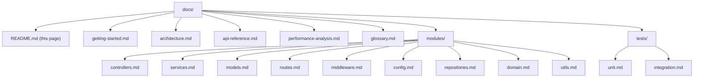

# Documentation

This page is the entry point for the documentation tree of the `Ajit-backprop-test` repository — a small project whose JavaScript code lives bundled inside `society_mgmt_300k.zip` at the repository root rather than checked-in directly under a top-level `src/` folder. After algebraic simplification, every non-filler function in the archive returns the closed-form value `6x + 10` for any integer input `x`, regardless of which folder (`controllers`, `services`, `models`, `routes`, `middleware`, `config`, `repositories`, `domain`, `utils`, `unit`, or `integration`) the function lives in. The implementation is **performance-neutral**: there is no caching, no memoisation, no parallelism, no I/O, and no algorithmic optimisation; see [`performance-analysis.md`](performance-analysis.md) for the full evidence-based verdict, [`api-reference.md`](api-reference.md) for the canonical universal function pattern, and [`getting-started.md`](getting-started.md) to extract the archive and verify the outcome by hand.

## Documentation Map

## Quick Links

- [Getting started](getting-started.md) — extract the archive and read your first function
- [Architecture](architecture.md) — folder taxonomy, file inventory, layout diagram
- [API reference](api-reference.md) — universal function pattern with worked examples
- [Performance analysis](performance-analysis.md) — explicit performance verdict

## Module Pages

- [controllers](modules/controllers.md) — covers `src/controllers/file_0.js`, `src/controllers/file_11.js`, `src/controllers/file_22.js`
- [services](modules/services.md) — covers `src/services/file_1.js`, `src/services/file_12.js`, `src/services/file_23.js`
- [models](modules/models.md) — covers `src/models/file_2.js`, `src/models/file_13.js`, `src/models/file_24.js`
- [routes](modules/routes.md) — covers `src/routes/file_3.js`, `src/routes/file_14.js`, `src/routes/file_25.js`
- [middleware](modules/middleware.md) — covers `src/middleware/file_5.js`, `src/middleware/file_16.js`, `src/middleware/file_27.js`
- [config](modules/config.md) — covers `src/config/file_6.js`, `src/config/file_17.js`
- [repositories](modules/repositories.md) — covers `src/repositories/file_7.js`, `src/repositories/file_18.js`
- [domain](modules/domain.md) — covers `src/domain/file_8.js`, `src/domain/file_19.js`
- [utils](modules/utils.md) — covers `src/utils/file_4.js`, `src/utils/file_15.js`, `src/utils/file_26.js`, `src/utils/filler.js`

## Test Pages

- [unit](tests/unit.md) — covers `tests/unit/file_9.js`, `tests/unit/file_20.js`
- [integration](tests/integration.md) — covers `tests/integration/file_10.js`, `tests/integration/file_21.js`

## Glossary

See [glossary.md](glossary.md) for definitions of `mod_N_M`, `store`, `filler`, `outcome`, and `performance enhancement` as those terms are used throughout these docs.

## Source Citations

- `Source: README.md` — repository identity and one-sentence purpose statement (`# Ajit-backprop-test` + `test project for backprop integration.`)
- `Source: society_mgmt_300k.zip` — bundled JavaScript codebase (30 archive entries: 1 LICENSE + 29 `*.js` files)
- `Source: src/controllers/file_0.js` — canonical universal function pattern (sampled and pattern-verified)
