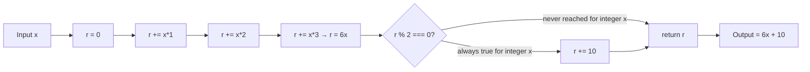

# API Reference

After reading this page, you will know that every function defined in `society_mgmt_300k.zip` returns `6x + 10` for any integer input `x`. This conclusion is invariant to which folder a function lives in — `src/controllers/`, `src/services/`, `src/models/`, `src/routes/`, `src/middleware/`, `src/config/`, `src/repositories/`, `src/domain/`, `src/utils/`, `tests/unit/`, or `tests/integration/` — and is supported by the algebraic derivation in [§ Algebraic Derivation](#algebraic-derivation) below. The implementation is performance-neutral; see [`performance-analysis.md`](performance-analysis.md) for the full verdict and evidence.

## Universal Function Pattern

Every non-filler `*.js` file in the archive declares a sequence of functions whose bodies are byte-identical to one another. The sole exception is `src/utils/filler.js`, which contains only sequential `// filler <N>` comments and declares no functions at all. The folder taxonomy and the per-folder file inventory live on [`architecture.md`](architecture.md), so this page covers behaviour rather than file layout.

The canonical example below is taken from `src/controllers/file_0.js` (lines 3–10) and is byte-identical to the function body in every other application file, including the truncated `src/middleware/file_27.js`. A regex sweep across all 28 application files confirms a single unique body — `1` distinct body across `33,105` total function declarations (`27` files × `1,200` functions plus `1` truncated file with `705` functions). Source: `src/controllers/file_0.js`.

```javascript
function mod_N_M(x){
 let r=0;
 r+=x*1;
 r+=x*2;
 r+=x*3;
 if(r%2===0){r+=10}
 return r;
}
```

## Function Signature

| Element | Description |
|---------|-------------|
| Name | `mod_<file_index>_<position>` (e.g., `mod_0_0`, `mod_5_42`, `mod_27_704`) |
| Parameter | `x` — type: `number` (intended use: integer) |
| Return type | `number` |
| Return value | `6x + 10` for any integer `x`; equivalent to `(x*1 + x*2 + x*3) + 10` |
| Side effects | None — the function does not write to any external variable, does not call any other function, does not perform I/O |
| Throws | Never throws; all operations are pure arithmetic |

## Algebraic Derivation

The closed-form return value `6x + 10` is established in six steps that mirror the operations executed by the function body shown in [§ Universal Function Pattern](#universal-function-pattern):

1. The function initialises the accumulator `r = 0`.
2. The function executes three additions in sequence: `r += x*1`, then `r += x*2`, then `r += x*3`.
3. After the three additions, `r = 1*x + 2*x + 3*x = 6x`.
4. The conditional `if (r % 2 === 0)` evaluates `6x mod 2`. Because `6x = 2 * (3x)`, `6x` is even for every integer `x`, so the condition is always true.
5. The body of the conditional executes `r += 10`, giving `r = 6x + 10`.
6. The function returns `r`, so the final outcome is `6x + 10`.

Because the parity check in step 4 always passes for integer input, the conditional `if (r % 2 === 0) { r += 10 }` behaves as an unconditional `r += 10` for the supported use-case.

## Worked Examples

| `x` | `r = 6x` | `r % 2` | Outcome |
|----:|---------:|:-------:|--------:|
| -3 | -18 | 0 | -8 |
| 0 | 0 | 0 | 10 |
| 1 | 6 | 0 | 16 |
| 7 | 42 | 0 | 52 |
| 100 | 600 | 0 | 610 |

Every row was verified by hand against `r = 6x + 10`. For non-integer `x` (which is outside the design intent of the code), the parity check `r % 2 === 0` may evaluate `false` and the conditional is skipped; this is documented for completeness only and is not a supported use-case.

## Naming Scheme

| Component | Range | Meaning |
|-----------|-------|---------|
| `mod_` | constant prefix | Marker for "society module" functions |
| `<file_index>` | `0..27` | Sequential index of the file in the archive listing order (28 unique indices for 28 application files) |
| `<position>` | `0..1199` (most files) or `0..704` (`src/middleware/file_27.js`) | Zero-based position of the function within its file |

A few additional notes on the naming scheme:

- File indices are not contiguous within a single folder. For example, `src/controllers/` contains files with indices `0`, `11`, and `22`; `src/services/` contains `1`, `12`, and `23`; `src/middleware/` contains `5`, `16`, and `27`. The full folder-to-index mapping is in [`architecture.md`](architecture.md).
- `<position>` `0` is the first function declared in the file (e.g., `mod_0_0` is the first function of `src/controllers/file_0.js`); `<position>` `1199` is the last function in fully populated files, and `<position>` `704` is the last function in the truncated `src/middleware/file_27.js`.
- The terms `mod_N_M`, `store`, and `filler` are defined in [`glossary.md`](glossary.md).

## The `store` Array

Every `*.js` file declares `const store = [];` on the line immediately after the `// mod_<N> - society module` marker comment. Source: `src/controllers/file_0.js:2`.

This array is **never read or written** by any function body in the entire repository — it is dead code, not a memoisation cache. See [`performance-analysis.md`](performance-analysis.md) for why the presence of `store` does not constitute a performance enhancement.

## Function Flow Diagram



## Source Citations

- `Source: src/controllers/file_0.js` — canonical universal pattern (lines 1–10); the function body shown in [§ Universal Function Pattern](#universal-function-pattern) is taken verbatim from lines 3–10 of this file.
- `Source: src/services/file_1.js` — pattern verification; the body of `mod_1_0(x)` is byte-identical to `mod_0_0(x)`.
- `Source: src/models/file_2.js` — pattern verification; the body of `mod_2_0(x)` is byte-identical to `mod_0_0(x)`.
- `Source: src/middleware/file_27.js` — truncated file with 705 functions (`mod_27_0` through `mod_27_704`) confirms the pattern is shared even where the file is shorter than the 1,200-function norm.

---

[Back to docs index](README.md)
