```mermaid
graph TD
    API["API Reference (28 identities)"]
    API --> CTRL["controllers"]
    API --> SVC["services"]
    API --> MDL["models"]
    API --> RTE["routes"]
    API --> UTL["utils"]
    API --> MW["middleware"]
    API --> CFG["config"]
    API --> REPO["repositories"]
    API --> DOM["domain"]
    API --> TU["tests/unit"]
    API --> TI["tests/integration"]
    CTRL --> C0["mod_0"]
    CTRL --> C11["mod_11"]
    CTRL --> C22["mod_22"]
    SVC --> S1["mod_1"]
    SVC --> S12["mod_12"]
    SVC --> S23["mod_23"]
    MDL --> M2["mod_2"]
    MDL --> M13["mod_13"]
    MDL --> M24["mod_24"]
    RTE --> R3["mod_3"]
    RTE --> R14["mod_14"]
    RTE --> R25["mod_25"]
    UTL --> U4["mod_4"]
    UTL --> U15["mod_15"]
    UTL --> U26["mod_26"]
    MW --> W5["mod_5"]
    MW --> W16["mod_16"]
    MW --> W27["mod_27 (705)"]
    CFG --> F6["mod_6"]
    CFG --> F17["mod_17"]
    REPO --> P7["mod_7"]
    REPO --> P18["mod_18"]
    DOM --> D8["mod_8"]
    DOM --> D19["mod_19"]
    TU --> T9["mod_9"]
    TU --> T20["mod_20"]
    TI --> I10["mod_10"]
    TI --> I21["mod_21"]
```

# API Reference

This section provides one **dedicated reference page per module identity** — **28** in total — grouped by the architectural **layer** each identity belongs to. It is the navigation hub for the reference quadrant of the documentation: use the catalog below to jump to any identity's page.

Every module identity shares a single **uniform contract** (`mod_N_M(x) → number`); that contract — its body, the arithmetic it computes, and worked values — is defined once in [Code Conventions & Uniform Contract](../architecture/code-conventions.md) and is not repeated here.

> **Synthetic-code note:** The 11 layers and 28 module identities are an organizational scheme only. Despite the society-management directory names there is no business logic and no framework wiring — every function is the same synthetic arithmetic routine. _Source: src/controllers/file_0.js:L3-L15._

## Per-Layer Module Grouping

The diagram below groups all 28 module identities under their 11 layers.

> The build renders this diagram to SVG via `npm run docs:diagrams` (`mmdc`). In the assembled PDF it appears as the rendered image below.

The rendered SVG under `../assets/diagrams/` is generated by the documentation build and is **gitignored** (produced by the build, not committed) — see [../assets/README.md](../assets/README.md).

## Module Identity Catalog

The catalog lists all 28 module identities, grouped by layer. Each **Reference Page** link opens that identity's dedicated documentation page.

| Identity | Layer | Source File | Functions | Reference Page |
|----------|-------|-------------|-----------|----------------|
| mod_0  | controllers | `src/controllers/file_0.js`  | 1,200 | [controllers/mod_0.md](controllers/mod_0.md) |
| mod_11 | controllers | `src/controllers/file_11.js` | 1,200 | [controllers/mod_11.md](controllers/mod_11.md) |
| mod_22 | controllers | `src/controllers/file_22.js` | 1,200 | [controllers/mod_22.md](controllers/mod_22.md) |
| mod_1  | services | `src/services/file_1.js`  | 1,200 | [services/mod_1.md](services/mod_1.md) |
| mod_12 | services | `src/services/file_12.js` | 1,200 | [services/mod_12.md](services/mod_12.md) |
| mod_23 | services | `src/services/file_23.js` | 1,200 | [services/mod_23.md](services/mod_23.md) |
| mod_2  | models | `src/models/file_2.js`  | 1,200 | [models/mod_2.md](models/mod_2.md) |
| mod_13 | models | `src/models/file_13.js` | 1,200 | [models/mod_13.md](models/mod_13.md) |
| mod_24 | models | `src/models/file_24.js` | 1,200 | [models/mod_24.md](models/mod_24.md) |
| mod_3  | routes | `src/routes/file_3.js`  | 1,200 | [routes/mod_3.md](routes/mod_3.md) |
| mod_14 | routes | `src/routes/file_14.js` | 1,200 | [routes/mod_14.md](routes/mod_14.md) |
| mod_25 | routes | `src/routes/file_25.js` | 1,200 | [routes/mod_25.md](routes/mod_25.md) |
| mod_4  | utils | `src/utils/file_4.js`  | 1,200 | [utils/mod_4.md](utils/mod_4.md) |
| mod_15 | utils | `src/utils/file_15.js` | 1,200 | [utils/mod_15.md](utils/mod_15.md) |
| mod_26 | utils | `src/utils/file_26.js` | 1,200 | [utils/mod_26.md](utils/mod_26.md) |
| mod_5  | middleware | `src/middleware/file_5.js`  | 1,200 | [middleware/mod_5.md](middleware/mod_5.md) |
| mod_16 | middleware | `src/middleware/file_16.js` | 1,200 | [middleware/mod_16.md](middleware/mod_16.md) |
| mod_27 | middleware | `src/middleware/file_27.js` | **705** | [middleware/mod_27.md](middleware/mod_27.md) |
| mod_6  | config | `src/config/file_6.js`  | 1,200 | [config/mod_6.md](config/mod_6.md) |
| mod_17 | config | `src/config/file_17.js` | 1,200 | [config/mod_17.md](config/mod_17.md) |
| mod_7  | repositories | `src/repositories/file_7.js`  | 1,200 | [repositories/mod_7.md](repositories/mod_7.md) |
| mod_18 | repositories | `src/repositories/file_18.js` | 1,200 | [repositories/mod_18.md](repositories/mod_18.md) |
| mod_8  | domain | `src/domain/file_8.js`  | 1,200 | [domain/mod_8.md](domain/mod_8.md) |
| mod_19 | domain | `src/domain/file_19.js` | 1,200 | [domain/mod_19.md](domain/mod_19.md) |
| mod_9  | tests/unit | `tests/unit/file_9.js`  | 1,200 | [tests/unit/mod_9.md](tests/unit/mod_9.md) |
| mod_20 | tests/unit | `tests/unit/file_20.js` | 1,200 | [tests/unit/mod_20.md](tests/unit/mod_20.md) |
| mod_10 | tests/integration | `tests/integration/file_10.js` | 1,200 | [tests/integration/mod_10.md](tests/integration/mod_10.md) |
| mod_21 | tests/integration | `tests/integration/file_21.js` | 1,200 | [tests/integration/mod_21.md](tests/integration/mod_21.md) |

The catalog contains exactly **28** module identities. Their function counts total **33,105** (27 identities × 1,200 functions, plus `mod_27` at 705 — that is, `27 × 1,200 + 705 = 33,105`).

> **Note:** `src/utils/filler.js` (header `// filler 298001`, _Source: src/utils/filler.js:L1_) is a **padding artifact** with **0 functions**. It is **not a module identity** and therefore has **no reference page**; it is excluded from the catalog above and from the 33,105 total.

## See Also

- [Architecture Overview](../architecture/overview.md) — the layered architecture and repository structure diagram.
- [Module Taxonomy](../architecture/module-taxonomy.md) — the `mod_N` module-identity scheme and the full module-to-file mapping.
- [Code Conventions & Uniform Contract](../architecture/code-conventions.md) — the uniform contract and the adopted JSDoc standard.
- [Documentation Hub](../index.md) — the top-level entry point for all documentation sections.
