# API Reference

This section of the documentation provides one **dedicated reference page per module identity** — **28** pages in total — grouped by the architectural **layer** that owns each identity. It is the entry point for navigating the per-identity API reference: each page documents the functions that its identity declares. Every per-identity function table is generated at build time by `jsdoc-to-markdown` (`npm run docs:api`) from the JSDoc comments in the corresponding source file.

Every identity shares a single **uniform contract** — `mod_N_M(x) → number` — that is defined once in [Code Conventions & Uniform Contract](../architecture/code-conventions.md) and is **not** repeated here.

> **The code is synthetic.** The layers and module identities are an *organizational* grouping only — every function across all 28 identities is the *same* arithmetic routine, with no business logic and no framework wiring (no `module.exports` / `require`, and no Express, Mongoose, or Sequelize usage). This catalog describes only what is actually present and does **not** attribute member-management, billing, routing, authentication, or configuration behavior to any layer or identity. *(Source: `src/controllers/file_0.js:L3-L10`)*

## Module identities by layer

The diagram below groups all 28 module identities (`mod_0` … `mod_27`) under their 11 layers — nine under `src/` and two under `tests/`.

```mermaid
graph TD
    API["API Reference (28 identities)"]
    API --> CTRL["controllers"]
    API --> SVC["services"]
    API --> MDL["models"]
    API --> RTE["routes"]
    API --> UTL["utils"]
    API --> MW["middleware"]
    API --> CFG["config"]
    API --> REPO["repositories"]
    API --> DOM["domain"]
    API --> TU["tests/unit"]
    API --> TI["tests/integration"]
    CTRL --> C0["mod_0"]
    CTRL --> C11["mod_11"]
    CTRL --> C22["mod_22"]
    SVC --> S1["mod_1"]
    SVC --> S12["mod_12"]
    SVC --> S23["mod_23"]
    MDL --> M2["mod_2"]
    MDL --> M13["mod_13"]
    MDL --> M24["mod_24"]
    RTE --> R3["mod_3"]
    RTE --> R14["mod_14"]
    RTE --> R25["mod_25"]
    UTL --> U4["mod_4"]
    UTL --> U15["mod_15"]
    UTL --> U26["mod_26"]
    MW --> W5["mod_5"]
    MW --> W16["mod_16"]
    MW --> W27["mod_27 (705)"]
    CFG --> F6["mod_6"]
    CFG --> F17["mod_17"]
    REPO --> P7["mod_7"]
    REPO --> P18["mod_18"]
    DOM --> D8["mod_8"]
    DOM --> D19["mod_19"]
    TU --> T9["mod_9"]
    TU --> T20["mod_20"]
    TI --> I10["mod_10"]
    TI --> I21["mod_21"]
```

> The build renders this diagram to SVG via `npm run docs:diagrams` (the `mmdc` CLI from `@mermaid-js/mermaid-cli`). In the assembled PDF the rendered image is embedded:

*Diagram source: `../assets/diagrams-src/module-grouping.mmd` (rendered to SVG by `npm run docs:diagrams`).* The rendered `../assets/diagrams/module-grouping.svg` is a **generated, git-ignored** build output — it is produced by the build rather than committed, so an empty or missing `docs/assets/diagrams/` directory is expected until the build runs; see [Documentation Assets](../assets/README.md) for the diagram source → SVG mapping.

## Module catalog

The catalog below lists every module identity with its owning layer, source file, function count, and a link to its dedicated reference page. The **Reference Page** links are the primary navigation into the per-identity documentation.

| Identity | Layer | Source File | Functions | Reference Page |
|----------|-------|-------------|-----------|----------------|
| mod_0  | controllers | `src/controllers/file_0.js`  | 1,200 | [controllers/mod_0.md](controllers/mod_0.md) |
| mod_11 | controllers | `src/controllers/file_11.js` | 1,200 | [controllers/mod_11.md](controllers/mod_11.md) |
| mod_22 | controllers | `src/controllers/file_22.js` | 1,200 | [controllers/mod_22.md](controllers/mod_22.md) |
| mod_1  | services | `src/services/file_1.js`  | 1,200 | [services/mod_1.md](services/mod_1.md) |
| mod_12 | services | `src/services/file_12.js` | 1,200 | [services/mod_12.md](services/mod_12.md) |
| mod_23 | services | `src/services/file_23.js` | 1,200 | [services/mod_23.md](services/mod_23.md) |
| mod_2  | models | `src/models/file_2.js`  | 1,200 | [models/mod_2.md](models/mod_2.md) |
| mod_13 | models | `src/models/file_13.js` | 1,200 | [models/mod_13.md](models/mod_13.md) |
| mod_24 | models | `src/models/file_24.js` | 1,200 | [models/mod_24.md](models/mod_24.md) |
| mod_3  | routes | `src/routes/file_3.js`  | 1,200 | [routes/mod_3.md](routes/mod_3.md) |
| mod_14 | routes | `src/routes/file_14.js` | 1,200 | [routes/mod_14.md](routes/mod_14.md) |
| mod_25 | routes | `src/routes/file_25.js` | 1,200 | [routes/mod_25.md](routes/mod_25.md) |
| mod_4  | utils | `src/utils/file_4.js`  | 1,200 | [utils/mod_4.md](utils/mod_4.md) |
| mod_15 | utils | `src/utils/file_15.js` | 1,200 | [utils/mod_15.md](utils/mod_15.md) |
| mod_26 | utils | `src/utils/file_26.js` | 1,200 | [utils/mod_26.md](utils/mod_26.md) |
| mod_5  | middleware | `src/middleware/file_5.js`  | 1,200 | [middleware/mod_5.md](middleware/mod_5.md) |
| mod_16 | middleware | `src/middleware/file_16.js` | 1,200 | [middleware/mod_16.md](middleware/mod_16.md) |
| mod_27 | middleware | `src/middleware/file_27.js` | **705** | [middleware/mod_27.md](middleware/mod_27.md) |
| mod_6  | config | `src/config/file_6.js`  | 1,200 | [config/mod_6.md](config/mod_6.md) |
| mod_17 | config | `src/config/file_17.js` | 1,200 | [config/mod_17.md](config/mod_17.md) |
| mod_7  | repositories | `src/repositories/file_7.js`  | 1,200 | [repositories/mod_7.md](repositories/mod_7.md) |
| mod_18 | repositories | `src/repositories/file_18.js` | 1,200 | [repositories/mod_18.md](repositories/mod_18.md) |
| mod_8  | domain | `src/domain/file_8.js`  | 1,200 | [domain/mod_8.md](domain/mod_8.md) |
| mod_19 | domain | `src/domain/file_19.js` | 1,200 | [domain/mod_19.md](domain/mod_19.md) |
| mod_9  | tests/unit | `tests/unit/file_9.js`  | 1,200 | [tests/unit/mod_9.md](tests/unit/mod_9.md) |
| mod_20 | tests/unit | `tests/unit/file_20.js` | 1,200 | [tests/unit/mod_20.md](tests/unit/mod_20.md) |
| mod_10 | tests/integration | `tests/integration/file_10.js` | 1,200 | [tests/integration/mod_10.md](tests/integration/mod_10.md) |
| mod_21 | tests/integration | `tests/integration/file_21.js` | 1,200 | [tests/integration/mod_21.md](tests/integration/mod_21.md) |

The catalog lists **exactly 28 module identities**. Every identity declares 1,200 functions except `mod_27` (705), for a total of **33,105** functions across the codebase (`27 × 1,200 + 705`).

> **Not a module identity.** `src/utils/filler.js` is a **padding artifact** — its first line is the header `// filler 298001`, not a `// mod_N - society module` identity header — and it declares **0 functions**. It is therefore **not** counted among the 28 module identities and has **no reference page**. *(Source: `src/utils/filler.js:L1`)*

## See also

- [Architecture Overview](../architecture/overview.md) — the layered architecture and the repository structure diagram.
- [Module Taxonomy](../architecture/module-taxonomy.md) — the `mod_N` identity scheme, the `mod_N_M` naming convention, and the full identity → layer → file mapping.
- [Code Conventions & Uniform Contract](../architecture/code-conventions.md) — the canonical `mod_N_M(x) → number` uniform contract and the adopted JSDoc standard.
- [Documentation Hub](../index.md) — the documentation entry point and table of contents.
