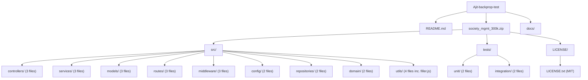

# Architecture

This page documents the folder layout of the `Ajit-backprop-test` repository — specifically the contents of the bundled archive `society_mgmt_300k.zip`. Despite folder names that suggest a layered Node.js application (`controllers`, `services`, `models`, `routes`, `middleware`, `config`, `repositories`, `domain`, `utils`, `unit`, `integration`), every function in every non-filler `*.js` file shares the **same body** and returns `6x + 10` for any integer input `x`. The implementation is **performance-neutral**: no folder contains caching, concurrency, or algorithmic optimisation. The full closed-form derivation lives in [`api-reference.md`](api-reference.md), and the explicit performance verdict lives in [`performance-analysis.md`](performance-analysis.md). This page is the single source of truth for the **folder taxonomy table**, the **per-folder file inventory**, and the **file-layout diagram**; everything else is a cross-link.

## Folder Taxonomy Overview

The archive `society_mgmt_300k.zip` unpacks into a tree rooted at `src/` (application code) and `tests/` (test-shaped files), plus a sibling `LICENSE/` folder containing the MIT License (2026). The folder names themselves follow canonical Node.js conventions — `controllers`, `services`, `models`, `routes`, `middleware`, `config`, `repositories`, `domain`, `utils` under `src/`, and `unit`, `integration` under `tests/` — so a reader familiar with layered Node.js architectures will recognise the shape immediately.

Per Rule R-6 (Folder-Name vs. Behaviour Disclosure), readers must understand up front that the **runtime behaviour** of every file in this repository matches a single arithmetic pattern — documented authoritatively in [`api-reference.md`](api-reference.md) — that does **not** implement any of those conventional roles. There are no HTTP handlers, no service interfaces, no schemas, no routes, no middleware, no env-var loaders, no data-access methods, no domain entities, no assertions, and no test harnesses. The folder names describe **where** functions live, not **what** they do; the behaviour is identical across every folder. The detailed mapping from folder name to actual content is in [Conventional Meaning vs. Actual Behaviour](#conventional-meaning-vs-actual-behaviour) below.

## Folder Inventory

| Folder | File Count | Files | Conventional Role |
|--------|-----------:|-------|-------------------|
| `src/controllers/` | 3 | `file_0.js`, `file_11.js`, `file_22.js` | HTTP request handlers / orchestration |
| `src/services/` | 3 | `file_1.js`, `file_12.js`, `file_23.js` | Business-logic dispatch |
| `src/models/` | 3 | `file_2.js`, `file_13.js`, `file_24.js` | Data schemas / ORM models |
| `src/routes/` | 3 | `file_3.js`, `file_14.js`, `file_25.js` | URL → handler wiring |
| `src/middleware/` | 3 | `file_5.js`, `file_16.js`, `file_27.js` | Request/response interceptors |
| `src/config/` | 2 | `file_6.js`, `file_17.js` | Environment / runtime configuration |
| `src/repositories/` | 2 | `file_7.js`, `file_18.js` | Data-access methods / queries |
| `src/domain/` | 2 | `file_8.js`, `file_19.js` | Domain entities / invariants |
| `src/utils/` | 4 | `file_4.js`, `file_15.js`, `file_26.js`, `filler.js` | Cross-cutting helpers |
| `tests/unit/` | 2 | `file_9.js`, `file_20.js` | Unit tests with assertions |
| `tests/integration/` | 2 | `file_10.js`, `file_21.js` | Integration tests with harnesses |
| `LICENSE/` | 1 | `LICENSE.txt` | MIT License (2026) |

The "Conventional Role" column describes what folders of these names typically contain in Node.js projects; see [Conventional Meaning vs. Actual Behaviour](#conventional-meaning-vs-actual-behaviour) below for what the code in this repository actually does.

## Conventional Meaning vs. Actual Behaviour

The bullets below pair each folder's conventional Node.js role with what the present code actually contains. Every "Actual" entry is grounded in agent-verified counts from `zipfile.namelist()`, `wc -l`, and `grep -c "^function mod_"`. The universal function pattern referenced repeatedly below — `function mod_N_M(x)` returning `6x + 10` — is documented authoritatively once in [`api-reference.md`](api-reference.md); this page does not restate the body.

- **`src/controllers/`** — *Conventional:* HTTP request handlers (typically receive `(req, res)` and call services). *Actual:* 3 files × 1,200 arithmetic functions of the form `mod_N_M(x)` that all return `6x + 10` for integer `x`; no Express/Koa/Fastify handlers, no `req`/`res` parameters, and no routing decorators are present.
- **`src/services/`** — *Conventional:* business-logic dispatchers invoked by controllers. *Actual:* 3 files × 1,200 arithmetic functions of the form `mod_N_M(x)` that all return `6x + 10` for integer `x`; no domain operations, transactions, or service interfaces are present.
- **`src/models/`** — *Conventional:* Mongoose/Sequelize/Prisma models, plain-data schemas, or DTOs. *Actual:* 3 files × 1,200 arithmetic functions of the form `mod_N_M(x)` that all return `6x + 10` for integer `x`; no schema definitions, no ORM imports, and no validation rules are present.
- **`src/routes/`** — *Conventional:* URL-path tables that wire HTTP methods to handlers. *Actual:* 3 files × 1,200 arithmetic functions of the form `mod_N_M(x)` that all return `6x + 10` for integer `x`; no `app.get`/`router.post` calls and no path strings are present.
- **`src/middleware/`** — *Conventional:* `(req, res, next) => {...}` interceptors. *Actual:* 3 files containing arithmetic functions of the form `mod_N_M(x)` that all return `6x + 10` for integer `x`; `file_5.js` and `file_16.js` contain 1,200 functions each, while `file_27.js` is truncated to 705 functions (6,347 LOC); no middleware signatures are present.
- **`src/config/`** — *Conventional:* env-var readers, secret loaders, runtime flags. *Actual:* 2 files × 1,200 arithmetic functions of the form `mod_N_M(x)` that all return `6x + 10` for integer `x`; no `process.env` access and no secret references are present.
- **`src/repositories/`** — *Conventional:* data-access methods (query helpers, ORM repository classes). *Actual:* 2 files × 1,200 arithmetic functions of the form `mod_N_M(x)` that all return `6x + 10` for integer `x`; no DB drivers and no SQL strings are present.
- **`src/domain/`** — *Conventional:* domain entities, value objects, and invariants. *Actual:* 2 files × 1,200 arithmetic functions of the form `mod_N_M(x)` that all return `6x + 10` for integer `x`; no entity classes and no invariant checks are present.
- **`src/utils/`** — *Conventional:* cross-cutting helpers (string utils, date math, etc.). *Actual:* 3 application files × 1,200 arithmetic functions of the form `mod_N_M(x)` that all return `6x + 10` for integer `x`, plus `filler.js`, which contains 1,999 lines of `// filler <N>` comments only and declares no functions and no statements (see [Key Observations](#key-observations) for the line-number range).
- **`tests/unit/`** — *Conventional:* unit tests using Jest/Mocha/Vitest with assertions. *Actual:* 2 files × 1,200 arithmetic functions of the form `mod_N_M(x)` that all return `6x + 10` for integer `x`; no `describe`/`it`/`expect`/`assert` calls, no test framework imported, and not exercised by any runner in this repository.
- **`tests/integration/`** — *Conventional:* integration tests against a running system or test harness. *Actual:* 2 files × 1,200 arithmetic functions of the form `mod_N_M(x)` that all return `6x + 10` for integer `x`; no integration harness, no fixtures, and no setup/teardown are present.

## File Layout Diagram

## Key Observations

- **No module system.** A repository-wide grep for `module.exports`, `require(`, and `import ` returned zero matches across `src/**` and `tests/**`; the files do not export or import anything. As a consequence, the architecture is a flat collection of standalone files rather than a graph of CommonJS or ES modules — there are no inter-file dependencies to draw, and no public API surface beyond the function declarations themselves.
- **Dead `store` variable.** Every `*.js` file except `src/utils/filler.js` declares `const store = [];` at module top — that is, 28 of the 29 `*.js` files in the archive. The array is never read or written by any function body, so it has no runtime effect; it is dead code. The performance implications of this fact are documented in [`performance-analysis.md`](performance-analysis.md).
- **Filler file.** `src/utils/filler.js` is the sole exception to the patterns above: it contains 1,999 lines of `// filler <N>` single-line comments numbered sequentially from `// filler 298001` to `// filler 299999`, declares no `store`, declares no functions, and contains zero JavaScript statements. Its only purpose is to contribute to the repository's nominal 300,000 line count.

## Module Pages Index

- [controllers](modules/controllers.md)
- [services](modules/services.md)
- [models](modules/models.md)
- [routes](modules/routes.md)
- [middleware](modules/middleware.md)
- [config](modules/config.md)
- [repositories](modules/repositories.md)
- [domain](modules/domain.md)
- [utils](modules/utils.md)
- [tests/unit](tests/unit.md)
- [tests/integration](tests/integration.md)

## Source Citations

- `Source: society_mgmt_300k.zip` — archive listing produced by `zipfile.ZipFile('society_mgmt_300k.zip').namelist()`; 30 entries verified (1 LICENSE + 29 `*.js`).
- `Source: src/controllers/file_0.js` — canonical pattern carrier; line 1 declares `// mod_0 - society module`, line 2 declares `const store = [];`, lines 3+ declare `function mod_0_0(x) … function mod_0_1199(x)`.
- `Source: src/utils/filler.js` — comment-only filler from `// filler 298001` (line 1) to `// filler 299999` (line 1,999), confirmed by `head -1` and `tail -1`.
- `Source: src/middleware/file_27.js` — truncated module with reduced function count (705 functions, 6,347 LOC), confirmed by `grep -c "^function mod_" src/middleware/file_27.js` and `wc -l src/middleware/file_27.js`.

[Back to docs index](README.md)
