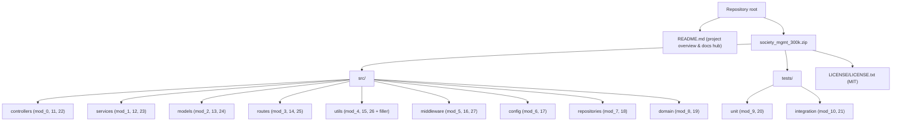

# Architecture Overview

The Society Management codebase is organized into an **11-layer directory taxonomy** under `src/` and `tests/`, where each **layer** is simply a directory that groups **module-identity** files. This page describes the system's shape — the layers and the identities they group, the explicit fact that the layers carry **no inter-layer wiring**, and the repository/layer structure diagram. It is the entry point to the architecture documentation; the identity scheme and the shared function behavior are defined on the sibling pages and referenced (not repeated) here.

> **The code is synthetic.** Despite the society-management directory names (`controllers`, `services`, `models`, …), there is **no business logic and no framework wiring**: every function is the same arithmetic routine, and there are no `import`/`export`, `require`/`module.exports`, or Express/Mongoose/Sequelize statements anywhere. The layers are **organizational only**. The shared **uniform contract** is defined canonically in [Code Conventions](./code-conventions.md) and is not repeated here.

## Layered Taxonomy

The codebase is partitioned into **11 layers** — **9** under `src/` and **2** under `tests/`. Each layer is a directory that groups one or more **module identities**, where a module identity is a single file whose first line declares it with the header `// mod_N - society module`. The tables below give the layer-first view: each layer and the module identities it groups. *(Header convention — `Source: src/controllers/file_0.js:L1`.)*

### Source Layers (`src/`)

| Layer (directory) | Grouped module identities |
|-------------------|---------------------------|
| `controllers/` | mod_0, mod_11, mod_22 |
| `services/` | mod_1, mod_12, mod_23 |
| `models/` | mod_2, mod_13, mod_24 |
| `routes/` | mod_3, mod_14, mod_25 |
| `utils/` | mod_4, mod_15, mod_26 (plus `filler.js`, a padding artifact) |
| `middleware/` | mod_5, mod_16, mod_27 |
| `config/` | mod_6, mod_17 |
| `repositories/` | mod_7, mod_18 |
| `domain/` | mod_8, mod_19 |

### Test Layers (`tests/`)

| Layer (directory) | Grouped module identities |
|-------------------|---------------------------|
| `tests/unit/` | mod_9, mod_20 |
| `tests/integration/` | mod_10, mod_21 |

The layer names follow a conventional society-management application taxonomy, but — as noted above — they are **organizational only** and do not imply any framework behavior. The `utils/` layer additionally contains `src/utils/filler.js`, which carries the header `// filler 298001` (rather than a `// mod_N - society module` header) and declares no functions; it is a **padding artifact**, not a module identity. For the complete identity → file mapping, the `mod_N_M` naming convention, and per-file function counts, see [Module Taxonomy](./module-taxonomy.md); for the shared function body, see [Code Conventions](./code-conventions.md).

## No Inter-Layer Wiring

> **The layers do not reference one another. There is no inter-layer wiring of any kind.**

This is a load-bearing fact about the codebase. Concretely, across every file in `src/` and `tests/`:

- There are **no `import` or `export` statements** and **no `require(...)` or `module.exports`** — modules are neither imported nor exported.
- There is **no framework usage** — no Express, Mongoose, or Sequelize (or any other framework) is referenced anywhere.
- Every function is a **file-scoped global** `mod_N_M(x)` declaration; a function in one layer cannot call a function in another, because nothing is imported or exported.

As a result, each module-identity file is a **self-contained** set of file-scoped global functions, and the layer directories provide grouping and naming only — not a wired, executable application. Readers should therefore **not** assume the directory names imply a running system (for example, controllers handling HTTP requests, routes mapping endpoints, or repositories persisting data); none of that wiring exists in the code.

## Repository & Layer Structure

The diagram below mirrors the repository layout: the root holds the project overview `README.md` (the documentation hub) and the delivered archive `society_mgmt_300k.zip`, whose extracted contents are the `src/` and `tests/` trees and the MIT `LICENSE/LICENSE.txt`. Each layer node is labeled with the module identities it groups.

> The build renders this diagram to SVG via `npm run docs:diagrams` (`mmdc`). In the assembled PDF it appears as the rendered image below.

The rendered SVG under `../assets/diagrams/` is **generated by the documentation build, not committed**: `docs/assets/diagrams/` is gitignored (only its `.gitkeep` placeholder is tracked). See [the documentation assets README](../assets/README.md) for how the diagram assets are produced.

## See Also

- [Module Taxonomy](./module-taxonomy.md) — the `mod_N` module-identity scheme, the `mod_N_M` naming convention, the full identity → file mapping, and per-file counts.
- [Code Conventions](./code-conventions.md) — the canonical **uniform contract** (the shared `mod_N_M(x) → number` body) and the adopted JSDoc standard.
- [Project Structure](../getting-started/project-structure.md) — the same layer taxonomy and module map, presented for newcomers.
- [API Reference](../api-reference/index.md) — the per-identity catalog with the generated API tables.
