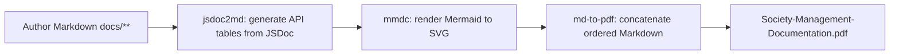

# PDF Export

This guide documents how the authored Markdown corpus under `docs/` is assembled into the single consolidated PDF deliverable, `docs/Society-Management-Documentation.pdf`, using a small npm toolchain orchestrated by `npm run docs:build`. It is also the **authoritative reference for the offline / sandbox fallback** and for regenerating only the PDF from already-built inputs — details that [Building the Docs & PDF](../getting-started/building-docs.md) intentionally defers to this page.

## The build pipeline

The documentation build is a **three-stage pipeline**. Each stage is exposed as an npm script in the root `package.json`; the three run in a strict, fixed order, and `docs:build` chains them together. The PDF is the final output of the last stage.

1. **`docs:api`** — runs `scripts/docs-api.js`, which drives `jsdoc-to-markdown` (the `jsdoc2md` CLI) over the source globs `src/**/*.js` and `tests/**/*.js` (configured by `jsdoc.json`, with `sourceType: "script"`), writing a per-identity API reference table into each `docs/api-reference/<layer>/mod_N.md` page.
2. **`docs:diagrams`** — runs `scripts/docs-diagrams.js`, which drives `mmdc` (the CLI from `@mermaid-js/mermaid-cli`) to render the Mermaid diagrams authored in the documentation pages to SVG under `../assets/diagrams/` (that is, `docs/assets/diagrams/`), so each diagram is available as an image for reliable embedding.
3. **`docs:pdf`** — runs `scripts/docs-pdf.js`, which reads the ordered `documents` list from `pdf.config.json`, concatenates those Markdown files in order (inserting a page break between top-level sections), and renders the assembled document into the single PDF with `md-to-pdf`, writing to the configured `dest`, `../Society-Management-Documentation.pdf`.

The three stages must run in the order `docs:api` → `docs:diagrams` → `docs:pdf`: the per-identity API tables must exist before the corpus is assembled, and the SVG diagrams must be on disk before the PDF renderer embeds them. `docs:build` enforces exactly this order:

```bash
npm run docs:api && npm run docs:diagrams && npm run docs:pdf
```

In practice you do not run the stages by hand. **`npm run docs:build` is the single command that produces the PDF** — it authors nothing itself (the Markdown is written first); it only assembles the already-authored corpus:

```bash
npm run docs:build
```

This is the command that satisfies the requirement to generate the PDF of the document *after* it is created: the Markdown corpus is authored first, then `docs:build` generates the API tables, renders the diagrams, and finally concatenates the ordered Markdown into the one PDF deliverable.

## Build → PDF pipeline diagram

The end-to-end flow — from the authored Markdown, through the API-table and diagram generation, to the concatenated PDF — is shown below:



This diagram is pre-rendered by `npm run docs:diagrams` to `../assets/diagrams/build-pipeline.svg` for embedding in the PDF. The assembled PDF embeds the rendered image rather than the raw Mermaid source, so the diagram displays reliably:


*Diagram source: the Mermaid fenced block on this page (`docs/guides/pdf-export.md`), rendered to `../assets/diagrams/build-pipeline.svg` by `npm run docs:diagrams`.* That rendered SVG is a **generated, git-ignored** build output — it is produced by the build rather than committed, so until the build runs `docs/assets/diagrams/` holds only its tracked `.gitkeep` placeholder; see [Documentation Assets](../assets/README.md) for the diagram source → SVG mapping.

## Page layout & output

The page layout is controlled entirely by the `pdf_options` and `css` keys in `pdf.config.json`. These settings apply uniformly to the whole document; there is no per-page override:

| Setting | Value |
| --- | --- |
| Document title | `Society Management Documentation` |
| Page format | A4 |
| Margins | ~20 mm on all sides (top, bottom, left, right) |
| Background graphics | enabled (`printBackground: true`) |
| Page breaks | a new page begins before each top-level heading (`h1 { page-break-before: always }`); the first heading is exempt (`h1:first-of-type { page-break-before: avoid }`) so the document does not open on a blank page |
| Tables | bordered with `border-collapse: collapse` and `th, td { border: 1px solid #ccc; padding: 4px 8px }`, plus header shading and zebra striping |
| Code highlighting | GitHub style (`highlight_style: "github"`) |

Because each authored Markdown page begins with exactly one top-level `#` heading, every section starts on a fresh page in the PDF, and each generated per-identity page begins on its own page at its `# mod_N` heading.

The pipeline writes exactly one output file, at the path fixed by the `dest` key in `pdf.config.json`:

```text
docs/Society-Management-Documentation.pdf
```

This PDF — [`../Society-Management-Documentation.pdf`](../Society-Management-Documentation.pdf) — is the committed deliverable. (The intermediate `docs/assets/diagrams/*.svg` images are regenerated build artifacts and are git-ignored; the PDF itself is tracked.)

## Fixed assembly order

The PDF concatenates the corpus in the fixed order defined by the `documents` array in `pdf.config.json`. The order is authoritative — it is declared in configuration, not derived from the filesystem — and the **28 per-identity pages are grouped by layer** in the exact layer order shown below:

1. `docs/index.md`
2. **getting-started** — `overview.md`, `project-structure.md`, `building-docs.md`
3. **architecture** — `overview.md`, `module-taxonomy.md`, `code-conventions.md`
4. **api-reference** — `index.md`, then the 28 per-identity reference pages, grouped by layer:
   1. **controllers** — `mod_0`, `mod_11`, `mod_22`
   2. **services** — `mod_1`, `mod_12`, `mod_23`
   3. **models** — `mod_2`, `mod_13`, `mod_24`
   4. **routes** — `mod_3`, `mod_14`, `mod_25`
   5. **utils** — `mod_4`, `mod_15`, `mod_26`
   6. **middleware** — `mod_5`, `mod_16`, `mod_27`
   7. **config** — `mod_6`, `mod_17`
   8. **repositories** — `mod_7`, `mod_18`
   9. **domain** — `mod_8`, `mod_19`
   10. **tests/unit** — `mod_9`, `mod_20`
   11. **tests/integration** — `mod_10`, `mod_21`
5. **guides** — `jsdoc-conventions.md`, `pdf-export.md`

This page, `pdf-export.md`, is therefore the **final document** in the consolidated PDF. To change the order or add a page, edit the `documents` array in `pdf.config.json`; the renderer follows that list verbatim.

## Offline / sandbox fallback

`npm install` is the only step in the entire build that needs network access. In an **offline sandbox with no network access**, the toolchain cannot be fetched, so `npm install` — and therefore `npm run docs:build` — cannot run there. The four tool versions are **pinned exactly** in `package.json` (`jsdoc@4.0.5`, `jsdoc-to-markdown@9.1.3`, `@mermaid-js/mermaid-cli@11.15.0`, `md-to-pdf@5.2.5`), so the networked build remains deterministic and reproducible once the packages are available — from a registry or a warmed npm cache.

When the pinned toolchain cannot be installed, the same PDF can be produced with an **equivalent local Markdown → PDF rendering** — for example a local pandoc, headless-Chromium, or Python-based renderer. The renderer itself does not matter; what matters is that the result is identical to the `docs:build` deliverable. Any fallback method **must**:

- **Concatenate the entire corpus in the exact fixed order** defined by the `documents` array in `pdf.config.json` (`index.md` first, `guides/pdf-export.md` last — the full order is listed above).
- **Pre-render every Mermaid diagram to an image** (SVG or PNG) and embed the image, so that no raw Mermaid code fence remains unrendered in the PDF.
- **Preserve tables, fenced code blocks, and the heading hierarchy** exactly as authored.
- **Insert a page break between top-level sections** (before each `#` heading), matching the `h1 { page-break-before: always }` behavior.
- **Write the output to exactly** `docs/Society-Management-Documentation.pdf` — the same `dest` as the npm build.
- **Not alter the authored Markdown** while rendering — the fallback only assembles and renders the existing files; it never edits them.

A fallback that meets these requirements yields the **same deliverable** as `npm run docs:build`: the same documents, in the same order, with the same content, written to the same output path.

### Regenerating only the PDF

Once `docs:api` and `docs:diagrams` have already produced their outputs — the per-identity API tables under `docs/api-reference/**` and the rendered SVGs under `docs/assets/diagrams/` — the PDF alone can be rebuilt without re-running the first two stages by invoking just the final stage:

```bash
npm run docs:pdf
```

This re-reads the `documents` list and `dest` from `pdf.config.json` and re-concatenates the already-built corpus into `docs/Society-Management-Documentation.pdf`. In an offline sandbox, the equivalent local renderer described above plays the role of this final stage: it reads the same ordered list and writes the same output file.

## See also

- [Building the Docs & PDF](../getting-started/building-docs.md) — prerequisites, installing the toolchain, and the per-stage command reference.
- [JSDoc Conventions](jsdoc-conventions.md) — the JSDoc rule and convention that feed `docs:api`.
- [Documentation Assets](../assets/README.md) — the generated `diagrams/` directory and the diagram source → SVG mapping.
