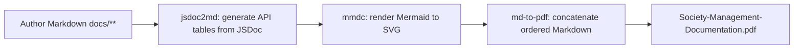

# PDF Export

This guide documents the end-to-end documentation build pipeline that assembles the authored Markdown corpus under `docs/` into the single consolidated deliverable, [`../Society-Management-Documentation.pdf`](../Society-Management-Documentation.pdf). The whole pipeline is driven by a small npm toolchain and orchestrated by one command — `npm run docs:build` — which generates the API reference tables, renders the diagrams, and then exports the ordered Markdown to PDF.

## The build pipeline

The documentation is produced in three ordered steps, each exposed as an npm script in the root `package.json`. The steps run **in strict order** — `docs:api` → `docs:diagrams` → `docs:pdf` — because each stage depends on the output of the previous one (the API tables and the rendered diagrams must exist before the Markdown is concatenated into the PDF).

The toolchain that backs these scripts is installed by `npm install` from the dev-dependencies pinned in `package.json` (exact versions, no ranges):

| Tool | Version | Role in the pipeline |
| --- | --- | --- |
| `jsdoc` | 4.0.5 | Parses the JSDoc comments on every function. |
| `jsdoc-to-markdown` | 9.1.3 | Provides the `jsdoc2md` CLI that emits the per-identity Markdown API tables. |
| `@mermaid-js/mermaid-cli` | 11.15.0 | Provides the `mmdc` CLI that renders Mermaid diagrams to SVG. |
| `md-to-pdf` | 5.2.5 | Concatenates the ordered Markdown corpus into the single consolidated PDF. |

### Step 1 — `docs:api` (generate the API reference tables)

Runs `jsdoc2md` (configured by `jsdoc.json`, whose source globs are `src/**/*.js` and `tests/**/*.js` with `sourceType: "script"`) to generate one API reference table per module identity and write it into the matching page under `docs/api-reference/**/mod_*.md`.

```bash
npm run docs:api
```

### Step 2 — `docs:diagrams` (render Mermaid diagrams to SVG)

Runs `mmdc` to pre-render every authored Mermaid diagram to SVG under [`../assets/diagrams/`](../assets/diagrams/) (i.e. `docs/assets/diagrams/`). Pre-rendering to SVG lets the diagrams embed reliably when the Markdown is exported to PDF.

```bash
npm run docs:diagrams
```

### Step 3 — `docs:pdf` (assemble the consolidated PDF)

Runs `md-to-pdf` with `--config-file pdf.config.json`, concatenating the ordered Markdown corpus listed in `pdf.config.json` into the single deliverable [`../Society-Management-Documentation.pdf`](../Society-Management-Documentation.pdf) (i.e. `docs/Society-Management-Documentation.pdf`).

```bash
npm run docs:pdf
```

### The single command — `docs:build`

`docs:build` orchestrates the three steps above, in order, so that the documentation is authored and generated first and then assembled into the PDF:

```bash
npm run docs:build
```

It is defined as `npm run docs:api && npm run docs:diagrams && npm run docs:pdf`. **`npm run docs:build` is the single command that yields the consolidated PDF.**

## Build → PDF pipeline diagram



This diagram is pre-rendered by `npm run docs:diagrams` to `../assets/diagrams/build-pipeline.svg` for embedding in the PDF.

## Page layout and output

The PDF page layout is defined by the `pdf_options` and `css` in `pdf.config.json`:

| Setting | Value |
| --- | --- |
| Page format | A4 |
| Margins | ~20mm — 20mm left and right; 25mm top and 22mm bottom to make room for the running header and footer |
| Backgrounds | `printBackground: true` |
| Header / footer | enabled; the footer shows `Page N of M` |
| Page breaks | a page break before each top-level heading (`h1 { page-break-before: always }`), except the very first heading (`h1:first-of-type { page-break-before: avoid }`) |
| Tables | `border-collapse: collapse`; cells are bordered `1px solid #d0d7de` and padded `6px 10px` |

Because every page in the corpus begins with a single top-level heading (`#`), the page-break-before rule starts each document on a fresh page in the assembled PDF.

The output path is exactly `docs/Society-Management-Documentation.pdf` — linked relatively from this page as [`../Society-Management-Documentation.pdf`](../Society-Management-Documentation.pdf).

## Fixed assembly order

The order in which the Markdown pages are concatenated into the PDF is fixed by the `documents` array in `pdf.config.json`. The corpus is assembled in exactly this order:

1. `index.md`
2. **getting-started/** — `overview.md`, `project-structure.md`, `building-docs.md`
3. **architecture/** — `overview.md`, `module-taxonomy.md`, `code-conventions.md`
4. **api-reference/** — `index.md`, then the 28 per-identity pages grouped by layer, in this exact layer order:
   - **controllers/** — `mod_0.md`, `mod_11.md`, `mod_22.md`
   - **services/** — `mod_1.md`, `mod_12.md`, `mod_23.md`
   - **models/** — `mod_2.md`, `mod_13.md`, `mod_24.md`
   - **routes/** — `mod_3.md`, `mod_14.md`, `mod_25.md`
   - **utils/** — `mod_4.md`, `mod_15.md`, `mod_26.md`
   - **middleware/** — `mod_5.md`, `mod_16.md`, `mod_27.md`
   - **config/** — `mod_6.md`, `mod_17.md`
   - **repositories/** — `mod_7.md`, `mod_18.md`
   - **domain/** — `mod_8.md`, `mod_19.md`
   - **tests/unit/** — `mod_9.md`, `mod_20.md`
   - **tests/integration/** — `mod_10.md`, `mod_21.md`
5. **guides/** — `jsdoc-conventions.md`, `pdf-export.md`

This page, `guides/pdf-export.md`, is the final document in the consolidated PDF. To change the order, edit the `documents` array in `pdf.config.json`; do not reorder anything by hand at build time.

## Offline / sandbox fallback

The offline sandbox has **no network access**, so `npm install` cannot run there and the npm scripts above cannot fetch the toolchain. For that reason the toolchain versions are **pinned in `package.json`** so that a networked build environment installs exactly the verified versions; the sandbox instead produces the same deliverable with an equivalent local renderer.

When building offline, produce the PDF with any **equivalent local Markdown → PDF renderer** (for example a local pandoc, headless-Chromium, or small Python rendering pipeline) that preserves the same ordering and the same content. Whatever method is used, it must:

- Concatenate **all** corpus files in the exact fixed order shown above (`index.md` first, `guides/pdf-export.md` last).
- **Pre-render every Mermaid diagram to an image** so that no raw fenced `mermaid` code blocks remain in the PDF.
- Preserve tables, code blocks, and heading hierarchy.
- Insert a page break between each top-level section (matching the page-break-before-`<h1>` behavior of the configured layout).
- Write the output to exactly `docs/Society-Management-Documentation.pdf`.
- **Not alter the authored Markdown** while rendering — the source pages stay byte-for-byte unchanged.

The fallback yields the **same deliverable** as `npm run docs:build`: the same documents in the same order, with the same content, written to the same output path.

## See also

- [`../getting-started/building-docs.md`](../getting-started/building-docs.md) — install the toolchain and run the documentation build.
- [`jsdoc-conventions.md`](jsdoc-conventions.md) — the JSDoc rule that feeds `docs:api`.
- [`../assets/README.md`](../assets/README.md) — the generated diagrams directory, including `build-pipeline.svg`.
